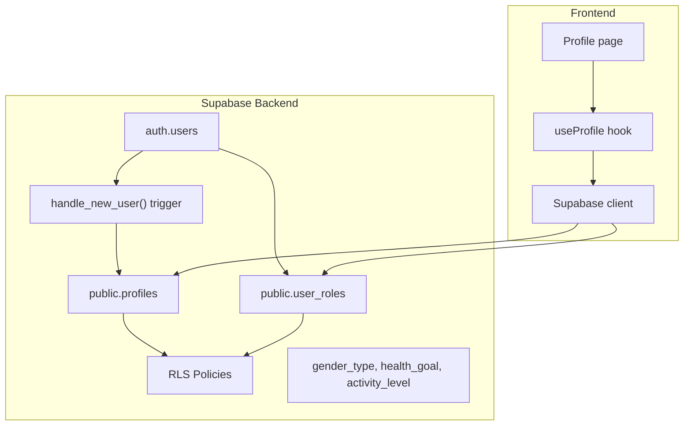
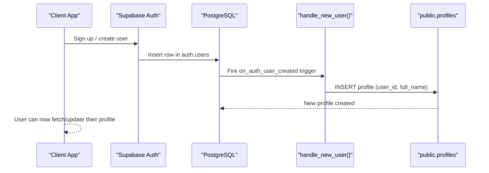
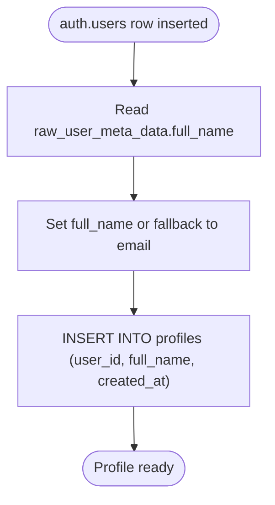
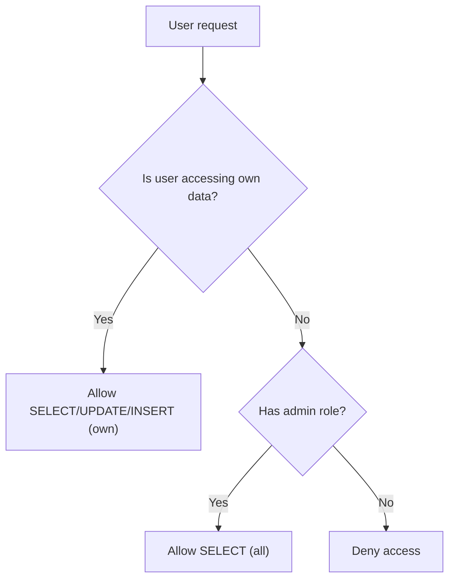
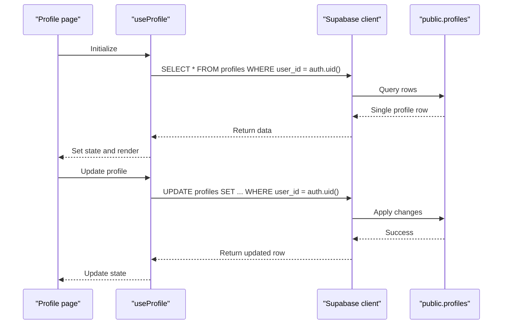
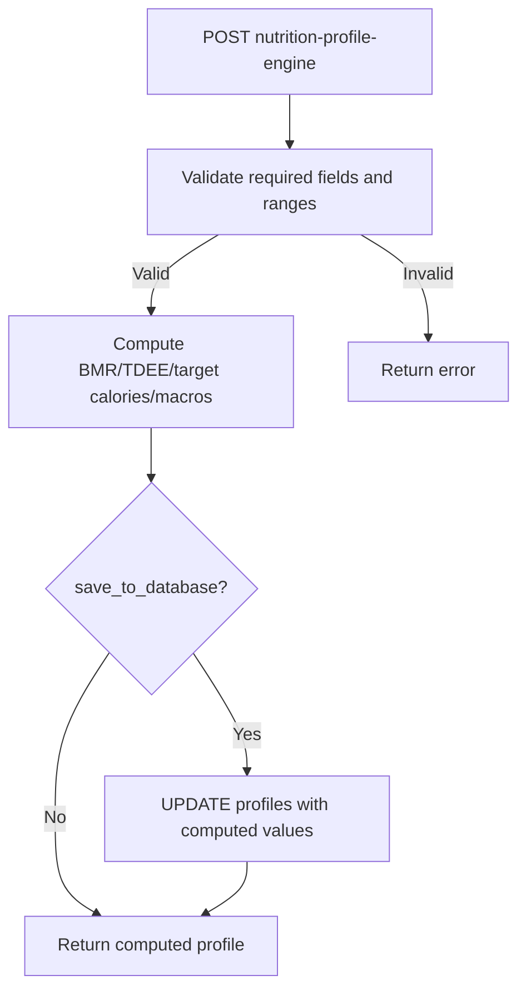
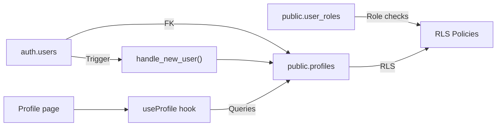

# Users & Profiles

<cite>
**Referenced Files in This Document**
- [create_essential_tables.sql](file://supabase/migrations/20250220000000_create_essential_tables.sql)
- [create_profile_trigger.sql](file://supabase/migrations/20250220000007_create_profile_trigger.sql)
- [update_updated_at_column.sql](file://supabase/migrations/20260105045257_24cbd0a5-185b-43dd-aed9-d1ae7379e6b0.sql)
- [types.ts](file://supabase/types.ts)
- [types.ts](file://src/integrations/supabase/types.ts)
- [useProfile.ts](file://src/hooks/useProfile.ts)
- [Profile.tsx](file://src/pages/Profile.tsx)
- [nutrition-profile-engine/index.ts](file://supabase/functions/nutrition-profile-engine/index.ts)
</cite>

## Table of Contents
1. [Introduction](#introduction)
2. [Project Structure](#project-structure)
3. [Core Components](#core-components)
4. [Architecture Overview](#architecture-overview)
5. [Detailed Component Analysis](#detailed-component-analysis)
6. [Dependency Analysis](#dependency-analysis)
7. [Performance Considerations](#performance-considerations)
8. [Troubleshooting Guide](#troubleshooting-guide)
9. [Conclusion](#conclusion)

## Introduction
This document explains the Users and Profiles entity system in Nutrio. It details how Supabase auth.users integrates with the custom profiles table, how user accounts automatically create linked profiles, and how row-level security policies protect profile data. It also documents all profile fields, validation constraints, and integration patterns with the authentication system.

## Project Structure
The Users and Profiles system spans Supabase database migrations and functions, plus frontend hooks and pages that consume the Supabase client.

**Diagram sources**
- [create_essential_tables.sql:137-179](file://supabase/migrations/20250220000000_create_essential_tables.sql#L137-L179)
- [create_profile_trigger.sql:6-26](file://supabase/migrations/20250220000007_create_profile_trigger.sql#L6-L26)
- [update_updated_at_column.sql:273-284](file://supabase/migrations/20260105045257_24cbd0a5-185b-43dd-aed9-d1ae7379e6b0.sql#L273-L284)
- [useProfile.ts:33-87](file://src/hooks/useProfile.ts#L33-L87)

**Section sources**
- [create_essential_tables.sql:137-179](file://supabase/migrations/20250220000000_create_essential_tables.sql#L137-L179)
- [create_profile_trigger.sql:6-26](file://supabase/migrations/20250220000007_create_profile_trigger.sql#L6-L26)
- [useProfile.ts:33-87](file://src/hooks/useProfile.ts#L33-L87)

## Core Components
- Supabase auth.users: Central identity table managed by Supabase Auth.
- public.profiles: Custom table storing user-specific health and nutrition data, linked via user_id.
- public.user_roles: Stores user roles separate from profiles for security.
- handle_new_user trigger: Automatically creates a profile row when a new auth.users row is inserted.
- Row-level security (RLS) policies: Enforce access control for profiles and user_roles.
- Supabase enums: gender_type, health_goal, activity_level define allowed values.
- Frontend useProfile hook: Fetches and updates profile data for the authenticated user.

**Section sources**
- [create_essential_tables.sql:49-74](file://supabase/migrations/20250220000000_create_essential_tables.sql#L49-L74)
- [create_essential_tables.sql:137-179](file://supabase/migrations/20250220000000_create_essential_tables.sql#L137-L179)
- [create_profile_trigger.sql:6-26](file://supabase/migrations/20250220000007_create_profile_trigger.sql#L6-L26)
- [update_updated_at_column.sql:273-284](file://supabase/migrations/20260105045257_24cbd0a5-185b-43dd-aed9-d1ae7379e6b0.sql#L273-L284)
- [useProfile.ts:5-31](file://src/hooks/useProfile.ts#L5-L31)

## Architecture Overview
The system ensures that every new user gets a profile automatically and that access to profile data is restricted to the owning user or administrators.

**Diagram sources**
- [create_profile_trigger.sql:6-26](file://supabase/migrations/20250220000007_create_profile_trigger.sql#L6-L26)
- [create_essential_tables.sql:246-270](file://supabase/migrations/20250220000000_create_essential_tables.sql#L246-L270)

## Detailed Component Analysis

### Profiles Table Schema and Fields
The profiles table stores both personal and health-related data, with constraints and defaults ensuring data integrity.

Key fields:
- Identity: id, user_id (references auth.users)
- Personal: full_name, avatar_url
- Demographics: gender (enum), age (integer with range check)
- Physical metrics: height_cm, current_weight_kg, target_weight_kg (numeric with range checks)
- Health goals: health_goal (enum), activity_level (enum)
- Nutrition targets: daily_calorie_target, protein_target_g, carbs_target_g, fat_target_g
- Lifecycle: onboarding_completed (boolean), created_at, updated_at
- Security: RLS enabled

Constraints and defaults:
- Unique constraint on user_id
- Enum types for gender, health_goal, activity_level
- Numeric range checks for height, weights
- Default timestamps and onboarding flag

**Section sources**
- [create_essential_tables.sql:137-157](file://supabase/migrations/20250220000000_create_essential_tables.sql#L137-L157)
- [types.ts:15-3331](file://supabase/types.ts#L15-L3331)
- [types.ts:9-9248](file://src/integrations/supabase/types.ts#L9-L9248)

### Automatic Profile Creation Trigger
When a new row is inserted into auth.users, the trigger function inserts a corresponding profile row. It sets user_id and full_name (using raw_user_meta_data if present) and copies created_at.

**Diagram sources**
- [create_profile_trigger.sql:9-14](file://supabase/migrations/20250220000007_create_profile_trigger.sql#L9-L14)

**Section sources**
- [create_profile_trigger.sql:6-26](file://supabase/migrations/20250220000007_create_profile_trigger.sql#L6-L26)
- [create_essential_tables.sql:246-270](file://supabase/migrations/20250220000000_create_essential_tables.sql#L246-L270)

### Row-Level Security Policies
Profiles:
- Users can view/update their own profile (based on user_id matching auth.uid())
- Users can insert their own profile (with check clause)
- Admins can view all profiles (via has_role check)

User Roles:
- Users can view their own roles
- Admins can view and manage all roles

**Diagram sources**
- [create_essential_tables.sql:167-178](file://supabase/migrations/20250220000000_create_essential_tables.sql#L167-L178)
- [update_updated_at_column.sql:273-284](file://supabase/migrations/20260105045257_24cbd0a5-185b-43dd-aed9-d1ae7379e6b0.sql#L273-L284)

**Section sources**
- [create_essential_tables.sql:161-178](file://supabase/migrations/20250220000000_create_essential_tables.sql#L161-L178)
- [update_updated_at_column.sql:263-284](file://supabase/migrations/20260105045257_24cbd0a5-185b-43dd-aed9-d1ae7379e6b0.sql#L263-L284)

### Validation Constraints
- Age: integer with minimum and maximum bounds
- Height: numeric with positive lower bound and realistic upper bound
- Current and target weight: numeric with positive lower bound and realistic upper bound
- Activity level and health goal: enum types enforced at DB level
- Timestamps: updated_at triggers on updates

**Section sources**
- [create_essential_tables.sql:144-156](file://supabase/migrations/20250220000000_create_essential_tables.sql#L144-L156)
- [update_updated_at_column.sql:407-418](file://supabase/migrations/20260105045257_24cbd0a5-185b-43dd-aed9-d1ae7379e6b0.sql#L407-L418)

### Frontend Integration Patterns
- useProfile hook: fetches and updates the authenticated user’s profile using the Supabase client.
- Profile page: displays and edits profile fields, integrating with translation keys and UI components.

**Diagram sources**
- [useProfile.ts:39-80](file://src/hooks/useProfile.ts#L39-L80)

**Section sources**
- [useProfile.ts:5-31](file://src/hooks/useProfile.ts#L5-L31)
- [useProfile.ts:39-80](file://src/hooks/useProfile.ts#L39-L80)
- [Profile.tsx:245-265](file://src/pages/Profile.tsx#L245-L265)

### Nutrition Profile Engine Integration
The nutrition-profile-engine function calculates personalized nutrition targets from biometric inputs and optionally saves them to the profiles table. It validates inputs and applies constraints before computing BMR, TDEE, and macronutrient targets.

**Diagram sources**
- [nutrition-profile-engine/index.ts:215-289](file://supabase/functions/nutrition-profile-engine/index.ts#L215-L289)

**Section sources**
- [nutrition-profile-engine/index.ts:13-45](file://supabase/functions/nutrition-profile-engine/index.ts#L13-L45)
- [nutrition-profile-engine/index.ts:215-289](file://supabase/functions/nutrition-profile-engine/index.ts#L215-L289)

## Dependency Analysis
- auth.users depends on Supabase Auth for identity.
- profiles.user_id references auth.users.id with ON DELETE CASCADE.
- handle_new_user trigger depends on auth.users insert events.
- RLS policies depend on has_role function and auth.uid().
- Frontend depends on Supabase client for queries and mutations.

**Diagram sources**
- [create_essential_tables.sql:137-179](file://supabase/migrations/20250220000000_create_essential_tables.sql#L137-L179)
- [create_profile_trigger.sql:6-26](file://supabase/migrations/20250220000007_create_profile_trigger.sql#L6-L26)
- [useProfile.ts:39-80](file://src/hooks/useProfile.ts#L39-L80)

**Section sources**
- [create_essential_tables.sql:137-179](file://supabase/migrations/20250220000000_create_essential_tables.sql#L137-L179)
- [create_profile_trigger.sql:6-26](file://supabase/migrations/20250220000007_create_profile_trigger.sql#L6-L26)
- [useProfile.ts:39-80](file://src/hooks/useProfile.ts#L39-L80)

## Performance Considerations
- Triggers and RLS add minimal overhead; ensure indexes exist on frequently filtered columns (e.g., user_id).
- Batch operations should leverage Supabase client’s optimized APIs.
- Consider caching profile reads on the client for repeated navigation.

## Troubleshooting Guide
Common issues and resolutions:
- Profile not found after signup: Verify the trigger executed and that auth.uid() matches user_id.
- Access denied errors: Confirm the user has the correct role and that RLS policies are applied.
- Validation failures: Ensure inputs meet enum and range constraints before updating profiles.
- Unexpected nulls: Confirm raw_user_meta_data contains expected fields during sign-up.

**Section sources**
- [create_profile_trigger.sql:6-26](file://supabase/migrations/20250220000007_create_profile_trigger.sql#L6-L26)
- [create_essential_tables.sql:161-178](file://supabase/migrations/20250220000000_create_essential_tables.sql#L161-L178)
- [useProfile.ts:39-80](file://src/hooks/useProfile.ts#L39-L80)

## Conclusion
Nutrio’s Users and Profiles system cleanly links Supabase Auth identities to custom profiles, enforces strict access control via RLS, and provides robust validation. The automatic trigger ensures every user has a profile upon account creation, while the frontend integration via useProfile enables seamless profile management.