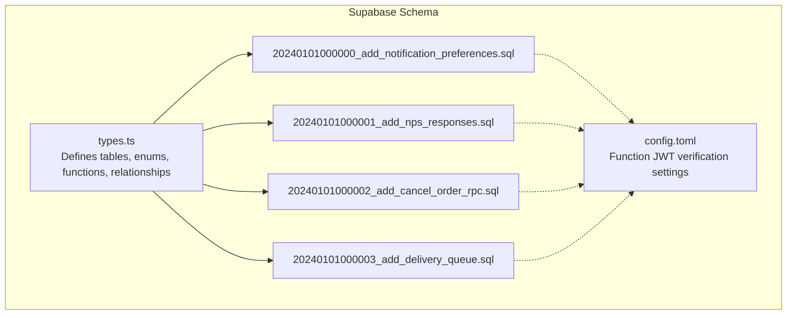
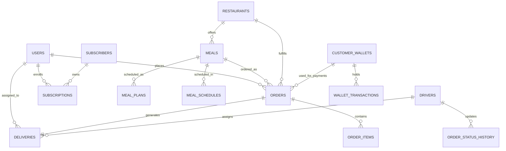
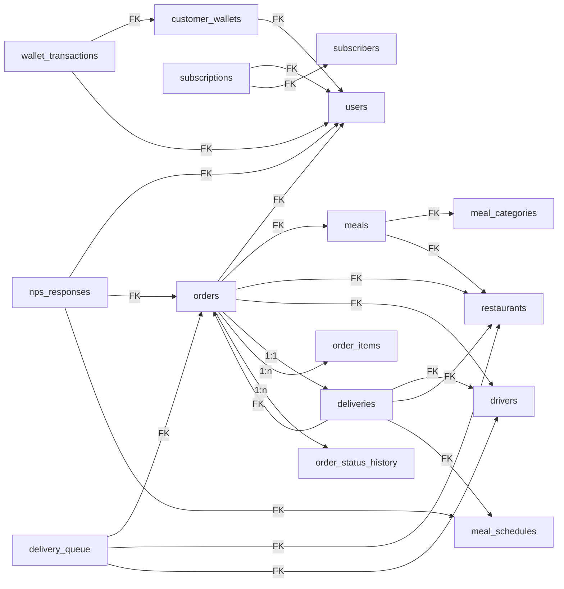
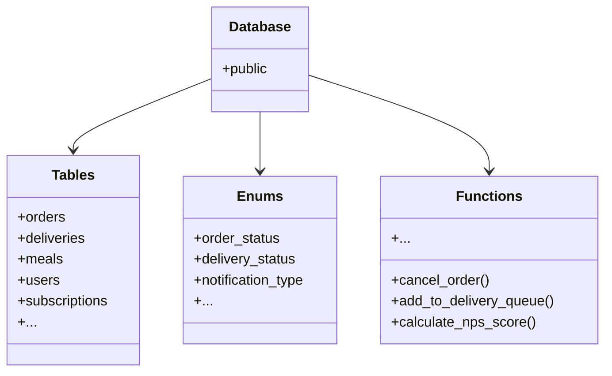

# Data Models & Database Schema

<cite>
**Referenced Files in This Document**
- [types.ts](file://supabase/types.ts)
- [20240101000000_add_notification_preferences.sql](file://supabase/migrations/20240101000000_add_notification_preferences.sql)
- [20240101000001_add_nps_responses.sql](file://supabase/migrations/20240101000001_add_nps_responses.sql)
- [20240101000002_add_cancel_order_rpc.sql](file://supabase/migrations/20240101000002_add_cancel_order_rpc.sql)
- [20240101000003_add_delivery_queue.sql](file://supabase/migrations/20240101000003_add_delivery_queue.sql)
- [config.toml](file://supabase/config.toml)
</cite>

## Table of Contents
1. [Introduction](#introduction)
2. [Project Structure](#project-structure)
3. [Core Components](#core-components)
4. [Architecture Overview](#architecture-overview)
5. [Detailed Component Analysis](#detailed-component-analysis)
6. [Dependency Analysis](#dependency-analysis)
7. [Performance Considerations](#performance-considerations)
8. [Troubleshooting Guide](#troubleshooting-guide)
9. [Conclusion](#conclusion)
10. [Appendices](#appendices)

## Introduction
This document provides comprehensive data model documentation for Nutrio’s Supabase-backed database schema. It focuses on the core entities involved in the customer experience: users, meals, orders, deliveries, and subscription management. It also covers supporting tables for notifications, NPS feedback, cancellation auditing, and delivery queue orchestration. The document explains field definitions, data types, constraints, primary and foreign keys, indexing strategies, row-level security (RLS) policies, access control, validation rules, and business logic embedded in the schema. It includes schema diagrams, sample data structures, and guidance on data lifecycle, soft deletes, archival, and migration management.

## Project Structure
The database schema is defined via:
- A TypeScript types file that enumerates all tables, views, enums, functions, and relationships.
- A set of SQL migrations that evolve the schema over time, adding tables, indexes, RLS policies, and stored procedures/functions.

**Diagram sources**
- [types.ts:9-3167](file://supabase/types.ts#L9-L3167)
- [20240101000000_add_notification_preferences.sql:1-170](file://supabase/migrations/20240101000000_add_notification_preferences.sql#L1-L170)
- [20240101000001_add_nps_responses.sql:1-234](file://supabase/migrations/20240101000001_add_nps_responses.sql#L1-L234)
- [20240101000002_add_cancel_order_rpc.sql:1-393](file://supabase/migrations/20240101000002_add_cancel_order_rpc.sql#L1-L393)
- [20240101000003_add_delivery_queue.sql:1-595](file://supabase/migrations/20240101000003_add_delivery_queue.sql#L1-L595)
- [config.toml:1-59](file://supabase/config.toml#L1-L59)

**Section sources**
- [types.ts:9-3167](file://supabase/types.ts#L9-L3167)
- [20240101000000_add_notification_preferences.sql:1-170](file://supabase/migrations/20240101000000_add_notification_preferences.sql#L1-L170)
- [20240101000001_add_nps_responses.sql:1-234](file://supabase/migrations/20240101000001_add_nps_responses.sql#L1-L234)
- [20240101000002_add_cancel_order_rpc.sql:1-393](file://supabase/migrations/20240101000002_add_cancel_order_rpc.sql#L1-L393)
- [20240101000003_add_delivery_queue.sql:1-595](file://supabase/migrations/20240101000003_add_delivery_queue.sql#L1-L595)
- [config.toml:1-59](file://supabase/config.toml#L1-L59)

## Core Components
This section outlines the primary entities and their roles in the system.

- Users
  - Core identity table for application users.
  - Fields: identifiers, contact info, timestamps.
  - Relationships: referenced by many other tables (profiles, orders, drivers, etc.).

- Meals
  - Catalog of available meals with nutritional info and pricing.
  - Relationships: meals belong to categories and restaurants.

- Orders
  - Customer order records with status, timing, and financial details.
  - Relationships: linked to users, meals, restaurants, drivers, and delivery records.

- Deliveries
  - Delivery lifecycle tracking with driver assignments and statuses.
  - Relationships: linked to orders, drivers, restaurants, and meal schedules.

- Subscriptions
  - Subscription plans and enrollment for users.
  - Relationships: linked to users and subscribers.

- Supporting Entities
  - Notifications, NPS responses, cancellation logs, delivery queue, and wallet transactions.

**Section sources**
- [types.ts:1395-1459](file://supabase/types.ts#L1395-L1459)
- [types.ts:1697-1789](file://supabase/types.ts#L1697-L1789)
- [types.ts:230-330](file://supabase/types.ts#L230-L330)
- [types.ts:2532-2584](file://supabase/types.ts#L2532-L2584)
- [types.ts:1460-1521](file://supabase/types.ts#L1460-L1521)
- [types.ts:1-3167](file://supabase/types.ts#L1-L3167)

## Architecture Overview
The schema follows a normalized relational design with explicit foreign keys and strong referential integrity. Row-level security policies enforce tenant isolation and role-based access. Stored procedures and functions encapsulate complex business logic such as order cancellation, delivery queue assignment, and NPS analytics.

**Diagram sources**
- [types.ts:1395-1459](file://supabase/types.ts#L1395-L1459)
- [types.ts:1697-1789](file://supabase/types.ts#L1697-L1789)
- [types.ts:230-330](file://supabase/types.ts#L230-L330)
- [types.ts:2532-2584](file://supabase/types.ts#L2532-L2584)
- [types.ts:197-229](file://supabase/types.ts#L197-L229)
- [types.ts:2805-2831](file://supabase/types.ts#L2805-L2831)

## Detailed Component Analysis

### Users
- Purpose: Application identity and basic contact info.
- Key fields: id (PK), email, full_name, phone, created_at.
- Constraints: Unique identifiers enforced by auth; minimal constraints here.
- Access control: Used throughout for RLS policies; no RLS applied directly on users in the referenced migrations.

**Section sources**
- [types.ts:2805-2831](file://supabase/types.ts#L2805-L2831)
- [20240101000000_add_notification_preferences.sql:65-98](file://supabase/migrations/20240101000000_add_notification_preferences.sql#L65-L98)

### Meals
- Purpose: Menu catalog with nutritional attributes and pricing.
- Key fields: id (PK), name, description, price, category_id (FK), restaurant_id (FK), availability flags, images, macros.
- Constraints: Category and restaurant foreign keys; optional nutrition fields.
- Indexing: None explicitly defined in the referenced migrations; rely on PK and FK indexes.

**Section sources**
- [types.ts:1395-1459](file://supabase/types.ts#L1395-L1459)

### Orders
- Purpose: Tracks customer orders from placement to completion.
- Key fields: id (PK), user_id (FK), meal_id (FK), restaurant_id (FK), driver_id (FK), status, amounts, timing fields, delivery info.
- Constraints: Status enum; monetary fields as numeric; timestamps.
- Relationships: FKs to users, meals, restaurants, drivers; linked to order_items and order_status_history.

**Section sources**
- [types.ts:1697-1789](file://supabase/types.ts#L1697-L1789)
- [types.ts:1614-1651](file://supabase/types.ts#L1614-L1651)
- [types.ts:1652-1696](file://supabase/types.ts#L1652-L1696)

### Deliveries
- Purpose: Delivery lifecycle and driver assignment tracking.
- Key fields: id (PK), order_id (FK), driver_id (FK), restaurant_id (FK), schedule_id (FK), status enum, addresses, timing, fees, tips.
- Constraints: Status enum; geolocation coordinates; foreign keys to related entities.

**Section sources**
- [types.ts:230-330](file://supabase/types.ts#L230-L330)

### Subscriptions and Subscribers
- Purpose: Manage subscription plans and user enrollments.
- Subscribers: Stripe identifiers, subscription metadata, status flags.
- Subscriptions: Plan details, dates, FKs to users and subscribers.

**Section sources**
- [types.ts:2493-2531](file://supabase/types.ts#L2493-L2531)
- [types.ts:2532-2584](file://supabase/types.ts#L2532-L2584)

### Notifications
- Purpose: Store notification events with scheduling and status.
- Fields: title, message, type, status, user_id (FK), related entity references, timestamps.
- Enums: notification_type, notification_status.

**Section sources**
- [types.ts:1558-1613](file://supabase/types.ts#L1558-L1613)

### NPS Responses
- Purpose: Capture Net Promoter Score feedback with categorization and follow-up tracking.
- Fields: score (0–10), feedback_text, category (computed), survey trigger, timestamps, admin flags, metadata.
- Indexes: composite and filtered indexes for analytics and filtering.
- RLS: Users can view/update their own responses; admins can manage all.

**Section sources**
- [20240101000001_add_nps_responses.sql:1-234](file://supabase/migrations/20240101000001_add_nps_responses.sql#L1-L234)
- [types.ts:1-3167](file://supabase/types.ts#L1-L3167)

### Delivery Queue
- Purpose: Orchestrate driver assignment with priority scoring and expiration.
- Fields: order_id (unique FK), restaurant_id (FK), status enum, driver assignment tracking, priority score, timing, escalation fields.
- Functions: Add to queue, assign driver, accept/decline, manual escalation, priority calculation, and retrieval of available deliveries.

**Section sources**
- [20240101000003_add_delivery_queue.sql:1-595](file://supabase/migrations/20240101000003_add_delivery_queue.sql#L1-L595)
- [types.ts:1-3167](file://supabase/types.ts#L1-L3167)

### Order Cancellation RPC
- Purpose: Atomic cancellation with refund, quota restoration, audit logging, and status history updates.
- Inputs: order_id, reason, reason_category, cancelled_by_role.
- Outputs: structured JSON with results and side effects.
- Functions: can_cancel_order, get_cancellation_stats.

**Section sources**
- [20240101000002_add_cancel_order_rpc.sql:1-393](file://supabase/migrations/20240101000002_add_cancel_order_rpc.sql#L1-L393)
- [types.ts:1-3167](file://supabase/types.ts#L1-L3167)

### Wallet and Transactions
- Customer wallets track balances and credits/debits.
- Wallet transactions record funding, refunds, and other movements with references.

**Section sources**
- [types.ts:197-229](file://supabase/types.ts#L197-L229)
- [types.ts:2871-2920](file://supabase/types.ts#L2871-L2920)

### Push Tokens and Notification Preferences
- Push tokens table stores device tokens with platform and device info; RLS policies restrict access to owners and service role.
- Profiles gain a JSONB notification_preferences field with GIN index for efficient querying.

**Section sources**
- [20240101000000_add_notification_preferences.sql:1-170](file://supabase/migrations/20240101000000_add_notification_preferences.sql#L1-L170)
- [types.ts:1460-1521](file://supabase/types.ts#L1460-L1521)

## Dependency Analysis
This section maps foreign key dependencies among core entities and highlights how business logic functions depend on these relationships.

**Diagram sources**
- [types.ts:1-3167](file://supabase/types.ts#L1-L3167)

**Section sources**
- [types.ts:1-3167](file://supabase/types.ts#L1-L3167)

## Performance Considerations
- Indexing
  - GIN index on profiles.notification_preferences for JSONB filtering.
  - Composite and filtered indexes on nps_responses for analytics and feature flags.
  - Priority and location-aware indexes on delivery_queue for driver matching and SLA tracking.
  - Status-based partial indexes on delivery_queue for waiting/assigned/expired states.
- Triggers
  - Generic updated_at triggers on tables to maintain audit trails consistently.
- Enums
  - Status enums constrain values and enable efficient filtering and UI mapping.
- JSONB fields
  - Metadata and preferences stored as JSONB; use targeted indexes for hot filter keys.

**Section sources**
- [20240101000000_add_notification_preferences.sql:37-62](file://supabase/migrations/20240101000000_add_notification_preferences.sql#L37-L62)
- [20240101000001_add_nps_responses.sql:51-72](file://supabase/migrations/20240101000001_add_nps_responses.sql#L51-L72)
- [20240101000003_add_delivery_queue.sql:63-94](file://supabase/migrations/20240101000003_add_delivery_queue.sql#L63-L94)

## Troubleshooting Guide
- Order Cancellation Failures
  - Validate order status and role eligibility; ensure the RPC runs within transaction boundaries.
  - Check refund amount calculations and wallet transaction linkage.
- Delivery Queue Issues
  - Confirm queue status transitions and driver assignment constraints; verify expiration logic and priority scoring.
- Notification Preferences
  - Ensure GIN index usage for JSONB queries; verify push token ownership and platform filters.
- NPS Analytics
  - Use provided helper functions to compute scores and trends; confirm indexes support date-range filtering.

**Section sources**
- [20240101000002_add_cancel_order_rpc.sql:64-267](file://supabase/migrations/20240101000002_add_cancel_order_rpc.sql#L64-L267)
- [20240101000003_add_delivery_queue.sql:148-524](file://supabase/migrations/20240101000003_add_delivery_queue.sql#L148-L524)
- [20240101000001_add_nps_responses.sql:116-214](file://supabase/migrations/20240101000001_add_nps_responses.sql#L116-L214)

## Conclusion
Nutrio’s database schema is designed around clear entity relationships, robust constraints, and role-based access control. The schema supports the full order-to-delivery lifecycle, subscription management, and customer engagement through notifications and NPS feedback. Business logic is encapsulated in stored procedures and functions to ensure consistency and auditability. Proper indexing and RLS policies underpin performance and security.

## Appendices

### Data Lifecycle
- Creation: Rows are inserted via application logic or migrations; triggers set created_at/updated_at.
- Updates: Standard updates; some entities use helper functions to maintain consistency (e.g., delivery queue state transitions).
- Soft Deletes: Not observed in the referenced migrations; deletion appears to be hard-delete where applicable.
- Archival: Delivery queue and cancellation logs serve as audit trails; consider partitioning or retention policies for large datasets.

**Section sources**
- [20240101000003_add_delivery_queue.sql:581-585](file://supabase/migrations/20240101000003_add_delivery_queue.sql#L581-L585)
- [20240101000002_add_cancel_order_rpc.sql:219-223](file://supabase/migrations/20240101000002_add_cancel_order_rpc.sql#L219-L223)

### Migration Management and Version Control
- Migrations are named with timestamps and semantic descriptions; each adds tables, indexes, RLS policies, and helper functions.
- Use a migration runner to apply changes in order; treat each migration as immutable.
- Backups: Export schema and data regularly; leverage Supabase’s managed backup features.

**Section sources**
- [20240101000000_add_notification_preferences.sql:1-170](file://supabase/migrations/20240101000000_add_notification_preferences.sql#L1-L170)
- [20240101000001_add_nps_responses.sql:1-234](file://supabase/migrations/20240101000001_add_nps_responses.sql#L1-L234)
- [20240101000002_add_cancel_order_rpc.sql:1-393](file://supabase/migrations/20240101000002_add_cancel_order_rpc.sql#L1-L393)
- [20240101000003_add_delivery_queue.sql:1-595](file://supabase/migrations/20240101000003_add_delivery_queue.sql#L1-L595)

### TypeScript Type Generation and Type Safety
- The types.ts file defines strongly-typed tables, enums, functions, and relationships for TypeScript clients.
- Use generated types for inserts, updates, and function arguments to enforce type safety.
- Enums are exported for consistent UI and business logic usage.

**Diagram sources**
- [types.ts:9-3167](file://supabase/types.ts#L9-L3167)

**Section sources**
- [types.ts:9-3167](file://supabase/types.ts#L9-L3167)

### Access Control and Row-Level Security
- RLS policies are enabled on sensitive tables (e.g., push_tokens, nps_responses, delivery_queue).
- Policies grant:
  - Ownership-based access for users to their own rows.
  - Administrative oversight for staff/admins.
  - Service role access for automation and background jobs.
- JWT verification settings for selected functions are configured in config.toml.

**Section sources**
- [20240101000000_add_notification_preferences.sql:65-98](file://supabase/migrations/20240101000000_add_notification_preferences.sql#L65-L98)
- [20240101000001_add_nps_responses.sql:74-111](file://supabase/migrations/20240101000001_add_nps_responses.sql#L74-L111)
- [20240101000003_add_delivery_queue.sql:96-143](file://supabase/migrations/20240101000003_add_delivery_queue.sql#L96-L143)
- [config.toml:1-59](file://supabase/config.toml#L1-L59)

### Sample Data Structures
Below are representative row structures for key entities. Replace placeholders with actual values during inserts.

- Orders
  - Fields: id, user_id, meal_id, restaurant_id, driver_id, status, total_amount, delivery_* fields, timestamps.
- Deliveries
  - Fields: id, order_id, driver_id, restaurant_id, schedule_id, status, delivery_address, estimated_delivery_time, fees, tips, timestamps.
- Meals
  - Fields: id, name, description, price, category_id, restaurant_id, availability flags, nutrition fields.
- Subscriptions
  - Fields: id, user_id, subscriber_id, plan_type, price, start_date, end_date, active flag.
- NPS Responses
  - Fields: id, user_id, order_id, meal_schedule_id, score (0–10), feedback_text, category (computed), timestamps, admin flags.

**Section sources**
- [types.ts:1697-1789](file://supabase/types.ts#L1697-L1789)
- [types.ts:230-330](file://supabase/types.ts#L230-L330)
- [types.ts:1395-1459](file://supabase/types.ts#L1395-L1459)
- [types.ts:2532-2584](file://supabase/types.ts#L2532-L2584)
- [20240101000001_add_nps_responses.sql:9-49](file://supabase/migrations/20240101000001_add_nps_responses.sql#L9-L49)