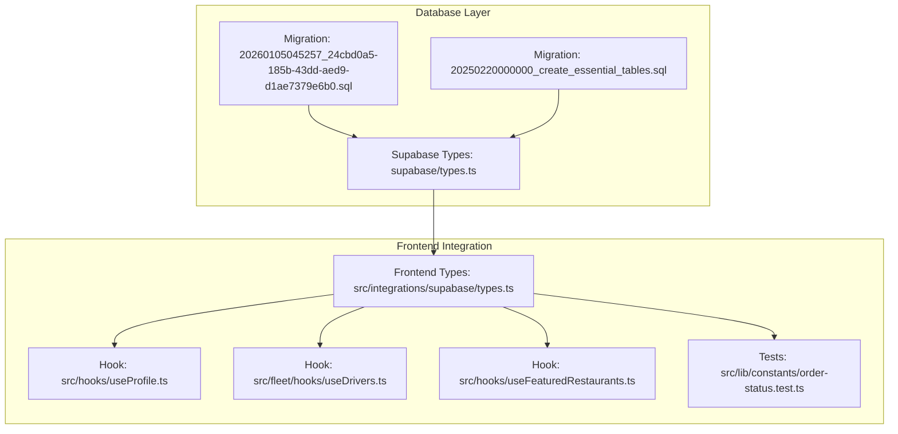
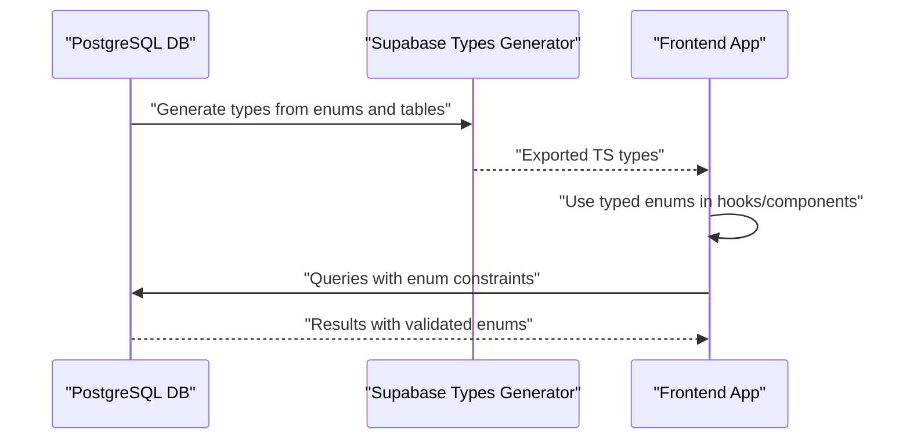
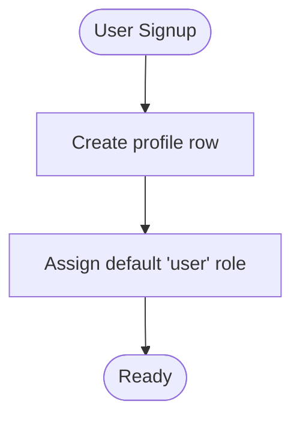
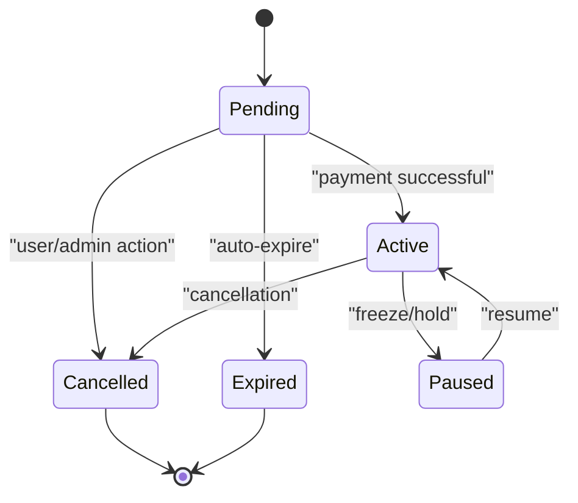
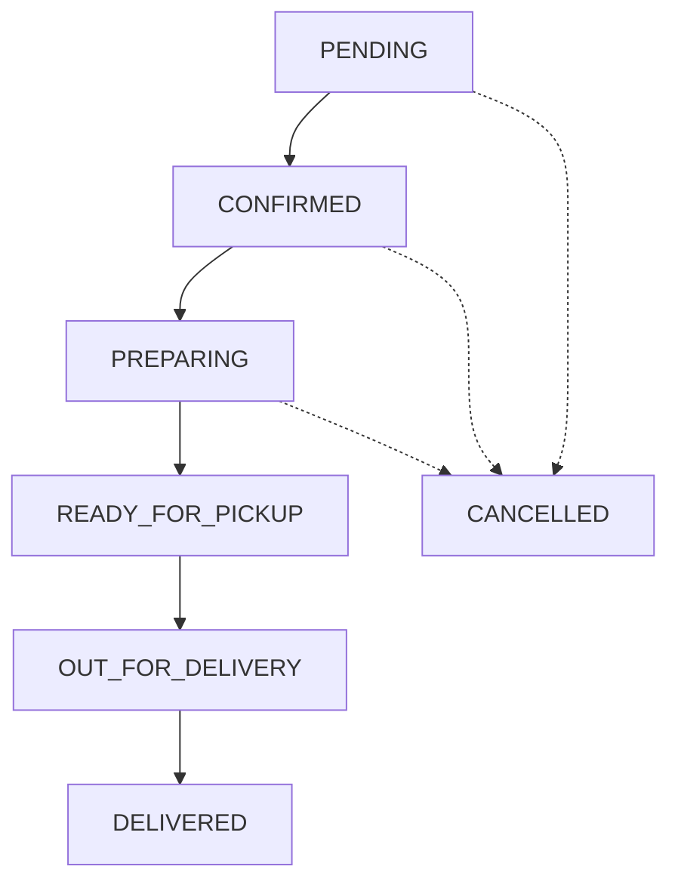
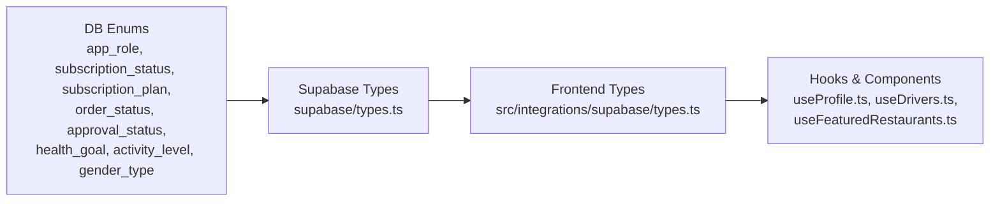

# Data Types & Enums

<cite>
**Referenced Files in This Document**
- [20260105045257_24cbd0a5-185b-43dd-aed9-d1ae7379e6b0.sql](file://supabase/migrations/20260105045257_24cbd0a5-185b-43dd-aed9-d1ae7379e6b0.sql)
- [20250220000000_create_essential_tables.sql](file://supabase/migrations/20250220000000_create_essential_tables.sql)
- [types.ts](file://supabase/types.ts)
- [types.ts](file://src/integrations/supabase/types.ts)
- [order-status.test.ts](file://src/lib/constants/order-status.test.ts)
- [useProfile.ts](file://src/hooks/useProfile.ts)
- [useDrivers.ts](file://src/fleet/hooks/useDrivers.ts)
- [useFeaturedRestaurants.ts](file://src/hooks/useFeaturedRestaurants.ts)
- [2025-02-23-retention-system-design.md](file://docs/plans/2025-02-23-retention-system-design.md)
- [20260222170000_test_order_workflow.sql](file://supabase/migrations/20260222170000_test_order_workflow.sql)
- [CREATE_TABLES_SQL.md](file://CREATE_TABLES_SQL.md)
</cite>

## Table of Contents
1. [Introduction](#introduction)
2. [Project Structure](#project-structure)
3. [Core Components](#core-components)
4. [Architecture Overview](#architecture-overview)
5. [Detailed Component Analysis](#detailed-component-analysis)
6. [Dependency Analysis](#dependency-analysis)
7. [Performance Considerations](#performance-considerations)
8. [Troubleshooting Guide](#troubleshooting-guide)
9. [Conclusion](#conclusion)

## Introduction
This document provides comprehensive documentation for Nutrio’s custom data types and enumerated values used across the database schema. It covers the purpose, validation rules, and business logic constraints for each enum, along with TypeScript type generation and frontend integration patterns. The enums documented here include:
- app_role
- subscription_status
- subscription_plan
- order_status
- approval_status
- health_goal
- activity_level
- gender_type

## Project Structure
The enum definitions originate from Supabase database migrations and are reflected in generated TypeScript types for frontend consumption. The relevant files are:
- Database enum creation and table definitions in migration files
- Supabase-generated TypeScript types for backend and frontend
- Frontend usage in hooks and components

**Diagram sources**
- [20260105045257_24cbd0a5-185b-43dd-aed9-d1ae7379e6b0.sql:1-476](file://supabase/migrations/20260105045257_24cbd0a5-185b-43dd-aed9-d1ae7379e6b0.sql#L1-L476)
- [20250220000000_create_essential_tables.sql:1-270](file://supabase/migrations/20250220000000_create_essential_tables.sql#L1-L270)
- [types.ts:3280-3331](file://supabase/types.ts#L3280-L3331)
- [types.ts:9170-9194](file://src/integrations/supabase/types.ts#L9170-L9194)
- [useProfile.ts:14-15](file://src/hooks/useProfile.ts#L14-L15)
- [useDrivers.ts](file://src/fleet/hooks/useDrivers.ts#L31)
- [useFeaturedRestaurants.ts](file://src/hooks/useFeaturedRestaurants.ts#L65)
- [order-status.test.ts:1-249](file://src/lib/constants/order-status.test.ts#L1-L249)

**Section sources**
- [20260105045257_24cbd0a5-185b-43dd-aed9-d1ae7379e6b0.sql:1-476](file://supabase/migrations/20260105045257_24cbd0a5-185b-43dd-aed9-d1ae7379e6b0.sql#L1-L476)
- [20250220000000_create_essential_tables.sql:1-270](file://supabase/migrations/20250220000000_create_essential_tables.sql#L1-L270)
- [types.ts:3280-3331](file://supabase/types.ts#L3280-L3331)
- [types.ts:9170-9194](file://src/integrations/supabase/types.ts#L9170-L9194)
- [useProfile.ts:14-15](file://src/hooks/useProfile.ts#L14-L15)
- [useDrivers.ts](file://src/fleet/hooks/useDrivers.ts#L31)
- [useFeaturedRestaurants.ts](file://src/hooks/useFeaturedRestaurants.ts#L65)
- [order-status.test.ts:1-249](file://src/lib/constants/order-status.test.ts#L1-L249)

## Core Components
This section documents each enum type, its purpose, validation rules, and business logic constraints, followed by frontend integration patterns.

- app_role
  - Purpose: Defines user roles across the platform (e.g., user, partner, admin).
  - Validation rules: Enum values are constrained to predefined set; default role assignment occurs during user signup.
  - Business logic constraints: Role checks are enforced via security-definer functions and row-level security policies.
  - Frontend integration: Used in role-based UI visibility and access control.

- subscription_status
  - Purpose: Tracks the lifecycle state of a subscription (active, cancelled, expired, pending).
  - Validation rules: Values are restricted to the enum set; transitions are governed by business logic.
  - Business logic constraints: Status affects eligibility for features like freezing and renewal.
  - Frontend integration: Used to render subscription state and enable/disable actions.

- subscription_plan
  - Purpose: Indicates billing cadence (weekly, monthly).
  - Validation rules: Values are restricted to the enum set.
  - Business logic constraints: Determines pricing and billing cycle boundaries.
  - Frontend integration: Used to present plan options and calculate billing intervals.

- order_status
  - Purpose: Represents the lifecycle of an order (pending, confirmed, preparing, ready for pickup/out for delivery, delivered, cancelled).
  - Validation rules: Values are restricted to the enum set; a separate migration validates status constraints and rejects invalid transitions.
  - Business logic constraints: Defines the order timeline and visibility rules for customers; cancelled is excluded from the timeline.
  - Frontend integration: Used to render order progress, status badges, and actionable UI states.

- approval_status
  - Purpose: Approval state for restaurants and drivers (pending, approved, rejected).
  - Validation rules: Values are restricted to the enum set.
  - Business logic constraints: Determines visibility and operational capabilities (e.g., driver availability).
  - Frontend integration: Used to filter and display approved entities.

- health_goal
  - Purpose: User-defined health objective (lose, gain, maintain).
  - Validation rules: Values are restricted to the enum set.
  - Business logic constraints: Influences nutrition targets and recommendations.
  - Frontend integration: Consumed by profile hooks and recommendation engines.

- activity_level
  - Purpose: Self-reported activity level (sedentary, light, moderate, active, very_active).
  - Validation rules: Values are restricted to the enum set.
  - Business logic constraints: Used to compute maintenance calories and macros.
  - Frontend integration: Consumed by profile hooks and nutrition calculators.

- gender_type
  - Purpose: Gender identity field (male, female).
  - Validation rules: Values are restricted to the enum set.
  - Business logic constraints: Supports demographic analytics and targeted content.
  - Frontend integration: Consumed by profile hooks and analytics.

**Section sources**
- [20260105045257_24cbd0a5-185b-43dd-aed9-d1ae7379e6b0.sql:1-23](file://supabase/migrations/20260105045257_24cbd0a5-185b-43dd-aed9-d1ae7379e6b0.sql#L1-L23)
- [20250220000000_create_essential_tables.sql:4-74](file://supabase/migrations/20250220000000_create_essential_tables.sql#L4-L74)
- [types.ts:3286-3330](file://supabase/types.ts#L3286-L3330)
- [types.ts:9170-9194](file://src/integrations/supabase/types.ts#L9170-L9194)
- [useProfile.ts:14-15](file://src/hooks/useProfile.ts#L14-L15)
- [useDrivers.ts](file://src/fleet/hooks/useDrivers.ts#L31)
- [useFeaturedRestaurants.ts](file://src/hooks/useFeaturedRestaurants.ts#L65)
- [order-status.test.ts:1-249](file://src/lib/constants/order-status.test.ts#L1-L249)
- [20260222170000_test_order_workflow.sql:245-255](file://supabase/migrations/20260222170000_test_order_workflow.sql#L245-L255)

## Architecture Overview
The enum architecture ensures strong typing and data integrity across the stack:
- Database enums are defined in migrations and enforced by constraints.
- Supabase generates TypeScript types for both backend and frontend.
- Frontend hooks and components consume typed enums for type-safe operations.

**Diagram sources**
- [20260105045257_24cbd0a5-185b-43dd-aed9-d1ae7379e6b0.sql:1-476](file://supabase/migrations/20260105045257_24cbd0a5-185b-43dd-aed9-d1ae7379e6b0.sql#L1-L476)
- [types.ts:3280-3331](file://supabase/types.ts#L3280-L3331)
- [types.ts:9170-9194](file://src/integrations/supabase/types.ts#L9170-L9194)

## Detailed Component Analysis

### app_role
- Definition: Enum with values user, partner, admin.
- Purpose: Centralized role management for access control.
- Validation: Default role assigned on user signup; role checks performed via security-definer functions.
- Business logic: Primary role ordering prioritizes higher privileges; RLS policies restrict access to sensitive data.

**Diagram sources**
- [20260105045257_24cbd0a5-185b-43dd-aed9-d1ae7379e6b0.sql:441-464](file://supabase/migrations/20260105045257_24cbd0a5-185b-43dd-aed9-d1ae7379e6b0.sql#L441-L464)

**Section sources**
- [20260105045257_24cbd0a5-185b-43dd-aed9-d1ae7379e6b0.sql:1-74](file://supabase/migrations/20260105045257_24cbd0a5-185b-43dd-aed9-d1ae7379e6b0.sql#L1-L74)
- [20250220000000_create_essential_tables.sql:77-120](file://supabase/migrations/20250220000000_create_essential_tables.sql#L77-L120)

### subscription_status
- Definition: Enum with values active, cancelled, expired, pending.
- Purpose: Lifecycle tracking of subscriptions.
- Validation: Enforced at the database level; business logic governs transitions and eligibility for freeze credits.

**Diagram sources**
- [2025-02-23-retention-system-design.md:52-107](file://docs/plans/2025-02-23-retention-system-design.md#L52-L107)

**Section sources**
- [20260105045257_24cbd0a5-185b-43dd-aed9-d1ae7379e6b0.sql:173-189](file://supabase/migrations/20260105045257_24cbd0a5-185b-43dd-aed9-d1ae7379e6b0.sql#L173-L189)
- [2025-02-23-retention-system-design.md:52-107](file://docs/plans/2025-02-23-retention-system-design.md#L52-L107)

### subscription_plan
- Definition: Enum with values weekly, monthly.
- Purpose: Determines billing interval and pricing model.
- Validation: Enforced at the database level; used to derive billing cycles and renewal logic.

**Section sources**
- [20260105045257_24cbd0a5-185b-43dd-aed9-d1ae7379e6b0.sql:173-189](file://supabase/migrations/20260105045257_24cbd0a5-185b-43dd-aed9-d1ae7379e6b0.sql#L173-L189)

### order_status
- Definition: Enum with values pending, confirmed, preparing, ready_for_pickup, out_for_delivery, delivered, cancelled.
- Purpose: Order lifecycle management and customer visibility.
- Validation: Migration enforces status constraints and rejects invalid transitions; tests assert timeline progression and exclusivity of cancelled.
- Business logic: Timeline excludes cancelled; helper functions compute next status and time estimates.

**Diagram sources**
- [order-status.test.ts:110-133](file://src/lib/constants/order-status.test.ts#L110-L133)
- [20260222170000_test_order_workflow.sql:245-255](file://supabase/migrations/20260222170000_test_order_workflow.sql#L245-L255)

**Section sources**
- [20260105045257_24cbd0a5-185b-43dd-aed9-d1ae7379e6b0.sql:194-205](file://supabase/migrations/20260105045257_24cbd0a5-185b-43dd-aed9-d1ae7379e6b0.sql#L194-L205)
- [order-status.test.ts:1-249](file://src/lib/constants/order-status.test.ts#L1-L249)
- [20260222170000_test_order_workflow.sql:245-255](file://supabase/migrations/20260222170000_test_order_workflow.sql#L245-L255)

### approval_status
- Definition: Enum with values pending, approved, rejected.
- Purpose: Approval gating for restaurants and drivers.
- Validation: Enforced at the database level; RLS policies restrict visibility and management actions.

**Section sources**
- [20260105045257_24cbd0a5-185b-43dd-aed9-d1ae7379e6b0.sql:105-120](file://supabase/migrations/20260105045257_24cbd0a5-185b-43dd-aed9-d1ae7379e6b0.sql#L105-L120)
- [useDrivers.ts](file://src/fleet/hooks/useDrivers.ts#L31)
- [useFeaturedRestaurants.ts](file://src/hooks/useFeaturedRestaurants.ts#L65)

### health_goal
- Definition: Enum with values lose, gain, maintain.
- Purpose: Guides nutrition targets and recommendations.
- Validation: Enforced at the database level; consumed by frontend profile hooks.

**Section sources**
- [20260105045257_24cbd0a5-185b-43dd-aed9-d1ae7379e6b0.sql:79-98](file://supabase/migrations/20260105045257_24cbd0a5-185b-43dd-aed9-d1ae7379e6b0.sql#L79-L98)
- [useProfile.ts:14-15](file://src/hooks/useProfile.ts#L14-L15)

### activity_level
- Definition: Enum with values sedentary, light, moderate, active, very_active.
- Purpose: Computes maintenance calories and macros.
- Validation: Enforced at the database level; consumed by frontend profile hooks.

**Section sources**
- [20260105045257_24cbd0a5-185b-43dd-aed9-d1ae7379e6b0.sql:79-98](file://supabase/migrations/20260105045257_24cbd0a5-185b-43dd-aed9-d1ae7379e6b0.sql#L79-L98)
- [useProfile.ts:14-15](file://src/hooks/useProfile.ts#L14-L15)

### gender_type
- Definition: Enum with values male, female.
- Purpose: Demographic analytics and content personalization.
- Validation: Enforced at the database level; consumed by frontend profile hooks.

**Section sources**
- [20260105045257_24cbd0a5-185b-43dd-aed9-d1ae7379e6b0.sql](file://supabase/migrations/20260105045257_24cbd0a5-185b-43dd-aed9-d1ae7379e6b0.sql#L84)
- [useProfile.ts:14-15](file://src/hooks/useProfile.ts#L14-L15)

## Dependency Analysis
The frontend consumes Supabase-generated types for type safety. The following diagram shows how database enums propagate into frontend code:

**Diagram sources**
- [20260105045257_24cbd0a5-185b-43dd-aed9-d1ae7379e6b0.sql:1-23](file://supabase/migrations/20260105045257_24cbd0a5-185b-43dd-aed9-d1ae7379e6b0.sql#L1-L23)
- [types.ts:3280-3331](file://supabase/types.ts#L3280-L3331)
- [types.ts:9170-9194](file://src/integrations/supabase/types.ts#L9170-L9194)
- [useProfile.ts:14-15](file://src/hooks/useProfile.ts#L14-L15)
- [useDrivers.ts](file://src/fleet/hooks/useDrivers.ts#L31)
- [useFeaturedRestaurants.ts](file://src/hooks/useFeaturedRestaurants.ts#L65)

**Section sources**
- [20260105045257_24cbd0a5-185b-43dd-aed9-d1ae7379e6b0.sql:1-23](file://supabase/migrations/20260105045257_24cbd0a5-185b-43dd-aed9-d1ae7379e6b0.sql#L1-L23)
- [types.ts:3280-3331](file://supabase/types.ts#L3280-L3331)
- [types.ts:9170-9194](file://src/integrations/supabase/types.ts#L9170-L9194)
- [useProfile.ts:14-15](file://src/hooks/useProfile.ts#L14-L15)
- [useDrivers.ts](file://src/fleet/hooks/useDrivers.ts#L31)
- [useFeaturedRestaurants.ts](file://src/hooks/useFeaturedRestaurants.ts#L65)

## Performance Considerations
- Enum storage efficiency: Using enums reduces storage overhead and improves query performance compared to text fields.
- Indexing: Ensure indexes exist on columns using enums (e.g., order_status, approval_status) to optimize filtering and sorting.
- Type generation: Keep frontend types synchronized with database enums to prevent runtime errors and improve developer experience.

## Troubleshooting Guide
Common issues and resolutions:
- Invalid enum value insertion: Ensure values match the enum definition; database constraints will reject unknown values.
- Role access discrepancies: Verify role assignment and RLS policies; use security-definer functions to check permissions.
- Order status transitions: Use helper functions to determine valid next statuses; avoid direct state manipulation outside defined transitions.
- Approval gating: Confirm approval_status values align with business rules; filtered lists should only show approved entities.

**Section sources**
- [20260105045257_24cbd0a5-185b-43dd-aed9-d1ae7379e6b0.sql:260-404](file://supabase/migrations/20260105045257_24cbd0a5-185b-43dd-aed9-d1ae7379e6b0.sql#L260-L404)
- [order-status.test.ts:182-198](file://src/lib/constants/order-status.test.ts#L182-L198)

## Conclusion
Nutrio’s enum strategy ensures strong data integrity, predictable business logic, and type-safe frontend integration. By adhering to the defined constraints and leveraging the provided helper functions and hooks, developers can implement robust features while maintaining consistency across the stack.