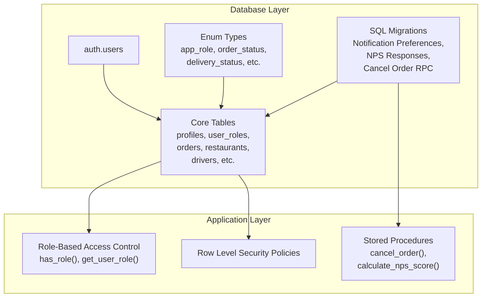
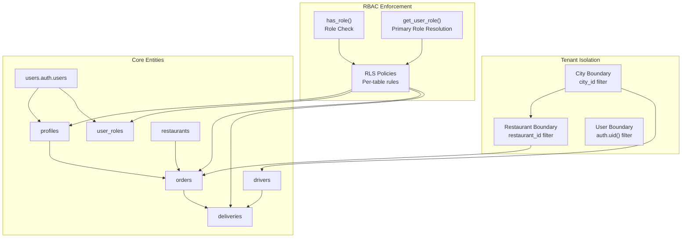
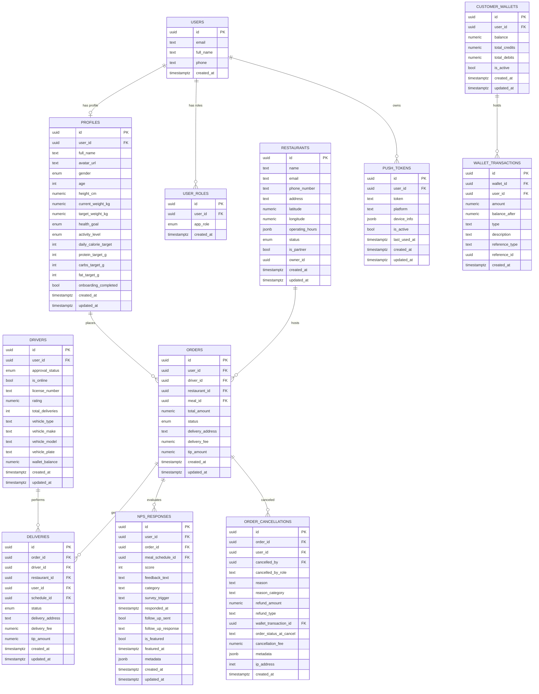
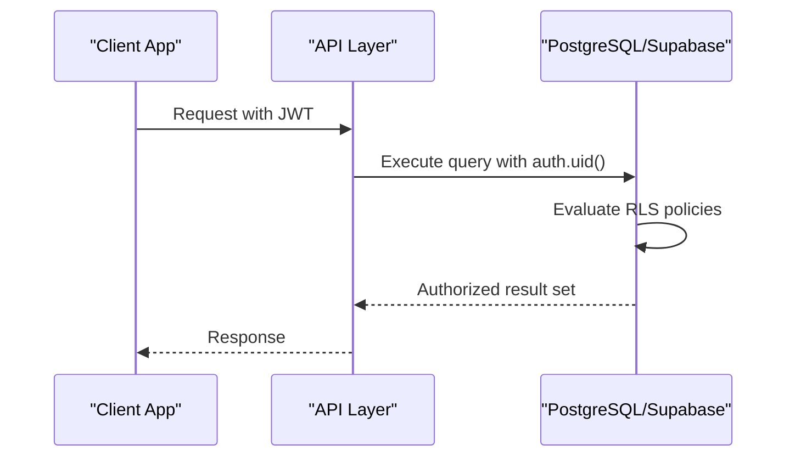
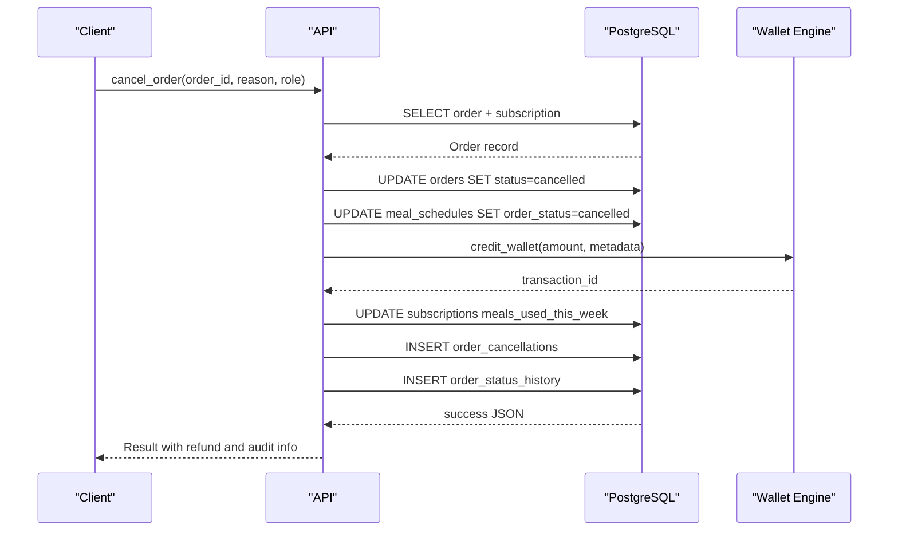
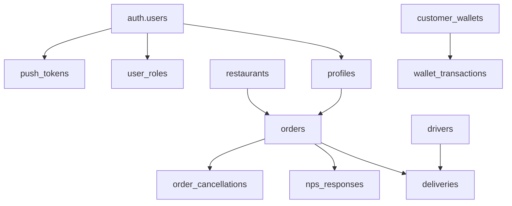

# Database Schema Overview

<cite>
**Referenced Files in This Document**
- [CREATE_TABLES_SQL.md](file://CREATE_TABLES_SQL.md)
- [types.ts](file://supabase/types.ts)
- [20240101000000_add_notification_preferences.sql](file://supabase/migrations/20240101000000_add_notification_preferences.sql)
- [20240101000001_add_nps_responses.sql](file://supabase/migrations/20240101000001_add_nps_responses.sql)
- [20240101000002_add_cancel_order_rpc.sql](file://supabase/migrations/20240101000002_add_cancel_order_rpc.sql)
- [fleet-management-portal-design.md](file://docs/fleet-management-portal-design.md)
</cite>

## Table of Contents
1. [Introduction](#introduction)
2. [Project Structure](#project-structure)
3. [Core Components](#core-components)
4. [Architecture Overview](#architecture-overview)
5. [Detailed Component Analysis](#detailed-component-analysis)
6. [Dependency Analysis](#dependency-analysis)
7. [Performance Considerations](#performance-considerations)
8. [Troubleshooting Guide](#troubleshooting-guide)
9. [Conclusion](#conclusion)

## Introduction
This document provides a comprehensive database schema overview for Nutrio's multi-tenant architecture. It explains the core entities (users, profiles, roles), their relationships, schema design principles, normalization strategies, and how the database supports multiple user portals (customer, partner, admin, driver). It also documents the enum types used throughout the schema, the role-based access control (RBAC) system, and multi-tenant data isolation mechanisms.

## Project Structure
The database schema is primarily defined in:
- Supabase-generated TypeScript types that describe tables, views, enums, and functions
- SQL migration files that define tables, indexes, policies, and stored procedures
- Helper SQL files that outline initial schema creation and security policies

Key schema artifacts:
- Supabase types definition: [types.ts](file://supabase/types.ts)
- Initial schema creation and security policies: [CREATE_TABLES_SQL.md](file://CREATE_TABLES_SQL.md)
- Notification preferences and push tokens: [20240101000000_add_notification_preferences.sql](file://supabase/migrations/20240101000000_add_notification_preferences.sql)
- NPS responses and analytics: [20240101000001_add_nps_responses.sql](file://supabase/migrations/20240101000001_add_nps_responses.sql)
- Order cancellation RPC and audit trail: [20240101000002_add_cancel_order_rpc.sql](file://supabase/migrations/20240101000002_add_cancel_order_rpc.sql)

**Diagram sources**
- [types.ts:1-3331](file://supabase/types.ts#L1-L3331)
- [CREATE_TABLES_SQL.md:1-221](file://CREATE_TABLES_SQL.md#L1-L221)
- [20240101000000_add_notification_preferences.sql:1-170](file://supabase/migrations/20240101000000_add_notification_preferences.sql#L1-L170)
- [20240101000001_add_nps_responses.sql:1-234](file://supabase/migrations/20240101000001_add_nps_responses.sql#L1-L234)
- [20240101000002_add_cancel_order_rpc.sql:1-393](file://supabase/migrations/20240101000002_add_cancel_order_rpc.sql#L1-L393)

**Section sources**
- [types.ts:1-3331](file://supabase/types.ts#L1-L3331)
- [CREATE_TABLES_SQL.md:1-221](file://CREATE_TABLES_SQL.md#L1-L221)

## Core Components
This section outlines the foundational entities and their responsibilities in the multi-tenant ecosystem.

- Users and Authentication
  - Supabase auth.users serves as the identity backbone for all users.
  - Core relationships: users.id links to profiles.user_id and user_roles.user_id.

- Profiles
  - Stores user personal information, health goals, activity levels, and nutrition targets.
  - Enforces row-level security so users can only view/update their own profile.

- User Roles
  - Separates role assignment from profile data for security and RBAC.
  - Supports multiple roles per user and includes helper functions to check roles and determine primary role.

- Restaurants
  - Represents partner establishments with operational details, status, and location data.
  - Used by partner portal and order fulfillment workflows.

- Drivers
  - Manages driver profiles, approvals, ratings, and vehicle details for delivery operations.

- Orders and Deliveries
  - Tracks order lifecycle and delivery status with audit trails and status history.

- Wallet and Payments
  - Handles wallet top-ups, transactions, and payment processing with reference tracking.

- Notifications and Communication
  - Push tokens for mobile/web notifications and structured notification preferences.

- Analytics and Feedback
  - NPS responses with categorization and reporting functions.

**Section sources**
- [types.ts:2805-2831](file://supabase/types.ts#L2805-L2831)
- [types.ts:104-121](file://supabase/types.ts#L104-L121)
- [types.ts:37-46](file://supabase/types.ts#L37-L46)
- [types.ts:2188-2262](file://supabase/types.ts#L2188-L2262)
- [types.ts:529-589](file://supabase/types.ts#L529-L589)
- [types.ts:1697-1789](file://supabase/types.ts#L1697-L1789)
- [types.ts:231-330](file://supabase/types.ts#L231-L330)
- [types.ts:2871-2920](file://supabase/types.ts#L2871-L2920)
- [20240101000000_add_notification_preferences.sql:45-97](file://supabase/migrations/20240101000000_add_notification_preferences.sql#L45-L97)
- [20240101000001_add_nps_responses.sql:9-49](file://supabase/migrations/20240101000001_add_nps_responses.sql#L9-L49)

## Architecture Overview
Nutrio employs a multi-tenant, role-based architecture with strong data isolation and security controls:

- Multi-Tenant Data Isolation
  - Tenant boundaries are enforced via tenant-specific identifiers in tables (e.g., city_id, restaurant_id, user_id).
  - Row-level security policies restrict data visibility to authorized users and roles.
  - Example multi-city isolation pattern: [fleet-management-portal-design.md:124-152](file://docs/fleet-management-portal-design.md#L124-L152)

- Role-Based Access Control (RBAC)
  - Centralized role checks via has_role() and get_user_role() functions.
  - Policies grant selective access to administrative features and sensitive data.
  - Role hierarchy ensures least privilege (e.g., admin overrides, user self-service).

- Enumerations and Normalization
  - Strongly typed enums (app_role, order_status, delivery_status, etc.) ensure data consistency and simplify UI logic.
  - Normalized schema reduces redundancy and improves maintainability.

**Diagram sources**
- [fleet-management-portal-design.md:124-152](file://docs/fleet-management-portal-design.md#L124-L152)
- [CREATE_TABLES_SQL.md:60-96](file://CREATE_TABLES_SQL.md#L60-L96)
- [types.ts:104-121](file://supabase/types.ts#L104-L121)
- [types.ts:37-46](file://supabase/types.ts#L37-L46)

**Section sources**
- [fleet-management-portal-design.md:124-152](file://docs/fleet-management-portal-design.md#L124-L152)
- [CREATE_TABLES_SQL.md:60-96](file://CREATE_TABLES_SQL.md#L60-L96)

## Detailed Component Analysis

### Entity Relationship Model
The following ER diagram maps key entities and their relationships:

**Diagram sources**
- [types.ts:2805-2831](file://supabase/types.ts#L2805-L2831)
- [types.ts:104-121](file://supabase/types.ts#L104-L121)
- [types.ts:37-46](file://supabase/types.ts#L37-L46)
- [types.ts:2188-2262](file://supabase/types.ts#L2188-L2262)
- [types.ts:529-589](file://supabase/types.ts#L529-L589)
- [types.ts:1697-1789](file://supabase/types.ts#L1697-L1789)
- [types.ts:231-330](file://supabase/types.ts#L231-L330)
- [types.ts:197-229](file://supabase/types.ts#L197-L229)
- [types.ts:2871-2920](file://supabase/types.ts#L2871-L2920)
- [20240101000000_add_notification_preferences.sql:45-97](file://supabase/migrations/20240101000000_add_notification_preferences.sql#L45-L97)
- [20240101000001_add_nps_responses.sql:9-49](file://supabase/migrations/20240101000001_add_nps_responses.sql#L9-L49)
- [20240101000002_add_cancel_order_rpc.sql:9-36](file://supabase/migrations/20240101000002_add_cancel_order_rpc.sql#L9-L36)

### Role-Based Access Control and Security Functions
- has_role(): Determines if a user possesses a specific role.
- get_user_role(): Resolves a user's primary role based on precedence.
- RLS Policies: Enforce tenant and role-based access across tables (profiles, user_roles, blocked_ips, user_ip_logs, etc.).

**Diagram sources**
- [CREATE_TABLES_SQL.md:60-96](file://CREATE_TABLES_SQL.md#L60-L96)
- [types.ts:3086-3103](file://supabase/types.ts#L3086-L3103)

**Section sources**
- [CREATE_TABLES_SQL.md:60-96](file://CREATE_TABLES_SQL.md#L60-L96)
- [types.ts:3086-3103](file://supabase/types.ts#L3086-L3103)

### Order Cancellation Workflow
The cancel_order RPC orchestrates cancellation, refund processing, quota restoration, and audit logging.

**Diagram sources**
- [20240101000002_add_cancel_order_rpc.sql:64-267](file://supabase/migrations/20240101000002_add_cancel_order_rpc.sql#L64-L267)

**Section sources**
- [20240101000002_add_cancel_order_rpc.sql:64-267](file://supabase/migrations/20240101000002_add_cancel_order_rpc.sql#L64-L267)

### Enum Types and Their Purposes
The schema defines strongly-typed enums to ensure consistency and simplify business logic:

- app_role: user, admin, gym_owner, staff, restaurant, driver
- order_status: pending, confirmed, preparing, ready_for_pickup, picked_up, out_for_delivery, delivered, cancelled
- delivery_status: pending, claimed, picked_up, on_the_way, delivered, cancelled
- approval_status: pending, approved, rejected
- notification_type: meal_reminder, plan_update, health_insight, system_alert, delivery_update, achievement, subscription
- notification_status: unread, read, archived
- restaurant_status: active, inactive, pending
- vehicle_type: bike, scooter, motorcycle, car
- health_goal_type: weight_loss, maintain_weight, build_muscle, medical_diet
- gender_type: male, female, prefer_not_to_say

These enums are declared in the Supabase types and exposed via generated TypeScript types for frontend/backend safety.

**Section sources**
- [types.ts:3120-3162](file://supabase/types.ts#L3120-L3162)
- [types.ts:3286-3331](file://supabase/types.ts#L3286-L3331)

## Dependency Analysis
This section maps dependencies among core components and highlights coupling and cohesion.

**Diagram sources**
- [types.ts:2805-2831](file://supabase/types.ts#L2805-L2831)
- [types.ts:104-121](file://supabase/types.ts#L104-L121)
- [types.ts:37-46](file://supabase/types.ts#L37-L46)
- [types.ts:1697-1789](file://supabase/types.ts#L1697-L1789)
- [types.ts:231-330](file://supabase/types.ts#L231-L330)
- [types.ts:2188-2262](file://supabase/types.ts#L2188-L2262)
- [types.ts:529-589](file://supabase/types.ts#L529-L589)
- [types.ts:197-229](file://supabase/types.ts#L197-L229)
- [types.ts:2871-2920](file://supabase/types.ts#L2871-L2920)
- [20240101000001_add_nps_responses.sql:9-49](file://supabase/migrations/20240101000001_add_nps_responses.sql#L9-L49)
- [20240101000002_add_cancel_order_rpc.sql:9-36](file://supabase/migrations/20240101000002_add_cancel_order_rpc.sql#L9-L36)

**Section sources**
- [types.ts:2805-2831](file://supabase/types.ts#L2805-L2831)
- [types.ts:104-121](file://supabase/types.ts#L104-L121)
- [types.ts:37-46](file://supabase/types.ts#L37-L46)
- [types.ts:1697-1789](file://supabase/types.ts#L1697-L1789)
- [types.ts:231-330](file://supabase/types.ts#L231-L330)
- [types.ts:2188-2262](file://supabase/types.ts#L2188-L2262)
- [types.ts:529-589](file://supabase/types.ts#L529-L589)
- [types.ts:197-229](file://supabase/types.ts#L197-L229)
- [types.ts:2871-2920](file://supabase/types.ts#L2871-L2920)
- [20240101000001_add_nps_responses.sql:9-49](file://supabase/migrations/20240101000001_add_nps_responses.sql#L9-L49)
- [20240101000002_add_cancel_order_rpc.sql:9-36](file://supabase/migrations/20240101000002_add_cancel_order_rpc.sql#L9-L36)

## Performance Considerations
- Indexes on frequently filtered columns (e.g., user_id, order_id, restaurant_id, created_at) improve query performance.
- GIN indexes on JSONB fields (notification_preferences) enable efficient filtering and updates.
- Triggers for updated_at timestamps avoid redundant updates and keep audit trails accurate.
- Stored procedures encapsulate complex operations (e.g., cancel_order) to reduce network overhead and ensure atomicity.

[No sources needed since this section provides general guidance]

## Troubleshooting Guide
Common issues and resolutions:

- Permission Denied (RLS)
  - Symptom: Queries return empty or unauthorized results.
  - Cause: RLS policies restrict access based on user role or tenant boundary.
  - Resolution: Verify auth.uid() matches the record owner and has_role() returns true for required role.

- Role Check Failures
  - Symptom: has_role() returns false despite correct assignment.
  - Cause: user_roles uniqueness constraint or missing role rows.
  - Resolution: Confirm unique (user_id, role) and that admin role is granted.

- Order Cancellation Errors
  - Symptom: cancel_order RPC fails or partial refund occurs.
  - Cause: invalid status transitions or insufficient wallet balance.
  - Resolution: Use can_cancel_order() to validate eligibility and ensure sufficient credits.

- Notification Preferences Not Applied
  - Symptom: Users do not receive expected notifications.
  - Cause: Incorrect JSON structure or missing push tokens.
  - Resolution: Validate notification_preferences JSON and ensure push_tokens entries are active.

**Section sources**
- [CREATE_TABLES_SQL.md:60-96](file://CREATE_TABLES_SQL.md#L60-L96)
- [20240101000002_add_cancel_order_rpc.sql:273-341](file://supabase/migrations/20240101000002_add_cancel_order_rpc.sql#L273-L341)
- [20240101000000_add_notification_preferences.sql:104-151](file://supabase/migrations/20240101000000_add_notification_preferences.sql#L104-L151)

## Conclusion
Nutrio’s database schema is designed around multi-tenancy, RBAC, and normalized data structures. Strong enums, RLS policies, and stored procedures ensure secure, scalable, and maintainable operations across customer, partner, admin, and driver portals. The schema supports complex workflows like order cancellation, wallet refunds, and analytics while preserving strict data isolation and auditability.