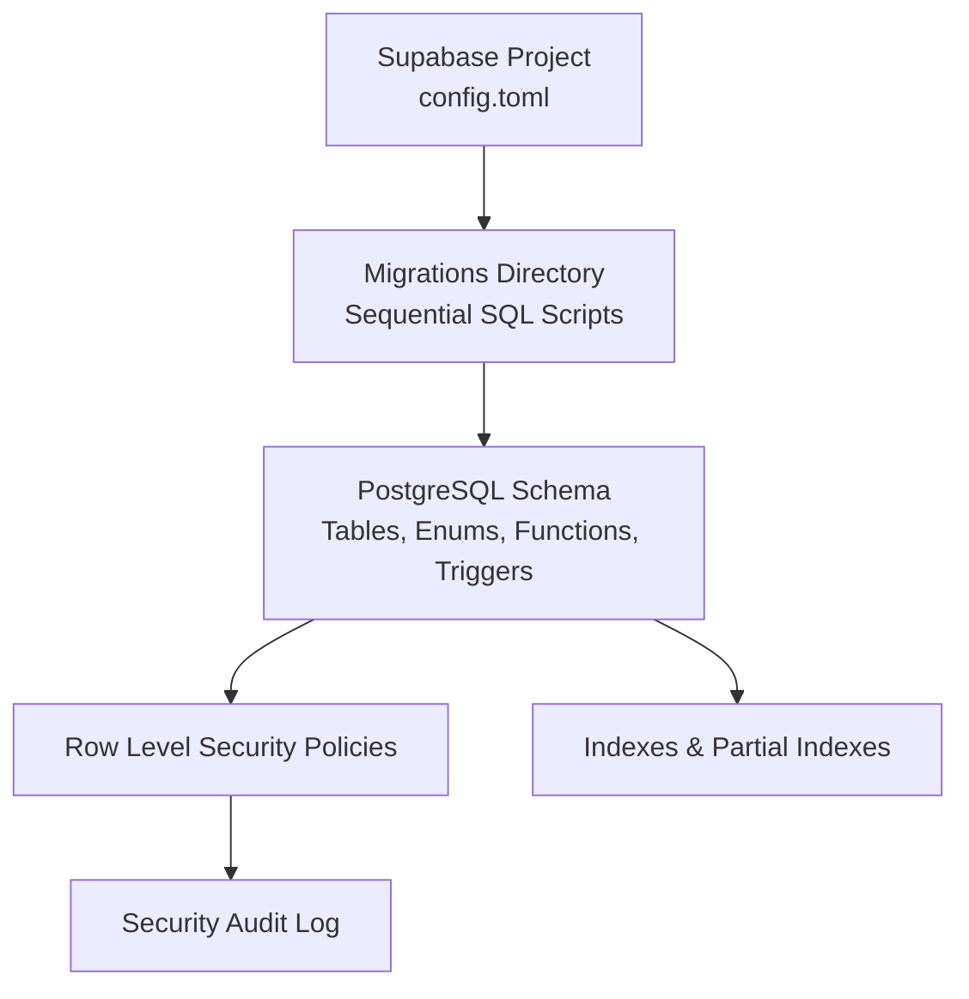
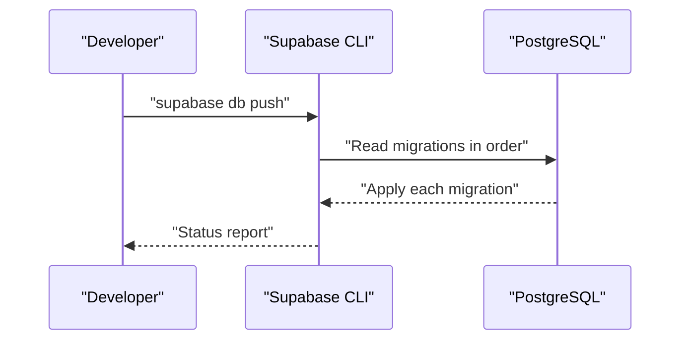
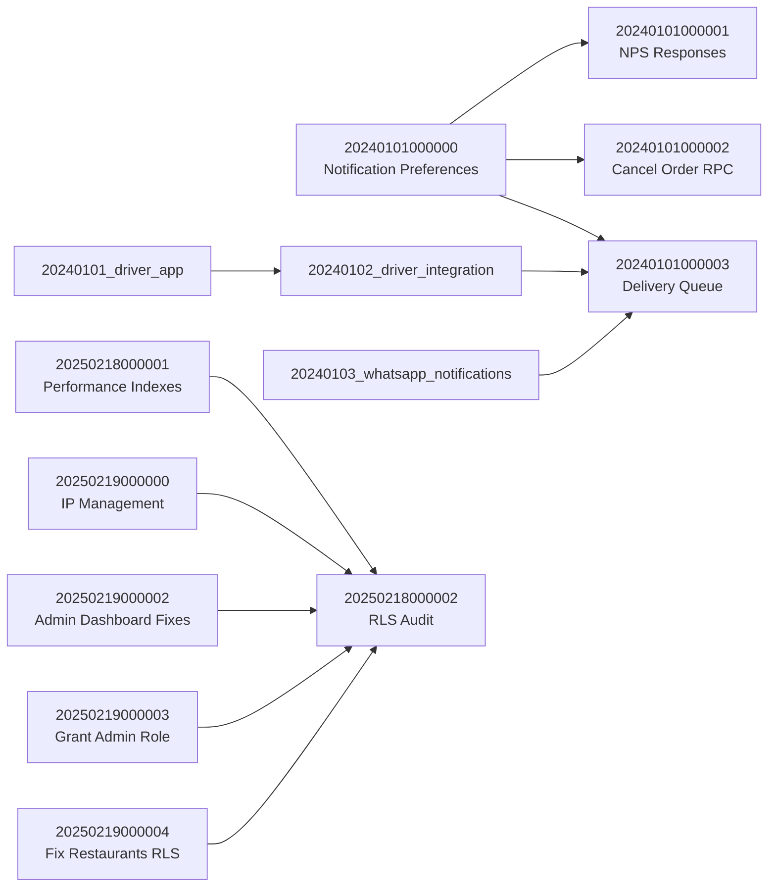
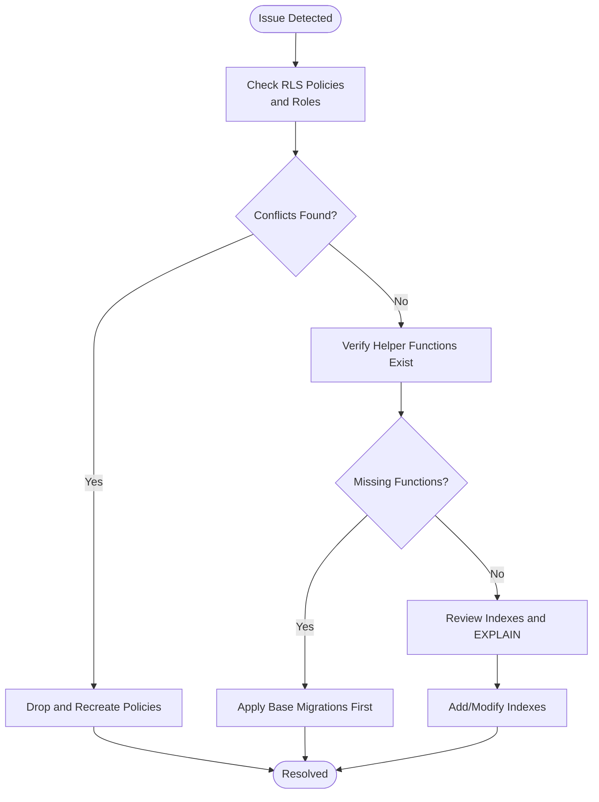

# Migration & Versioning

<cite>
**Referenced Files in This Document**
- [config.toml](file://supabase/config.toml)
- [20240101000000_add_notification_preferences.sql](file://supabase/migrations/20240101000000_add_notification_preferences.sql)
- [20240101000001_add_nps_responses.sql](file://supabase/migrations/20240101000001_add_nps_responses.sql)
- [20240101000002_add_cancel_order_rpc.sql](file://supabase/migrations/20240101000002_add_cancel_order_rpc.sql)
- [20240101000003_add_delivery_queue.sql](file://supabase/migrations/20240101000003_add_delivery_queue.sql)
- [20240101_driver_app.sql](file://supabase/migrations/20240101_driver_app.sql)
- [20240102_driver_integration.sql](file://supabase/migrations/20240102_driver_integration.sql)
- [20240103_whatsapp_notifications.sql](file://supabase/migrations/20240103_whatsapp_notifications.sql)
- [20240227_demo_fleet_data.sql](file://supabase/migrations/20240227_demo_fleet_data.sql)
- [20240228000000_fleet_management.sql](file://supabase/migrations/20240228000000_fleet_management.sql)
- [20250218000001_add_performance_indexes.sql](file://supabase/migrations/20250218000001_add_performance_indexes.sql)
- [20250218000002_rls_audit_and_policies.sql](file://supabase/migrations/20250218000002_rls_audit_and_policies.sql)
- [20250219000000_ip_management.sql](file://supabase/migrations/20250219000000_ip_management.sql)
- [20250219000002_fix_admin_dashboard_tables.sql](file://supabase/migrations/20250219000002_fix_admin_dashboard_tables.sql)
- [20250219000003_grant_admin_role.sql](file://supabase/migrations/20250219000003_grant_admin_role.sql)
- [20250219000004_fix_restaurants_rls.sql](file://supabase/migrations/20250219000004_fix_restaurants_rls.sql)
</cite>

## Table of Contents
1. [Introduction](#introduction)
2. [Project Structure](#project-structure)
3. [Core Components](#core-components)
4. [Architecture Overview](#architecture-overview)
5. [Detailed Component Analysis](#detailed-component-analysis)
6. [Dependency Analysis](#dependency-analysis)
7. [Performance Considerations](#performance-considerations)
8. [Troubleshooting Guide](#troubleshooting-guide)
9. [Conclusion](#conclusion)

## Introduction
This document explains Nutrio’s database migration strategy and version control implementation for Supabase. It covers the migration file structure, naming conventions, sequential numbering system, execution process, rollback procedures, and data preservation strategies. It also documents the relationship between migration files and Supabase’s database versioning system, along with best practices for creating new migrations, handling schema changes, managing production deployments, integrating with Supabase CLI, automated deployment processes, testing strategies, common migration patterns, and troubleshooting approaches.

## Project Structure
The database migrations live under the Supabase configuration directory. Each migration is a SQL script named with a strict timestamp-based sequential number followed by a short description. The Supabase configuration file defines project identifiers and function-level JWT verification toggles.

```mermaid
graph TB
subgraph "Supabase Config"
CFG["config.toml<br/>project_id, function settings"]
end
subgraph "Migrations"
MIG0["20240101000000_add_notification_preferences.sql"]
MIG1["20240101000001_add_nps_responses.sql"]
MIG2["20240101000002_add_cancel_order_rpc.sql"]
MIG3["20240101000003_add_delivery_queue.sql"]
MIG4["20240101_driver_app.sql"]
MIG5["20240102_driver_integration.sql"]
MIG6["20240103_whatsapp_notifications.sql"]
MIG7["20240227_demo_fleet_data.sql"]
MIG8["20240228000000_fleet_management.sql"]
MIG9["20250218000001_add_performance_indexes.sql"]
MIG10["20250218000002_rls_audit_and_policies.sql"]
MIG11["20250219000000_ip_management.sql"]
MIG12["20250219000002_fix_admin_dashboard_tables.sql"]
MIG13["20250219000003_grant_admin_role.sql"]
MIG14["20250219000004_fix_restaurants_rls.sql"]
end
CFG --> MIG0
CFG --> MIG1
CFG --> MIG2
CFG --> MIG3
CFG --> MIG4
CFG --> MIG5
CFG --> MIG6
CFG --> MIG7
CFG --> MIG8
CFG --> MIG9
CFG --> MIG10
CFG --> MIG11
CFG --> MIG12
CFG --> MIG13
CFG --> MIG14
```

**Diagram sources**
- [config.toml:1-59](file://supabase/config.toml#L1-L59)
- [20240101000000_add_notification_preferences.sql:1-170](file://supabase/migrations/20240101000000_add_notification_preferences.sql#L1-L170)
- [20240101000001_add_nps_responses.sql:1-234](file://supabase/migrations/20240101000001_add_nps_responses.sql#L1-L234)
- [20240101000002_add_cancel_order_rpc.sql:1-393](file://supabase/migrations/20240101000002_add_cancel_order_rpc.sql#L1-L393)
- [20240101000003_add_delivery_queue.sql:1-595](file://supabase/migrations/20240101000003_add_delivery_queue.sql#L1-L595)
- [20240101_driver_app.sql:1-270](file://supabase/migrations/20240101_driver_app.sql#L1-L270)
- [20240102_driver_integration.sql:1-232](file://supabase/migrations/20240102_driver_integration.sql#L1-L232)
- [20240103_whatsapp_notifications.sql:1-343](file://supabase/migrations/20240103_whatsapp_notifications.sql#L1-L343)
- [20240227_demo_fleet_data.sql:1-5](file://supabase/migrations/20240227_demo_fleet_data.sql#L1-L5)
- [20240228000000_fleet_management.sql:1-7](file://supabase/migrations/20240228000000_fleet_management.sql#L1-L7)
- [20250218000001_add_performance_indexes.sql:1-73](file://supabase/migrations/20250218000001_add_performance_indexes.sql#L1-L73)
- [20250218000002_rls_audit_and_policies.sql:1-356](file://supabase/migrations/20250218000002_rls_audit_and_policies.sql#L1-L356)
- [20250219000000_ip_management.sql:1-60](file://supabase/migrations/20250219000000_ip_management.sql#L1-L60)
- [20250219000002_fix_admin_dashboard_tables.sql:1-291](file://supabase/migrations/20250219000002_fix_admin_dashboard_tables.sql#L1-L291)
- [20250219000003_grant_admin_role.sql:1-34](file://supabase/migrations/20250219000003_grant_admin_role.sql#L1-L34)
- [20250219000004_fix_restaurants_rls.sql:1-80](file://supabase/migrations/20250219000004_fix_restaurants_rls.sql#L1-L80)

**Section sources**
- [config.toml:1-59](file://supabase/config.toml#L1-L59)

## Core Components
- Migration naming and sequencing: Strict timestamp-based sequential numbering ensures deterministic ordering and reproducibility across environments.
- Step-wise migrations: Each migration file documents steps and modularly applies schema changes, indexes, policies, and helper functions.
- Row Level Security (RLS): Extensively enabled and audited across tables to enforce tenant isolation and role-based access.
- Helper functions and triggers: Many migrations introduce functions and triggers to maintain referential integrity and automate operational workflows.
- Index strategy: Production-focused indexes are added to optimize common queries for orders, subscriptions, meals, and analytics.
- Security hardening: Policies and audit logging are introduced to strengthen access controls and compliance readiness.

**Section sources**
- [20240101000000_add_notification_preferences.sql:1-170](file://supabase/migrations/20240101000000_add_notification_preferences.sql#L1-L170)
- [20240101000001_add_nps_responses.sql:1-234](file://supabase/migrations/20240101000001_add_nps_responses.sql#L1-L234)
- [20240101000002_add_cancel_order_rpc.sql:1-393](file://supabase/migrations/20240101000002_add_cancel_order_rpc.sql#L1-L393)
- [20240101000003_add_delivery_queue.sql:1-595](file://supabase/migrations/20240101000003_add_delivery_queue.sql#L1-L595)
- [20240101_driver_app.sql:1-270](file://supabase/migrations/20240101_driver_app.sql#L1-L270)
- [20240102_driver_integration.sql:1-232](file://supabase/migrations/20240102_driver_integration.sql#L1-L232)
- [20240103_whatsapp_notifications.sql:1-343](file://supabase/migrations/20240103_whatsapp_notifications.sql#L1-L343)
- [20250218000001_add_performance_indexes.sql:1-73](file://supabase/migrations/20250218000001_add_performance_indexes.sql#L1-L73)
- [20250218000002_rls_audit_and_policies.sql:1-356](file://supabase/migrations/20250218000002_rls_audit_and_policies.sql#L1-L356)
- [20250219000000_ip_management.sql:1-60](file://supabase/migrations/20250219000000_ip_management.sql#L1-L60)
- [20250219000002_fix_admin_dashboard_tables.sql:1-291](file://supabase/migrations/20250219000002_fix_admin_dashboard_tables.sql#L1-L291)
- [20250219000003_grant_admin_role.sql:1-34](file://supabase/migrations/20250219000003_grant_admin_role.sql#L1-L34)
- [20250219000004_fix_restaurants_rls.sql:1-80](file://supabase/migrations/20250219000004_fix_restaurants_rls.sql#L1-L80)

## Architecture Overview
The migration architecture follows a layered approach:
- Supabase configuration defines project identity and function-level settings.
- Migrations are applied in strict chronological order, building the schema progressively.
- RLS policies and helper functions encapsulate access control and operational logic.
- Indexes and triggers optimize performance and maintain data consistency.

**Diagram sources**
- [config.toml:1-59](file://supabase/config.toml#L1-L59)
- [20240101000000_add_notification_preferences.sql:1-170](file://supabase/migrations/20240101000000_add_notification_preferences.sql#L1-L170)
- [20250218000002_rls_audit_and_policies.sql:1-356](file://supabase/migrations/20250218000002_rls_audit_and_policies.sql#L1-L356)
- [20250218000001_add_performance_indexes.sql:1-73](file://supabase/migrations/20250218000001_add_performance_indexes.sql#L1-L73)

## Detailed Component Analysis

### Migration Naming Conventions and Sequential Numbering
- Each migration filename begins with a timestamp-based sequential number (YYYYMMDDHHMMSS) followed by a concise description.
- This scheme guarantees deterministic ordering and prevents collisions across teams and environments.
- Example files demonstrate the pattern: 20240101000000, 20240101000001, 20240101000002, etc.

**Section sources**
- [20240101000000_add_notification_preferences.sql:1-10](file://supabase/migrations/20240101000000_add_notification_preferences.sql#L1-L10)
- [20240101000001_add_nps_responses.sql:1-10](file://supabase/migrations/20240101000001_add_nps_responses.sql#L1-L10)
- [20240101000002_add_cancel_order_rpc.sql:1-10](file://supabase/migrations/20240101000002_add_cancel_order_rpc.sql#L1-L10)
- [20240101000003_add_delivery_queue.sql:1-10](file://supabase/migrations/20240101000003_add_delivery_queue.sql#L1-L10)
- [20240101_driver_app.sql:1-10](file://supabase/migrations/20240101_driver_app.sql#L1-L10)
- [20240102_driver_integration.sql:1-10](file://supabase/migrations/20240102_driver_integration.sql#L1-L10)
- [20240103_whatsapp_notifications.sql:1-10](file://supabase/migrations/20240103_whatsapp_notifications.sql#L1-L10)
- [20240227_demo_fleet_data.sql:1-10](file://supabase/migrations/20240227_demo_fleet_data.sql#L1-L10)
- [20240228000000_fleet_management.sql:1-10](file://supabase/migrations/20240228000000_fleet_management.sql#L1-L10)
- [20250218000001_add_performance_indexes.sql:1-10](file://supabase/migrations/20250218000001_add_performance_indexes.sql#L1-L10)
- [20250218000002_rls_audit_and_policies.sql:1-10](file://supabase/migrations/20250218000002_rls_audit_and_policies.sql#L1-L10)
- [20250219000000_ip_management.sql:1-10](file://supabase/migrations/20250219000000_ip_management.sql#L1-L10)
- [20250219000002_fix_admin_dashboard_tables.sql:1-10](file://supabase/migrations/20250219000002_fix_admin_dashboard_tables.sql#L1-L10)
- [20250219000003_grant_admin_role.sql:1-10](file://supabase/migrations/20250219000003_grant_admin_role.sql#L1-L10)
- [20250219000004_fix_restaurants_rls.sql:1-10](file://supabase/migrations/20250219000004_fix_restaurants_rls.sql#L1-L10)

### Migration Execution Process
- Apply migrations in ascending order of the sequential timestamp.
- Each migration script documents its steps and applies schema changes, indexes, policies, and helper functions.
- Some migrations are intentionally no-ops to preserve historical continuity.

**Diagram sources**
- [20240101000000_add_notification_preferences.sql:1-170](file://supabase/migrations/20240101000000_add_notification_preferences.sql#L1-L170)
- [20240101000001_add_nps_responses.sql:1-234](file://supabase/migrations/20240101000001_add_nps_responses.sql#L1-L234)
- [20240101000002_add_cancel_order_rpc.sql:1-393](file://supabase/migrations/20240101000002_add_cancel_order_rpc.sql#L1-L393)
- [20240101000003_add_delivery_queue.sql:1-595](file://supabase/migrations/20240101000003_add_delivery_queue.sql#L1-L595)
- [20240101_driver_app.sql:1-270](file://supabase/migrations/20240101_driver_app.sql#L1-L270)
- [20240102_driver_integration.sql:1-232](file://supabase/migrations/20240102_driver_integration.sql#L1-L232)
- [20240103_whatsapp_notifications.sql:1-343](file://supabase/migrations/20240103_whatsapp_notifications.sql#L1-L343)
- [20240227_demo_fleet_data.sql:1-5](file://supabase/migrations/20240227_demo_fleet_data.sql#L1-L5)
- [20240228000000_fleet_management.sql:1-7](file://supabase/migrations/20240228000000_fleet_management.sql#L1-L7)
- [20250218000001_add_performance_indexes.sql:1-73](file://supabase/migrations/20250218000001_add_performance_indexes.sql#L1-L73)
- [20250218000002_rls_audit_and_policies.sql:1-356](file://supabase/migrations/20250218000002_rls_audit_and_policies.sql#L1-L356)
- [20250219000000_ip_management.sql:1-60](file://supabase/migrations/20250219000000_ip_management.sql#L1-L60)
- [20250219000002_fix_admin_dashboard_tables.sql:1-291](file://supabase/migrations/20250219000002_fix_admin_dashboard_tables.sql#L1-L291)
- [20250219000003_grant_admin_role.sql:1-34](file://supabase/migrations/20250219000003_grant_admin_role.sql#L1-L34)
- [20250219000004_fix_restaurants_rls.sql:1-80](file://supabase/migrations/20250219000004_fix_restaurants_rls.sql#L1-L80)

### Rollback Procedures and Data Preservation Strategies
- Rollbacks are not explicitly scripted in the repository. The recommended approach is to write compensating migrations that reverse or neutralize changes.
- Preserve data by:
  - Using defensive DDL with IF NOT EXISTS checks.
  - Adding columns with defaults rather than altering existing data.
  - Creating indexes and policies before relying on them in application logic.
  - Maintaining helper functions and triggers to keep referential integrity.

**Section sources**
- [20240101000000_add_notification_preferences.sql:1-170](file://supabase/migrations/20240101000000_add_notification_preferences.sql#L1-L170)
- [20240101000001_add_nps_responses.sql:1-234](file://supabase/migrations/20240101000001_add_nps_responses.sql#L1-L234)
- [20240101000002_add_cancel_order_rpc.sql:1-393](file://supabase/migrations/20240101000002_add_cancel_order_rpc.sql#L1-L393)
- [20240101000003_add_delivery_queue.sql:1-595](file://supabase/migrations/20240101000003_add_delivery_queue.sql#L1-L595)
- [20240101_driver_app.sql:1-270](file://supabase/migrations/20240101_driver_app.sql#L1-L270)
- [20240102_driver_integration.sql:1-232](file://supabase/migrations/20240102_driver_integration.sql#L1-L232)
- [20240103_whatsapp_notifications.sql:1-343](file://supabase/migrations/20240103_whatsapp_notifications.sql#L1-L343)
- [20250218000001_add_performance_indexes.sql:1-73](file://supabase/migrations/20250218000001_add_performance_indexes.sql#L1-L73)
- [20250218000002_rls_audit_and_policies.sql:1-356](file://supabase/migrations/20250218000002_rls_audit_and_policies.sql#L1-L356)
- [20250219000000_ip_management.sql:1-60](file://supabase/migrations/20250219000000_ip_management.sql#L1-L60)
- [20250219000002_fix_admin_dashboard_tables.sql:1-291](file://supabase/migrations/20250219000002_fix_admin_dashboard_tables.sql#L1-L291)
- [20250219000003_grant_admin_role.sql:1-34](file://supabase/migrations/20250219000003_grant_admin_role.sql#L1-L34)
- [20250219000004_fix_restaurants_rls.sql:1-80](file://supabase/migrations/20250219000004_fix_restaurants_rls.sql#L1-L80)

### Relationship Between Migration Files and Supabase Database Versioning
- Supabase tracks schema evolution through the ordered migration files. The Supabase configuration file defines project identifiers and function-level settings that influence runtime behavior.
- The sequential numbering system aligns with Supabase’s expectation of deterministic schema application.

**Section sources**
- [config.toml:1-59](file://supabase/config.toml#L1-L59)

### Best Practices for Creating New Migrations
- Use the timestamp-based sequential naming convention.
- Document steps within the migration file for readability and auditability.
- Apply RLS to all tables and define granular policies early.
- Add indexes for common query patterns; prefer partial indexes for frequent filters.
- Introduce helper functions and triggers to maintain data integrity.
- Keep migrations idempotent using IF NOT EXISTS checks.
- Prefer adding columns with defaults over altering existing data.

**Section sources**
- [20240101000000_add_notification_preferences.sql:1-170](file://supabase/migrations/20240101000000_add_notification_preferences.sql#L1-L170)
- [20250218000002_rls_audit_and_policies.sql:1-356](file://supabase/migrations/20250218000002_rls_audit_and_policies.sql#L1-L356)
- [20250218000001_add_performance_indexes.sql:1-73](file://supabase/migrations/20250218000001_add_performance_indexes.sql#L1-L73)

### Handling Schema Changes and Managing Production Deployments
- Use Supabase CLI to apply migrations in CI/CD pipelines.
- Maintain a staging environment to validate migrations before production.
- For breaking changes, pair migrations with application-side compatibility layers.
- Monitor RLS policy coverage and audit logs in production.

**Section sources**
- [config.toml:1-59](file://supabase/config.toml#L1-L59)

### Integration with Supabase CLI and Automated Deployment Processes
- The Supabase CLI reads the migration directory and applies changes in order.
- The configuration file centralizes project settings and function-level JWT verification toggles.

**Section sources**
- [config.toml:1-59](file://supabase/config.toml#L1-L59)

### Testing Strategies for Migration Changes
- Validate RLS policies and helper functions with targeted queries.
- Test indexes with EXPLAIN/EXPLAIN ANALYZE to ensure performance improvements.
- Simulate triggers and functions with representative datasets.
- Use partial indexes to verify selective query patterns.

**Section sources**
- [20250218000002_rls_audit_and_policies.sql:1-356](file://supabase/migrations/20250218000002_rls_audit_and_policies.sql#L1-L356)
- [20250218000001_add_performance_indexes.sql:1-73](file://supabase/migrations/20250218000001_add_performance_indexes.sql#L1-L73)

### Common Migration Patterns
- Feature scaffolding: Add tables, enums, indexes, and policies in a single migration.
- Operational functions: Introduce RPCs, triggers, and helper functions alongside schema changes.
- Security hardening: Enable RLS and audit logging across tables.
- Performance tuning: Add indexes and partial indexes for hot queries.

**Section sources**
- [20240101000000_add_notification_preferences.sql:1-170](file://supabase/migrations/20240101000000_add_notification_preferences.sql#L1-L170)
- [20240101000002_add_cancel_order_rpc.sql:1-393](file://supabase/migrations/20240101000002_add_cancel_order_rpc.sql#L1-L393)
- [20240101000003_add_delivery_queue.sql:1-595](file://supabase/migrations/20240101000003_add_delivery_queue.sql#L1-L595)
- [20240101_driver_app.sql:1-270](file://supabase/migrations/20240101_driver_app.sql#L1-L270)
- [20240102_driver_integration.sql:1-232](file://supabase/migrations/20240102_driver_integration.sql#L1-L232)
- [20240103_whatsapp_notifications.sql:1-343](file://supabase/migrations/20240103_whatsapp_notifications.sql#L1-L343)
- [20250218000002_rls_audit_and_policies.sql:1-356](file://supabase/migrations/20250218000002_rls_audit_and_policies.sql#L1-L356)
- [20250218000001_add_performance_indexes.sql:1-73](file://supabase/migrations/20250218000001_add_performance_indexes.sql#L1-L73)

## Dependency Analysis
Migrations depend on each other through schema prerequisites and shared helper functions. For example:
- Driver app migrations depend on base order and restaurant schemas.
- Delivery queue and integration migrations rely on order and driver schemas.
- Security and performance migrations depend on all core tables being present.

**Diagram sources**
- [20240101000000_add_notification_preferences.sql:1-170](file://supabase/migrations/20240101000000_add_notification_preferences.sql#L1-L170)
- [20240101000001_add_nps_responses.sql:1-234](file://supabase/migrations/20240101000001_add_nps_responses.sql#L1-L234)
- [20240101000002_add_cancel_order_rpc.sql:1-393](file://supabase/migrations/20240101000002_add_cancel_order_rpc.sql#L1-L393)
- [20240101000003_add_delivery_queue.sql:1-595](file://supabase/migrations/20240101000003_add_delivery_queue.sql#L1-L595)
- [20240101_driver_app.sql:1-270](file://supabase/migrations/20240101_driver_app.sql#L1-L270)
- [20240102_driver_integration.sql:1-232](file://supabase/migrations/20240102_driver_integration.sql#L1-L232)
- [20240103_whatsapp_notifications.sql:1-343](file://supabase/migrations/20240103_whatsapp_notifications.sql#L1-L343)
- [20250218000001_add_performance_indexes.sql:1-73](file://supabase/migrations/20250218000001_add_performance_indexes.sql#L1-L73)
- [20250218000002_rls_audit_and_policies.sql:1-356](file://supabase/migrations/20250218000002_rls_audit_and_policies.sql#L1-L356)
- [20250219000000_ip_management.sql:1-60](file://supabase/migrations/20250219000000_ip_management.sql#L1-L60)
- [20250219000002_fix_admin_dashboard_tables.sql:1-291](file://supabase/migrations/20250219000002_fix_admin_dashboard_tables.sql#L1-L291)
- [20250219000003_grant_admin_role.sql:1-34](file://supabase/migrations/20250219000003_grant_admin_role.sql#L1-L34)
- [20250219000004_fix_restaurants_rls.sql:1-80](file://supabase/migrations/20250219000004_fix_restaurants_rls.sql#L1-L80)

**Section sources**
- [20240101000000_add_notification_preferences.sql:1-170](file://supabase/migrations/20240101000000_add_notification_preferences.sql#L1-L170)
- [20240101000001_add_nps_responses.sql:1-234](file://supabase/migrations/20240101000001_add_nps_responses.sql#L1-L234)
- [20240101000002_add_cancel_order_rpc.sql:1-393](file://supabase/migrations/20240101000002_add_cancel_order_rpc.sql#L1-L393)
- [20240101000003_add_delivery_queue.sql:1-595](file://supabase/migrations/20240101000003_add_delivery_queue.sql#L1-L595)
- [20240101_driver_app.sql:1-270](file://supabase/migrations/20240101_driver_app.sql#L1-L270)
- [20240102_driver_integration.sql:1-232](file://supabase/migrations/20240102_driver_integration.sql#L1-L232)
- [20240103_whatsapp_notifications.sql:1-343](file://supabase/migrations/20240103_whatsapp_notifications.sql#L1-L343)
- [20250218000001_add_performance_indexes.sql:1-73](file://supabase/migrations/20250218000001_add_performance_indexes.sql#L1-L73)
- [20250218000002_rls_audit_and_policies.sql:1-356](file://supabase/migrations/20250218000002_rls_audit_and_policies.sql#L1-L356)
- [20250219000000_ip_management.sql:1-60](file://supabase/migrations/20250219000000_ip_management.sql#L1-L60)
- [20250219000002_fix_admin_dashboard_tables.sql:1-291](file://supabase/migrations/20250219000002_fix_admin_dashboard_tables.sql#L1-L291)
- [20250219000003_grant_admin_role.sql:1-34](file://supabase/migrations/20250219000003_grant_admin_role.sql#L1-L34)
- [20250219000004_fix_restaurants_rls.sql:1-80](file://supabase/migrations/20250219000004_fix_restaurants_rls.sql#L1-L80)

## Performance Considerations
- Add indexes for frequently filtered and joined columns.
- Use partial indexes for common query predicates (e.g., active subscriptions, pending orders).
- Monitor slow queries with EXPLAIN and adjust indexes accordingly.
- Keep helper functions efficient and avoid heavy computations in triggers.

**Section sources**
- [20250218000001_add_performance_indexes.sql:1-73](file://supabase/migrations/20250218000001_add_performance_indexes.sql#L1-L73)

## Troubleshooting Guide
Common issues and resolutions:
- RLS policy conflicts: Recreate policies with explicit roles and verify with pg_policies.
- Missing helper functions: Ensure functions exist before applying dependent migrations.
- Index performance regressions: Reassess indexes and add partial indexes for hot filters.
- No-op migrations: Confirm historical continuity by checking SELECT 1 migrations.

**Section sources**
- [20250218000002_rls_audit_and_policies.sql:1-356](file://supabase/migrations/20250218000002_rls_audit_and_policies.sql#L1-L356)
- [20250219000004_fix_restaurants_rls.sql:1-80](file://supabase/migrations/20250219000004_fix_restaurants_rls.sql#L1-L80)
- [20250218000001_add_performance_indexes.sql:1-73](file://supabase/migrations/20250218000001_add_performance_indexes.sql#L1-L73)

## Conclusion
Nutrio’s migration strategy leverages a strict, timestamp-based sequential numbering system, modular step-wise migrations, comprehensive RLS enforcement, and performance-focused indexing. By following the documented best practices, teams can safely evolve the schema, integrate with Supabase CLI, and maintain robust, auditable, and performant database deployments across environments.