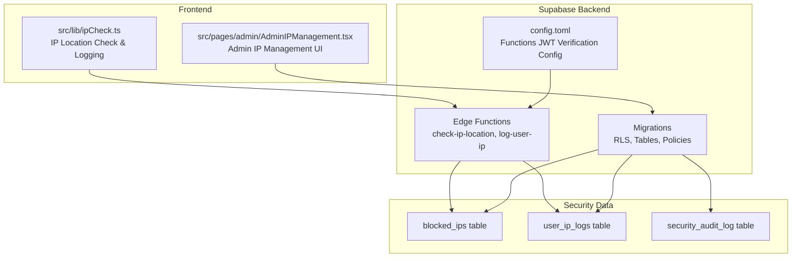
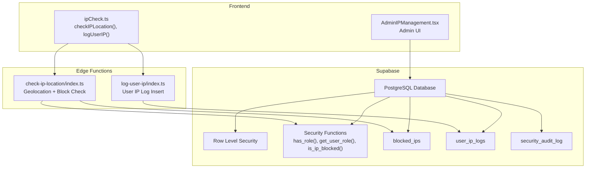
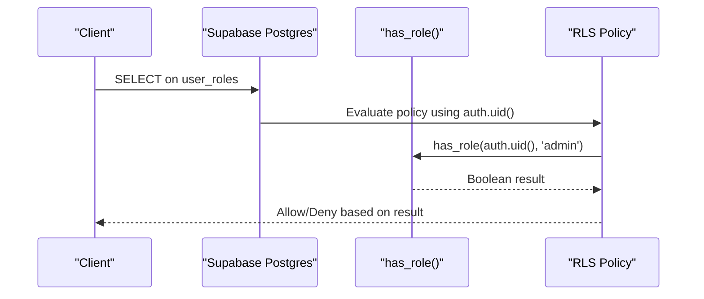
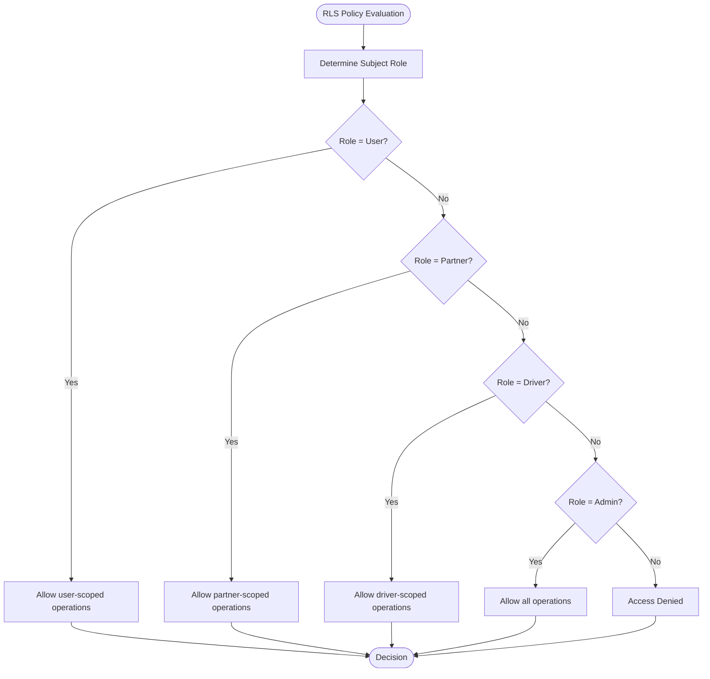
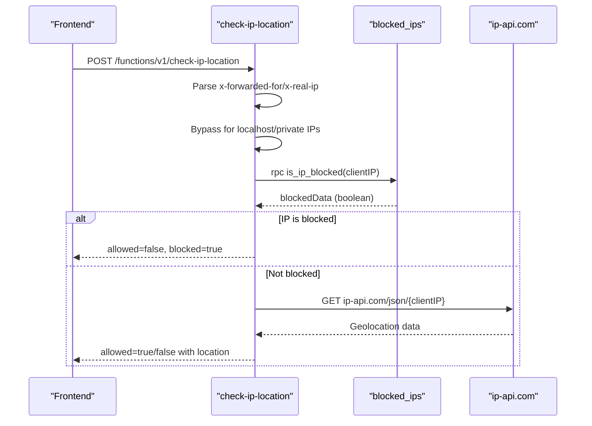
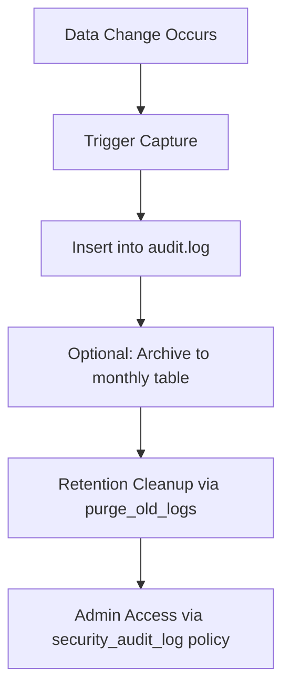
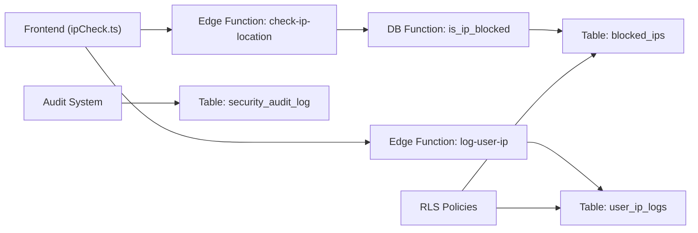

# Security & Access Control

<cite>
**Referenced Files in This Document**
- [config.toml](file://supabase/config.toml)
- [rls_audit_and_policies.sql](file://supabase/migrations/20250218000002_rls_audit_and_policies.sql)
- [create_essential_tables.sql](file://supabase/migrations/20250220000000_create_essential_tables.sql)
- [ip_management.sql](file://supabase/migrations/20250219000000_ip_management.sql)
- [check-ip-location/index.ts](file://supabase/functions/check-ip-location/index.ts)
- [log-user-ip/index.ts](file://supabase/functions/log-user-ip/index.ts)
- [ipCheck.ts](file://src/lib/ipCheck.ts)
- [AdminIPManagement.tsx](file://src/pages/admin/AdminIPManagement.tsx)
- [24cbd0a5-185b-43dd-aed9-d1ae7379e6b0.sql](file://supabase/migrations/20260105045257_24cbd0a5-185b-43dd-aed9-d1ae7379e6b0.sql)
- [fix_rls_and_security_issues.sql](file://supabase/migrations/20260226000008_fix_rls_and_security_issues.sql)
- [audit_logging_system.sql](file://supabase/migrations/20260226000003_audit_logging_system.sql)
- [audit_remediation_summary.sql](file://supabase/migrations/20260226000009_audit_remediation_summary.sql)
- [security.spec.ts](file://e2e/system/security.spec.ts)
</cite>

## Table of Contents
1. [Introduction](#introduction)
2. [Project Structure](#project-structure)
3. [Core Components](#core-components)
4. [Architecture Overview](#architecture-overview)
5. [Detailed Component Analysis](#detailed-component-analysis)
6. [Dependency Analysis](#dependency-analysis)
7. [Performance Considerations](#performance-considerations)
8. [Troubleshooting Guide](#troubleshooting-guide)
9. [Conclusion](#conclusion)

## Introduction
This document details Nutrio's comprehensive security implementation, focusing on row-level security (RLS) policies, role-based access control (RBAC), and data protection measures. It explains the IP management system including the blocked_ips table, user_ip_logs tracking, and geographic location verification. It also documents the RBAC system with has_role and get_user_role functions, policy-based data isolation across portals, audit logging, and compliance measures. Examples of policy configurations and security function usage patterns are included to guide secure development and maintenance.

## Project Structure
Security-related components are distributed across Supabase backend (migrations, functions, RLS policies) and the frontend (IP verification and logging utilities, admin UI for IP management).

**Diagram sources**
- [config.toml:1-59](file://supabase/config.toml#L1-L59)
- [rls_audit_and_policies.sql:1-356](file://supabase/migrations/20250218000002_rls_audit_and_policies.sql#L1-L356)
- [create_essential_tables.sql:180-244](file://supabase/migrations/20250220000000_create_essential_tables.sql#L180-L244)
- [ip_management.sql:1-60](file://supabase/migrations/20250219000000_ip_management.sql#L1-L60)
- [check-ip-location/index.ts:1-107](file://supabase/functions/check-ip-location/index.ts#L1-L107)
- [log-user-ip/index.ts:1-65](file://supabase/functions/log-user-ip/index.ts#L1-L65)
- [ipCheck.ts:1-107](file://src/lib/ipCheck.ts#L1-L107)
- [AdminIPManagement.tsx:1-345](file://src/pages/admin/AdminIPManagement.tsx#L1-L345)

**Section sources**
- [config.toml:1-59](file://supabase/config.toml#L1-L59)
- [rls_audit_and_policies.sql:1-356](file://supabase/migrations/20250218000002_rls_audit_and_policies.sql#L1-L356)
- [create_essential_tables.sql:180-244](file://supabase/migrations/20250220000000_create_essential_tables.sql#L180-L244)
- [ip_management.sql:1-60](file://supabase/migrations/20250219000000_ip_management.sql#L1-L60)
- [check-ip-location/index.ts:1-107](file://supabase/functions/check-ip-location/index.ts#L1-L107)
- [log-user-ip/index.ts:1-65](file://supabase/functions/log-user-ip/index.ts#L1-L65)
- [ipCheck.ts:1-107](file://src/lib/ipCheck.ts#L1-L107)
- [AdminIPManagement.tsx:1-345](file://src/pages/admin/AdminIPManagement.tsx#L1-L345)

## Core Components
- Role-Based Access Control (RBAC):
  - has_role function checks if a user possesses a specific role.
  - get_user_role function returns a user's effective role with precedence ordering.
  - user_roles table stores user-role assignments with RLS policies.
- Row-Level Security (RLS) Policies:
  - Strict policies per table define who can SELECT, INSERT, UPDATE, or ALL operations.
  - Admin privileges are enforced via JWT claims or dedicated has_role checks.
- IP Management System:
  - blocked_ips table maintains active IP blocks with reasons and timestamps.
  - user_ip_logs tracks user signups/logins with geolocation and user agent.
  - Edge functions verify IP location and log user IP events.
- Audit Logging:
  - security_audit_log captures table changes, user actions, IP, and user agent.
  - Policies restrict audit log visibility to administrators.
- Compliance and Retention:
  - Data retention policies and audit remediation views support GDPR/privacy compliance.

**Section sources**
- [create_essential_tables.sql:76-120](file://supabase/migrations/20250220000000_create_essential_tables.sql#L76-L120)
- [rls_audit_and_policies.sql:271-295](file://supabase/migrations/20250218000002_rls_audit_and_policies.sql#L271-L295)
- [ip_management.sql:1-60](file://supabase/migrations/20250219000000_ip_management.sql#L1-L60)
- [24cbd0a5-185b-43dd-aed9-d1ae7379e6b0.sql:260-295](file://supabase/migrations/20260105045257_24cbd0a5-185b-43dd-aed9-d1ae7379e6b0.sql#L260-L295)

## Architecture Overview
The security architecture integrates Supabase RLS, custom security functions, and edge functions to enforce access control and monitor access patterns.

**Diagram sources**
- [ipCheck.ts:19-80](file://src/lib/ipCheck.ts#L19-L80)
- [AdminIPManagement.tsx:46-94](file://src/pages/admin/AdminIPManagement.tsx#L46-L94)
- [check-ip-location/index.ts:26-89](file://supabase/functions/check-ip-location/index.ts#L26-L89)
- [log-user-ip/index.ts:16-45](file://supabase/functions/log-user-ip/index.ts#L16-L45)
- [create_essential_tables.sql:235-244](file://supabase/migrations/20250220000000_create_essential_tables.sql#L235-L244)
- [rls_audit_and_policies.sql:271-295](file://supabase/migrations/20250218000002_rls_audit_and_policies.sql#L271-L295)

## Detailed Component Analysis

### Role-Based Access Control (RBAC)
- has_role function:
  - Purpose: Determine if a user has a specific role.
  - Implementation: Uses a stable SECURITY DEFINER function querying user_roles with search_path set to public.
  - Usage: Policies reference this function to authorize admin-only operations.
- get_user_role function:
  - Purpose: Return a user's effective role with precedence (admin > others).
  - Implementation: Orders roles and selects the highest priority role for the user.
- user_roles table:
  - Stores user_id and role with unique constraint on (user_id, role).
  - RLS policies:
    - Users can view their own roles.
    - Admins can view all roles.
    - Admins can manage roles (ALL operations).

**Diagram sources**
- [create_essential_tables.sql:87-101](file://supabase/migrations/20250220000000_create_essential_tables.sql#L87-L101)
- [rls_audit_and_policies.sql:127-135](file://supabase/migrations/20250218000002_rls_audit_and_policies.sql#L127-L135)

**Section sources**
- [create_essential_tables.sql:76-120](file://supabase/migrations/20250220000000_create_essential_tables.sql#L76-L120)
- [rls_audit_and_policies.sql:127-135](file://supabase/migrations/20250218000002_rls_audit_and_policies.sql#L127-L135)

### Row-Level Security Policies by Table
- Orders:
  - Users: SELECT/INSERT for their own orders; UPDATE only when status=pending.
  - Partners: SELECT for orders belonging to their restaurants.
  - Drivers: SELECT for orders assigned to them.
  - Admins: Full access (ALL).
- Subscriptions:
  - Users: SELECT/INSERT for their own subscriptions.
  - Admins: Full access (ALL).
- Meals:
  - Anyone: SELECT for active meals.
  - Partners: FULL access for meals under their restaurants.
  - Admins: Full access (ALL).
- Restaurants:
  - Anyone: SELECT for approved and active restaurants.
  - Partners: FULL access for their own restaurants.
  - Admins: Full access (ALL).
- Customer Wallets:
  - Users: SELECT/INSERT for their own wallet.
  - Admins: SELECT for all wallets.
- Wallet Transactions:
  - Users: SELECT if wallet belongs to them.
  - Admins: SELECT for all transactions.
- Notifications:
  - Users: SELECT/UPDATE for their own notifications.
  - System: INSERT for notifications (with CHECK true).
- Addresses/Favorites:
  - Users: FULL access for their own records.
- Security Functions:
  - is_admin(user_id): Checks admin status in admin_users.
  - owns_restaurant(user_id, restaurant_id): Checks ownership.
- Audit Log:
  - Only admins can SELECT security_audit_log.

**Diagram sources**
- [rls_audit_and_policies.sql:46-165](file://supabase/migrations/20250218000002_rls_audit_and_policies.sql#L46-L165)

**Section sources**
- [rls_audit_and_policies.sql:46-222](file://supabase/migrations/20250218000002_rls_audit_and_policies.sql#L46-L222)
- [24cbd0a5-185b-43dd-aed9-d1ae7379e6b0.sql:260-295](file://supabase/migrations/20260105045257_24cbd0a5-185b-43dd-aed9-d1ae7379e6b0.sql#L260-L295)

### IP Management System
- blocked_ips table:
  - Columns: ip_address (unique), reason, blocked_by, is_active, timestamps.
  - RLS: Admins can manage (ALL).
- user_ip_logs table:
  - Columns: user_id, ip_address, country_code/name, city, action (signup/login), user_agent, timestamps.
  - RLS: Admins can SELECT; users can INSERT their own logs.
- Edge Functions:
  - check-ip-location:
    - Extracts client IP from headers.
    - Bypasses checks for local/private IPs (for E2E/testing).
    - Calls is_ip_blocked RPC to check database block.
    - Queries ip-api.com for geolocation; denies if lookup fails (fail closed).
    - Returns allowed/block status with location info.
  - log-user-ip:
    - Runs with service role to insert user IP logs.
    - Retrieves geolocation and user agent, inserts into user_ip_logs.
- Frontend Utilities:
  - ipCheck.ts:
    - checkIPLocation(): Currently returns allowed=true for E2E testing; original logic commented out.
    - logUserIP(): Skips in dev/local; otherwise posts to log-user-ip function.
- Admin UI:
  - AdminIPManagement.tsx:
    - Lists blocked IPs and user IP logs.
    - Provides blocking/unblocking actions and statistics.

**Diagram sources**
- [check-ip-location/index.ts:26-89](file://supabase/functions/check-ip-location/index.ts#L26-L89)
- [create_essential_tables.sql:235-244](file://supabase/migrations/20250220000000_create_essential_tables.sql#L235-L244)

**Section sources**
- [ip_management.sql:1-60](file://supabase/migrations/20250219000000_ip_management.sql#L1-L60)
- [create_essential_tables.sql:180-244](file://supabase/migrations/20250220000000_create_essential_tables.sql#L180-L244)
- [check-ip-location/index.ts:1-107](file://supabase/functions/check-ip-location/index.ts#L1-L107)
- [log-user-ip/index.ts:1-65](file://supabase/functions/log-user-ip/index.ts#L1-L65)
- [ipCheck.ts:19-107](file://src/lib/ipCheck.ts#L19-L107)
- [AdminIPManagement.tsx:46-94](file://src/pages/admin/AdminIPManagement.tsx#L46-L94)

### Audit Logging and Compliance
- security_audit_log:
  - Captures table_name, record_id, action, user_id, old/new data, IP, user agent, timestamp.
  - RLS: Only admins can SELECT.
- Audit Remediation:
  - audit_remediation_status view verifies pgcrypto, audit triggers, encryption columns, API secret hashing, soft delete columns, and retention policies.
  - Grants SELECT to authenticated for verification.
- Data Retention:
  - purge_old_logs function removes old audit entries based on retention days.
  - Policies restrict access to retention management and failed auth attempts to admins.

**Diagram sources**
- [audit_logging_system.sql:294-307](file://supabase/migrations/20260226000003_audit_logging_system.sql#L294-L307)
- [fix_rls_and_security_issues.sql:125-251](file://supabase/migrations/20260226000008_fix_rls_and_security_issues.sql#L125-L251)
- [audit_remediation_summary.sql:98-186](file://supabase/migrations/20260226000009_audit_remediation_summary.sql#L98-L186)

**Section sources**
- [rls_audit_and_policies.sql:271-295](file://supabase/migrations/20250218000002_rls_audit_and_policies.sql#L271-L295)
- [audit_logging_system.sql:256-307](file://supabase/migrations/20260226000003_audit_logging_system.sql#L256-L307)
- [fix_rls_and_security_issues.sql:125-251](file://supabase/migrations/20260226000008_fix_rls_and_security_issues.sql#L125-L251)
- [audit_remediation_summary.sql:98-186](file://supabase/migrations/20260226000009_audit_remediation_summary.sql#L98-L186)

### Cross-Portal Access Restrictions
- Ownership-based isolation:
  - Orders: Users see only their orders; Partners see orders for their restaurants; Drivers see assigned orders.
  - Meals/Restaurants: Partners manage only their own restaurants/meals.
- Admin privileges:
  - Admins can SELECT/ALL on most tables, ensuring oversight and operational capability.
- User self-service:
  - Profiles, Addresses, Favorites, Notifications, Wallets, and Wallet Transactions are primarily user-scoped with minimal admin access.

**Section sources**
- [rls_audit_and_policies.sql:46-222](file://supabase/migrations/20250218000002_rls_audit_and_policies.sql#L46-L222)
- [24cbd0a5-185b-43dd-aed9-d1ae7379e6b0.sql:260-295](file://supabase/migrations/20260105045257_24cbd0a5-185b-43dd-aed9-d1ae7379e6b0.sql#L260-L295)

### Security Function Usage Patterns
- has_role usage in policies:
  - Example: Admins can view all roles using has_role(auth.uid(), 'admin').
- get_user_role usage:
  - Used to derive effective role precedence for access decisions.
- is_ip_blocked usage:
  - Called from edge function to enforce IP block checks before granting access.

**Section sources**
- [create_essential_tables.sql:87-120](file://supabase/migrations/20250220000000_create_essential_tables.sql#L87-L120)
- [check-ip-location/index.ts:49-62](file://supabase/functions/check-ip-location/index.ts#L49-L62)

## Dependency Analysis
- Frontend depends on Supabase Edge Functions for IP verification and logging.
- Edge Functions depend on database functions (is_ip_blocked) and external geolocation service.
- RLS policies depend on has_role/get_user_role and JWT claims for authorization.
- Audit logging depends on audit triggers and retention functions.

**Diagram sources**
- [ipCheck.ts:48-102](file://src/lib/ipCheck.ts#L48-L102)
- [check-ip-location/index.ts:26-89](file://supabase/functions/check-ip-location/index.ts#L26-L89)
- [log-user-ip/index.ts:16-45](file://supabase/functions/log-user-ip/index.ts#L16-L45)
- [create_essential_tables.sql:235-244](file://supabase/migrations/20250220000000_create_essential_tables.sql#L235-L244)
- [rls_audit_and_policies.sql:271-295](file://supabase/migrations/20250218000002_rls_audit_and_policies.sql#L271-L295)

**Section sources**
- [ipCheck.ts:19-107](file://src/lib/ipCheck.ts#L19-L107)
- [check-ip-location/index.ts:1-107](file://supabase/functions/check-ip-location/index.ts#L1-L107)
- [log-user-ip/index.ts:1-65](file://supabase/functions/log-user-ip/index.ts#L1-L65)
- [create_essential_tables.sql:235-244](file://supabase/migrations/20250220000000_create_essential_tables.sql#L235-L244)
- [rls_audit_and_policies.sql:271-295](file://supabase/migrations/20250218000002_rls_audit_and_policies.sql#L271-L295)

## Performance Considerations
- Indexes on IP and timestamp columns improve query performance for blocked_ips and user_ip_logs.
- Edge functions should minimize external calls and cache where appropriate.
- RLS evaluation occurs per-row; keep policy expressions efficient and leverage indexes.

[No sources needed since this section provides general guidance]

## Troubleshooting Guide
- IP Verification Issues:
  - If checkIPLocation returns allowed=true with reason indicating E2E testing mode, verify the frontend bypass is intended.
  - If edge function returns denied with "Unable to verify location", ensure ip-api.com is reachable and retry.
- IP Logging Failures:
  - logUserIP silently fails in production; check network connectivity and Supabase publishable key configuration.
- Admin Access Problems:
  - Verify user has admin role via has_role and that RLS policies are applied to relevant tables.
- Audit Log Visibility:
  - Only admins can view security_audit_log; ensure proper role assignment.

**Section sources**
- [ipCheck.ts:19-80](file://src/lib/ipCheck.ts#L19-L80)
- [check-ip-location/index.ts:68-78](file://supabase/functions/check-ip-location/index.ts#L68-L78)
- [log-user-ip/index.ts:56-64](file://supabase/functions/log-user-ip/index.ts#L56-L64)
- [rls_audit_and_policies.sql:291-294](file://supabase/migrations/20250218000002_rls_audit_and_policies.sql#L291-L294)

## Conclusion
Nutrio implements a robust layered security model combining Supabase RLS, custom security functions, and edge functions. The RBAC system with has_role and get_user_role enforces strict data isolation across user, partner, driver, and admin roles. The IP management system provides real-time blocking and geolocation verification, while audit logging and compliance tools support ongoing security monitoring and regulatory adherence. Together, these components form a comprehensive defense-in-depth strategy suitable for production environments.