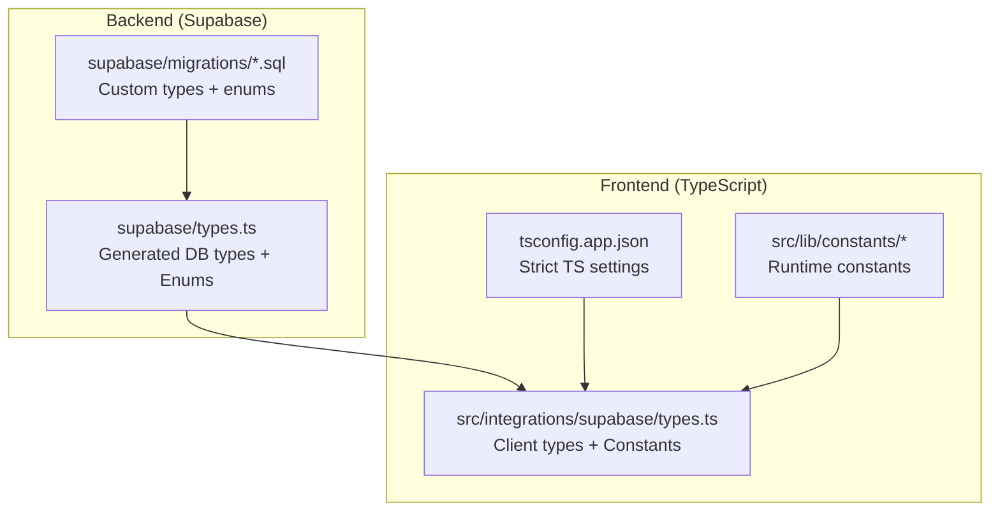
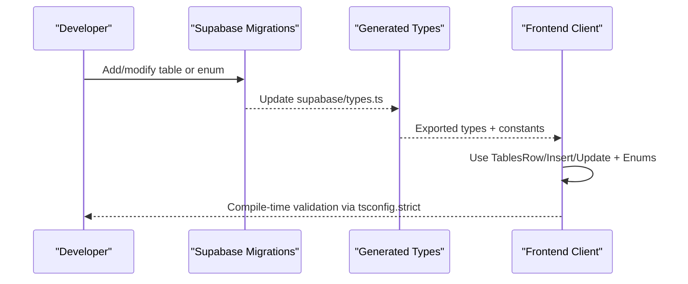
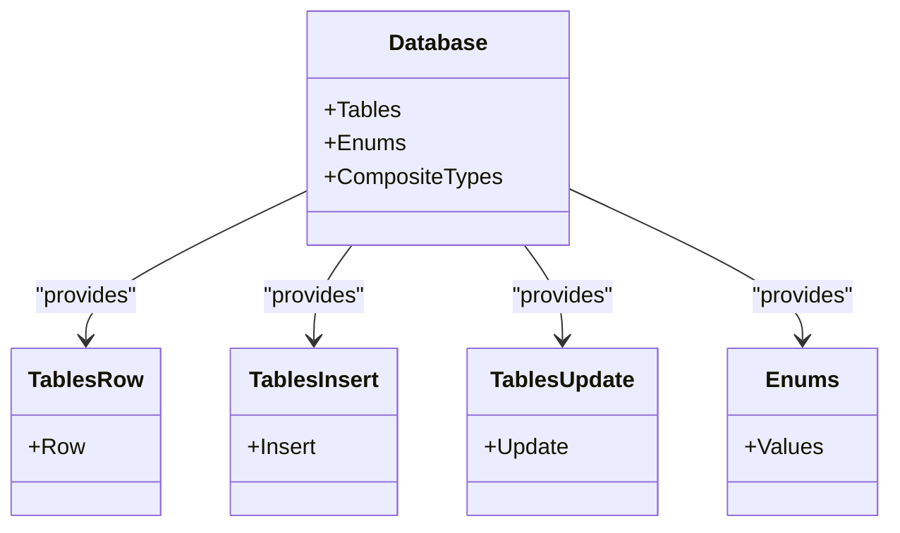
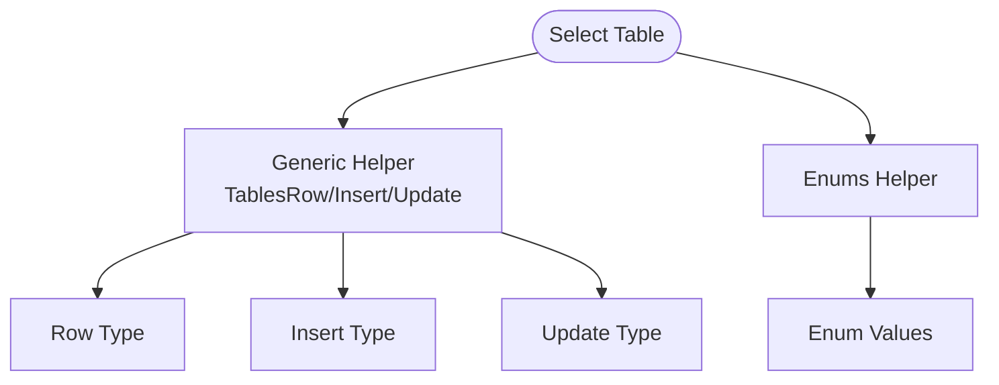
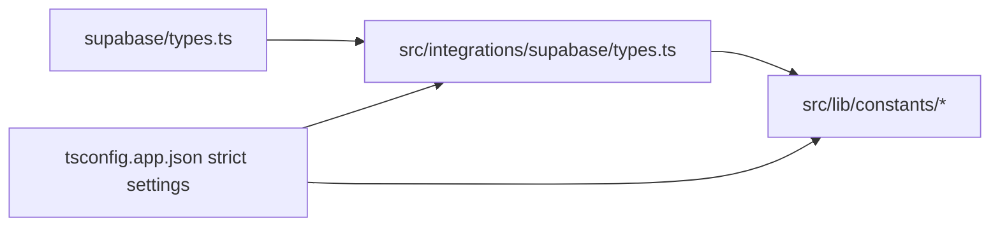

# Data Models & Types

<cite>
**Referenced Files in This Document**
- [supabase/types.ts](file://supabase/types.ts)
- [src/integrations/supabase/types.ts](file://src/integrations/supabase/types.ts)
- [tsconfig.app.json](file://tsconfig.app.json)
- [supabase/migrations/](file://supabase/migrations/)
- [src/lib/constants/](file://src/lib/constants/)
</cite>

## Table of Contents
1. [Introduction](#introduction)
2. [Project Structure](#project-structure)
3. [Core Components](#core-components)
4. [Architecture Overview](#architecture-overview)
5. [Detailed Component Analysis](#detailed-component-analysis)
6. [Dependency Analysis](#dependency-analysis)
7. [Performance Considerations](#performance-considerations)
8. [Troubleshooting Guide](#troubleshooting-guide)
9. [Conclusion](#conclusion)

## Introduction
This document describes the data models and type definitions used across the application’s frontend and Supabase backend. It focuses on:
- TypeScript interfaces and type-level abstractions
- Database row, insert, and update types generated from Supabase schemas
- Custom enum definitions and their constraints
- Union types and type-level helpers for safe database interactions
- Validation rules and type constraints embedded in data types
- How frontend types map to backend schemas and how migrations define custom types
- Type safety practices and data validation patterns

## Project Structure
The type system spans two primary locations:
- Backend-generated types: Supabase schema-derived types and enums
- Frontend integration types: Supabase client-side types and constants

**Diagram sources**
- [supabase/types.ts:1-800](file://supabase/types.ts#L1-L800)
- [src/integrations/supabase/types.ts:9170-9248](file://src/integrations/supabase/types.ts#L9170-L9248)
- [tsconfig.app.json:1-33](file://tsconfig.app.json#L1-L33)
- [supabase/migrations/](file://supabase/migrations/)

**Section sources**
- [supabase/types.ts:1-800](file://supabase/types.ts#L1-L800)
- [src/integrations/supabase/types.ts:9170-9248](file://src/integrations/supabase/types.ts#L9170-L9248)
- [tsconfig.app.json:1-33](file://tsconfig.app.json#L1-L33)

## Core Components
This section outlines the foundational type constructs used throughout the system.

- Json union type
  - Purpose: Represent JSON-compatible values in type signatures.
  - Definition location: [supabase/types.ts:1-8](file://supabase/types.ts#L1-L8), [src/integrations/supabase/types.ts:1-8](file://src/integrations/supabase/types.ts#L1-L8)

- Database type-level namespace
  - Purpose: Provide a strongly-typed schema registry for tables, views, enums, and composite types.
  - Definition location: [supabase/types.ts:9-14](file://supabase/types.ts#L9-L14), [src/integrations/supabase/types.ts:9-14](file://src/integrations/supabase/types.ts#L9-L14)

- Table-level row, insert, and update types
  - Purpose: Define the shape of rows returned by queries, accepted for inserts, and accepted for updates.
  - Example locations:
    - [supabase/types.ts:16-52](file://supabase/types.ts#L16-L52)
    - [supabase/types.ts:230-330](file://supabase/types.ts#L230-L330)
    - [src/integrations/supabase/types.ts:16-52](file://src/integrations/supabase/types.ts#L16-L52)
    - [src/integrations/supabase/types.ts:230-330](file://src/integrations/supabase/types.ts#L230-L330)

- Enumerations and constants
  - Purpose: Centralize allowed values for constrained fields and expose them at runtime.
  - Definition locations:
    - [supabase/types.ts:3286-3331](file://supabase/types.ts#L3286-L3331)
    - [src/integrations/supabase/types.ts:9170-9248](file://src/integrations/supabase/types.ts#L9170-L9248)

- Type-level helpers for tables and enums
  - Purpose: Provide generic helpers to extract Row/Insert/Update types and enum values from the schema.
  - Definition locations:
    - [supabase/types.ts:3182-3288](file://supabase/types.ts#L3182-L3288)
    - [src/integrations/supabase/types.ts:9116-9194](file://src/integrations/supabase/types.ts#L9116-L9194)

Validation and constraints
- Strict TypeScript compiler options enforce:
  - No implicit any
  - Strict null checks
  - No unused locals/parameters
  - No fallthrough switches
  - No implicit returns
  - Consistent casing
  - Reference: [tsconfig.app.json:17-26](file://tsconfig.app.json#L17-L26)

**Section sources**
- [supabase/types.ts:1-8](file://supabase/types.ts#L1-L8)
- [supabase/types.ts:9-14](file://supabase/types.ts#L9-L14)
- [supabase/types.ts:16-52](file://supabase/types.ts#L16-L52)
- [supabase/types.ts:230-330](file://supabase/types.ts#L230-L330)
- [supabase/types.ts:3182-3288](file://supabase/types.ts#L3182-L3288)
- [supabase/types.ts:3286-3331](file://supabase/types.ts#L3286-L3331)
- [src/integrations/supabase/types.ts:1-8](file://src/integrations/supabase/types.ts#L1-L8)
- [src/integrations/supabase/types.ts:9-14](file://src/integrations/supabase/types.ts#L9-L14)
- [src/integrations/supabase/types.ts:16-52](file://src/integrations/supabase/types.ts#L16-L52)
- [src/integrations/supabase/types.ts:230-330](file://src/integrations/supabase/types.ts#L230-L330)
- [src/integrations/supabase/types.ts:9116-9194](file://src/integrations/supabase/types.ts#L9116-L9194)
- [src/integrations/supabase/types.ts:9170-9248](file://src/integrations/supabase/types.ts#L9170-L9248)
- [tsconfig.app.json:17-26](file://tsconfig.app.json#L17-L26)

## Architecture Overview
The type architecture ensures strong alignment between backend and frontend:

**Diagram sources**
- [supabase/types.ts:9-14](file://supabase/types.ts#L9-L14)
- [src/integrations/supabase/types.ts:9170-9248](file://src/integrations/supabase/types.ts#L9170-L9248)
- [tsconfig.app.json:17-26](file://tsconfig.app.json#L17-L26)

## Detailed Component Analysis

### Database Types and Table Hierarchies
- Supabase schema defines:
  - Tables with Row/Insert/Update shapes
  - Relationships between tables
  - Enums referenced by tables
- Frontend consumes these types to ensure compile-time correctness when interacting with Supabase.

Examples of table-level types:
- Achievements table: [supabase/types.ts:17-52](file://supabase/types.ts#L17-L52), [src/integrations/supabase/types.ts:17-52](file://src/integrations/supabase/types.ts#L17-L52)
- Deliveries table: [supabase/types.ts:230-330](file://supabase/types.ts#L230-L330), [src/integrations/supabase/types.ts:230-330](file://src/integrations/supabase/types.ts#L230-L330)
- Driver payouts table: [supabase/types.ts:331-380](file://supabase/types.ts#L331-L380), [src/integrations/supabase/types.ts:331-380](file://src/integrations/supabase/types.ts#L331-L380)

Type-level helpers enable:
- Extracting Row/Insert/Update from a given table name
- Accessing enums by schema and name
- Reference: [supabase/types.ts:3182-3288](file://supabase/types.ts#L3182-L3288), [src/integrations/supabase/types.ts:9116-9194](file://src/integrations/supabase/types.ts#L9116-L9194)

**Diagram sources**
- [supabase/types.ts:9-14](file://supabase/types.ts#L9-L14)
- [supabase/types.ts:3182-3288](file://supabase/types.ts#L3182-L3288)
- [src/integrations/supabase/types.ts:9116-9194](file://src/integrations/supabase/types.ts#L9116-L9194)

**Section sources**
- [supabase/types.ts:16-52](file://supabase/types.ts#L16-L52)
- [supabase/types.ts:230-330](file://supabase/types.ts#L230-L330)
- [supabase/types.ts:331-380](file://supabase/types.ts#L331-L380)
- [supabase/types.ts:3182-3288](file://supabase/types.ts#L3182-L3288)
- [src/integrations/supabase/types.ts:17-52](file://src/integrations/supabase/types.ts#L17-L52)
- [src/integrations/supabase/types.ts:230-330](file://src/integrations/supabase/types.ts#L230-L330)
- [src/integrations/supabase/types.ts:331-380](file://src/integrations/supabase/types.ts#L331-L380)
- [src/integrations/supabase/types.ts:9116-9194](file://src/integrations/supabase/types.ts#L9116-L9194)

### Enumerations and Constraints
- Enums are defined centrally and exposed as both compile-time types and runtime constants.
- Allowed values are enumerated per domain (e.g., delivery status, order status, roles).

Key enum definitions:
- Backend enums: [supabase/types.ts:3286-3331](file://supabase/types.ts#L3286-L3331)
- Frontend enums: [src/integrations/supabase/types.ts:9170-9248](file://src/integrations/supabase/types.ts#L9170-L9248)

Union types and literal types
- Enums are represented as union literals, enabling exhaustive switch statements and narrowing.
- Example usage patterns:
  - Type-level extraction of enum values via helper generics
  - Runtime constants for UI and validation logic

Constraints and validation rules
- Strict TS settings prevent invalid states at compile time.
- Enum values constrain runtime inputs to predefined sets.

**Section sources**
- [supabase/types.ts:3286-3331](file://supabase/types.ts#L3286-L3331)
- [src/integrations/supabase/types.ts:9170-9248](file://src/integrations/supabase/types.ts#L9170-L9248)
- [tsconfig.app.json:17-26](file://tsconfig.app.json#L17-L26)

### Type-Level Helpers and Generics
- Generic helpers allow extracting Row/Insert/Update types for a given table name.
- Enums can be accessed by schema and enum name.
- These helpers reduce duplication and keep frontend types aligned with backend schema changes.

References:
- [supabase/types.ts:3182-3288](file://supabase/types.ts#L3182-L3288)
- [src/integrations/supabase/types.ts:9116-9194](file://src/integrations/supabase/types.ts#L9116-L9194)

**Diagram sources**
- [supabase/types.ts:3182-3288](file://supabase/types.ts#L3182-L3288)
- [src/integrations/supabase/types.ts:9116-9194](file://src/integrations/supabase/types.ts#L9116-L9194)

**Section sources**
- [supabase/types.ts:3182-3288](file://supabase/types.ts#L3182-L3288)
- [src/integrations/supabase/types.ts:9116-9194](file://src/integrations/supabase/types.ts#L9116-L9194)

### Frontend Types vs Backend Schemas
- Frontend types mirror backend schemas to ensure compile-time safety.
- Runtime constants complement types for UI and validation logic.
- Strict TS settings enforce type safety across the application.

References:
- [src/integrations/supabase/types.ts:9170-9248](file://src/integrations/supabase/types.ts#L9170-L9248)
- [tsconfig.app.json:17-26](file://tsconfig.app.json#L17-L26)

**Section sources**
- [src/integrations/supabase/types.ts:9170-9248](file://src/integrations/supabase/types.ts#L9170-L9248)
- [tsconfig.app.json:17-26](file://tsconfig.app.json#L17-L26)

## Dependency Analysis
- Frontend types depend on backend-generated types.
- Runtime constants depend on frontend enums.
- Strict TS settings propagate type safety across modules.

**Diagram sources**
- [supabase/types.ts:9-14](file://supabase/types.ts#L9-L14)
- [src/integrations/supabase/types.ts:9170-9248](file://src/integrations/supabase/types.ts#L9170-L9248)
- [src/lib/constants/](file://src/lib/constants/)
- [tsconfig.app.json:17-26](file://tsconfig.app.json#L17-L26)

**Section sources**
- [supabase/types.ts:9-14](file://supabase/types.ts#L9-L14)
- [src/integrations/supabase/types.ts:9170-9248](file://src/integrations/supabase/types.ts#L9170-L9248)
- [src/lib/constants/](file://src/lib/constants/)
- [tsconfig.app.json:17-26](file://tsconfig.app.json#L17-L26)

## Performance Considerations
- Using generic helpers reduces code duplication and minimizes rework when schemas change.
- Centralized enums avoid scattered magic strings, reducing runtime errors and improving maintainability.
- Strict TypeScript settings catch potential performance pitfalls early (e.g., unnecessary null checks, unused variables).

## Troubleshooting Guide
Common issues and resolutions:
- Mismatch between frontend and backend types after schema changes
  - Regenerate backend types and ensure frontend types align.
  - Verify enums and table shapes match between [supabase/types.ts:3286-3331](file://supabase/types.ts#L3286-L3331) and [src/integrations/supabase/types.ts:9170-9248](file://src/integrations/supabase/types.ts#L9170-L9248).
- Compilation errors due to strict TS settings
  - Review [tsconfig.app.json:17-26](file://tsconfig.app.json#L17-L26) for strictness flags and address reported issues.
- Runtime validation failures for enums
  - Confirm values against the centralized enum lists in [supabase/types.ts:3286-3331](file://supabase/types.ts#L3286-L3331) and [src/integrations/supabase/types.ts:9170-9248](file://src/integrations/supabase/types.ts#L9170-L9248).

**Section sources**
- [supabase/types.ts:3286-3331](file://supabase/types.ts#L3286-L3331)
- [src/integrations/supabase/types.ts:9170-9248](file://src/integrations/supabase/types.ts#L9170-L9248)
- [tsconfig.app.json:17-26](file://tsconfig.app.json#L17-L26)

## Conclusion
The application enforces robust type safety by:
- Generating frontend types from backend schemas
- Centralizing allowed values in enums with runtime constants
- Leveraging strict TypeScript settings to prevent common errors
- Using generic helpers to keep types aligned with schema changes

This approach ensures reliable frontend-backend contracts, predictable validation behavior, and scalable maintenance across evolving data models.