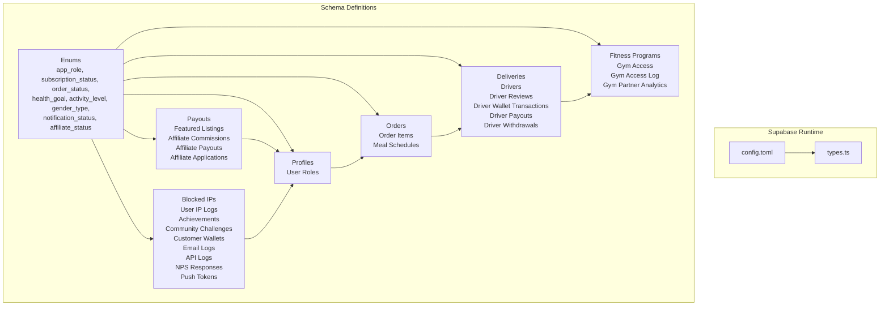
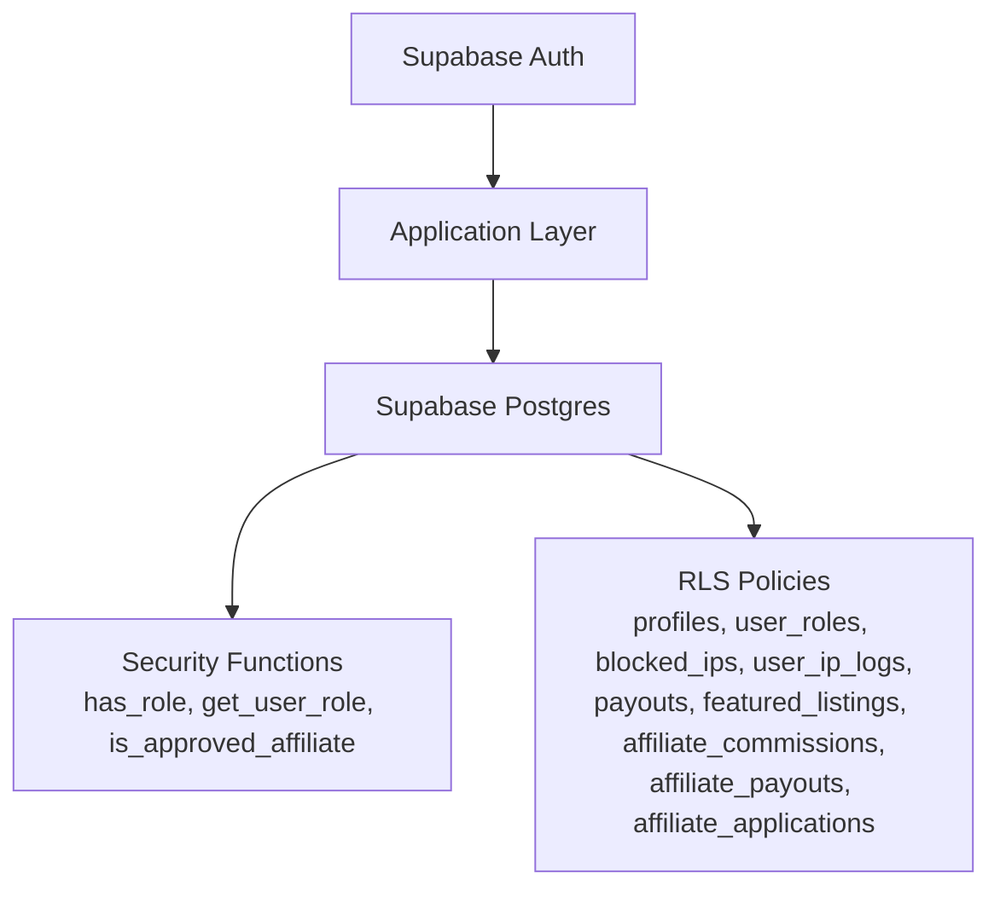
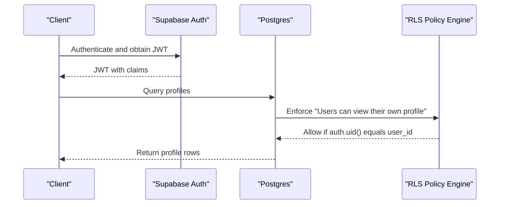
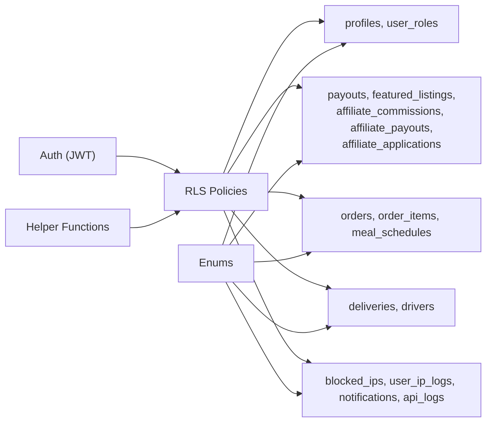

# Database Design

<cite>
**Referenced Files in This Document**
- [CREATE_TABLES_SQL.md](file://CREATE_TABLES_SQL.md)
- [fix_admin_tables.sql](file://fix_admin_tables.sql)
- [fix_homepage_errors.sql](file://fix_homepage_errors.sql)
- [supabase/config.toml](file://supabase/config.toml)
- [supabase/types.ts](file://supabase/types.ts)
- [src/integrations/supabase/types.ts](file://src/integrations/supabase/types.ts)
</cite>

## Table of Contents
1. [Introduction](#introduction)
2. [Project Structure](#project-structure)
3. [Core Components](#core-components)
4. [Architecture Overview](#architecture-overview)
5. [Detailed Component Analysis](#detailed-component-analysis)
6. [Dependency Analysis](#dependency-analysis)
7. [Performance Considerations](#performance-considerations)
8. [Troubleshooting Guide](#troubleshooting-guide)
9. [Conclusion](#conclusion)
10. [Appendices](#appendices)

## Introduction
This document provides comprehensive database design documentation for the Nutrio platform. It focuses on the Supabase-based schema, covering entity relationships among users, restaurants, orders, deliveries, and nutrition tracking. It also documents multi-tenancy via row-level security (RLS), helper functions, enums, indexes, and operational scripts. The content synthesizes information from migration and schema definition artifacts present in the repository to deliver a practical blueprint for developers, administrators, and stakeholders.

## Project Structure
The database layer is primarily defined by:
- Supabase configuration and function settings
- TypeScript-generated database types for client-side typing
- SQL scripts that define enums, tables, policies, indexes, and helper functions
- Operational fix scripts to reconcile schema drift and restore functionality

**Diagram sources**
- [supabase/config.toml:1-59](file://supabase/config.toml#L1-L59)
- [supabase/types.ts:1-800](file://supabase/types.ts#L1-L800)
- [CREATE_TABLES_SQL.md:5-31](file://CREATE_TABLES_SQL.md#L5-L31)
- [fix_admin_tables.sql:17-25](file://fix_admin_tables.sql#L17-L25)
- [fix_homepage_errors.sql:8-32](file://fix_homepage_errors.sql#L8-L32)

**Section sources**
- [supabase/config.toml:1-59](file://supabase/config.toml#L1-L59)
- [supabase/types.ts:1-800](file://supabase/types.ts#L1-L800)
- [CREATE_TABLES_SQL.md:1-221](file://CREATE_TABLES_SQL.md#L1-L221)
- [fix_admin_tables.sql:1-291](file://fix_admin_tables.sql#L1-L291)
- [fix_homepage_errors.sql:1-147](file://fix_homepage_errors.sql#L1-L147)

## Core Components
This section outlines the principal entities and their relationships, focusing on users, restaurants, orders, deliveries, and nutrition tracking.

- Users and Roles
  - profiles: stores personal and health metrics for authenticated users
  - user_roles: enforces multi-tenant roles per user (user, partner, admin)
  - Helper functions: has_role, get_user_role, is_approved_affiliate
  - RLS policies: enforce self-access for profiles and scoped access for roles

- Restaurants and Business
  - restaurants: restaurant metadata and approval lifecycle
  - payouts: partner/restaurant financial settlements
  - featured_listings: promotional packages with status and timing
  - affiliate_commissions and affiliate_payouts: referral economics
  - affiliate_applications: application lifecycle for affiliates

- Orders and Deliveries
  - orders and order_items: order lifecycle and items
  - meal_schedules: scheduled orders with delivery metadata
  - deliveries: delivery state machine and driver assignment
  - drivers and related entities: driver profiles, ratings, wallets, payouts, withdrawals

- Nutrition Tracking and Health
  - customer_wallets: user wallet balances
  - fitness programs, gym access, gym access log, gym partner analytics: fitness ecosystem
  - achievements, community_challenges: gamification and progress

- Security and Monitoring
  - blocked_ips and user_ip_logs: IP management and audit
  - email_logs, api_logs, nps_responses, push_tokens: communications and telemetry

**Section sources**
- [CREATE_TABLES_SQL.md:33-137](file://CREATE_TABLES_SQL.md#L33-L137)
- [CREATE_TABLES_SQL.md:139-191](file://CREATE_TABLES_SQL.md#L139-L191)
- [fix_admin_tables.sql:38-71](file://fix_admin_tables.sql#L38-L71)
- [fix_admin_tables.sql:72-124](file://fix_admin_tables.sql#L72-L124)
- [fix_admin_tables.sql:126-161](file://fix_admin_tables.sql#L126-L161)
- [fix_admin_tables.sql:162-201](file://fix_admin_tables.sql#L162-L201)
- [fix_admin_tables.sql:202-255](file://fix_admin_tables.sql#L202-L255)
- [fix_homepage_errors.sql:38-63](file://fix_homepage_errors.sql#L38-L63)
- [fix_homepage_errors.sql:83-131](file://fix_homepage_errors.sql#L83-L131)

## Architecture Overview
The database architecture centers on:
- Supabase Auth for identity and JWT verification
- Postgres enums and typed tables for domain correctness
- Row-level security (RLS) policies for tenant isolation and access control
- Helper functions for role checks and affiliate status
- Operational scripts to backfill missing columns and reconcile schema

**Diagram sources**
- [supabase/config.toml:1-59](file://supabase/config.toml#L1-L59)
- [CREATE_TABLES_SQL.md:58-96](file://CREATE_TABLES_SQL.md#L58-L96)
- [fix_admin_tables.sql:257-271](file://fix_admin_tables.sql#L257-L271)

**Section sources**
- [supabase/config.toml:1-59](file://supabase/config.toml#L1-L59)
- [CREATE_TABLES_SQL.md:58-96](file://CREATE_TABLES_SQL.md#L58-L96)
- [fix_admin_tables.sql:257-271](file://fix_admin_tables.sql#L257-L271)

## Detailed Component Analysis

### Entity Relationship Model
The ER model groups core entities and their relationships across users, restaurants, orders, deliveries, and nutrition tracking.

```mermaid
erDiagram
USERS {
uuid id PK
uuid auth_users_id FK
string full_name
string avatar_url
enum gender
int age
numeric height_cm
numeric current_weight_kg
numeric target_weight_kg
enum health_goal
enum activity_level
int daily_calorie_target
int protein_target_g
int carbs_target_g
int fat_target_g
bool onboarding_completed
timestamptz created_at
timestamptz updated_at
}
USER_ROLES {
uuid id PK
uuid user_id FK
enum role
timestamptz created_at
}
RESTAURANTS {
uuid id PK
uuid owner_id FK
string name
string description
string address
string phone
string email
numeric rating
int total_orders
enum approval_status
timestamptz created_at
timestamptz updated_at
}
MEALS {
uuid id PK
uuid restaurant_id FK
string name
text description
numeric price
enum category
bool is_available
int order_count
bool is_vip_exclusive
timestamptz created_at
timestamptz updated_at
}
ORDERS {
uuid id PK
uuid user_id FK
uuid restaurant_id FK
enum status
numeric total_price
date delivery_date
enum meal_type
timestamptz created_at
timestamptz updated_at
}
ORDER_ITEMS {
uuid id PK
uuid order_id FK
uuid meal_id FK
int quantity
numeric unit_price
}
MEAL_SCHEDULES {
uuid id PK
uuid user_id FK
uuid meal_id FK
date scheduled_date
enum meal_type
enum order_status
numeric addons_total
numeric delivery_fee
enum delivery_type
uuid restaurant_id FK
bool is_completed
timestamptz created_at
timestamptz updated_at
}
DELIVERIES {
uuid id PK
uuid order_id FK
uuid driver_id FK
uuid restaurant_id FK
uuid schedule_id FK
uuid user_id FK
enum status
string delivery_address
string pickup_address
numeric delivery_fee
numeric tip_amount
numeric delivery_lat
numeric delivery_lng
string delivery_notes
string delivery_photo_url
timestamptz claimed_at
timestamptz picked_up_at
timestamptz delivered_at
timestamptz created_at
timestamptz updated_at
}
DRIVERS {
uuid id PK
uuid user_id FK
enum approval_status
numeric rating
int total_deliveries
bool is_online
string license_number
string vehicle_make
string vehicle_model
string vehicle_plate
enum vehicle_type
numeric wallet_balance
numeric current_lat
numeric current_lng
timestamptz created_at
timestamptz updated_at
}
CUSTOMER_WALLETS {
uuid id PK
uuid user_id FK
numeric balance
numeric total_credits
numeric total_debits
bool is_active
timestamptz created_at
timestamptz updated_at
}
BLOCKED_IPS {
uuid id PK
inet ip_address UK
text reason
uuid blocked_by FK
bool is_active
timestamptz created_at
timestamptz updated_at
}
USER_IP_LOGS {
uuid id PK
uuid user_id FK
inet ip_address
text country_code
text country_name
text city
enum action
text user_agent
timestamptz created_at
}
```

**Diagram sources**
- [CREATE_TABLES_SQL.md:33-137](file://CREATE_TABLES_SQL.md#L33-L137)
- [CREATE_TABLES_SQL.md:139-191](file://CREATE_TABLES_SQL.md#L139-L191)
- [fix_admin_tables.sql:38-71](file://fix_admin_tables.sql#L38-L71)
- [fix_homepage_errors.sql:83-131](file://fix_homepage_errors.sql#L83-L131)

**Section sources**
- [CREATE_TABLES_SQL.md:33-137](file://CREATE_TABLES_SQL.md#L33-L137)
- [CREATE_TABLES_SQL.md:139-191](file://CREATE_TABLES_SQL.md#L139-L191)
- [fix_admin_tables.sql:38-71](file://fix_admin_tables.sql#L38-L71)
- [fix_homepage_errors.sql:83-131](file://fix_homepage_errors.sql#L83-L131)

### Multi-Tenant Data Model and RLS Policies
- Tenant isolation is achieved via:
  - user_roles table linking auth.users to tenant-specific roles
  - has_role and get_user_role helper functions for role checks
  - RLS policies enforcing per-user visibility and administrative oversight
- Key policy scopes:
  - profiles: users can view/update their own profile; admins can view all
  - user_roles: users see own roles; admins manage roles
  - blocked_ips and user_ip_logs: admin-only management and read; users can log IPs
  - payouts, featured_listings, affiliate_commissions, affiliate_payouts, affiliate_applications: tenant-scoped access with admin oversight

**Diagram sources**
- [CREATE_TABLES_SQL.md:123-137](file://CREATE_TABLES_SQL.md#L123-L137)
- [CREATE_TABLES_SQL.md:47-56](file://CREATE_TABLES_SQL.md#L47-L56)

**Section sources**
- [CREATE_TABLES_SQL.md:47-56](file://CREATE_TABLES_SQL.md#L47-L56)
- [CREATE_TABLES_SQL.md:123-137](file://CREATE_TABLES_SQL.md#L123-L137)
- [CREATE_TABLES_SQL.md:173-191](file://CREATE_TABLES_SQL.md#L173-L191)
- [fix_admin_tables.sql:56-65](file://fix_admin_tables.sql#L56-L65)
- [fix_admin_tables.sql:88-119](file://fix_admin_tables.sql#L88-L119)
- [fix_admin_tables.sql:143-160](file://fix_admin_tables.sql#L143-L160)
- [fix_admin_tables.sql:177-200](file://fix_admin_tables.sql#L177-L200)
- [fix_admin_tables.sql:227-250](file://fix_admin_tables.sql#L227-L250)

### Enums and Domain Types
Common enums include:
- app_role: user, partner, admin
- subscription_status: active, cancelled, expired, pending
- subscription_plan: weekly, monthly
- order_status: pending, confirmed, preparing, delivered, cancelled
- approval_status: pending, approved, rejected
- health_goal: lose, gain, maintain
- activity_level: sedentary, light, moderate, active, very_active
- gender_type: male, female
- notification_status: unread, read, archived
- affiliate_status: pending, approved, rejected

These enums are defined in SQL and reflected in generated types for client-side safety.

**Section sources**
- [CREATE_TABLES_SQL.md:5-31](file://CREATE_TABLES_SQL.md#L5-L31)
- [fix_admin_tables.sql:17-24](file://fix_admin_tables.sql#L17-L24)
- [fix_admin_tables.sql:203-209](file://fix_admin_tables.sql#L203-L209)
- [fix_homepage_errors.sql:65-77](file://fix_homepage_errors.sql#L65-L77)
- [supabase/types.ts:1-800](file://supabase/types.ts#L1-L800)

### Helper Functions and Security Functions
- has_role: checks if a user possesses a given role
- get_user_role: returns a user’s primary role
- is_approved_affiliate: validates affiliate application status
- update_updated_at_column: reusable trigger for updated_at timestamps

These functions underpin RLS enforcement and operational consistency.

**Section sources**
- [CREATE_TABLES_SQL.md:58-96](file://CREATE_TABLES_SQL.md#L58-L96)
- [fix_admin_tables.sql:257-271](file://fix_admin_tables.sql#L257-L271)
- [fix_admin_tables.sql:6-15](file://fix_admin_tables.sql#L6-L15)

### Indexing Strategies and Performance Optimizations
Indexes present or recommended:
- Blocked IPs: ip_address, is_active
- User IP Logs: user_id, ip_address, created_at desc
- Payouts: partner_id, status, created_at desc
- Featured Listings: restaurant_id, status
- Affiliate Commissions: user_id, status
- Affiliate Payouts: user_id, status
- Affiliate Applications: user_id, status
- Notifications: status
- Meal Schedules: order_status, restaurant_id

These indexes optimize common queries for admin dashboards, audit logs, and scheduling workflows.

**Section sources**
- [CREATE_TABLES_SQL.md:166-172](file://CREATE_TABLES_SQL.md#L166-L172)
- [fix_admin_tables.sql:273-285](file://fix_admin_tables.sql#L273-L285)
- [fix_homepage_errors.sql:47-48](file://fix_homepage_errors.sql#L47-L48)
- [fix_homepage_errors.sql:92-93](file://fix_homepage_errors.sql#L92-L93)
- [fix_homepage_errors.sql:129-130](file://fix_homepage_errors.sql#L129-L130)

### Data Lifecycle Management
- Soft delete patterns: absence of explicit deleted_at columns indicates hard deletes or cascade behavior on referenced tables
- Audit trails: created_at and updated_at timestamps on most tables; user_ip_logs and api_logs capture temporal events
- Operational scripts:
  - fix_admin_tables.sql: backfills missing columns and creates missing tables for admin dashboards
  - fix_homepage_errors.sql: adds enum values and columns to resolve runtime errors

**Section sources**
- [fix_admin_tables.sql:26-36](file://fix_admin_tables.sql#L26-L36)
- [fix_homepage_errors.sql:83-131](file://fix_homepage_errors.sql#L83-L131)
- [CREATE_TABLES_SQL.md:140-191](file://CREATE_TABLES_SQL.md#L140-L191)

### Sample Data Structures
Representative row shapes are defined in generated types and SQL DDL. These include:
- profiles: personal and health metrics
- user_roles: role assignments
- blocked_ips and user_ip_logs: IP management entries
- payouts, featured_listings, affiliate_commissions, affiliate_payouts, affiliate_applications: business lifecycle records
- orders, order_items, meal_schedules: ordering pipeline
- deliveries, drivers: delivery operations
- customer_wallets: wallet balances

**Section sources**
- [supabase/types.ts:16-800](file://supabase/types.ts#L16-L800)
- [CREATE_TABLES_SQL.md:33-137](file://CREATE_TABLES_SQL.md#L33-L137)
- [CREATE_TABLES_SQL.md:139-191](file://CREATE_TABLES_SQL.md#L139-L191)
- [fix_admin_tables.sql:38-71](file://fix_admin_tables.sql#L38-L71)
- [fix_homepage_errors.sql:38-63](file://fix_homepage_errors.sql#L38-L63)

## Dependency Analysis
The database schema exhibits layered dependencies:
- Auth and RLS drive access control across tables
- Helper functions enable policy evaluation
- Enums unify domain semantics across tables
- Operational scripts depend on Postgres capabilities (enums, indexes, triggers)

**Diagram sources**
- [supabase/config.toml:1-59](file://supabase/config.toml#L1-L59)
- [CREATE_TABLES_SQL.md:58-96](file://CREATE_TABLES_SQL.md#L58-L96)
- [fix_admin_tables.sql:257-271](file://fix_admin_tables.sql#L257-L271)
- [CREATE_TABLES_SQL.md:5-31](file://CREATE_TABLES_SQL.md#L5-L31)

**Section sources**
- [supabase/config.toml:1-59](file://supabase/config.toml#L1-L59)
- [CREATE_TABLES_SQL.md:5-31](file://CREATE_TABLES_SQL.md#L5-L31)
- [CREATE_TABLES_SQL.md:58-96](file://CREATE_TABLES_SQL.md#L58-L96)
- [fix_admin_tables.sql:257-271](file://fix_admin_tables.sql#L257-L271)

## Performance Considerations
- Prefer selective filtering on indexed columns (e.g., status, created_at desc)
- Use enums to reduce storage and improve query performance
- Keep RLS policies minimal and efficient; leverage helper functions
- Batch updates and avoid unnecessary writes to reduce WAL pressure
- Monitor long-running queries and add targeted indexes as needed

[No sources needed since this section provides general guidance]

## Troubleshooting Guide
Common issues and resolutions:
- Missing enum values or columns:
  - Apply fix_homepage_errors.sql to add notification_type values and ensure required columns exist
- Admin dashboard 404/400 errors:
  - Run fix_admin_tables.sql to create missing tables and policies
- IP blocking not working:
  - Verify blocked_ips and user_ip_logs RLS policies and indexes
- Role-based access discrepancies:
  - Confirm has_role and get_user_role functions and user_roles uniqueness constraints

**Section sources**
- [fix_homepage_errors.sql:1-147](file://fix_homepage_errors.sql#L1-L147)
- [fix_admin_tables.sql:1-291](file://fix_admin_tables.sql#L1-L291)
- [CREATE_TABLES_SQL.md:173-191](file://CREATE_TABLES_SQL.md#L173-L191)

## Conclusion
The Nutrio database design leverages Supabase Auth, Postgres enums, and RLS to implement a secure, multi-tenant schema. The ER model covers users, restaurants, orders, deliveries, and nutrition tracking, with supporting business and security tables. Operational scripts address schema drift and restore functionality. Adhering to the outlined policies, indexes, and helper functions ensures scalable and maintainable operations.

[No sources needed since this section summarizes without analyzing specific files]

## Appendices

### Appendix A: Enum Definitions
- app_role: user, partner, admin
- subscription_status: active, cancelled, expired, pending
- subscription_plan: weekly, monthly
- order_status: pending, confirmed, preparing, delivered, cancelled
- approval_status: pending, approved, rejected
- health_goal: lose, gain, maintain
- activity_level: sedentary, light, moderate, active, very_active
- gender_type: male, female
- notification_status: unread, read, archived
- affiliate_status: pending, approved, rejected

**Section sources**
- [CREATE_TABLES_SQL.md:5-31](file://CREATE_TABLES_SQL.md#L5-L31)
- [fix_admin_tables.sql:17-24](file://fix_admin_tables.sql#L17-L24)
- [fix_admin_tables.sql:203-209](file://fix_admin_tables.sql#L203-L209)
- [fix_homepage_errors.sql:65-77](file://fix_homepage_errors.sql#L65-L77)

### Appendix B: Generated Types Reference
The client-side types reflect the database schema and relationships. Use these for type-safe queries and UI components.

**Section sources**
- [supabase/types.ts:1-800](file://supabase/types.ts#L1-L800)
- [src/integrations/supabase/types.ts](file://src/integrations/supabase/types.ts)