# Entity Relationship Diagram

<cite>
**Referenced Files in This Document**
- [CREATE_TABLES_SQL.md](file://CREATE_TABLES_SQL.md)
- [types.ts](file://supabase/types.ts)
- [20240101000000_add_notification_preferences.sql](file://supabase/migrations/20240101000000_add_notification_preferences.sql)
- [20240101000001_add_nps_responses.sql](file://supabase/migrations/20240101000001_add_nps_responses.sql)
- [20240101000002_add_cancel_order_rpc.sql](file://supabase/migrations/20240101000002_add_cancel_order_rpc.sql)
- [20240101000003_add_delivery_queue.sql](file://supabase/migrations/20240101000003_add_delivery_queue.sql)
- [20240101_driver_app.sql](file://supabase/migrations/20240101_driver_app.sql)
- [20240102_driver_integration.sql](file://supabase/migrations/20240102_driver_integration.sql)
- [20240103_whatsapp_notifications.sql](file://supabase/migrations/20240103_whatsapp_notifications.sql)
- [20250218000001_add_performance_indexes.sql](file://supabase/migrations/20250218000001_add_performance_indexes.sql)
- [20250218000002_rls_audit_and_policies.sql](file://supabase/migrations/20250218000002_rls_audit_and_policies.sql)
</cite>

## Table of Contents
1. [Introduction](#introduction)
2. [Project Structure](#project-structure)
3. [Core Components](#core-components)
4. [Architecture Overview](#architecture-overview)
5. [Detailed Component Analysis](#detailed-component-analysis)
6. [Dependency Analysis](#dependency-analysis)
7. [Performance Considerations](#performance-considerations)
8. [Troubleshooting Guide](#troubleshooting-guide)
9. [Conclusion](#conclusion)

## Introduction
This document presents a comprehensive Entity Relationship Diagram (ERD) for the Nutrio database schema, focusing on the core business domains: users, restaurants, orders, deliveries, nutrition tracking, and subscription management. It documents table relationships, foreign key constraints, referential integrity rules, and the multi-tenant architecture with role-based access patterns. The ERD also explains how customer orders connect to restaurant menus, how driver assignments relate to delivery routes, and how nutrition data connects to user profiles.

## Project Structure
The database schema is primarily defined through Supabase migrations and TypeScript type definitions. The migrations establish tables, enums, indexes, Row Level Security (RLS) policies, and helper functions. The TypeScript types provide a strongly-typed view of the database schema for the frontend and backend.

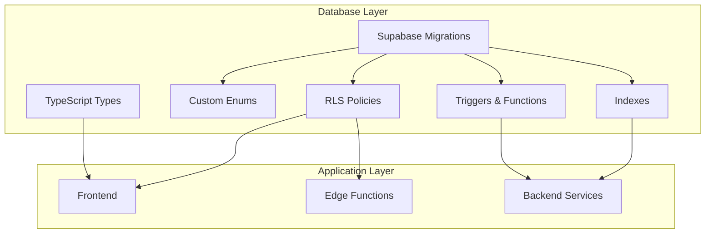

**Diagram sources**
- [20240101000000_add_notification_preferences.sql:1-170](file://supabase/migrations/20240101000000_add_notification_preferences.sql#L1-L170)
- [20240101000001_add_nps_responses.sql:1-234](file://supabase/migrations/20240101000001_add_nps_responses.sql#L1-L234)
- [20240101000002_add_cancel_order_rpc.sql:1-393](file://supabase/migrations/20240101000002_add_cancel_order_rpc.sql#L1-L393)
- [20240101000003_add_delivery_queue.sql:1-595](file://supabase/migrations/20240101000003_add_delivery_queue.sql#L1-L595)
- [20240101_driver_app.sql:1-270](file://supabase/migrations/20240101_driver_app.sql#L1-L270)
- [20240102_driver_integration.sql:1-232](file://supabase/migrations/20240102_driver_integration.sql#L1-L232)
- [20240103_whatsapp_notifications.sql:1-343](file://supabase/migrations/20240103_whatsapp_notifications.sql#L1-L343)
- [20250218000001_add_performance_indexes.sql:1-73](file://supabase/migrations/20250218000001_add_performance_indexes.sql#L1-L73)
- [20250218000002_rls_audit_and_policies.sql:1-356](file://supabase/migrations/20250218000002_rls_audit_and_policies.sql#L1-L356)
- [types.ts:1-800](file://supabase/types.ts#L1-L800)

**Section sources**
- [CREATE_TABLES_SQL.md:1-221](file://CREATE_TABLES_SQL.md#L1-L221)
- [types.ts:1-800](file://supabase/types.ts#L1-L800)

## Core Components
This section outlines the major entities and their attributes, focusing on the core business domains.

### Users and Authentication
- auth.users: Supabase authentication table referenced by profiles and other entities.
- profiles: User profile data with personal information, goals, and targets.
- user_roles: Role assignment for multi-tenant access control (user, partner, admin).
- has_role(): Security function to check user roles.
- get_user_role(): Function to determine a user's effective role.

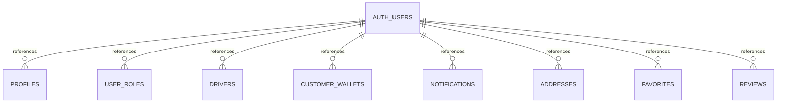

**Diagram sources**
- [20240101_driver_app.sql:35-53](file://supabase/migrations/20240101_driver_app.sql#L35-L53)
- [20240102_driver_integration.sql:12-34](file://supabase/migrations/20240102_driver_integration.sql#L12-L34)
- [20240101000000_add_notification_preferences.sql:45-56](file://supabase/migrations/20240101000000_add_notification_preferences.sql#L45-L56)
- [20240101000001_add_nps_responses.sql:9-14](file://supabase/migrations/20240101000001_add_nps_responses.sql#L9-L14)

**Section sources**
- [CREATE_TABLES_SQL.md:33-96](file://CREATE_TABLES_SQL.md#L33-L96)
- [20240101_driver_app.sql:35-53](file://supabase/migrations/20240101_driver_app.sql#L35-L53)
- [20240102_driver_integration.sql:12-34](file://supabase/migrations/20240102_driver_integration.sql#L12-L34)
- [20240101000000_add_notification_preferences.sql:45-56](file://supabase/migrations/20240101000000_add_notification_preferences.sql#L45-L56)

### Restaurants and Menus
- restaurants: Restaurant information, approval status, and ownership.
- meals: Menu items linked to restaurants with dietary tags and pricing.
- meal_schedules: Scheduled meal orders with status tracking.

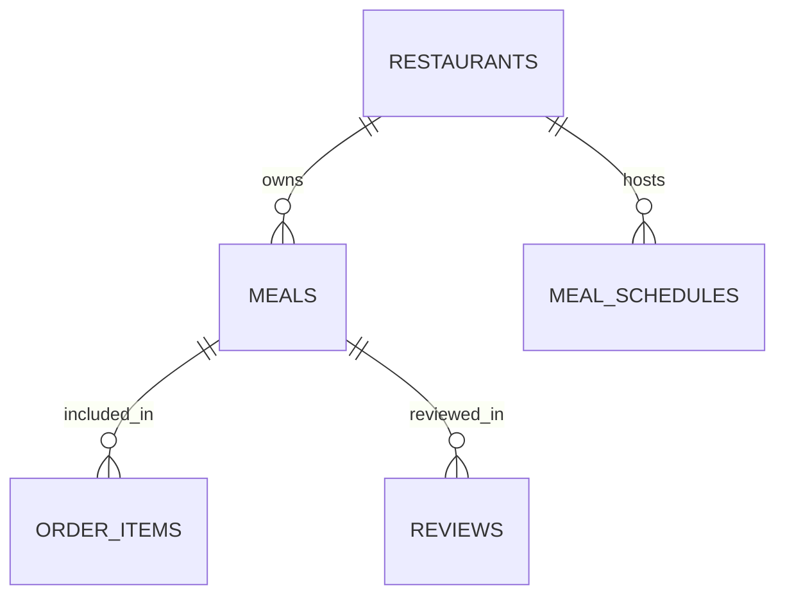

**Diagram sources**
- [20240101_driver_app.sql:55-77](file://supabase/migrations/20240101_driver_app.sql#L55-L77)
- [20240102_driver_integration.sql:36-45](file://supabase/migrations/20240102_driver_integration.sql#L36-L45)
- [20240101000001_add_nps_responses.sql:12-13](file://supabase/migrations/20240101000001_add_nps_responses.sql#L12-L13)

**Section sources**
- [20240101_driver_app.sql:55-77](file://supabase/migrations/20240101_driver_app.sql#L55-L77)
- [20240102_driver_integration.sql:36-45](file://supabase/migrations/20240102_driver_integration.sql#L36-L45)

### Orders and Delivery
- orders: Customer orders with status, totals, and delivery details.
- order_items: Line items for each order.
- deliveries: Delivery records with driver assignments and status.
- delivery_queue: Queue for driver assignment with priority scoring.
- drivers: Driver profiles, availability, and ratings.
- driver_payouts: Driver payment records.

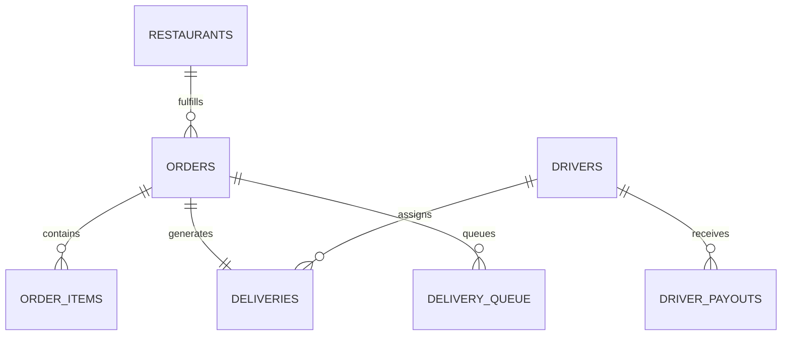

**Diagram sources**
- [20240102_driver_integration.sql:12-45](file://supabase/migrations/20240102_driver_integration.sql#L12-L45)
- [20240101000003_add_delivery_queue.sql:9-60](file://supabase/migrations/20240101000003_add_delivery_queue.sql#L9-L60)
- [20240101_driver_app.sql:35-92](file://supabase/migrations/20240101_driver_app.sql#L35-L92)

**Section sources**
- [20240102_driver_integration.sql:12-45](file://supabase/migrations/20240102_driver_integration.sql#L12-L45)
- [20240101000003_add_delivery_queue.sql:9-60](file://supabase/migrations/20240101000003_add_delivery_queue.sql#L9-L60)
- [20240101_driver_app.sql:35-92](file://supabase/migrations/20240101_driver_app.sql#L35-L92)

### Nutrition Tracking and Health
- profiles: Contains health goals, activity levels, and calorie targets.
- customer_wallets: User wallet balances for credits and debits.
- wallet_transactions: Transaction history for wallet operations.

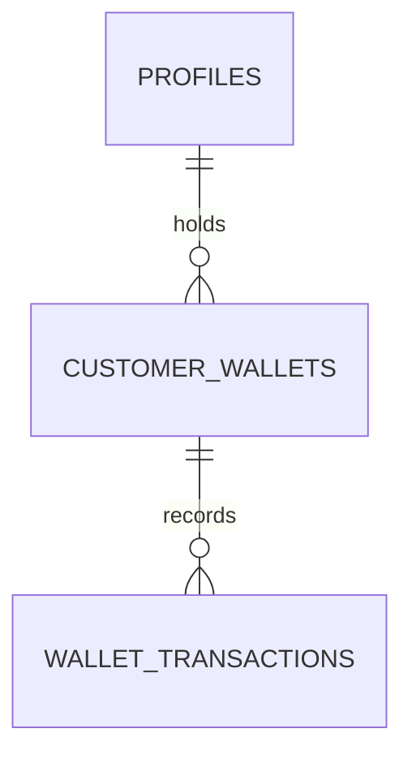

**Diagram sources**
- [20240102_driver_integration.sql:12-34](file://supabase/migrations/20240102_driver_integration.sql#L12-L34)
- [20240101000000_add_notification_preferences.sql:197-229](file://supabase/migrations/20240101000000_add_notification_preferences.sql#L197-L229)

**Section sources**
- [20240102_driver_integration.sql:12-34](file://supabase/migrations/20240102_driver_integration.sql#L12-L34)
- [20240101000000_add_notification_preferences.sql:197-229](file://supabase/migrations/20240101000000_add_notification_preferences.sql#L197-L229)

### Subscriptions and Payments
- subscriptions: User subscription plans, status, and usage tracking.
- order_cancellations: Audit log for cancellations with refunds and fees.
- cancel_order(): RPC function to cancel orders and process refunds.

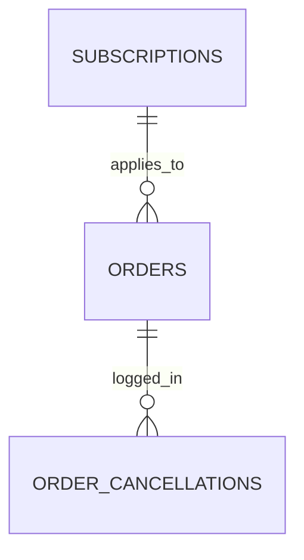

**Diagram sources**
- [20240101000002_add_cancel_order_rpc.sql:9-36](file://supabase/migrations/20240101000002_add_cancel_order_rpc.sql#L9-L36)
- [20240101000002_add_cancel_order_rpc.sql:64-267](file://supabase/migrations/20240101000002_add_cancel_order_rpc.sql#L64-L267)

**Section sources**
- [20240101000002_add_cancel_order_rpc.sql:9-36](file://supabase/migrations/20240101000002_add_cancel_order_rpc.sql#L9-L36)
- [20240101000002_add_cancel_order_rpc.sql:64-267](file://supabase/migrations/20240101000002_add_cancel_order_rpc.sql#L64-L267)

## Architecture Overview
The system follows a multi-tenant architecture with role-based access control enforced via Row Level Security (RLS). The database schema supports three primary roles: user, partner, and admin. The frontend and backend interact with the database through Supabase, leveraging RLS policies and helper functions to enforce data isolation and access patterns.

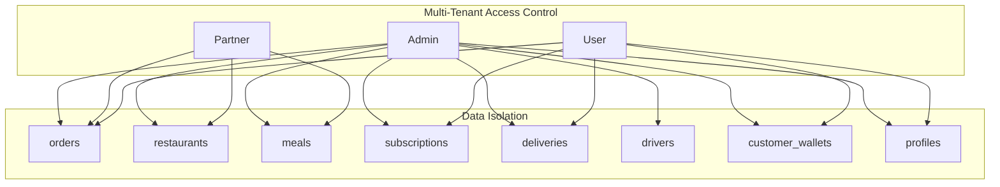

**Diagram sources**
- [20250218000002_rls_audit_and_policies.sql:46-96](file://supabase/migrations/20250218000002_rls_audit_and_policies.sql#L46-L96)
- [20250218000002_rls_audit_and_policies.sql:99-115](file://supabase/migrations/20250218000002_rls_audit_and_policies.sql#L99-L115)
- [20250218000002_rls_audit_and_policies.sql:118-143](file://supabase/migrations/20250218000002_rls_audit_and_policies.sql#L118-L143)
- [20250218000002_rls_audit_and_policies.sql:146-165](file://supabase/migrations/20250218000002_rls_audit_and_policies.sql#L146-L165)
- [20250218000002_rls_audit_and_policies.sql:168-203](file://supabase/migrations/20250218000002_rls_audit_and_policies.sql#L168-L203)

**Section sources**
- [20250218000002_rls_audit_and_policies.sql:46-203](file://supabase/migrations/20250218000002_rls_audit_and_policies.sql#L46-L203)

## Detailed Component Analysis

### Orders and Delivery Flow
This sequence illustrates how customer orders connect to restaurant menus and how driver assignments relate to delivery routes.

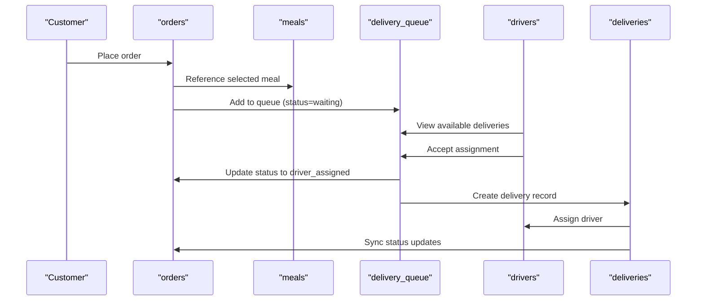

**Diagram sources**
- [20240102_driver_integration.sql:115-182](file://supabase/migrations/20240102_driver_integration.sql#L115-L182)
- [20240101000003_add_delivery_queue.sql:148-257](file://supabase/migrations/20240101000003_add_delivery_queue.sql#L148-L257)
- [20240101_driver_app.sql:182-218](file://supabase/migrations/20240101_driver_app.sql#L182-L218)

**Section sources**
- [20240102_driver_integration.sql:115-182](file://supabase/migrations/20240102_driver_integration.sql#L115-L182)
- [20240101000003_add_delivery_queue.sql:148-257](file://supabase/migrations/20240101000003_add_delivery_queue.sql#L148-L257)
- [20240101_driver_app.sql:182-218](file://supabase/migrations/20240101_driver_app.sql#L182-L218)

### Order Cancellation and Refund Process
This flow demonstrates the cancellation workflow, including refund processing and quota restoration.

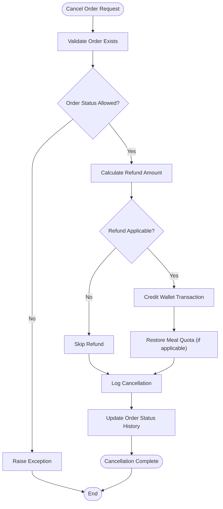

**Diagram sources**
- [20240101000002_add_cancel_order_rpc.sql:64-267](file://supabase/migrations/20240101000002_add_cancel_order_rpc.sql#L64-L267)

**Section sources**
- [20240101000002_add_cancel_order_rpc.sql:64-267](file://supabase/migrations/20240101000002_add_cancel_order_rpc.sql#L64-L267)

### Driver Assignment and Delivery Route
This sequence shows how drivers are assigned to deliveries and how delivery statuses propagate back to orders.

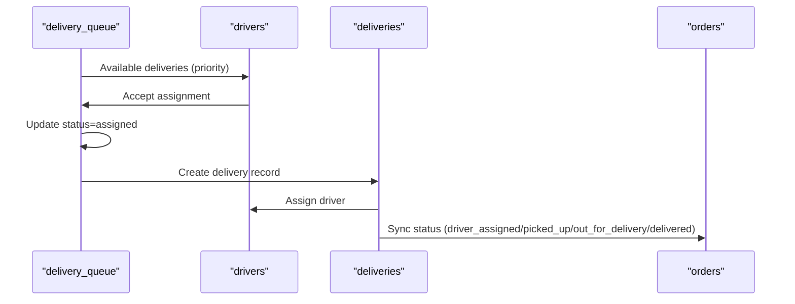

**Diagram sources**
- [20240101000003_add_delivery_queue.sql:211-328](file://supabase/migrations/20240101000003_add_delivery_queue.sql#L211-L328)
- [20240102_driver_integration.sql:184-224](file://supabase/migrations/20240102_driver_integration.sql#L184-L224)

**Section sources**
- [20240101000003_add_delivery_queue.sql:211-328](file://supabase/migrations/20240101000003_add_delivery_queue.sql#L211-L328)
- [20240102_driver_integration.sql:184-224](file://supabase/migrations/20240102_driver_integration.sql#L184-L224)

### Nutrition Data and User Profiles
This diagram shows how nutrition data connects to user profiles and how wallet transactions reflect financial activities related to nutrition goals and subscriptions.

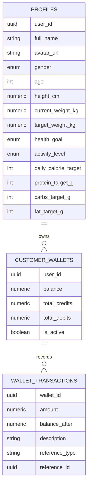

**Diagram sources**
- [20240101000000_add_notification_preferences.sql:197-229](file://supabase/migrations/20240101000000_add_notification_preferences.sql#L197-L229)
- [20240102_driver_integration.sql:12-34](file://supabase/migrations/20240102_driver_integration.sql#L12-L34)

**Section sources**
- [20240101000000_add_notification_preferences.sql:197-229](file://supabase/migrations/20240101000000_add_notification_preferences.sql#L197-L229)
- [20240102_driver_integration.sql:12-34](file://supabase/migrations/20240102_driver_integration.sql#L12-L34)

## Dependency Analysis
This section analyzes dependencies between components, highlighting foreign key relationships and referential integrity rules.

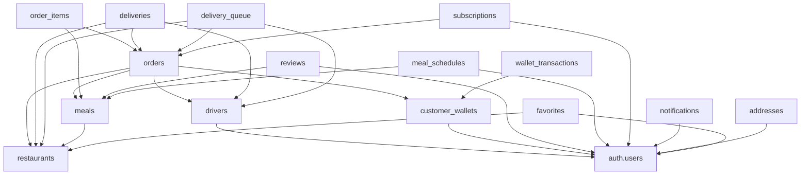

**Diagram sources**
- [20240102_driver_integration.sql:12-45](file://supabase/migrations/20240102_driver_integration.sql#L12-L45)
- [20240101000003_add_delivery_queue.sql:9-60](file://supabase/migrations/20240101000003_add_delivery_queue.sql#L9-L60)
- [20240101_driver_app.sql:35-92](file://supabase/migrations/20240101_driver_app.sql#L35-L92)
- [20240101000001_add_nps_responses.sql:9-49](file://supabase/migrations/20240101000001_add_nps_responses.sql#L9-L49)

**Section sources**
- [20240102_driver_integration.sql:12-45](file://supabase/migrations/20240102_driver_integration.sql#L12-L45)
- [20240101000003_add_delivery_queue.sql:9-60](file://supabase/migrations/20240101000003_add_delivery_queue.sql#L9-L60)
- [20240101_driver_app.sql:35-92](file://supabase/migrations/20240101_driver_app.sql#L35-L92)
- [20240101000001_add_nps_responses.sql:9-49](file://supabase/migrations/20240101000001_add_nps_responses.sql#L9-L49)

## Performance Considerations
- Indexes: Strategic indexes are created on frequently queried columns to optimize performance for orders, subscriptions, meals, and analytics.
- Partial Indexes: Partial indexes target common query patterns (e.g., active subscriptions, pending orders) to reduce index size and improve query performance.
- Triggers: Triggers update timestamps and synchronize status changes between orders and deliveries, ensuring data consistency while adding overhead.

**Section sources**
- [20250218000001_add_performance_indexes.sql:4-73](file://supabase/migrations/20250218000001_add_performance_indexes.sql#L4-L73)

## Troubleshooting Guide
- RLS Policies: Verify that RLS is enabled on all tables and that policies align with expected access patterns. Use verification queries to audit policies and missing RLS configurations.
- Role-Based Access: Confirm that the has_role() and get_user_role() functions are functioning correctly and that role checks are enforced consistently across the application.
- Delivery Queue: Monitor the delivery_queue table for stuck assignments and ensure that priority scoring and driver matching logic are working as expected.
- Order Cancellations: Validate that the cancel_order() RPC handles all scenarios correctly, including refund processing and quota restoration.

**Section sources**
- [20250218000002_rls_audit_and_policies.sql:272-355](file://supabase/migrations/20250218000002_rls_audit_and_policies.sql#L272-L355)
- [20240101000002_add_cancel_order_rpc.sql:64-267](file://supabase/migrations/20240101000002_add_cancel_order_rpc.sql#L64-L267)
- [20240101000003_add_delivery_queue.sql:148-257](file://supabase/migrations/20240101000003_add_delivery_queue.sql#L148-L257)

## Conclusion
The Nutrio database schema is designed around a multi-tenant architecture with robust role-based access control and clear entity relationships. The ERD highlights how orders connect to restaurants and menus, how driver assignments relate to delivery routes, and how nutrition data integrates with user profiles and wallet transactions. The schema leverages Supabase's Row Level Security, custom enums, and helper functions to enforce data isolation and access patterns, while strategic indexing ensures performance at scale.