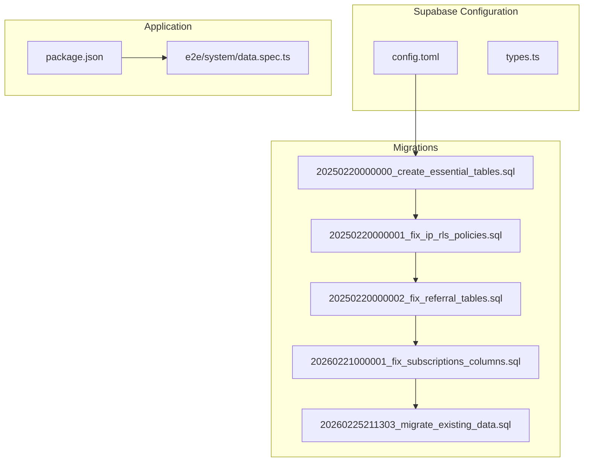
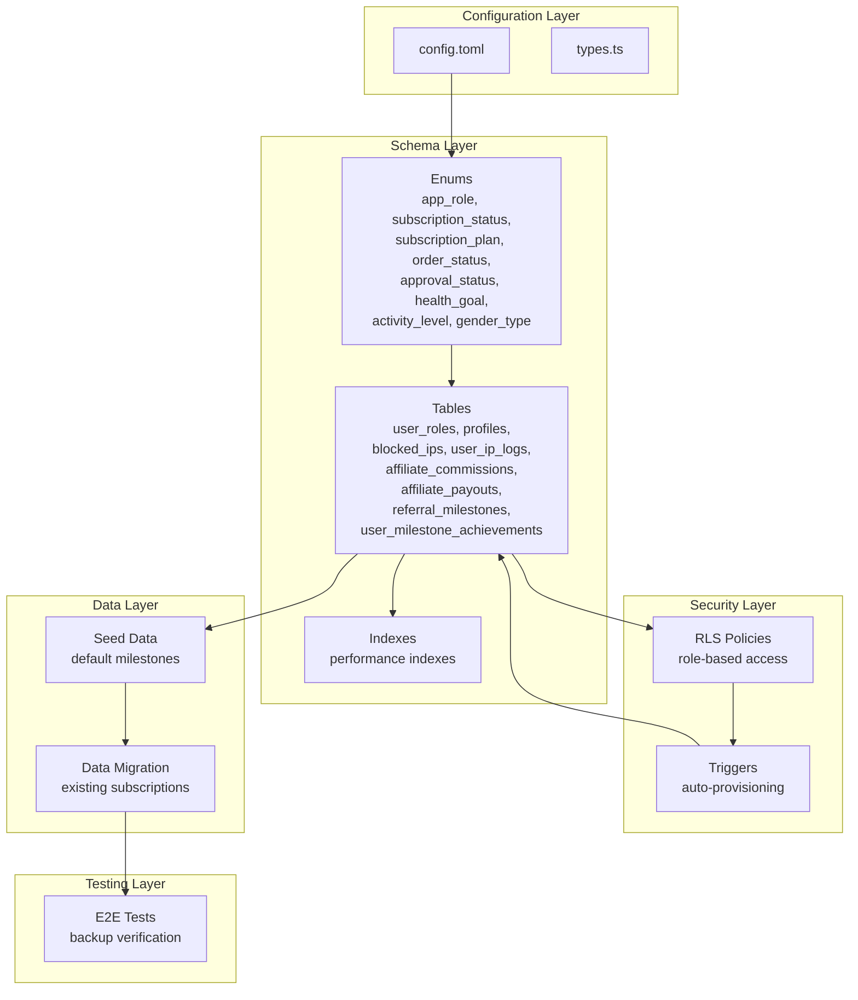
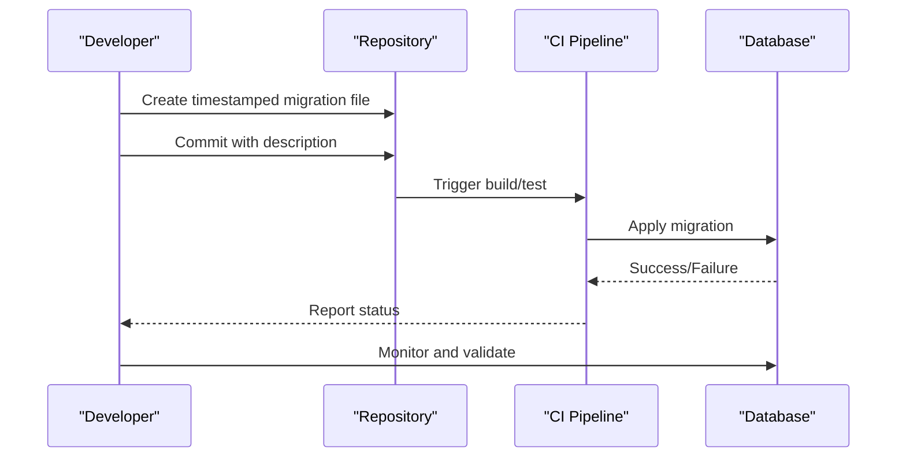
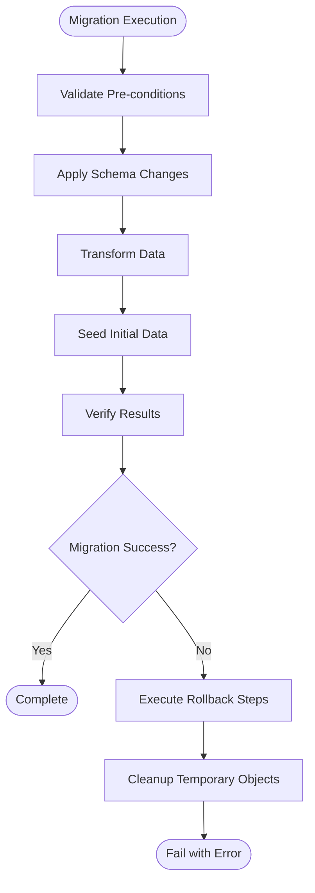
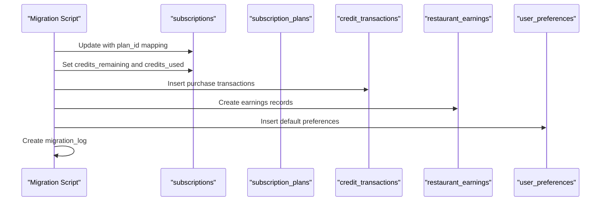
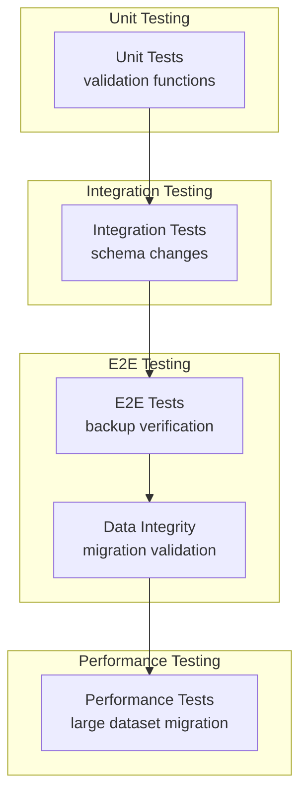
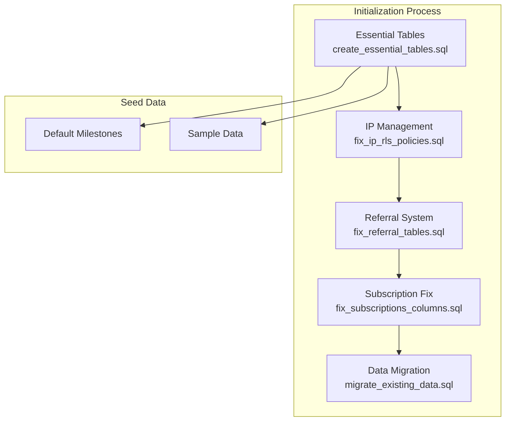
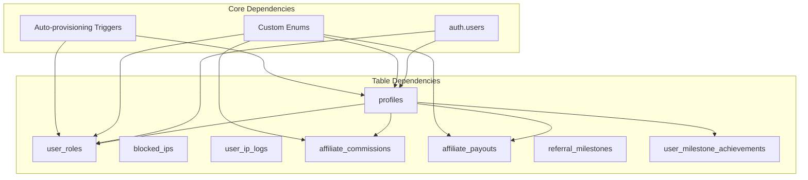

# Migration Management

<cite>
**Referenced Files in This Document**
- [STRUCTURE.md](file://.planning/codebase/STRUCTURE.md)
- [config.toml](file://supabase/config.toml)
- [20250220000000_create_essential_tables.sql](file://supabase/migrations/20250220000000_create_essential_tables.sql)
- [20250220000001_fix_ip_rls_policies.sql](file://supabase/migrations/20250220000001_fix_ip_rls_policies.sql)
- [20250220000002_fix_referral_tables.sql](file://supabase/migrations/20250220000002_fix_referral_tables.sql)
- [20260221000001_fix_subscriptions_columns.sql](file://supabase/migrations/20260221000001_fix_subscriptions_columns.sql)
- [20260225211303_migrate_existing_data.sql](file://supabase/migrations/20260225211303_migrate_existing_data.sql)
- [package.json](file://package.json)
- [data.spec.ts](file://e2e/system/data.spec.ts)
</cite>

## Table of Contents
1. [Introduction](#introduction)
2. [Project Structure](#project-structure)
3. [Core Components](#core-components)
4. [Architecture Overview](#architecture-overview)
5. [Detailed Component Analysis](#detailed-component-analysis)
6. [Dependency Analysis](#dependency-analysis)
7. [Performance Considerations](#performance-considerations)
8. [Troubleshooting Guide](#troubleshooting-guide)
9. [Conclusion](#conclusion)
10. [Appendices](#appendices)

## Introduction
This document provides comprehensive migration management guidance for the Nutrio project. It covers the migration lifecycle, version control approach, rollback procedures, data transformations, schema changes, backward compatibility, best practices, testing strategies, deployment automation, and the relationship between migration files and database initialization including seed data and initial configurations.

## Project Structure
The migration system is organized under the Supabase configuration and follows a strict chronological versioning scheme. The structure includes:
- Supabase configuration and migrations directory
- Versioned SQL migration files named with timestamps
- Supporting configuration for local development
- Automated testing coverage for data-related functionality

**Diagram sources**
- [STRUCTURE.md:267-300](file://.planning/codebase/STRUCTURE.md#L267-L300)
- [config.toml:1-59](file://supabase/config.toml#L1-L59)
- [20250220000000_create_essential_tables.sql:1-270](file://supabase/migrations/20250220000000_create_essential_tables.sql#L1-L270)
- [20250220000001_fix_ip_rls_policies.sql:1-64](file://supabase/migrations/20250220000001_fix_ip_rls_policies.sql#L1-L64)
- [20250220000002_fix_referral_tables.sql:1-204](file://supabase/migrations/20250220000002_fix_referral_tables.sql#L1-L204)
- [20260221000001_fix_subscriptions_columns.sql:1-99](file://supabase/migrations/20260221000001_fix_subscriptions_columns.sql#L1-L99)
- [20260225211303_migrate_existing_data.sql:1-237](file://supabase/migrations/20260225211303_migrate_existing_data.sql#L1-L237)
- [package.json:1-159](file://package.json#L1-L159)
- [data.spec.ts:1-43](file://e2e/system/data.spec.ts#L1-L43)

**Section sources**
- [.planning/codebase/STRUCTURE.md:267-300](file://.planning/codebase/STRUCTURE.md#L267-L300)
- [supabase/config.toml:1-59](file://supabase/config.toml#L1-L59)

## Core Components
This section outlines the core components involved in migration management:

- Supabase configuration and types
  - Centralized configuration for local development and function settings
  - Types file for database type safety
- Migration files
  - Chronologically ordered SQL scripts that define schema changes and data transformations
  - Includes enums, tables, triggers, policies, and indexes
- Testing infrastructure
  - E2E tests covering backup and data verification scenarios
  - Scripts for automated testing and validation

Key migration files:
- Essential tables creation with enums, triggers, and RLS policies
- IP management and RLS policy fixes
- Referral system tables and policies
- Subscription system column fixes and emergency patches
- Data migration for existing subscriptions to a new credit system
- Automated testing for backup and data verification

**Section sources**
- [supabase/config.toml:1-59](file://supabase/config.toml#L1-L59)
- [supabase/migrations/20250220000000_create_essential_tables.sql:1-270](file://supabase/migrations/20250220000000_create_essential_tables.sql#L1-L270)
- [supabase/migrations/20250220000001_fix_ip_rls_policies.sql:1-64](file://supabase/migrations/20250220000001_fix_ip_rls_policies.sql#L1-L64)
- [supabase/migrations/20250220000002_fix_referral_tables.sql:1-204](file://supabase/migrations/20250220000002_fix_referral_tables.sql#L1-L204)
- [supabase/migrations/20260221000001_fix_subscriptions_columns.sql:1-99](file://supabase/migrations/20260221000001_fix_subscriptions_columns.sql#L1-L99)
- [supabase/migrations/20260225211303_migrate_existing_data.sql:1-237](file://supabase/migrations/20260225211303_migrate_existing_data.sql#L1-L237)
- [e2e/system/data.spec.ts:1-43](file://e2e/system/data.spec.ts#L1-L43)

## Architecture Overview
The migration architecture follows a layered approach:
- Configuration layer: Supabase config and types
- Schema layer: Enum definitions, table structures, and indexes
- Security layer: Row Level Security (RLS) policies and role-based access
- Trigger layer: Automatic provisioning and logging
- Data layer: Seed data and migration of existing data
- Testing layer: E2E verification of backups and data integrity

**Diagram sources**
- [supabase/config.toml:1-59](file://supabase/config.toml#L1-L59)
- [supabase/migrations/20250220000000_create_essential_tables.sql:1-270](file://supabase/migrations/20250220000000_create_essential_tables.sql#L1-L270)
- [supabase/migrations/20250220000001_fix_ip_rls_policies.sql:1-64](file://supabase/migrations/20250220000001_fix_ip_rls_policies.sql#L1-L64)
- [supabase/migrations/20250220000002_fix_referral_tables.sql:1-204](file://supabase/migrations/20250220000002_fix_referral_tables.sql#L1-L204)
- [e2e/system/data.spec.ts:1-43](file://e2e/system/data.spec.ts#L1-L43)

## Detailed Component Analysis

### Migration Lifecycle and Version Control Approach
The migration lifecycle follows a structured pattern:
1. Planning phase: Identify required schema changes and data transformations
2. Development phase: Create timestamp-named migration files
3. Testing phase: Validate migrations locally and in CI
4. Deployment phase: Apply migrations to target environments
5. Monitoring phase: Verify successful application and monitor for issues

Version control approach:
- Timestamp-based filenames ensure chronological ordering
- Each migration file encapsulates a single logical change
- Rollback scripts are embedded within the same file for complex operations
- Emergency fixes are isolated in dedicated migration files

**Diagram sources**
- [supabase/migrations/20260225211303_migrate_existing_data.sql:1-237](file://supabase/migrations/20260225211303_migrate_existing_data.sql#L1-L237)

**Section sources**
- [supabase/migrations/20250220000000_create_essential_tables.sql:1-270](file://supabase/migrations/20250220000000_create_essential_tables.sql#L1-L270)
- [supabase/migrations/20250220000001_fix_ip_rls_policies.sql:1-64](file://supabase/migrations/20250220000001_fix_ip_rls_policies.sql#L1-L64)
- [supabase/migrations/20250220000002_fix_referral_tables.sql:1-204](file://supabase/migrations/20250220000002_fix_referral_tables.sql#L1-L204)
- [supabase/migrations/20260221000001_fix_subscriptions_columns.sql:1-99](file://supabase/migrations/20260221000001_fix_subscriptions_columns.sql#L1-L99)
- [supabase/migrations/20260225211303_migrate_existing_data.sql:1-237](file://supabase/migrations/20260225211303_migrate_existing_data.sql#L1-L237)

### Rollback Procedures
Rollback procedures are integrated into migration files to ensure safe operations:

**Diagram sources**
- [supabase/migrations/20260225211303_migrate_existing_data.sql:1-237](file://supabase/migrations/20260225211303_migrate_existing_data.sql#L1-L237)

Key rollback mechanisms:
- Backup tables for existing data before transformation
- Conditional statements using IF NOT EXISTS for idempotent operations
- Validation checks with RAISE warnings for detecting inconsistencies
- Optional cleanup commands for removing temporary objects

**Section sources**
- [supabase/migrations/20260225211303_migrate_existing_data.sql:1-237](file://supabase/migrations/20260225211303_migrate_existing_data.sql#L1-L237)

### Data Transformations and Schema Changes
Data transformations are handled through carefully orchestrated SQL operations:

**Diagram sources**
- [supabase/migrations/20260225211303_migrate_existing_data.sql:1-237](file://supabase/migrations/20260225211303_migrate_existing_data.sql#L1-L237)

Transformation patterns include:
- Column addition with default values and constraints
- Enum type creation with IF NOT EXISTS
- Data mapping between legacy and new schema structures
- Cross-table relationships establishment
- Audit trail creation through migration logs

**Section sources**
- [supabase/migrations/20260221000001_fix_subscriptions_columns.sql:1-99](file://supabase/migrations/20260221000001_fix_subscriptions_columns.sql#L1-L99)
- [supabase/migrations/20260225211303_migrate_existing_data.sql:1-237](file://supabase/migrations/20260225211303_migrate_existing_data.sql#L1-L237)

### Backward Compatibility
Backward compatibility is maintained through several mechanisms:
- Idempotent operations using IF NOT EXISTS
- Graceful handling of missing columns with ALTER TABLE
- Preserving existing data during schema evolution
- Maintaining function signatures and trigger behavior
- Ensuring RLS policies don't break existing access patterns

**Section sources**
- [supabase/migrations/20250220000001_fix_ip_rls_policies.sql:1-64](file://supabase/migrations/20250220000001_fix_ip_rls_policies.sql#L1-L64)
- [supabase/migrations/20250220000002_fix_referral_tables.sql:1-204](file://supabase/migrations/20250220000002_fix_referral_tables.sql#L1-L204)

### Migration Best Practices
Recommended practices for maintaining migration hygiene:

- Atomic changes: Each migration file should represent a single logical change
- Idempotency: Use IF NOT EXISTS and defensive programming patterns
- Validation: Include verification steps and raise warnings for inconsistencies
- Documentation: Comment migration steps and rationale clearly
- Testing: Validate migrations in staging before production deployment
- Rollback planning: Include rollback steps within the same migration file

**Section sources**
- [supabase/migrations/20260225211303_migrate_existing_data.sql:1-237](file://supabase/migrations/20260225211303_migrate_existing_data.sql#L1-L237)

### Testing Strategies
Testing encompasses multiple layers to ensure migration reliability:

**Diagram sources**
- [e2e/system/data.spec.ts:1-43](file://e2e/system/data.spec.ts#L1-L43)

Testing approaches include:
- Automated validation of migration outcomes
- Backup verification workflows
- Data export and integrity checks
- Performance benchmarking for large-scale migrations

**Section sources**
- [e2e/system/data.spec.ts:1-43](file://e2e/system/data.spec.ts#L1-L43)
- [package.json:1-159](file://package.json#L1-L159)

### Deployment Automation
Deployment automation integrates with CI/CD pipelines:

Automation capabilities include:
- Scripted deployment commands
- Automated testing execution
- E2E test orchestration
- Performance monitoring integration

**Section sources**
- [package.json:1-159](file://package.json#L1-L159)

### Relationship Between Migration Files and Database Initialization
Migration files serve as the authoritative source for database initialization:

**Diagram sources**
- [supabase/migrations/20250220000000_create_essential_tables.sql:1-270](file://supabase/migrations/20250220000000_create_essential_tables.sql#L1-L270)
- [supabase/migrations/20250220000001_fix_ip_rls_policies.sql:1-64](file://supabase/migrations/20250220000001_fix_ip_rls_policies.sql#L1-L64)
- [supabase/migrations/20250220000002_fix_referral_tables.sql:1-204](file://supabase/migrations/20250220000002_fix_referral_tables.sql#L1-L204)
- [supabase/migrations/20260221000001_fix_subscriptions_columns.sql:1-99](file://supabase/migrations/20260221000001_fix_subscriptions_columns.sql#L1-L99)
- [supabase/migrations/20260225211303_migrate_existing_data.sql:1-237](file://supabase/migrations/20260225211303_migrate_existing_data.sql#L1-L237)

## Dependency Analysis
The migration system exhibits clear dependency relationships:

**Diagram sources**
- [supabase/migrations/20250220000000_create_essential_tables.sql:1-270](file://supabase/migrations/20250220000000_create_essential_tables.sql#L1-L270)
- [supabase/migrations/20250220000001_fix_ip_rls_policies.sql:1-64](file://supabase/migrations/20250220000001_fix_ip_rls_policies.sql#L1-L64)
- [supabase/migrations/20250220000002_fix_referral_tables.sql:1-204](file://supabase/migrations/20250220000002_fix_referral_tables.sql#L1-L204)

Dependency characteristics:
- Forward references: Tables reference auth.users and each other
- Backward references: Triggers depend on table creation
- Enum dependencies: Multiple tables share custom enum types
- Policy dependencies: RLS policies depend on role functions

**Section sources**
- [supabase/migrations/20250220000000_create_essential_tables.sql:1-270](file://supabase/migrations/20250220000000_create_essential_tables.sql#L1-L270)

## Performance Considerations
Performance optimization strategies for migrations:

- Index creation: Strategic indexing for frequently queried columns
- Batch operations: Grouping related operations to minimize round trips
- Constraint validation: Using CHECK constraints for data integrity
- Function optimization: Security definer functions for efficient role checks
- Trigger efficiency: Minimal work in triggers, defer heavy operations

Performance monitoring includes:
- Query execution plans for complex migrations
- Index utilization verification
- Memory usage during large data transformations
- Concurrency handling for simultaneous operations

## Troubleshooting Guide
Common migration issues and resolutions:

### Migration Failures
- **Schema conflicts**: Use IF NOT EXISTS patterns and DROP IF EXISTS
- **Constraint violations**: Validate data before applying constraints
- **Missing dependencies**: Ensure proper dependency ordering in migration chain
- **Performance issues**: Break large migrations into smaller chunks

### Data Integrity Issues
- **Validation failures**: Implement DO blocks with RAISE warnings
- **Inconsistent states**: Use transaction blocks for atomic operations
- **Backup verification**: Check migration_log table for completion status

### Security and Access Issues
- **RLS policy conflicts**: Review policy definitions and role assignments
- **Trigger failures**: Verify trigger functions have proper permissions
- **Role-based access**: Ensure has_role function works correctly

**Section sources**
- [supabase/migrations/20260225211303_migrate_existing_data.sql:1-237](file://supabase/migrations/20260225211303_migrate_existing_data.sql#L1-L237)
- [supabase/migrations/20250220000001_fix_ip_rls_policies.sql:1-64](file://supabase/migrations/20250220000001_fix_ip_rls_policies.sql#L1-L64)

## Conclusion
The Nutrio migration management system demonstrates robust practices for database evolution:
- Clear version control with timestamp-based migrations
- Comprehensive rollback procedures embedded in migration files
- Strong emphasis on backward compatibility and idempotency
- Integrated testing and validation workflows
- Well-defined security boundaries through RLS policies
- Automated deployment and monitoring capabilities

The system successfully handles complex schema changes, data transformations, and maintains operational continuity through careful planning and execution.

## Appendices

### Migration Reference Matrix
| Migration Name | Purpose | Dependencies | Risk Level |
|---|---|---|---|
| create_essential_tables.sql | Base schema initialization | None | Low |
| fix_ip_rls_policies.sql | Security policy updates | create_essential_tables | Medium |
| fix_referral_tables.sql | Feature enablement | fix_ip_rls_policies | Medium |
| fix_subscriptions_columns.sql | Emergency fix | fix_referral_tables | High |
| migrate_existing_data.sql | Data transformation | fix_subscriptions_columns | High |

### Testing Coverage Areas
- Backup and restore verification
- Data export and integrity validation
- Performance benchmarking for large datasets
- Security policy enforcement testing
- Role-based access control validation