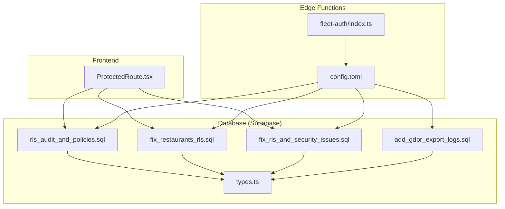
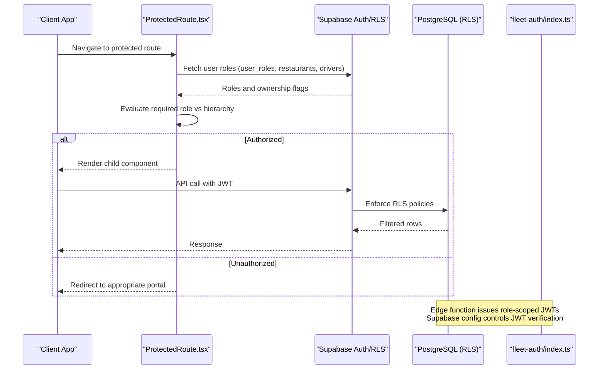
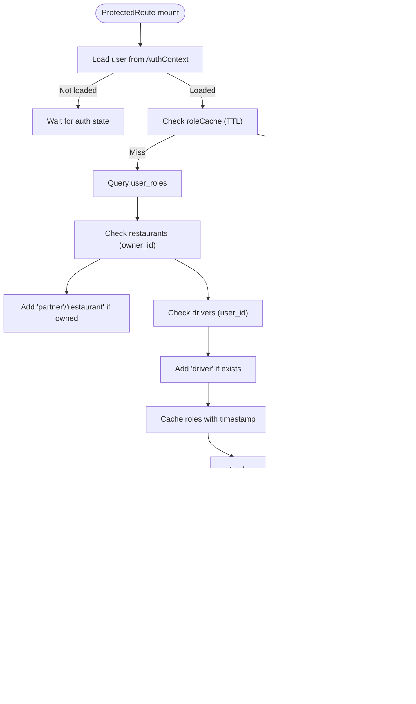
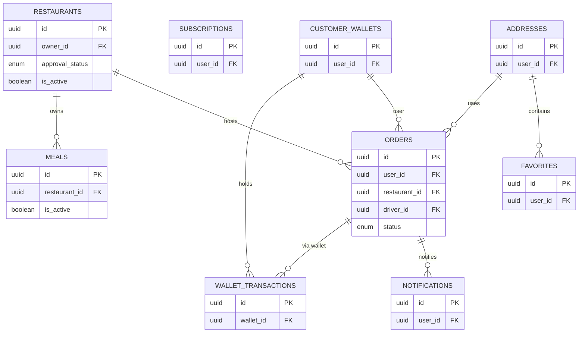
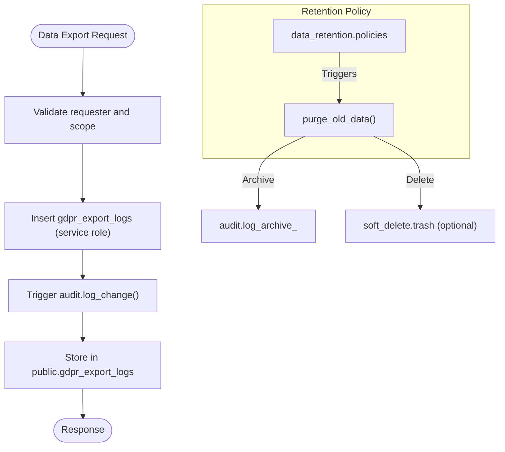
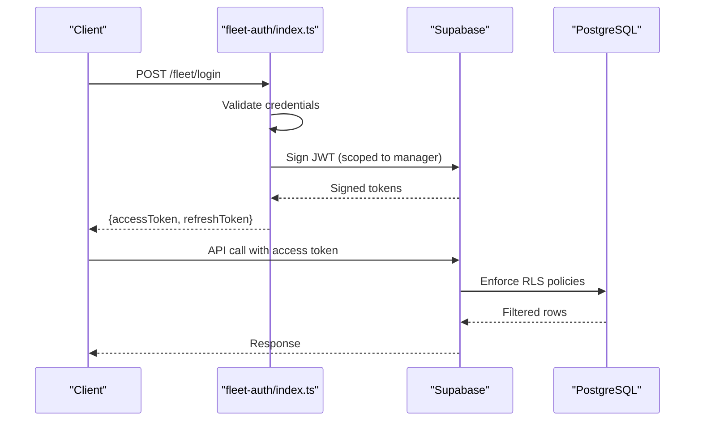
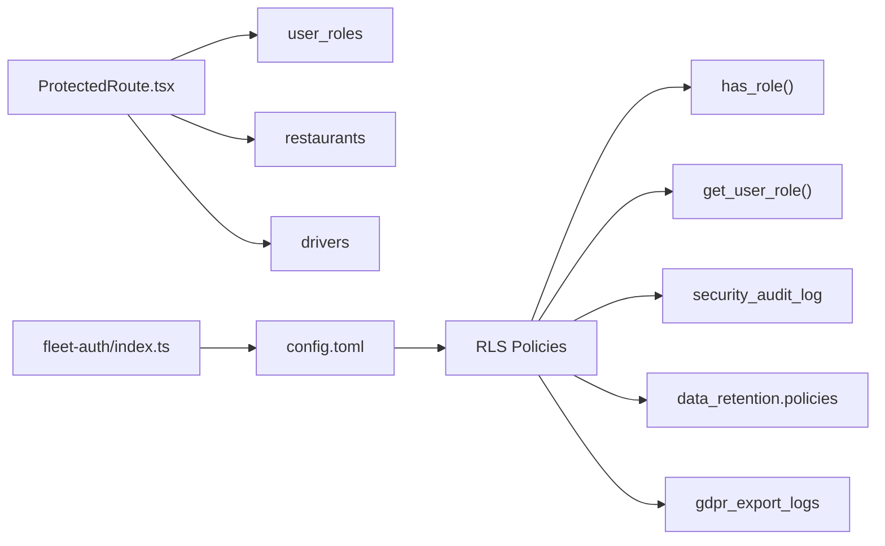

# Security & Access Control

<cite>
**Referenced Files in This Document**
- [rls_audit_and_policies.sql](file://supabase/migrations/20250218000002_rls_audit_and_policies.sql)
- [fix_restaurants_rls.sql](file://supabase/migrations/20250219000004_fix_restaurants_rls.sql)
- [grant_admin_role.sql](file://supabase/migrations/20250219000003_grant_admin_role.sql)
- [fix_rls_and_security_issues.sql](file://supabase/migrations/20250226000008_fix_rls_and_security_issues.sql)
- [add_gdpr_export_logs.sql](file://supabase/migrations/20260227000001_add_gdpr_export_logs.sql)
- [create_essential_tables.sql](file://supabase/migrations/20250220000000_create_essential_tables.sql)
- [ProtectedRoute.tsx](file://src/components/ProtectedRoute.tsx)
- [types.ts](file://supabase/types.ts)
- [config.toml](file://supabase/config.toml)
- [fleet-auth/index.ts](file://supabase/functions/fleet-auth/index.ts)
- [SECURITY_AUDIT.md](file://tests/SECURITY_AUDIT.md)
- [PRODUCTION_HARDENING_IMPLEMENTATION.md](file://PRODUCTION_HARDENING_IMPLEMENTATION.md)
</cite>

## Table of Contents
1. [Introduction](#introduction)
2. [Project Structure](#project-structure)
3. [Core Components](#core-components)
4. [Architecture Overview](#architecture-overview)
5. [Detailed Component Analysis](#detailed-component-analysis)
6. [Dependency Analysis](#dependency-analysis)
7. [Performance Considerations](#performance-considerations)
8. [Troubleshooting Guide](#troubleshooting-guide)
9. [Conclusion](#conclusion)

## Introduction
This document details the security and access control design for the Nutrio database, focusing on Row Level Security (RLS) policies for multi-tenant data isolation, role-based access control (RBAC), and data protection mechanisms. It explains staff RLS policies, admin permissions, restaurant-specific access patterns, audit logging, data retention and GDPR compliance measures, and outlines data leakage prevention strategies. The goal is to provide a clear understanding of how tenant boundaries are enforced, who can access what, and how compliance and auditing are achieved.

## Project Structure
Security and access control spans three primary areas:
- Database-level RLS policies and security functions in Supabase migrations
- Frontend RBAC enforcement via a ProtectedRoute wrapper
- Backend edge functions and configuration supporting secure authentication flows

**Diagram sources**
- [ProtectedRoute.tsx:1-264](file://src/components/ProtectedRoute.tsx#L1-L264)
- [rls_audit_and_policies.sql:1-356](file://supabase/migrations/20250218000002_rls_audit_and_policies.sql#L1-L356)
- [fix_restaurants_rls.sql:1-80](file://supabase/migrations/20250219000004_fix_restaurants_rls.sql#L1-L80)
- [fix_rls_and_security_issues.sql:1-252](file://supabase/migrations/20250226000008_fix_rls_and_security_issues.sql#L1-L252)
- [add_gdpr_export_logs.sql:1-60](file://supabase/migrations/20260227000001_add_gdpr_export_logs.sql#L1-L60)
- [config.toml:1-59](file://supabase/config.toml#L1-L59)
- [fleet-auth/index.ts:35-90](file://supabase/functions/fleet-auth/index.ts#L35-L90)
- [types.ts:1-800](file://supabase/types.ts#L1-L800)

**Section sources**
- [ProtectedRoute.tsx:1-264](file://src/components/ProtectedRoute.tsx#L1-L264)
- [rls_audit_and_policies.sql:1-356](file://supabase/migrations/20250218000002_rls_audit_and_policies.sql#L1-L356)
- [fix_restaurants_rls.sql:1-80](file://supabase/migrations/20250219000004_fix_restaurants_rls.sql#L1-L80)
- [fix_rls_and_security_issues.sql:1-252](file://supabase/migrations/20250226000008_fix_rls_and_security_issues.sql#L1-L252)
- [add_gdpr_export_logs.sql:1-60](file://supabase/migrations/20260227000001_add_gdpr_export_logs.sql#L1-L60)
- [config.toml:1-59](file://supabase/config.toml#L1-L59)
- [fleet-auth/index.ts:35-90](file://supabase/functions/fleet-auth/index.ts#L35-L90)
- [types.ts:1-800](file://supabase/types.ts#L1-L800)

## Core Components
- Role-Based Access Control (RBAC)
  - User roles include customer, restaurant, partner, driver, staff, and admin.
  - Role hierarchy enables higher roles to access lower-role resources.
  - Role membership is derived from user_roles, restaurant ownership, and driver status.
- Row Level Security (RLS)
  - RLS is enabled on core tables and policies restrict access by user identity, ownership, and role.
  - Restaurant-specific policies enforce multi-tenant isolation and admin oversight.
- Audit Logging and Compliance
  - Security audit log captures sensitive changes.
  - GDPR export logs track data exports for compliance and rate limiting.
  - Data retention policies automate deletion/archival for privacy and compliance.
- Authentication and Authorization Flow
  - Edge functions issue role-scoped JWTs with short expiry.
  - Supabase configuration controls JWT verification for selected functions.
- Frontend Protection
  - ProtectedRoute fetches and caches user roles, enforces required roles, and redirects appropriately.

**Section sources**
- [ProtectedRoute.tsx:7-35](file://src/components/ProtectedRoute.tsx#L7-L35)
- [rls_audit_and_policies.sql:244-295](file://supabase/migrations/20250218000002_rls_audit_and_policies.sql#L244-L295)
- [fix_restaurants_rls.sql:44-47](file://supabase/migrations/20250219000004_fix_restaurants_rls.sql#L44-L47)
- [fix_rls_and_security_issues.sql:36-243](file://supabase/migrations/20250226000008_fix_rls_and_security_issues.sql#L36-L243)
- [add_gdpr_export_logs.sql:4-52](file://supabase/migrations/20260227000001_add_gdpr_export_logs.sql#L4-L52)
- [config.toml:1-59](file://supabase/config.toml#L1-L59)
- [fleet-auth/index.ts:35-90](file://supabase/functions/fleet-auth/index.ts#L35-L90)

## Architecture Overview
The system enforces access control across three layers:
- Database Layer: RLS policies and security functions define who can access what data.
- Application Layer: ProtectedRoute validates roles and handles redirection.
- Identity Layer: Edge functions issue scoped JWTs; Supabase configuration governs JWT verification.

**Diagram sources**
- [ProtectedRoute.tsx:140-230](file://src/components/ProtectedRoute.tsx#L140-L230)
- [rls_audit_and_policies.sql:46-165](file://supabase/migrations/20250218000002_rls_audit_and_policies.sql#L46-L165)
- [config.toml:1-59](file://supabase/config.toml#L1-L59)
- [fleet-auth/index.ts:35-90](file://supabase/functions/fleet-auth/index.ts#L35-L90)

## Detailed Component Analysis

### Role-Based Access Control (RBAC)
- Roles and hierarchy
  - Roles recognized: customer, restaurant, partner, driver, staff, admin.
  - Higher roles can access lower-role resources; role hierarchy is used for permission checks.
- Role derivation
  - Roles are fetched from user_roles.
  - Ownership of a restaurant grants partner and restaurant roles.
  - Being registered as a driver grants driver role.
- Frontend enforcement
  - ProtectedRoute caches roles for 5 minutes to reduce DB queries.
  - Redirects to appropriate dashboard based on user’s highest role.

**Diagram sources**
- [ProtectedRoute.tsx:40-98](file://src/components/ProtectedRoute.tsx#L40-L98)

**Section sources**
- [ProtectedRoute.tsx:7-35](file://src/components/ProtectedRoute.tsx#L7-L35)
- [ProtectedRoute.tsx:103-119](file://src/components/ProtectedRoute.tsx#L103-L119)
- [ProtectedRoute.tsx:139-230](file://src/components/ProtectedRoute.tsx#L139-L230)

### Row Level Security (RLS) Policies

#### Multi-Tenant Isolation and Restaurant Access
- Restaurants table
  - Public can view approved and active restaurants.
  - Owners can view and update their own restaurants.
  - Admins can manage all restaurants.
  - has_role function ensures admin-only management.
- Orders, Meals, Subscriptions, Wallets, Transactions, Notifications, Addresses, Favorites
  - Users can access only their own records.
  - Partners can access restaurant-associated data (e.g., orders for their restaurants).
  - Drivers can access orders assigned to them.
  - Admins have full access.

**Diagram sources**
- [rls_audit_and_policies.sql:46-242](file://supabase/migrations/20250218000002_rls_audit_and_policies.sql#L46-L242)
- [fix_restaurants_rls.sql:24-47](file://supabase/migrations/20250219000004_fix_restaurants_rls.sql#L24-L47)

**Section sources**
- [rls_audit_and_policies.sql:46-242](file://supabase/migrations/20250218000002_rls_audit_and_policies.sql#L46-L242)
- [fix_restaurants_rls.sql:24-47](file://supabase/migrations/20250219000004_fix_restaurants_rls.sql#L24-L47)

#### Staff RLS Policies
- Staff role is supported in the frontend role hierarchy and user_roles table.
- RLS policies should restrict staff to their authorized scopes; ensure staff-specific tables have appropriate policies and that has_role is used for admin-only operations.

**Section sources**
- [ProtectedRoute.tsx:17-24](file://src/components/ProtectedRoute.tsx#L17-L24)
- [create_essential_tables.sql:47-55](file://supabase/migrations/20250220000000_create_essential_tables.sql#L47-L55)

#### Admin Permissions
- Admins can manage all restaurants and other tables via has_role checks.
- Admins can view security audit logs and manage data retention policies.
- Admin role assignment is performed via migration that inserts into user_roles.

**Section sources**
- [fix_restaurants_rls.sql:44-47](file://supabase/migrations/20250219000004_fix_restaurants_rls.sql#L44-L47)
- [rls_audit_and_policies.sql:291-294](file://supabase/migrations/20250218000002_rls_audit_and_policies.sql#L291-L294)
- [fix_rls_and_security_issues.sql:233-243](file://supabase/migrations/20250226000008_fix_rls_and_security_issues.sql#L233-L243)
- [grant_admin_role.sql:1-34](file://supabase/migrations/20250219000003_grant_admin_role.sql#L1-L34)

#### Restaurant-Specific Data Access Patterns
- Owner access: owners can view and update their restaurants; RLS enforces owner_id equality.
- Partner access: partners can manage meals and view analytics for their restaurants.
- Admin oversight: admins can view and manage all restaurants and associated data.

**Section sources**
- [rls_audit_and_policies.sql:146-165](file://supabase/migrations/20250218000002_rls_audit_and_policies.sql#L146-L165)
- [fix_restaurants_rls.sql:29-47](file://supabase/migrations/20250219000004_fix_restaurants_rls.sql#L29-L47)

### Audit Logging and Data Retention
- Security audit log
  - Tracks changes to sensitive tables with user_id, IP, user agent, timestamps.
  - Only admins can view audit logs.
- Data retention policies
  - Configurable retention periods and purge strategies (soft/hard delete, archive).
  - Purge function supports dry runs and archives audit logs per policy.
- GDPR export logging
  - Tracks data exports with user_id, exported_by, admin flag, size, IP, and user agent.
  - Users can view their own logs; admins can view all logs.
  - Insertion restricted to system via service role; audit trigger logs changes.

**Diagram sources**
- [add_gdpr_export_logs.sql:4-52](file://supabase/migrations/20260227000001_add_gdpr_export_logs.sql#L4-L52)
- [fix_rls_and_security_issues.sql:36-166](file://supabase/migrations/20250226000008_fix_rls_and_security_issues.sql#L36-L166)

**Section sources**
- [rls_audit_and_policies.sql:272-294](file://supabase/migrations/20250218000002_rls_audit_and_policies.sql#L272-L294)
- [fix_rls_and_security_issues.sql:36-243](file://supabase/migrations/20250226000008_fix_rls_and_security_issues.sql#L36-L243)
- [add_gdpr_export_logs.sql:4-52](file://supabase/migrations/20260227000001_add_gdpr_export_logs.sql#L4-L52)

### Authentication and Authorization Flow
- Edge functions issue role-scoped JWTs with short-lived access tokens and refresh tokens.
- Supabase configuration disables JWT verification for selected functions to allow unauthenticated edge-triggered operations while maintaining controlled access via service role keys and RLS.
- Fleet-specific auth flow demonstrates typed tokens and validation.

**Diagram sources**
- [fleet-auth/index.ts:35-90](file://supabase/functions/fleet-auth/index.ts#L35-L90)
- [config.toml:1-59](file://supabase/config.toml#L1-L59)

**Section sources**
- [fleet-auth/index.ts:35-90](file://supabase/functions/fleet-auth/index.ts#L35-L90)
- [config.toml:1-59](file://supabase/config.toml#L1-L59)

### Data Protection Mechanisms
- RLS on all tables ensures tenant isolation and ownership-based access.
- has_role and get_user_role functions centralize role checks and determinations.
- Audit logging and GDPR export logs provide compliance-ready trails.
- Data retention policies automate deletion and archival for privacy.

**Section sources**
- [rls_audit_and_policies.sql:244-269](file://supabase/migrations/20250218000002_rls_audit_and_policies.sql#L244-L269)
- [fix_rls_and_security_issues.sql:66-166](file://supabase/migrations/20250226000008_fix_rls_and_security_issues.sql#L66-L166)
- [create_essential_tables.sql:62-120](file://supabase/migrations/20250220000000_create_essential_tables.sql#L62-L120)

### Access Control Matrices

- Restaurant Access Matrix
  - Public: View approved and active restaurants
  - Owner: View and update own restaurants
  - Admin: Manage all restaurants
  - Partner: Implicit via ownership; managed via has_role

- Orders Access Matrix
  - User: View and create own orders; update pending orders
  - Partner: View orders for their restaurants
  - Driver: View assigned orders
  - Admin: Full access

- Meals Access Matrix
  - Public: View active meals
  - Partner: Manage meals for their restaurants
  - Admin: Full access

- Wallets and Transactions Access Matrix
  - User: View own wallet and transactions
  - Admin: View all wallets and transactions

- Notifications, Addresses, Favorites Access Matrix
  - User: Manage own notifications, addresses, favorites
  - System: Create notifications (edge functions)

**Section sources**
- [rls_audit_and_policies.sql:46-242](file://supabase/migrations/20250218000002_rls_audit_and_policies.sql#L46-L242)
- [fix_restaurants_rls.sql:24-47](file://supabase/migrations/20250219000004_fix_restaurants_rls.sql#L24-L47)

### Data Leakage Prevention Strategies
- Enforce RLS on all tables and review policies regularly.
- Use has_role for admin-only operations and avoid broad grants.
- Restrict insert/update/delete via WITH CHECK and USING clauses.
- Centralize role checks with has_role and get_user_role functions.
- Monitor failed authentication attempts and consider IP blocking thresholds.
- Log all sensitive changes and maintain audit trails.
- Implement data retention policies to minimize exposure windows.

**Section sources**
- [rls_audit_and_policies.sql:297-331](file://supabase/migrations/20250218000002_rls_audit_and_policies.sql#L297-L331)
- [fix_rls_and_security_issues.sql:168-227](file://supabase/migrations/20250226000008_fix_rls_and_security_issues.sql#L168-L227)

## Dependency Analysis
- Frontend ProtectedRoute depends on Supabase tables (user_roles, restaurants, drivers) and the role hierarchy.
- Edge functions depend on Supabase JWT signing and configuration to issue scoped tokens.
- Database policies depend on has_role and get_user_role functions for centralized role checks.
- GDPR export logs and retention policies depend on audit triggers and data_retention.policies.

**Diagram sources**
- [ProtectedRoute.tsx:40-98](file://src/components/ProtectedRoute.tsx#L40-L98)
- [create_essential_tables.sql:62-120](file://supabase/migrations/20250220000000_create_essential_tables.sql#L62-L120)
- [rls_audit_and_policies.sql:272-294](file://supabase/migrations/20250218000002_rls_audit_and_policies.sql#L272-L294)
- [fix_rls_and_security_issues.sql:36-166](file://supabase/migrations/20250226000008_fix_rls_and_security_issues.sql#L36-L166)
- [add_gdpr_export_logs.sql:4-52](file://supabase/migrations/20260227000001_add_gdpr_export_logs.sql#L4-L52)
- [config.toml:1-59](file://supabase/config.toml#L1-L59)
- [fleet-auth/index.ts:35-90](file://supabase/functions/fleet-auth/index.ts#L35-L90)

**Section sources**
- [ProtectedRoute.tsx:40-98](file://src/components/ProtectedRoute.tsx#L40-L98)
- [create_essential_tables.sql:62-120](file://supabase/migrations/20250220000000_create_essential_tables.sql#L62-L120)
- [rls_audit_and_policies.sql:272-294](file://supabase/migrations/20250218000002_rls_audit_and_policies.sql#L272-L294)
- [fix_rls_and_security_issues.sql:36-166](file://supabase/migrations/20250226000008_fix_rls_and_security_issues.sql#L36-L166)
- [add_gdpr_export_logs.sql:4-52](file://supabase/migrations/20260227000001_add_gdpr_export_logs.sql#L4-L52)
- [config.toml:1-59](file://supabase/config.toml#L1-L59)
- [fleet-auth/index.ts:35-90](file://supabase/functions/fleet-auth/index.ts#L35-L90)

## Performance Considerations
- Role caching in ProtectedRoute reduces repeated database queries for role checks.
- RLS evaluation occurs server-side; keep policies efficient with indexed columns.
- Audit logging and retention operations should be batched and scheduled to minimize runtime overhead.

[No sources needed since this section provides general guidance]

## Troubleshooting Guide
- Role not recognized
  - Verify user_roles entries and that has_role/get_user_role functions exist.
- Restaurant approvals failing
  - Confirm is_active column exists and restaurant policies allow admin management.
- Admin dashboards inaccessible
  - Ensure admin role assignment migration executed and user_roles contains admin.
- Audit logs not visible
  - Confirm only admins can select security_audit_log and that audit triggers are present.
- GDPR export logs not inserted
  - Verify system-only insertion policy and that audit trigger exists.

**Section sources**
- [fix_restaurants_rls.sql:4-14](file://supabase/migrations/20250219000004_fix_restaurants_rls.sql#L4-L14)
- [grant_admin_role.sql:1-34](file://supabase/migrations/20250219000003_grant_admin_role.sql#L1-L34)
- [rls_audit_and_policies.sql:291-294](file://supabase/migrations/20250218000002_rls_audit_and_policies.sql#L291-L294)
- [add_gdpr_export_logs.sql:43-52](file://supabase/migrations/20260227000001_add_gdpr_export_logs.sql#L43-L52)

## Conclusion
Nutrio’s security model combines robust RBAC with comprehensive RLS policies to achieve multi-tenant isolation, enforce ownership-based access, and provide admin oversight. The frontend ProtectedRoute complements database-level controls by caching roles and enforcing route-level permissions. Audit logging, GDPR export tracking, and automated data retention further strengthen compliance and reduce risk. Adhering to the documented policies and matrices ensures consistent enforcement and minimizes data leakage.