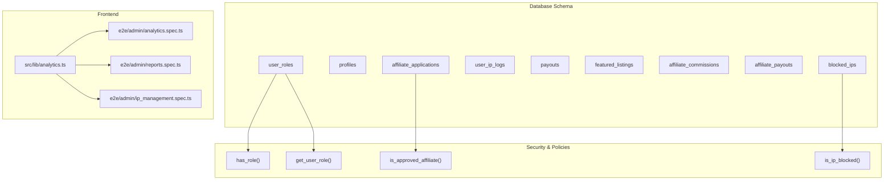
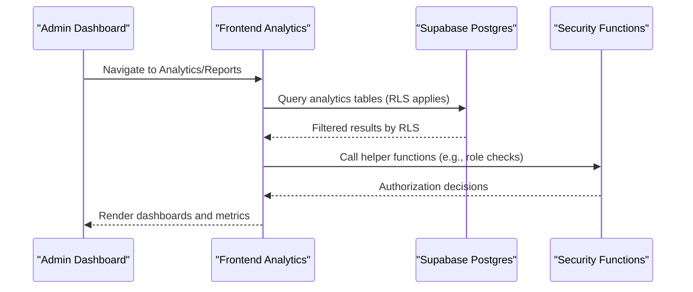
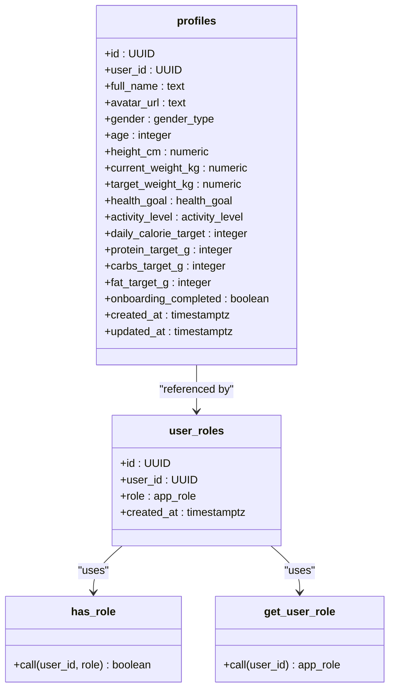
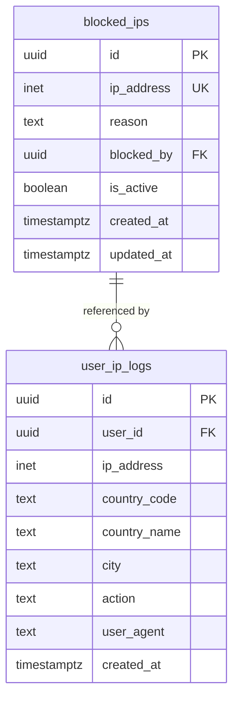
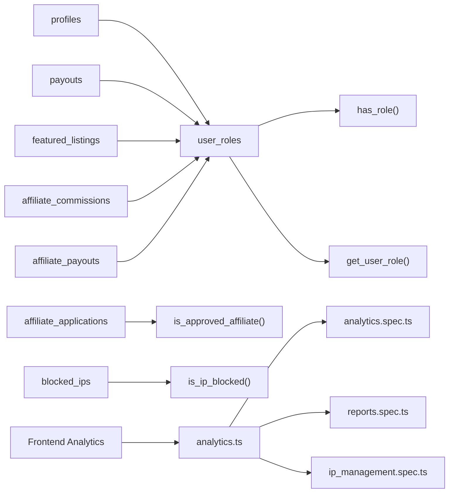
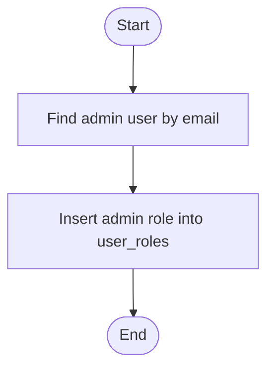

# Admin & Analytics Tables

<cite>
**Referenced Files in This Document**
- [CREATE_TABLES_SQL.md](file://CREATE_TABLES_SQL.md)
- [fix_admin_tables.sql](file://fix_admin_tables.sql)
- [20250219000000_ip_management.sql](file://supabase/migrations/20250219000000_ip_management.sql)
- [20250218000001_add_performance_indexes.sql](file://supabase/migrations/20250218000001_add_performance_indexes.sql)
- [20250218000002_rls_audit_and_policies.sql](file://supabase/migrations/20250218000002_rls_audit_and_policies.sql)
- [analytics.ts](file://src/lib/analytics.ts)
- [analytics.spec.ts](file://e2e/admin/analytics.spec.ts)
- [reports.spec.ts](file://e2e/admin/reports.spec.ts)
- [ip_management.spec.ts](file://e2e/admin/ip_management.spec.ts)
- [assign-admin-role-final.mjs](file://assign-admin-role-final.mjs)
- [admin_pages_analysis.md](file://admin_pages_analysis.md)
</cite>

## Table of Contents
1. [Introduction](#introduction)
2. [Project Structure](#project-structure)
3. [Core Components](#core-components)
4. [Architecture Overview](#architecture-overview)
5. [Detailed Component Analysis](#detailed-component-analysis)
6. [Dependency Analysis](#dependency-analysis)
7. [Performance Considerations](#performance-considerations)
8. [Troubleshooting Guide](#troubleshooting-guide)
9. [Conclusion](#conclusion)
10. [Appendices](#appendices)

## Introduction
This document describes the administrative and analytics data model for the platform, focusing on admin user management, system audit and security logging, user activity monitoring, and business intelligence data structures. It consolidates backend database tables, row-level security (RLS) policies, helper functions, and frontend analytics/reporting components to provide a unified understanding of how administrators monitor and govern the system, track security events, and collect performance and business metrics.

## Project Structure
The administrative and analytics data model spans three primary areas:
- Backend database schema and policies (Supabase Postgres)
- Helper functions and security checks (PostgreSQL functions)
- Frontend analytics/reporting and admin dashboards (TypeScript and Playwright tests)



**Diagram sources**
- [CREATE_TABLES_SQL.md:33-96](file://CREATE_TABLES_SQL.md#L33-L96)
- [20250219000000_ip_management.sql:1-60](file://supabase/migrations/20250219000000_ip_management.sql#L1-L60)
- [fix_admin_tables.sql:38-256](file://fix_admin_tables.sql#L38-L256)
- [analytics.ts](file://src/lib/analytics.ts)
- [analytics.spec.ts](file://e2e/admin/analytics.spec.ts)
- [reports.spec.ts](file://e2e/admin/reports.spec.ts)
- [ip_management.spec.ts](file://e2e/admin/ip_management.spec.ts)

**Section sources**
- [CREATE_TABLES_SQL.md:1-221](file://CREATE_TABLES_SQL.md#L1-L221)
- [fix_admin_tables.sql:1-291](file://fix_admin_tables.sql#L1-L291)
- [20250219000000_ip_management.sql:1-60](file://supabase/migrations/20250219000000_ip_management.sql#L1-L60)

## Core Components
This section outlines the core tables and functions that underpin admin and analytics capabilities.

- Admin role management and user identity
  - user_roles: Stores per-user roles with RLS policies and helper functions for role checks.
  - profiles: User profile data with RLS policies enabling self-service viewing/updating and admin visibility.
  - Security functions: has_role(), get_user_role() for role verification and precedence.

- IP management and security logging
  - blocked_ips: Centralized IP blocking with admin controls and active-state indexing.
  - user_ip_logs: Per-user IP/country/city/action logging with RLS and indexes for performance.
  - Security function: is_ip_blocked() to check if an IP is currently blocked.

- Administrative tables for business analytics
  - payouts: Partner payouts with status tracking and RLS.
  - featured_listings: Restaurant promotion listings with status lifecycle and RLS.
  - affiliate_commissions: Tiered commission tracking with status and payment linkage.
  - affiliate_payouts: Affiliate payout requests and processing with RLS.
  - affiliate_applications: Affiliate program application lifecycle with status and reviewer metadata.

- Analytics and reporting surfaces
  - Frontend analytics library and admin E2E specs for analytics and reporting views.

**Section sources**
- [CREATE_TABLES_SQL.md:33-137](file://CREATE_TABLES_SQL.md#L33-L137)
- [20250219000000_ip_management.sql:1-60](file://supabase/migrations/20250219000000_ip_management.sql#L1-L60)
- [fix_admin_tables.sql:38-256](file://fix_admin_tables.sql#L38-L256)
- [analytics.ts](file://src/lib/analytics.ts)
- [analytics.spec.ts](file://e2e/admin/analytics.spec.ts)
- [reports.spec.ts](file://e2e/admin/reports.spec.ts)

## Architecture Overview
The admin and analytics architecture integrates database-first modeling with helper functions and frontend dashboards. Administrators rely on RLS-protected views and admin-only endpoints to observe system health, security posture, and business KPIs.



**Diagram sources**
- [CREATE_TABLES_SQL.md:47-96](file://CREATE_TABLES_SQL.md#L47-L96)
- [fix_admin_tables.sql:56-200](file://fix_admin_tables.sql#L56-L200)
- [20250219000000_ip_management.sql:32-49](file://supabase/migrations/20250219000000_ip_management.sql#L32-L49)
- [analytics.ts](file://src/lib/analytics.ts)

## Detailed Component Analysis

### Admin Role Management and Identity
The admin role model centers on user_roles and supporting functions to enforce least-privilege access.



- Purpose: Separate role storage from user profiles enables strict RLS and simplifies privilege auditing.
- RLS: Users see only their own roles/profiles; admins can view/manage all.
- Helper functions: Role lookup and precedence ordering ensure consistent authorization.

**Diagram sources**
- [CREATE_TABLES_SQL.md:37-96](file://CREATE_TABLES_SQL.md#L37-L96)

**Section sources**
- [CREATE_TABLES_SQL.md:33-96](file://CREATE_TABLES_SQL.md#L33-L96)

### IP Management and Security Logging
IP management provides centralized control and observability for security-sensitive operations.



- Blocked IPs: Unique IP entries with active-state flag and admin-only management policy.
- User IP Logs: Per-action (signup/login) records with geolocation and user agent for auditability.
- Indexes: Optimized lookups for IP queries and reverse chronological retrieval.
- Security function: is_ip_blocked() encapsulates block checks for edge functions and APIs.

**Diagram sources**
- [20250219000000_ip_management.sql:1-60](file://supabase/migrations/20250219000000_ip_management.sql#L1-L60)

**Section sources**
- [20250219000000_ip_management.sql:1-60](file://supabase/migrations/20250219000000_ip_management.sql#L1-L60)
- [CREATE_TABLES_SQL.md:139-206](file://CREATE_TABLES_SQL.md#L139-L206)

### Administrative Business Analytics Tables
These tables capture key business operations for reporting and analytics.

```mermaid
erDiagram
payouts {
uuid id PK
uuid partner_id
uuid restaurant_id FK
numeric amount
text status
date period_start
date period_end
integer order_count
text payout_method
timestamptz processed_at
timestamptz created_at
timestamptz updated_at
}
featured_listings {
uuid id PK
uuid restaurant_id FK
text package_type
numeric price_paid
timestamptz starts_at
timestamptz ends_at
text status
text payment_reference
timestamptz created_at
timestamptz updated_at
}
affiliate_commissions {
uuid id PK
uuid user_id
uuid source_user_id
uuid order_id FK
integer tier
numeric order_amount
numeric commission_rate
numeric commission_amount
text status
timestamptz created_at
timestamptz paid_at
}
affiliate_payouts {
uuid id PK
uuid user_id
numeric amount
text status
text payout_method
jsonb payout_details
timestamptz requested_at
timestamptz processed_at
text notes
}
affiliate_applications {
uuid id PK
uuid user_id FK
enum affiliate_status status
text application_note
text rejection_reason
timestamptz applied_at
timestamptz reviewed_at
uuid reviewed_by FK
timestamptz created_at
timestamptz updated_at
}
```

- Payouts: Tracks partner earnings with lifecycle statuses and audit timestamps.
- Featured Listings: Restaurant promotional packages with scheduling and status tracking.
- Affiliate Commissions: Tiered commission computation and status lifecycle.
- Affiliate Payouts: Requests and processing of affiliate earnings.
- Affiliate Applications: Application lifecycle with reviewer metadata.

**Diagram sources**
- [fix_admin_tables.sql:38-256](file://fix_admin_tables.sql#L38-L256)

**Section sources**
- [fix_admin_tables.sql:38-256](file://fix_admin_tables.sql#L38-L256)

### Analytics Collection and Reporting Surfaces
Frontend analytics and admin E2E tests define how dashboards and reports are surfaced.

- Analytics library: Provides structured telemetry and reporting hooks used by admin dashboards.
- Admin analytics spec: Validates analytics dashboard rendering and filtering.
- Reports spec: Verifies reporting views and export capabilities.
- IP management spec: Confirms admin controls for IP blocking and logs review.

**Section sources**
- [analytics.ts](file://src/lib/analytics.ts)
- [analytics.spec.ts](file://e2e/admin/analytics.spec.ts)
- [reports.spec.ts](file://e2e/admin/reports.spec.ts)
- [ip_management.spec.ts](file://e2e/admin/ip_management.spec.ts)

## Dependency Analysis
Administrative and analytics functionality depends on:
- Database schema and RLS policies for access control
- Helper functions for role and IP checks
- Frontend analytics library and E2E tests for UX validation



**Diagram sources**
- [CREATE_TABLES_SQL.md:62-96](file://CREATE_TABLES_SQL.md#L62-L96)
- [fix_admin_tables.sql:257-271](file://fix_admin_tables.sql#L257-L271)
- [20250219000000_ip_management.sql:51-60](file://supabase/migrations/20250219000000_ip_management.sql#L51-L60)
- [analytics.ts](file://src/lib/analytics.ts)
- [analytics.spec.ts](file://e2e/admin/analytics.spec.ts)
- [reports.spec.ts](file://e2e/admin/reports.spec.ts)
- [ip_management.spec.ts](file://e2e/admin/ip_management.spec.ts)

**Section sources**
- [CREATE_TABLES_SQL.md:62-96](file://CREATE_TABLES_SQL.md#L62-L96)
- [fix_admin_tables.sql:257-271](file://fix_admin_tables.sql#L257-L271)
- [20250219000000_ip_management.sql:51-60](file://supabase/migrations/20250219000000_ip_management.sql#L51-L60)

## Performance Considerations
- Indexes: Strategic indexes on frequently filtered columns (e.g., blocked_ips.ip_address, user_ip_logs.created_at) improve query performance for admin dashboards and security checks.
- RLS overhead: While RLS ensures secure access, complex policies can add query cost; keep policies minimal and aligned with dashboard filters.
- Data volume: For long-running analytics (e.g., user_ip_logs), partitioning or retention policies may be considered to limit historical scans.
- Helper functions: Keep security functions simple and deterministic to avoid performance regressions.

**Section sources**
- [20250219000000_ip_management.sql:25-30](file://supabase/migrations/20250219000000_ip_management.sql#L25-L30)
- [20250218000001_add_performance_indexes.sql](file://supabase/migrations/20250218000001_add_performance_indexes.sql)

## Troubleshooting Guide
Common issues and resolutions:
- Admin role not recognized
  - Verify the admin user’s role exists and helper functions are deployed.
  - Confirm RLS policies allow admin access to sensitive tables.

- Missing analytics data in dashboards
  - Ensure frontend analytics library is initialized and permissions are granted.
  - Validate E2E tests pass for analytics and reporting pages.

- IP blocking not effective
  - Confirm blocked_ips entries are active and is_ip_blocked() is invoked by edge functions/APIs.
  - Check indexes and RLS policies for blocked_ips and user_ip_logs.

- Admin dashboard 404/400 errors
  - Apply missing table fixes and helper functions as outlined in the admin fix script.
  - Re-run the helper function creation and trigger updates.

**Section sources**
- [assign-admin-role-final.mjs](file://assign-admin-role-final.mjs)
- [fix_admin_tables.sql:1-291](file://fix_admin_tables.sql#L1-L291)
- [admin_pages_analysis.md](file://admin_pages_analysis.md)

## Conclusion
The admin and analytics data model combines robust database tables, helper functions, and RLS policies with frontend dashboards and E2E tests to deliver a secure, observable, and auditable system. Administrators can manage roles, monitor security events via IP logs and blocks, and analyze business KPIs through curated analytics surfaces.

## Appendices

### Appendix A: Admin Role Assignment Workflow


**Diagram sources**
- [CREATE_TABLES_SQL.md:208-219](file://CREATE_TABLES_SQL.md#L208-L219)