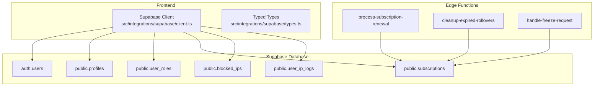
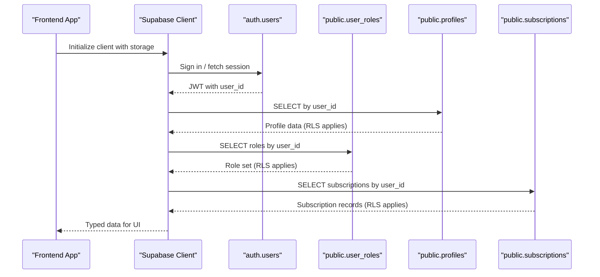
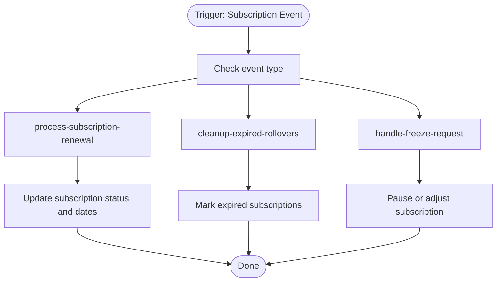
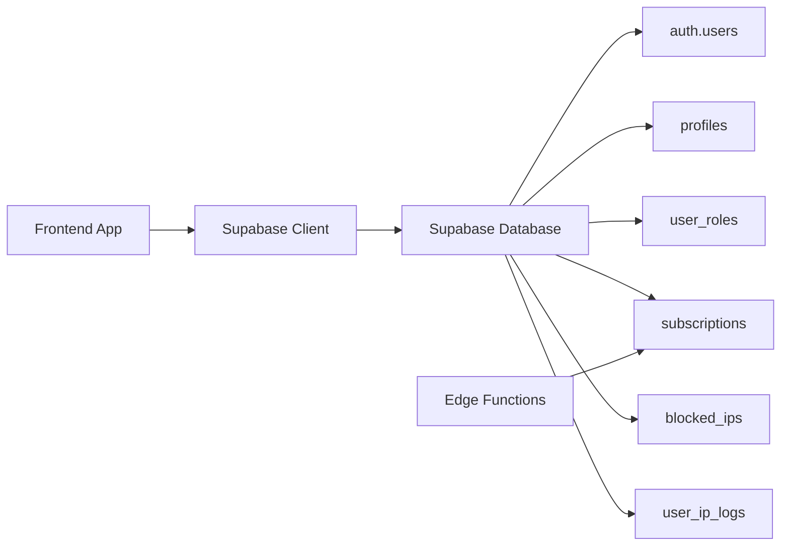

# Core User Tables

<cite>
**Referenced Files in This Document**
- [CREATE_TABLES_SQL.md](file://CREATE_TABLES_SQL.md)
- [20250218000001_add_performance_indexes.sql](file://supabase/migrations/20250218000001_add_performance_indexes.sql)
- [20250218000002_rls_audit_and_policies.sql](file://supabase/migrations/20250218000002_rls_audit_and_policies.sql)
- [20250220000006_create_admin_tables.sql](file://supabase/migrations/20250220000006_create_admin_tables.sql)
- [client.ts](file://src/integrations/supabase/client.ts)
- [types.ts](file://src/integrations/supabase/types.ts)
- [config.toml](file://supabase/config.toml)
</cite>

## Table of Contents
1. [Introduction](#introduction)
2. [Project Structure](#project-structure)
3. [Core Components](#core-components)
4. [Architecture Overview](#architecture-overview)
5. [Detailed Component Analysis](#detailed-component-analysis)
6. [Dependency Analysis](#dependency-analysis)
7. [Performance Considerations](#performance-considerations)
8. [Troubleshooting Guide](#troubleshooting-guide)
9. [Conclusion](#conclusion)

## Introduction
This document describes the core user-related tables and schemas used by the system, focusing on:
- Authentication and identity via Supabase Auth’s auth.users
- User profiles and personalization data
- Role-based access control (RBAC) with user_roles
- Subscription management with subscriptions
- Supporting IP management and logging
- Indexing, security policies, and validation rules

It also explains the authentication flow, RBAC implementation, subscription management schema, and operational guidance for performance and security.

## Project Structure
The user data model is defined in Supabase migrations and enforced by Row Level Security (RLS). The frontend integrates with Supabase through a typed client and persistence layer.

**Diagram sources**
- [client.ts:47-57](file://src/integrations/supabase/client.ts#L47-L57)
- [types.ts:1-10](file://src/integrations/supabase/types.ts#L1-L10)
- [20250220000006_create_admin_tables.sql:106-120](file://supabase/migrations/20250220000006_create_admin_tables.sql#L106-L120)
- [20250218000001_add_performance_indexes.sql:16-21](file://supabase/migrations/20250218000001_add_performance_indexes.sql#L16-L21)
- [20250218000002_rls_audit_and_policies.sql:99-116](file://supabase/migrations/20250218000002_rls_audit_and_policies.sql#L99-L116)
- [config.toml:36-43](file://supabase/config.toml#L36-L43)

**Section sources**
- [client.ts:1-57](file://src/integrations/supabase/client.ts#L1-L57)
- [types.ts:1-10](file://src/integrations/supabase/types.ts#L1-L10)
- [config.toml:1-59](file://supabase/config.toml#L1-L59)

## Core Components
This section documents the core user-related tables, their fields, constraints, and relationships.

- auth.users
  - Identity provider table managed by Supabase Auth. It stores user identities, credentials, and metadata. The frontend integrates with this via the Supabase client and persists sessions locally on native builds.

- public.profiles
  - Contains user personal details and health goals. Enforces RLS so users can only view/update their own profile. Includes validation constraints for numeric fields and age range.

- public.user_roles
  - Stores explicit roles per user. Provides security functions to check role membership and determine primary role. Enforces RLS so users see only their own roles and admins can manage roles.

- public.subscriptions
  - Subscription lifecycle and plan details. Enforces RLS so users can view their own subscriptions and admins can manage all. Indexes optimized for common queries.

- public.blocked_ips and public.user_ip_logs
  - IP management and logging for signup/login actions. Enforces RLS so admins can manage and view blocked IPs and logs; users can insert their own IP logs.

**Section sources**
- [CREATE_TABLES_SQL.md:98-137](file://CREATE_TABLES_SQL.md#L98-L137)
- [CREATE_TABLES_SQL.md:33-56](file://CREATE_TABLES_SQL.md#L33-L56)
- [20250220000006_create_admin_tables.sql:106-131](file://supabase/migrations/20250220000006_create_admin_tables.sql#L106-L131)
- [20250218000001_add_performance_indexes.sql:16-21](file://supabase/migrations/20250218000001_add_performance_indexes.sql#L16-L21)
- [20250218000002_rls_audit_and_policies.sql:99-116](file://supabase/migrations/20250218000002_rls_audit_and_policies.sql#L99-L116)

## Architecture Overview
The system relies on Supabase Auth for identity and the Supabase client for secure database access. Edge functions enforce business logic around subscriptions and IP management.

**Diagram sources**
- [client.ts:47-57](file://src/integrations/supabase/client.ts#L47-L57)
- [20250218000002_rls_audit_and_policies.sql:46-96](file://supabase/migrations/20250218000002_rls_audit_and_policies.sql#L46-L96)
- [20250218000002_rls_audit_and_policies.sql:99-116](file://supabase/migrations/20250218000002_rls_audit_and_policies.sql#L99-L116)

## Detailed Component Analysis

### auth.users
- Purpose: Central identity table for Supabase Auth.
- Integration: The Supabase client manages auth state and persists sessions using Capacitor Preferences on native platforms.
- Security: Authenticated requests carry a JWT with user_id; RLS policies reference auth.uid() to enforce per-user access.

**Section sources**
- [client.ts:18-57](file://src/integrations/supabase/client.ts#L18-L57)
- [20250218000002_rls_audit_and_policies.sql:56-69](file://supabase/migrations/20250218000002_rls_audit_and_policies.sql#L56-L69)

### public.profiles
- Fields and constraints:
  - Personal info: full_name, avatar_url
  - Demographics: gender, age with range check, height, weights with positive checks
  - Health and goals: health_goal, activity_level, calorie/macronutrient targets
  - Lifecycle: onboarding_completed flag, timestamps
- RLS:
  - Users can select/update their own profile
  - Users can insert their own profile
  - Admins can view all profiles
- Indexing: Not explicitly defined in the referenced files; consider adding indexes on frequently filtered columns if needed.

**Section sources**
- [CREATE_TABLES_SQL.md:98-137](file://CREATE_TABLES_SQL.md#L98-L137)
- [20250218000002_rls_audit_and_policies.sql:168-183](file://supabase/migrations/20250218000002_rls_audit_and_policies.sql#L168-L183)

### public.user_roles
- Purpose: Explicit role assignment per user (e.g., user, partner, admin).
- Security functions:
  - has_role(): checks if a user has a given role
  - get_user_role(): returns the effective primary role by precedence
- RLS:
  - Users can view their own roles
  - Admins can view all roles and manage roles
- Constraints:
  - Unique constraint on (user_id, role) ensures one role per user.

**Section sources**
- [CREATE_TABLES_SQL.md:33-56](file://CREATE_TABLES_SQL.md#L33-L56)
- [CREATE_TABLES_SQL.md:58-96](file://CREATE_TABLES_SQL.md#L58-L96)
- [20250218000002_rls_audit_and_policies.sql:244-270](file://supabase/migrations/20250218000002_rls_audit_and_policies.sql#L244-L270)

### public.subscriptions
- Schema:
  - Plan details: plan_name, plan_type, billing_cycle, meals_per_week
  - Status lifecycle: status with allowed values, auto_renew flag
  - Timeline: started_at, expires_at, cancelled_at
  - Pricing: price with two-decimal precision
- RLS:
  - Users can view their own subscriptions
  - Admins can manage all subscriptions
- Indexing:
  - Indexes on user_id and status improve query performance
  - Partial index on (user_id, status) where status indicates active/pending

**Section sources**
- [20250220000006_create_admin_tables.sql:106-131](file://supabase/migrations/20250220000006_create_admin_tables.sql#L106-L131)
- [20250218000001_add_performance_indexes.sql:16-21](file://supabase/migrations/20250218000001_add_performance_indexes.sql#L16-L21)
- [20250218000001_add_performance_indexes.sql:59-61](file://supabase/migrations/20250218000001_add_performance_indexes.sql#L59-L61)
- [20250218000002_rls_audit_and_policies.sql:99-116](file://supabase/migrations/20250218000002_rls_audit_and_policies.sql#L99-L116)

### public.blocked_ips and public.user_ip_logs
- blocked_ips:
  - Stores blocked IP addresses with reason, blocking admin, and activation flag
  - RLS: Admins can manage blocked IPs
- user_ip_logs:
  - Logs user IP, country/city, action type (signup/login), and user agent
  - RLS: Admins can view logs; users can insert their own logs
- Indexing:
  - Indexes on ip_address, is_active, user_id, ip_address, created_at for performance

**Section sources**
- [CREATE_TABLES_SQL.md:139-191](file://CREATE_TABLES_SQL.md#L139-L191)
- [20250218000001_add_performance_indexes.sql:6-11](file://supabase/migrations/20250218000001_add_performance_indexes.sql#L6-L11)
- [20250218000002_rls_audit_and_policies.sql:272-294](file://supabase/migrations/20250218000002_rls_audit_and_policies.sql#L272-L294)

### Edge Functions and Subscription Management
- Edge functions invoked for subscription lifecycle:
  - process-subscription-renewal
  - cleanup-expired-rollovers
  - handle-freeze-request
- These functions operate without JWT verification and are intended for server-side automation.

**Diagram sources**
- [config.toml:36-43](file://supabase/config.toml#L36-L43)

**Section sources**
- [config.toml:1-59](file://supabase/config.toml#L1-L59)

## Dependency Analysis
- Frontend depends on the Supabase client for authenticated database access.
- Typed types describe database schemas for compile-time safety.
- Edge functions depend on the subscriptions table for renewal and lifecycle management.

**Diagram sources**
- [client.ts:47-57](file://src/integrations/supabase/client.ts#L47-L57)
- [types.ts:1-10](file://src/integrations/supabase/types.ts#L1-L10)
- [20250220000006_create_admin_tables.sql:106-131](file://supabase/migrations/20250220000006_create_admin_tables.sql#L106-L131)

**Section sources**
- [client.ts:1-57](file://src/integrations/supabase/client.ts#L1-L57)
- [types.ts:1-10](file://src/integrations/supabase/types.ts#L1-L10)

## Performance Considerations
- Indexes on subscriptions and related tables:
  - subscriptions(user_id), subscriptions(status)
  - Partial index on (user_id, status) for active/pending subscriptions
- Additional indexes for production-grade performance:
  - orders(user_id), orders(status), orders(restaurant_id), orders(driver_id)
  - order_items(order_id, meal_id)
  - addresses(user_id), favorites(user_id, restaurant_id)
  - notifications(user_id), unread partial index
- Recommendations:
  - Monitor slow queries and add targeted indexes
  - Use partial indexes for common filters (active subscriptions, pending orders)
  - Regularly analyze query plans and adjust indexes accordingly

**Section sources**
- [20250218000001_add_performance_indexes.sql:1-73](file://supabase/migrations/20250218000001_add_performance_indexes.sql#L1-L73)

## Troubleshooting Guide
- Authentication and session issues:
  - Verify Supabase URL and publishable key are configured
  - Confirm session persistence storage (Capacitor Preferences on native)
- Access denied errors:
  - Ensure RLS policies are enabled on all relevant tables
  - Confirm user has appropriate roles via user_roles
- Subscription-related problems:
  - Check subscription status and lifecycle fields
  - Review edge function invocations for renewal/cleanup/freezes
- IP management:
  - Validate blocked_ips entries and is_active flag
  - Confirm user_ip_logs insertion and admin visibility

**Section sources**
- [client.ts:10-16](file://src/integrations/supabase/client.ts#L10-L16)
- [20250218000002_rls_audit_and_policies.sql:4-43](file://supabase/migrations/20250218000002_rls_audit_and_policies.sql#L4-L43)
- [20250218000002_rls_audit_and_policies.sql:99-116](file://supabase/migrations/20250218000002_rls_audit_and_policies.sql#L99-L116)
- [20250218000002_rls_audit_and_policies.sql:272-294](file://supabase/migrations/20250218000002_rls_audit_and_policies.sql#L272-L294)

## Conclusion
The user data model centers on Supabase Auth for identity, with complementary tables for profiles, roles, subscriptions, and IP management. RLS policies and security functions enforce strict per-user access, while indexes and edge functions support performance and automated workflows. This foundation enables robust role-based access control and reliable subscription management across the platform.