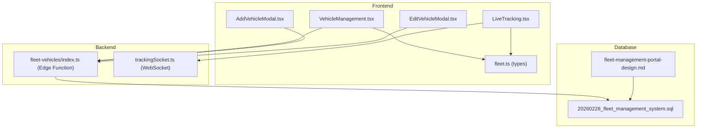
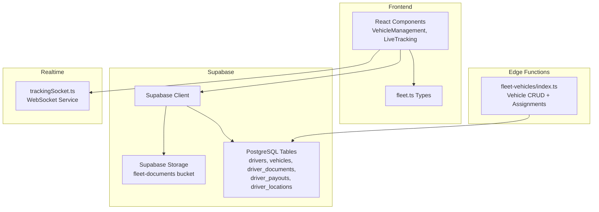
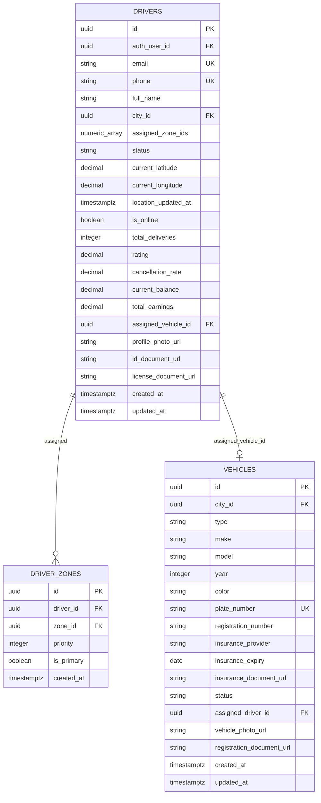
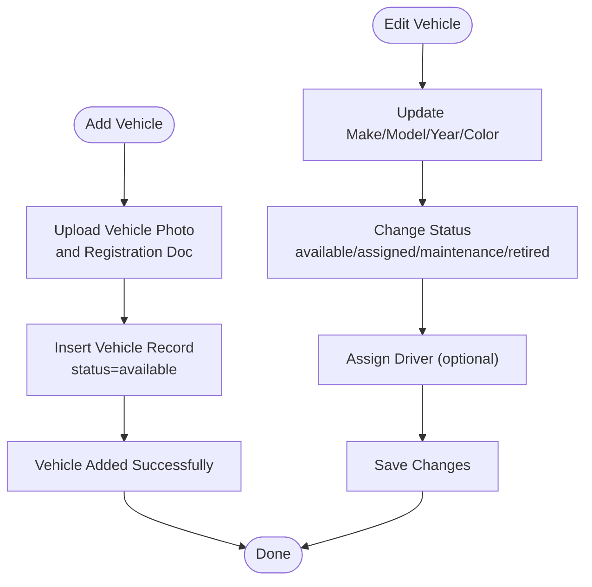
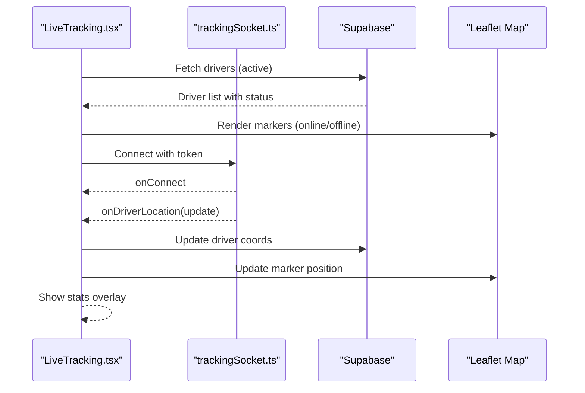
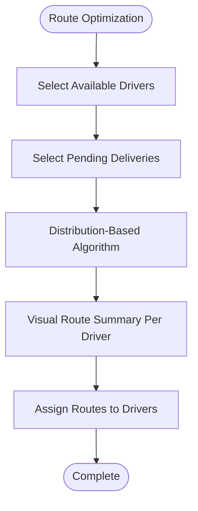
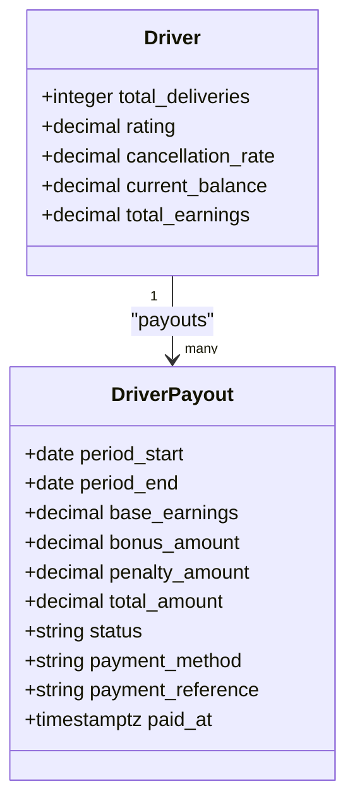
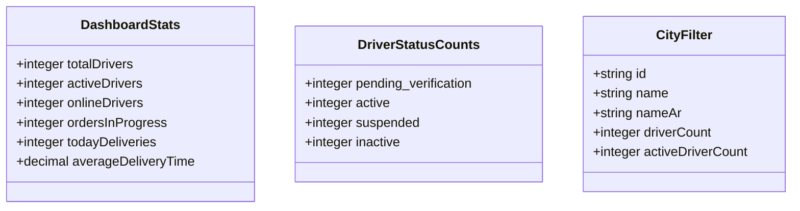
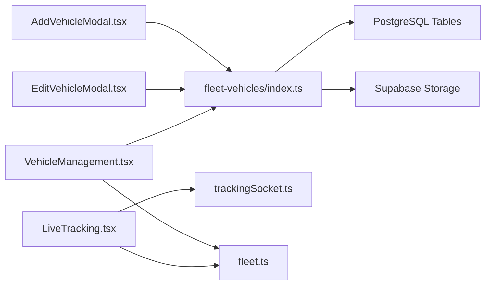

# Fleet Management Tables

<cite>
**Referenced Files in This Document**
- [CREATE_TABLES_SQL.md](file://CREATE_TABLES_SQL.md)
- [fleet_task_plan.md](file://fleet_task_plan.md)
- [20260228_fleet_management_system.sql](file://supabase/migrations/20260228_fleet_management_system.sql)
- [fleet-management-portal-design.md](file://docs/fleet-management-portal-design.md)
- [AddVehicleModal.tsx](file://src/fleet/components/vehicles/AddVehicleModal.tsx)
- [EditVehicleModal.tsx](file://src/fleet/components/vehicles/EditVehicleModal.tsx)
- [VehicleManagement.tsx](file://src/fleet/pages/VehicleManagement.tsx)
- [LiveTracking.tsx](file://src/fleet/pages/LiveTracking.tsx)
- [fleet.ts](file://src/fleet/types/fleet.ts)
- [index.ts](file://supabase/functions/fleet-vehicles/index.ts)
</cite>

## Table of Contents
1. [Introduction](#introduction)
2. [Project Structure](#project-structure)
3. [Core Components](#core-components)
4. [Architecture Overview](#architecture-overview)
5. [Detailed Component Analysis](#detailed-component-analysis)
6. [Dependency Analysis](#dependency-analysis)
7. [Performance Considerations](#performance-considerations)
8. [Troubleshooting Guide](#troubleshooting-guide)
9. [Conclusion](#conclusion)

## Introduction
This document provides comprehensive documentation for the fleet management tables and systems powering driver and vehicle operations. It covers the database schema for drivers, vehicles, driver assignments, and fleet analytics, along with workflows for driver onboarding, vehicle registration and maintenance tracking, real-time location monitoring, and delivery assignment algorithms. It also explains driver performance metrics, earnings calculation, payout processing, and fleet optimization strategies, including geofencing, route planning data structures, and driver availability management.

## Project Structure
The fleet management system is implemented across frontend React components, backend Supabase edge functions, and database migrations. The frontend components integrate with Supabase for data persistence and with a WebSocket service for live tracking. Edge functions provide secure, role-based access to fleet operations.

**Diagram sources**
- [VehicleManagement.tsx:1-434](file://src/fleet/pages/VehicleManagement.tsx#L1-L434)
- [AddVehicleModal.tsx:1-282](file://src/fleet/components/vehicles/AddVehicleModal.tsx#L1-L282)
- [EditVehicleModal.tsx:1-398](file://src/fleet/components/vehicles/EditVehicleModal.tsx#L1-L398)
- [LiveTracking.tsx:1-429](file://src/fleet/pages/LiveTracking.tsx#L1-L429)
- [fleet.ts:1-513](file://src/fleet/types/fleet.ts#L1-L513)
- [index.ts:1-671](file://supabase/functions/fleet-vehicles/index.ts#L1-L671)
- [20260228_fleet_management_system.sql:74-111](file://supabase/migrations/20260228_fleet_management_system.sql#L74-L111)
- [fleet-management-portal-design.md:169-534](file://docs/fleet-management-portal-design.md#L169-L534)

**Section sources**
- [fleet_task_plan.md:1-158](file://fleet_task_plan.md#L1-L158)
- [CREATE_TABLES_SQL.md:1-221](file://CREATE_TABLES_SQL.md#L1-L221)

## Core Components
This section outlines the core tables and their relationships, focusing on drivers, vehicles, driver assignments, and supporting analytics.

- Drivers table: Stores driver profiles, status, location tracking, performance metrics, and financial details.
- Vehicles table: Stores vehicle details, registration, insurance, status, and assignment to drivers.
- Driver Documents table: Tracks document uploads, verification status, and expiry dates.
- Driver Zones table: Manages driver-zone preferences and priorities.
- Driver Payouts table: Records earnings, bonuses, penalties, and payment processing.
- Driver Locations table: Historical location records for analytics and compliance.
- Driver Activity Logs and Fleet Activity Logs: Audit trails for driver actions and manager operations.

These tables are defined in the migration and design documents and are referenced by the frontend components and edge functions.

**Section sources**
- [20260228_fleet_management_system.sql:74-111](file://supabase/migrations/20260228_fleet_management_system.sql#L74-L111)
- [fleet-management-portal-design.md:169-534](file://docs/fleet-management-portal-design.md#L169-L534)

## Architecture Overview
The fleet management architecture integrates frontend components with Supabase for data and storage, edge functions for secure fleet operations, and a WebSocket service for live tracking.

**Diagram sources**
- [VehicleManagement.tsx:1-434](file://src/fleet/pages/VehicleManagement.tsx#L1-L434)
- [LiveTracking.tsx:1-429](file://src/fleet/pages/LiveTracking.tsx#L1-L429)
- [fleet.ts:1-513](file://src/fleet/types/fleet.ts#L1-L513)
- [index.ts:1-671](file://supabase/functions/fleet-vehicles/index.ts#L1-L671)

## Detailed Component Analysis

### Drivers and Driver Assignments
Drivers are managed with comprehensive profiles, status tracking, and performance metrics. Assignments link drivers to vehicles and zones, enabling optimized dispatch and route planning.

**Diagram sources**
- [fleet-management-portal-design.md:233-270](file://docs/fleet-management-portal-design.md#L233-L270)
- [fleet-management-portal-design.md:304-334](file://docs/fleet-management-portal-design.md#L304-L334)
- [fleet-management-portal-design.md:373-381](file://docs/fleet-management-portal-design.md#L373-L381)

Driver onboarding workflow:
- Add driver via AddDriver page/form (documents, zone assignment, vehicle assignment).
- Driver documents stored in Supabase Storage under fleet-documents.
- Driver status transitions through pending_verification, active, suspended, inactive.
- Zone preferences captured via driver_zones with priority and primary designation.

Driver availability management:
- is_online flag and current coordinates enable real-time visibility.
- driver_locations table captures historical movement for analytics.

**Section sources**
- [fleet_task_plan.md:46-62](file://fleet_task_plan.md#L46-L62)
- [fleet-management-portal-design.md:233-270](file://docs/fleet-management-portal-design.md#L233-L270)

### Vehicles and Maintenance Tracking
Vehicle management supports registration, status tracking, and maintenance scheduling.

**Diagram sources**
- [AddVehicleModal.tsx:33-113](file://src/fleet/components/vehicles/AddVehicleModal.tsx#L33-L113)
- [EditVehicleModal.tsx:52-147](file://src/fleet/components/vehicles/EditVehicleModal.tsx#L52-L147)
- [VehicleManagement.tsx:185-208](file://src/fleet/pages/VehicleManagement.tsx#L185-L208)

Vehicle registration and maintenance tracking:
- Plate number uniqueness enforced at database level.
- Insurance expiry monitored with alerts for expiring vehicles.
- Status changes trigger driver assignment updates and activity logging.

**Section sources**
- [fleet_task_plan.md:12-28](file://fleet_task_plan.md#L12-L28)
- [VehicleManagement.tsx:73-83](file://src/fleet/pages/VehicleManagement.tsx#L73-L83)

### Real-Time Location Monitoring
Live tracking integrates with a WebSocket service and Leaflet-based map to visualize driver locations and statuses.

**Diagram sources**
- [LiveTracking.tsx:86-131](file://src/fleet/pages/LiveTracking.tsx#L86-L131)
- [LiveTracking.tsx:225-255](file://src/fleet/pages/LiveTracking.tsx#L225-L255)

Driver availability management:
- Online/offline status reflected via marker colors.
- Stats overlay displays online and total driver counts.
- Search filters drivers in the sidebar and map.

**Section sources**
- [fleet_task_plan.md:29-45](file://fleet_task_plan.md#L29-L45)
- [LiveTracking.tsx:257-294](file://src/fleet/pages/LiveTracking.tsx#L257-L294)

### Delivery Assignment Algorithms and Route Planning
Route optimization is implemented as a planned feature with distribution-based algorithm and route visualization per driver.

**Diagram sources**
- [fleet_task_plan.md:63-74](file://fleet_task_plan.md#L63-L74)

Geofencing:
- Zones table stores polygon boundaries for geographic regions.
- Driver-zone preferences enable prioritized assignment within geofenced areas.

**Section sources**
- [fleet-management-portal-design.md:216-225](file://docs/fleet-management-portal-design.md#L216-L225)
- [fleet-management-portal-design.md:373-381](file://docs/fleet-management-portal-design.md#L373-L381)

### Driver Performance Metrics and Earnings Calculation
Driver performance metrics include total deliveries, rating, and cancellation rate. Earnings and payouts are tracked separately.

**Diagram sources**
- [fleet-management-portal-design.md:233-270](file://docs/fleet-management-portal-design.md#L233-L270)
- [fleet-management-portal-design.md:389-423](file://docs/fleet-management-portal-design.md#L389-L423)

Driver performance metrics:
- Aggregated from driver activity logs and order history.
- Used for fleet analytics dashboards and optimization decisions.

Earnings calculation and payout processing:
- Base earnings derived from completed deliveries.
- Bonuses and penalties applied based on performance and policy.
- Payouts tracked with status lifecycle: pending → processing → paid/failed.

**Section sources**
- [fleet-management-portal-design.md:389-423](file://docs/fleet-management-portal-design.md#L389-L423)

### Fleet Analytics
Analytics include driver status counts, city filters, and dashboard statistics for operational insights.

**Diagram sources**
- [fleet.ts:322-344](file://src/fleet/types/fleet.ts#L322-L344)

Analytics data sources:
- Drivers table for counts and status distributions.
- Driver locations and activity logs for time-based metrics.
- Payouts table for financial summaries.

**Section sources**
- [fleet.ts:322-344](file://src/fleet/types/fleet.ts#L322-L344)

## Dependency Analysis
The frontend components depend on Supabase for data and storage, and on edge functions for secure fleet operations. The edge function enforces role-based access and validates inputs.

**Diagram sources**
- [AddVehicleModal.tsx:1-282](file://src/fleet/components/vehicles/AddVehicleModal.tsx#L1-L282)
- [EditVehicleModal.tsx:1-398](file://src/fleet/components/vehicles/EditVehicleModal.tsx#L1-L398)
- [VehicleManagement.tsx:1-434](file://src/fleet/pages/VehicleManagement.tsx#L1-L434)
- [LiveTracking.tsx:1-429](file://src/fleet/pages/LiveTracking.tsx#L1-L429)
- [index.ts:1-671](file://supabase/functions/fleet-vehicles/index.ts#L1-L671)
- [fleet.ts:1-513](file://src/fleet/types/fleet.ts#L1-L513)

**Section sources**
- [index.ts:19-54](file://supabase/functions/fleet-vehicles/index.ts#L19-L54)
- [fleet.ts:409-446](file://src/fleet/types/fleet.ts#L409-L446)

## Performance Considerations
- Database indexing: Vehicles indexed by city, status, driver; drivers indexed by city, status, online status, and GIST for location; driver documents indexed by expiry and verification status; payouts indexed by driver, city, status, and period.
- Partitioning: Driver locations table designed for partitioning by time for performance.
- Edge function rate limiting: Placeholder for production-grade rate limiting with Redis.
- Frontend caching: Use Supabase queries with appropriate filters and ordering to minimize payload sizes.

[No sources needed since this section provides general guidance]

## Troubleshooting Guide
Common issues and resolutions:
- Vehicle creation failures: Validate required fields (cityId, type, plateNumber) and ensure plate number uniqueness.
- Unauthorized access: Verify JWT token type and city access permissions.
- Driver assignment conflicts: Ensure driver and vehicle are in the same city; unassign previous driver/vehicle as needed.
- Real-time tracking not updating: Confirm WebSocket connection status and token validity; verify driver coordinates are being updated.
- Document upload errors: Check Supabase Storage bucket permissions and file types.

**Section sources**
- [index.ts:144-258](file://supabase/functions/fleet-vehicles/index.ts#L144-L258)
- [index.ts:333-490](file://supabase/functions/fleet-vehicles/index.ts#L333-L490)
- [LiveTracking.tsx:225-255](file://src/fleet/pages/LiveTracking.tsx#L225-L255)

## Conclusion
The fleet management system provides a robust foundation for managing drivers and vehicles, tracking real-time locations, and optimizing operations through analytics and planned route planning. The database schema, frontend components, and edge functions work together to support scalable fleet operations with strong security and auditability.