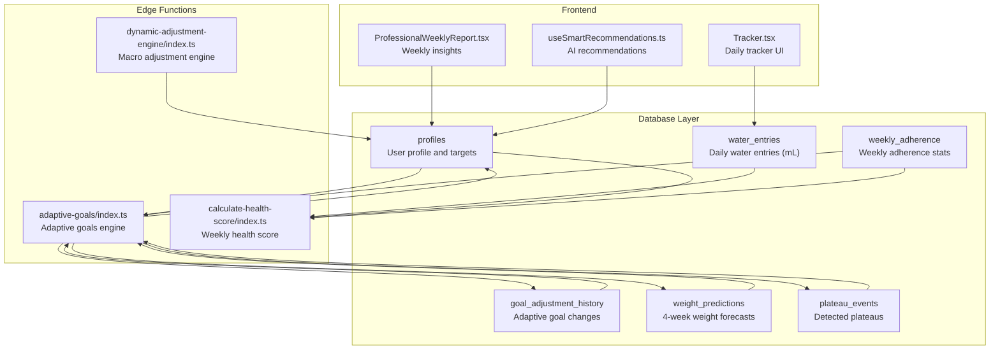
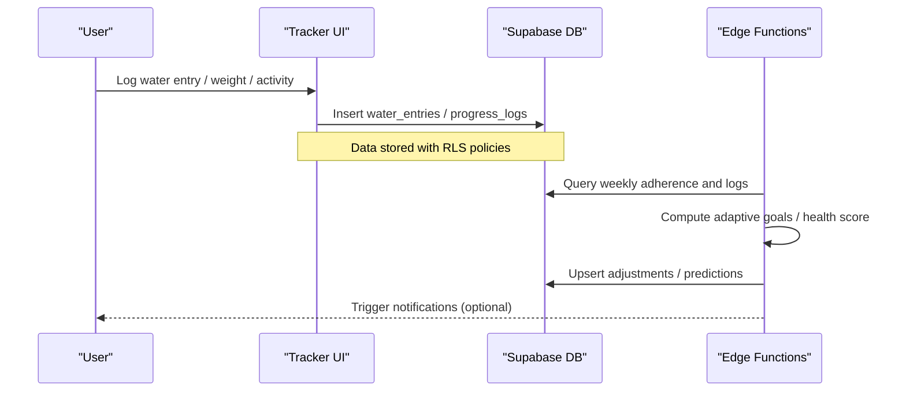
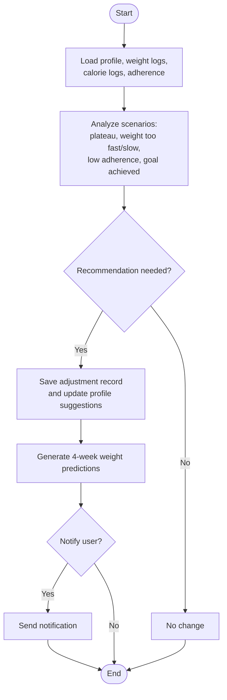
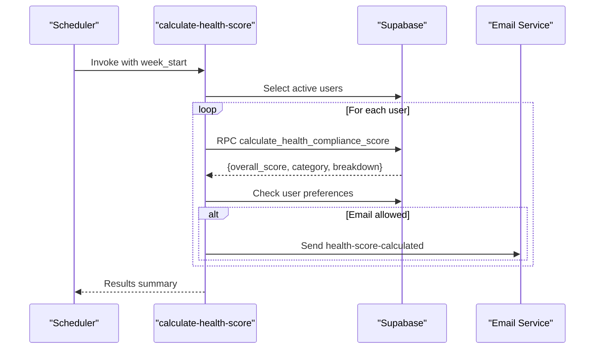
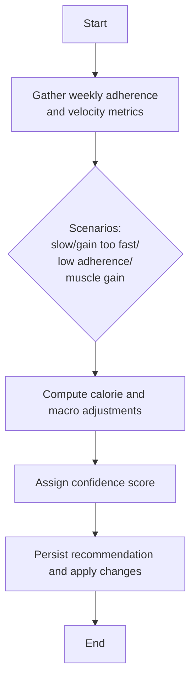
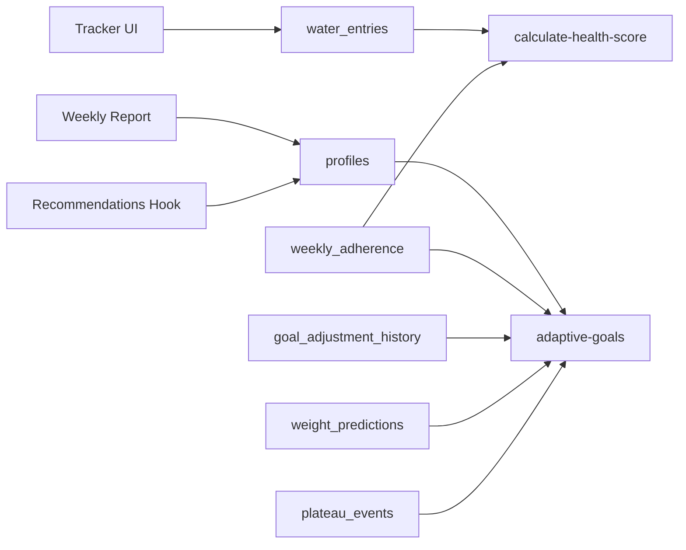

# Nutrition & Health Tables

<cite>
**Referenced Files in This Document**
- [CREATE_TABLES_SQL.md](file://CREATE_TABLES_SQL.md)
- [water_entries.sql](file://supabase/migrations/20260305000000_water_entries.sql)
- [calculate-health-score/index.ts](file://supabase/functions/calculate-health-score/index.ts)
- [adaptive-goals/index.ts](file://supabase/functions/adaptive-goals/index.ts)
- [dynamic-adjustment-engine/index.ts](file://supabase/functions/dynamic-adjustment-engine/index.ts)
- [Tracker.tsx](file://src/pages/Tracker.tsx)
- [ProfessionalWeeklyReport.tsx](file://src/components/progress/ProfessionalWeeklyReport.tsx)
- [useSmartRecommendations.ts](file://src/hooks/useSmartRecommendations.ts)
- [ai-report-generator.ts](file://src/lib/ai-report-generator.ts)
</cite>

## Table of Contents
1. [Introduction](#introduction)
2. [Project Structure](#project-structure)
3. [Core Components](#core-components)
4. [Architecture Overview](#architecture-overview)
5. [Detailed Component Analysis](#detailed-component-analysis)
6. [Dependency Analysis](#dependency-analysis)
7. [Performance Considerations](#performance-considerations)
8. [Troubleshooting Guide](#troubleshooting-guide)
9. [Conclusion](#conclusion)

## Introduction
This document describes the nutrition tracking and health monitoring data structures and algorithms in the system. It focuses on four key areas:
- Body metrics tracking and BMI visualization
- Daily water intake logging with granular entries
- Activity logging and step tracking
- Health score computation and adaptive goals system

It also explains how recommendations are generated, how health data privacy and retention are handled, and how wearable device integration fits into the architecture.

## Project Structure
The health and nutrition features span three layers:
- Database layer: Supabase tables and Row Level Security (RLS) policies
- Edge functions: Serverless logic for adaptive goals, health score calculation, and dynamic adjustments
- Frontend: UI components and hooks for data entry, visualization, and recommendations

**Diagram sources**
- [CREATE_TABLES_SQL.md:98-137](file://CREATE_TABLES_SQL.md#L98-L137)
- [water_entries.sql:1-27](file://supabase/migrations/20260305000000_water_entries.sql#L1-L27)
- [adaptive-goals/index.ts:337-521](file://supabase/functions/adaptive-goals/index.ts#L337-L521)
- [calculate-health-score/index.ts:32-218](file://supabase/functions/calculate-health-score/index.ts#L32-L218)
- [dynamic-adjustment-engine/index.ts:85-275](file://supabase/functions/dynamic-adjustment-engine/index.ts#L85-L275)
- [Tracker.tsx:41-73](file://src/pages/Tracker.tsx#L41-L73)
- [ProfessionalWeeklyReport.tsx:107-130](file://src/components/progress/ProfessionalWeeklyReport.tsx#L107-L130)

**Section sources**
- [CREATE_TABLES_SQL.md:98-137](file://CREATE_TABLES_SQL.md#L98-L137)
- [water_entries.sql:1-27](file://supabase/migrations/20260305000000_water_entries.sql#L1-L27)

## Core Components

### Body Metrics Tracking
- Purpose: Track body measurements and compute BMI for visualization.
- Data structures:
  - profiles: stores user demographics, current/target weight, and activity level.
  - Body measurements are accessed via hooks and UI components for weight and BMI bars.
- Privacy: RLS policies restrict access to profile data to the user and admins.

Key UI integration:
- Tracker page integrates body measurements and BMI visualization for daily view.

**Section sources**
- [CREATE_TABLES_SQL.md:98-137](file://CREATE_TABLES_SQL.md#L98-L137)
- [Tracker.tsx:41-73](file://src/pages/Tracker.tsx#L41-L73)

### Daily Water Intake Logging
- Purpose: Record individual water consumption entries with precise milliliter amounts.
- Data structure:
  - water_entries: per-user, per-day entries with RLS policies ensuring self-access.
- Granularity: Enables accurate hydration analytics and recommendations.

Privacy and retention:
- RLS policies restrict water entries to the owning user.
- Retention is managed by application logic and edge functions.

**Section sources**
- [water_entries.sql:1-27](file://supabase/migrations/20260305000000_water_entries.sql#L1-L27)

### Activity Logging and Step Tracking
- Purpose: Capture daily activity and steps for holistic health scoring.
- Data structures:
  - activity_log: records physical activities and steps.
  - weekly_adherence: aggregates adherence metrics including steps and calories.
- Integration: Used by adaptive goals and health score functions to assess consistency and activity patterns.

Note: The activity_log table definition is part of the broader system schema and is referenced by adaptive goals and health score computations.

**Section sources**
- [adaptive-goals/index.ts:264-314](file://supabase/functions/adaptive-goals/index.ts#L264-L314)
- [calculate-health-score/index.ts:124-160](file://supabase/functions/calculate-health-score/index.ts#L124-L160)

### Health Score Calculation
- Purpose: Compute weekly health compliance score across macro adherence, meal consistency, weight logging, and protein accuracy.
- Inputs: Active subscriptions, weekly adherence, and user-specific metrics.
- Outputs: Overall score, category (green/orange/red), and breakdown.
- Notifications: Optional email notifications based on user preferences.

**Section sources**
- [calculate-health-score/index.ts:13-30](file://supabase/functions/calculate-health-score/index.ts#L13-L30)
- [calculate-health-score/index.ts:32-218](file://supabase/functions/calculate-health-score/index.ts#L32-L218)

### Adaptive Goals System
- Purpose: Dynamically adjust calorie and macronutrient targets based on progress, adherence, and goals.
- Inputs: Profile data, recent weight logs, calorie logs, and adherence rates.
- Outputs: New calorie target, adjusted macros, confidence score, and suggested actions.
- Persistence: Stores adjustment history, predictions, and plateau events.

**Section sources**
- [adaptive-goals/index.ts:52-227](file://supabase/functions/adaptive-goals/index.ts#L52-L227)
- [adaptive-goals/index.ts:229-262](file://supabase/functions/adaptive-goals/index.ts#L229-L262)
- [adaptive-goals/index.ts:264-314](file://supabase/functions/adaptive-goals/index.ts#L264-L314)
- [adaptive-goals/index.ts:316-521](file://supabase/functions/adaptive-goals/index.ts#L316-L521)

### Nutrition Recommendation Algorithms
- Purpose: Provide actionable recommendations based on weekly trends and targets.
- Inputs: Average calories, protein, water intake, consistency, and streaks.
- Outputs: Priority-ranked recommendations (e.g., protein boost, portion control, hydration challenge).
- UI integration: Recommendations are surfaced in the dashboard and weekly report.

**Section sources**
- [useSmartRecommendations.ts:95-296](file://src/hooks/useSmartRecommendations.ts#L95-L296)
- [ai-report-generator.ts:570-602](file://src/lib/ai-report-generator.ts#L570-L602)
- [ProfessionalWeeklyReport.tsx:107-130](file://src/components/progress/ProfessionalWeeklyReport.tsx#L107-L130)

## Architecture Overview
The system follows a serverless-first architecture with Supabase as the backend:
- Edge functions process analytics and recommendations.
- RLS ensures data privacy at the database level.
- Frontend components consume APIs and hooks to present personalized insights.

**Diagram sources**
- [water_entries.sql:1-27](file://supabase/migrations/20260305000000_water_entries.sql#L1-L27)
- [adaptive-goals/index.ts:386-426](file://supabase/functions/adaptive-goals/index.ts#L386-L426)
- [calculate-health-score/index.ts:124-186](file://supabase/functions/calculate-health-score/index.ts#L124-L186)

## Detailed Component Analysis

### Adaptive Goals Engine
The adaptive goals engine analyzes user progress and generates targeted recommendations.

**Diagram sources**
- [adaptive-goals/index.ts:52-227](file://supabase/functions/adaptive-goals/index.ts#L52-L227)
- [adaptive-goals/index.ts:229-262](file://supabase/functions/adaptive-goals/index.ts#L229-L262)
- [adaptive-goals/index.ts:417-521](file://supabase/functions/adaptive-goals/index.ts#L417-L521)

**Section sources**
- [adaptive-goals/index.ts:52-227](file://supabase/functions/adaptive-goals/index.ts#L52-L227)
- [adaptive-goals/index.ts:229-262](file://supabase/functions/adaptive-goals/index.ts#L229-L262)
- [adaptive-goals/index.ts:316-521](file://supabase/functions/adaptive-goals/index.ts#L316-L521)

### Health Score Computation
The health score function computes a weekly compliance score and categorizes it.

**Diagram sources**
- [calculate-health-score/index.ts:32-218](file://supabase/functions/calculate-health-score/index.ts#L32-L218)

**Section sources**
- [calculate-health-score/index.ts:13-30](file://supabase/functions/calculate-health-score/index.ts#L13-L30)
- [calculate-health-score/index.ts:32-218](file://supabase/functions/calculate-health-score/index.ts#L32-L218)

### Dynamic Adjustment Engine
This engine generates macro adjustments based on adherence, velocity, and goals.

**Diagram sources**
- [dynamic-adjustment-engine/index.ts:85-275](file://supabase/functions/dynamic-adjustment-engine/index.ts#L85-L275)

**Section sources**
- [dynamic-adjustment-engine/index.ts:85-275](file://supabase/functions/dynamic-adjustment-engine/index.ts#L85-L275)

### Frontend Integration Points
- Tracker page: Integrates water entries, body measurements, and BMI visualization.
- Weekly report: Aggregates weekly stats and displays insights for hydration, consistency, and protein.
- Recommendations hook: Generates personalized recommendations based on weekly trends.

**Section sources**
- [Tracker.tsx:41-73](file://src/pages/Tracker.tsx#L41-L73)
- [ProfessionalWeeklyReport.tsx:107-130](file://src/components/progress/ProfessionalWeeklyReport.tsx#L107-L130)
- [ProfessionalWeeklyReport.tsx:227-864](file://src/components/progress/ProfessionalWeeklyReport.tsx#L227-L864)
- [useSmartRecommendations.ts:95-296](file://src/hooks/useSmartRecommendations.ts#L95-L296)

## Dependency Analysis
The system exhibits clear separation of concerns:
- Database tables define the schema and enforce privacy.
- Edge functions encapsulate business logic for analytics and recommendations.
- Frontend components depend on Supabase client libraries and React hooks.

**Diagram sources**
- [CREATE_TABLES_SQL.md:98-137](file://CREATE_TABLES_SQL.md#L98-L137)
- [water_entries.sql:1-27](file://supabase/migrations/20260305000000_water_entries.sql#L1-L27)
- [adaptive-goals/index.ts:337-521](file://supabase/functions/adaptive-goals/index.ts#L337-L521)
- [calculate-health-score/index.ts:124-186](file://supabase/functions/calculate-health-score/index.ts#L124-L186)

**Section sources**
- [adaptive-goals/index.ts:337-521](file://supabase/functions/adaptive-goals/index.ts#L337-L521)
- [calculate-health-score/index.ts:124-186](file://supabase/functions/calculate-health-score/index.ts#L124-L186)

## Performance Considerations
- Indexes: water_entries table includes a composite index on user_id and log_date to optimize queries.
- Aggregation: Edge functions compute weekly stats and adhere to time-window filters to limit dataset sizes.
- Caching: Consider caching frequent queries (e.g., daily totals) at the application layer to reduce database load.
- Batch processing: Health score and adaptive goals functions operate on active users and weekly windows to avoid real-time bottlenecks.

[No sources needed since this section provides general guidance]

## Troubleshooting Guide
Common issues and resolutions:
- Water entries not appearing:
  - Verify RLS policy allows the user to insert entries for the given date.
  - Confirm the user_id matches the authenticated session.
- Adaptive goals not updating:
  - Ensure adaptive goals are enabled for the user and sufficient historical data exists.
  - Check that weekly adherence was recorded for the current week.
- Health score not calculated:
  - Confirm the user has an active subscription.
  - Verify the RPC function for health compliance score exists and is callable.

**Section sources**
- [water_entries.sql:14-24](file://supabase/migrations/20260305000000_water_entries.sql#L14-L24)
- [adaptive-goals/index.ts:337-352](file://supabase/functions/adaptive-goals/index.ts#L337-L352)
- [calculate-health-score/index.ts:90-115](file://supabase/functions/calculate-health-score/index.ts#L90-L115)

## Conclusion
The system provides a robust foundation for nutrition and health tracking through:
- Secure, privacy-focused data storage with RLS
- Serverless analytics for adaptive goals and health scoring
- Granular hydration logging and body metrics visualization
- Personalized recommendations and progress insights

Future enhancements could include expanded wearable device integrations, extended retention policies, and deeper analytics on activity and sleep patterns.