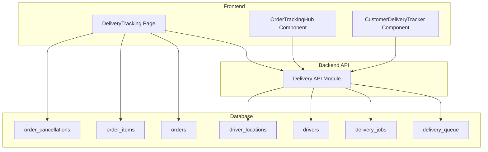
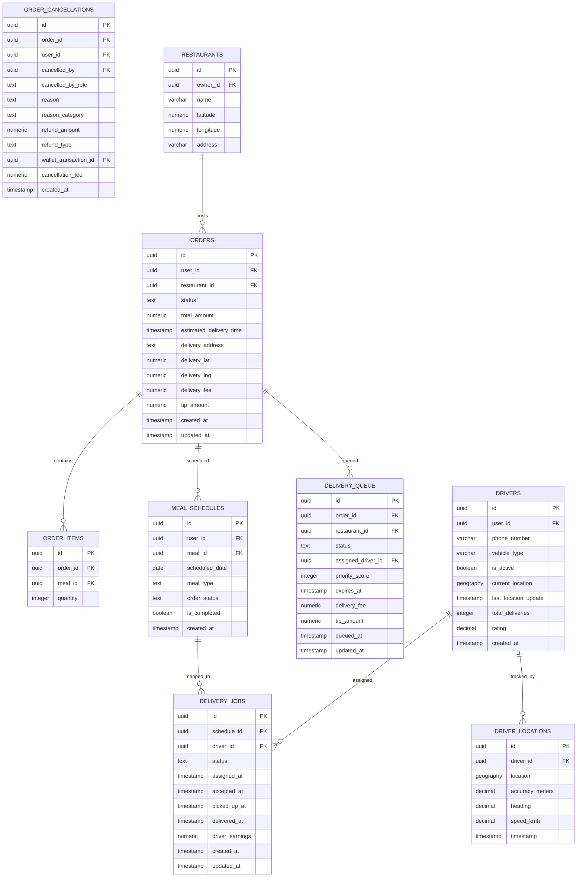
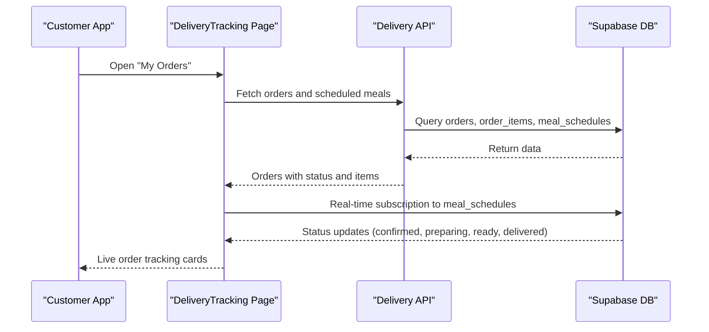
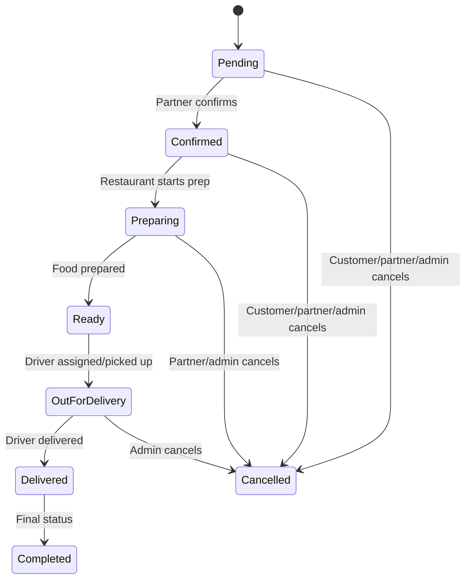
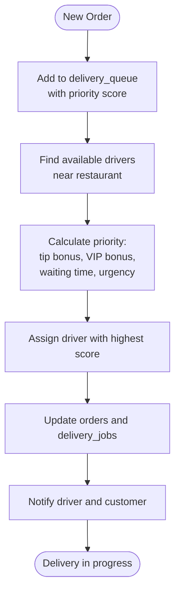
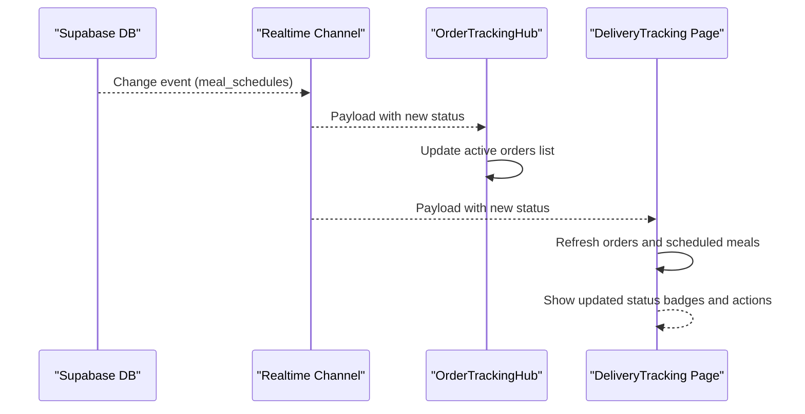
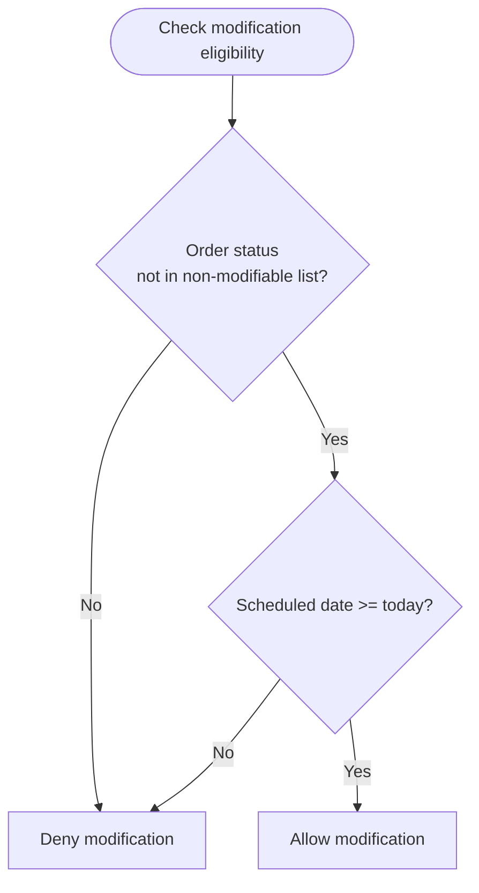
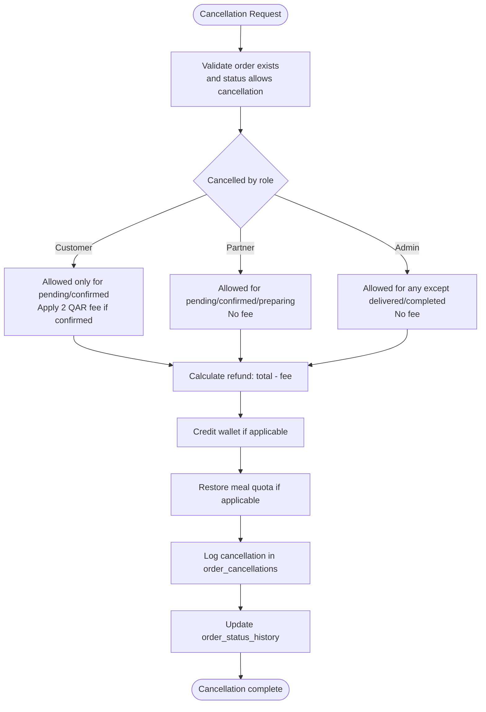
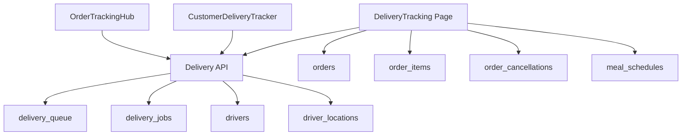

# Order & Delivery Tables

<cite>
**Referenced Files in This Document**
- [delivery_system_design.md](file://delivery_system_design.md)
- [delivery_system_plan.md](file://delivery_system_plan.md)
- [delivery_integration_plan.md](file://delivery_integration_plan.md)
- [delivery_system_visual.md](file://delivery_system_visual.md)
- [delivery_queue_migration.sql](file://supabase/migrations/20240101000003_add_delivery_queue.sql)
- [cancel_order_rpc.sql](file://supabase/migrations/20240101000002_add_cancel_order_rpc.sql)
- [CREATE_TABLES_SQL.md](file://CREATE_TABLES_SQL.md)
- [delivery_tracking_page.tsx](file://src/pages/DeliveryTracking.tsx)
- [order_tracking_hub.tsx](file://src/components/OrderTrackingHub.tsx)
- [order_modification_hook.ts](file://src/hooks/useOrderModification.ts)
- [delivery_api.ts](file://src/integrations/supabase/delivery.ts)
- [driver_delivery_tracker.tsx](file://src/components/customer/CustomerDeliveryTracker.tsx)
</cite>

## Table of Contents
1. [Introduction](#introduction)
2. [Project Structure](#project-structure)
3. [Core Components](#core-components)
4. [Architecture Overview](#architecture-overview)
5. [Detailed Component Analysis](#detailed-component-analysis)
6. [Dependency Analysis](#dependency-analysis)
7. [Performance Considerations](#performance-considerations)
8. [Troubleshooting Guide](#troubleshooting-guide)
9. [Conclusion](#conclusion)

## Introduction
This document provides comprehensive technical documentation for the order management and delivery tracking system, focusing on the database tables, workflows, and real-time tracking capabilities. It covers order lifecycle management, delivery routing algorithms, driver assignment logic, real-time delivery status updates, order modification and cancellation procedures, refund processing, delivery fee calculations, tip management, and performance metrics tracking.

## Project Structure
The order and delivery system spans frontend components, backend API integrations, and database schema with stored procedures. The key areas include:
- Database schema with delivery-related tables and stored procedures
- Frontend pages and components for order tracking and delivery monitoring
- API integration layer for driver management, job assignment, and real-time updates
- Migration files defining table structures and business logic

**Diagram sources**
- [delivery_tracking_page.tsx:113-592](file://src/pages/DeliveryTracking.tsx#L113-L592)
- [order_tracking_hub.tsx:37-235](file://src/components/OrderTrackingHub.tsx#L37-L235)
- [delivery_api.ts:1-735](file://src/integrations/supabase/delivery.ts#L1-L735)
- [delivery_queue_migration.sql:9-60](file://supabase/migrations/20240101000003_add_delivery_queue.sql#L9-L60)
- [cancel_order_rpc.sql:9-36](file://supabase/migrations/20240101000002_add_cancel_order_rpc.sql#L9-L36)

**Section sources**
- [delivery_system_design.md:1-510](file://delivery_system_design.md#L1-L510)
- [delivery_system_plan.md:1-155](file://delivery_system_plan.md#L1-L155)

## Core Components
This section documents the primary database tables and their relationships, along with the frontend components that interact with them.

### Database Tables

#### Orders and Order Items
- **orders**: Central order record containing user association, status, timing, and financial details.
- **order_items**: Links meals to orders with quantities and supports multi-meal orders.

#### Delivery Queue and Cancellations
- **delivery_queue**: Manages orders awaiting driver assignment with priority scoring, status tracking, and escalation mechanisms.
- **order_cancellations**: Audit trail for cancellations including reasons, refund amounts, and policy enforcement.

#### Delivery Jobs and Drivers
- **delivery_jobs**: Tracks driver assignments, job statuses, timing, photos, and financial outcomes.
- **drivers**: Driver profiles, availability, ratings, and current location tracking.
- **driver_locations**: Historical location data for real-time tracking and analytics.

#### Supporting Tables
- **meal_schedules**: Links orders to scheduled delivery times and manages order_status for tracking.
- **restaurants**: Restaurant metadata used for delivery routing and driver assignment.

**Diagram sources**
- [delivery_queue_migration.sql:9-60](file://supabase/migrations/20240101000003_add_delivery_queue.sql#L9-L60)
- [cancel_order_rpc.sql:9-36](file://supabase/migrations/20240101000002_add_cancel_order_rpc.sql#L9-L36)
- [delivery_system_visual.md:74-100](file://delivery_system_visual.md#L74-L100)
- [delivery_integration_plan.md:64-137](file://delivery_integration_plan.md#L64-L137)

**Section sources**
- [delivery_queue_migration.sql:1-595](file://supabase/migrations/20240101000003_add_delivery_queue.sql#L1-L595)
- [cancel_order_rpc.sql:1-393](file://supabase/migrations/20240101000002_add_cancel_order_rpc.sql#L1-L393)
- [delivery_system_visual.md:74-119](file://delivery_system_visual.md#L74-L119)
- [delivery_integration_plan.md:64-137](file://delivery_integration_plan.md#L64-L137)

## Architecture Overview
The system follows a modular architecture with clear separation between order management, delivery orchestration, and real-time tracking. The frontend components subscribe to database changes for live updates, while the backend API encapsulates driver assignment, job lifecycle transitions, and location tracking.

**Diagram sources**
- [delivery_tracking_page.tsx:138-275](file://src/pages/DeliveryTracking.tsx#L138-L275)
- [order_tracking_hub.tsx:44-114](file://src/components/OrderTrackingHub.tsx#L44-L114)

**Section sources**
- [delivery_tracking_page.tsx:113-275](file://src/pages/DeliveryTracking.tsx#L113-L275)
- [order_tracking_hub.tsx:37-114](file://src/components/OrderTrackingHub.tsx#L37-L114)

## Detailed Component Analysis

### Order Lifecycle Management
The order lifecycle spans from creation through delivery completion, with explicit status transitions and real-time updates.

Key behaviors:
- Status updates are propagated to both orders and meal_schedules for tracking consistency.
- Real-time subscriptions notify customers of status changes (confirmed, preparing, ready, out_for_delivery, delivered, cancelled).
- The unified order view aggregates both placed orders and scheduled meals, enabling a single pane of glass.

**Section sources**
- [delivery_tracking_page.tsx:64-76](file://src/pages/DeliveryTracking.tsx#L64-L76)
- [order_tracking_hub.tsx:121-132](file://src/components/OrderTrackingHub.tsx#L121-L132)

### Delivery Routing and Driver Assignment
The system employs a priority-based queue with geographic proximity to assign drivers efficiently.

Priority scoring factors:
- Tip amount: higher tips increase priority (up to +20 points).
- VIP subscription tier: premium subscribers gain +15 points.
- Waiting time: older orders receive +1 point per 5 minutes (up to +15).
- Urgency: orders within 30 minutes of estimated delivery time gain +10 points.

**Diagram sources**
- [delivery_queue_migration.sql:526-575](file://supabase/migrations/20240101000003_add_delivery_queue.sql#L526-L575)

**Section sources**
- [delivery_queue_migration.sql:148-209](file://supabase/migrations/20240101000003_add_delivery_queue.sql#L148-L209)
- [delivery_queue_migration.sql:472-524](file://supabase/migrations/20240101000003_add_delivery_queue.sql#L472-L524)

### Real-Time Delivery Status Updates
Real-time updates are achieved through Supabase PostgreSQL Realtime, ensuring immediate visibility of status changes and driver movements.

**Diagram sources**
- [order_tracking_hub.tsx:94-114](file://src/components/OrderTrackingHub.tsx#L94-L114)
- [delivery_tracking_page.tsx:258-275](file://src/pages/DeliveryTracking.tsx#L258-L275)

**Section sources**
- [order_tracking_hub.tsx:93-114](file://src/components/OrderTrackingHub.tsx#L93-L114)
- [delivery_tracking_page.tsx:258-275](file://src/pages/DeliveryTracking.tsx#L258-L275)

### Order Modification Workflows
Order modification eligibility is governed by status rules and scheduling constraints.

Non-modifiable statuses include delivered, cancelled, in_transit, and preparing. Scheduled meals can be modified only if the scheduled date is today or in the future.

**Diagram sources**
- [order_modification_hook.ts:6-22](file://src/hooks/useOrderModification.ts#L6-L22)

**Section sources**
- [order_modification_hook.ts:1-23](file://src/hooks/useOrderModification.ts#L1-L23)

### Cancellation Procedures and Refund Processing
The system enforces role-based cancellation rules and automates refund processing with audit logging.

Refund categories:
- Full: when no cancellation fee is applied.
- Partial: when a fee is deducted.
- None: when the order value is zero or negative after fee deduction.

**Diagram sources**
- [cancel_order_rpc.sql:64-267](file://supabase/migrations/20240101000002_add_cancel_order_rpc.sql#L64-L267)

**Section sources**
- [cancel_order_rpc.sql:112-142](file://supabase/migrations/20240101000002_add_cancel_order_rpc.sql#L112-L142)
- [cancel_order_rpc.sql:162-190](file://supabase/migrations/20240101000002_add_cancel_order_rpc.sql#L162-L190)
- [cancel_order_rpc.sql:224-239](file://supabase/migrations/20240101000002_add_cancel_order_rpc.sql#L224-L239)

### Delivery Fee Calculations and Tip Management
Delivery fee and tip management are integrated into the delivery queue and order records.

Fee and tip fields:
- delivery_fee: Base delivery fee stored in delivery_queue and orders.
- tip_amount: Optional tip amount associated with the order.

Priority scoring incorporates tip amounts to incentivize higher-paying orders.

**Section sources**
- [delivery_queue_migration.sql:47-48](file://supabase/migrations/20240101000003_add_delivery_queue.sql#L47-L48)
- [delivery_queue_migration.sql:551-554](file://supabase/migrations/20240101000003_add_delivery_queue.sql#L551-L554)

### Performance Metrics Tracking
The system tracks key performance indicators through database statistics and driver analytics.

Metrics:
- Delivery time: Average time from restaurant readiness to successful delivery.
- Success rate: Percentage of deliveries completed successfully.
- Customer satisfaction: Average ratings and feedback.
- Driver utilization: Percentage of drivers active during peak hours.
- Cost efficiency: Average delivery cost per order.

Statistics collection:
- Delivery statistics endpoint aggregates job statuses over configurable date ranges.
- Driver profiles include ratings and total deliveries for performance evaluation.

**Section sources**
- [delivery_api.ts:617-643](file://src/integrations/supabase/delivery.ts#L617-L643)
- [delivery_system_design.md:449-456](file://delivery_system_design.md#L449-L456)

## Dependency Analysis
The system exhibits clear separation of concerns with minimal coupling between components.

**Diagram sources**
- [delivery_tracking_page.tsx:1-50](file://src/pages/DeliveryTracking.tsx#L1-L50)
- [order_tracking_hub.tsx:1-35](file://src/components/OrderTrackingHub.tsx#L1-L35)
- [delivery_api.ts:1-60](file://src/integrations/supabase/delivery.ts#L1-L60)

**Section sources**
- [delivery_tracking_page.tsx:1-50](file://src/pages/DeliveryTracking.tsx#L1-L50)
- [order_tracking_hub.tsx:1-35](file://src/components/OrderTrackingHub.tsx#L1-L35)
- [delivery_api.ts:1-60](file://src/integrations/supabase/delivery.ts#L1-L60)

## Performance Considerations
- Indexing: Strategic indexes on delivery_queue (status, priority, location) and driver_locations (driver_id, timestamp) improve query performance.
- Real-time updates: Supabase Realtime minimizes polling overhead and ensures timely UI updates.
- Driver proximity: Geographic indexing and distance calculations enable efficient driver matching.
- Transaction safety: Stored procedures enforce atomicity for critical operations like driver assignment and cancellations.

## Troubleshooting Guide
Common issues and resolutions:
- No drivers available: The system throws an error when no drivers meet availability criteria. Consider expanding driver coverage or relaxing constraints.
- Expired assignments: If a driver does not accept within the expiry window, the assignment resets to waiting for reassignment.
- Real-time updates not appearing: Verify Supabase Realtime subscriptions and network connectivity.
- Cancellation errors: Ensure the order status allows cancellation for the requesting role and that the order is not already delivered or completed.

**Section sources**
- [delivery_api.ts:199-201](file://src/integrations/supabase/delivery.ts#L199-L201)
- [delivery_api.ts:288-305](file://src/integrations/supabase/delivery.ts#L288-L305)
- [cancel_order_rpc.sql:108-110](file://supabase/migrations/20240101000002_add_cancel_order_rpc.sql#L108-L110)

## Conclusion
The order and delivery system provides a robust foundation for managing multi-restaurant orders, intelligent driver assignment, and real-time tracking. Its modular design, comprehensive audit trails, and performance-focused architecture support scalability and maintainability. The documented workflows for cancellation, refund processing, fee calculation, and metrics tracking ensure operational transparency and customer satisfaction.