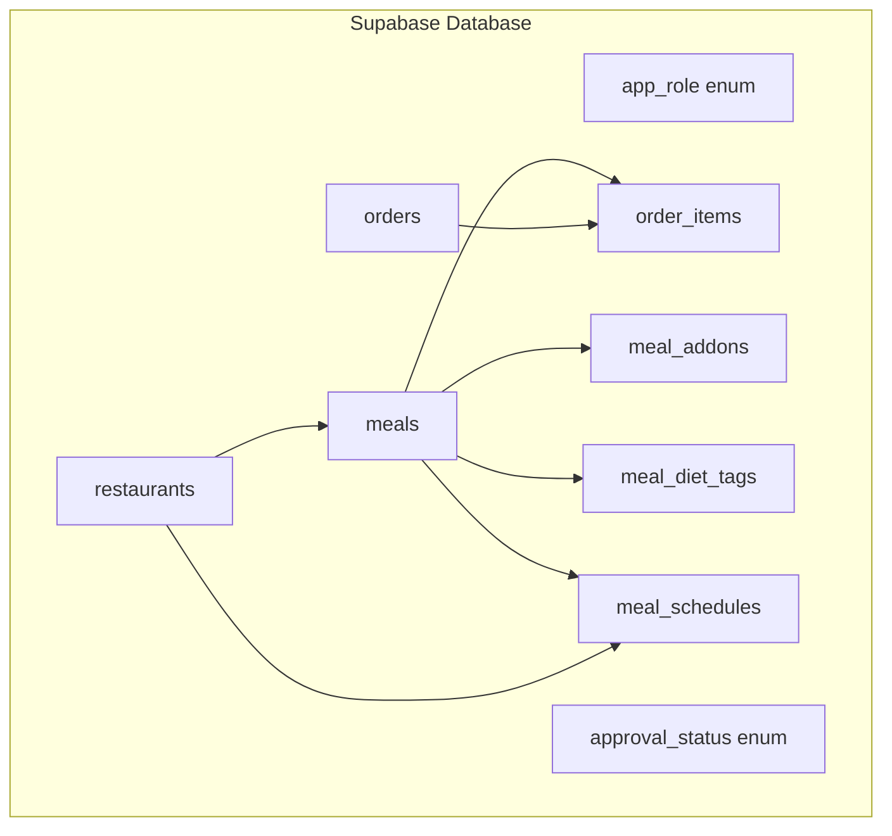
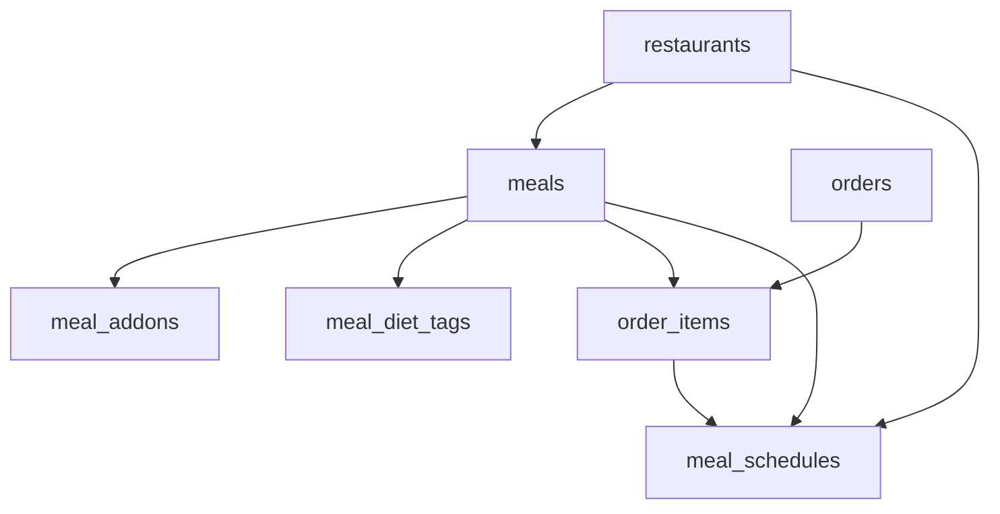
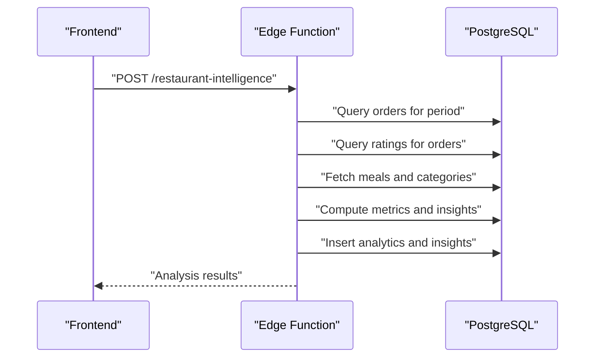
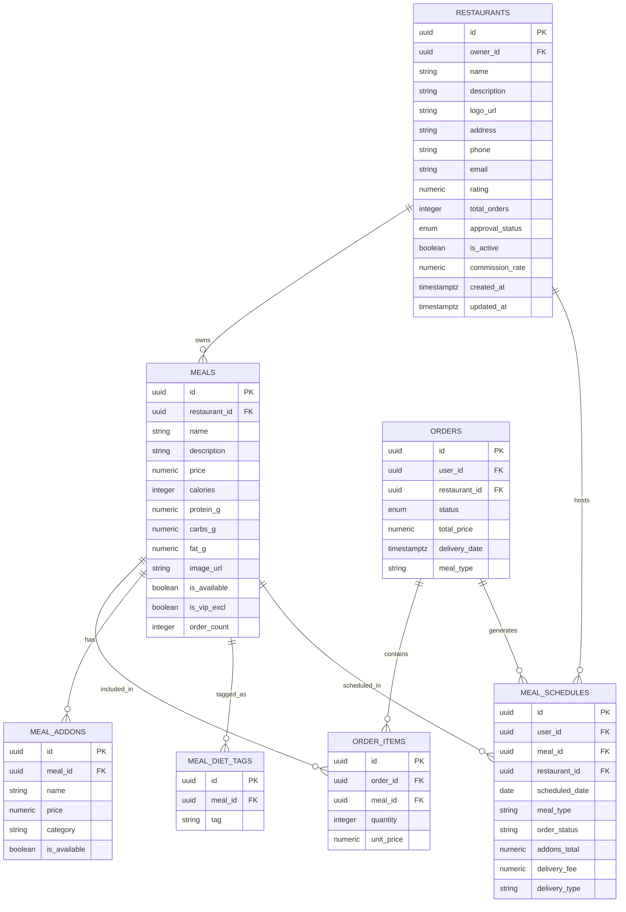

# Restaurant & Partner Tables

<cite>
**Referenced Files in This Document**
- [CREATE_TABLES_SQL.md](file://CREATE_TABLES_SQL.md)
- [types.ts](file://supabase/types.ts)
- [20250220000000_create_essential_tables.sql](file://supabase/migrations/20250220000000_create_essential_tables.sql)
- [20260221000002_fix_restaurants_columns.sql](file://supabase/migrations/20260221000002_fix_restaurants_columns.sql)
- [20260221220600_fix_app_role_enum_restaurant.sql](file://supabase/migrations/20260221220600_fix_app_role_enum_restaurant.sql)
- [20260223000005_fix_homepage_errors.sql](file://supabase/migrations/20260223000005_fix_homepage_errors.sql)
- [20260313200001_add_commission_rate_to_restaurants.sql](file://supabase/migrations/20260313200001_add_commission_rate_to_restaurants.sql)
- [debug_restaurants.sql](file://debug_restaurants.sql)
- [restaurant-intelligence-engine/index.ts](file://supabase/functions/restaurant-intelligence-engine/index.ts)
</cite>

## Table of Contents
1. [Introduction](#introduction)
2. [Project Structure](#project-structure)
3. [Core Components](#core-components)
4. [Architecture Overview](#architecture-overview)
5. [Detailed Component Analysis](#detailed-component-analysis)
6. [Dependency Analysis](#dependency-analysis)
7. [Performance Considerations](#performance-considerations)
8. [Troubleshooting Guide](#troubleshooting-guide)
9. [Conclusion](#conclusion)

## Introduction
This document describes the restaurant and partner management tables that power the Nutrio platform. It covers restaurant profile management, branch location tracking, menu item organization, and meal categorization systems. It also documents pricing structures, availability management, and partner commission calculations, along with the relationships between restaurants, branches, and menu items, including proper indexing and foreign key constraints.

## Project Structure
The restaurant and partner data model is primarily defined in Supabase migrations and TypeScript type definitions. The key elements include:
- Enum types for roles, statuses, and categories
- Core tables: restaurants, meals, meal_addons, meal_diet_tags, orders, order_items, meal_schedules
- Security functions and row-level security (RLS) policies
- Edge functions for restaurant intelligence and analytics

**Diagram sources**
- [20250220000000_create_essential_tables.sql:4-74](file://supabase/migrations/20250220000000_create_essential_tables.sql#L4-L74)
- [20260221000002_fix_restaurants_columns.sql:4-37](file://supabase/migrations/20260221000002_fix_restaurants_columns.sql#L4-L37)
- [20260223000005_fix_homepage_errors.sql:192-232](file://supabase/migrations/20260223000005_fix_homepage_errors.sql#L192-L232)

**Section sources**
- [20250220000000_create_essential_tables.sql:4-74](file://supabase/migrations/20250220000000_create_essential_tables.sql#L4-L74)
- [20260221000002_fix_restaurants_columns.sql:4-37](file://supabase/migrations/20260221000002_fix_restaurants_columns.sql#L4-L37)
- [20260223000005_fix_homepage_errors.sql:192-232](file://supabase/migrations/20260223000005_fix_homepage_errors.sql#L192-L232)

## Core Components
This section outlines the primary tables and their responsibilities:

- restaurants
  - Stores restaurant profiles, ownership, approval status, ratings, and operational flags
  - Includes commission_rate for platform take-per-meal
  - Maintains audit timestamps and approval lifecycle

- meals
  - Contains menu items linked to restaurants
  - Tracks pricing, nutritional info, availability, and dietary attributes
  - Supports VIP exclusivity and ordering counts

- meal_addons
  - Associates optional add-ons to meals with pricing and categorization

- meal_diet_tags
  - Links meals to diet tags for filtering and compliance

- orders and order_items
  - Records customer orders and individual meal selections with quantities and unit prices

- meal_schedules
  - Manages scheduled orders, delivery fees, and delivery types with restaurant linkage

- Supporting enums and functions
  - Role and status enums ensure consistent data across the system
  - Security functions and RLS policies protect sensitive data

**Section sources**
- [20260221000002_fix_restaurants_columns.sql:4-37](file://supabase/migrations/20260221000002_fix_restaurants_columns.sql#L4-L37)
- [20260313200001_add_commission_rate_to_restaurants.sql:1-11](file://supabase/migrations/20260313200001_add_commission_rate_to_restaurants.sql#L1-L11)
- [20260223000005_fix_homepage_errors.sql:192-232](file://supabase/migrations/20260223000005_fix_homepage_errors.sql#L192-L232)
- [types.ts:1-800](file://supabase/types.ts#L1-L800)

## Architecture Overview
The restaurant and partner architecture centers on restaurants owning meals, which compose orders through order_items. Meal schedules connect orders to specific delivery logistics. Security is enforced via RLS policies and role checks.

**Diagram sources**
- [20260223000005_fix_homepage_errors.sql:192-232](file://supabase/migrations/20260223000005_fix_homepage_errors.sql#L192-L232)
- [types.ts:1-800](file://supabase/types.ts#L1-L800)

## Detailed Component Analysis

### Restaurants Table
Responsibilities:
- Store restaurant profile data (name, description, contact info)
- Track approval lifecycle and operational status
- Maintain rating and order volume metrics
- Define platform commission rate per restaurant

Key columns and constraints:
- Composite primary key id
- Owner reference to auth.users
- Approval status enum with default pending
- Rating with check constraint
- Commission rate numeric with default percentage
- Audit timestamps with triggers

Relationships:
- 1:N with meals via restaurant_id
- 1:N with meal_schedules via restaurant_id

Indexes and constraints:
- Foreign key on owner_id
- Check constraints on rating range
- Trigger for updated_at timestamp updates

**Section sources**
- [20260221000002_fix_restaurants_columns.sql:4-37](file://supabase/migrations/20260221000002_fix_restaurants_columns.sql#L4-L37)
- [20260313200001_add_commission_rate_to_restaurants.sql:1-11](file://supabase/migrations/20260313200001_add_commission_rate_to_restaurants.sql#L1-L11)

### Meals Table
Responsibilities:
- Represent menu items offered by restaurants
- Store pricing, nutritional information, and availability
- Link to diet tags and add-ons
- Track order counts and VIP exclusivity

Key columns and constraints:
- Primary key id
- Foreign key restaurant_id to restaurants
- Price and nutritional values
- Availability flags and VIP exclusivity
- Order count tracking

Relationships:
- Belongs to restaurants
- 1:N with order_items
- 1:N with meal_addons
- 1:N with meal_diet_tags
- 1:N with meal_schedules

Indexes and constraints:
- Foreign key constraint to restaurants
- Check constraints on nutritional values
- Composite indexes for performance

**Section sources**
- [20260223000005_fix_homepage_errors.sql:216-232](file://supabase/migrations/20260223000005_fix_homepage_errors.sql#L216-L232)

### Meal Schedules Table
Responsibilities:
- Manage scheduled orders and delivery logistics
- Track delivery fees, types, and order status
- Facilitate restaurant-level scheduling queries

Key columns and constraints:
- Primary key id
- References to users, meals, and restaurants
- Order status tracking
- Delivery fee and type fields
- Add-ons total aggregation

Relationships:
- Links orders, meals, and restaurants
- Supports delivery and scheduling workflows

Indexes and constraints:
- Foreign keys to restaurants and meals
- Indexes on restaurant_id and order_status
- Backfilled restaurant_id from meals

**Section sources**
- [20260223000005_fix_homepage_errors.sql:135-203](file://supabase/migrations/20260223000005_fix_homepage_errors.sql#L135-L203)

### Orders and Order Items
Responsibilities:
- Record customer orders and individual selections
- Capture quantities, unit prices, and totals
- Support order lifecycle tracking

Key columns and constraints:
- Primary key id
- References to users and restaurants
- Status tracking and delivery metadata
- Totals and timestamps

Relationships:
- 1:N with order_items
- Links to meals via order_items

Indexes and constraints:
- Foreign keys to related entities
- Status enums and check constraints

**Section sources**
- [types.ts:230-330](file://supabase/types.ts#L230-L330)

### Security and Access Control
Security functions and policies:
- Role checking functions for user roles
- Row-level security on sensitive tables
- Admin-only access to administrative data
- User self-service for profiles and roles

Enums and data integrity:
- Consistent enums for statuses and roles
- Check constraints for numeric ranges
- Triggers for audit timestamps

**Section sources**
- [20250220000000_create_essential_tables.sql:88-120](file://supabase/migrations/20250220000000_create_essential_tables.sql#L88-L120)
- [20250220000000_create_essential_tables.sql:246-270](file://supabase/migrations/20250220000000_create_essential_tables.sql#L246-L270)

### Restaurant Intelligence Engine
The restaurant-intelligence-engine function performs:
- Demand scoring and capacity utilization analysis
- Growth rate calculations
- Insights generation for overloaded and underutilized restaurants
- Optional demand balancing actions

Processing logic:
- Aggregates order and rating data for selected periods
- Computes peak hours and popular categories
- Generates actionable insights and updates analytics tables

**Diagram sources**
- [restaurant-intelligence-engine/index.ts:193-421](file://supabase/functions/restaurant-intelligence-engine/index.ts#L193-L421)

**Section sources**
- [restaurant-intelligence-engine/index.ts:1-422](file://supabase/functions/restaurant-intelligence-engine/index.ts#L1-L422)

## Dependency Analysis
The following diagram shows the primary dependencies among restaurant-related tables:

**Diagram sources**
- [20260221000002_fix_restaurants_columns.sql:4-37](file://supabase/migrations/20260221000002_fix_restaurants_columns.sql#L4-L37)
- [20260223000005_fix_homepage_errors.sql:192-232](file://supabase/migrations/20260223000005_fix_homepage_errors.sql#L192-L232)
- [types.ts:1-800](file://supabase/types.ts#L1-L800)

**Section sources**
- [20260221000002_fix_restaurants_columns.sql:4-37](file://supabase/migrations/20260221000002_fix_restaurants_columns.sql#L4-L37)
- [20260223000005_fix_homepage_errors.sql:192-232](file://supabase/migrations/20260223000005_fix_homepage_errors.sql#L192-L232)
- [types.ts:1-800](file://supabase/types.ts#L1-L800)

## Performance Considerations
- Indexes on frequently queried columns:
  - blocked_ips(ip_address), blocked_ips(is_active)
  - user_ip_logs(user_id), user_ip_logs(ip_address), user_ip_logs(created_at desc)
  - meal_schedules(restaurant_id), meal_schedules(order_status)
- Triggers for automatic updated_at timestamps reduce application-side overhead
- Enums and check constraints minimize storage and improve query performance
- Edge functions compute analytics off the main request path

[No sources needed since this section provides general guidance]

## Troubleshooting Guide
Common issues and resolutions:
- Missing restaurants data or admin visibility:
  - Verify restaurants table population and RLS policies
  - Confirm admin role assignment for users
- Foreign key constraint failures:
  - Ensure meals.restaurant_id references restaurants.id
  - Backfill restaurant_id in meal_schedules from meals table
- Commission rate discrepancies:
  - Validate commission_rate defaults and per-restaurant overrides
- Role enum inconsistencies:
  - Confirm app_role includes both 'restaurant' and 'partner' values

Diagnostic queries:
- Count restaurants and pending approvals
- Verify admin role presence for specific users
- Inspect RLS policies on restaurants

**Section sources**
- [debug_restaurants.sql:1-50](file://debug_restaurants.sql#L1-L50)
- [20260221220600_fix_app_role_enum_restaurant.sql:1-16](file://supabase/migrations/20260221220600_fix_app_role_enum_restaurant.sql#L1-L16)
- [20260223000005_fix_homepage_errors.sql:216-232](file://supabase/migrations/20260223000005_fix_homepage_errors.sql#L216-L232)

## Conclusion
The restaurant and partner tables form a robust foundation for managing restaurant profiles, menus, orders, and scheduling. The schema enforces referential integrity, supports performance through strategic indexes, and maintains security via RLS policies. The addition of commission_rate enables precise financial calculations per restaurant, while the restaurant-intelligence-engine provides actionable insights for operational optimization.