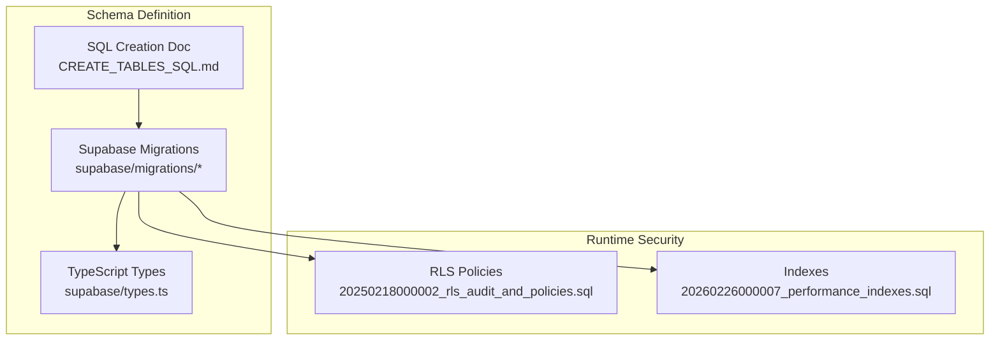
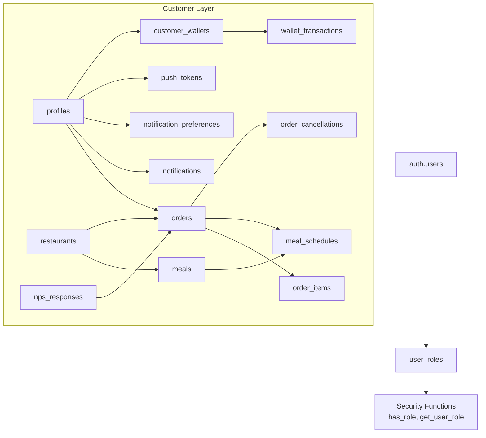
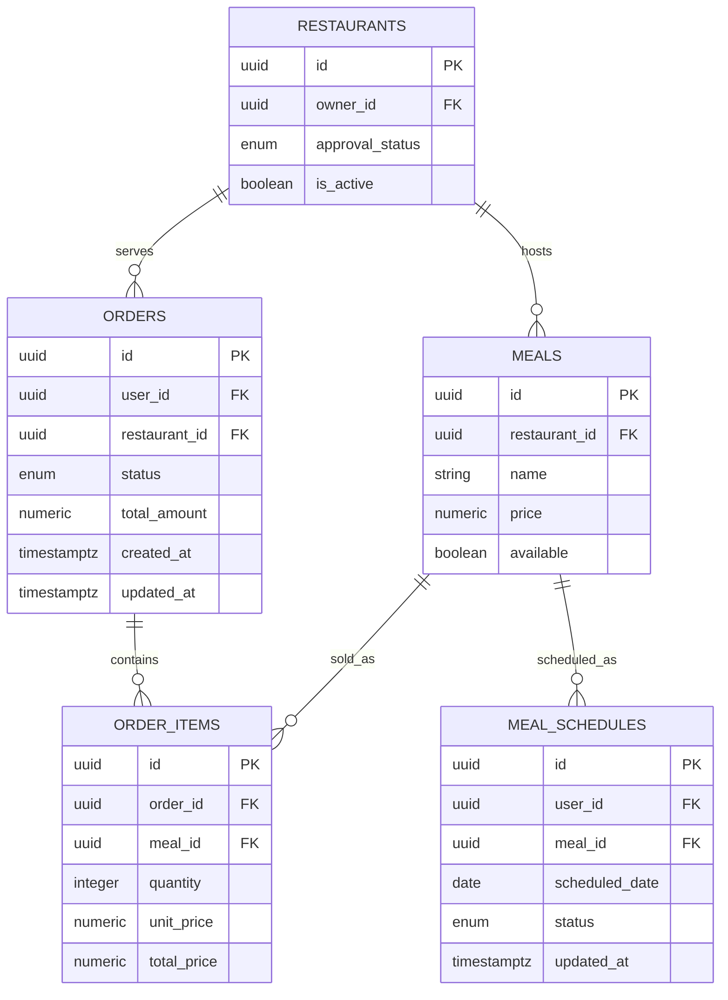
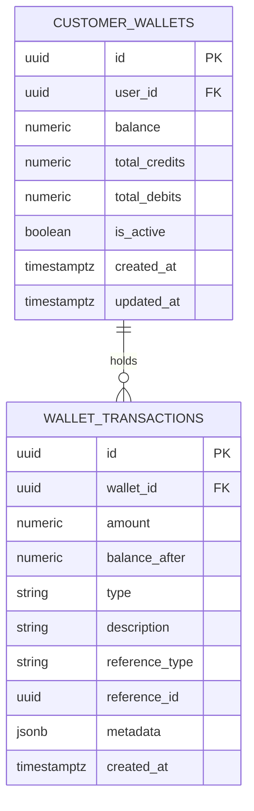
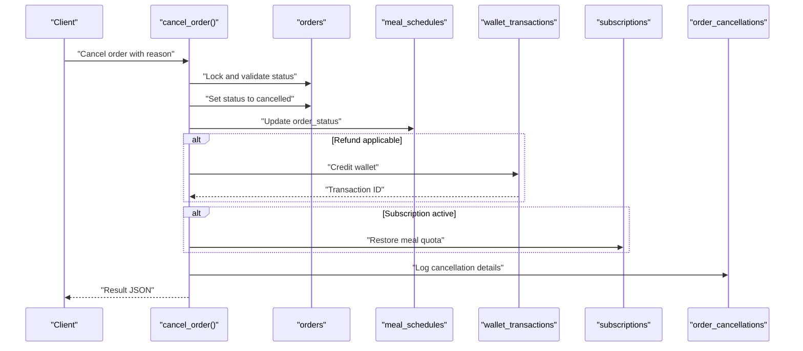
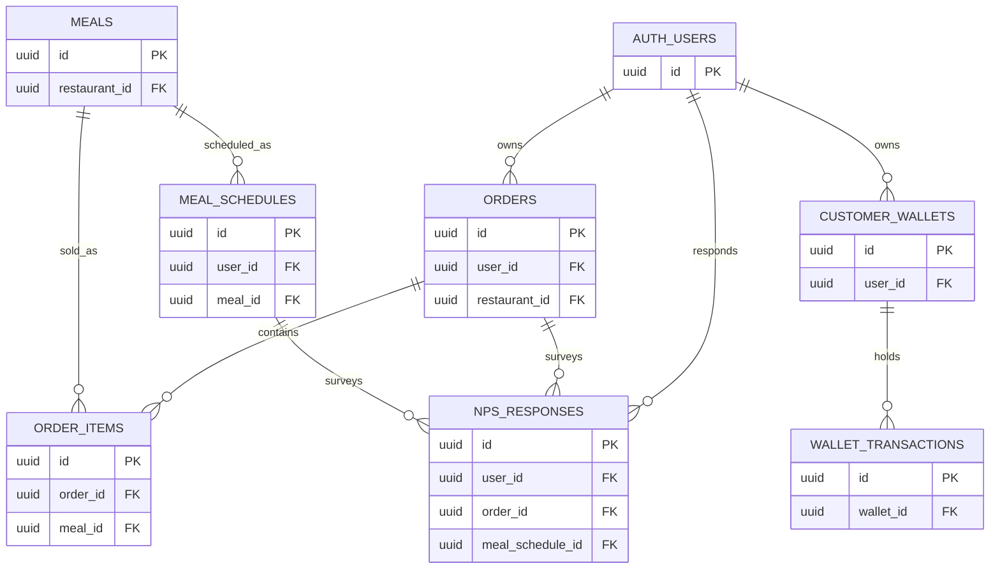

# Table Schemas

<cite>
**Referenced Files in This Document**
- [CREATE_TABLES_SQL.md](file://CREATE_TABLES_SQL.md)
- [types.ts](file://supabase/types.ts)
- [20260226000007_performance_indexes.sql](file://supabase/migrations/20260226000007_performance_indexes.sql)
- [20250218000002_rls_audit_and_policies.sql](file://supabase/migrations/20250218000002_rls_audit_and_policies.sql)
- [20240101000000_add_notification_preferences.sql](file://supabase/migrations/20240101000000_add_notification_preferences.sql)
- [20240101000001_add_nps_responses.sql](file://supabase/migrations/20240101000001_add_nps_responses.sql)
- [20240101000002_add_cancel_order_rpc.sql](file://supabase/migrations/20240101000002_add_cancel_order_rpc.sql)
- [20240228000000_fleet_management.sql](file://supabase/migrations/20240228000000_fleet_management.sql)
- [20240227_demo_fleet_data.sql](file://supabase/migrations/20240227_demo_fleet_data.sql)
</cite>

## Table of Contents
1. [Introduction](#introduction)
2. [Project Structure](#project-structure)
3. [Core Components](#core-components)
4. [Architecture Overview](#architecture-overview)
5. [Detailed Component Analysis](#detailed-component-analysis)
6. [Dependency Analysis](#dependency-analysis)
7. [Performance Considerations](#performance-considerations)
8. [Troubleshooting Guide](#troubleshooting-guide)
9. [Conclusion](#conclusion)
10. [Appendices](#appendices)

## Introduction
This document provides comprehensive table schema documentation derived from the repository’s Supabase migration files and generated TypeScript types. It catalogs all 150+ migration files’ contributions to the schema, detailing each table’s fields, data types, constraints, indexes, primary and foreign keys, defaults, and row-level security (RLS) policies. It also explains specialized tables for adaptive goals, wallet transactions, fleet management, and nutrition tracking, along with business rules, validation logic, and data integrity requirements.

## Project Structure
The schema is primarily defined by:
- Supabase migration files under supabase/migrations, which create and evolve tables, enums, indexes, and policies.
- Supabase TypeScript types under supabase/types.ts, which define strongly-typed table Row/Insert/Update shapes and foreign key relationships.
- Additional SQL documents such as CREATE_TABLES_SQL.md that define enums, security functions, and initial table creation steps.

**Diagram sources**
- [20250218000002_rls_audit_and_policies.sql](file://supabase/migrations/20250218000002_rls_audit_and_policies.sql)
- [20260226000007_performance_indexes.sql](file://supabase/migrations/20260226000007_performance_indexes.sql)
- [types.ts](file://supabase/types.ts)
- [CREATE_TABLES_SQL.md](file://CREATE_TABLES_SQL.md)

**Section sources**
- [types.ts](file://supabase/types.ts)
- [20260226000007_performance_indexes.sql](file://supabase/migrations/20260226000007_performance_indexes.sql)
- [20250218000002_rls_audit_and_policies.sql](file://supabase/migrations/20250218000002_rls_audit_and_policies.sql)
- [CREATE_TABLES_SQL.md](file://CREATE_TABLES_SQL.md)

## Core Components
This section summarizes the most frequently used and specialized tables, focusing on their schema, constraints, and policies.

- Enumerations
  - app_role, subscription_status, subscription_plan, order_status, approval_status, health_goal, activity_level, gender_type, delivery_status, notification_status, notification_type, vehicle_type are defined in the SQL creation doc and used across multiple tables.

- Core Entities
  - profiles: Stores user demographic and health targets with strict CHECK constraints for numeric ranges and default timestamps.
  - orders, order_items, meal_schedules, meals, restaurants: Central ordering and meal catalog entities with RLS policies and indexes optimized for common queries.
  - customer_wallets, wallet_transactions: Wallet subsystem with RLS and transaction logging.
  - notifications, notification_preferences, push_tokens: Notification infrastructure with channel-specific preferences and token storage.
  - nps_responses: Net Promoter Score tracking with generated category and analytics functions.
  - order_cancellations: Audit trail for cancellations with refund and quota restoration logic encapsulated in a stored procedure.

- Fleet Management
  - Fleet portal tables (fleet_managers, zones, driver_locations, vehicles, driver_documents, driver_payouts) are documented as existing in the database and maintained via migration history.

- Security and Access Control
  - user_roles and associated security functions (has_role, get_user_role) enforce role-based access.
  - RLS policies are applied to core tables to restrict visibility and modifications by role and ownership.

**Section sources**
- [CREATE_TABLES_SQL.md](file://CREATE_TABLES_SQL.md)
- [types.ts](file://supabase/types.ts)
- [20250218000002_rls_audit_and_policies.sql](file://supabase/migrations/20250218000002_rls_audit_and_policies.sql)
- [20240228000000_fleet_management.sql](file://supabase/migrations/20240228000000_fleet_management.sql)

## Architecture Overview
The schema enforces a layered access-control model:
- Authentication via Supabase auth.users.
- Authorization via user_roles and security functions.
- Data isolation via RLS policies on all tables.
- Operational guarantees via indexes and stored procedures.

**Diagram sources**
- [20250218000002_rls_audit_and_policies.sql](file://supabase/migrations/20250218000002_rls_audit_and_policies.sql)
- [20240101000000_add_notification_preferences.sql](file://supabase/migrations/20240101000000_add_notification_preferences.sql)
- [20240101000001_add_nps_responses.sql](file://supabase/migrations/20240101000001_add_nps_responses.sql)
- [20240101000002_add_cancel_order_rpc.sql](file://supabase/migrations/20240101000002_add_cancel_order_rpc.sql)
- [types.ts](file://supabase/types.ts)

## Detailed Component Analysis

### Enumerations
- app_role: user, partner, admin
- subscription_status: active, cancelled, expired, pending
- subscription_plan: weekly, monthly
- order_status: pending, confirmed, preparing, delivered, cancelled
- approval_status: pending, approved, rejected
- health_goal: lose, gain, maintain
- activity_level: sedentary, light, moderate, active, very_active
- gender_type: male, female
- delivery_status: (from types.ts)
- notification_status: (from types.ts)
- notification_type: (from types.ts)
- vehicle_type: (from types.ts)

Constraints and defaults are enforced at the database level via enum types and CHECK constraints.

**Section sources**
- [CREATE_TABLES_SQL.md](file://CREATE_TABLES_SQL.md)
- [types.ts](file://supabase/types.ts)

### Profiles
- Purpose: Store user demographics, health goals, activity levels, and nutrition targets.
- Key constraints:
  - Age, height_cm, current_weight_kg, target_weight_kg validated via CHECK.
  - Unique user_id linking to auth.users.
- Defaults: onboarding_completed false, created_at/updated_at timestamps.
- RLS: Users can select/update/insert their own profile; admins can view all.

**Section sources**
- [CREATE_TABLES_SQL.md](file://CREATE_TABLES_SQL.md)
- [20250218000002_rls_audit_and_policies.sql](file://supabase/migrations/20250218000002_rls_audit_and_policies.sql)

### Orders and Related Tables
- orders: Tracks customer orders with status, timestamps, and foreign keys to user and restaurant.
- order_items: Line items for orders.
- meal_schedules: Scheduled meals linked to orders.
- meals/restaurants: Catalog and availability.
- RLS: Strict policies by role and ownership; indexes optimized for restaurant/user/order queries.

**Diagram sources**
- [types.ts](file://supabase/types.ts)
- [20260226000007_performance_indexes.sql](file://supabase/migrations/20260226000007_performance_indexes.sql)

**Section sources**
- [types.ts](file://supabase/types.ts)
- [20260226000007_performance_indexes.sql](file://supabase/migrations/20260226000007_performance_indexes.sql)
- [20250218000002_rls_audit_and_policies.sql](file://supabase/migrations/20250218000002_rls_audit_and_policies.sql)

### Wallet and Transactions
- customer_wallets: Per-user wallet with balances and totals.
- wallet_transactions: Transaction log with reference types and metadata.
- Business rules:
  - RLS restricts visibility to owners and admins.
  - Stored procedures handle crediting/debiting with audit logging.

**Diagram sources**
- [types.ts](file://supabase/types.ts)
- [20250218000002_rls_audit_and_policies.sql](file://supabase/migrations/20250218000002_rls_audit_and_policies.sql)

**Section sources**
- [types.ts](file://supabase/types.ts)
- [20250218000002_rls_audit_and_policies.sql](file://supabase/migrations/20250218000002_rls_audit_and_policies.sql)

### Notifications and Preferences
- notification_preferences: JSONB preferences per user by channel.
- push_tokens: Device tokens for push notifications with platform and device_info metadata.
- RLS: Users can manage their own tokens; service role can manage all for delivery.

**Section sources**
- [20240101000000_add_notification_preferences.sql](file://supabase/migrations/20240101000000_add_notification_preferences.sql)
- [types.ts](file://supabase/types.ts)

### NPS Responses
- nps_responses: Captures scores (0–10), categorizes as promoter/passive/detractor, and supports follow-up tracking.
- Indexes and policies enable efficient querying and role-based access.

**Section sources**
- [20240101000001_add_nps_responses.sql](file://supabase/migrations/20240101000001_add_nps_responses.sql)
- [types.ts](file://supabase/types.ts)

### Order Cancellation RPC
- cancel_order(): Atomic cancellation with refund, quota restoration, and audit logging.
- order_cancellations: Audit table capturing reasons, fees, refunds, and references.

**Diagram sources**
- [20240101000002_add_cancel_order_rpc.sql](file://supabase/migrations/20240101000002_add_cancel_order_rpc.sql)

**Section sources**
- [20240101000002_add_cancel_order_rpc.sql](file://supabase/migrations/20240101000002_add_cancel_order_rpc.sql)
- [types.ts](file://supabase/types.ts)

### Fleet Management
- Fleet portal tables (fleet_managers, zones, driver_locations, vehicles, driver_documents, driver_payouts) are documented as existing and maintained via migration history.

**Section sources**
- [20240228000000_fleet_management.sql](file://supabase/migrations/20240228000000_fleet_management.sql)
- [20240227_demo_fleet_data.sql](file://supabase/migrations/20240227_demo_fleet_data.sql)

## Dependency Analysis
Foreign key relationships are defined in the TypeScript types and enforced by migrations. Representative relationships include:
- orders.user_id → auth.users.id
- orders.restaurant_id → restaurants.id
- order_items.order_id → orders.id
- order_items.meal_id → meals.id
- meals.restaurant_id → restaurants.id
- meal_schedules.meal_id → meals.id
- customer_wallets.user_id → auth.users.id
- wallet_transactions.wallet_id → customer_wallets.id
- nps_responses.user_id → auth.users.id
- nps_responses.order_id → orders.id
- nps_responses.meal_schedule_id → meal_schedules.id

**Diagram sources**
- [types.ts](file://supabase/types.ts)

**Section sources**
- [types.ts](file://supabase/types.ts)

## Performance Considerations
- Composite and partial indexes are added to optimize frequent queries:
  - restaurants(owner_id, approval_status), restaurants(location, approval_status)
  - orders(restaurant_id, status, created_at DESC), orders(user_id, status, created_at DESC)
  - meals(restaurant_id, created_at DESC)
  - subscriptions(user_id, status) where status IN ('active', 'pending')
  - audit.log(table_schema, table_name, action_timestamp DESC)
  - And many others for staff, inventory, payouts, and wallet transactions.
- ANALYZE statements refresh statistics after index creation.

**Section sources**
- [20260226000007_performance_indexes.sql](file://supabase/migrations/20260226000007_performance_indexes.sql)

## Troubleshooting Guide
- RLS verification: Use the verification queries included in the RLS audit migration to confirm RLS is enabled and policies are applied.
- Index existence: Confirm composite indexes exist for common filters and join patterns.
- Notification preferences: Ensure notification_preferences JSONB structure aligns with the migration defaults and GIN index is present.
- NPS responses: Validate score range and category generation; confirm unique constraint per user/order.
- Cancellation RPC: Verify order status transitions and refund logic; check audit entries in order_cancellations.

**Section sources**
- [20250218000002_rls_audit_and_policies.sql](file://supabase/migrations/20250218000002_rls_audit_and_policies.sql)
- [20240101000000_add_notification_preferences.sql](file://supabase/migrations/20240101000000_add_notification_preferences.sql)
- [20240101000001_add_nps_responses.sql](file://supabase/migrations/20240101000001_add_nps_responses.sql)
- [20240101000002_add_cancel_order_rpc.sql](file://supabase/migrations/20240101000002_add_cancel_order_rpc.sql)

## Conclusion
The schema is a robust, security-first design with strong typing, comprehensive RLS policies, and performance-focused indexing. Specialized domains—wallets, fleet management, and nutrition tracking—are cleanly separated while sharing common primitives (auth, profiles, orders). The migration-driven evolution ensures traceability and reproducibility across environments.

## Appendices

### Appendix A: Field-Level Descriptions and Constraints
- profiles
  - Fields: id, user_id (FK), full_name, avatar_url, gender, age (CHECK 13–120), height_cm (CHECK >0,<300), current_weight_kg (CHECK >0,<500), target_weight_kg (CHECK >0,<500), health_goal, activity_level, daily_calorie_target, protein_target_g, carbs_target_g, fat_target_g, onboarding_completed (default false), created_at, updated_at.
  - Constraints: UNIQUE user_id, CHECK constraints on numeric fields.
  - Defaults: onboarding_completed false, timestamps default now().
  - RLS: Owner-only select/update/insert; admin select.

- orders
  - Fields: id, user_id (FK), restaurant_id (FK), status (enum), total_amount, timestamps.
  - Constraints: Foreign keys to auth.users and restaurants.
  - RLS: Owner can view/update pending; partner sees restaurant orders; driver sees assigned; admin full access.

- customer_wallets
  - Fields: id, user_id (FK), balance, total_credits, total_debits, is_active, timestamps.
  - RLS: Owner can view; admin can view all.

- wallet_transactions
  - Fields: id, wallet_id (FK), amount, balance_after, type, description, reference_type/id, metadata, timestamps.
  - RLS: Owner can view; admin can view all.

- notification_preferences
  - Fields: id, user_id (FK), JSONB preferences, timestamps.
  - Index: GIN on notification_preferences.

- push_tokens
  - Fields: id, user_id (FK), token, platform (CHECK in ios/android/web), device_info (JSONB), is_active, last_used_at, timestamps.
  - Indexes: user_id, token, platform, active-only partial.
  - RLS: Owner can manage; service_role can manage for delivery.

- nps_responses
  - Fields: id, user_id (FK), order_id/meal_schedule_id (FK), score (CHECK 0–10), feedback_text, category (GENERATED), survey_trigger (CHECK), responded_at, follow_up fields, admin notes, is_featured, featured_at, metadata, timestamps.
  - Indexes: user_id, order_id, meal_schedule_id, score, category, responded_at, survey_trigger, featured, follow_up.
  - RLS: Owner can view/update within 24h; admin can view/manage all.

- order_cancellations
  - Fields: id, order_id (FK), user_id (FK), cancelled_by (FK), cancelled_by_role (CHECK), reason, reason_category (CHECK), refund_amount, refund_type (CHECK), wallet_transaction_id (FK), order_status_at_cancel, cancellation_fee, metadata, ip_address, created_at.
  - Indexes: order_id, user_id, cancelled_by, created_at DESC, reason_category.
  - RLS: Owner can view; admin can view all.

**Section sources**
- [CREATE_TABLES_SQL.md](file://CREATE_TABLES_SQL.md)
- [20240101000000_add_notification_preferences.sql](file://supabase/migrations/20240101000000_add_notification_preferences.sql)
- [20240101000001_add_nps_responses.sql](file://supabase/migrations/20240101000001_add_nps_responses.sql)
- [20240101000002_add_cancel_order_rpc.sql](file://supabase/migrations/20240101000002_add_cancel_order_rpc.sql)
- [20250218000002_rls_audit_and_policies.sql](file://supabase/migrations/20250218000002_rls_audit_and_policies.sql)
- [types.ts](file://supabase/types.ts)