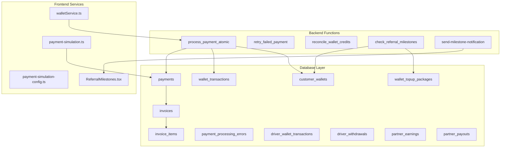
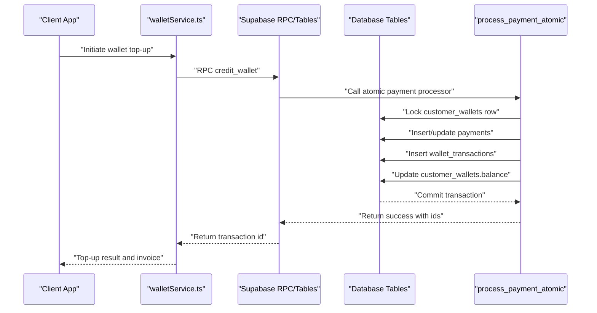
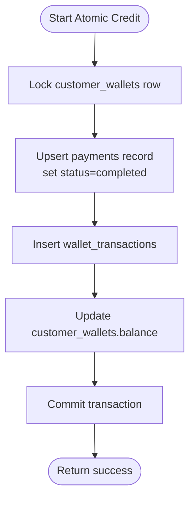
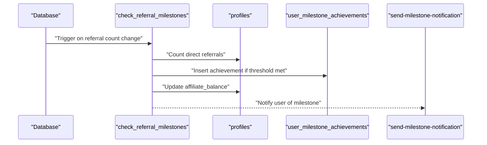
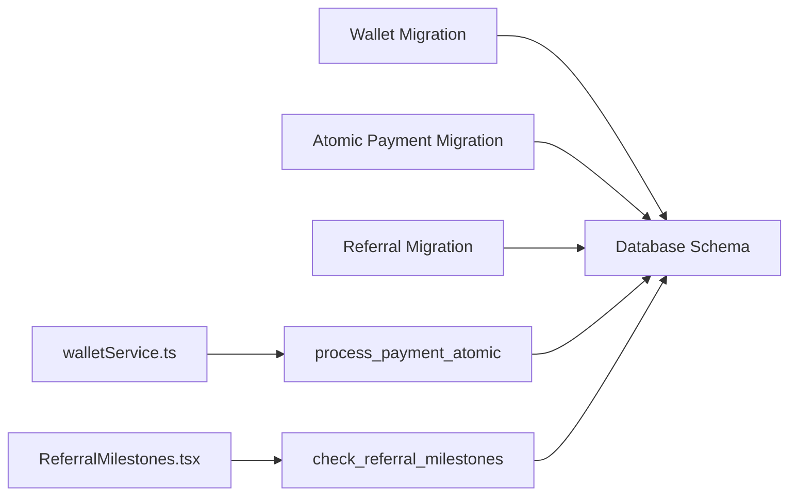

# Wallet & Payment Tables

<cite>
**Referenced Files in This Document**
- [20260218120000_wallet_system.sql](file://supabase/migrations/20260218120000_wallet_system.sql)
- [20260225211305_add_atomic_wallet_payment.sql](file://supabase/migrations/20260225211305_add_atomic_wallet_payment.sql)
- [20250220000002_fix_referral_tables.sql](file://supabase/migrations/20250220000002_fix_referral_tables.sql)
- [20250220000006_create_admin_tables.sql](file://supabase/migrations/20250220000006_create_admin_tables.sql)
- [20260106212228_4c84cd13-783b-4294-abf8-d3a3e3d2bf93.sql](file://supabase/functions/check_referral_milestones/index.ts)
- [send-milestone-notification/index.ts](file://supabase/functions/send-milestone-notification/index.ts)
- [walletService.ts](file://src/services/walletService.ts)
- [payment-simulation.ts](file://src/lib/payment-simulation.ts)
- [payment-simulation-config.ts](file://src/lib/payment-simulation-config.ts)
- [ReferralMilestones.tsx](file://src/components/ReferralMilestones.tsx)
</cite>

## Table of Contents
1. [Introduction](#introduction)
2. [Project Structure](#project-structure)
3. [Core Components](#core-components)
4. [Architecture Overview](#architecture-overview)
5. [Detailed Component Analysis](#detailed-component-analysis)
6. [Dependency Analysis](#dependency-analysis)
7. [Performance Considerations](#performance-considerations)
8. [Troubleshooting Guide](#troubleshooting-guide)
9. [Conclusion](#conclusion)

## Introduction
This document describes the wallet and payment processing system, focusing on the database schema and backend services that manage customer wallets, transactions, payment methods, and the referral system. It explains wallet balance management, transaction logging, payment method storage, refund processing workflows, gamification points integration, referral bonus calculations, promotional credits, financial reporting data structures, payment security measures, PCI compliance requirements, and transaction audit trails.

## Project Structure
The wallet and payment system spans three primary areas:
- Database schema migrations defining tables, indexes, policies, and stored procedures
- Backend functions implementing atomic payment processing and referral bonus automation
- Frontend services and components orchestrating wallet top-ups, invoices, and referral UI

**Diagram sources**
- [20260218120000_wallet_system.sql:8-710](file://supabase/migrations/20260218120000_wallet_system.sql#L8-L710)
- [20260225211305_add_atomic_wallet_payment.sql:17-190](file://supabase/migrations/20260225211305_add_atomic_wallet_payment.sql#L17-L190)
- [20250220000002_fix_referral_tables.sql:82-116](file://supabase/migrations/20250220000002_fix_referral_tables.sql#L82-L116)
- [send-milestone-notification/index.ts:12-156](file://supabase/functions/send-milestone-notification/index.ts#L12-L156)
- [walletService.ts:13-137](file://src/services/walletService.ts#L13-L137)
- [payment-simulation.ts:25-223](file://src/lib/payment-simulation.ts#L25-L223)
- [ReferralMilestones.tsx:23-142](file://src/components/ReferralMilestones.tsx#L23-L142)

**Section sources**
- [20260218120000_wallet_system.sql:1-710](file://supabase/migrations/20260218120000_wallet_system.sql#L1-L710)
- [20260225211305_add_atomic_wallet_payment.sql:1-399](file://supabase/migrations/20260225211305_add_atomic_wallet_payment.sql#L1-L399)
- [walletService.ts:1-180](file://src/services/walletService.ts#L1-L180)
- [payment-simulation.ts:1-223](file://src/lib/payment-simulation.ts#L1-L223)

## Core Components
This section outlines the primary data structures and their relationships, focusing on wallet balances, transactions, payment records, invoices, and referral mechanics.

- Customer Wallets
  - Stores user wallet balances, totals, and lifecycle timestamps
  - Enforces row-level security per user
  - Triggers create a wallet upon user signup

- Wallet Transactions
  - Logs all credit, debit, refund, bonus, and cashback events
  - Links to customer_wallets and reference types (topup, order, refund, etc.)
  - Maintains balance_after for auditability

- Wallet Top-up Packages
  - Defines promotional packages with bonus amounts and percentages
  - Public read policy for active packages
  - Default packages inserted during migration

- Payments
  - Records payment attempts with gateway metadata and status
  - Links to invoices and wallet transactions
  - Extended with atomic processing flags and error tracking

- Invoices and Invoice Items
  - Centralized financial records for all transaction types
  - Line items for detailed reporting
  - RLS policies restrict visibility by user, driver, or restaurant

- Driver Wallet and Withdrawals
  - Tracks driver earnings, adjustments, and withdrawal requests
  - Enforces driver-specific RLS policies

- Partner Earnings and Payouts
  - Computes restaurant earnings from orders and manages payouts
  - Supports platform fee calculation and net amount distribution

- Referral System
  - Milestones define thresholds and bonus amounts
  - Achievement tracking prevents duplicate crediting
  - Automation function checks referrals and credits balances
  - Email notifications celebrate milestone unlocks

**Section sources**
- [20260218120000_wallet_system.sql:8-710](file://supabase/migrations/20260218120000_wallet_system.sql#L8-L710)
- [20250220000002_fix_referral_tables.sql:82-116](file://supabase/migrations/20250220000002_fix_referral_tables.sql#L82-L116)
- [20250220000006_create_admin_tables.sql:60-91](file://supabase/migrations/20250220000006_create_admin_tables.sql#L60-L91)

## Architecture Overview
The system integrates frontend services with Supabase backend functions and database tables to provide a secure, auditable, and scalable payment and wallet infrastructure.

**Diagram sources**
- [walletService.ts:13-137](file://src/services/walletService.ts#L13-L137)
- [20260225211305_add_atomic_wallet_payment.sql:17-190](file://supabase/migrations/20260225211305_add_atomic_wallet_payment.sql#L17-L190)
- [20260218120000_wallet_system.sql:117-217](file://supabase/migrations/20260218120000_wallet_system.sql#L117-L217)

## Detailed Component Analysis

### Wallet Balance Management
- Atomic Operations
  - The atomic processor ensures idempotent, race-condition-free updates to payments and wallet balances
  - Uses row-level locks and transaction boundaries to prevent double-spending
- Balance Updates
  - Wallet balance increments on successful top-ups
  - Transaction logs capture balance_after for audit trails
- Error Handling
  - Dedicated error logging table captures failures with timestamps and resolutions
  - Retry mechanisms automatically reattempt recent failed payments

**Diagram sources**
- [20260225211305_add_atomic_wallet_payment.sql:78-143](file://supabase/migrations/20260225211305_add_atomic_wallet_payment.sql#L78-L143)

**Section sources**
- [20260225211305_add_atomic_wallet_payment.sql:17-190](file://supabase/migrations/20260225211305_add_atomic_wallet_payment.sql#L17-L190)
- [20260218120000_wallet_system.sql:117-217](file://supabase/migrations/20260218120000_wallet_system.sql#L117-L217)

### Transaction Logging and Audit Trails
- Comprehensive Logging
  - wallet_transactions captures all movements with reference types and metadata
  - created_at timestamps enable chronological audit trails
- Financial Reporting
  - invoices and invoice_items provide structured reporting for all transaction types
  - RLS policies ensure users can only access relevant records
- Driver and Partner Audits
  - Separate tables track driver wallet transactions and partner earnings/payouts
  - Status tracking supports reconciliation workflows

**Section sources**
- [20260218120000_wallet_system.sql:20-710](file://supabase/migrations/20260218120000_wallet_system.sql#L20-L710)

### Payment Method Storage and Sadad Integration
- Payment Records
  - payments table stores gateway metadata, statuses, and links to invoices and wallet transactions
  - payment_method and gateway fields standardize method categorization
- Atomic Processing
  - process_payment_atomic coordinates payment completion and wallet crediting
  - wallet_credited flag and processed_at support reconciliation
- Simulation Support
  - Payment simulation utilities facilitate testing without live gateways
  - Configurable success rates and delays emulate real-world variability

**Section sources**
- [20260218120000_wallet_system.sql:617-633](file://supabase/migrations/20260218120000_wallet_system.sql#L617-L633)
- [20260225211305_add_atomic_wallet_payment.sql:17-190](file://supabase/migrations/20260225211305_add_atomic_wallet_payment.sql#L17-L190)
- [payment-simulation.ts:25-223](file://src/lib/payment-simulation.ts#L25-L223)
- [payment-simulation-config.ts:1-79](file://src/lib/payment-simulation-config.ts#L1-L79)

### Refund Processing Workflows
- Refund Tracking
  - wallet_transactions.type includes 'refund' for reversal entries
  - reference_type supports linking refunds to original transactions
- Auditability
  - balance_after and timestamps maintain historical accuracy
  - RLS ensures only authorized parties can view sensitive refund data

**Section sources**
- [20260218120000_wallet_system.sql:24-31](file://supabase/migrations/20260218120000_wallet_system.sql#L24-L31)

### Gamification Points Integration
- Affiliate Balance
  - profiles includes affiliate_balance and total_affiliate_earnings for gamification points
- Milestone Bonuses
  - Referral milestones define thresholds and bonus amounts
  - Achievements prevent duplicate crediting and track bonus_claimed status

**Section sources**
- [20250220000002_fix_referral_tables.sql:82-116](file://supabase/migrations/20250220000002_fix_referral_tables.sql#L82-L116)
- [20250220000006_create_admin_tables.sql:60-91](file://supabase/migrations/20250220000006_create_admin_tables.sql#L60-L91)

### Referral Bonus Calculations
- Automation Function
  - check_referral_milestones counts direct referrals and awards bonuses upon reaching thresholds
  - Automatically credits affiliate_balance and updates achievement records
- Email Notifications
  - send-milestone-notification emails users upon milestone unlocks with current balance summaries

**Diagram sources**
- [20260106212228_4c84cd13-783b-4294-abf8-d3a3e3d2bf93.sql:65-102](file://supabase/functions/check_referral_milestones/index.ts#L65-L102)
- [send-milestone-notification/index.ts:12-156](file://supabase/functions/send-milestone-notification/index.ts#L12-L156)

**Section sources**
- [20250220000002_fix_referral_tables.sql:82-116](file://supabase/migrations/20250220000002_fix_referral_tables.sql#L82-L116)
- [send-milestone-notification/index.ts:12-156](file://supabase/functions/send-milestone-notification/index.ts#L12-L156)

### Promotional Credits and Top-up Packages
- Package Management
  - wallet_topup_packages defines promotional offers with bonus amounts and percentages
  - Default packages inserted during migration
- Wallet Crediting
  - walletService orchestrates RPC credit_wallet with metadata for auditing
  - Invoices generated for top-ups with itemized breakdowns

**Section sources**
- [20260218120000_wallet_system.sql:35-54](file://supabase/migrations/20260218120000_wallet_system.sql#L35-L54)
- [walletService.ts:13-137](file://src/services/walletService.ts#L13-L137)

### Financial Reporting Data Structures
- Invoices
  - invoices centralize financial records with invoice_type categorization
  - invoice_items provide line-item detail for all transaction types
- Driver and Partner Reports
  - driver_wallet_transactions and partner_earnings/payouts support separate reporting streams
- Access Control
  - RLS policies restrict visibility to authorized users and roles

**Section sources**
- [20260218120000_wallet_system.sql:448-524](file://supabase/migrations/20260218120000_wallet_system.sql#L448-L524)

### Payment Security Measures and PCI Compliance
- Data Protection
  - RLS policies enforce strict access controls on sensitive tables
  - Row-level locking in atomic functions prevents race conditions
- Gateway Abstraction
  - payments table stores gateway_reference and gateway_response for auditability
  - Payment simulation utilities reduce exposure to live environments during testing
- Auditability
  - payment_processing_errors logs failures with timestamps and resolution notes
  - reconcile_wallet_credits enables admin-driven reconciliation of orphaned payments

**Section sources**
- [20260218120000_wallet_system.sql:640-655](file://supabase/migrations/20260218120000_wallet_system.sql#L640-L655)
- [20260225211305_add_atomic_wallet_payment.sql:201-231](file://supabase/migrations/20260225211305_add_atomic_wallet_payment.sql#L201-L231)

## Dependency Analysis
The system exhibits clear separation of concerns:
- Database migrations define schema and policies
- Backend functions encapsulate business logic (atomic payments, referral automation)
- Frontend services coordinate user interactions and orchestrate RPC calls

**Diagram sources**
- [20260218120000_wallet_system.sql:1-710](file://supabase/migrations/20260218120000_wallet_system.sql#L1-L710)
- [20260225211305_add_atomic_wallet_payment.sql:1-399](file://supabase/migrations/20260225211305_add_atomic_wallet_payment.sql#L1-L399)
- [20250220000002_fix_referral_tables.sql:82-116](file://supabase/migrations/20250220000002_fix_referral_tables.sql#L82-L116)
- [walletService.ts:13-137](file://src/services/walletService.ts#L13-L137)
- [ReferralMilestones.tsx:23-142](file://src/components/ReferralMilestones.tsx#L23-L142)

**Section sources**
- [20260218120000_wallet_system.sql:1-710](file://supabase/migrations/20260218120000_wallet_system.sql#L1-L710)
- [20260225211305_add_atomic_wallet_payment.sql:1-399](file://supabase/migrations/20260225211305_add_atomic_wallet_payment.sql#L1-L399)
- [walletService.ts:1-180](file://src/services/walletService.ts#L1-L180)

## Performance Considerations
- Indexes
  - Strategic indexes on foreign keys and frequently queried columns improve query performance
- Concurrency
  - Row-level locks and transaction boundaries ensure consistency under concurrent access
- Background Jobs
  - auto_retry_failed_payments processes recent failures in batches to minimize manual intervention

[No sources needed since this section provides general guidance]

## Troubleshooting Guide
- Payment Failures
  - Review payment_processing_errors for logged errors and resolution notes
  - Use retry_failed_payment to reattempt recent failed payments
  - Run reconcile_wallet_credits to fix orphaned payments
- Wallet Discrepancies
  - Verify wallet_transactions and customer_wallets balances match expected values
  - Confirm atomic processor executed without exceptions
- Referral Issues
  - Check user_milestone_achievements uniqueness constraints
  - Validate check_referral_milestones function triggers on referral count changes
  - Confirm send-milestone-notification emails are delivered

**Section sources**
- [20260225211305_add_atomic_wallet_payment.sql:201-399](file://supabase/migrations/20260225211305_add_atomic_wallet_payment.sql#L201-L399)
- [20250220000002_fix_referral_tables.sql:82-116](file://supabase/migrations/20250220000002_fix_referral_tables.sql#L82-L116)

## Conclusion
The wallet and payment system provides a robust, secure, and auditable foundation for financial operations. Its atomic payment processing, comprehensive transaction logging, modular referral automation, and strict access controls collectively address core requirements for reliability, compliance, and transparency. The integration of frontend services and backend functions ensures a seamless user experience while maintaining strong data governance.