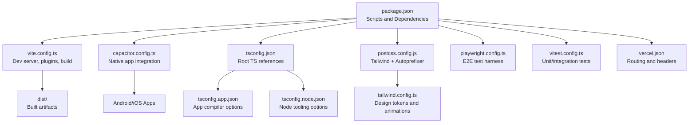
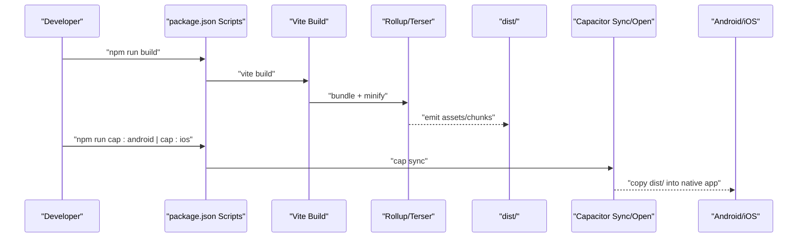
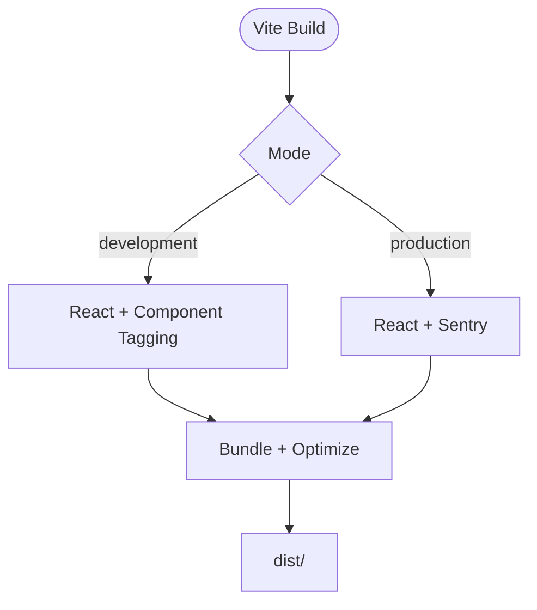
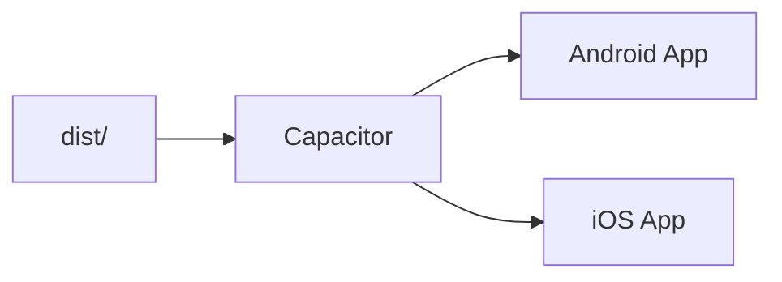
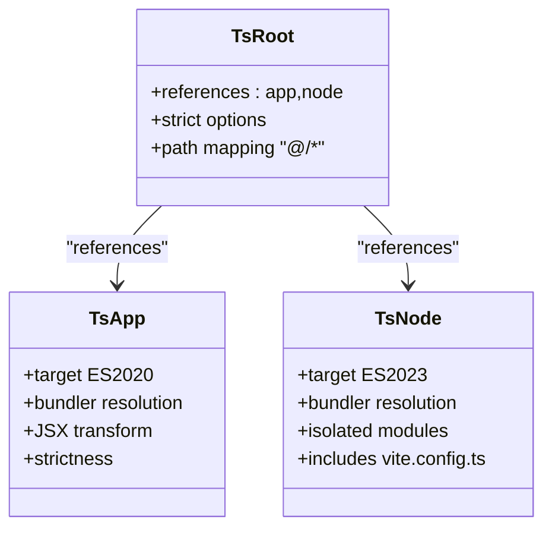
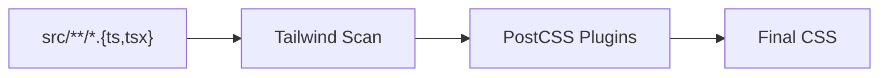
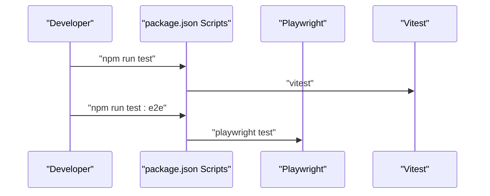
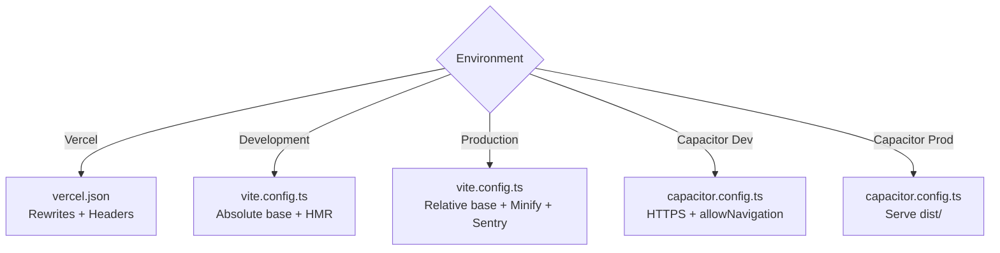
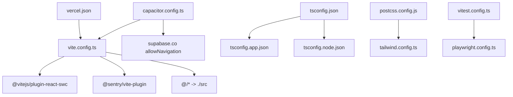

# Build Configuration

<cite>
**Referenced Files in This Document**
- [vite.config.ts](file://vite.config.ts)
- [capacitor.config.ts](file://capacitor.config.ts)
- [package.json](file://package.json)
- [tsconfig.json](file://tsconfig.json)
- [tsconfig.app.json](file://tsconfig.app.json)
- [tsconfig.node.json](file://tsconfig.node.json)
- [postcss.config.js](file://postcss.config.js)
- [tailwind.config.ts](file://tailwind.config.ts)
- [playwright.config.ts](file://playwright.config.ts)
- [vitest.config.ts](file://vitest.config.ts)
- [vercel.json](file://vercel.json)
</cite>

## Table of Contents
1. [Introduction](#introduction)
2. [Project Structure](#project-structure)
3. [Core Components](#core-components)
4. [Architecture Overview](#architecture-overview)
5. [Detailed Component Analysis](#detailed-component-analysis)
6. [Dependency Analysis](#dependency-analysis)
7. [Performance Considerations](#performance-considerations)
8. [Troubleshooting Guide](#troubleshooting-guide)
9. [Conclusion](#conclusion)
10. [Appendices](#appendices)

## Introduction
This document explains the build configuration system used in the Nutrio platform. It covers the Vite configuration for web builds, Capacitor configuration for native mobile apps, TypeScript compiler options, and package.json scripts. It also documents build targets, optimization settings, environment-specific configurations, asset handling, bundling strategies, code splitting, production optimizations, and the build process across development, staging, and production environments. Practical examples for customizing build settings and troubleshooting common issues are included.

## Project Structure
The build system centers around a few key configuration files:
- Vite configuration defines development server, plugins, aliases, dependency optimization, and production build settings.
- Capacitor configuration integrates the web build into Android and iOS native apps.
- TypeScript configurations split app and node tooling concerns.
- PostCSS and Tailwind configure CSS processing and design system tokens.
- Playwright and Vitest configure testing and coverage.
- Vercel configuration handles routing and security headers for web deployments.

**Diagram sources**
- [package.json:1-159](file://package.json#L1-L159)
- [vite.config.ts:1-77](file://vite.config.ts#L1-L77)
- [capacitor.config.ts:1-45](file://capacitor.config.ts#L1-L45)
- [tsconfig.json:1-21](file://tsconfig.json#L1-L21)
- [tsconfig.app.json:1-34](file://tsconfig.app.json#L1-L34)
- [tsconfig.node.json:1-23](file://tsconfig.node.json#L1-L23)
- [postcss.config.js:1-7](file://postcss.config.js#L1-L7)
- [tailwind.config.ts:1-128](file://tailwind.config.ts#L1-L128)
- [playwright.config.ts:1-92](file://playwright.config.ts#L1-L92)
- [vitest.config.ts:1-28](file://vitest.config.ts#L1-L28)
- [vercel.json:1-38](file://vercel.json#L1-L38)

**Section sources**
- [package.json:1-159](file://package.json#L1-L159)
- [vite.config.ts:1-77](file://vite.config.ts#L1-L77)
- [capacitor.config.ts:1-45](file://capacitor.config.ts#L1-L45)
- [tsconfig.json:1-21](file://tsconfig.json#L1-L21)
- [tsconfig.app.json:1-34](file://tsconfig.app.json#L1-L34)
- [tsconfig.node.json:1-23](file://tsconfig.node.json#L1-L23)
- [postcss.config.js:1-7](file://postcss.config.js#L1-L7)
- [tailwind.config.ts:1-128](file://tailwind.config.ts#L1-L128)
- [playwright.config.ts:1-92](file://playwright.config.ts#L1-L92)
- [vitest.config.ts:1-28](file://vitest.config.ts#L1-L28)
- [vercel.json:1-38](file://vercel.json#L1-L38)

## Core Components
- Vite configuration
  - Development server with HMR tuning and network access.
  - React plugin with devTarget alignment.
  - Conditional plugins: component tagger in development, Sentry source maps in production.
  - Path aliasing and dependency deduplication.
  - Dependency pre-bundling for faster cold starts.
  - Production build with Terser minification, console stripping in production, and chunk splitting.
- Capacitor configuration
  - App identity and webDir aligned with Vite’s output.
  - Development server scheme and navigation allowances for external services.
  - Plugin configuration for splash screen, push/local notifications, and biometric auth.
- TypeScript configurations
  - Root references for app and node TS configs.
  - App TS targets ES2020 with bundler module resolution and JSX transform.
  - Node TS targets ES2023 for tooling and CLI usage.
- CSS tooling
  - PostCSS with Tailwind and Autoprefixer.
  - Tailwind scanning configured for app and component sources.
- Testing
  - Playwright configuration for E2E tests with reporters and device projects.
  - Vitest configuration for unit tests with jsdom environment and coverage.
- Deployment
  - Vercel rewrites to single-page app fallback and security headers for assets and general routes.

**Section sources**
- [vite.config.ts:1-77](file://vite.config.ts#L1-L77)
- [capacitor.config.ts:1-45](file://capacitor.config.ts#L1-L45)
- [tsconfig.json:1-21](file://tsconfig.json#L1-L21)
- [tsconfig.app.json:1-34](file://tsconfig.app.json#L1-L34)
- [tsconfig.node.json:1-23](file://tsconfig.node.json#L1-L23)
- [postcss.config.js:1-7](file://postcss.config.js#L1-L7)
- [tailwind.config.ts:1-128](file://tailwind.config.ts#L1-L128)
- [playwright.config.ts:1-92](file://playwright.config.ts#L1-L92)
- [vitest.config.ts:1-28](file://vitest.config.ts#L1-L28)
- [vercel.json:1-38](file://vercel.json#L1-L38)

## Architecture Overview
The build pipeline integrates Vite for development and production bundling, Capacitor for native packaging, and optional cloud deployment via Vercel. TypeScript compiles the app and tooling, while PostCSS and Tailwind prepare styles. Tests run via Vitest and Playwright.

**Diagram sources**
- [package.json:7-43](file://package.json#L7-L43)
- [vite.config.ts:52-76](file://vite.config.ts#L52-L76)
- [capacitor.config.ts:3-17](file://capacitor.config.ts#L3-L17)

## Detailed Component Analysis

### Vite Configuration
Key behaviors:
- Base path selection:
  - Uses absolute base for Vercel deployments.
  - Uses relative base for production Capacitor builds; otherwise absolute for development.
- Development server:
  - Host binding to "::", port 5173, strict port, HMR overlay disabled, extended timeout.
  - Watches src and ignores node_modules/dist to improve reliability.
- Plugins:
  - React plugin with devTarget aligned to ES2020.
  - Component tagger in development.
  - Sentry plugin enabled in production with org/project/authToken from environment.
- Aliasing and optimization:
  - Alias "@" to "./src".
  - Dedupe React packages.
  - Pre-bundle React dependencies.
- Production build:
  - Output directory "dist".
  - Target ES2020/ESNext for modern browsers.
  - Sourcemaps enabled for error tracking.
  - Minification via Terser with conditional console removal in production.
  - Manual chunk splitting for vendor/UI libraries and charts.

**Diagram sources**
- [vite.config.ts:8-40](file://vite.config.ts#L8-L40)
- [vite.config.ts:52-76](file://vite.config.ts#L52-L76)

**Section sources**
- [vite.config.ts:8-76](file://vite.config.ts#L8-L76)

### Capacitor Configuration
- App identity and webDir:
  - App ID and name defined; webDir set to "dist" to match Vite output.
- Development server:
  - Android scheme set to HTTPS; allows cleartext traffic.
  - Navigation allowed to supabase.co domains for backend connectivity.
- Plugins:
  - Splash screen with timing and fullscreen options.
  - Push and local notifications with presentation options.
  - Native biometric prompts with localized messages.

**Diagram sources**
- [capacitor.config.ts:3-42](file://capacitor.config.ts#L3-L42)

**Section sources**
- [capacitor.config.ts:3-42](file://capacitor.config.ts#L3-L42)

### TypeScript Compiler Options
- Root configuration:
  - References app and node TS configs.
  - Strict compiler options and path mapping for "@/*".
- App TS config:
  - Targets ES2020, DOM/DOM.Iterable libs.
  - Bundler module resolution, isolated modules, JSX transform.
  - Strictness and path mapping.
- Node TS config:
  - Targets ES2023, bundler mode, isolated modules.
  - Includes Vite config for tooling.

**Diagram sources**
- [tsconfig.json:1-21](file://tsconfig.json#L1-L21)
- [tsconfig.app.json:1-34](file://tsconfig.app.json#L1-L34)
- [tsconfig.node.json:1-23](file://tsconfig.node.json#L1-L23)

**Section sources**
- [tsconfig.json:1-21](file://tsconfig.json#L1-L21)
- [tsconfig.app.json:1-34](file://tsconfig.app.json#L1-L34)
- [tsconfig.node.json:1-23](file://tsconfig.node.json#L1-L23)

### CSS Tooling (PostCSS and Tailwind)
- PostCSS:
  - Enables Tailwind and Autoprefixer plugins.
- Tailwind:
  - Scans app and component sources.
  - Defines design tokens, animations, and keyframes.
  - Dark mode and container configurations.

**Diagram sources**
- [postcss.config.js:1-7](file://postcss.config.js#L1-L7)
- [tailwind.config.ts:1-128](file://tailwind.config.ts#L1-L128)

**Section sources**
- [postcss.config.js:1-7](file://postcss.config.js#L1-L7)
- [tailwind.config.ts:1-128](file://tailwind.config.ts#L1-L128)

### Testing Configuration
- Playwright:
  - E2E test harness with HTML and JSON reporters.
  - Projects for Chromium; configurable for other browsers.
  - Trace, screenshot, and video collection enabled.
- Vitest:
  - jsdom environment, global setup, and coverage reporting.
  - Excludes test infrastructure and typings from coverage.

**Diagram sources**
- [package.json:7-43](file://package.json#L7-L43)
- [playwright.config.ts:1-92](file://playwright.config.ts#L1-L92)
- [vitest.config.ts:1-28](file://vitest.config.ts#L1-L28)

**Section sources**
- [playwright.config.ts:1-92](file://playwright.config.ts#L1-L92)
- [vitest.config.ts:1-28](file://vitest.config.ts#L1-L28)

### Environment-Specific Configurations
- Vercel deployment:
  - Rewrites all paths to index.html for SPA routing.
  - Security headers applied to all routes.
  - Assets under "/assets/" receive long-lived caching.
- Development vs Production:
  - Vite base path differs per environment.
  - Sentry plugin and console stripping are mode-dependent.
  - Capacitor server scheme and navigation allowances tailored for development and production.

**Diagram sources**
- [vercel.json:1-38](file://vercel.json#L1-L38)
- [vite.config.ts:8-40](file://vite.config.ts#L8-L40)
- [vite.config.ts:52-76](file://vite.config.ts#L52-L76)
- [capacitor.config.ts:7-17](file://capacitor.config.ts#L7-L17)

**Section sources**
- [vercel.json:1-38](file://vercel.json#L1-L38)
- [vite.config.ts:8-76](file://vite.config.ts#L8-L76)
- [capacitor.config.ts:3-42](file://capacitor.config.ts#L3-L42)

## Dependency Analysis
- Vite depends on:
  - React plugin for JSX transform and HMR.
  - Sentry plugin for production source maps.
  - Path aliasing and dependency optimization.
- Capacitor depends on:
  - Vite output directory "dist".
  - External service allowlists for backend connectivity.
- TypeScript depends on:
  - Separate configs for app and tooling.
  - Path mapping for "@/*".
- CSS tooling depends on:
  - Tailwind scanning and PostCSS plugins.
- Testing depends on:
  - Playwright and Vitest configurations.
- Deployment depends on:
  - Vercel rewrites and headers.

**Diagram sources**
- [vite.config.ts:1-77](file://vite.config.ts#L1-L77)
- [capacitor.config.ts:1-45](file://capacitor.config.ts#L1-L45)
- [tsconfig.json:1-21](file://tsconfig.json#L1-L21)
- [tsconfig.app.json:1-34](file://tsconfig.app.json#L1-L34)
- [tsconfig.node.json:1-23](file://tsconfig.node.json#L1-L23)
- [postcss.config.js:1-7](file://postcss.config.js#L1-L7)
- [tailwind.config.ts:1-128](file://tailwind.config.ts#L1-L128)
- [playwright.config.ts:1-92](file://playwright.config.ts#L1-L92)
- [vitest.config.ts:1-28](file://vitest.config.ts#L1-L28)
- [vercel.json:1-38](file://vercel.json#L1-L38)

**Section sources**
- [vite.config.ts:1-77](file://vite.config.ts#L1-L77)
- [capacitor.config.ts:1-45](file://capacitor.config.ts#L1-L45)
- [tsconfig.json:1-21](file://tsconfig.json#L1-L21)
- [tsconfig.app.json:1-34](file://tsconfig.app.json#L1-L34)
- [tsconfig.node.json:1-23](file://tsconfig.node.json#L1-L23)
- [postcss.config.js:1-7](file://postcss.config.js#L1-L7)
- [tailwind.config.ts:1-128](file://tailwind.config.ts#L1-L128)
- [playwright.config.ts:1-92](file://playwright.config.ts#L1-L92)
- [vitest.config.ts:1-28](file://vitest.config.ts#L1-L28)
- [vercel.json:1-38](file://vercel.json#L1-L38)

## Performance Considerations
- Modern browser target and ESNext build improve runtime performance.
- Manual chunk splitting reduces bundle sizes and improves caching:
  - Vendor chunks for React ecosystem.
  - UI component library chunk.
  - Charts library chunk.
- Dependency pre-bundling accelerates cold starts.
- Sourcemaps enabled for production to support Sentry error tracking.
- Console stripping in production reduces bundle size and sensitive logs.
- Tailwind scanning scoped to relevant directories to minimize rebuilds.

[No sources needed since this section provides general guidance]

## Troubleshooting Guide
Common issues and resolutions:
- HMR overlay errors in development:
  - Disable overlay and increase HMR timeout in Vite server configuration.
- Network access for mobile testing:
  - Bind to "::" and allow local network access in Vite server settings.
- Production source maps missing:
  - Ensure Sentry plugin is enabled in production mode and environment variables are set.
- Capacitor navigation blocked:
  - Add backend domains to allowNavigation in Capacitor server configuration.
- Asset caching and SPA routing:
  - Verify Vercel rewrites and headers are deployed; confirm assets under "/assets/" receive immutable caching.
- Chunk size regressions:
  - Review manualChunks configuration and adjust vendor splits.
- TypeScript path mapping errors:
  - Confirm "@/*" path mapping matches tsconfig and Vite resolve.alias.

**Section sources**
- [vite.config.ts:12-27](file://vite.config.ts#L12-L27)
- [vite.config.ts:34-40](file://vite.config.ts#L34-L40)
- [capacitor.config.ts:7-17](file://capacitor.config.ts#L7-L17)
- [vercel.json:3-37](file://vercel.json#L3-L37)
- [tsconfig.json:6-8](file://tsconfig.json#L6-L8)
- [vite.config.ts:66-74](file://vite.config.ts#L66-L74)

## Conclusion
The Nutrio build system combines Vite for fast development and optimized production builds, Capacitor for native packaging, TypeScript for strong typing, PostCSS/Tailwind for styling, and robust testing frameworks. Environment-specific configurations ensure proper routing, security, and performance across development, staging, and production. The modular setup supports customization of bundling, code splitting, and optimization strategies.

[No sources needed since this section summarizes without analyzing specific files]

## Appendices

### Build Targets and Environments
- Development:
  - Vite dev server with HMR, component tagging, and absolute base path.
  - Capacitor server scheme set to HTTPS with allowNavigation for backend domains.
- Staging:
  - Use Vite production build with minification and Sentry source maps.
  - Deploy to Vercel with SPA rewrites and security headers.
- Production:
  - Capacitor builds serve "dist/" locally; Sentry plugin enabled for error tracking.

**Section sources**
- [vite.config.ts:8-40](file://vite.config.ts#L8-L40)
- [vite.config.ts:52-76](file://vite.config.ts#L52-L76)
- [capacitor.config.ts:7-17](file://capacitor.config.ts#L7-L17)
- [vercel.json:3-37](file://vercel.json#L3-L37)

### Customization Examples
- Adjust base path for hosting:
  - Modify Vite base setting for CDN or subpath deployments.
- Change chunk splitting strategy:
  - Update manualChunks in rollupOptions to balance cacheability and initial load.
- Add environment variables:
  - Provide SENTRY_ORG, SENTRY_PROJECT, SENTRY_AUTH_TOKEN for production source maps.
- Extend Capacitor plugins:
  - Add or configure plugins in Capacitor config for additional native capabilities.
- Tune TypeScript strictness:
  - Relax or tighten options in tsconfig.app.json and tsconfig.node.json as needed.

**Section sources**
- [vite.config.ts:11](file://vite.config.ts#L11)
- [vite.config.ts:66-74](file://vite.config.ts#L66-L74)
- [vite.config.ts:35-39](file://vite.config.ts#L35-L39)
- [capacitor.config.ts:18-41](file://capacitor.config.ts#L18-L41)
- [tsconfig.app.json:17-26](file://tsconfig.app.json#L17-L26)
- [tsconfig.node.json:15-20](file://tsconfig.node.json#L15-L20)