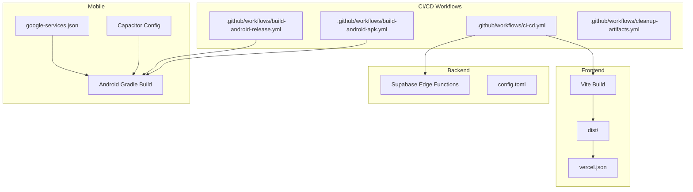
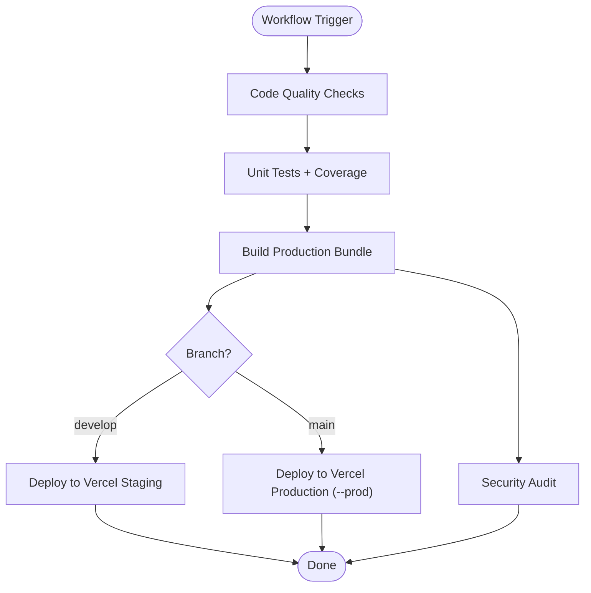
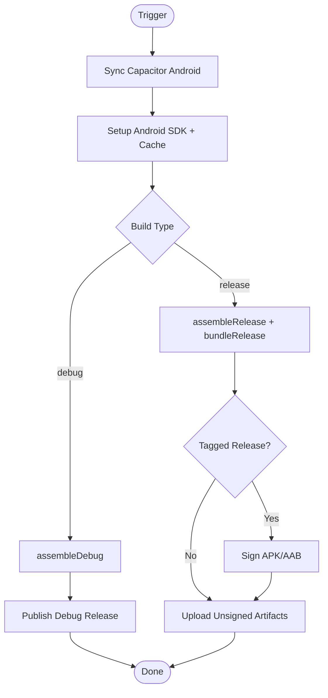
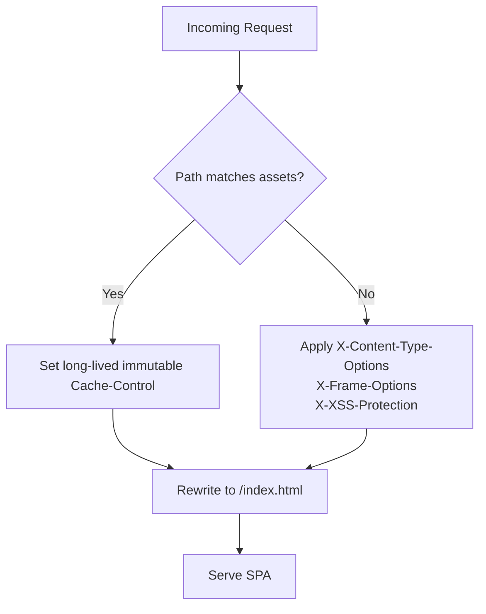
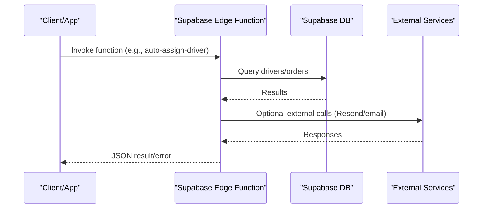
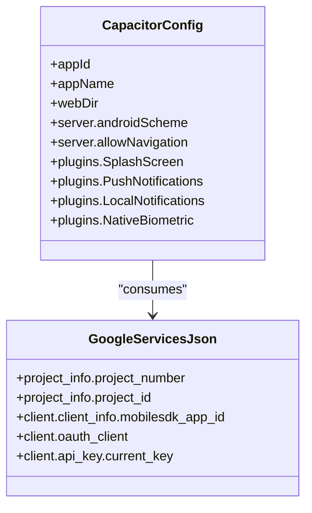
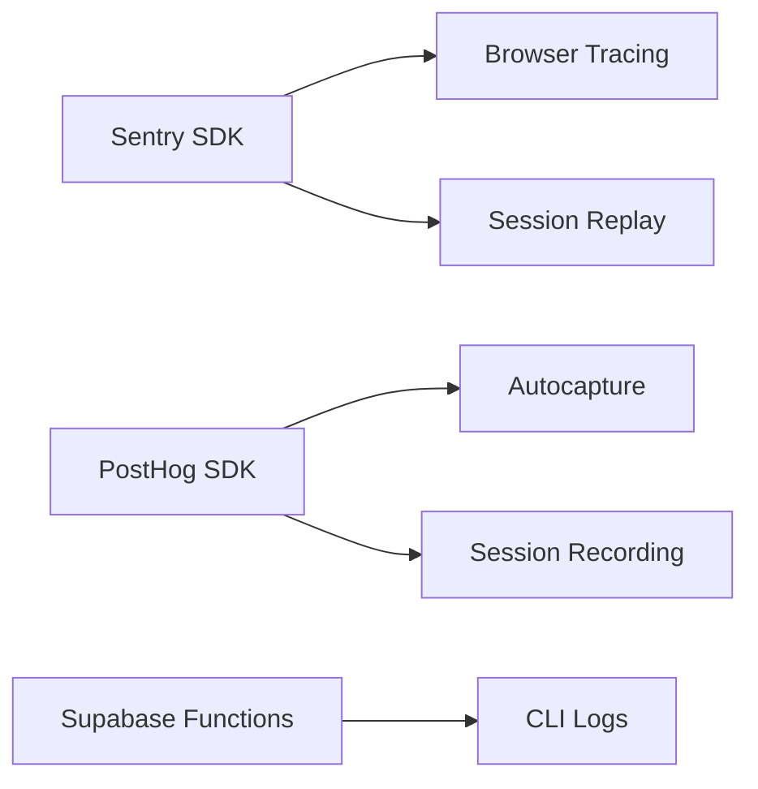
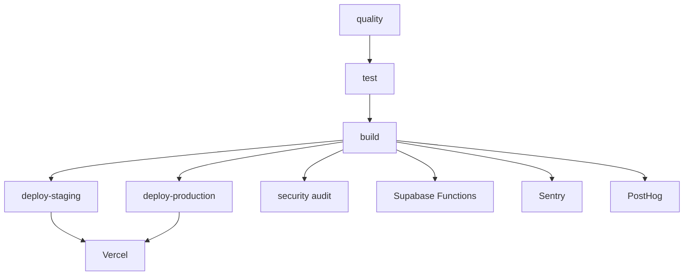

# Deployment & CI/CD

<cite>
**Referenced Files in This Document**
- [ci-cd.yml](file://.github/workflows/ci-cd.yml)
- [build-android-apk.yml](file://.github/workflows/build-android-apk.yml)
- [build-android-release.yml](file://.github/workflows/build-android-release.yml)
- [cleanup-artifacts.yml](file://.github/workflows/cleanup-artifacts.yml)
- [vercel.json](file://vercel.json)
- [package.json](file://package.json)
- [capacitor.config.ts](file://capacitor.config.ts)
- [DEPLOYMENT.md](file://DEPLOYMENT.md)
- [DEPLOYMENT_SUMMARY.md](file://DEPLOYMENT_SUMMARY.md)
- [PHASE2_EDGE_FUNCTIONS.md](file://supabase/functions/PHASE2_EDGE_FUNCTIONS.md)
- [config.toml](file://supabase/config.toml)
- [sentry.ts](file://src/lib/sentry.ts)
- [analytics.ts](file://src/lib/analytics.ts)
- [google-services.json](file://android/app/google-services.json)
</cite>

## Table of Contents
1. [Introduction](#introduction)
2. [Project Structure](#project-structure)
3. [Core Components](#core-components)
4. [Architecture Overview](#architecture-overview)
5. [Detailed Component Analysis](#detailed-component-analysis)
6. [Dependency Analysis](#dependency-analysis)
7. [Performance Considerations](#performance-considerations)
8. [Troubleshooting Guide](#troubleshooting-guide)
9. [Conclusion](#conclusion)
10. [Appendices](#appendices)

## Introduction
This document describes the complete deployment and CI/CD pipeline for the Nutrio platform. It covers automated workflows for frontend deployment to Vercel, backend edge functions on Supabase, and native mobile app builds for Android. It also documents environment management, secrets handling, rollback procedures, monitoring and logging, incident response, security scanning, and performance monitoring integration.

## Project Structure
The deployment pipeline is orchestrated via GitHub Actions workflows under .github/workflows. The frontend is a Vite-built SPA deployed to Vercel, while Supabase Edge Functions provide backend automation. Capacitor powers the native mobile wrapper around the web app, with Android-specific configuration and Firebase/Google Services integration.



**Diagram sources**
- [ci-cd.yml:1-197](file://.github/workflows/ci-cd.yml#L1-L197)
- [build-android-apk.yml:1-142](file://.github/workflows/build-android-apk.yml#L1-L142)
- [build-android-release.yml:1-148](file://.github/workflows/build-android-release.yml#L1-L148)
- [vercel.json:1-38](file://vercel.json#L1-L38)
- [capacitor.config.ts:1-45](file://capacitor.config.ts#L1-L45)
- [google-services.json:1-29](file://android/app/google-services.json#L1-L29)
- [config.toml:1-59](file://supabase/config.toml#L1-L59)

**Section sources**
- [.github/workflows/ci-cd.yml:1-197](file://.github/workflows/ci-cd.yml#L1-L197)
- [.github/workflows/build-android-apk.yml:1-142](file://.github/workflows/build-android-apk.yml#L1-L142)
- [.github/workflows/build-android-release.yml:1-148](file://.github/workflows/build-android-release.yml#L1-L148)
- [vercel.json:1-38](file://vercel.json#L1-L38)
- [capacitor.config.ts:1-45](file://capacitor.config.ts#L1-L45)
- [android/app/google-services.json:1-29](file://android/app/google-services.json#L1-L29)
- [supabase/config.toml:1-59](file://supabase/config.toml#L1-L59)

## Core Components
- Frontend build and deployment to Vercel:
  - Builds the SPA with Vite and uploads the dist artifact.
  - Deploys to Vercel staging on develop branch and production on main branch using vercel-action.
- Backend edge functions on Supabase:
  - Supabase Edge Functions are configured in config.toml with JWT verification toggled per function.
  - Additional automation functions documented in PHASE2_EDGE_FUNCTIONS.md.
- Mobile app builds:
  - Android APK/AAB builds via Gradle with optional signing for releases.
  - Capacitor configuration defines webDir and server behavior.
  - Google Services configuration enables Firebase-related capabilities.

**Section sources**
- [.github/workflows/ci-cd.yml:76-169](file://.github/workflows/ci-cd.yml#L76-L169)
- [supabase/config.toml:1-59](file://supabase/config.toml#L1-L59)
- [supabase/functions/PHASE2_EDGE_FUNCTIONS.md:1-411](file://supabase/functions/PHASE2_EDGE_FUNCTIONS.md#L1-L411)
- [.github/workflows/build-android-apk.yml:28-142](file://.github/workflows/build-android-apk.yml#L28-L142)
- [.github/workflows/build-android-release.yml:14-148](file://.github/workflows/build-android-release.yml#L14-L148)
- [capacitor.config.ts:1-45](file://capacitor.config.ts#L1-L45)
- [android/app/google-services.json:1-29](file://android/app/google-services.json#L1-L29)

## Architecture Overview
The deployment pipeline integrates frontend, backend, and mobile components:

```mermaid
sequenceDiagram
participant Dev as "Developer"
participant GH as "GitHub Actions"
participant FE as "Frontend Build"
participant Vercel as "Vercel"
participant SB as "Supabase Functions"
participant AND as "Android Build"
Dev->>GH : Push/PR to main/develop
GH->>FE : Build SPA (Vite)
FE-->>GH : dist/ artifact
GH->>Vercel : Deploy dist/ (staging/production)
GH->>SB : Edge Functions (via separate steps or local CLI)
GH->>AND : Build APK/AAB (debug/release)
AND-->>GH : Upload artifacts/releases
```

**Diagram sources**
- [ci-cd.yml:76-169](file://.github/workflows/ci-cd.yml#L76-L169)
- [build-android-apk.yml:28-142](file://.github/workflows/build-android-apk.yml#L28-L142)
- [build-android-release.yml:14-148](file://.github/workflows/build-android-release.yml#L14-L148)

## Detailed Component Analysis

### CI/CD Pipeline (Frontend to Vercel)
- Triggers:
  - Runs on pushes and pull requests to main and develop.
- Jobs:
  - Code Quality: ESLint and TypeScript checks.
  - Unit Tests: Vitest with coverage and artifact upload.
  - Build: Vite production build with Supabase and analytics keys injected.
  - Deploy Staging: Vercel deployment for develop branch when secrets are present.
  - Deploy Production: Vercel deployment for main branch with --prod flag.
  - Security Audit: npm audit and audit-ci scans.
- Secrets used:
  - VERCEL_TOKEN, VERCEL_ORG_ID, VERCEL_PROJECT_ID, VITE_SUPABASE_URL, VITE_SUPABASE_PUBLISHABLE_KEY, VITE_SENTRY_DSN, VITE_POSTHOG_KEY.



**Diagram sources**
- [ci-cd.yml:12-197](file://.github/workflows/ci-cd.yml#L12-L197)

**Section sources**
- [.github/workflows/ci-cd.yml:1-197](file://.github/workflows/ci-cd.yml#L1-L197)

### Android APK/AAB Build and Release
- Triggers:
  - Push to develop/main or PRs to those branches.
  - Manual dispatch with build_type selection (debug/release).
- Steps:
  - Build web app with Vite.
  - Sync Capacitor Android project.
  - Setup Android SDK and Gradle caching.
  - Build debug or release APK/AAB.
  - Publish artifacts as GitHub Releases (latest-debug/latest-release).
  - Optional signing for release builds when tagged.
- Artifacts:
  - Upload APK and AAB artifacts for later distribution.



**Diagram sources**
- [build-android-apk.yml:28-142](file://.github/workflows/build-android-apk.yml#L28-L142)
- [build-android-release.yml:14-148](file://.github/workflows/build-android-release.yml#L14-L148)

**Section sources**
- [.github/workflows/build-android-apk.yml:1-142](file://.github/workflows/build-android-apk.yml#L1-L142)
- [.github/workflows/build-android-release.yml:1-148](file://.github/workflows/build-android-release.yml#L1-L148)

### Vercel Configuration and Routing
- Rewrites all routes to index.html for SPA routing.
- Security headers applied to static assets and all routes.
- Asset caching optimized for immutable assets.



**Diagram sources**
- [vercel.json:1-38](file://vercel.json#L1-L38)

**Section sources**
- [vercel.json:1-38](file://vercel.json#L1-L38)

### Supabase Edge Functions and Backend Automation
- Edge Functions configuration:
  - Project ID defined; JWT verification disabled for multiple functions in config.toml.
- Additional automation functions:
  - auto-assign-driver: Assigns drivers to deliveries using a scoring algorithm.
  - send-invoice-email: Sends invoices via Resend and logs outcomes.
  - Environment variables: SUPABASE_URL, SUPABASE_SERVICE_ROLE_KEY, RESEND_API_KEY.
  - Deployment: via CLI commands and triggers/cron scheduling guidance.



**Diagram sources**
- [config.toml:1-59](file://supabase/config.toml#L1-L59)
- [PHASE2_EDGE_FUNCTIONS.md:1-411](file://supabase/functions/PHASE2_EDGE_FUNCTIONS.md#L1-L411)

**Section sources**
- [supabase/config.toml:1-59](file://supabase/config.toml#L1-L59)
- [supabase/functions/PHASE2_EDGE_FUNCTIONS.md:1-411](file://supabase/functions/PHASE2_EDGE_FUNCTIONS.md#L1-L411)

### Mobile App Distribution (Android)
- Capacitor configuration:
  - webDir points to dist/.
  - Server settings define scheme, navigation allowances, and plugin configurations.
- Google Services:
  - google-services.json configures Firebase project metadata and API keys for Android.
- Build outputs:
  - APKs and AABs uploaded as artifacts or published as releases.



**Diagram sources**
- [capacitor.config.ts:1-45](file://capacitor.config.ts#L1-L45)
- [google-services.json:1-29](file://android/app/google-services.json#L1-L29)

**Section sources**
- [capacitor.config.ts:1-45](file://capacitor.config.ts#L1-L45)
- [android/app/google-services.json:1-29](file://android/app/google-services.json#L1-L29)

### Environment Management and Secrets Handling
- Frontend:
  - VITE_SUPABASE_URL, VITE_SUPABASE_PUBLISHABLE_KEY, VITE_SENTRY_DSN, VITE_POSTHOG_KEY injected during build.
  - VITE_APP_VERSION set to commit SHA for release tracking.
- Backend:
  - Supabase secrets include SUPABASE_URL, SUPABASE_SERVICE_ROLE_KEY, RESEND_API_KEY.
- Mobile:
  - google-services.json provides Android Firebase configuration.
- Security scanning:
  - npm audit and audit-ci jobs included in ci-cd.yml.

**Section sources**
- [.github/workflows/ci-cd.yml:96-101](file://.github/workflows/ci-cd.yml#L96-L101)
- [supabase/functions/PHASE2_EDGE_FUNCTIONS.md:14-30](file://supabase/functions/PHASE2_EDGE_FUNCTIONS.md#L14-L30)
- [android/app/google-services.json:1-29](file://android/app/google-services.json#L1-L29)
- [.github/workflows/ci-cd.yml:173-197](file://.github/workflows/ci-cd.yml#L173-L197)

### Monitoring, Logging, and Incident Response
- Frontend monitoring:
  - Sentry initialized with tracing and replay integrations; PII filtering enabled.
  - PostHog analytics initialized with session recording and privacy controls.
- Backend monitoring:
  - Supabase functions logs can be tailed via CLI for diagnostics.
- Incident response:
  - Use function logs and error tracking to triage issues.
  - Rollback procedures rely on redeploying previous commits and restoring database backups if needed.



**Diagram sources**
- [sentry.ts:1-73](file://src/lib/sentry.ts#L1-L73)
- [analytics.ts:1-170](file://src/lib/analytics.ts#L1-L170)
- [PHASE2_EDGE_FUNCTIONS.md:339-346](file://supabase/functions/PHASE2_EDGE_FUNCTIONS.md#L339-L346)

**Section sources**
- [src/lib/sentry.ts:1-73](file://src/lib/sentry.ts#L1-L73)
- [src/lib/analytics.ts:1-170](file://src/lib/analytics.ts#L1-L170)
- [supabase/functions/PHASE2_EDGE_FUNCTIONS.md:339-346](file://supabase/functions/PHASE2_EDGE_FUNCTIONS.md#L339-L346)

### Rollback Procedures
- Frontend:
  - Redeploy previous commit; Vercel deployments are environment-specific.
- Backend:
  - Redeploy previous function versions or revert migrations via Supabase CLI/dashboard.
- Database:
  - Restore from backup or revert migrations as needed.

**Section sources**
- [DEPLOYMENT.md:124-131](file://DEPLOYMENT.md#L124-L131)

## Dependency Analysis
- Workflow dependencies:
  - test depends on quality.
  - build depends on quality and test.
  - deploy-staging depends on build (develop branch).
  - deploy-production depends on build (main branch).
- External dependencies:
  - Vercel for frontend hosting.
  - Supabase for edge functions and database.
  - Sentry and PostHog for monitoring.
  - Resend for email automation (backend).



**Diagram sources**
- [ci-cd.yml:12-197](file://.github/workflows/ci-cd.yml#L12-L197)

**Section sources**
- [.github/workflows/ci-cd.yml:12-197](file://.github/workflows/ci-cd.yml#L12-L197)

## Performance Considerations
- Frontend:
  - Vercel rewrite and caching headers improve SPA performance and asset caching.
  - Lazy loading and code splitting reduce initial bundle size.
- Backend:
  - Edge Functions minimize latency for small automations.
  - Use indexing and RLS policies to optimize database queries.
- Mobile:
  - APK/AAB builds enable optimized native packaging.

[No sources needed since this section provides general guidance]

## Troubleshooting Guide
- Vercel deployment issues:
  - Verify VERCEL_TOKEN, VERCEL_ORG_ID, VERCEL_PROJECT_ID secrets.
  - Confirm build artifact upload and environment variables.
- Supabase function errors:
  - Check function logs via CLI.
  - Validate environment variables and JWT verification settings.
- Android build failures:
  - Ensure Gradle cache keys and Android SDK setup.
  - Confirm keystore decoding and signing properties for release builds.
- Security audit failures:
  - Review npm audit and audit-ci outputs; remediate high severity issues.

**Section sources**
- [.github/workflows/ci-cd.yml:118-168](file://.github/workflows/ci-cd.yml#L118-L168)
- [supabase/functions/PHASE2_EDGE_FUNCTIONS.md:380-401](file://supabase/functions/PHASE2_EDGE_FUNCTIONS.md#L380-L401)
- [.github/workflows/build-android-release.yml:64-83](file://.github/workflows/build-android-release.yml#L64-L83)

## Conclusion
The Nutrio deployment pipeline automates frontend, backend, and mobile delivery with robust monitoring and security scanning. Vercel hosts the SPA with SPA-friendly rewrites and security headers. Supabase Edge Functions power backend automation with clear deployment and logging practices. Android builds are streamlined with optional signing and artifact publishing. Environment variables and secrets are managed securely, and rollback procedures are straightforward.

[No sources needed since this section summarizes without analyzing specific files]

## Appendices

### Multi-Environment Deployment Strategy
- Staging:
  - Triggered on develop branch; deploys to Vercel staging.
- Production:
  - Triggered on main branch; deploys to Vercel production with --prod.

**Section sources**
- [.github/workflows/ci-cd.yml:114-169](file://.github/workflows/ci-cd.yml#L114-L169)

### Artifact Cleanup
- Scheduled cleanup of old artifacts to control storage usage.

**Section sources**
- [.github/workflows/cleanup-artifacts.yml:1-36](file://.github/workflows/cleanup-artifacts.yml#L1-L36)

### Environment Variables Reference
- Frontend:
  - VITE_SUPABASE_URL, VITE_SUPABASE_PUBLISHABLE_KEY, VITE_SENTRY_DSN, VITE_POSTHOG_KEY, VITE_APP_VERSION.
- Backend:
  - SUPABASE_URL, SUPABASE_SERVICE_ROLE_KEY, RESEND_API_KEY.
- Mobile:
  - google-services.json credentials.

**Section sources**
- [.github/workflows/ci-cd.yml:96-101](file://.github/workflows/ci-cd.yml#L96-L101)
- [supabase/functions/PHASE2_EDGE_FUNCTIONS.md:14-30](file://supabase/functions/PHASE2_EDGE_FUNCTIONS.md#L14-L30)
- [android/app/google-services.json:1-29](file://android/app/google-services.json#L1-L29)