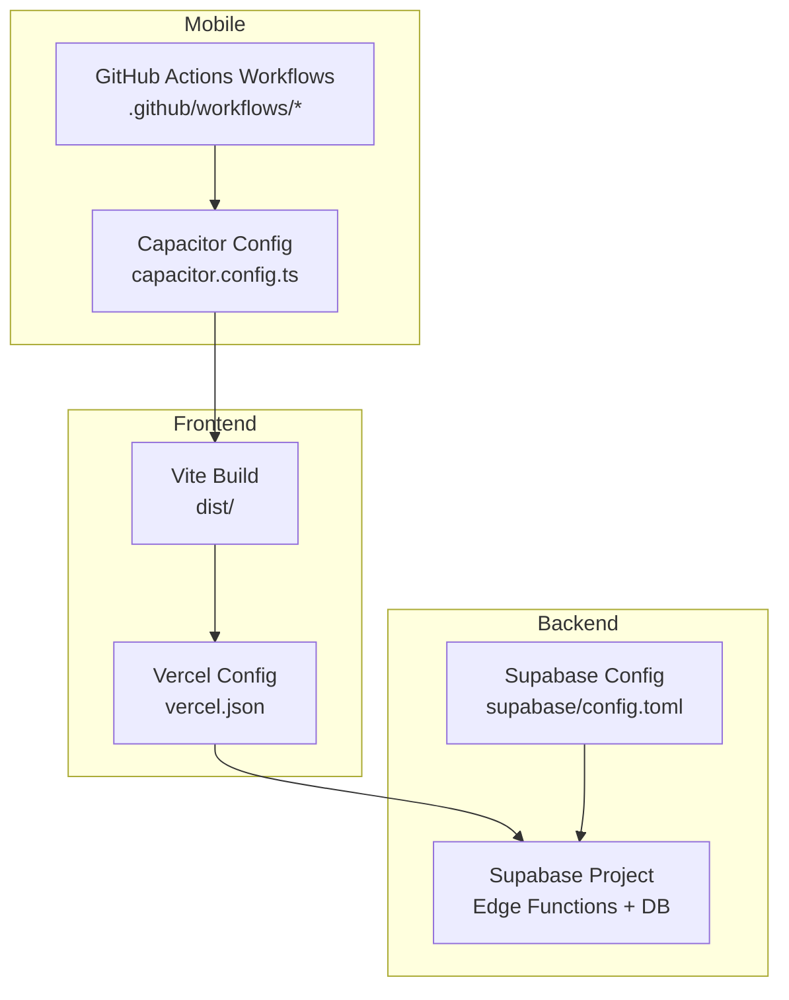
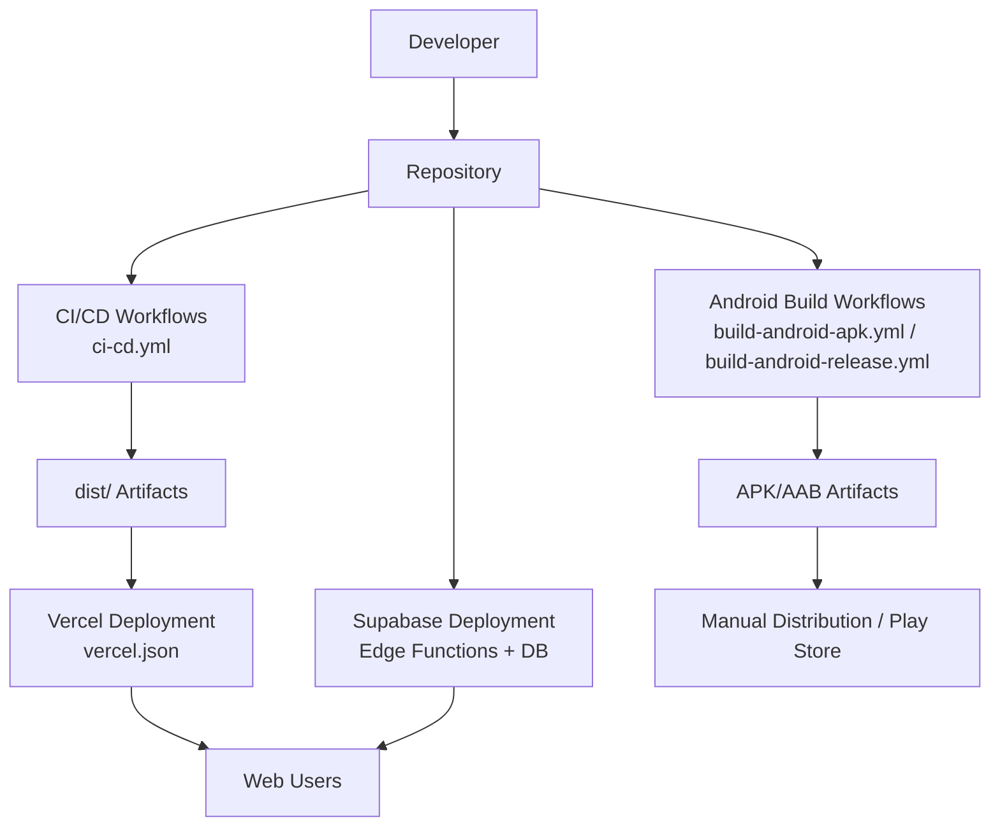
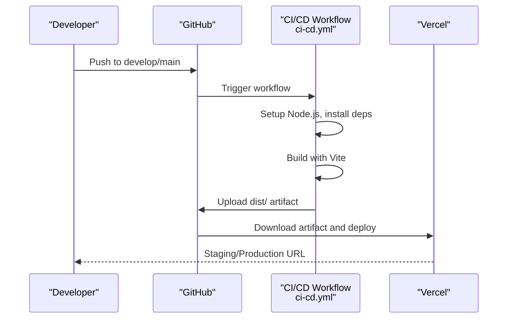
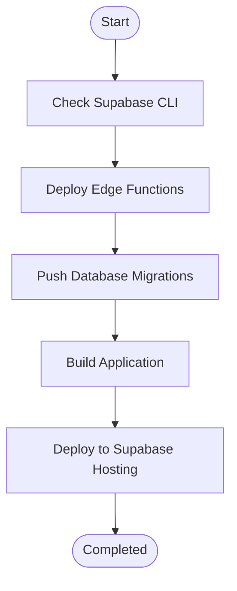
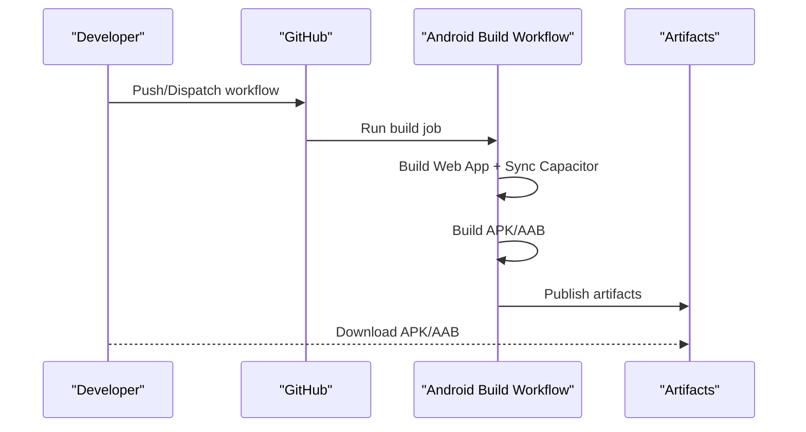
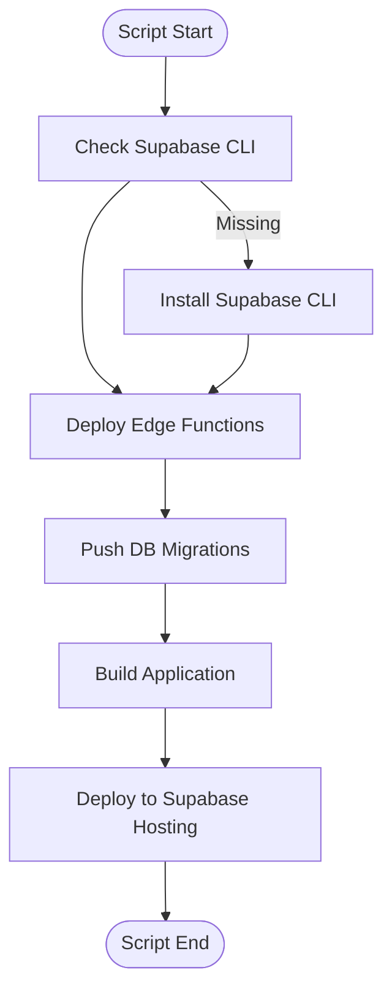
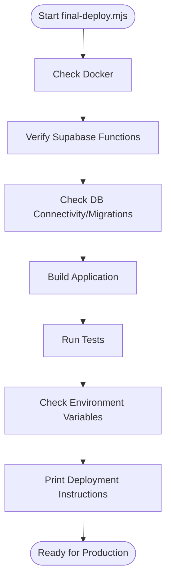
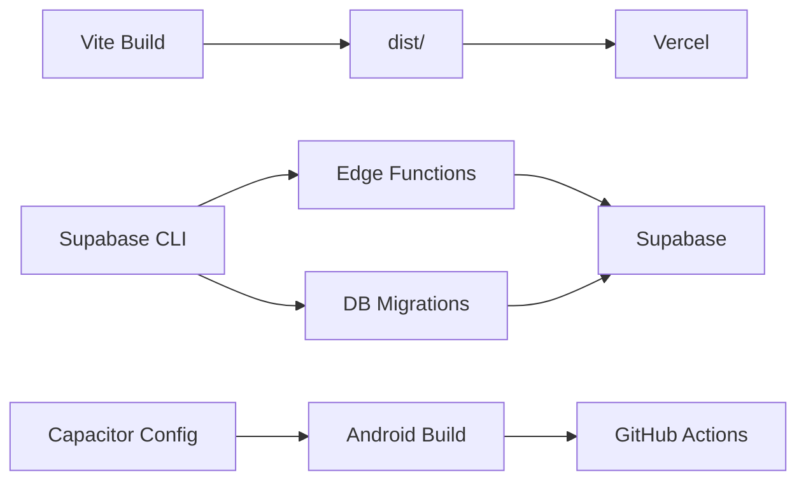

# Deployment Procedures

<cite>
**Referenced Files in This Document**
- [DEPLOYMENT.md](file://DEPLOYMENT.md)
- [DEPLOYMENT_SUMMARY.md](file://DEPLOYMENT_SUMMARY.md)
- [GITHUB_ACTIONS_SETUP.md](file://GITHUB_ACTIONS_SETUP.md)
- [ci-cd.yml](file://.github/workflows/ci-cd.yml)
- [build-android-apk.yml](file://.github/workflows/build-android-apk.yml)
- [build-android-release.yml](file://.github/workflows/build-android-release.yml)
- [cleanup-artifacts.yml](file://.github/workflows/cleanup-artifacts.yml)
- [deploy.sh](file://deploy.sh)
- [deploy.bat](file://deploy.bat)
- [final-deploy.mjs](file://final-deploy.mjs)
- [check-env.mjs](file://check-env.mjs)
- [vercel.json](file://vercel.json)
- [supabase/config.toml](file://supabase/config.toml)
- [capacitor.config.ts](file://capacitor.config.ts)
- [package.json](file://package.json)
</cite>

## Table of Contents
1. [Introduction](#introduction)
2. [Project Structure](#project-structure)
3. [Core Components](#core-components)
4. [Architecture Overview](#architecture-overview)
5. [Detailed Component Analysis](#detailed-component-analysis)
6. [Dependency Analysis](#dependency-analysis)
7. [Performance Considerations](#performance-considerations)
8. [Troubleshooting Guide](#troubleshooting-guide)
9. [Conclusion](#conclusion)
10. [Appendices](#appendices)

## Introduction
This document provides comprehensive deployment procedures for the Nutrio platform across all targets and methods. It covers:
- Frontend deployment to Vercel (staging and production)
- Backend deployment to Supabase (Edge Functions, database migrations, hosting)
- Mobile app distribution via GitHub Actions (Android APK/AAB)
It also details pre-deployment checks, post-deployment verification, automated deployment via GitHub Actions, manual deployment procedures, rollback strategies, deployment validation, monitoring setup, and troubleshooting.

## Project Structure
The repository organizes deployment assets across multiple areas:
- Frontend build artifacts are produced in the dist folder after running the build script.
- Supabase configuration and Edge Functions are under the supabase directory.
- Vercel configuration is defined in vercel.json.
- GitHub Actions workflows orchestrate CI/CD for frontend and Android builds.
- Deployment scripts automate Supabase deployments and environment checks.

**Diagram sources**
- [vercel.json:1-38](file://vercel.json#L1-L38)
- [supabase/config.toml:1-59](file://supabase/config.toml#L1-L59)
- [capacitor.config.ts:1-45](file://capacitor.config.ts#L1-L45)
- [ci-cd.yml:1-197](file://.github/workflows/ci-cd.yml#L1-L197)
- [build-android-apk.yml:1-142](file://.github/workflows/build-android-apk.yml#L1-L142)

**Section sources**
- [package.json:7-43](file://package.json#L7-L43)
- [vercel.json:1-38](file://vercel.json#L1-L38)
- [supabase/config.toml:1-59](file://supabase/config.toml#L1-L59)
- [capacitor.config.ts:1-45](file://capacitor.config.ts#L1-L45)

## Core Components
- Frontend build and hosting: Vite produces the dist folder; Vercel serves it with rewrites and security headers.
- Backend services: Supabase Edge Functions and database migrations; Supabase Hosting deploys the frontend.
- Mobile distribution: GitHub Actions builds Android APKs and AABs; optional Play Store submission.
- Automation: GitHub Actions workflows for CI/CD, Android builds, and artifact cleanup.

Key deployment scripts and their roles:
- deploy.sh: Unix/Linux/macOS automation for Supabase Edge Functions, migrations, build, and Supabase Hosting deployment.
- deploy.bat: Windows automation mirroring deploy.sh.
- final-deploy.mjs: Pre-flight checks, environment verification, and production readiness instructions.
- check-env.mjs: Validates critical environment variables before deployment.

**Section sources**
- [deploy.sh:1-32](file://deploy.sh#L1-L32)
- [deploy.bat:1-33](file://deploy.bat#L1-L33)
- [final-deploy.mjs:1-93](file://final-deploy.mjs#L1-L93)
- [check-env.mjs:1-52](file://check-env.mjs#L1-L52)
- [DEPLOYMENT.md:54-67](file://DEPLOYMENT.md#L54-L67)

## Architecture Overview
The deployment architecture integrates frontend, backend, and mobile components orchestrated by GitHub Actions and manual scripts.

**Diagram sources**
- [ci-cd.yml:1-197](file://.github/workflows/ci-cd.yml#L1-L197)
- [build-android-apk.yml:1-142](file://.github/workflows/build-android-apk.yml#L1-L142)
- [build-android-release.yml](file://.github/workflows/build-android-release.yml)
- [vercel.json:1-38](file://vercel.json#L1-L38)

## Detailed Component Analysis

### Frontend Deployment to Vercel (Automated)
- Triggers: Push to develop (staging) or main (production) with appropriate secrets configured.
- Build: Vite build with environment variables injected from GitHub secrets.
- Deploy: Vercel action uploads dist/ to staging or production.
- Routing: vercel.json defines rewrites to index.html and security headers.

**Diagram sources**
- [ci-cd.yml:112-169](file://.github/workflows/ci-cd.yml#L112-L169)
- [vercel.json:1-38](file://vercel.json#L1-L38)

**Section sources**
- [ci-cd.yml:112-169](file://.github/workflows/ci-cd.yml#L112-L169)
- [vercel.json:1-38](file://vercel.json#L1-L38)

### Frontend Deployment to Vercel (Manual)
- Build the project locally or via CI to produce dist/.
- Configure Vercel project settings with environment variables.
- Deploy the dist folder to Vercel using the Vercel CLI or dashboard.

**Section sources**
- [DEPLOYMENT_SUMMARY.md:54-54](file://DEPLOYMENT_SUMMARY.md#L54-L54)

### Backend Deployment to Supabase (Automated)
- Supabase CLI must be installed and linked to the project.
- Deploy Edge Functions and push database migrations.
- Build the application and deploy to Supabase Hosting.

**Diagram sources**
- [DEPLOYMENT.md:14-52](file://DEPLOYMENT.md#L14-L52)

**Section sources**
- [DEPLOYMENT.md:14-52](file://DEPLOYMENT.md#L14-L52)

### Backend Deployment to Supabase (Manual)
- Install Supabase CLI globally.
- Link project to Supabase using project ref.
- Deploy specific Edge Functions (e.g., IP location check and user IP logging).
- Push database migrations.
- Build and deploy to Supabase Hosting.

**Section sources**
- [DEPLOYMENT.md:14-52](file://DEPLOYMENT.md#L14-L52)

### Mobile App Distribution (Android)
- Workflows:
  - Build Android APK: Supports debug and release builds, publishes artifacts.
  - Build Android Release: Builds both APK and AAB for Play Store submission.
- Signing (optional): Keystore can be provided via GitHub secrets for signed releases.
- Distribution: Download artifacts from GitHub Actions or submit AAB to Google Play Console.

**Diagram sources**
- [build-android-apk.yml:1-142](file://.github/workflows/build-android-apk.yml#L1-L142)
- [build-android-release.yml](file://.github/workflows/build-android-release.yml)
- [GITHUB_ACTIONS_SETUP.md:1-318](file://GITHUB_ACTIONS_SETUP.md#L1-L318)

**Section sources**
- [build-android-apk.yml:1-142](file://.github/workflows/build-android-apk.yml#L1-L142)
- [build-android-release.yml](file://.github/workflows/build-android-release.yml)
- [GITHUB_ACTIONS_SETUP.md:1-318](file://GITHUB_ACTIONS_SETUP.md#L1-L318)

### Deployment Scripts (deploy.sh, deploy.bat)
- Purpose: Automate Supabase Edge Functions deployment, database migrations, application build, and Supabase Hosting deployment.
- Usage:
  - Unix/Linux/macOS: chmod +x deploy.sh; ./deploy.sh
  - Windows: deploy.bat

**Diagram sources**
- [deploy.sh:1-32](file://deploy.sh#L1-L32)
- [deploy.bat:1-33](file://deploy.bat#L1-L33)

**Section sources**
- [deploy.sh:1-32](file://deploy.sh#L1-L32)
- [deploy.bat:1-33](file://deploy.bat#L1-L33)

### Final Deployment Preparation (final-deploy.mjs)
- Validates Docker availability (local development context).
- Verifies Supabase functions list.
- Checks database connectivity and migration status (local).
- Builds the application and runs tests.
- Checks environment variables via check-env.mjs.
- Prints production deployment instructions and required environment variables.

**Diagram sources**
- [final-deploy.mjs:1-93](file://final-deploy.mjs#L1-L93)
- [check-env.mjs:1-52](file://check-env.mjs#L1-L52)

**Section sources**
- [final-deploy.mjs:1-93](file://final-deploy.mjs#L1-L93)
- [check-env.mjs:1-52](file://check-env.mjs#L1-L52)

## Dependency Analysis
- Frontend depends on Vite build and Vercel configuration for routing and security headers.
- Backend depends on Supabase CLI, Edge Functions, and database migrations.
- Mobile depends on Capacitor configuration and GitHub Actions workflows for Android builds.
- CI/CD workflows depend on GitHub secrets for Vercel and Supabase environments.

**Diagram sources**
- [package.json:7-43](file://package.json#L7-L43)
- [vercel.json:1-38](file://vercel.json#L1-L38)
- [supabase/config.toml:1-59](file://supabase/config.toml#L1-L59)
- [capacitor.config.ts:1-45](file://capacitor.config.ts#L1-L45)
- [ci-cd.yml:1-197](file://.github/workflows/ci-cd.yml#L1-L197)
- [build-android-apk.yml:1-142](file://.github/workflows/build-android-apk.yml#L1-L142)

**Section sources**
- [package.json:7-43](file://package.json#L7-L43)
- [vercel.json:1-38](file://vercel.json#L1-L38)
- [supabase/config.toml:1-59](file://supabase/config.toml#L1-L59)
- [capacitor.config.ts:1-45](file://capacitor.config.ts#L1-L45)
- [ci-cd.yml:1-197](file://.github/workflows/ci-cd.yml#L1-L197)
- [build-android-apk.yml:1-142](file://.github/workflows/build-android-apk.yml#L1-L142)

## Performance Considerations
- Optimize build times by enabling dependency caching in CI/CD and Android workflows.
- Use Vercel’s caching headers for static assets to improve CDN performance.
- Minimize payload sizes for mobile builds; enable release builds for production.
- Monitor Supabase function performance and database query optimization.

[No sources needed since this section provides general guidance]

## Troubleshooting Guide
Common issues and recovery procedures:
- Supabase CLI not found: Install globally using the documented command.
- Database migration conflicts: Reset database using the Supabase CLI reset command (data will be deleted).
- Function deployment errors: Check the Supabase dashboard for detailed error messages.
- Build failures (Android): Verify Node.js and Java versions, Gradle wrapper permissions, and Android SDK installation.
- Out of memory during builds: Increase JVM heap size in Gradle properties.
- Build timeouts: Review logs, ensure dependencies are installed, and confirm web app build succeeds.
- Environment variable errors: Use check-env.mjs to validate critical variables before deployment.

Rollback strategies:
- Revert code to the previous version and redeploy.
- For database migrations, restore from a backup via the Supabase dashboard or CLI.

Monitoring and maintenance:
- Review blocked IPs in the admin panel.
- Monitor PostHog analytics for user behavior insights.
- Check Sentry for error reports.
- Review database performance and optimize queries.

**Section sources**
- [DEPLOYMENT.md:96-137](file://DEPLOYMENT.md#L96-L137)
- [GITHUB_ACTIONS_SETUP.md:206-234](file://GITHUB_ACTIONS_SETUP.md#L206-L234)
- [check-env.mjs:1-52](file://check-env.mjs#L1-L52)

## Conclusion
The Nutrio platform supports robust, automated deployment across frontend, backend, and mobile channels. The provided scripts, workflows, and configuration files enable repeatable, reliable deployments with clear pre- and post-deployment validation. By following the procedures outlined here, teams can confidently deploy to staging and production while maintaining strong monitoring and rollback capabilities.

[No sources needed since this section summarizes without analyzing specific files]

## Appendices

### Pre-Deployment Checklist
- Confirm Supabase CLI installation and project linking.
- Verify environment variables (.env) and run check-env.mjs.
- Ensure all database migrations are applied.
- Build the application and run tests.
- Configure Vercel and Supabase secrets.

**Section sources**
- [DEPLOYMENT.md:69-78](file://DEPLOYMENT.md#L69-L78)
- [check-env.mjs:1-52](file://check-env.mjs#L1-L52)
- [DEPLOYMENT_SUMMARY.md:36-44](file://DEPLOYMENT_SUMMARY.md#L36-L44)

### Post-Deployment Verification
- Test user flows (signups, logins, ordering).
- Validate IP management features (geo-restrictions, blocking).
- Confirm analytics and error tracking are reporting.
- Verify mobile app installs and basic functionality.

**Section sources**
- [DEPLOYMENT_SUMMARY.md:56-62](file://DEPLOYMENT_SUMMARY.md#L56-L62)

### Environment Variables Reference
- Vercel: Configure in project settings.
- Supabase: Configure in project settings.
- Mobile: Capacitor configuration points to the built dist folder.

**Section sources**
- [vercel.json:1-38](file://vercel.json#L1-L38)
- [capacitor.config.ts:1-45](file://capacitor.config.ts#L1-L45)