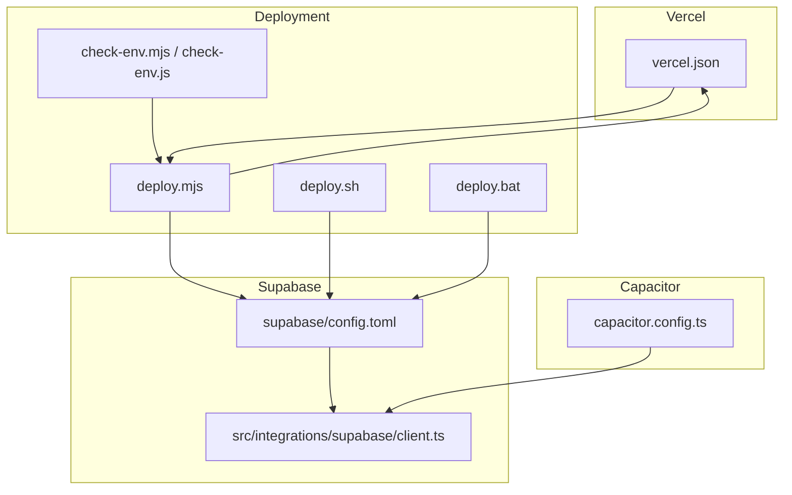
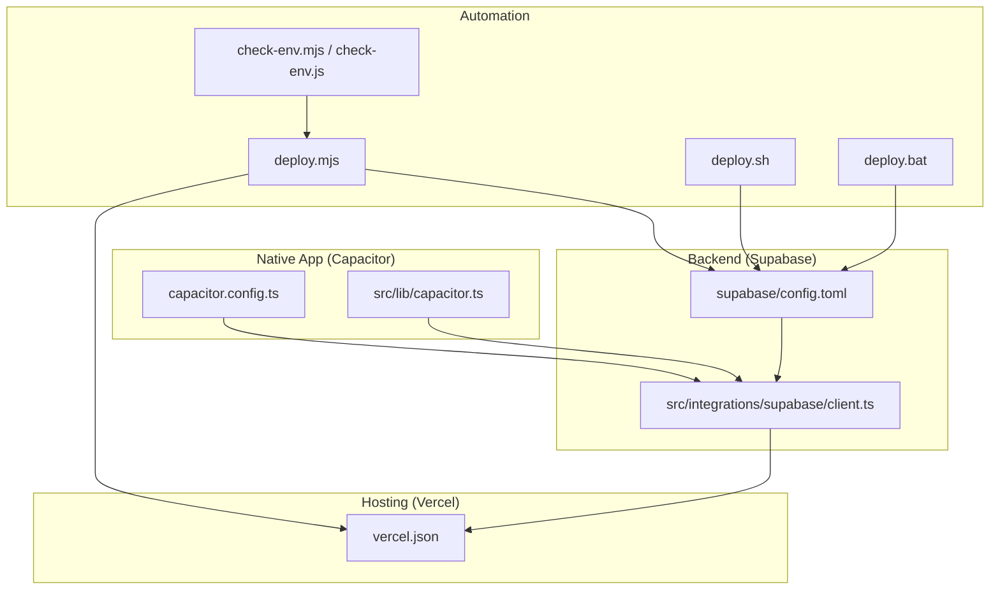
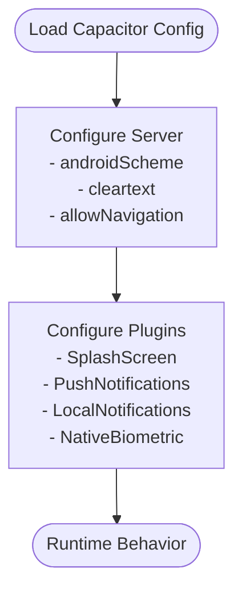
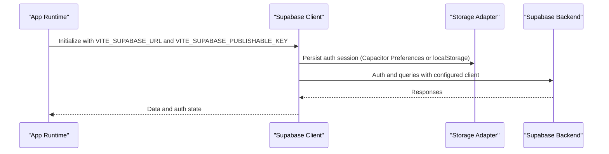
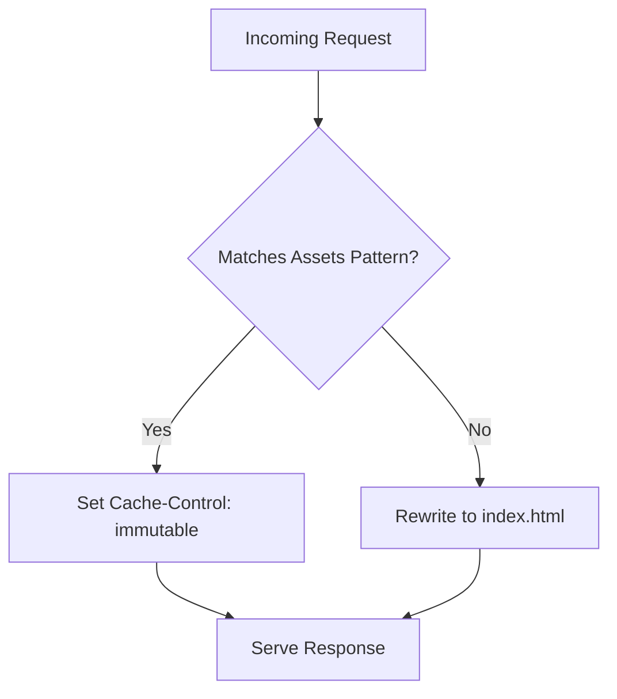
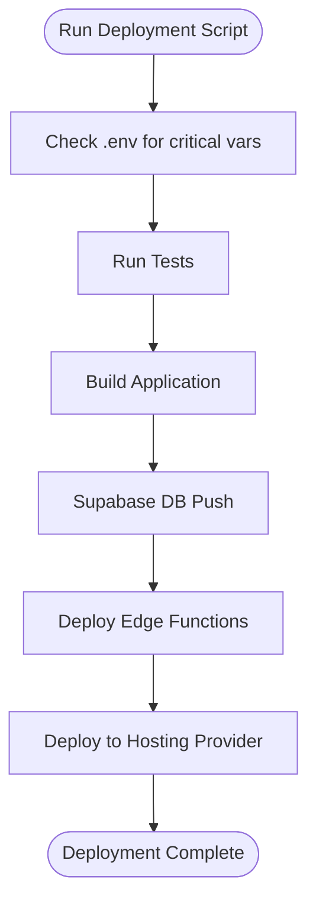
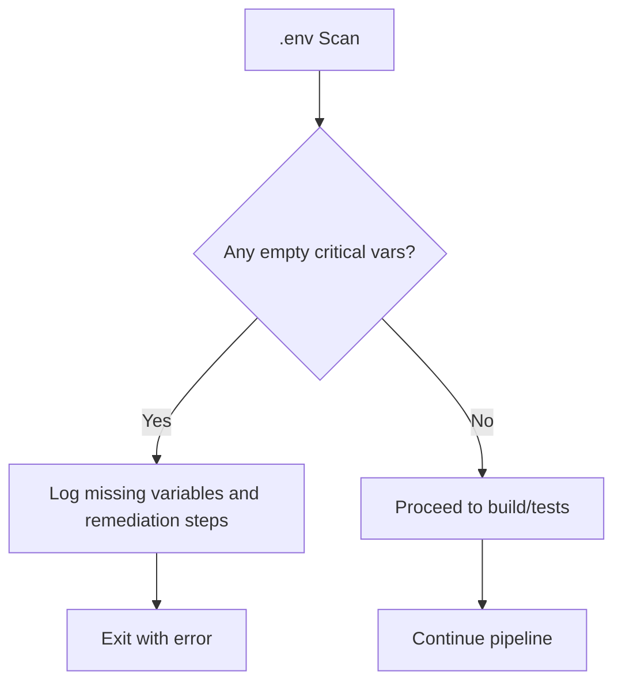
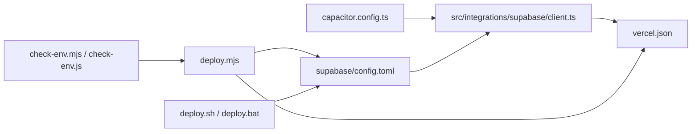

# Environment Management

<cite>
**Referenced Files in This Document**
- [capacitor.config.ts](file://capacitor.config.ts)
- [vercel.json](file://vercel.json)
- [deploy.mjs](file://deploy.mjs)
- [deploy.sh](file://deploy.sh)
- [deploy.bat](file://deploy.bat)
- [check-env.mjs](file://check-env.mjs)
- [check-env.js](file://check-env.js)
- [supabase/config.toml](file://supabase/config.toml)
- [src/integrations/supabase/client.ts](file://src/integrations/supabase/client.ts)
- [src/lib/capacitor.ts](file://src/lib/capacitor.ts)
- [package.json](file://package.json)
</cite>

## Table of Contents
1. [Introduction](#introduction)
2. [Project Structure](#project-structure)
3. [Core Components](#core-components)
4. [Architecture Overview](#architecture-overview)
5. [Detailed Component Analysis](#detailed-component-analysis)
6. [Dependency Analysis](#dependency-analysis)
7. [Performance Considerations](#performance-considerations)
8. [Troubleshooting Guide](#troubleshooting-guide)
9. [Conclusion](#conclusion)

## Introduction
This document explains how the Nutrio platform manages environments across development, staging, and production. It covers Supabase configuration, Capacitor environment settings, Vercel deployment configuration, and shell script deployment automation. It also details environment variable management, secrets handling, configuration overrides, security considerations, best practices, and procedures for environment provisioning.

## Project Structure
The environment management spans several areas:
- Capacitor configuration defines native app behavior and network allowlists.
- Supabase configuration controls function security and database migration behavior.
- Vercel configuration enforces routing and security headers for web deployments.
- Deployment scripts automate checks, builds, migrations, and hosting deployments.
- Supabase client integrates environment variables and storage adapters for sessions.

**Diagram sources**
- [capacitor.config.ts:1-45](file://capacitor.config.ts#L1-L45)
- [supabase/config.toml:1-59](file://supabase/config.toml#L1-L59)
- [src/integrations/supabase/client.ts:1-57](file://src/integrations/supabase/client.ts#L1-L57)
- [vercel.json:1-38](file://vercel.json#L1-L38)
- [deploy.mjs:1-91](file://deploy.mjs#L1-L91)
- [deploy.sh:1-32](file://deploy.sh#L1-L32)
- [deploy.bat:1-33](file://deploy.bat#L1-L33)
- [check-env.mjs:1-52](file://check-env.mjs#L1-L52)
- [check-env.js:1-54](file://check-env.js#L1-L54)

**Section sources**
- [capacitor.config.ts:1-45](file://capacitor.config.ts#L1-L45)
- [supabase/config.toml:1-59](file://supabase/config.toml#L1-L59)
- [src/integrations/supabase/client.ts:1-57](file://src/integrations/supabase/client.ts#L1-L57)
- [vercel.json:1-38](file://vercel.json#L1-L38)
- [deploy.mjs:1-91](file://deploy.mjs#L1-L91)
- [deploy.sh:1-32](file://deploy.sh#L1-L32)
- [deploy.bat:1-33](file://deploy.bat#L1-L33)
- [check-env.mjs:1-52](file://check-env.mjs#L1-L52)
- [check-env.js:1-54](file://check-env.js#L1-L54)

## Core Components
- Capacitor configuration governs native app server settings, navigation allowances, and plugin behavior.
- Supabase configuration defines function-level JWT verification policies and project identifiers.
- Supabase client reads Vite-time environment variables and adapts storage for native vs. web contexts.
- Vercel configuration sets SPA routing and security headers for production web delivery.
- Deployment scripts enforce environment validation, run tests, build artifacts, and deploy to hosting providers.
- Environment checking scripts validate critical variables prior to deployment.

**Section sources**
- [capacitor.config.ts:7-17](file://capacitor.config.ts#L7-L17)
- [supabase/config.toml:1-59](file://supabase/config.toml#L1-L59)
- [src/integrations/supabase/client.ts:7-57](file://src/integrations/supabase/client.ts#L7-L57)
- [vercel.json:3-37](file://vercel.json#L3-L37)
- [deploy.mjs:11-90](file://deploy.mjs#L11-L90)
- [check-env.mjs:8-51](file://check-env.mjs#L8-L51)

## Architecture Overview
The environment architecture ties together native configuration, backend services, and hosting:

**Diagram sources**
- [capacitor.config.ts:1-45](file://capacitor.config.ts#L1-L45)
- [src/lib/capacitor.ts:1-640](file://src/lib/capacitor.ts#L1-L640)
- [supabase/config.toml:1-59](file://supabase/config.toml#L1-L59)
- [src/integrations/supabase/client.ts:1-57](file://src/integrations/supabase/client.ts#L1-L57)
- [vercel.json:1-38](file://vercel.json#L1-L38)
- [deploy.mjs:1-91](file://deploy.mjs#L1-L91)
- [deploy.sh:1-32](file://deploy.sh#L1-L32)
- [deploy.bat:1-33](file://deploy.bat#L1-L33)
- [check-env.mjs:1-52](file://check-env.mjs#L1-L52)
- [check-env.js:1-54](file://check-env.js#L1-L54)

## Detailed Component Analysis

### Capacitor Environment Settings
- Server configuration:
  - Android scheme and cleartext settings control secure transport and mixed-content behavior.
  - Allow-list of domains permits navigation to Supabase and related services.
- Plugin configurations:
  - Splash screen, push notifications, local notifications, and native biometric settings are defined centrally.

**Diagram sources**
- [capacitor.config.ts:7-41](file://capacitor.config.ts#L7-L41)

**Section sources**
- [capacitor.config.ts:7-41](file://capacitor.config.ts#L7-L41)

### Supabase Configuration
- Project identifier and function-level JWT verification toggles:
  - Many functions disable JWT verification, indicating direct invocation paths.
- Client-side integration:
  - Supabase client reads Vite-time environment variables for URL and publishable key.
  - Uses a Capacitor Preferences adapter for native sessions and falls back to localStorage on web.

**Diagram sources**
- [src/integrations/supabase/client.ts:7-57](file://src/integrations/supabase/client.ts#L7-L57)
- [supabase/config.toml:1-59](file://supabase/config.toml#L1-L59)

**Section sources**
- [supabase/config.toml:1-59](file://supabase/config.toml#L1-L59)
- [src/integrations/supabase/client.ts:7-57](file://src/integrations/supabase/client.ts#L7-L57)

### Vercel Deployment Configuration
- Rewrites:
  - Single-page application routing is enforced by rewriting all paths to index.html.
- Security headers:
  - Assets caching policy is optimized via Cache-Control.
  - Global security headers include X-Content-Type-Options, X-Frame-Options, and X-XSS-Protection.

**Diagram sources**
- [vercel.json:3-37](file://vercel.json#L3-L37)

**Section sources**
- [vercel.json:1-38](file://vercel.json#L1-L38)

### Shell Script Deployment Automation
- Node-based production deployment script:
  - Validates critical environment variables and warns on optional ones.
  - Runs tests, builds the application, and prints next steps for database and hosting.
- Cross-platform shell scripts:
  - Install Supabase CLI if missing.
  - Deploy specific edge functions, push database migrations, build, and deploy to Supabase Hosting.

**Diagram sources**
- [deploy.mjs:11-90](file://deploy.mjs#L11-L90)
- [deploy.sh:7-29](file://deploy.sh#L7-L29)
- [deploy.bat:7-29](file://deploy.bat#L7-L29)

**Section sources**
- [deploy.mjs:1-91](file://deploy.mjs#L1-L91)
- [deploy.sh:1-32](file://deploy.sh#L1-L32)
- [deploy.bat:1-33](file://deploy.bat#L1-L33)

### Environment Variable Management and Secrets Handling
- Critical variables checked during deployment:
  - Email provider API key and observability tokens.
- Optional variables:
  - Error tracking and analytics keys; absence does not block app operation but limits observability.
- Validation scripts:
  - Both Node and JavaScript variants scan the .env file for empty values and guide remediation.

**Diagram sources**
- [check-env.mjs:8-51](file://check-env.mjs#L8-L51)
- [check-env.js:10-53](file://check-env.js#L10-L53)
- [deploy.mjs:17-55](file://deploy.mjs#L17-L55)

**Section sources**
- [check-env.mjs:1-52](file://check-env.mjs#L1-L52)
- [check-env.js:1-54](file://check-env.js#L1-L54)
- [deploy.mjs:17-55](file://deploy.mjs#L17-L55)

### Configuration Overrides and Feature Flags
- Capacitor allows navigation to Supabase domains, enabling seamless backend integration.
- Supabase function-level JWT verification toggles indicate explicit invocation paths for various engines and notification handlers.
- Vercel rewrite ensures single-page app behavior regardless of route depth.

**Section sources**
- [capacitor.config.ts:13-16](file://capacitor.config.ts#L13-L16)
- [supabase/config.toml:30-58](file://supabase/config.toml#L30-L58)
- [vercel.json:3-7](file://vercel.json#L3-L7)

### Setup for Environments
- Development:
  - Use Vite dev server with Capacitor sync for native testing.
  - Ensure Vite environment variables are present for Supabase client initialization.
- Staging:
  - Validate .env variables using the environment checker scripts.
  - Run tests and build locally before deploying to staging hosting.
- Production:
  - Execute the Node deployment script to validate environment, run tests, build, and print next steps.
  - Use shell scripts to deploy edge functions, push migrations, and deploy to hosting.

**Section sources**
- [package.json:20-26](file://package.json#L20-L26)
- [check-env.mjs:37-47](file://check-env.mjs#L37-L47)
- [deploy.mjs:11-90](file://deploy.mjs#L11-L90)
- [deploy.sh:14-29](file://deploy.sh#L14-L29)
- [deploy.bat:13-29](file://deploy.bat#L13-L29)

### Security Considerations
- Supabase function JWT verification disabled for multiple functions; ensure these endpoints are protected by other means (authentication, rate limiting, monitoring).
- Capacitor server allow-navigation includes Supabase domains; restrict further in production to minimize attack surface.
- Vercel security headers mitigate common web vulnerabilities.
- Environment variables must never be committed; use CI/CD secret stores and template files for guidance only.

**Section sources**
- [supabase/config.toml:30-58](file://supabase/config.toml#L30-L58)
- [capacitor.config.ts:13-16](file://capacitor.config.ts#L13-L16)
- [vercel.json:20-35](file://vercel.json#L20-L35)

### Best Practices for Secrets Management
- Store secrets in CI/CD secret stores; do not commit .env files.
- Use separate .env files per environment with strict gitignore rules.
- Validate environment variables before building and deploying.
- Rotate secrets regularly and monitor access logs.

**Section sources**
- [check-env.mjs:37-47](file://check-env.mjs#L37-L47)
- [check-env.js:39-47](file://check-env.js#L39-L47)

### Procedures for Environment Provisioning
- Provision Supabase project and functions; ensure project ID matches configuration.
- Configure Vercel project to use SPA rewrites and security headers.
- Set up CI/CD to run environment checks, tests, and deployment scripts.
- For native builds, ensure Capacitor configuration aligns with backend endpoints.

**Section sources**
- [supabase/config.toml:1-1](file://supabase/config.toml#L1-L1)
- [vercel.json:3-7](file://vercel.json#L3-L7)
- [package.json:20-26](file://package.json#L20-L26)

## Dependency Analysis
The environment components depend on each other as follows:
- Capacitor configuration influences runtime behavior and network access.
- Supabase client depends on Vite environment variables and storage adapter.
- Deployment scripts depend on environment validation and Supabase/Vercel configurations.
- Vercel configuration affects how the built application behaves in production.

**Diagram sources**
- [capacitor.config.ts:1-45](file://capacitor.config.ts#L1-L45)
- [supabase/config.toml:1-59](file://supabase/config.toml#L1-L59)
- [src/integrations/supabase/client.ts:1-57](file://src/integrations/supabase/client.ts#L1-L57)
- [vercel.json:1-38](file://vercel.json#L1-L38)
- [check-env.mjs:1-52](file://check-env.mjs#L1-L52)
- [check-env.js:1-54](file://check-env.js#L1-L54)
- [deploy.mjs:1-91](file://deploy.mjs#L1-L91)
- [deploy.sh:1-32](file://deploy.sh#L1-L32)
- [deploy.bat:1-33](file://deploy.bat#L1-L33)

**Section sources**
- [capacitor.config.ts:1-45](file://capacitor.config.ts#L1-L45)
- [supabase/config.toml:1-59](file://supabase/config.toml#L1-L59)
- [src/integrations/supabase/client.ts:1-57](file://src/integrations/supabase/client.ts#L1-L57)
- [vercel.json:1-38](file://vercel.json#L1-L38)
- [deploy.mjs:1-91](file://deploy.mjs#L1-L91)
- [deploy.sh:1-32](file://deploy.sh#L1-L32)
- [deploy.bat:1-33](file://deploy.bat#L1-L33)
- [check-env.mjs:1-52](file://check-env.mjs#L1-L52)
- [check-env.js:1-54](file://check-env.js#L1-L54)

## Performance Considerations
- Minimize unnecessary edge function invocations by validating inputs early.
- Use Vercel’s asset caching headers to reduce bandwidth and latency.
- Keep Capacitor allow-navigation lists minimal to avoid unintended network calls.

## Troubleshooting Guide
- Missing Supabase configuration:
  - The client logs an error if required environment variables are absent during initialization.
- Empty critical environment variables:
  - Deployment and environment check scripts exit with errors when critical variables are empty.
- Build failures:
  - The Node deployment script exits if tests or build commands fail; review logs and fix issues before retrying.
- Supabase CLI not found:
  - Shell scripts install the Supabase CLI globally if missing; ensure network connectivity and permissions.

**Section sources**
- [src/integrations/supabase/client.ts:10-16](file://src/integrations/supabase/client.ts#L10-L16)
- [check-env.mjs:29-47](file://check-env.mjs#L29-L47)
- [check-env.js:31-48](file://check-env.js#L31-L48)
- [deploy.mjs:62-90](file://deploy.mjs#L62-L90)
- [deploy.sh:8-12](file://deploy.sh#L8-L12)
- [deploy.bat:7-11](file://deploy.bat#L7-L11)

## Conclusion
Nutrio’s environment management combines Capacitor configuration for native behavior, Supabase setup for backend services, Vercel configuration for web delivery, and robust deployment scripts for automated provisioning. By enforcing environment validation, using secure defaults, and following the outlined best practices, teams can reliably operate development, staging, and production environments while maintaining strong security and performance.