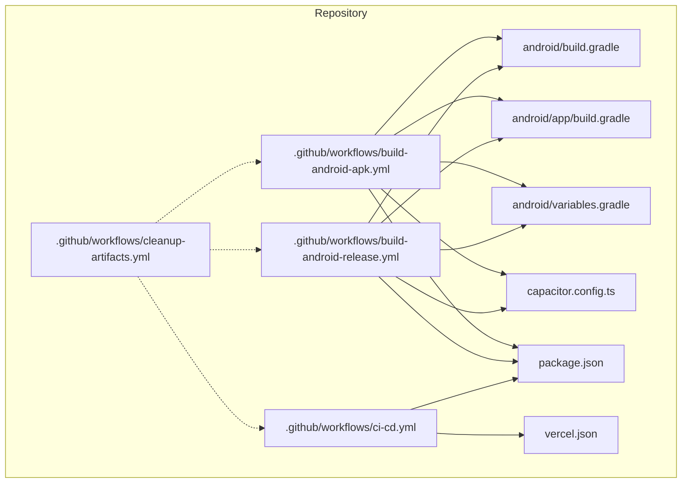
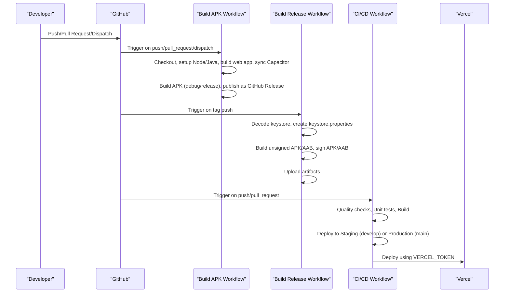
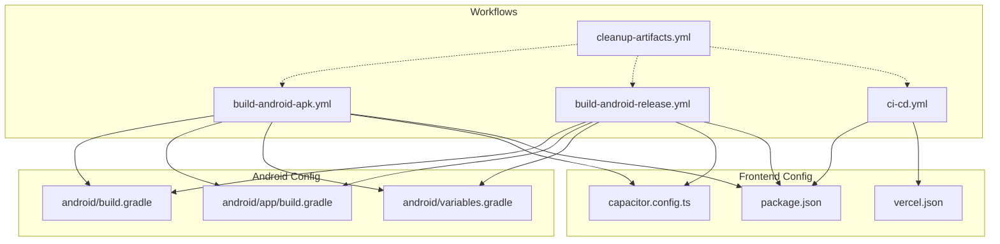

# GitHub Actions Workflows

<cite>
**Referenced Files in This Document**
- [build-android-apk.yml](file://.github/workflows/build-android-apk.yml)
- [build-android-release.yml](file://.github/workflows/build-android-release.yml)
- [ci-cd.yml](file://.github/workflows/ci-cd.yml)
- [cleanup-artifacts.yml](file://.github/workflows/cleanup-artifacts.yml)
- [android/build.gradle](file://android/build.gradle)
- [android/app/build.gradle](file://android/app/build.gradle)
- [android/variables.gradle](file://android/variables.gradle)
- [capacitor.config.ts](file://capacitor.config.ts)
- [package.json](file://package.json)
- [vercel.json](file://vercel.json)
</cite>

## Table of Contents
1. [Introduction](#introduction)
2. [Project Structure](#project-structure)
3. [Core Components](#core-components)
4. [Architecture Overview](#architecture-overview)
5. [Detailed Component Analysis](#detailed-component-analysis)
6. [Dependency Analysis](#dependency-analysis)
7. [Performance Considerations](#performance-considerations)
8. [Troubleshooting Guide](#troubleshooting-guide)
9. [Conclusion](#conclusion)

## Introduction
This document provides comprehensive documentation for the GitHub Actions workflows that power the Nutrio CI/CD pipeline. It covers four primary workflows: building Android APKs, building Android releases (APK and AAB), continuous integration and deployment (CI/CD), and artifact cleanup. The documentation explains the purpose, triggers, jobs, steps, configuration options, environment variables, secrets handling, workflow dependencies, conditional execution, and error handling strategies. It also includes practical examples for customization and troubleshooting common issues.

## Project Structure
The CI/CD pipeline is orchestrated through GitHub Actions workflows located under the .github/workflows directory. These workflows integrate with the frontend application (built with Vite and Capacitor), Android native builds, and Vercel deployments. Supporting configuration files include Android Gradle build scripts, Capacitor configuration, and Vercel rewrites and headers.

**Diagram sources**
- [build-android-apk.yml:1-142](file://.github/workflows/build-android-apk.yml#L1-L142)
- [build-android-release.yml:1-148](file://.github/workflows/build-android-release.yml#L1-L148)
- [ci-cd.yml:1-197](file://.github/workflows/ci-cd.yml#L1-L197)
- [cleanup-artifacts.yml:1-36](file://.github/workflows/cleanup-artifacts.yml#L1-L36)
- [android/build.gradle:1-30](file://android/build.gradle#L1-L30)
- [android/app/build.gradle:1-75](file://android/app/build.gradle#L1-L75)
- [android/variables.gradle:1-16](file://android/variables.gradle#L1-L16)
- [capacitor.config.ts:1-45](file://capacitor.config.ts#L1-L45)
- [package.json:1-159](file://package.json#L1-L159)
- [vercel.json:1-38](file://vercel.json#L1-L38)

**Section sources**
- [.github/workflows/build-android-apk.yml:1-142](file://.github/workflows/build-android-apk.yml#L1-L142)
- [.github/workflows/build-android-release.yml:1-148](file://.github/workflows/build-android-release.yml#L1-L148)
- [.github/workflows/ci-cd.yml:1-197](file://.github/workflows/ci-cd.yml#L1-L197)
- [.github/workflows/cleanup-artifacts.yml:1-36](file://.github/workflows/cleanup-artifacts.yml#L1-L36)
- [android/build.gradle:1-30](file://android/build.gradle#L1-L30)
- [android/app/build.gradle:1-75](file://android/app/build.gradle#L1-L75)
- [android/variables.gradle:1-16](file://android/variables.gradle#L1-L16)
- [capacitor.config.ts:1-45](file://capacitor.config.ts#L1-L45)
- [package.json:1-159](file://package.json#L1-L159)
- [vercel.json:1-38](file://vercel.json#L1-L38)

## Core Components
This section summarizes each workflow’s purpose, triggers, jobs, and high-level steps.

- Build Android APK
  - Purpose: Build and publish debug or release Android APKs automatically on pushes and pull requests, and on demand via workflow dispatch.
  - Triggers: push to main/develop, pull_request targeting main/develop, workflow_dispatch with build_type input (debug or release).
  - Jobs: build (single job).
  - Key steps: checkout, setup Node.js and Java, install dependencies, build web app, sync Capacitor Android, setup Android SDK, cache Gradle, build APK (conditional), publish as GitHub Release (conditional), summarize APK info.

- Build Android Release (APK + AAB)
  - Purpose: Build unsigned and signed APKs and AABs for releases tagged with semantic versioning.
  - Triggers: push to tags matching v*, workflow_dispatch.
  - Jobs: build (single job).
  - Key steps: checkout, setup Node.js and Java, install dependencies, build web app, sync Capacitor Android, setup Android SDK, decode keystore (conditional), create keystore properties (conditional), build unsigned APK and AAB, sign APK and AAB (conditional), upload artifacts, summarize build info.

- CI/CD Pipeline
  - Purpose: End-to-end CI/CD for frontend application with quality checks, unit tests, build, staging and production deployments to Vercel.
  - Triggers: push to main/develop, pull_request to main/develop.
  - Jobs: quality, test, build, deploy-staging, deploy-production, security.
  - Dependencies: test depends on quality; build depends on quality and test; deploy-staging depends on build; deploy-production depends on build.
  - Conditional deployment: staging on develop with VERCEL_TOKEN secret; production on main with VERCEL_TOKEN secret.

- Cleanup Old Artifacts
  - Purpose: Periodically delete old artifacts from the repository to manage storage.
  - Triggers: workflow_dispatch or scheduled cron (weekly).
  - Job: cleanup (single job with write permissions).
  - Steps: list and delete all artifacts using GitHub Script.

**Section sources**
- [.github/workflows/build-android-apk.yml:1-142](file://.github/workflows/build-android-apk.yml#L1-L142)
- [.github/workflows/build-android-release.yml:1-148](file://.github/workflows/build-android-release.yml#L1-L148)
- [.github/workflows/ci-cd.yml:1-197](file://.github/workflows/ci-cd.yml#L1-L197)
- [.github/workflows/cleanup-artifacts.yml:1-36](file://.github/workflows/cleanup-artifacts.yml#L1-L36)

## Architecture Overview
The CI/CD architecture integrates frontend builds, Android packaging via Capacitor, and cloud deployments. The workflows orchestrate sequential jobs with explicit dependencies and conditional execution based on branch and event context. Secrets and environment variables are injected securely from GitHub Actions secrets.

**Diagram sources**
- [build-android-apk.yml:1-142](file://.github/workflows/build-android-apk.yml#L1-L142)
- [build-android-release.yml:1-148](file://.github/workflows/build-android-release.yml#L1-L148)
- [ci-cd.yml:1-197](file://.github/workflows/ci-cd.yml#L1-L197)

## Detailed Component Analysis

### Build Android APK Workflow
Purpose: Automate Android APK builds for development and release, publishing artifacts to GitHub Releases.

Key aspects:
- Triggers: push to main/develop, pull_request to main/develop, workflow_dispatch with build_type input.
- Environment: Node.js 22, Java 21.
- Jobs: build.
- Steps:
  - Checkout with full history.
  - Setup Node.js and Java.
  - Install dependencies and build web app with Supabase and analytics keys.
  - Sync Capacitor Android project.
  - Setup Android SDK and grant execute permissions to gradlew.
  - Cache Gradle packages.
  - Conditional build: assembleDebug or assembleRelease based on build_type input.
  - Conditional publish: softprops/action-gh-release uploads either debug or release APK as latest-release or latest-debug.
  - Summarize APK info including file name, size, build type, and commit.

Secrets and environment variables:
- VITE_SUPABASE_URL, VITE_SUPABASE_PUBLISHABLE_KEY (used during web app build).
- Build type controlled via workflow_dispatch input.

Conditional execution:
- if conditions on steps control whether debug or release builds and publications occur.

Artifacts and releases:
- APKs published to GitHub Releases with descriptive metadata.

Customization examples:
- Add additional build variants by extending conditional steps.
- Introduce signing for debug builds if needed.
- Adjust Gradle arguments or add linting steps.

**Section sources**
- [.github/workflows/build-android-apk.yml:1-142](file://.github/workflows/build-android-apk.yml#L1-L142)

### Build Android Release Workflow
Purpose: Produce unsigned and signed APKs and AABs for distribution, with keystore handling for signed artifacts.

Key aspects:
- Triggers: push to tags matching v*, workflow_dispatch.
- Environment: Node.js 22, Java 21.
- Jobs: build.
- Steps:
  - Checkout with full history.
  - Setup Node.js and Java, install dependencies, build web app.
  - Sync Capacitor Android project.
  - Setup Android SDK and grant execute permissions to gradlew.
  - Cache Gradle packages.
  - Decode keystore and create keystore.properties when triggered by tag push.
  - Build unsigned APK and AAB.
  - Sign APK and AAB when triggered by tag push.
  - Upload APK and AAB as artifacts with retention.
  - Summarize version, commit, branch, and installation instructions.

Secrets and environment variables:
- ANDROID_KEYSTORE_BASE64, ANDROID_KEY_ALIAS, ANDROID_KEY_PASSWORD, ANDROID_KEYSTORE_PASSWORD (decoded to keystore and properties).
- VITE_SUPABASE_URL, VITE_SUPABASE_PUBLISHABLE_KEY (used during web app build).

Conditional execution:
- Keystore decoding and signing steps activate only on tag pushes.

Artifacts:
- APK and AAB uploaded as separate artifacts for later distribution or Play Store upload.

Customization examples:
- Add Play Store upload automation using Google Play GitHub Actions.
- Introduce additional signing configurations or multiple keystores.
- Extend artifact retention policies.

**Section sources**
- [.github/workflows/build-android-release.yml:1-148](file://.github/workflows/build-android-release.yml#L1-L148)

### CI/CD Pipeline Workflow
Purpose: End-to-end CI/CD for the frontend application, including code quality, testing, building, and deploying to staging or production environments.

Key aspects:
- Triggers: push to main/develop, pull_request to main/develop.
- Environment: Node.js 22.
- Jobs:
  - quality: lint and typecheck.
  - test: run unit tests with coverage and upload coverage report.
  - build: build production bundle with Supabase, Sentry, and PostHog keys.
  - deploy-staging: deploy to Vercel staging when on develop and VERCEL_TOKEN is set.
  - deploy-production: deploy to Vercel production when on main and VERCEL_TOKEN is set.
  - security: run npm audit and audit-ci.
- Dependencies: test depends on quality; build depends on quality and test; deploy-staging and deploy-production depend on build.

Secrets and environment variables:
- VERCEL_TOKEN, VERCEL_ORG_ID, VERCEL_PROJECT_ID (for Vercel deployments).
- VITE_SUPABASE_URL, VITE_SUPABASE_PUBLISHABLE_KEY, VITE_SENTRY_DSN, VITE_POSTHOG_KEY (for production build).
- VITE_APP_VERSION injected from GitHub SHA.

Conditional execution:
- Deploy jobs activate only when on develop or main respectively and when VERCEL_TOKEN is present.

Artifacts:
- Coverage reports and production build artifacts are uploaded for later inspection.

Customization examples:
- Add E2E tests to the pipeline.
- Integrate with other hosting providers or CDNs.
- Add approval gates or manual reviews before production deployment.

**Section sources**
- [.github/workflows/ci-cd.yml:1-197](file://.github/workflows/ci-cd.yml#L1-L197)

### Cleanup Old Artifacts Workflow
Purpose: Periodically remove old artifacts from the repository to prevent storage bloat.

Key aspects:
- Triggers: workflow_dispatch or scheduled cron (weekly).
- Job: cleanup with write permissions to actions.
- Steps:
  - List all artifacts using pagination.
  - Iterate and delete each artifact.
  - Log deletion results.

Customization examples:
- Adjust cron schedule for different frequencies.
- Add filtering by artifact age or name patterns.
- Introduce dry-run mode for verification.

**Section sources**
- [.github/workflows/cleanup-artifacts.yml:1-36](file://.github/workflows/cleanup-artifacts.yml#L1-L36)

## Dependency Analysis
This section maps dependencies between workflows and underlying project configurations.

**Diagram sources**
- [build-android-apk.yml:1-142](file://.github/workflows/build-android-apk.yml#L1-L142)
- [build-android-release.yml:1-148](file://.github/workflows/build-android-release.yml#L1-L148)
- [ci-cd.yml:1-197](file://.github/workflows/ci-cd.yml#L1-L197)
- [cleanup-artifacts.yml:1-36](file://.github/workflows/cleanup-artifacts.yml#L1-L36)
- [android/build.gradle:1-30](file://android/build.gradle#L1-L30)
- [android/app/build.gradle:1-75](file://android/app/build.gradle#L1-L75)
- [android/variables.gradle:1-16](file://android/variables.gradle#L1-L16)
- [capacitor.config.ts:1-45](file://capacitor.config.ts#L1-L45)
- [package.json:1-159](file://package.json#L1-L159)
- [vercel.json:1-38](file://vercel.json#L1-L38)

**Section sources**
- [build-android-apk.yml:1-142](file://.github/workflows/build-android-apk.yml#L1-L142)
- [build-android-release.yml:1-148](file://.github/workflows/build-android-release.yml#L1-L148)
- [ci-cd.yml:1-197](file://.github/workflows/ci-cd.yml#L1-L197)
- [cleanup-artifacts.yml:1-36](file://.github/workflows/cleanup-artifacts.yml#L1-L36)
- [android/build.gradle:1-30](file://android/build.gradle#L1-L30)
- [android/app/build.gradle:1-75](file://android/app/build.gradle#L1-L75)
- [android/variables.gradle:1-16](file://android/variables.gradle#L1-L16)
- [capacitor.config.ts:1-45](file://capacitor.config.ts#L1-L45)
- [package.json:1-159](file://package.json#L1-L159)
- [vercel.json:1-38](file://vercel.json#L1-L38)

## Performance Considerations
- Caching: Both Android and Node.js caching are enabled to reduce build times. Ensure Gradle cache keys remain stable by pinning Gradle and wrapper versions.
- Parallelism: The CI/CD workflow stages are ordered to minimize idle time while respecting dependencies. Consider adding parallelizable jobs (e.g., linting and type checking) if they become bottlenecks.
- Artifact retention: Limit retention days for temporary artifacts to reduce storage usage.
- Conditional execution: Use if conditions to avoid unnecessary work (e.g., signing only on tag pushes).
- Dependency installation: Use npm ci for deterministic installs and faster dependency resolution.

## Troubleshooting Guide
Common issues and resolutions:

- Android keystore missing on release builds
  - Symptom: Signing steps fail or APK remains unsigned.
  - Resolution: Ensure ANDROID_KEYSTORE_BASE64, ANDROID_KEY_ALIAS, ANDROID_KEY_PASSWORD, ANDROID_KEYSTORE_PASSWORD secrets are configured and the workflow is triggered by a tag push.

- Vercel deployment failures
  - Symptom: Deploy jobs skip or fail.
  - Resolution: Verify VERCEL_TOKEN, VERCEL_ORG_ID, and VERCEL_PROJECT_ID secrets are set. Confirm branch conditions match develop/main.

- Missing environment variables in production build
  - Symptom: Features relying on VITE_SUPABASE_URL, VITE_SENTRY_DSN, VITE_POSTHOG_KEY fail.
  - Resolution: Ensure these secrets are configured in GitHub Actions. The CI/CD workflow injects them during build.

- Gradle cache misses
  - Symptom: Long Gradle download times.
  - Resolution: Keep Gradle and wrapper versions consistent. The cache action uses hashed Gradle files to compute keys.

- Artifact cleanup not deleting older artifacts
  - Symptom: Storage continues to grow.
  - Resolution: Run the cleanup workflow manually or adjust the cron schedule. Verify permissions are set to write actions.

- Conditional steps not executing
  - Symptom: Debug vs release builds or signing not triggered.
  - Resolution: Confirm workflow_dispatch inputs or tag push events. Review if conditions for steps.

**Section sources**
- [.github/workflows/build-android-release.yml:64-105](file://.github/workflows/build-android-release.yml#L64-L105)
- [.github/workflows/ci-cd.yml:118-168](file://.github/workflows/ci-cd.yml#L118-L168)
- [.github/workflows/cleanup-artifacts.yml:12-36](file://.github/workflows/cleanup-artifacts.yml#L12-L36)

## Conclusion
The Nutrio CI/CD pipeline leverages four focused GitHub Actions workflows to automate Android builds, frontend quality and deployment, and artifact lifecycle management. By combining conditional execution, secrets injection, and artifact caching, the workflows deliver reliable, repeatable, and secure deployments across development and production environments. Extending the workflows—such as integrating Play Store uploads, adding E2E tests, or introducing approval gates—can further enhance the pipeline’s robustness and developer experience.