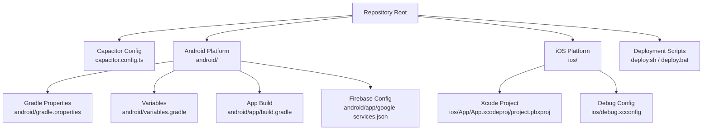
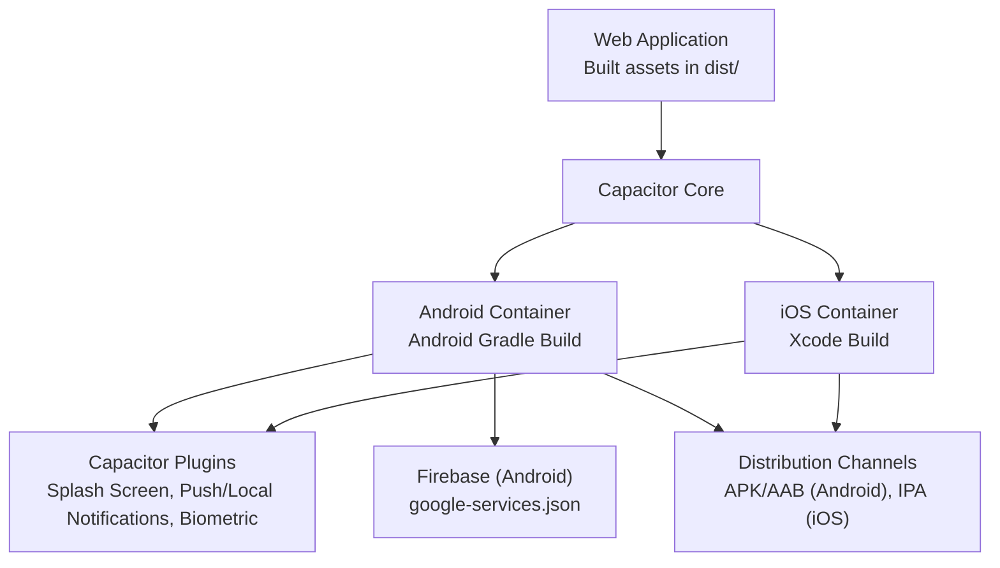
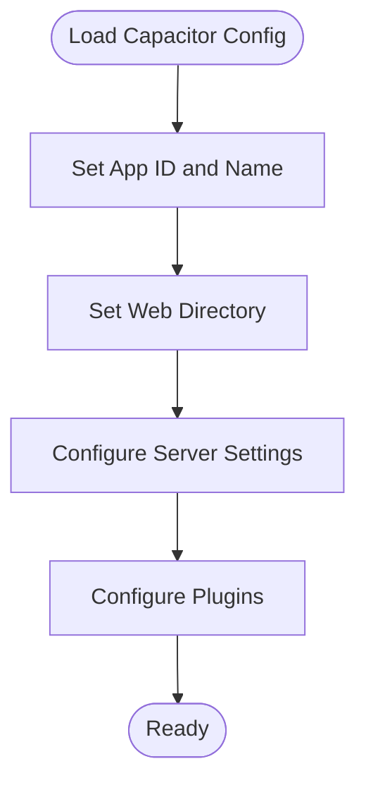
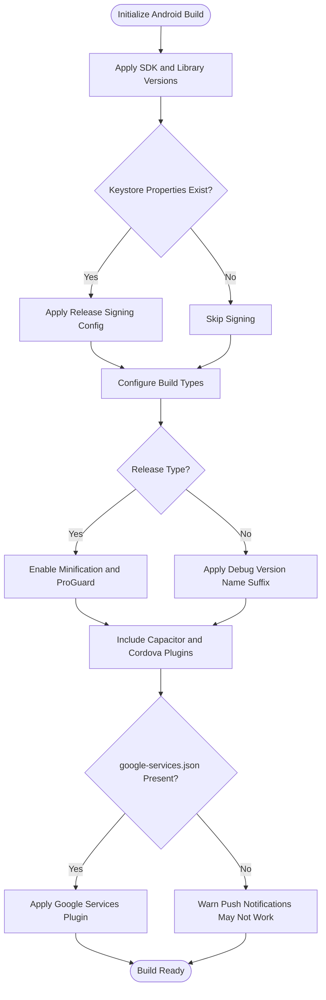
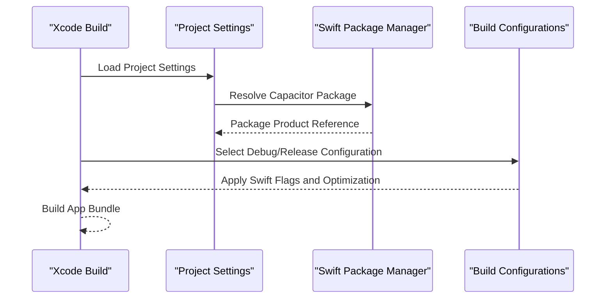
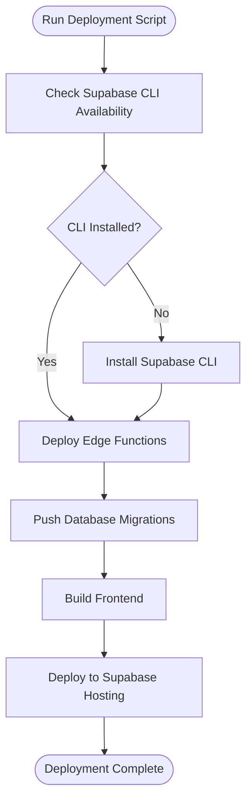
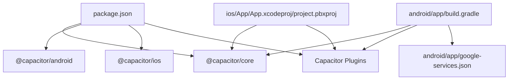

# Mobile App Deployment

<cite>
**Referenced Files in This Document**
- [capacitor.config.ts](file://capacitor.config.ts)
- [package.json](file://package.json)
- [android/app/build.gradle](file://android/app/build.gradle)
- [android/variables.gradle](file://android/variables.gradle)
- [android/gradle.properties](file://android/gradle.properties)
- [android/app/google-services.json](file://android/app/google-services.json)
- [ios/App/App.xcodeproj/project.pbxproj](file://ios/App/App.xcodeproj/project.pbxproj)
- [ios/debug.xcconfig](file://ios/debug.xcconfig)
- [deploy.sh](file://deploy.sh)
- [deploy.bat](file://deploy.bat)
</cite>

## Table of Contents
1. [Introduction](#introduction)
2. [Project Structure](#project-structure)
3. [Core Components](#core-components)
4. [Architecture Overview](#architecture-overview)
5. [Detailed Component Analysis](#detailed-component-analysis)
6. [Dependency Analysis](#dependency-analysis)
7. [Performance Considerations](#performance-considerations)
8. [Troubleshooting Guide](#troubleshooting-guide)
9. [Conclusion](#conclusion)
10. [Appendices](#appendices)

## Introduction
This document provides comprehensive mobile app deployment guidance for Nutrio's native applications built with Capacitor. It covers Capacitor configuration for Android and iOS, build settings, native plugin integration, platform-specific configurations, and the deployment process for generating Android APK/AAB artifacts and iOS IPA distributions. It also outlines app store submission procedures, code signing requirements, certificate management, build automation, version management, release strategies, platform-specific challenges, testing procedures, and post-deployment monitoring.

## Project Structure
The mobile application is structured around Capacitor with platform-specific folders for Android and iOS, shared Capacitor configuration, and build scripts for deployment. The Android app integrates Firebase via Google Services configuration, while iOS uses Swift Package Manager for Capacitor integration.

**Diagram sources**
- [capacitor.config.ts](file://capacitor.config.ts)
- [android/gradle.properties](file://android/gradle.properties)
- [android/variables.gradle](file://android/variables.gradle)
- [android/app/build.gradle](file://android/app/build.gradle)
- [android/app/google-services.json](file://android/app/google-services.json)
- [ios/App/App.xcodeproj/project.pbxproj](file://ios/App/App.xcodeproj/project.pbxproj)
- [ios/debug.xcconfig](file://ios/debug.xcconfig)
- [deploy.sh](file://deploy.sh)
- [deploy.bat](file://deploy.bat)

**Section sources**
- [capacitor.config.ts](file://capacitor.config.ts)
- [android/gradle.properties](file://android/gradle.properties)
- [android/variables.gradle](file://android/variables.gradle)
- [android/app/build.gradle](file://android/app/build.gradle)
- [android/app/google-services.json](file://android/app/google-services.json)
- [ios/App/App.xcodeproj/project.pbxproj](file://ios/App/App.xcodeproj/project.pbxproj)
- [ios/debug.xcconfig](file://ios/debug.xcconfig)
- [deploy.sh](file://deploy.sh)
- [deploy.bat](file://deploy.bat)

## Core Components
- Capacitor configuration defines app identifiers, web build directory, server settings, and plugin configurations for splash screen, push/local notifications, and biometric authentication.
- Android build configuration sets SDK versions, signing configuration, minification/proguard rules, and Cordova plugin integration.
- iOS build configuration defines deployment targets, bundle identifiers, provisioning styles, and Swift Package Manager integration.
- Deployment scripts automate Supabase Edge Functions deployment, database migrations, frontend build, and hosting deployment.

Key capabilities:
- Android: Release signing via keystore properties, ProGuard/R8 optimization, Firebase integration via google-services.json.
- iOS: Automatic provisioning and signing, Swift Package Manager for Capacitor, debug configuration toggle.

**Section sources**
- [capacitor.config.ts](file://capacitor.config.ts)
- [android/app/build.gradle](file://android/app/build.gradle)
- [android/variables.gradle](file://android/variables.gradle)
- [android/gradle.properties](file://android/gradle.properties)
- [android/app/google-services.json](file://android/app/google-services.json)
- [ios/App/App.xcodeproj/project.pbxproj](file://ios/App/App.xcodeproj/project.pbxproj)
- [ios/debug.xcconfig](file://ios/debug.xcconfig)
- [deploy.sh](file://deploy.sh)
- [deploy.bat](file://deploy.bat)

## Architecture Overview
The mobile app architecture leverages Capacitor to wrap a web application into native containers. The web assets are built locally and served by the native app’s embedded server. Platform-specific build systems manage native dependencies, signing, and packaging.

**Diagram sources**
- [capacitor.config.ts](file://capacitor.config.ts)
- [android/app/build.gradle](file://android/app/build.gradle)
- [android/app/google-services.json](file://android/app/google-services.json)
- [ios/App/App.xcodeproj/project.pbxproj](file://ios/App/App.xcodeproj/project.pbxproj)

## Detailed Component Analysis

### Capacitor Configuration
- App identity and web directory define the runtime environment.
- Server configuration controls scheme, cleartext allowance, and allowed navigation domains.
- Plugin configurations enable splash screen behavior, push notification presentation options, local notification sound, and native biometric prompts.

**Diagram sources**
- [capacitor.config.ts](file://capacitor.config.ts)

**Section sources**
- [capacitor.config.ts](file://capacitor.config.ts)

### Android Build Configuration
- SDK versions and library versions are centralized in variables.gradle.
- Signing configuration supports release signing via keystore.properties if present.
- Minification and ProGuard rules are enabled for release builds.
- Cordova plugin integration and Capacitor Android module are included.
- Google Services plugin is conditionally applied if google-services.json exists.

**Diagram sources**
- [android/app/build.gradle](file://android/app/build.gradle)
- [android/variables.gradle](file://android/variables.gradle)
- [android/gradle.properties](file://android/gradle.properties)
- [android/app/google-services.json](file://android/app/google-services.json)

**Section sources**
- [android/app/build.gradle](file://android/app/build.gradle)
- [android/variables.gradle](file://android/variables.gradle)
- [android/gradle.properties](file://android/gradle.properties)
- [android/app/google-services.json](file://android/app/google-services.json)

### iOS Build Configuration
- Xcode project settings define deployment target, bundle identifier, asset catalogs, and Swift Package Manager integration for Capacitor.
- Build configurations specify Swift compilation modes and optimization levels for Debug and Release.
- Debug xcconfig toggles Capacitor debug mode.

**Diagram sources**
- [ios/App/App.xcodeproj/project.pbxproj](file://ios/App/App.xcodeproj/project.pbxproj)
- [ios/debug.xcconfig](file://ios/debug.xcconfig)

**Section sources**
- [ios/App/App.xcodeproj/project.pbxproj](file://ios/App/App.xcodeproj/project.pbxproj)
- [ios/debug.xcconfig](file://ios/debug.xcconfig)

### Deployment Scripts
- Cross-platform deployment scripts automate Supabase Edge Functions deployment, database migration push, frontend build, and Supabase hosting deployment.
- Windows and Unix variants ensure consistent behavior across environments.

**Diagram sources**
- [deploy.sh](file://deploy.sh)
- [deploy.bat](file://deploy.bat)

**Section sources**
- [deploy.sh](file://deploy.sh)
- [deploy.bat](file://deploy.bat)

## Dependency Analysis
- Capacitor core and platform modules are declared in package.json.
- Android dependencies include Capacitor Android, Cordova plugins, and AndroidX libraries.
- iOS integrates Capacitor via Swift Package Manager as defined in the Xcode project.
- Google Services configuration enables Firebase-related features on Android.

**Diagram sources**
- [package.json](file://package.json)
- [android/app/build.gradle](file://android/app/build.gradle)
- [android/app/google-services.json](file://android/app/google-services.json)
- [ios/App/App.xcodeproj/project.pbxproj](file://ios/App/App.xcodeproj/project.pbxproj)

**Section sources**
- [package.json](file://package.json)
- [android/app/build.gradle](file://android/app/build.gradle)
- [android/app/google-services.json](file://android/app/google-services.json)
- [ios/App/App.xcodeproj/project.pbxproj](file://ios/App/App.xcodeproj/project.pbxproj)

## Performance Considerations
- Android release builds enable minification and ProGuard rules to reduce APK size and improve runtime performance.
- iOS Release configuration applies optimized Swift compilation and validation steps to produce efficient binaries.
- Capacitor plugin configurations should be reviewed periodically to avoid unnecessary overhead.

[No sources needed since this section provides general guidance]

## Troubleshooting Guide
Common issues and resolutions:
- Android signing failures: Ensure keystore.properties exists and contains storeFile, storePassword, keyAlias, and keyPassword entries.
- Missing google-services.json: The build will proceed but push notifications may not function; add the file to enable Firebase features.
- iOS provisioning/signing: Automatic provisioning is used; verify Apple credentials and team settings in Xcode if manual signing is required.
- Capacitor sync issues: Use npm run cap:sync, cap:sync:android, or cap:sync:ios to align native configurations with Capacitor settings.
- Debug mode toggling: Set CAPACITOR_DEBUG to true in ios/debug.xcconfig for development diagnostics.

**Section sources**
- [android/app/build.gradle](file://android/app/build.gradle)
- [android/app/google-services.json](file://android/app/google-services.json)
- [ios/debug.xcconfig](file://ios/debug.xcconfig)
- [package.json](file://package.json)

## Conclusion
Nutrio’s mobile deployment pipeline leverages Capacitor for unified web-to-native packaging, with platform-specific build configurations for Android and iOS. The Android setup includes release signing, minification, and Firebase integration, while iOS uses automatic provisioning and Swift Package Manager. Deployment scripts streamline backend and hosting updates. Following the outlined processes ensures reliable builds, secure distribution, and smooth app store submissions.

[No sources needed since this section summarizes without analyzing specific files]

## Appendices

### Android Build and Distribution
- Build types: debug (with version suffix) and release (minified with ProGuard).
- Signing: release signing configured via keystore.properties if present.
- Packaging: generate APK/AAB using Android Gradle build tasks after successful release build.
- Store submission: prepare signed AAB for Google Play Console; ensure correct app signing certificate and internal app sharing/testing tracks as needed.

**Section sources**
- [android/app/build.gradle](file://android/app/build.gradle)
- [android/variables.gradle](file://android/variables.gradle)
- [android/gradle.properties](file://android/gradle.properties)

### iOS Build and Distribution
- Build configurations: Debug and Release with distinct Swift optimization settings.
- Signing: Automatic provisioning style; ensure valid Apple credentials and team membership.
- Packaging: Archive the project in Xcode to generate an IPA for TestFlight or App Store distribution.
- Store submission: Upload via Transporter or Xcode Organizer to App Store Connect; ensure correct provisioning profiles and certificates.

**Section sources**
- [ios/App/App.xcodeproj/project.pbxproj](file://ios/App/App.xcodeproj/project.pbxproj)
- [ios/debug.xcconfig](file://ios/debug.xcconfig)

### Code Signing and Certificates (iOS)
- Automatic signing: Xcode manages certificates and provisioning profiles when CODE_SIGN_STYLE is Automatic.
- Manual signing: Configure team, signing certificate, and provisioning profile in Xcode project settings if required.
- Certificate management: Maintain valid Apple Developer Program membership and renew certificates before expiration.

**Section sources**
- [ios/App/App.xcodeproj/project.pbxproj](file://ios/App/App.xcodeproj/project.pbxproj)

### Code Signing and Certificates (Android)
- Keystore creation: Generate a keystore and record storeFile, storePassword, keyAlias, keyPassword.
- Keystore.properties: Place keystore.properties at the root of the Android app module with the keystore credentials.
- Security: Protect keystore files and avoid committing them to version control.

**Section sources**
- [android/app/build.gradle](file://android/app/build.gradle)

### Build Automation and Version Management
- Version fields: Android versionCode and versionName are defined in the app build configuration; increment according to release strategy.
- iOS version fields: CURRENT_PROJECT_VERSION and MARKETING_VERSION are set in Xcode project settings; align with semantic versioning.
- CI/CD: Integrate scripts into CI/CD pipelines to automate builds, signing, and distribution.

**Section sources**
- [android/app/build.gradle](file://android/app/build.gradle)
- [ios/App/App.xcodeproj/project.pbxproj](file://ios/App/App.xcodeproj/project.pbxproj)

### Testing Procedures
- Unit and component tests: Run npm test or npm run test:run for frontend tests.
- E2E tests: Use npm run test:e2e or npm run test:e2e:ui for Playwright-based end-to-end tests.
- Native device testing: Use npm run cap:dev:android or npm run cap:dev:ios to run on connected devices for platform-specific validation.

**Section sources**
- [package.json](file://package.json)

### Post-Deployment Monitoring
- Analytics and crash reporting: Integrate monitoring solutions to track app performance and stability.
- Backend health: Monitor Supabase Edge Functions and database migrations for regressions.
- User feedback: Collect and triage user-reported issues promptly.

[No sources needed since this section provides general guidance]