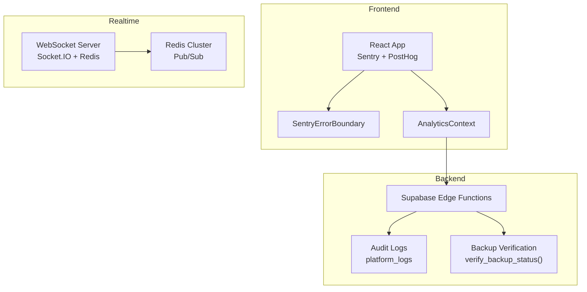
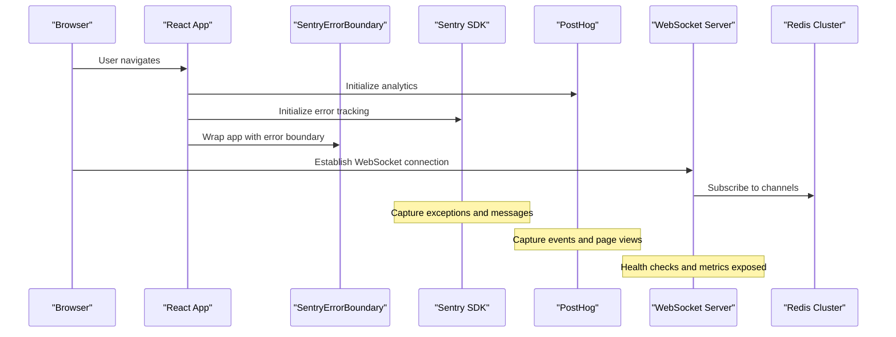
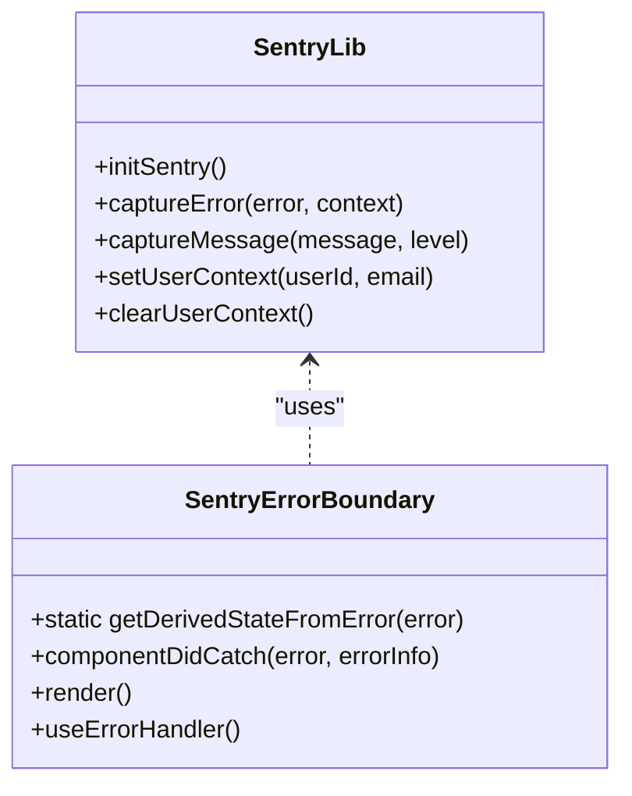
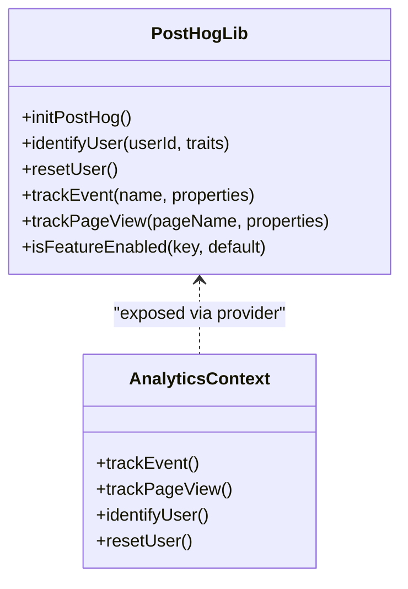
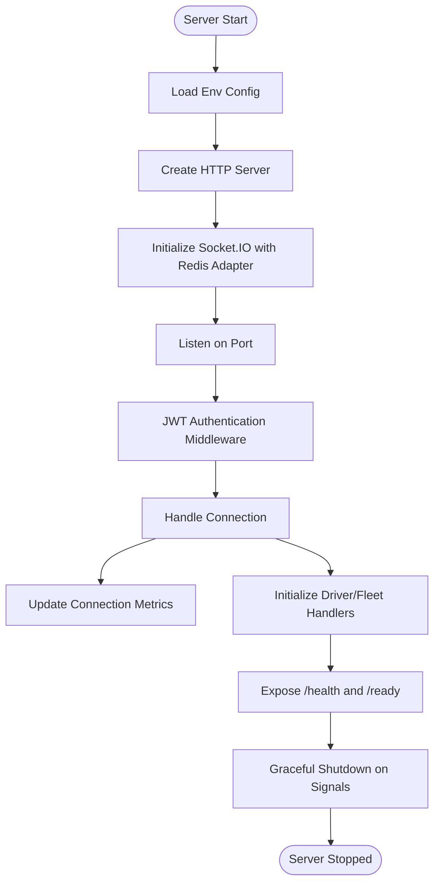
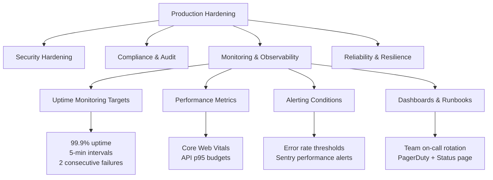
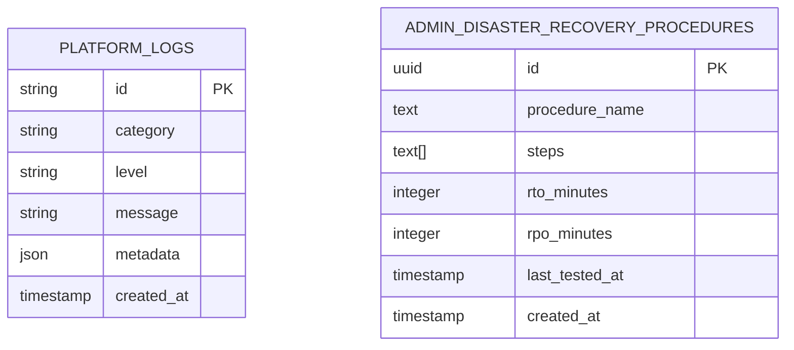
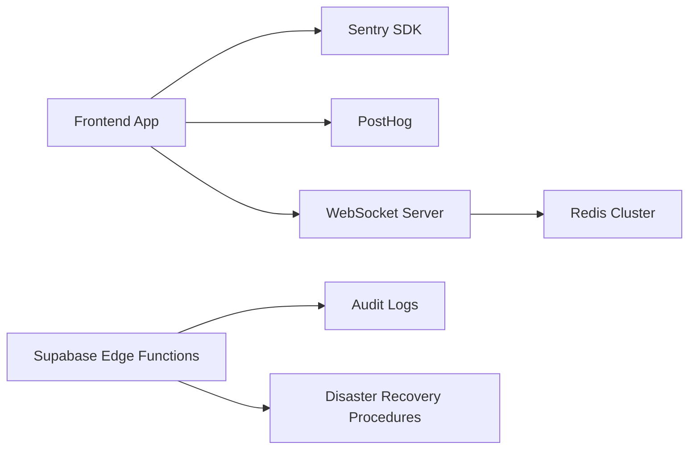

# Monitoring & Logging

<cite>
**Referenced Files in This Document**
- [sentry.ts](file://src/lib/sentry.ts)
- [analytics.ts](file://src/lib/analytics.ts)
- [SentryErrorBoundary.tsx](file://src/components/SentryErrorBoundary.tsx)
- [AnalyticsContext.tsx](file://src/contexts/AnalyticsContext.tsx)
- [server.ts](file://websocket-server/src/server.ts)
- [redisService.ts](file://websocket-server/src/services/redisService.ts)
- [package.json](file://websocket-server/package.json)
- [PRODUCTION_HARDENING_REPORT.md](file://PRODUCTION_HARDENING_REPORT.md)
- [COMPLETE_PRODUCTION_AUDIT_FINAL.md](file://COMPLETE_PRODUCTION_AUDIT_FINAL.md)
- [PRODUCTION_HARDENING_FINAL_SUMMARY.md](file://PRODUCTION_HARDENING_FINAL_SUMMARY.md)
- [20260227000003_verify_backups.sql](file://supabase/migrations/20260227000003_verify_backups.sql)
- [realtime.spec.ts](file://e2e/system/realtime.spec.ts)
- [deploy.mjs](file://deploy.mjs)
</cite>

## Table of Contents
1. [Introduction](#introduction)
2. [Project Structure](#project-structure)
3. [Core Components](#core-components)
4. [Architecture Overview](#architecture-overview)
5. [Detailed Component Analysis](#detailed-component-analysis)
6. [Dependency Analysis](#dependency-analysis)
7. [Performance Considerations](#performance-considerations)
8. [Troubleshooting Guide](#troubleshooting-guide)
9. [Conclusion](#conclusion)
10. [Appendices](#appendices)

## Introduction
This document provides comprehensive monitoring and logging documentation for the Nutrio platform production environment. It covers Sentry error tracking integration, analytics implementation, WebSocket server monitoring, and production hardening measures. It explains logging strategies, error tracking configuration, performance monitoring, and alerting mechanisms. It also documents monitoring setup for frontend, backend, and mobile components, configuration of monitoring dashboards, log aggregation, and incident response procedures. Finally, it addresses production hardening report findings and their implementation, troubleshooting methodologies, performance optimization monitoring, and capacity planning indicators.

## Project Structure
The monitoring and logging stack spans three primary layers:
- Frontend (React SPA) with Sentry SDK for error tracking and PostHog for analytics
- Backend (Supabase Edge Functions) with audit logging and compliance features
- WebSocket server (Node.js with Socket.IO) for real-time tracking with Redis clustering and health checks

**Diagram sources**
- [sentry.ts:1-73](file://src/lib/sentry.ts#L1-L73)
- [analytics.ts:1-170](file://src/lib/analytics.ts#L1-L170)
- [SentryErrorBoundary.tsx:1-77](file://src/components/SentryErrorBoundary.tsx#L1-L77)
- [AnalyticsContext.tsx:1-61](file://src/contexts/AnalyticsContext.tsx#L1-L61)
- [server.ts:1-256](file://websocket-server/src/server.ts#L1-L256)
- [redisService.ts:1-264](file://websocket-server/src/services/redisService.ts#L1-L264)
- [20260227000003_verify_backups.sql:37-131](file://supabase/migrations/20260227000003_verify_backups.sql#L37-L131)

**Section sources**
- [sentry.ts:1-73](file://src/lib/sentry.ts#L1-L73)
- [analytics.ts:1-170](file://src/lib/analytics.ts#L1-L170)
- [SentryErrorBoundary.tsx:1-77](file://src/components/SentryErrorBoundary.tsx#L1-L77)
- [AnalyticsContext.tsx:1-61](file://src/contexts/AnalyticsContext.tsx#L1-L61)
- [server.ts:1-256](file://websocket-server/src/server.ts#L1-L256)
- [redisService.ts:1-264](file://websocket-server/src/services/redisService.ts#L1-L264)
- [20260227000003_verify_backups.sql:37-131](file://supabase/migrations/20260227000003_verify_backups.sql#L37-L131)

## Core Components
- Sentry integration for error tracking and session replay in the frontend
- PostHog analytics for behavioral insights and session recording
- Global error boundary to capture unhandled exceptions
- WebSocket server with Redis adapter for horizontal scaling and health probes
- Audit logging and backup verification for compliance and disaster recovery
- Production hardening framework with monitoring targets and alerting conditions

**Section sources**
- [sentry.ts:1-73](file://src/lib/sentry.ts#L1-L73)
- [analytics.ts:1-170](file://src/lib/analytics.ts#L1-L170)
- [SentryErrorBoundary.tsx:1-77](file://src/components/SentryErrorBoundary.tsx#L1-L77)
- [server.ts:1-256](file://websocket-server/src/server.ts#L1-L256)
- [redisService.ts:1-264](file://websocket-server/src/services/redisService.ts#L1-L264)
- [PRODUCTION_HARDENING_REPORT.md:268-285](file://PRODUCTION_HARDENING_REPORT.md#L268-L285)

## Architecture Overview
The monitoring architecture integrates frontend error tracking, analytics, backend audit logging, and WebSocket server observability.

**Diagram sources**
- [SentryErrorBoundary.tsx:1-77](file://src/components/SentryErrorBoundary.tsx#L1-L77)
- [sentry.ts:1-73](file://src/lib/sentry.ts#L1-L73)
- [analytics.ts:1-170](file://src/lib/analytics.ts#L1-L170)
- [server.ts:1-256](file://websocket-server/src/server.ts#L1-L256)
- [redisService.ts:1-264](file://websocket-server/src/services/redisService.ts#L1-L264)

## Detailed Component Analysis

### Sentry Error Tracking Integration
Sentry is initialized in development and production environments with performance monitoring and session replay. It captures exceptions, messages, and user context while filtering sensitive data.

**Diagram sources**
- [sentry.ts:1-73](file://src/lib/sentry.ts#L1-L73)
- [SentryErrorBoundary.tsx:1-77](file://src/components/SentryErrorBoundary.tsx#L1-L77)

Key behaviors:
- Initialization with DSN, tracing, and replay sampling
- Filtering of user email and IP address before sending
- User context management for correlation
- Development mode bypass for local testing

**Section sources**
- [sentry.ts:1-73](file://src/lib/sentry.ts#L1-L73)
- [SentryErrorBoundary.tsx:1-77](file://src/components/SentryErrorBoundary.tsx#L1-L77)

### Analytics Implementation (PostHog)
PostHog is configured for page view capture, session recording, and event tracking with PII sanitization. Analytics are scoped to identified users only.

**Diagram sources**
- [analytics.ts:1-170](file://src/lib/analytics.ts#L1-L170)
- [AnalyticsContext.tsx:1-61](file://src/contexts/AnalyticsContext.tsx#L1-L61)

Key behaviors:
- Initialization with API key and host
- Session recording with masking
- Event tracking with property sanitization
- Context provider for global analytics access

**Section sources**
- [analytics.ts:1-170](file://src/lib/analytics.ts#L1-L170)
- [AnalyticsContext.tsx:1-61](file://src/contexts/AnalyticsContext.tsx#L1-L61)

### WebSocket Server Monitoring
The WebSocket server implements JWT authentication, Redis adapter for multi-node scaling, health/readiness probes, graceful shutdown, and connection metrics.

**Diagram sources**
- [server.ts:1-256](file://websocket-server/src/server.ts#L1-L256)
- [redisService.ts:1-264](file://websocket-server/src/services/redisService.ts#L1-L264)

Operational highlights:
- JWT-based authentication with role-aware user data
- Redis cluster support for pub/sub and multi-server synchronization
- Health endpoint returning connection counts and environment
- Readiness probe checking Redis connectivity
- Graceful shutdown handling signals and resource cleanup

**Section sources**
- [server.ts:1-256](file://websocket-server/src/server.ts#L1-L256)
- [redisService.ts:1-264](file://websocket-server/src/services/redisService.ts#L1-L264)
- [package.json:1-44](file://websocket-server/package.json#L1-L44)

### Production Hardening and Monitoring Targets
The production hardening framework defines monitoring goals, alerting thresholds, and readiness criteria aligned with uptime, performance, and reliability targets.

**Diagram sources**
- [PRODUCTION_HARDENING_REPORT.md:268-285](file://PRODUCTION_HARDENING_REPORT.md#L268-L285)
- [COMPLETE_PRODUCTION_AUDIT_FINAL.md:732-793](file://COMPLETE_PRODUCTION_AUDIT_FINAL.md#L732-L793)
- [COMPLETE_PRODUCTION_AUDIT_FINAL.md:796-838](file://COMPLETE_PRODUCTION_AUDIT_FINAL.md#L796-L838)

**Section sources**
- [PRODUCTION_HARDENING_REPORT.md:268-285](file://PRODUCTION_HARDENING_REPORT.md#L268-L285)
- [COMPLETE_PRODUCTION_AUDIT_FINAL.md:732-793](file://COMPLETE_PRODUCTION_AUDIT_FINAL.md#L732-L793)
- [COMPLETE_PRODUCTION_AUDIT_FINAL.md:796-838](file://COMPLETE_PRODUCTION_AUDIT_FINAL.md#L796-L838)

### Audit Logging and Disaster Recovery
The backend includes audit logging and backup verification to support compliance and incident response.

**Diagram sources**
- [20260227000003_verify_backups.sql:44-131](file://supabase/migrations/20260227000003_verify_backups.sql#L44-L131)

**Section sources**
- [20260227000003_verify_backups.sql:37-131](file://supabase/migrations/20260227000003_verify_backups.sql#L37-L131)

### Mobile and Native Monitoring
Mobile components leverage Capacitor for native capabilities. Monitoring should include crash reporting, analytics, and network performance. The deployment script validates critical environment variables and warns about optional ones (including Sentry and PostHog keys).

**Section sources**
- [deploy.mjs:1-52](file://deploy.mjs#L1-L52)

## Dependency Analysis
The monitoring stack depends on:
- Frontend SDKs (Sentry and PostHog) for error tracking and analytics
- Backend services (Supabase Edge Functions) for audit logging and compliance
- WebSocket server with Redis for real-time observability
- External services (PagerDuty, status page) for alerting and communication

**Diagram sources**
- [sentry.ts:1-73](file://src/lib/sentry.ts#L1-L73)
- [analytics.ts:1-170](file://src/lib/analytics.ts#L1-L170)
- [server.ts:1-256](file://websocket-server/src/server.ts#L1-L256)
- [redisService.ts:1-264](file://websocket-server/src/services/redisService.ts#L1-L264)
- [20260227000003_verify_backups.sql:37-131](file://supabase/migrations/20260227000003_verify_backups.sql#L37-L131)

**Section sources**
- [sentry.ts:1-73](file://src/lib/sentry.ts#L1-L73)
- [analytics.ts:1-170](file://src/lib/analytics.ts#L1-L170)
- [server.ts:1-256](file://websocket-server/src/server.ts#L1-L256)
- [redisService.ts:1-264](file://websocket-server/src/services/redisService.ts#L1-L264)
- [20260227000003_verify_backups.sql:37-131](file://supabase/migrations/20260227000003_verify_backups.sql#L37-L131)

## Performance Considerations
- Frontend performance budgets: LCP < 2.5s, FID < 100ms, CLS < 0.1, API p95 < 500ms
- WebSocket server capacity planning: horizontal scaling with sticky sessions and Redis pub/sub
- Database and read replica strategy for reporting workloads
- CDN and image optimization for static assets

**Section sources**
- [COMPLETE_PRODUCTION_AUDIT_FINAL.md:610-615](file://COMPLETE_PRODUCTION_AUDIT_FINAL.md#L610-L615)
- [PRODUCTION_HARDENING_REPORT.md:268-285](file://PRODUCTION_HARDENING_REPORT.md#L268-L285)
- [docs/fleet-management-portal-design.md:2511-2585](file://docs/fleet-management-portal-design.md#L2511-L2585)

## Troubleshooting Guide
Common troubleshooting scenarios and remediation steps:

- WebSocket connection issues
  - Verify JWT token validity and role claims
  - Check Redis connectivity via readiness probe
  - Confirm server capacity and connection limits
  - Review server logs for authentication and error events

- Frontend errors and analytics gaps
  - Validate Sentry DSN and PostHog API key configuration
  - Ensure error boundaries are wrapping the application
  - Confirm analytics initialization and event capture

- Backend audit and compliance
  - Verify audit log entries and platform logs
  - Check backup verification and PITR configuration
  - Review disaster recovery procedures and test coverage

- Incident response
  - Use severity-based escalation matrix
  - Follow rollback procedures and notify on-call teams
  - Post updates to status page and internal channels

**Section sources**
- [server.ts:155-192](file://websocket-server/src/server.ts#L155-L192)
- [SentryErrorBoundary.tsx:23-33](file://src/components/SentryErrorBoundary.tsx#L23-L33)
- [analytics.ts:3-35](file://src/lib/analytics.ts#L3-L35)
- [20260227000003_verify_backups.sql:82-131](file://supabase/migrations/20260227000003_verify_backups.sql#L82-L131)
- [COMPLETE_PRODUCTION_AUDIT_FINAL.md:626-666](file://COMPLETE_PRODUCTION_AUDIT_FINAL.md#L626-L666)
- [deploy.mjs:1-52](file://deploy.mjs#L1-L52)

## Conclusion
The Nutrio platform implements a robust monitoring and logging foundation across frontend, backend, and real-time components. Sentry and PostHog provide comprehensive error tracking and analytics, while the WebSocket server offers scalable, observable real-time capabilities backed by Redis. Production hardening efforts define clear monitoring targets, alerting thresholds, and incident response procedures. These measures collectively support reliability, compliance, and operational excellence in production.

## Appendices

### Monitoring Setup Checklist
- Configure Sentry DSN and PostHog API key
- Enable error boundaries and analytics providers
- Set up uptime monitoring and performance budgets
- Configure WebSocket health and readiness probes
- Establish alerting rules and on-call rotation
- Document runbooks and disaster recovery procedures

**Section sources**
- [deploy.mjs:1-52](file://deploy.mjs#L1-L52)
- [PRODUCTION_HARDENING_REPORT.md:268-285](file://PRODUCTION_HARDENING_REPORT.md#L268-L285)
- [COMPLETE_PRODUCTION_AUDIT_FINAL.md:796-838](file://COMPLETE_PRODUCTION_AUDIT_FINAL.md#L796-L838)

### Production Hardening Findings
- Security posture improved with JWT enforcement, RBAC, and rate limiting
- Monitoring maturity includes Sentry, uptime checks, and performance metrics
- Compliance artifacts include audit logs and backup verification
- Recommended next steps: finalize custom dashboards, configure performance alerts, and schedule penetration testing

**Section sources**
- [PRODUCTION_HARDENING_FINAL_SUMMARY.md:397-414](file://PRODUCTION_HARDENING_FINAL_SUMMARY.md#L397-L414)
- [COMPLETE_PRODUCTION_AUDIT_FINAL.md:732-793](file://COMPLETE_PRODUCTION_AUDIT_FINAL.md#L732-L793)