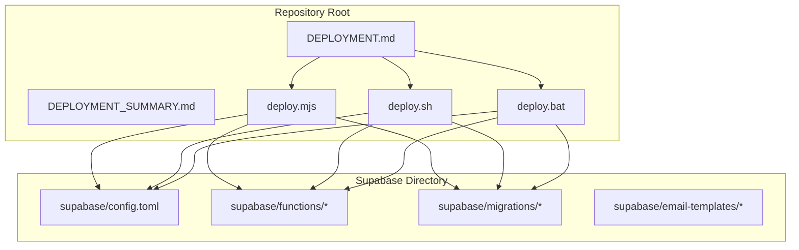
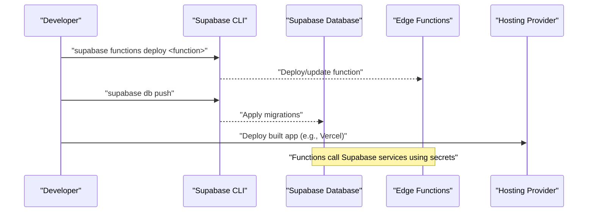
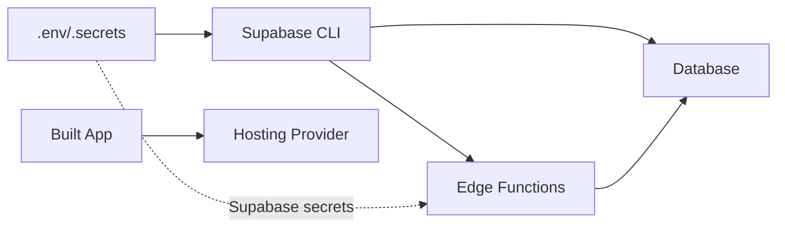

# Supabase Deployment

<cite>
**Referenced Files in This Document**
- [DEPLOYMENT.md](file://DEPLOYMENT.md)
- [DEPLOYMENT_SUMMARY.md](file://DEPLOYMENT_SUMMARY.md)
- [PHASE2_EDGE_FUNCTIONS.md](file://supabase/functions/PHASE2_EDGE_FUNCTIONS.md)
- [config.toml](file://supabase/config.toml)
- [deploy.mjs](file://deploy.mjs)
- [deploy.sh](file://deploy.sh)
- [deploy.bat](file://deploy.bat)
</cite>

## Table of Contents
1. [Introduction](#introduction)
2. [Project Structure](#project-structure)
3. [Core Components](#core-components)
4. [Architecture Overview](#architecture-overview)
5. [Detailed Component Analysis](#detailed-component-analysis)
6. [Dependency Analysis](#dependency-analysis)
7. [Performance Considerations](#performance-considerations)
8. [Troubleshooting Guide](#troubleshooting-guide)
9. [Conclusion](#conclusion)

## Introduction
This document provides comprehensive guidance for deploying the Supabase-powered Nutrio Fuel application. It covers database migrations, edge function deployment, environment configuration, and operational procedures across local, staging, and production environments. It also documents migration workflows, rollback strategies, data preservation approaches, monitoring, and troubleshooting.

## Project Structure
The Supabase deployment assets are organized under the repository root and the supabase directory:
- Supabase configuration and functions: under supabase/
- Deployment scripts and guides: at the repository root
- Environment variables and secrets are managed via Supabase secrets and client-side environment variables

**Diagram sources**
- [DEPLOYMENT.md](file://DEPLOYMENT.md)
- [DEPLOYMENT_SUMMARY.md](file://DEPLOYMENT_SUMMARY.md)
- [deploy.mjs](file://deploy.mjs)
- [deploy.sh](file://deploy.sh)
- [deploy.bat](file://deploy.bat)
- [config.toml](file://supabase/config.toml)

**Section sources**
- [DEPLOYMENT.md](file://DEPLOYMENT.md)
- [DEPLOYMENT_SUMMARY.md](file://DEPLOYMENT_SUMMARY.md)
- [deploy.mjs](file://deploy.mjs)
- [deploy.sh](file://deploy.sh)
- [deploy.bat](file://deploy.bat)
- [config.toml](file://supabase/config.toml)

## Core Components
- Supabase configuration: defines project metadata and per-function JWT verification settings.
- Edge functions: modular serverless logic deployed to Supabase, including IP management functions and phase-2 automation functions.
- Database migrations: declarative schema updates applied via Supabase CLI.
- Deployment scripts: automated workflows for Unix, Windows, and programmatic deployment orchestration.

Key deployment artifacts:
- Supabase configuration: [config.toml](file://supabase/config.toml)
- Edge functions documentation: [PHASE2_EDGE_FUNCTIONS.md](file://supabase/functions/PHASE2_EDGE_FUNCTIONS.md)
- Deployment guides: [DEPLOYMENT.md](file://DEPLOYMENT.md), [DEPLOYMENT_SUMMARY.md](file://DEPLOYMENT_SUMMARY.md)
- Automated deployment scripts: [deploy.mjs](file://deploy.mjs), [deploy.sh](file://deploy.sh), [deploy.bat](file://deploy.bat)

**Section sources**
- [config.toml](file://supabase/config.toml)
- [PHASE2_EDGE_FUNCTIONS.md](file://supabase/functions/PHASE2_EDGE_FUNCTIONS.md)
- [DEPLOYMENT.md](file://DEPLOYMENT.md)
- [DEPLOYMENT_SUMMARY.md](file://DEPLOYMENT_SUMMARY.md)
- [deploy.mjs](file://deploy.mjs)
- [deploy.sh](file://deploy.sh)
- [deploy.bat](file://deploy.bat)

## Architecture Overview
The deployment pipeline integrates Supabase-hosted edge functions, database migrations, and client-side builds. The flow emphasizes idempotent migrations, controlled function deployments, and environment-aware configuration.

**Diagram sources**
- [DEPLOYMENT.md](file://DEPLOYMENT.md)
- [PHASE2_EDGE_FUNCTIONS.md](file://supabase/functions/PHASE2_EDGE_FUNCTIONS.md)

## Detailed Component Analysis

### Database Migrations
- Purpose: Declaratively manage schema changes and data definitions.
- Workflow:
  - Prepare migration files under the migrations directory.
  - Apply migrations using the Supabase CLI push command.
  - Validate migration status and resolve conflicts if needed.
- Rollback strategy:
  - Prefer forward-compatible migrations and backups.
  - Use the Supabase dashboard or CLI to restore from a recent backup when necessary.
- Data preservation:
  - Use safe ALTER statements and avoid destructive operations.
  - Back up critical data before applying risky migrations.

Operational references:
- Migration application: [DEPLOYMENT.md](file://DEPLOYMENT.md)
- Migration status checks: [DEPLOYMENT.md](file://DEPLOYMENT.md)

**Section sources**
- [DEPLOYMENT.md](file://DEPLOYMENT.md)

### Edge Function Deployment
- Scope: Includes IP management functions and phase-2 automation functions.
- Deployment commands:
  - Individual function deployment: use the Supabase CLI to deploy specific functions.
  - Bulk deployment: deploy all functions at once.
- Environment variables:
  - Store secrets via Supabase secrets.
  - Reference required environment variables for each function.
- Invocation:
  - From the application using the Supabase client.
  - Over HTTP with appropriate authorization.
- Monitoring:
  - Tail real-time logs for functions.
  - Inspect database logs for email and assignment tracking.

Operational references:
- Function deployment and invocation: [PHASE2_EDGE_FUNCTIONS.md](file://supabase/functions/PHASE2_EDGE_FUNCTIONS.md)
- Function configuration and JWT verification: [config.toml](file://supabase/config.toml)

**Section sources**
- [PHASE2_EDGE_FUNCTIONS.md](file://supabase/functions/PHASE2_EDGE_FUNCTIONS.md)
- [config.toml](file://supabase/config.toml)

### Configuration Management
- Environment variables:
  - Client-side variables (e.g., Vite variables) for frontend configuration.
  - Supabase secrets for backend function credentials.
- Variable categories:
  - Critical: e.g., RESEND_API_KEY.
  - Optional: e.g., VITE_SENTRY_DSN, VITE_POSTHOG_KEY, Sentry org/project/auth token.
- Management:
  - Set secrets via the Supabase CLI.
  - Validate presence and correctness during automated deployment.

Operational references:
- Environment variables and secrets: [DEPLOYMENT.md](file://DEPLOYMENT.md), [DEPLOYMENT_SUMMARY.md](file://DEPLOYMENT_SUMMARY.md), [PHASE2_EDGE_FUNCTIONS.md](file://supabase/functions/PHASE2_EDGE_FUNCTIONS.md)

**Section sources**
- [DEPLOYMENT.md](file://DEPLOYMENT.md)
- [DEPLOYMENT_SUMMARY.md](file://DEPLOYMENT_SUMMARY.md)
- [PHASE2_EDGE_FUNCTIONS.md](file://supabase/functions/PHASE2_EDGE_FUNCTIONS.md)

### Automated Deployment Scripts
- Programmatic deployment (Node):
  - Validates critical environment variables.
  - Runs tests and builds the application.
  - Provides next steps for database migrations and function deployment.
- Shell script (Unix/Linux/macOS):
  - Installs Supabase CLI if missing.
  - Deploys selected edge functions, pushes migrations, builds, and deploys to Supabase Hosting.
- Batch script (Windows):
  - Mirrors the shell script workflow for Windows environments.

Operational references:
- Programmatic deployment: [deploy.mjs](file://deploy.mjs)
- Shell deployment: [deploy.sh](file://deploy.sh)
- Batch deployment: [deploy.bat](file://deploy.bat)

**Section sources**
- [deploy.mjs](file://deploy.mjs)
- [deploy.sh](file://deploy.sh)
- [deploy.bat](file://deploy.bat)

### Environment-Specific Considerations
- Local development:
  - Use local Supabase CLI and project linking.
  - Manage environment variables locally via .env files and Supabase secrets.
- Staging:
  - Mirror production secrets and configuration.
  - Validate migrations and function behavior before promoting to production.
- Production:
  - Upgrade to a production tier for increased limits and features.
  - Ensure all migrations and functions are active and monitored.

Operational references:
- Production readiness checklist: [DEPLOYMENT_SUMMARY.md](file://DEPLOYMENT_SUMMARY.md)
- CLI installation and linking: [DEPLOYMENT.md](file://DEPLOYMENT.md)

**Section sources**
- [DEPLOYMENT_SUMMARY.md](file://DEPLOYMENT_SUMMARY.md)
- [DEPLOYMENT.md](file://DEPLOYMENT.md)

## Dependency Analysis
The deployment pipeline depends on:
- Supabase CLI availability and authentication.
- Correct configuration of Supabase secrets and client-side environment variables.
- Idempotent database migrations and function code.

**Diagram sources**
- [deploy.mjs](file://deploy.mjs)
- [deploy.sh](file://deploy.sh)
- [deploy.bat](file://deploy.bat)
- [PHASE2_EDGE_FUNCTIONS.md](file://supabase/functions/PHASE2_EDGE_FUNCTIONS.md)

**Section sources**
- [deploy.mjs](file://deploy.mjs)
- [deploy.sh](file://deploy.sh)
- [deploy.bat](file://deploy.bat)
- [PHASE2_EDGE_FUNCTIONS.md](file://supabase/functions/PHASE2_EDGE_FUNCTIONS.md)

## Performance Considerations
- Monitor edge function performance using Supabase logs and hosted analytics.
- Optimize database queries and add indexes as needed.
- Minimize cold starts by keeping functions warm and avoiding unnecessary dependencies.
- Use Supabase’s built-in caching and CDN features where applicable.

[No sources needed since this section provides general guidance]

## Troubleshooting Guide
Common issues and resolutions:
- Supabase CLI not found:
  - Install globally using the documented command.
- Database migration conflicts:
  - Reset database if necessary (note: this deletes data) or resolve conflicts manually.
- Function deployment errors:
  - Check the Supabase dashboard for detailed error messages.
- Function logs:
  - Tail logs for real-time visibility.
- Environment variables:
  - Verify secrets are set and named correctly; restart functions after updates.
- Email delivery:
  - Confirm API key validity and check provider dashboards and logs.

Operational references:
- Troubleshooting and status checks: [DEPLOYMENT.md](file://DEPLOYMENT.md)
- Function logs and monitoring: [PHASE2_EDGE_FUNCTIONS.md](file://supabase/functions/PHASE2_EDGE_FUNCTIONS.md)

**Section sources**
- [DEPLOYMENT.md](file://DEPLOYMENT.md)
- [PHASE2_EDGE_FUNCTIONS.md](file://supabase/functions/PHASE2_EDGE_FUNCTIONS.md)

## Conclusion
This guide consolidates the Supabase deployment process for database migrations, edge function updates, and environment configuration. By following the documented workflows, leveraging automated scripts, and maintaining robust monitoring and rollback procedures, teams can reliably deploy and operate the Nutrio Fuel application across environments.