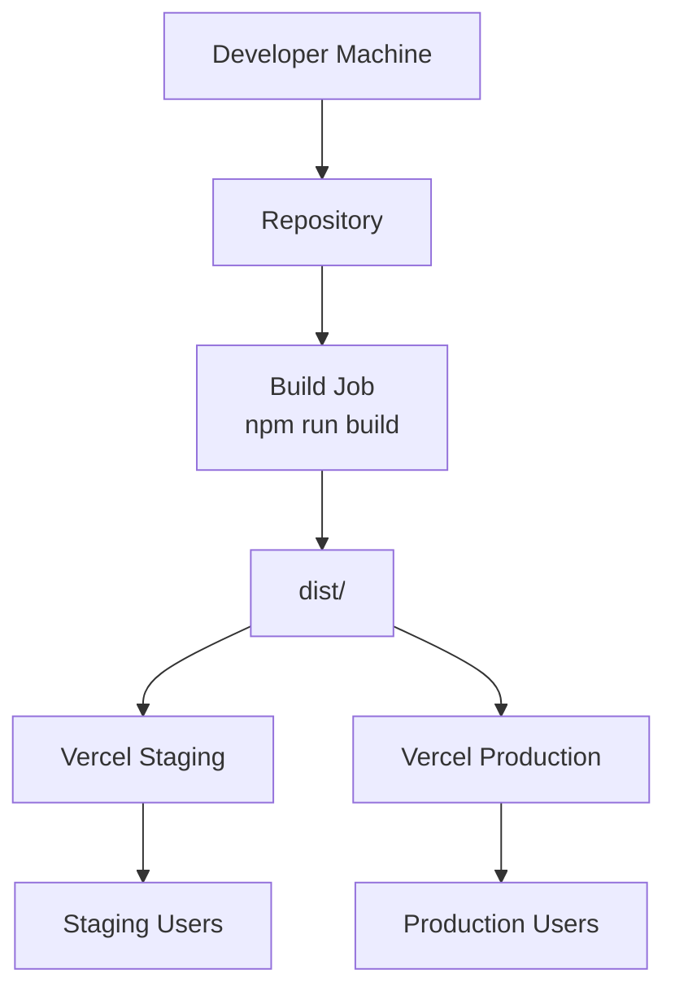
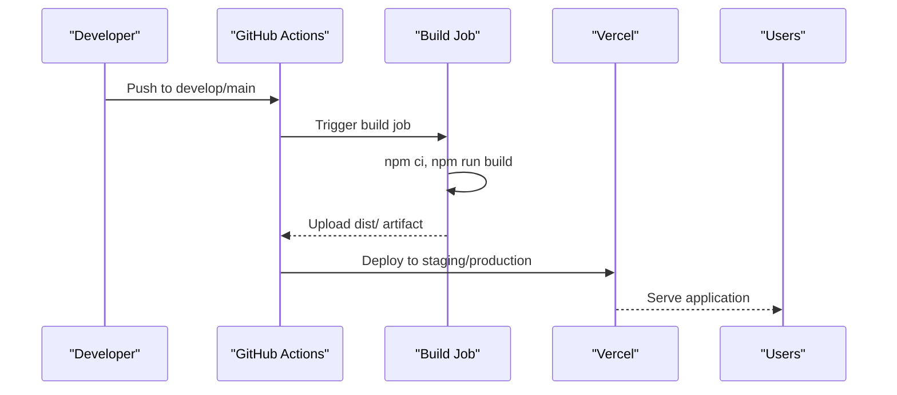

# Vercel Deployment

<cite>
**Referenced Files in This Document**
- [vercel.json](file://vercel.json)
- [package.json](file://package.json)
- [vite.config.ts](file://vite.config.ts)
- [.github/workflows/ci-cd.yml](file://.github/workflows/ci-cd.yml)
- [DEPLOYMENT_SUMMARY.md](file://DEPLOYMENT_SUMMARY.md)
- [DEPLOYMENT.md](file://DEPLOYMENT.md)
- [deploy.mjs](file://deploy.mjs)
- [check-env.mjs](file://check-env.mjs)
</cite>

## Table of Contents
1. [Introduction](#introduction)
2. [Project Structure](#project-structure)
3. [Core Components](#core-components)
4. [Architecture Overview](#architecture-overview)
5. [Detailed Component Analysis](#detailed-component-analysis)
6. [Dependency Analysis](#dependency-analysis)
7. [Performance Considerations](#performance-considerations)
8. [Troubleshooting Guide](#troubleshooting-guide)
9. [Conclusion](#conclusion)

## Introduction
This document provides a comprehensive guide to deploying the Nutrio web application to Vercel. It explains the Vercel configuration, build settings, environment variables, redirects, and custom domains. It also documents the end-to-end deployment workflow from local development to Vercel preview deployments and production releases, including branch-based deployments, preview URL generation, environment variable management, domain configuration, and custom routing rules. Finally, it covers common deployment issues, performance optimization, and monitoring setup for Vercel-hosted applications.

## Project Structure
The repository contains a Vite-based React application with a dedicated Vercel configuration and a CI/CD pipeline that automates builds and deploys to Vercel for staging and production environments.

Key deployment-related files:
- Vercel configuration: [vercel.json](file://vercel.json)
- Build and dev scripts: [package.json](file://package.json)
- Build configuration and base path handling: [vite.config.ts](file://vite.config.ts)
- CI/CD pipeline for Vercel deployments: [.github/workflows/ci-cd.yml](file://.github/workflows/ci-cd.yml)
- Deployment guidance and environment variables: [DEPLOYMENT_SUMMARY.md](file://DEPLOYMENT_SUMMARY.md), [DEPLOYMENT.md](file://DEPLOYMENT.md)
- Local deployment scripts and environment checks: [deploy.mjs](file://deploy.mjs), [check-env.mjs](file://check-env.mjs)

**Section sources**
- [vercel.json:1-38](file://vercel.json#L1-L38)
- [package.json:7-43](file://package.json#L7-L43)
- [vite.config.ts:8-77](file://vite.config.ts#L8-L77)
- [.github/workflows/ci-cd.yml:112-169](file://.github/workflows/ci-cd.yml#L112-L169)

## Core Components
- Vercel configuration: Defines rewrites and security headers for SPA routing and hardening.
- Build configuration: Sets base path for Vercel deployments and optimizes bundles.
- CI/CD pipeline: Builds the application and deploys to Vercel staging and production based on branches.
- Environment management: Scripts validate critical environment variables for production readiness.

**Section sources**
- [vercel.json:1-38](file://vercel.json#L1-L38)
- [vite.config.ts:8-77](file://vite.config.ts#L8-L77)
- [.github/workflows/ci-cd.yml:112-169](file://.github/workflows/ci-cd.yml#L112-L169)
- [check-env.mjs:1-52](file://check-env.mjs#L1-L52)

## Architecture Overview
The deployment architecture integrates local development, automated CI/CD, and Vercel-hosted environments. The pipeline builds the application, uploads artifacts, and deploys to Vercel staging or production depending on the target branch.

**Diagram sources**
- [.github/workflows/ci-cd.yml:76-110](file://.github/workflows/ci-cd.yml#L76-L110)
- [.github/workflows/ci-cd.yml:114-169](file://.github/workflows/ci-cd.yml#L114-L169)

**Section sources**
- [.github/workflows/ci-cd.yml:1-197](file://.github/workflows/ci-cd.yml#L1-L197)

## Detailed Component Analysis

### Vercel Configuration (vercel.json)
The Vercel configuration defines:
- Rewrites: Routes all unmatched paths to the SPA entry to enable client-side routing.
- Headers: Adds security headers and asset caching for performance.

Key behaviors:
- Single-page application rewrite to index.html for deep links.
- Security headers: X-Content-Type-Options, X-Frame-Options, X-XSS-Protection.
- Asset caching: Long-lived cache-control for immutable assets under /assets/.

**Section sources**
- [vercel.json:1-38](file://vercel.json#L1-L38)

### Build and Base Path Configuration (vite.config.ts)
The Vite configuration controls:
- Base path: Uses absolute base for Vercel deployments; relative base for production Capacitor builds; otherwise defaults to "/".
- Plugins: React plugin, component tagger in development, Sentry plugin in production.
- Build optimizations: Sourcemaps enabled, Terser minification, chunk splitting for vendor and UI libraries.

These settings ensure proper asset resolution and performance when hosted on Vercel.

**Section sources**
- [vite.config.ts:8-77](file://vite.config.ts#L8-L77)

### CI/CD Pipeline for Vercel Deployments (.github/workflows/ci-cd.yml)
The pipeline:
- Runs quality checks, unit tests, and builds the application.
- Uploads the production build as an artifact.
- Deploys to Vercel staging when pushing to develop.
- Deploys to Vercel production when pushing to main.
- Exposes environment variables during build for Supabase and monitoring.

Environment variables injected during build:
- VITE_SUPABASE_URL
- VITE_SUPABASE_PUBLISHABLE_KEY
- VITE_SENTRY_DSN
- VITE_POSTHOG_KEY
- VITE_APP_VERSION

**Section sources**
- [.github/workflows/ci-cd.yml:112-169](file://.github/workflows/ci-cd.yml#L112-L169)
- [.github/workflows/ci-cd.yml:96-101](file://.github/workflows/ci-cd.yml#L96-L101)

### Environment Variable Management
Two complementary approaches are used:
- Local validation: [check-env.mjs](file://check-env.mjs) verifies critical environment variables before deployment.
- CI/CD injection: [ci-cd.yml](file://.github/workflows/ci-cd.yml) injects secrets as environment variables during the build job.

Critical variables for production:
- RESEND_API_KEY
- VITE_SENTRY_DSN
- VITE_POSTHOG_KEY
- SENTRY_ORG
- SENTRY_PROJECT
- SENTRY_AUTH_TOKEN

**Section sources**
- [check-env.mjs:1-52](file://check-env.mjs#L1-L52)
- [.github/workflows/ci-cd.yml:96-101](file://.github/workflows/ci-cd.yml#L96-L101)

### Local Deployment Scripts
- [deploy.mjs](file://deploy.mjs): Validates environment variables, runs tests, builds the application, and prints next steps for Supabase and Vercel deployment.
- [DEPLOYMENT_SUMMARY.md](file://DEPLOYMENT_SUMMARY.md) and [DEPLOYMENT.md](file://DEPLOYMENT.md): Provide environment variable requirements and deployment steps for production.

**Section sources**
- [deploy.mjs:1-91](file://deploy.mjs#L1-L91)
- [DEPLOYMENT_SUMMARY.md:36-54](file://DEPLOYMENT_SUMMARY.md#L36-L54)
- [DEPLOYMENT.md:69-78](file://DEPLOYMENT.md#L69-L78)

## Dependency Analysis
The deployment pipeline depends on:
- Build toolchain: Vite and npm scripts.
- CI/CD platform: GitHub Actions.
- Hosting platform: Vercel.
- Secrets management: GitHub Actions secrets for Vercel tokens and environment variables.

**Diagram sources**
- [.github/workflows/ci-cd.yml:76-110](file://.github/workflows/ci-cd.yml#L76-L110)
- [.github/workflows/ci-cd.yml:114-169](file://.github/workflows/ci-cd.yml#L114-L169)

**Section sources**
- [.github/workflows/ci-cd.yml:1-197](file://.github/workflows/ci-cd.yml#L1-L197)

## Performance Considerations
- Asset caching: Vercel serves static assets with appropriate cache headers defined in [vercel.json](file://vercel.json).
- Bundle optimization: Vite chunk splitting and Terser minification improve load performance as configured in [vite.config.ts](file://vite.config.ts).
- Base path correctness: Proper base path ensures assets resolve correctly on Vercel, preventing broken resource loads.

[No sources needed since this section provides general guidance]

## Troubleshooting Guide
Common issues and resolutions:
- Missing environment variables: Use [check-env.mjs](file://check-env.mjs) to validate critical variables before deploying.
- Build failures: Ensure dependencies are installed and tests pass locally before CI runs.
- Vercel deployment errors: Confirm that the build artifact (dist/) is uploaded and that Vercel secrets are configured in GitHub Actions.
- SPA routing issues: Verify rewrites in [vercel.json](file://vercel.json) are present to route unmatched paths to index.html.

**Section sources**
- [check-env.mjs:1-52](file://check-env.mjs#L1-L52)
- [.github/workflows/ci-cd.yml:112-169](file://.github/workflows/ci-cd.yml#L112-L169)
- [vercel.json:1-38](file://vercel.json#L1-L38)

## Conclusion
Nutrio’s deployment to Vercel is streamlined through a robust CI/CD pipeline that builds the application, validates environment variables, and deploys to staging or production based on branch targets. The Vercel configuration ensures SPA routing and strong security headers, while Vite’s build settings optimize performance. By following the documented workflow and troubleshooting steps, teams can reliably deploy and monitor the application across environments.