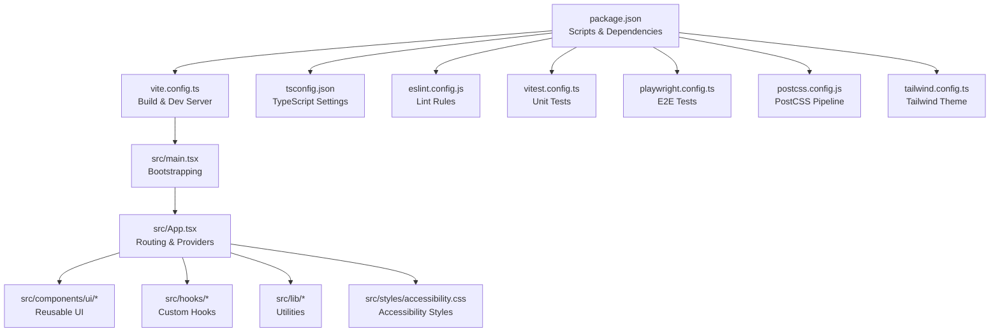
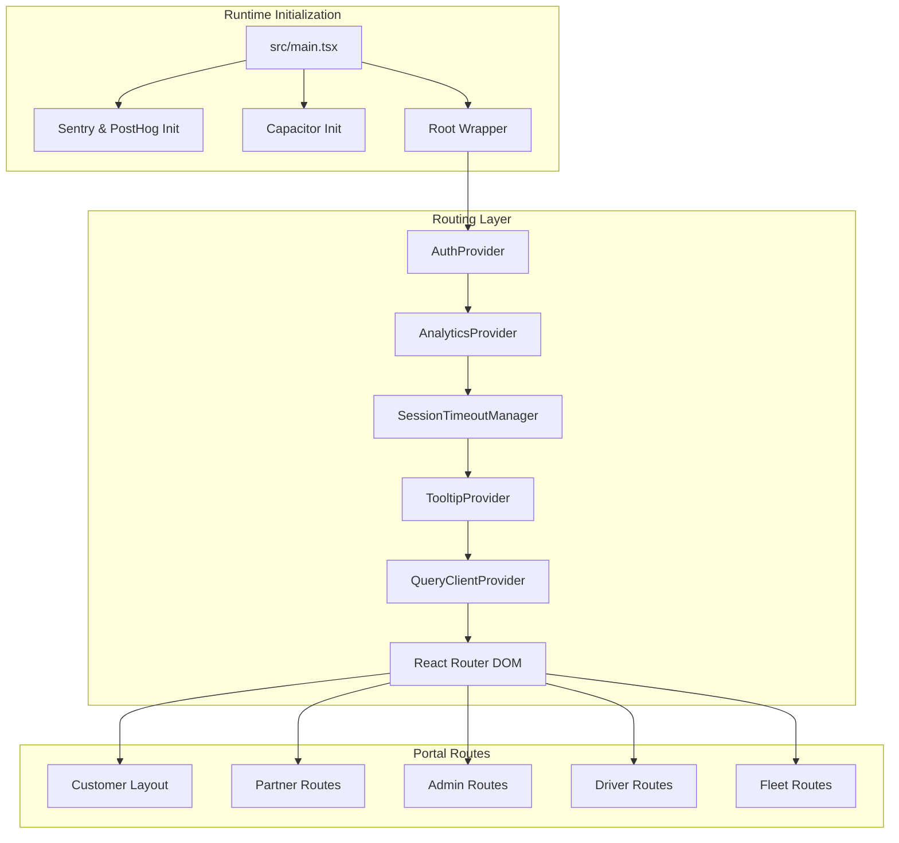
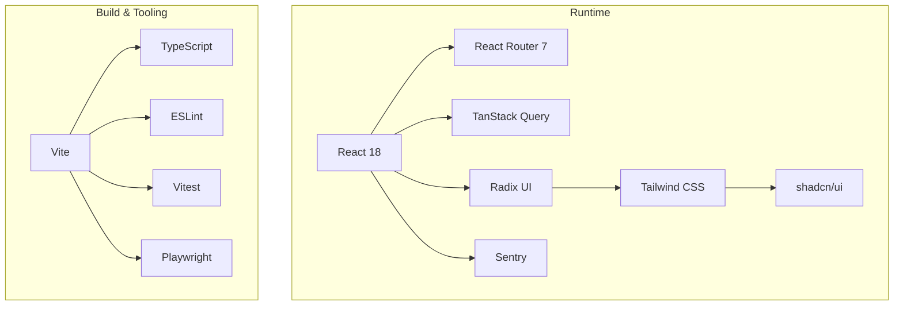

# Development Guidelines

<cite>
**Referenced Files in This Document**
- [package.json](file://package.json)
- [eslint.config.js](file://eslint.config.js)
- [tailwind.config.ts](file://tailwind.config.ts)
- [vite.config.ts](file://vite.config.ts)
- [tsconfig.json](file://tsconfig.json)
- [vitest.config.ts](file://vitest.config.ts)
- [playwright.config.ts](file://playwright.config.ts)
- [postcss.config.js](file://postcss.config.js)
- [src/App.tsx](file://src/App.tsx)
- [src/main.tsx](file://src/main.tsx)
- [src/components/ui/Button.tsx](file://src/components/ui/Button.tsx)
- [src/hooks/use-toast.ts](file://src/hooks/use-toast.ts)
- [src/lib/utils.ts](file://src/lib/utils.ts)
- [src/styles/accessibility.css](file://src/styles/accessibility.css)
- [components.json](file://components.json)
</cite>

## Table of Contents
1. [Introduction](#introduction)
2. [Project Structure](#project-structure)
3. [Core Components](#core-components)
4. [Architecture Overview](#architecture-overview)
5. [Detailed Component Analysis](#detailed-component-analysis)
6. [Dependency Analysis](#dependency-analysis)
7. [Performance Considerations](#performance-considerations)
8. [Troubleshooting Guide](#troubleshooting-guide)
9. [Conclusion](#conclusion)
10. [Appendices](#appendices)

## Introduction
This document defines the development guidelines for the Nutrio platform, covering TypeScript configuration, ESLint rules, code formatting standards, component development patterns, styling with Tailwind CSS, accessibility requirements, performance optimization, testing, code review processes, and contribution workflows. It consolidates repository-provided configurations and patterns to ensure consistent, maintainable, and accessible development across web, Android, and iOS platforms via Capacitor.

## Project Structure
The project is a React + TypeScript application built with Vite, styled with Tailwind CSS, and tested with Vitest and Playwright. Key runtime and build-time configurations are centralized in dedicated config files. The application bootstraps in main.tsx, wires providers and routing in App.tsx, and organizes UI components under src/components and shared logic under src/hooks and src/lib.

**Diagram sources**
- [package.json:1-159](file://package.json#L1-L159)
- [vite.config.ts:1-77](file://vite.config.ts#L1-L77)
- [tsconfig.json:1-21](file://tsconfig.json#L1-L21)
- [eslint.config.js:1-34](file://eslint.config.js#L1-L34)
- [vitest.config.ts:1-28](file://vitest.config.ts#L1-L28)
- [playwright.config.ts:1-92](file://playwright.config.ts#L1-L92)
- [postcss.config.js:1-7](file://postcss.config.js#L1-L7)
- [tailwind.config.ts:1-128](file://tailwind.config.ts#L1-L128)
- [src/main.tsx:1-50](file://src/main.tsx#L1-L50)
- [src/App.tsx:1-739](file://src/App.tsx#L1-L739)

**Section sources**
- [package.json:1-159](file://package.json#L1-L159)
- [vite.config.ts:1-77](file://vite.config.ts#L1-L77)
- [tsconfig.json:1-21](file://tsconfig.json#L1-L21)
- [eslint.config.js:1-34](file://eslint.config.js#L1-L34)
- [vitest.config.ts:1-28](file://vitest.config.ts#L1-L28)
- [playwright.config.ts:1-92](file://playwright.config.ts#L1-L92)
- [postcss.config.js:1-7](file://postcss.config.js#L1-L7)
- [tailwind.config.ts:1-128](file://tailwind.config.ts#L1-L128)
- [src/main.tsx:1-50](file://src/main.tsx#L1-L50)
- [src/App.tsx:1-739](file://src/App.tsx#L1-L739)

## Core Components
- TypeScript configuration enforces strictness and consistent path mapping.
- ESLint configuration enables TypeScript-aware linting with React Hooks and React Refresh rules.
- Tailwind CSS provides a design system with theme tokens, animations, and shadcn/slots integration.
- Vite config optimizes for modern browsers, includes Sentry source maps in production, and splits vendor bundles.
- Vitest config sets up jsdom, global setup, and coverage reporting.
- Playwright config defines E2E test execution, reporters, and device projects.

**Section sources**
- [tsconfig.json:1-21](file://tsconfig.json#L1-L21)
- [eslint.config.js:1-34](file://eslint.config.js#L1-L34)
- [tailwind.config.ts:1-128](file://tailwind.config.ts#L1-L128)
- [vite.config.ts:1-77](file://vite.config.ts#L1-L77)
- [vitest.config.ts:1-28](file://vitest.config.ts#L1-L28)
- [playwright.config.ts:1-92](file://playwright.config.ts#L1-L92)

## Architecture Overview
The application initializes providers for authentication, analytics, and UI feedback, then renders a large routing tree organized by portal roles. Routing leverages lazy-loaded pages for performance, protected routes for role gating, and layout wrappers for consistent branding.

**Diagram sources**
- [src/main.tsx:1-50](file://src/main.tsx#L1-L50)
- [src/App.tsx:1-739](file://src/App.tsx#L1-L739)

**Section sources**
- [src/main.tsx:1-50](file://src/main.tsx#L1-L50)
- [src/App.tsx:1-739](file://src/App.tsx#L1-L739)

## Detailed Component Analysis

### TypeScript Configuration Standards
- Strict compiler options enforce type safety and reduce runtime errors.
- Path aliases simplify imports and improve readability.
- References to app and node configs keep settings modular.

Best practices:
- Keep strict mode enabled; avoid disabling strict checks unless absolutely necessary.
- Use path aliases consistently (@/*) to avoid deep relative imports.
- Add new tsconfig references for feature-specific tsconfigs if needed.

**Section sources**
- [tsconfig.json:1-21](file://tsconfig.json#L1-L21)

### ESLint and Code Formatting Standards
- Uses TypeScript ESLint recommended rules with React Hooks and React Refresh plugins.
- Disables unused variable lint for flexibility; adjust per team preference.
- Ignores dist; excludes e2e fixtures from React Hooks rules.

Formatting:
- Use Prettier-compatible defaults enforced by editor integrations.
- Keep import order consistent; group external libraries, parent imports, sibling imports, and internal modules.

**Section sources**
- [eslint.config.js:1-34](file://eslint.config.js#L1-L34)

### Tailwind CSS Styling Approach
- Centralized theme tokens, shadows, radii, and animations.
- CSS variables for dark mode and semantic colors.
- Integration with shadcn/ui via components.json; use slots and variants for consistent UI.

Patterns:
- Prefer component-level variants (as in Button) over ad-hoc classes.
- Use cn() to merge conditional classes safely.
- Leverage Tailwind utilities sparingly; favor theme tokens for consistency.

**Section sources**
- [tailwind.config.ts:1-128](file://tailwind.config.ts#L1-L128)
- [components.json:1-21](file://components.json#L1-L21)
- [src/lib/utils.ts:1-7](file://src/lib/utils.ts#L1-L7)
- [src/components/ui/Button.tsx:1-63](file://src/components/ui/Button.tsx#L1-L63)

### Component Development Patterns
- Reusable UI components use class-variance-authority (cva) for variants and sizes.
- Consistent props interface mixing HTML attributes and variant props.
- Forward refs for accessibility and imperative control.

Guidelines:
- Export both component and variant type for discoverability.
- Use asChild pattern with Radix Slot for composition.
- Keep presentational components pure; delegate state to hooks or contexts.

**Section sources**
- [src/components/ui/Button.tsx:1-63](file://src/components/ui/Button.tsx#L1-L63)

### Toast and Notification Pattern
- use-toast wraps Sonner for unified, backward-compatible API.
- Provides success, error, info, warning, loading, and promise variants.

Guidelines:
- Use useToast() for consistent UX; avoid direct DOM manipulation.
- Keep messages concise; leverage action callbacks for user-driven retries.

**Section sources**
- [src/hooks/use-toast.ts:1-83](file://src/hooks/use-toast.ts#L1-L83)

### Accessibility Requirements
- Focus visibility, skip links, reduced motion, high contrast, and ARIA states are addressed via CSS.
- Ensures WCAG 2.1 AA touch target sizes and color contrast adjustments.
- Modal dialogs prevent background scrolling; form labels and error states are explicit.

Implementation tips:
- Add aria-* attributes where semantics differ from native elements.
- Provide skip navigation for keyboard-only users.
- Respect prefers-reduced-motion and prefers-contrast user preferences.

**Section sources**
- [src/styles/accessibility.css:1-253](file://src/styles/accessibility.css#L1-L253)

### Testing Requirements
- Unit tests: Vitest with jsdom, global setup, and coverage reporting.
- E2E tests: Playwright with HTML/json reporters, traces, screenshots, and videos.
- Environment mocking and observer mocks standardized in setup.

Coverage:
- Exclude node_modules, test setup, d.ts, config files, and mock data from coverage.
- Aim for high coverage across components, hooks, and utilities.

**Section sources**
- [vitest.config.ts:1-28](file://vitest.config.ts#L1-L28)
- [playwright.config.ts:1-92](file://playwright.config.ts#L1-L92)
- [src/test/setup.ts:1-70](file://src/test/setup.ts#L1-L70)

### Build and Deployment Configuration
- Vite targets modern browsers, enables sourcemaps, and splits vendor bundles.
- Sentry plugin uploads source maps in production using environment variables.
- Base path adapts for Vercel vs. Capacitor builds.

Optimization:
- Keep minification enabled; drop console logs in production.
- Monitor chunk sizes and adjust manualChunks as features grow.

**Section sources**
- [vite.config.ts:1-77](file://vite.config.ts#L1-L77)

### Mobile and Native Considerations
- Capacitor integration initialized in main.tsx; splash video shown only on native.
- Routing and scroll behavior adapted for Capacitor WebView stability.

Guidelines:
- Test on real devices; validate navigation and scroll restoration.
- Use Capacitor plugins intentionally; avoid unnecessary native dependencies.

**Section sources**
- [src/main.tsx:1-50](file://src/main.tsx#L1-L50)

## Dependency Analysis
The project relies on React 18, React Router 7, TanStack Query for data fetching, Radix UI primitives, Tailwind CSS with shadcn/ui, and Sentry for observability. Build-time dependencies include Vite, TypeScript, ESLint, Vitest, and Playwright.

**Diagram sources**
- [package.json:44-157](file://package.json#L44-L157)
- [vite.config.ts:1-77](file://vite.config.ts#L1-L77)
- [eslint.config.js:1-34](file://eslint.config.js#L1-L34)
- [vitest.config.ts:1-28](file://vitest.config.ts#L1-L28)
- [playwright.config.ts:1-92](file://playwright.config.ts#L1-L92)

**Section sources**
- [package.json:44-157](file://package.json#L44-L157)

## Performance Considerations
- Lazy-load feature areas to reduce initial bundle size.
- Split vendor bundles for React, UI primitives, and charts.
- Enable modern browser target and minification; drop console logs in production.
- Use efficient CSS variables and animations; respect reduced motion preferences.
- Avoid heavy synchronous work on the main thread; leverage React Suspense and lazy boundaries.

[No sources needed since this section provides general guidance]

## Troubleshooting Guide
Common issues and resolutions:
- ESLint errors: Review TypeScript and React Hooks rules; adjust unused vars policy if needed.
- Tailwind utilities not applying: Verify content globs and PostCSS pipeline; ensure components.json aliases match imports.
- Vite HMR instability: Confirm devTarget and overlay settings; avoid deep relative imports in aliases.
- Vitest failures: Ensure setup mocks cover environment variables and global APIs; suppress expected warnings selectively.
- Playwright flakiness: Increase timeouts for CI; use retries judiciously; inspect traces and videos.

**Section sources**
- [eslint.config.js:1-34](file://eslint.config.js#L1-L34)
- [tailwind.config.ts:1-128](file://tailwind.config.ts#L1-L128)
- [postcss.config.js:1-7](file://postcss.config.js#L1-L7)
- [vite.config.ts:1-77](file://vite.config.ts#L1-L77)
- [vitest.config.ts:1-28](file://vitest.config.ts#L1-L28)
- [playwright.config.ts:1-92](file://playwright.config.ts#L1-L92)

## Conclusion
These guidelines consolidate the repository’s established patterns for TypeScript, linting, styling, testing, and performance. By adhering to them, contributors can maintain a consistent, accessible, and scalable codebase across web and native platforms.

[No sources needed since this section summarizes without analyzing specific files]

## Appendices

### Development Workflow and Branch Management
- Feature branches: Prefix with feature/, fix/, chore/, refactor/.
- Commit messages: Use imperative mood; reference issue numbers when applicable.
- PR checklist: Include summary, rationale, testing notes, and screenshots for UI changes.
- Code review: Require at least one reviewer; address comments promptly; run typecheck, lint, and tests locally before pushing updates.

[No sources needed since this section provides general guidance]

### Release Procedures
- Tagging: Use semantic versioning; bump patch/minor/major appropriately.
- CI/CD: Automated checks on pull requests; release builds on main branch.
- Post-release: Verify Sentry source maps upload; update changelog and notify stakeholders.

[No sources needed since this section provides general guidance]