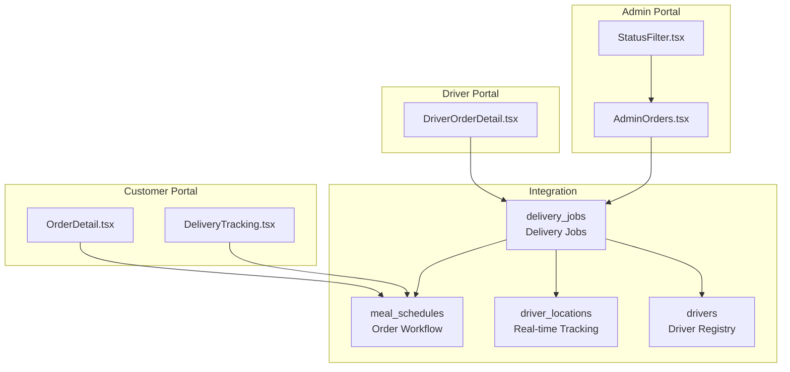
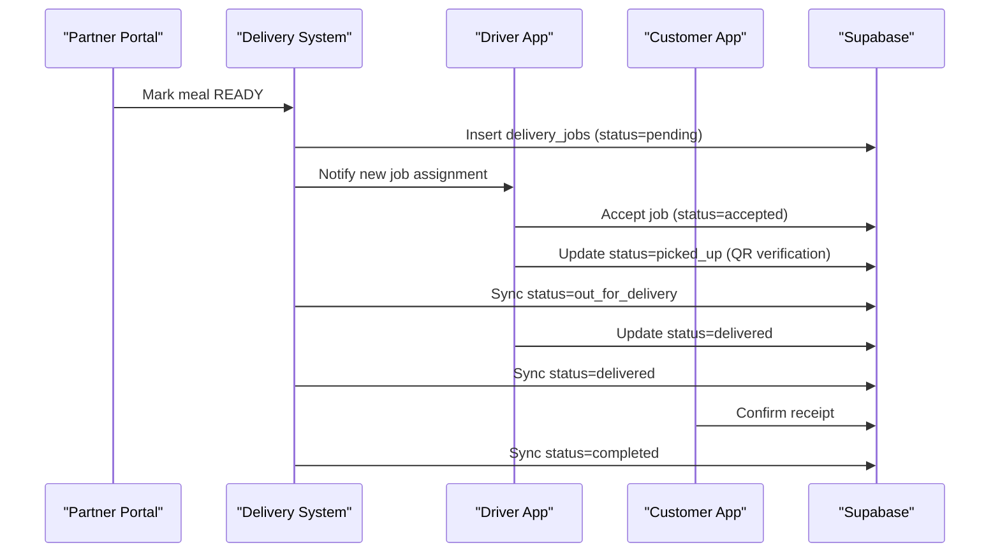
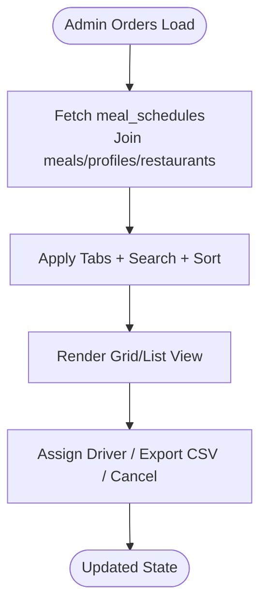
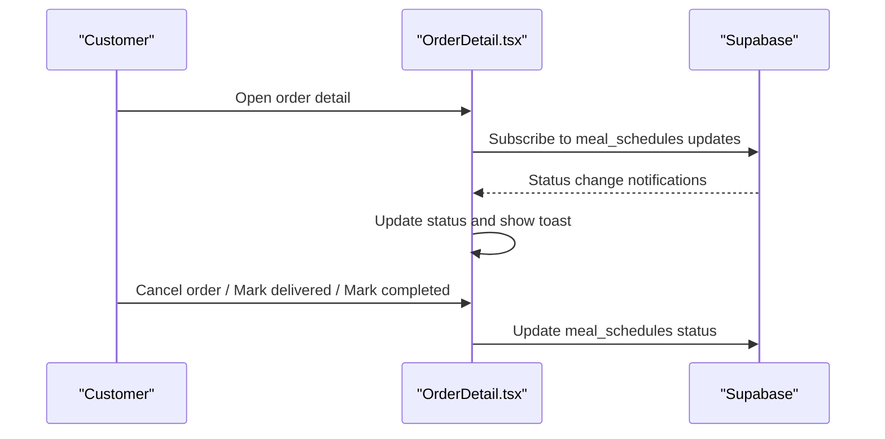
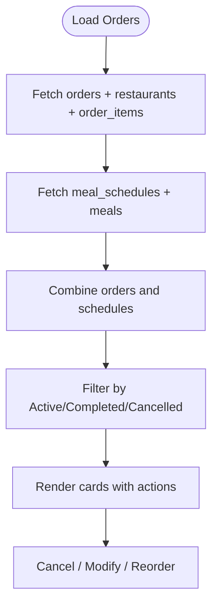
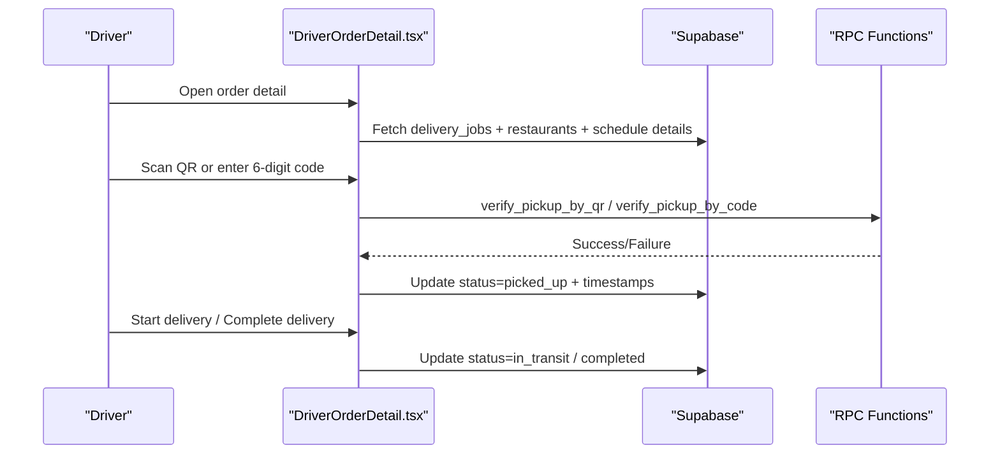
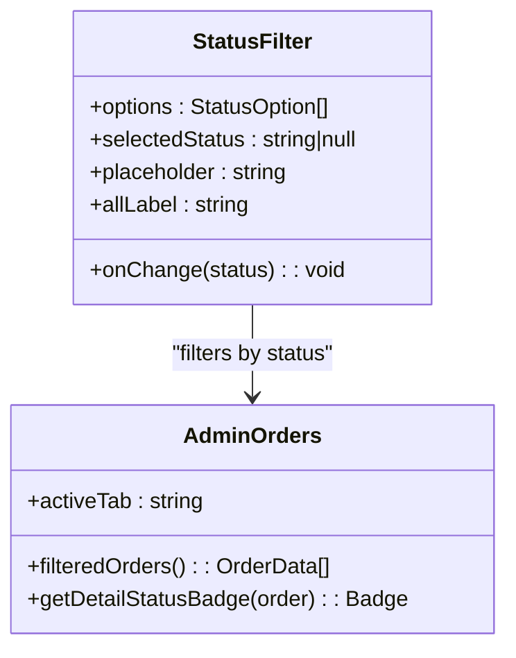
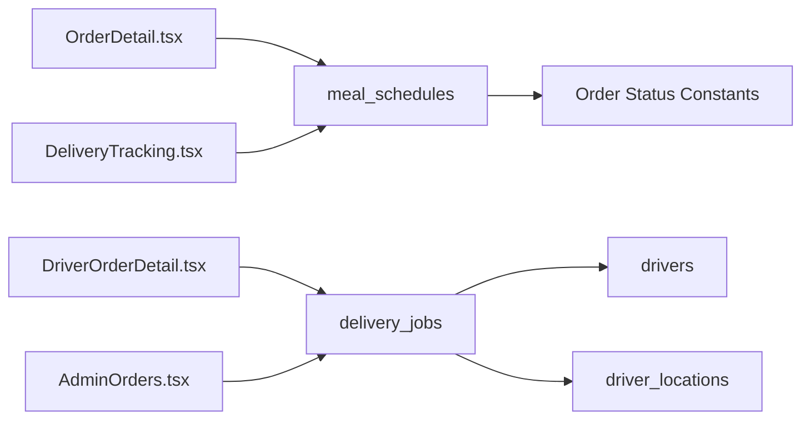

# Delivery Management System

<cite>
**Referenced Files in This Document**
- [delivery_system_design.md](file://delivery_system_design.md)
- [delivery_system_plan_simplified.md](file://delivery_system_plan_simplified.md)
- [delivery_integration_plan.md](file://delivery_integration_plan.md)
- [delivery_analysis.md](file://delivery_analysis.md)
- [HANDOVER_WORKFLOW_IMPLEMENTATION.md](file://HANDOVER_WORKFLOW_IMPLEMENTATION.md)
- [docs/implementation-plan-customer-portal.md](file://docs/implementation-plan-customer-portal.md)
- [src/pages/admin/AdminOrders.tsx](file://src/pages/admin/AdminOrders.tsx)
- [src/pages/OrderDetail.tsx](file://src/pages/OrderDetail.tsx)
- [src/pages/DeliveryTracking.tsx](file://src/pages/DeliveryTracking.tsx)
- [src/pages/driver/DriverOrderDetail.tsx](file://src/pages/driver/DriverOrderDetail.tsx)
- [src/fleet/components/common/StatusFilter.tsx](file://src/fleet/components/common/StatusFilter.tsx)
</cite>

## Table of Contents
1. [Introduction](#introduction)
2. [Project Structure](#project-structure)
3. [Core Components](#core-components)
4. [Architecture Overview](#architecture-overview)
5. [Detailed Component Analysis](#detailed-component-analysis)
6. [Dependency Analysis](#dependency-analysis)
7. [Performance Considerations](#performance-considerations)
8. [Troubleshooting Guide](#troubleshooting-guide)
9. [Conclusion](#conclusion)

## Introduction
This document describes the delivery management system for Nutrio Fuel, focusing on order assignment, tracking, and completion workflows. It documents the order listing interface, filtering options, and status management, along with the order detail view, real-time tracking, delivery workflow from pickup to drop-off, location sharing, ETA calculations, signature capture, order modification requests, cancellation procedures, and delivery confirmation processes.

## Project Structure
The delivery system spans multiple portals and integrates with existing order workflows:
- Customer portal: order listing, detail view, real-time tracking, cancellation, and confirmation
- Driver portal: order assignment, pickup verification, navigation, delivery completion
- Admin portal: delivery monitoring, driver management, and operational controls
- Integration with existing order workflow (meal_schedules) and new delivery_jobs table

**Diagram sources**
- [src/pages/OrderDetail.tsx:146-777](file://src/pages/OrderDetail.tsx#L146-L777)
- [src/pages/DeliveryTracking.tsx:113-592](file://src/pages/DeliveryTracking.tsx#L113-L592)
- [src/pages/driver/DriverOrderDetail.tsx:57-577](file://src/pages/driver/DriverOrderDetail.tsx#L57-L577)
- [src/pages/admin/AdminOrders.tsx:329-800](file://src/pages/admin/AdminOrders.tsx#L329-L800)
- [src/fleet/components/common/StatusFilter.tsx:1-50](file://src/fleet/components/common/StatusFilter.tsx#L1-L50)

**Section sources**
- [delivery_system_design.md:1-510](file://delivery_system_design.md#L1-L510)
- [delivery_integration_plan.md:1-393](file://delivery_integration_plan.md#L1-L393)

## Core Components
- Order listing and filtering (AdminOrders): displays orders with tabs (All, Today, Upcoming, Completed, Overdue), sorting, search, CSV export, and bulk actions
- Order detail (Customer): shows status timeline, restaurant/contact info, delivery info, cancellation, and confirmation actions
- Delivery tracking (Customer): unified order list with active/completed/cancelled tabs, pull-to-refresh, and real-time updates
- Driver order detail: pickup verification (QR/code), navigation, delivery notes, and status updates
- Status filters: reusable component for filtering by status in admin views

**Section sources**
- [src/pages/admin/AdminOrders.tsx:329-800](file://src/pages/admin/AdminOrders.tsx#L329-L800)
- [src/pages/OrderDetail.tsx:146-777](file://src/pages/OrderDetail.tsx#L146-L777)
- [src/pages/DeliveryTracking.tsx:113-592](file://src/pages/DeliveryTracking.tsx#L113-L592)
- [src/pages/driver/DriverOrderDetail.tsx:57-577](file://src/pages/driver/DriverOrderDetail.tsx#L57-L577)
- [src/fleet/components/common/StatusFilter.tsx:1-50](file://src/fleet/components/common/StatusFilter.tsx#L1-L50)

## Architecture Overview
The system extends the existing order workflow by introducing delivery_jobs and integrating real-time tracking and driver management.

**Diagram sources**
- [delivery_integration_plan.md:19-62](file://delivery_integration_plan.md#L19-L62)
- [delivery_analysis.md:568-670](file://delivery_analysis.md#L568-L670)

## Detailed Component Analysis

### Order Listing Interface (Admin)
The AdminOrders page provides:
- Tabs for filtering: All, Today, Upcoming, Completed, Overdue
- Sorting by creation date, scheduled date, or meal name
- Search by restaurant, customer, or meal name
- CSV export with platform fee breakdown
- Bulk selection and actions
- Status badges with color-coded labels

**Diagram sources**
- [src/pages/admin/AdminOrders.tsx:329-800](file://src/pages/admin/AdminOrders.tsx#L329-L800)

**Section sources**
- [src/pages/admin/AdminOrders.tsx:329-800](file://src/pages/admin/AdminOrders.tsx#L329-L800)

### Order Detail View (Customer)
The OrderDetail page presents:
- Status timeline with icons and labels
- Estimated arrival time based on current status
- Restaurant and contact information
- Delivery information (scheduled date, delivery type, total)
- Action buttons: cancel order (pending/confirmed), mark delivered (out_for_delivery), mark completed (delivered)
- Real-time updates via Supabase channels

**Diagram sources**
- [src/pages/OrderDetail.tsx:146-777](file://src/pages/OrderDetail.tsx#L146-L777)

**Section sources**
- [src/pages/OrderDetail.tsx:146-777](file://src/pages/OrderDetail.tsx#L146-L777)

### Delivery Tracking (Customer)
The DeliveryTracking page offers:
- Unified view combining placed orders and scheduled meals
- Tabbed interface: All, Active, Completed, Cancelled
- Pull-to-refresh and infinite scroll loading
- Action buttons: modify (for scheduled), cancel (for pending/confirmed), reorder (for completed)
- Real-time status updates via Supabase

**Diagram sources**
- [src/pages/DeliveryTracking.tsx:113-592](file://src/pages/DeliveryTracking.tsx#L113-L592)

**Section sources**
- [src/pages/DeliveryTracking.tsx:113-592](file://src/pages/DeliveryTracking.tsx#L113-L592)

### Driver Order Detail and Handover
The DriverOrderDetail page manages:
- Driver identification and job retrieval
- Pickup verification via QR code or 6-digit code
- Navigation to pickup and delivery locations
- Delivery notes and status updates
- Completion flow and earnings display

**Diagram sources**
- [src/pages/driver/DriverOrderDetail.tsx:57-577](file://src/pages/driver/DriverOrderDetail.tsx#L57-L577)
- [HANDOVER_WORKFLOW_IMPLEMENTATION.md:1-40](file://HANDOVER_WORKFLOW_IMPLEMENTATION.md#L1-L40)

**Section sources**
- [src/pages/driver/DriverOrderDetail.tsx:57-577](file://src/pages/driver/DriverOrderDetail.tsx#L57-L577)
- [HANDOVER_WORKFLOW_IMPLEMENTATION.md:1-40](file://HANDOVER_WORKFLOW_IMPLEMENTATION.md#L1-L40)

### Status Management and Filtering
Reusable status filtering component enables filtering by status across admin views, complementing the AdminOrders tabs.

**Diagram sources**
- [src/fleet/components/common/StatusFilter.tsx:1-50](file://src/fleet/components/common/StatusFilter.tsx#L1-L50)
- [src/pages/admin/AdminOrders.tsx:329-800](file://src/pages/admin/AdminOrders.tsx#L329-L800)

**Section sources**
- [src/fleet/components/common/StatusFilter.tsx:1-50](file://src/fleet/components/common/StatusFilter.tsx#L1-L50)
- [src/pages/admin/AdminOrders.tsx:329-800](file://src/pages/admin/AdminOrders.tsx#L329-L800)

## Dependency Analysis
The system depends on:
- Supabase for real-time subscriptions, data persistence, and RPC functions
- Shared order status constants and configuration for consistent UI and UX
- Driver and delivery job tables for operational state management

**Diagram sources**
- [src/pages/OrderDetail.tsx:146-777](file://src/pages/OrderDetail.tsx#L146-L777)
- [src/pages/DeliveryTracking.tsx:113-592](file://src/pages/DeliveryTracking.tsx#L113-L592)
- [src/pages/driver/DriverOrderDetail.tsx:57-577](file://src/pages/driver/DriverOrderDetail.tsx#L57-L577)
- [src/pages/admin/AdminOrders.tsx:329-800](file://src/pages/admin/AdminOrders.tsx#L329-L800)
- [docs/implementation-plan-customer-portal.md:540-656](file://docs/implementation-plan-customer-portal.md#L540-L656)

**Section sources**
- [docs/implementation-plan-customer-portal.md:540-656](file://docs/implementation-plan-customer-portal.md#L540-L656)

## Performance Considerations
- Minimize database round-trips by joining related entities (meals, restaurants, profiles) in single queries
- Use pagination and range-based loading for order lists to avoid large payloads
- Leverage Supabase real-time channels for efficient status updates
- Cache frequently accessed data (e.g., driver locations) to reduce latency
- Debounce search and filter operations to prevent excessive re-renders

## Troubleshooting Guide
Common issues and resolutions:
- No drivers available: System queues the job and alerts admins; customers may be offered pickup option if delay exceeds threshold
- Driver rejects or times out: System retries assignment to next nearest driver; after multiple failures, escalate to manual assignment
- Driver goes offline mid-delivery: System detects absence of location updates and reassigns job; support can manually intervene
- Delivery fails due to customer not home: Driver attempts contact up to a limit; after failure, system initiates return and applies partial fee
- App crashes or GPS down: Support can manually update status; paper backup with order ID and signature is supported

**Section sources**
- [delivery_analysis.md:674-764](file://delivery_analysis.md#L674-L764)

## Conclusion
The delivery management system integrates seamlessly with the existing order workflow, providing robust order assignment, real-time tracking, and completion processes across customer, driver, and admin portals. The modular design supports scalability and future enhancements such as batch delivery modes, advanced analytics, and multi-zone operations.