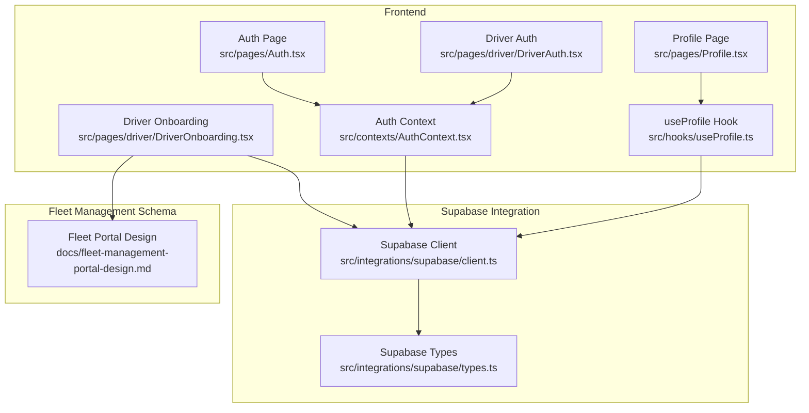
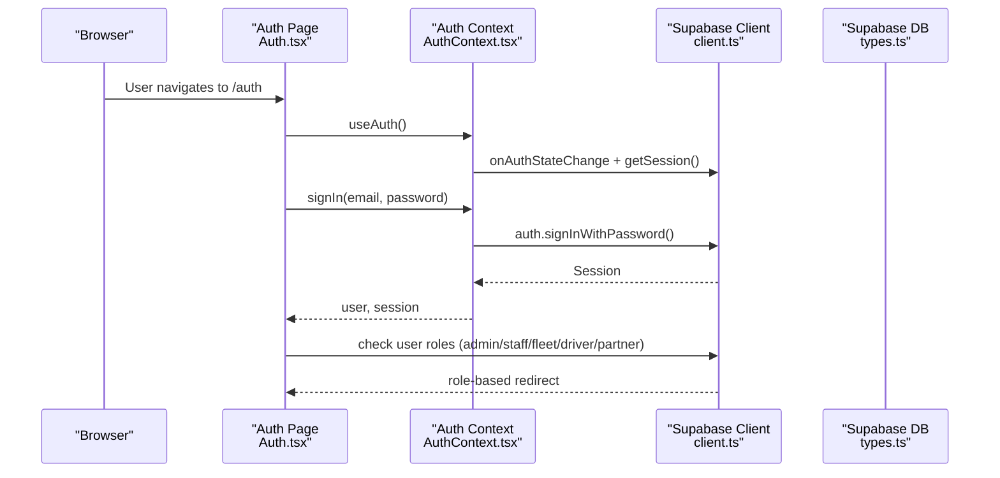
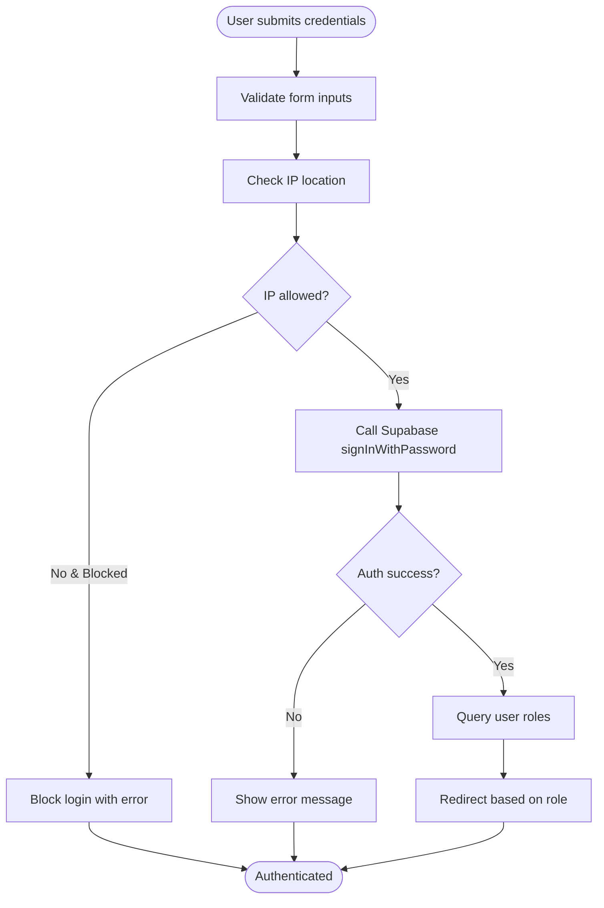
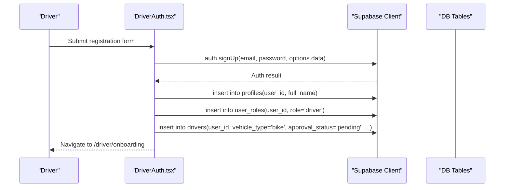
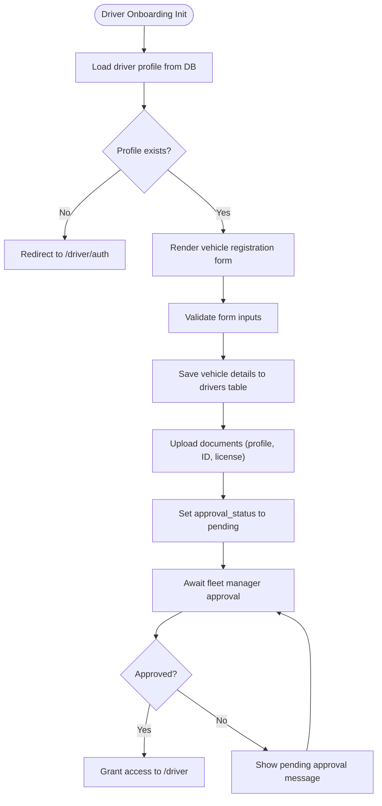
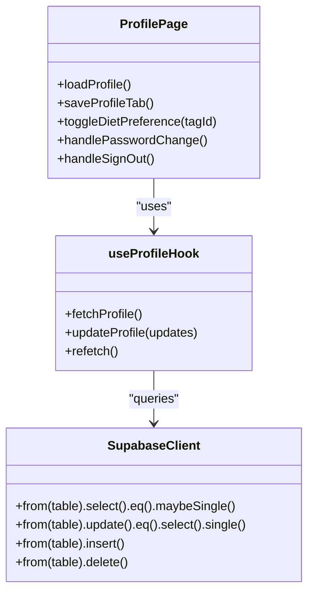
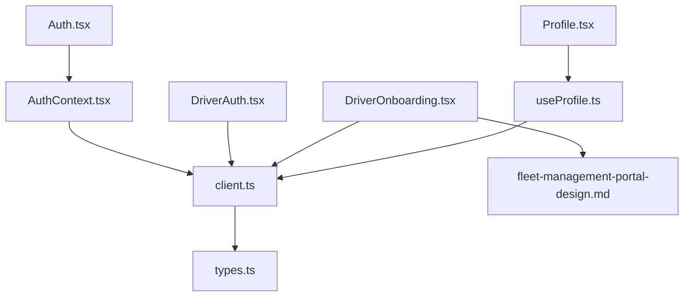

# Driver Authentication & Onboarding

<cite>
**Referenced Files in This Document**
- [Auth.tsx](file://src/pages/Auth.tsx)
- [AuthContext.tsx](file://src/contexts/AuthContext.tsx)
- [client.ts](file://src/integrations/supabase/client.ts)
- [types.ts](file://src/integrations/supabase/types.ts)
- [useProfile.ts](file://src/hooks/useProfile.ts)
- [Profile.tsx](file://src/pages/Profile.tsx)
- [DriverAuth.tsx](file://src/pages/driver/DriverAuth.tsx)
- [DriverOnboarding.tsx](file://src/pages/driver/DriverOnboarding.tsx)
- [fleet-management-portal-design.md](file://docs/fleet-management-portal-design.md)
</cite>

## Table of Contents
1. [Introduction](#introduction)
2. [Project Structure](#project-structure)
3. [Core Components](#core-components)
4. [Architecture Overview](#architecture-overview)
5. [Detailed Component Analysis](#detailed-component-analysis)
6. [Dependency Analysis](#dependency-analysis)
7. [Performance Considerations](#performance-considerations)
8. [Troubleshooting Guide](#troubleshooting-guide)
9. [Conclusion](#conclusion)

## Introduction
This document explains the driver authentication and onboarding system, focusing on the complete driver registration process, background verification, vehicle registration, and training completion. It also covers the authentication flow with Supabase integration, session management, role-based access control, and the onboarding wizard with step-by-step verification processes, document uploads, and approval workflows. Additionally, it details the driver profile management system, security measures, and practical troubleshooting guidance.

## Project Structure
The driver authentication and onboarding system spans several key areas:
- Authentication and session management using Supabase Auth
- Role-based routing and access control
- Driver-specific authentication and onboarding pages
- Profile management and dietary preferences
- Fleet management schema supporting driver verification and vehicle registration

**Diagram sources**
- [Auth.tsx:19-115](file://src/pages/Auth.tsx#L19-L115)
- [AuthContext.tsx:31-61](file://src/contexts/AuthContext.tsx#L31-L61)
- [client.ts:47-57](file://src/integrations/supabase/client.ts#L47-L57)
- [types.ts:9-14](file://src/integrations/supabase/types.ts#L9-L14)
- [DriverAuth.tsx:118-188](file://src/pages/driver/DriverAuth.tsx#L118-L188)
- [DriverOnboarding.tsx:34-79](file://src/pages/driver/DriverOnboarding.tsx#L34-L79)
- [Profile.tsx:245-430](file://src/pages/Profile.tsx#L245-L430)
- [useProfile.ts:33-87](file://src/hooks/useProfile.ts#L33-L87)
- [fleet-management-portal-design.md:233-270](file://docs/fleet-management-portal-design.md#L233-L270)

**Section sources**
- [Auth.tsx:19-115](file://src/pages/Auth.tsx#L19-L115)
- [AuthContext.tsx:31-61](file://src/contexts/AuthContext.tsx#L31-L61)
- [client.ts:47-57](file://src/integrations/supabase/client.ts#L47-L57)
- [types.ts:9-14](file://src/integrations/supabase/types.ts#L9-L14)
- [DriverAuth.tsx:118-188](file://src/pages/driver/DriverAuth.tsx#L118-L188)
- [DriverOnboarding.tsx:34-79](file://src/pages/driver/DriverOnboarding.tsx#L34-L79)
- [Profile.tsx:245-430](file://src/pages/Profile.tsx#L245-L430)
- [useProfile.ts:33-87](file://src/hooks/useProfile.ts#L33-L87)
- [fleet-management-portal-design.md:233-270](file://docs/fleet-management-portal-design.md#L233-L270)

## Core Components
- Authentication Provider: Manages user sessions, sign-in/sign-up, and IP-based restrictions.
- Auth Page: Handles welcome, sign-in, sign-up, OTP verification, and social login flows.
- Driver Authentication Page: Creates driver accounts, assigns roles, and initializes driver profiles.
- Driver Onboarding Wizard: Collects vehicle details, handles document uploads, and manages approval workflows.
- Profile Management: Updates personal information, dietary preferences, and account settings.
- Supabase Client: Provides secure client initialization with native-capable storage and session persistence.

**Section sources**
- [AuthContext.tsx:31-131](file://src/contexts/AuthContext.tsx#L31-L131)
- [Auth.tsx:19-115](file://src/pages/Auth.tsx#L19-L115)
- [DriverAuth.tsx:118-188](file://src/pages/driver/DriverAuth.tsx#L118-L188)
- [DriverOnboarding.tsx:34-79](file://src/pages/driver/DriverOnboarding.tsx#L34-L79)
- [Profile.tsx:245-430](file://src/pages/Profile.tsx#L245-L430)
- [client.ts:47-57](file://src/integrations/supabase/client.ts#L47-L57)

## Architecture Overview
The system integrates frontend React components with Supabase Auth and Database to manage driver lifecycle from registration to onboarding and profile updates.

**Diagram sources**
- [Auth.tsx:80-115](file://src/pages/Auth.tsx#L80-L115)
- [AuthContext.tsx:36-61](file://src/contexts/AuthContext.tsx#L36-L61)
- [client.ts:47-57](file://src/integrations/supabase/client.ts#L47-L57)
- [types.ts:9-14](file://src/integrations/supabase/types.ts#L9-L14)

## Detailed Component Analysis

### Authentication Flow with Supabase Integration
- Session Management: Auth provider subscribes to Supabase auth state changes and persists sessions using Capacitor Preferences on native platforms.
- Role-Based Access Control: After sign-in, the system queries user roles and redirects to appropriate portals (admin, fleet, driver, partner).
- Security Measures: IP location checks during sign-in and explicit blocking for blocked IPs; password updates via Supabase Auth.

**Diagram sources**
- [AuthContext.tsx:87-112](file://src/contexts/AuthContext.tsx#L87-L112)
- [Auth.tsx:169-203](file://src/pages/Auth.tsx#L169-L203)

**Section sources**
- [AuthContext.tsx:36-112](file://src/contexts/AuthContext.tsx#L36-L112)
- [Auth.tsx:169-203](file://src/pages/Auth.tsx#L169-L203)

### Driver Registration and Role Assignment
- Driver account creation triggers Supabase sign-up, inserts a profile record, assigns the driver role, and creates a driver record with initial status and settings.
- Redirects to the driver onboarding wizard upon successful creation.

**Diagram sources**
- [DriverAuth.tsx:123-177](file://src/pages/driver/DriverAuth.tsx#L123-L177)

**Section sources**
- [DriverAuth.tsx:123-177](file://src/pages/driver/DriverAuth.tsx#L123-L177)

### Driver Onboarding Wizard and Approval Workflows
- Vehicle Registration: Captures vehicle type, make, model, plate number, and license number. Some vehicle types require licenses.
- Document Uploads: Supports profile photo, ID document, and license document URLs.
- Approval Status: Tracks approval status and prevents access until approved.
- Compliance Checks: Uses fleet management schema to define document types and verification statuses.

**Diagram sources**
- [DriverOnboarding.tsx:54-79](file://src/pages/driver/DriverOnboarding.tsx#L54-L79)
- [fleet-management-portal-design.md:344-363](file://docs/fleet-management-portal-design.md#L344-L363)

**Section sources**
- [DriverOnboarding.tsx:34-79](file://src/pages/driver/DriverOnboarding.tsx#L34-L79)
- [fleet-management-portal-design.md:233-270](file://docs/fleet-management-portal-design.md#L233-L270)

### Driver Profile Management
- Personal Information: Full name, gender, age, and email are editable via the profile page.
- Dietary Preferences: Integrates with diet tags and user_dietary_preferences to manage preferences and allergies.
- Account Settings: Password change and account deletion actions are handled securely.

**Diagram sources**
- [Profile.tsx:406-475](file://src/pages/Profile.tsx#L406-L475)
- [useProfile.ts:39-80](file://src/hooks/useProfile.ts#L39-L80)
- [client.ts:47-57](file://src/integrations/supabase/client.ts#L47-L57)

**Section sources**
- [Profile.tsx:245-430](file://src/pages/Profile.tsx#L245-L430)
- [useProfile.ts:33-87](file://src/hooks/useProfile.ts#L33-L87)

## Dependency Analysis
The system exhibits clear separation of concerns:
- AuthContext depends on Supabase client for session management.
- Pages depend on AuthContext and Supabase client for authentication and data operations.
- Driver-specific pages integrate with fleet management schema for approvals and document verification.
- Profile management integrates with diet tags and user preferences.

**Diagram sources**
- [AuthContext.tsx:31-61](file://src/contexts/AuthContext.tsx#L31-L61)
- [client.ts:47-57](file://src/integrations/supabase/client.ts#L47-L57)
- [Auth.tsx:19-115](file://src/pages/Auth.tsx#L19-L115)
- [DriverAuth.tsx:118-188](file://src/pages/driver/DriverAuth.tsx#L118-L188)
- [DriverOnboarding.tsx:34-79](file://src/pages/driver/DriverOnboarding.tsx#L34-L79)
- [Profile.tsx:245-430](file://src/pages/Profile.tsx#L245-L430)
- [useProfile.ts:33-87](file://src/hooks/useProfile.ts#L33-L87)
- [types.ts:9-14](file://src/integrations/supabase/types.ts#L9-L14)
- [fleet-management-portal-design.md:233-270](file://docs/fleet-management-portal-design.md#L233-L270)

**Section sources**
- [AuthContext.tsx:31-61](file://src/contexts/AuthContext.tsx#L31-L61)
- [client.ts:47-57](file://src/integrations/supabase/client.ts#L47-L57)
- [Auth.tsx:19-115](file://src/pages/Auth.tsx#L19-L115)
- [DriverAuth.tsx:118-188](file://src/pages/driver/DriverAuth.tsx#L118-L188)
- [DriverOnboarding.tsx:34-79](file://src/pages/driver/DriverOnboarding.tsx#L34-L79)
- [Profile.tsx:245-430](file://src/pages/Profile.tsx#L245-L430)
- [useProfile.ts:33-87](file://src/hooks/useProfile.ts#L33-L87)
- [types.ts:9-14](file://src/integrations/supabase/types.ts#L9-L14)
- [fleet-management-portal-design.md:233-270](file://docs/fleet-management-portal-design.md#L233-L270)

## Performance Considerations
- Session Persistence: Capacitor Preferences storage ensures reliable session persistence on native devices without crashing on storage failures.
- Auto-refresh Tokens: Supabase client is configured to auto-refresh tokens, reducing re-authentication friction.
- Debounced Auto-save: Onboarding auto-save uses debouncing to minimize unnecessary writes to local storage.
- Conditional Rendering: Auth pages render loading states to avoid unnecessary computations while resolving roles.

[No sources needed since this section provides general guidance]

## Troubleshooting Guide
Common issues and resolutions:
- Authentication Failures: Validate form inputs, check IP restrictions, and review Supabase error messages for invalid credentials or blocked IPs.
- Role Resolution Errors: Ensure user roles exist in user_roles table and fleet_managers table for fleet access.
- Driver Onboarding Access: Drivers without a valid driver record are redirected to authentication; ensure driver records are created during registration.
- Profile Update Errors: Confirm user authentication and proper database permissions for profile updates.
- Document Upload Issues: Verify document URLs and ensure required fields match fleet schema expectations.

**Section sources**
- [Auth.tsx:169-203](file://src/pages/Auth.tsx#L169-L203)
- [AuthContext.tsx:87-112](file://src/contexts/AuthContext.tsx#L87-L112)
- [DriverAuth.tsx:123-177](file://src/pages/driver/DriverAuth.tsx#L123-L177)
- [DriverOnboarding.tsx:54-79](file://src/pages/driver/DriverOnboarding.tsx#L54-L79)
- [Profile.tsx:406-475](file://src/pages/Profile.tsx#L406-L475)

## Conclusion
The driver authentication and onboarding system leverages Supabase for secure authentication, session management, and role-based routing. The driver-specific registration flow integrates with fleet management schema to support vehicle registration, document uploads, and approval workflows. Profile management enables comprehensive driver information maintenance, while security measures including IP checks and role-based access control protect the system. The architecture supports scalability and maintainability through clear component separation and robust data modeling.