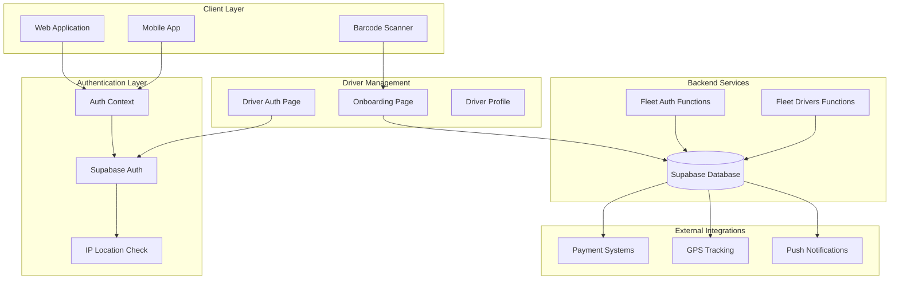
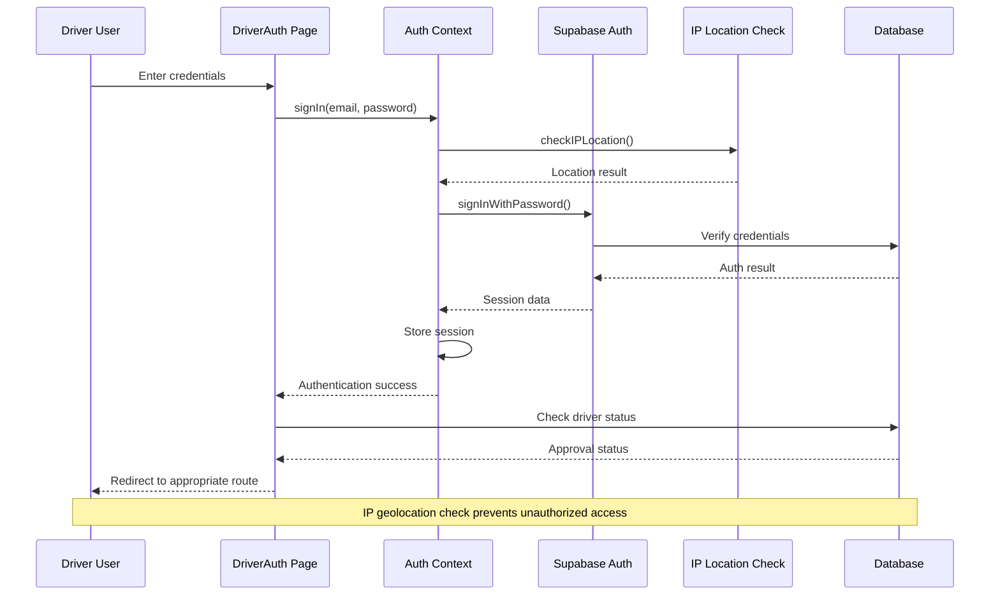
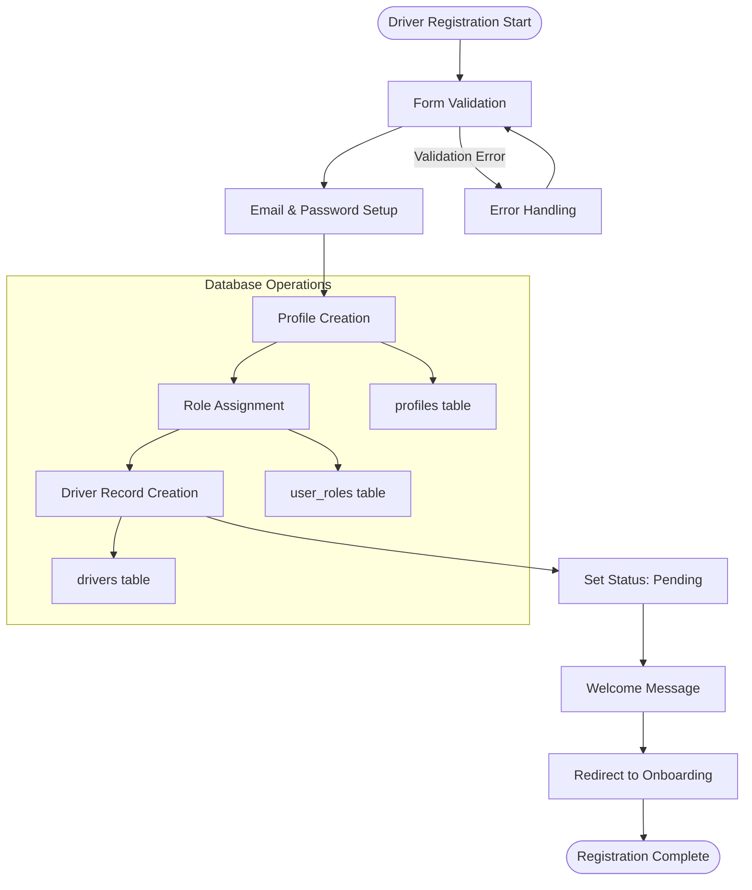
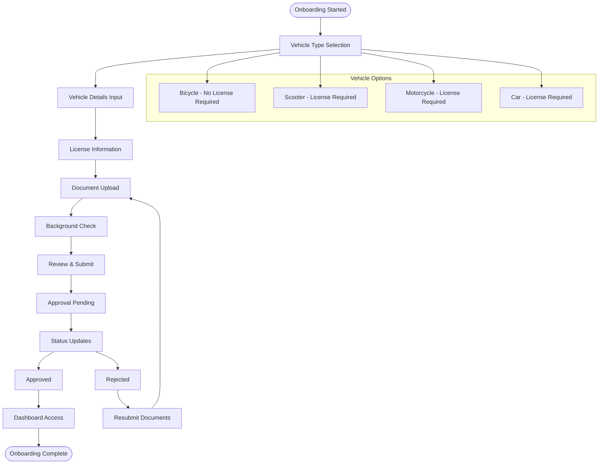
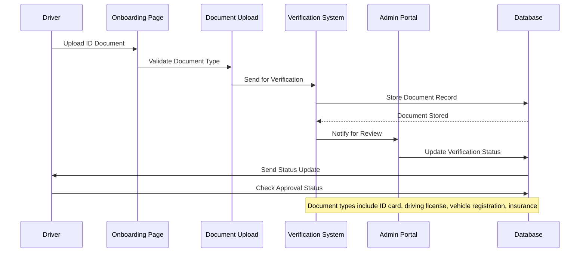
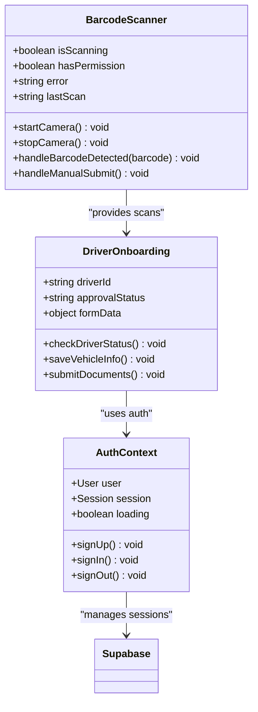
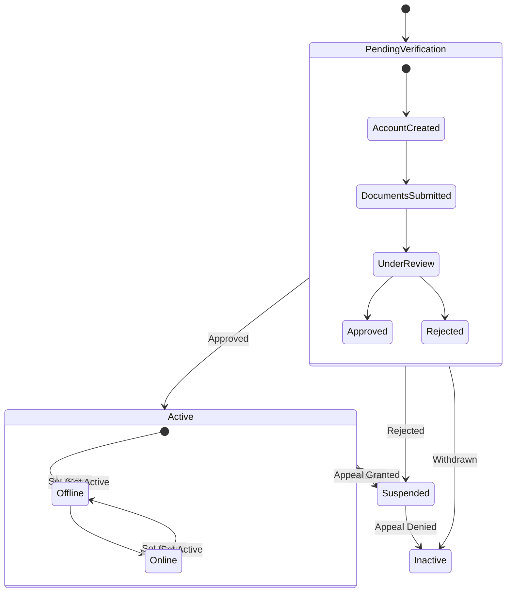
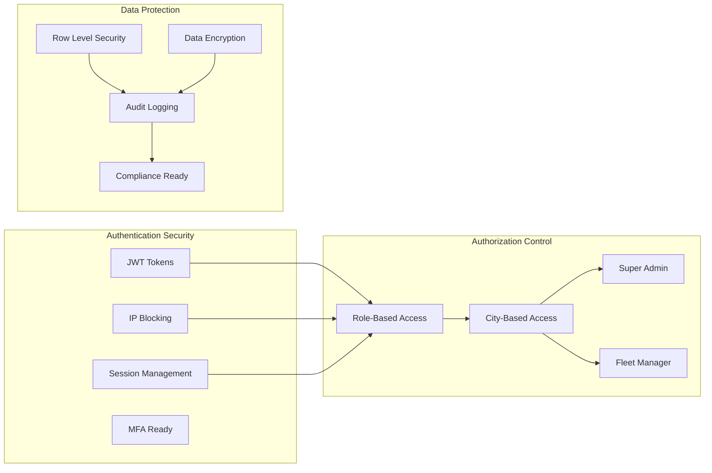

# Driver Authentication & Registration

<cite>
**Referenced Files in This Document**
- [AuthContext.tsx](file://src/contexts/AuthContext.tsx)
- [client.ts](file://src/integrations/supabase/client.ts)
- [types.ts](file://src/integrations/supabase/types.ts)
- [DriverAuth.tsx](file://src/pages/driver/DriverAuth.tsx)
- [DriverOnboarding.tsx](file://src/pages/driver/DriverOnboarding.tsx)
- [BarcodeScanner.tsx](file://src/components/BarcodeScanner.tsx)
- [index.ts](file://supabase/functions/fleet-auth/index.ts)
- [index.ts](file://supabase/functions/fleet-drivers/index.ts)
</cite>

## Table of Contents
1. [Introduction](#introduction)
2. [System Architecture](#system-architecture)
3. [Authentication Flow](#authentication-flow)
4. [Driver Registration Process](#driver-registration-process)
5. [Onboarding Workflow](#onboarding-workflow)
6. [Identity Verification & Background Checks](#identity-verification--background-checks)
7. [Mobile App Integration](#mobile-app-integration)
8. [Real-time Status Updates](#real-time-status-updates)
9. [Security & Access Control](#security--access-control)
10. [Troubleshooting Guide](#troubleshooting-guide)
11. [Conclusion](#conclusion)

## Introduction

The Driver Authentication & Registration system provides a comprehensive solution for managing driver onboarding, authentication, and continuous verification within the Nutrio ecosystem. This system integrates Supabase Auth for secure user authentication, implements role-based access control, and offers mobile-first experiences with QR/Barcode scanning capabilities.

The system supports multiple driver types (bicycle, scooter, motorcycle, car) with varying licensing requirements, automated document verification workflows, and real-time status tracking throughout the approval process.

## System Architecture

**Diagram sources**
- [AuthContext.tsx:31-61](file://src/contexts/AuthContext.tsx#L31-L61)
- [DriverAuth.tsx:40-60](file://src/pages/driver/DriverAuth.tsx#L40-L60)
- [DriverOnboarding.tsx:50-79](file://src/pages/driver/DriverOnboarding.tsx#L50-L79)

## Authentication Flow

The authentication system implements a robust multi-layered approach combining Supabase Auth with custom edge functions and IP geolocation verification.

**Diagram sources**
- [AuthContext.tsx:87-112](file://src/contexts/AuthContext.tsx#L87-L112)
- [DriverAuth.tsx:123-132](file://src/pages/driver/DriverAuth.tsx#L123-L132)

### Authentication Features

- **Multi-factor Authentication Ready**: JWT-based authentication with configurable expiration
- **IP Geolocation Blocking**: Real-time IP location verification with country-based restrictions
- **Session Management**: Automatic session persistence with Capacitor preferences for native apps
- **Role-Based Access Control**: Driver-specific role assignment and permission management
- **Push Notification Integration**: Automatic initialization for native mobile platforms

**Section sources**
- [AuthContext.tsx:36-61](file://src/contexts/AuthContext.tsx#L36-L61)
- [AuthContext.tsx:63-85](file://src/contexts/AuthContext.tsx#L63-L85)
- [AuthContext.tsx:87-112](file://src/contexts/AuthContext.tsx#L87-L112)

## Driver Registration Process

The driver registration process follows a structured workflow that ensures proper identity verification and system integration.

**Diagram sources**
- [DriverAuth.tsx:123-177](file://src/pages/driver/DriverAuth.tsx#L123-L177)

### Registration Requirements

- **Personal Information**: Full name, email, phone number
- **Account Setup**: Secure password creation with Supabase Auth
- **Profile Synchronization**: Automatic profile creation in profiles table
- **Role Assignment**: Driver role assignment in user_roles table
- **Initial Record**: Driver profile with default settings in drivers table

**Section sources**
- [DriverAuth.tsx:29-70](file://src/pages/driver/DriverAuth.tsx#L29-L70)
- [DriverAuth.tsx:123-177](file://src/pages/driver/DriverAuth.tsx#L123-L177)

## Onboarding Workflow

The onboarding process guides drivers through vehicle information setup and document submission requirements.

**Diagram sources**
- [DriverOnboarding.tsx:34-79](file://src/pages/driver/DriverOnboarding.tsx#L34-L79)

### Vehicle Type Requirements

| Vehicle Type | Icon | License Required | Background Check |
|--------------|------|------------------|------------------|
| Bicycle | 🚴 | ❌ No | Optional |
| Scooter | 🚴 | ✅ Yes | Recommended |
| Motorcycle | 🚛 | ✅ Yes | Required |
| Car | 🚗 | ✅ Yes | Required |

**Section sources**
- [DriverOnboarding.tsx:27-32](file://src/pages/driver/DriverOnboarding.tsx#L27-L32)
- [DriverOnboarding.tsx:39-45](file://src/pages/driver/DriverOnboarding.tsx#L39-L45)

## Identity Verification & Background Checks

The system implements comprehensive identity verification through document submission and background check integration.

**Diagram sources**
- [supabase/functions/fleet-drivers/index.ts:714-800](file://supabase/functions/fleet-drivers/index.ts#L714-L800)

### Document Submission Requirements

**Required Documents by Vehicle Type:**
- **Bicycle**: ID Card (Government Issued)
- **Scooter**: Driving License + ID Card
- **Motorcycle**: Driving License + ID Card + Insurance
- **Car**: Driving License + ID Card + Vehicle Registration + Insurance

**Document Types Supported:**
- ID Card (Government Issued)
- Driving License
- Vehicle Registration
- Insurance Certificate
- Background Check Report
- Employment Contract

**Section sources**
- [supabase/functions/fleet-drivers/index.ts:727-733](file://supabase/functions/fleet-drivers/index.ts#L727-L733)
- [supabase/functions/fleet-drivers/index.ts:756-774](file://supabase/functions/fleet-drivers/index.ts#L756-L774)

## Mobile App Integration

The mobile application provides native integration with barcode scanning capabilities and offline authentication support.

**Diagram sources**
- [BarcodeScanner.tsx:14-105](file://src/components/BarcodeScanner.tsx#L14-L105)
- [DriverOnboarding.tsx:34-79](file://src/pages/driver/DriverOnboarding.tsx#L34-L79)
- [AuthContext.tsx:31-61](file://src/contexts/AuthContext.tsx#L31-L61)

### Mobile Features

- **Native Camera Access**: Environment-facing camera for barcode scanning
- **Offline Authentication**: Session persistence with Capacitor preferences
- **Push Notifications**: Automatic initialization for mobile platforms
- **Barcode Scanning**: Support for UPC, EAN, and QR codes
- **Manual Entry Fallback**: Keyboard input for barcode numbers

**Section sources**
- [BarcodeScanner.tsx:24-45](file://src/components/BarcodeScanner.tsx#L24-L45)
- [BarcodeScanner.tsx:85-93](file://src/components/BarcodeScanner.tsx#L85-L93)
- [AuthContext.tsx:44-49](file://src/contexts/AuthContext.tsx#L44-L49)

## Real-time Status Updates

The system provides comprehensive real-time status tracking throughout the driver approval lifecycle.

**Diagram sources**
- [supabase/functions/fleet-drivers/index.ts:484-577](file://supabase/functions/fleet-drivers/index.ts#L484-L577)

### Status Management

**Approval Statuses:**
- **pending_verification**: New driver registration awaiting review
- **active**: Approved driver ready for assignments
- **suspended**: Temporarily suspended driver
- **inactive**: Permanently deactivated driver

**Activity Tracking:**
- Document upload timestamps
- Status change history
- Login/logout activities
- Performance metrics
- Earnings calculations

**Section sources**
- [supabase/functions/fleet-drivers/index.ts:497-503](file://supabase/functions/fleet-drivers/index.ts#L497-L503)
- [supabase/functions/fleet-drivers/index.ts:542-547](file://supabase/functions/fleet-drivers/index.ts#L542-L547)

## Security & Access Control

The system implements comprehensive security measures including role-based access control, IP geolocation restrictions, and secure authentication protocols.

**Diagram sources**
- [supabase/functions/fleet-auth/index.ts:33-63](file://supabase/functions/fleet-auth/index.ts#L33-L63)
- [supabase/functions/fleet-auth/index.ts:196-209](file://supabase/functions/fleet-auth/index.ts#L196-L209)

### Security Features

- **JWT Token Management**: 15-minute access tokens with 7-day refresh tokens
- **IP Geolocation Blocking**: Country-based access restrictions
- **Role-Based Access Control**: Driver, fleet manager, super admin roles
- **City-Based Permissions**: Geographic access limitations
- **Audit Trail**: Comprehensive logging of all actions
- **Session Timeout**: Configurable idle timeout for security

**Section sources**
- [supabase/functions/fleet-auth/index.ts:8-12](file://supabase/functions/fleet-auth/index.ts#L8-L12)
- [supabase/functions/fleet-auth/index.ts:66-88](file://supabase/functions/fleet-auth/index.ts#L66-L88)
- [supabase/functions/fleet-auth/index.ts:196-209](file://supabase/functions/fleet-auth/index.ts#L196-L209)

## Troubleshooting Guide

Common issues and their solutions for the driver authentication and registration system.

### Authentication Issues

**Problem**: Users cannot log in from certain regions
- **Solution**: Verify IP geolocation blocking configuration
- **Check**: Country restrictions in IP location service
- **Action**: Contact support for whitelist requests

**Problem**: Session not persisting on mobile devices
- **Solution**: Verify Capacitor preferences configuration
- **Check**: Local storage vs Capacitor preferences
- **Action**: Clear app cache and reinstall

### Registration Issues

**Problem**: Driver registration failing during profile creation
- **Solution**: Check database connectivity and user roles table
- **Check**: Duplicate email addresses
- **Action**: Verify Supabase authentication service keys

**Problem**: Document upload not working
- **Solution**: Verify file size limits and supported formats
- **Check**: Cloud storage configuration
- **Action**: Test with different document types

### Onboarding Issues

**Problem**: Vehicle type selection not saving
- **Solution**: Check form validation logic
- **Check**: Required field validation
- **Action**: Clear browser cache and retry

**Problem**: Barcode scanner not working
- **Solution**: Verify camera permissions
- **Check**: HTTPS requirements for camera access
- **Action**: Enable camera permissions in device settings

**Section sources**
- [AuthContext.tsx:90-100](file://src/contexts/AuthContext.tsx#L90-L100)
- [DriverAuth.tsx:178-188](file://src/pages/driver/DriverAuth.tsx#L178-L188)
- [BarcodeScanner.tsx:40-45](file://src/components/BarcodeScanner.tsx#L40-L45)

## Conclusion

The Driver Authentication & Registration system provides a comprehensive, secure, and scalable solution for managing driver onboarding and authentication within the Nutrio ecosystem. The system combines modern authentication practices with mobile-first design principles and comprehensive verification workflows.

Key strengths include:
- **Robust Security**: Multi-layered authentication with IP geolocation and role-based access control
- **Mobile Integration**: Native camera access and push notification support
- **Flexible Verification**: Document-based identity verification with automated workflows
- **Real-time Updates**: Comprehensive status tracking and approval workflows
- **Scalable Architecture**: Edge functions for fleet management and Supabase for data persistence

The system is designed for future expansion with features like biometric authentication, advanced background checks, and integration with external verification services. The modular architecture allows for easy extension while maintaining security and performance standards.