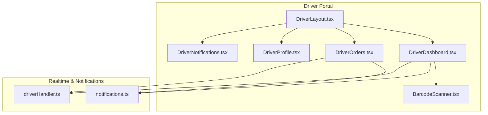
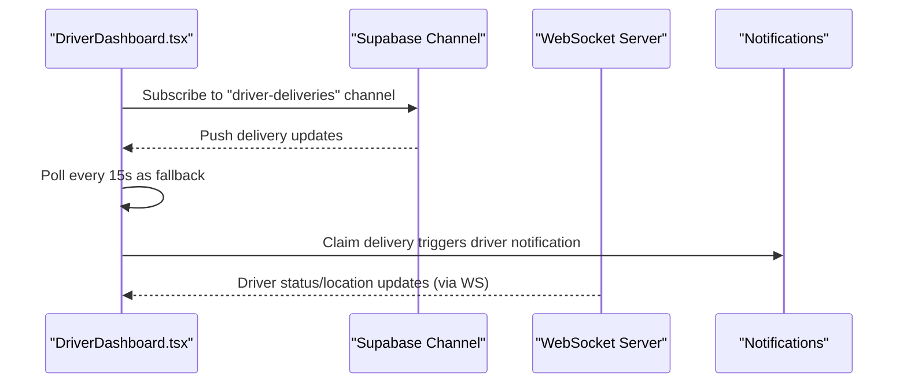
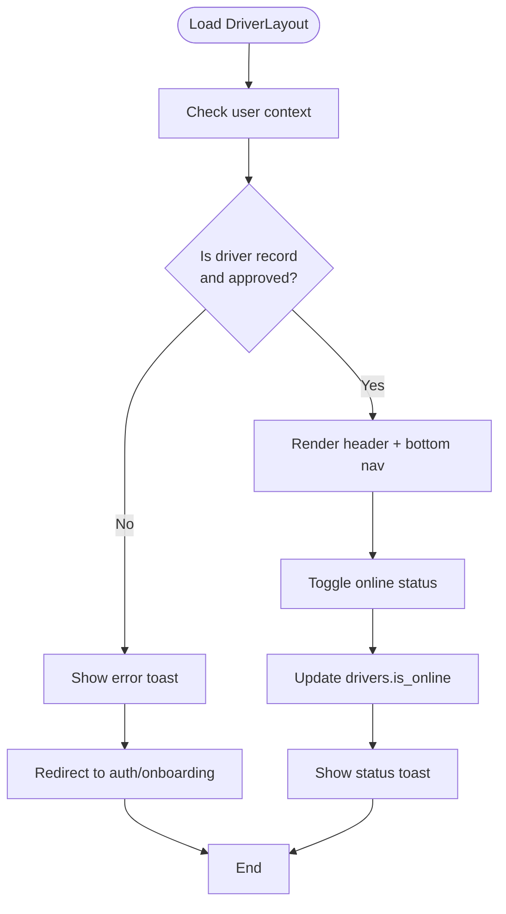
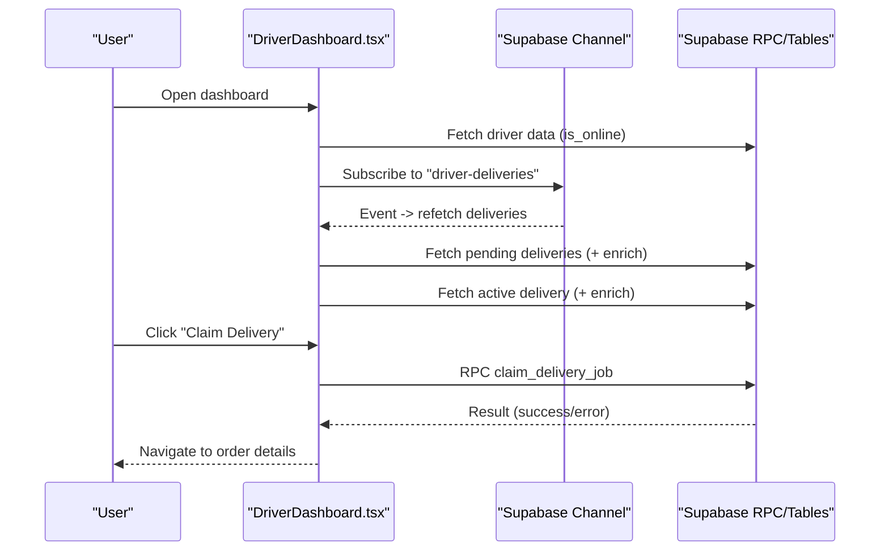
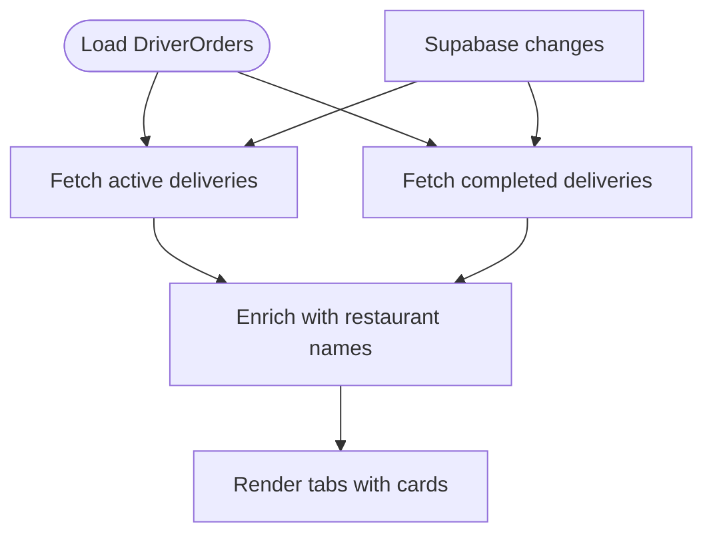
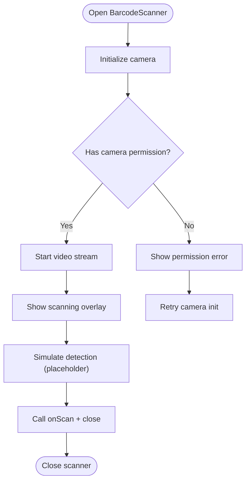
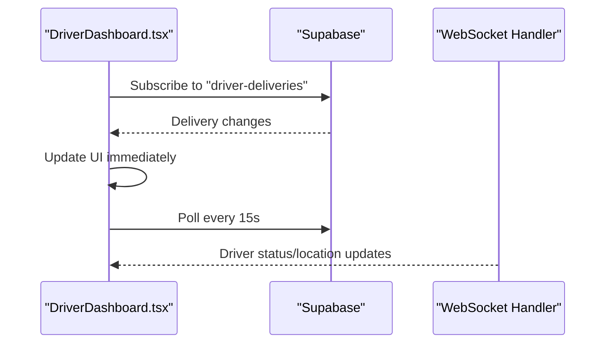
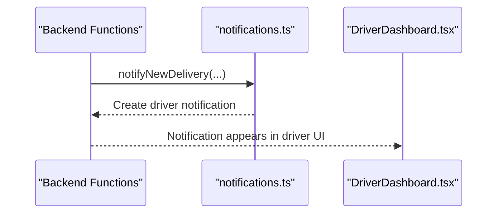
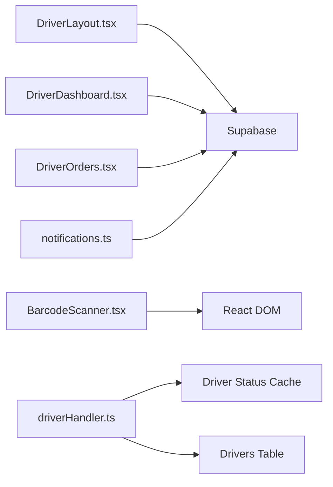

# Driver Dashboard & Navigation

<cite>
**Referenced Files in This Document**
- [DriverDashboard.tsx](file://src/pages/driver/DriverDashboard.tsx)
- [DriverOrders.tsx](file://src/pages/driver/DriverOrders.tsx)
- [DriverProfile.tsx](file://src/pages/driver/DriverProfile.tsx)
- [DriverNotifications.tsx](file://src/pages/driver/DriverNotifications.tsx)
- [DriverLayout.tsx](file://src/components/DriverLayout.tsx)
- [BarcodeScanner.tsx](file://src/components/BarcodeScanner.tsx)
- [notifications.ts](file://src/lib/notifications.ts)
- [driverHandler.ts](file://websocket-server/src/handlers/driverHandler.ts)
</cite>

## Table of Contents
1. [Introduction](#introduction)
2. [Project Structure](#project-structure)
3. [Core Components](#core-components)
4. [Architecture Overview](#architecture-overview)
5. [Detailed Component Analysis](#detailed-component-analysis)
6. [Dependency Analysis](#dependency-analysis)
7. [Performance Considerations](#performance-considerations)
8. [Troubleshooting Guide](#troubleshooting-guide)
9. [Conclusion](#conclusion)

## Introduction
This document describes the driver dashboard interface and navigation system. It covers the main dashboard layout, key metrics display, quick action buttons, navigation structure, menu organization, accessibility features, QR/barcode scanning for order pickup verification, real-time order status indicators, notification center integration, mobile-responsive design considerations, offline capabilities, and push notification handling for driver communications.

## Project Structure
The driver portal is organized around a dedicated layout component that wraps page-specific dashboards and navigation. Pages include the main dashboard, orders list, profile, and notifications. Supporting components provide scanning and real-time connectivity.

**Diagram sources**
- [DriverLayout.tsx:16-182](file://src/components/DriverLayout.tsx#L16-L182)
- [DriverDashboard.tsx:33-494](file://src/pages/driver/DriverDashboard.tsx#L33-L494)
- [DriverOrders.tsx:40-280](file://src/pages/driver/DriverOrders.tsx#L40-L280)
- [DriverProfile.tsx:45-252](file://src/pages/driver/DriverProfile.tsx#L45-L252)
- [DriverNotifications.tsx:1-17](file://src/pages/driver/DriverNotifications.tsx#L1-L17)
- [BarcodeScanner.tsx:14-257](file://src/components/BarcodeScanner.tsx#L14-L257)
- [driverHandler.ts:48-86](file://websocket-server/src/handlers/driverHandler.ts#L48-L86)
- [notifications.ts:99-113](file://src/lib/notifications.ts#L99-L113)

**Section sources**
- [DriverLayout.tsx:16-182](file://src/components/DriverLayout.tsx#L16-L182)
- [DriverDashboard.tsx:33-494](file://src/pages/driver/DriverDashboard.tsx#L33-L494)
- [DriverOrders.tsx:40-280](file://src/pages/driver/DriverOrders.tsx#L40-L280)
- [DriverProfile.tsx:45-252](file://src/pages/driver/DriverProfile.tsx#L45-L252)
- [DriverNotifications.tsx:1-17](file://src/pages/driver/DriverNotifications.tsx#L1-L17)
- [BarcodeScanner.tsx:14-257](file://src/components/BarcodeScanner.tsx#L14-L257)
- [driverHandler.ts:48-86](file://websocket-server/src/handlers/driverHandler.ts#L48-L86)
- [notifications.ts:99-113](file://src/lib/notifications.ts#L99-L113)

## Core Components
- DriverLayout: Provides the shared header, online/offline toggle, and bottom tab navigation for drivers. Handles driver eligibility checks and status updates.
- DriverDashboard: Displays available deliveries, active delivery, stats, and quick actions. Integrates Supabase channels for real-time updates and polling fallback.
- DriverOrders: Lists active and completed deliveries with status badges and navigation to order details.
- DriverProfile: Shows driver stats and allows updating contact and vehicle information.
- BarcodeScanner: Camera-based scanning UI with manual fallback for order pickup verification.
- Realtime/Notifications: WebSocket handler manages driver connections and status caching; notification utilities send driver-specific alerts.

**Section sources**
- [DriverLayout.tsx:16-182](file://src/components/DriverLayout.tsx#L16-L182)
- [DriverDashboard.tsx:33-494](file://src/pages/driver/DriverDashboard.tsx#L33-L494)
- [DriverOrders.tsx:40-280](file://src/pages/driver/DriverOrders.tsx#L40-L280)
- [DriverProfile.tsx:45-252](file://src/pages/driver/DriverProfile.tsx#L45-L252)
- [BarcodeScanner.tsx:14-257](file://src/components/BarcodeScanner.tsx#L14-L257)
- [driverHandler.ts:48-86](file://websocket-server/src/handlers/driverHandler.ts#L48-L86)
- [notifications.ts:99-113](file://src/lib/notifications.ts#L99-L113)

## Architecture Overview
The driver dashboard integrates Supabase for data and real-time events, with optional WebSocket enhancements for live driver status and location updates. Notifications are triggered by backend functions and surfaced to drivers.

**Diagram sources**
- [DriverDashboard.tsx:64-90](file://src/pages/driver/DriverDashboard.tsx#L64-L90)
- [notifications.ts:99-113](file://src/lib/notifications.ts#L99-L113)
- [driverHandler.ts:48-86](file://websocket-server/src/handlers/driverHandler.ts#L48-L86)

## Detailed Component Analysis

### Driver Dashboard Layout and Navigation
- Header: Includes online/offline toggle with visual indicator and status toast feedback.
- Bottom Navigation: Fixed tabs for Home, Orders, History, Earnings, and Profile.
- Eligibility Checks: Redirects unauthorized users to onboarding or auth screens.
- Accessibility: Uses semantic buttons, proper contrast, and keyboard-friendly navigation.

**Diagram sources**
- [DriverLayout.tsx:26-100](file://src/components/DriverLayout.tsx#L26-L100)

**Section sources**
- [DriverLayout.tsx:16-182](file://src/components/DriverLayout.tsx#L16-L182)

### Driver Dashboard Page
- Real-time Updates: Subscribes to Supabase channel for delivery_jobs and polls every 15 seconds as fallback.
- Available Deliveries: Fetches pending jobs without driver_id, enriches with restaurant and schedule details.
- Active Delivery: Shows ongoing delivery with click-to-navigate.
- Stats: Today and week delivery counts, wallet balance.
- Quick Actions: Online/offline banner, refresh button, claim delivery with atomic RPC.

**Diagram sources**
- [DriverDashboard.tsx:47-90](file://src/pages/driver/DriverDashboard.tsx#L47-L90)
- [DriverDashboard.tsx:118-188](file://src/pages/driver/DriverDashboard.tsx#L118-L188)
- [DriverDashboard.tsx:190-256](file://src/pages/driver/DriverDashboard.tsx#L190-L256)
- [DriverDashboard.tsx:303-352](file://src/pages/driver/DriverDashboard.tsx#L303-L352)

**Section sources**
- [DriverDashboard.tsx:33-494](file://src/pages/driver/DriverDashboard.tsx#L33-L494)

### Driver Orders Page
- Active vs Completed Tabs: Separate views for current and historical deliveries.
- Status Badges: Color-coded statuses for visibility.
- Real-time Sync: Subscribes to delivery_jobs changes and refreshes lists.

**Diagram sources**
- [DriverOrders.tsx:108-169](file://src/pages/driver/DriverOrders.tsx#L108-L169)

**Section sources**
- [DriverOrders.tsx:40-280](file://src/pages/driver/DriverOrders.tsx#L40-L280)

### Driver Profile Page
- Stats Cards: Deliveries count and total earnings.
- Contact/Vehicle Info: Editable fields with save confirmation.
- Actions: Settings and Sign Out navigation.

**Section sources**
- [DriverProfile.tsx:45-252](file://src/pages/driver/DriverProfile.tsx#L45-L252)

### QR/Barcode Scanner for Pickup Verification
- Camera Access: Requests device camera permission with environment-facing camera preference.
- Scanning Overlay: Visual scanning frame and animated indicator.
- Manual Fallback: Text input for barcode entry.
- Integration Hooks: Exposes a hook to handle barcode scans and mock product lookup.

**Diagram sources**
- [BarcodeScanner.tsx:24-93](file://src/components/BarcodeScanner.tsx#L24-L93)
- [BarcodeScanner.tsx:107-204](file://src/components/BarcodeScanner.tsx#L107-L204)

**Section sources**
- [BarcodeScanner.tsx:14-257](file://src/components/BarcodeScanner.tsx#L14-L257)

### Real-time Order Status Indicators
- Supabase Channels: Subscriptions to delivery_jobs for live updates.
- Polling Fallback: 15-second intervals to ensure freshness.
- WebSocket Enhancements: Driver status caching and periodic updates via WebSocket server.

**Diagram sources**
- [DriverDashboard.tsx:64-90](file://src/pages/driver/DriverDashboard.tsx#L64-L90)
- [driverHandler.ts:48-86](file://websocket-server/src/handlers/driverHandler.ts#L48-L86)

**Section sources**
- [DriverDashboard.tsx:64-90](file://src/pages/driver/DriverDashboard.tsx#L64-L90)
- [driverHandler.ts:48-86](file://websocket-server/src/handlers/driverHandler.ts#L48-L86)

### Notification Center Integration
- Driver Notifications Page: Placeholder card indicating future notifications for new orders and updates.
- Backend Notifications: Utilities to notify drivers about assignments and new deliveries.

**Diagram sources**
- [notifications.ts:99-113](file://src/lib/notifications.ts#L99-L113)
- [DriverNotifications.tsx:1-17](file://src/pages/driver/DriverNotifications.tsx#L1-L17)

**Section sources**
- [DriverNotifications.tsx:1-17](file://src/pages/driver/DriverNotifications.tsx#L1-L17)
- [notifications.ts:99-113](file://src/lib/notifications.ts#L99-L113)

## Dependency Analysis
- DriverLayout depends on AuthContext and Supabase to validate driver status and manage online state.
- DriverDashboard and DriverOrders depend on Supabase channels and RPC functions for real-time data and enriched joins.
- BarcodeScanner is a standalone UI component with optional integration hooks.
- WebSocket server caches driver status and emits periodic updates.

**Diagram sources**
- [DriverLayout.tsx:16-182](file://src/components/DriverLayout.tsx#L16-L182)
- [DriverDashboard.tsx:33-494](file://src/pages/driver/DriverDashboard.tsx#L33-L494)
- [DriverOrders.tsx:40-280](file://src/pages/driver/DriverOrders.tsx#L40-L280)
- [BarcodeScanner.tsx:14-257](file://src/components/BarcodeScanner.tsx#L14-L257)
- [driverHandler.ts:48-86](file://websocket-server/src/handlers/driverHandler.ts#L48-L86)
- [notifications.ts:99-113](file://src/lib/notifications.ts#L99-L113)

**Section sources**
- [DriverLayout.tsx:16-182](file://src/components/DriverLayout.tsx#L16-L182)
- [DriverDashboard.tsx:33-494](file://src/pages/driver/DriverDashboard.tsx#L33-L494)
- [DriverOrders.tsx:40-280](file://src/pages/driver/DriverOrders.tsx#L40-L280)
- [BarcodeScanner.tsx:14-257](file://src/components/BarcodeScanner.tsx#L14-L257)
- [driverHandler.ts:48-86](file://websocket-server/src/handlers/driverHandler.ts#L48-L86)
- [notifications.ts:99-113](file://src/lib/notifications.ts#L99-L113)

## Performance Considerations
- Real-time Updates: Prefer Supabase channels for immediate updates; use 15-second polling as a robust fallback.
- Data Enrichment: Batch restaurant and schedule lookups to minimize round trips.
- Rendering: Memoize derived values and avoid unnecessary re-renders in lists.
- Camera Scanning: Stop streams after use and avoid continuous scanning loops until implemented.

## Troubleshooting Guide
- Camera Permission Denied: Prompt user to enable camera access; provide retry button.
- Driver Not Approved: Redirect to onboarding screen with explanatory toast.
- Claim Delivery Failures: Show user-friendly messages based on returned error codes from the atomic RPC.
- No Active Deliveries: Guide users to refresh or go online to receive orders.

**Section sources**
- [BarcodeScanner.tsx:24-93](file://src/components/BarcodeScanner.tsx#L24-L93)
- [DriverLayout.tsx:44-73](file://src/components/DriverLayout.tsx#L44-L73)
- [DriverDashboard.tsx:318-334](file://src/pages/driver/DriverDashboard.tsx#L318-L334)

## Conclusion
The driver dashboard provides a responsive, real-time interface optimized for mobile delivery workflows. It combines Supabase channels with polling, a clean bottom-navigation layout, and integrated scanning and notification systems. The modular design enables easy maintenance and extension for additional features like live driver location via WebSocket.