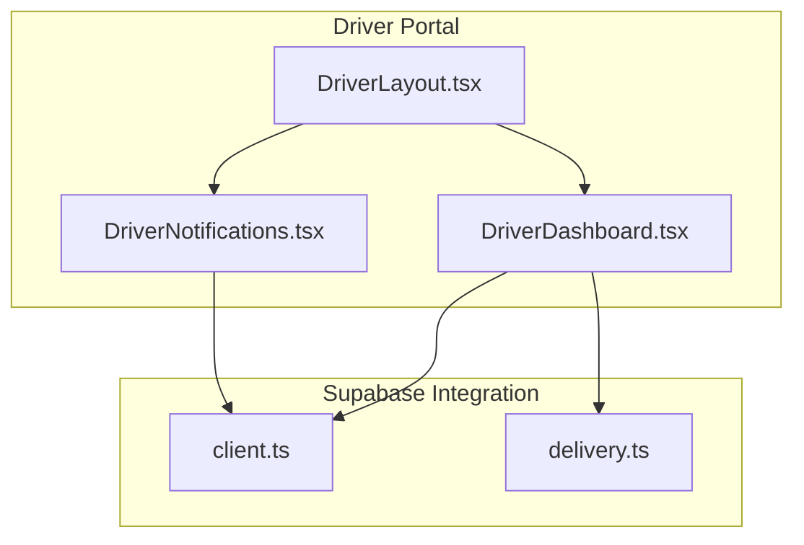
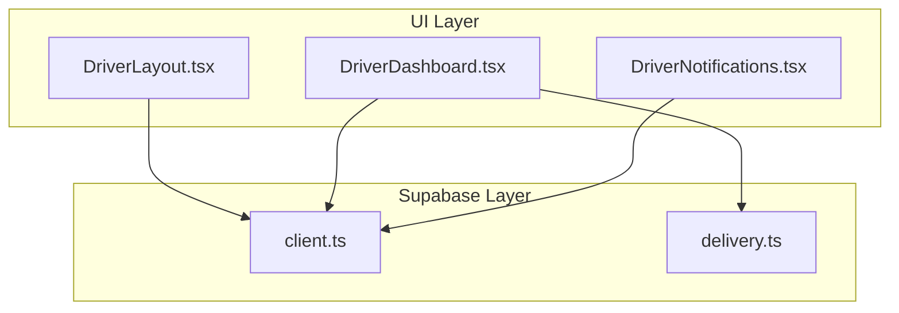
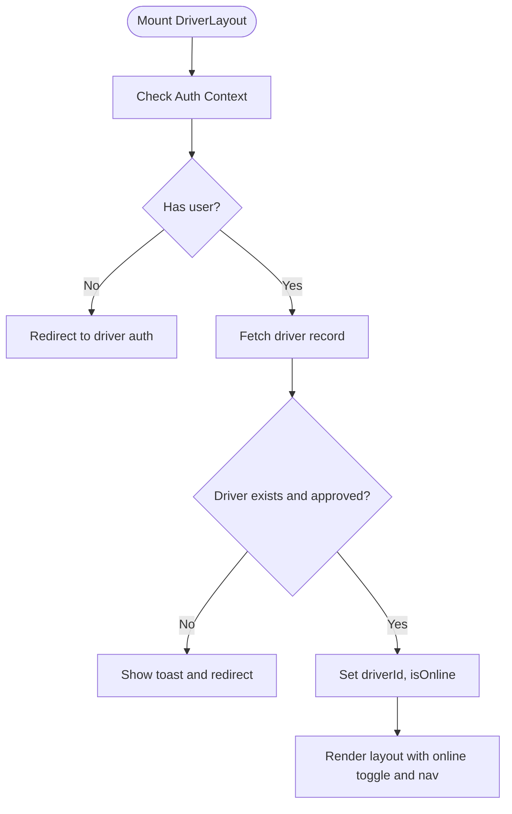
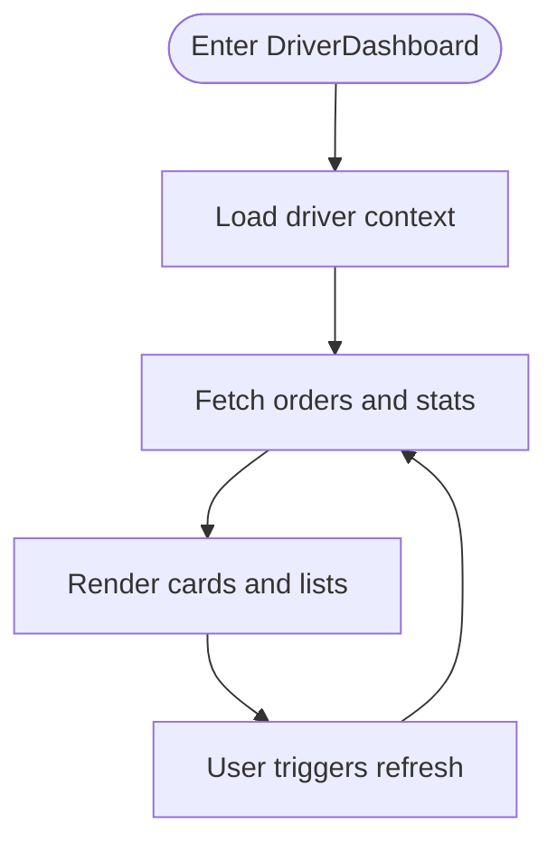
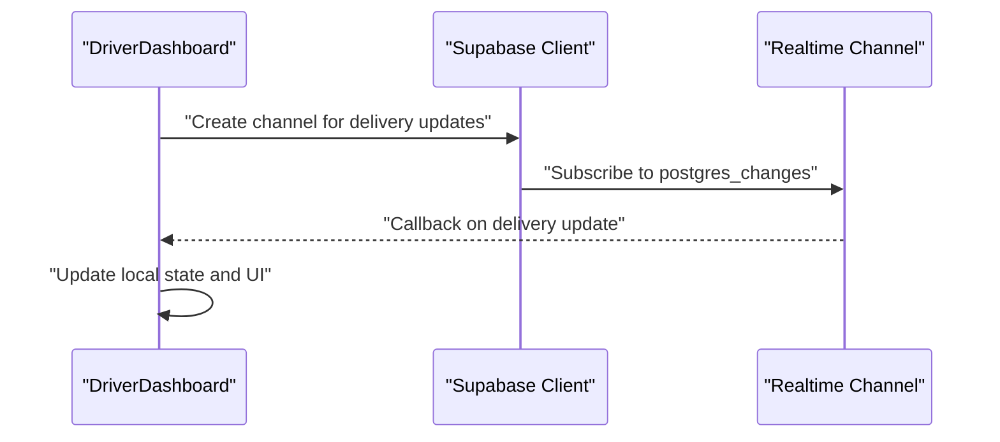
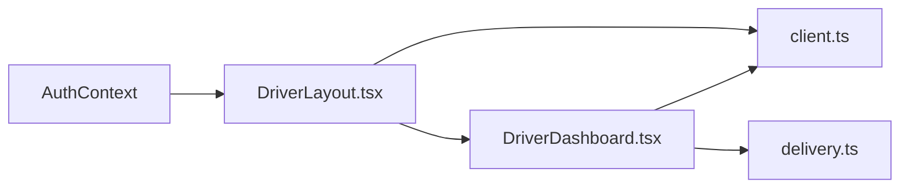

# Driver Dashboard & Overview

<cite>
**Referenced Files in This Document**
- [DriverLayout.tsx](file://src/components/DriverLayout.tsx)
- [client.ts](file://src/integrations/supabase/client.ts)
- [delivery.ts](file://src/integrations/supabase/delivery.ts)
- [DriverDashboard.tsx](file://src/pages/driver/DriverDashboard.tsx)
- [DriverNotifications.tsx](file://src/pages/driver/DriverNotifications.tsx)
- [earnings.spec.ts](file://e2e/driver/earnings.spec.ts)
</cite>

## Table of Contents
1. [Introduction](#introduction)
2. [Project Structure](#project-structure)
3. [Core Components](#core-components)
4. [Architecture Overview](#architecture-overview)
5. [Detailed Component Analysis](#detailed-component-analysis)
6. [Dependency Analysis](#dependency-analysis)
7. [Performance Considerations](#performance-considerations)
8. [Troubleshooting Guide](#troubleshooting-guide)
9. [Conclusion](#conclusion)

## Introduction
This document describes the driver dashboard interface and overview functionality. It covers the main dashboard layout, driver status management, real-time order availability, active deliveries, performance metrics, statistics display, order claiming mechanism, and responsive/mobile-first design considerations. The system leverages Supabase for real-time subscriptions and backend operations.

## Project Structure
The driver dashboard spans layout, page, and integration layers:
- Layout: Provides navigation, online/offline toggle, and bottom navigation.
- Pages: Dashboard overview, notifications, and earnings/history.
- Integrations: Supabase client configuration and delivery-related subscriptions.

**Diagram sources**
- [DriverLayout.tsx:16-182](file://src/components/DriverLayout.tsx#L16-L182)
- [DriverDashboard.tsx:33-41](file://src/pages/driver/DriverDashboard.tsx#L33-L41)
- [DriverNotifications.tsx:1-17](file://src/pages/driver/DriverNotifications.tsx#L1-L17)
- [client.ts:1-57](file://src/integrations/supabase/client.ts#L1-L57)
- [delivery.ts:694-734](file://src/integrations/supabase/delivery.ts#L694-L734)

**Section sources**
- [DriverLayout.tsx:16-182](file://src/components/DriverLayout.tsx#L16-L182)
- [DriverDashboard.tsx:33-41](file://src/pages/driver/DriverDashboard.tsx#L33-L41)
- [DriverNotifications.tsx:1-17](file://src/pages/driver/DriverNotifications.tsx#L1-L17)
- [client.ts:1-57](file://src/integrations/supabase/client.ts#L1-L57)
- [delivery.ts:694-734](file://src/integrations/supabase/delivery.ts#L694-L734)

## Core Components
- DriverLayout: Central layout with online/offline toggle, bottom navigation, and route protection for drivers.
- DriverDashboard: Overview page displaying driver status, available orders, active deliveries, and performance metrics.
- DriverNotifications: Placeholder for driver notifications.
- Supabase client: Configured for secure auth persistence and real-time.
- Delivery subscriptions: Real-time channels for delivery updates and driver location.

Key responsibilities:
- Enforce driver role and approval status.
- Toggle driver online state atomically via Supabase.
- Provide real-time order availability and delivery updates.
- Display statistics and performance metrics.

**Section sources**
- [DriverLayout.tsx:32-100](file://src/components/DriverLayout.tsx#L32-L100)
- [DriverDashboard.tsx:33-41](file://src/pages/driver/DriverDashboard.tsx#L33-L41)
- [client.ts:47-57](file://src/integrations/supabase/client.ts#L47-L57)
- [delivery.ts:694-734](file://src/integrations/supabase/delivery.ts#L694-L734)

## Architecture Overview
The driver dashboard integrates UI components with Supabase for real-time updates and backend operations. The layout manages driver state and navigation, while pages consume Supabase data and subscriptions.

**Diagram sources**
- [DriverLayout.tsx:16-182](file://src/components/DriverLayout.tsx#L16-L182)
- [DriverDashboard.tsx:33-41](file://src/pages/driver/DriverDashboard.tsx#L33-L41)
- [DriverNotifications.tsx:1-17](file://src/pages/driver/DriverNotifications.tsx#L1-L17)
- [client.ts:1-57](file://src/integrations/supabase/client.ts#L1-L57)
- [delivery.ts:694-734](file://src/integrations/supabase/delivery.ts#L694-L734)

## Detailed Component Analysis

### DriverLayout
Responsibilities:
- Checks driver role and approval status on auth changes.
- Toggles driver online/offline state via Supabase update.
- Renders header with online indicator and bottom navigation.
- Protects routes so non-drivers are redirected.

Implementation highlights:
- Uses Supabase to query driver record and enforce approval.
- Atomic update of driver online status with error handling and user feedback.
- Bottom navigation links to Home, Orders, History, Earnings, Profile.

**Diagram sources**
- [DriverLayout.tsx:26-73](file://src/components/DriverLayout.tsx#L26-L73)
- [DriverLayout.tsx:75-100](file://src/components/DriverLayout.tsx#L75-L100)

**Section sources**
- [DriverLayout.tsx:32-100](file://src/components/DriverLayout.tsx#L32-L100)
- [DriverLayout.tsx:117-179](file://src/components/DriverLayout.tsx#L117-L179)

### DriverDashboard
Responsibilities:
- Display driver status and quick actions.
- Show available orders and active deliveries.
- Present performance metrics and statistics.
- Provide refresh controls for live data.

Current page structure:
- Defines available delivery interface shape.
- Manages loading, refreshing, driverId, and online state.
- Integrates with Supabase for data and subscriptions.

**Diagram sources**
- [DriverDashboard.tsx:33-41](file://src/pages/driver/DriverDashboard.tsx#L33-L41)

**Section sources**
- [DriverDashboard.tsx:13-41](file://src/pages/driver/DriverDashboard.tsx#L13-L41)

### DriverNotifications
Responsibilities:
- Placeholder card indicating no notifications yet.
- Future expansion for order and system notifications.

**Section sources**
- [DriverNotifications.tsx:1-17](file://src/pages/driver/DriverNotifications.tsx#L1-L17)

### Supabase Integration
Client configuration:
- Creates Supabase client with environment variables.
- Uses Capacitor Preferences for native sessions and localStorage fallback.
- Enables auto-refresh and persistent auth session.

Real-time subscriptions:
- Delivery updates channel for a given schedule.
- Driver location insert events for live tracking.

**Diagram sources**
- [client.ts:47-57](file://src/integrations/supabase/client.ts#L47-L57)
- [delivery.ts:694-712](file://src/integrations/supabase/delivery.ts#L694-L712)

**Section sources**
- [client.ts:1-57](file://src/integrations/supabase/client.ts#L1-L57)
- [delivery.ts:694-734](file://src/integrations/supabase/delivery.ts#L694-L734)

## Dependency Analysis
DriverLayout depends on:
- Auth context for user state.
- Supabase client for driver queries and updates.
- Navigation components for bottom bar.

DriverDashboard depends on:
- Supabase client for data.
- Supabase delivery subscriptions for live updates.

**Diagram sources**
- [DriverLayout.tsx:19-24](file://src/components/DriverLayout.tsx#L19-L24)
- [DriverDashboard.tsx:8-10](file://src/pages/driver/DriverDashboard.tsx#L8-L10)
- [client.ts:47-57](file://src/integrations/supabase/client.ts#L47-L57)
- [delivery.ts:694-734](file://src/integrations/supabase/delivery.ts#L694-L734)

**Section sources**
- [DriverLayout.tsx:19-24](file://src/components/DriverLayout.tsx#L19-L24)
- [DriverDashboard.tsx:8-10](file://src/pages/driver/DriverDashboard.tsx#L8-L10)

## Performance Considerations
- Real-time subscriptions: Use targeted filters to minimize payload and reduce client processing.
- Atomic status updates: Single Supabase update ensures consistency and avoids race conditions.
- Debounce refresh: Limit frequent polling to reduce network overhead.
- Lazy loading: Load additional data (e.g., notifications) on demand.
- Image optimization: Compress and lazy-load images in order listings.

## Troubleshooting Guide
Common issues and resolutions:
- Missing environment variables: Ensure Supabase URL and publishable key are configured; otherwise, client initialization logs warnings.
- Driver not found or not approved: Layout redirects unauthorized users to appropriate pages and shows toasts.
- Online toggle failures: Errors during status update are caught, logged, and surfaced via toast messages.
- Real-time updates not received: Verify channel creation and filter expressions; ensure network connectivity.

**Section sources**
- [client.ts:10-16](file://src/integrations/supabase/client.ts#L10-L16)
- [DriverLayout.tsx:67-72](file://src/components/DriverLayout.tsx#L67-L72)
- [DriverLayout.tsx:92-99](file://src/components/DriverLayout.tsx#L92-L99)

## Conclusion
The driver dashboard integrates a clean layout with robust Supabase-backed real-time capabilities. Driver status management is handled atomically, while the dashboard displays relevant operational data and performance metrics. Real-time subscriptions keep the interface current, and the responsive design supports mobile-first usage. Extending the dashboard with order claiming, detailed statistics, and active delivery tracking aligns with the existing architecture and patterns.