# Driver Portal

<cite>
**Referenced Files in This Document**
- [DriverDashboard.tsx](file://src/pages/driver/DriverDashboard.tsx)
- [DriverProfile.tsx](file://src/pages/driver/DriverProfile.tsx)
- [DriverEarnings.tsx](file://src/pages/driver/DriverEarnings.tsx)
- [DriverOnboarding.tsx](file://src/pages/driver/DriverOnboarding.tsx)
- [DriverSettings.tsx](file://src/pages/driver/DriverSettings.tsx)
- [DriverNotifications.tsx](file://src/pages/driver/DriverNotifications.tsx)
- [DriverQRScanner.tsx](file://src/components/driver/DriverQRScanner.tsx)
- [DriverLayout.tsx](file://src/components/driver/DriverLayout.tsx)
- [OrderTrackingHub.tsx](file://src/components/OrderTrackingHub.tsx)
- [PayoutProcessing.tsx](file://src/fleet/pages/PayoutProcessing.tsx)
- [delivery_system_visual.md](file://delivery_system_visual.md)
- [fleet-management-portal-design.md](file://docs/fleet-management-portal-design.md)
- [earnings.spec.ts](file://e2e/driver/earnings.spec.ts)
</cite>

## Table of Contents
1. [Introduction](#introduction)
2. [Project Structure](#project-structure)
3. [Core Components](#core-components)
4. [Architecture Overview](#architecture-overview)
5. [Detailed Component Analysis](#detailed-component-analysis)
6. [Dependency Analysis](#dependency-analysis)
7. [Performance Considerations](#performance-considerations)
8. [Troubleshooting Guide](#troubleshooting-guide)
9. [Conclusion](#conclusion)
10. [Appendices](#appendices)

## Introduction
This document provides comprehensive driver portal documentation for the delivery driver management system. It covers the driver application and onboarding workflows, profile management, delivery assignment and real-time tracking, route optimization features, driver dashboard, earnings calculation, and payout processing. It also explains the integration with the Supabase real-time channel for live updates, the QR scanner functionality, mobile app features, driver performance metrics, rating systems, and fleet management integration.

## Project Structure
The driver portal is implemented as a React-based single-page application with routing and real-time capabilities powered by Supabase. Key areas include:
- Driver onboarding and profile management
- Dashboard for available and active deliveries
- Earnings and payout summaries
- QR scanning for order verification
- Settings and notifications
- Fleet management integration for payouts and performance metrics

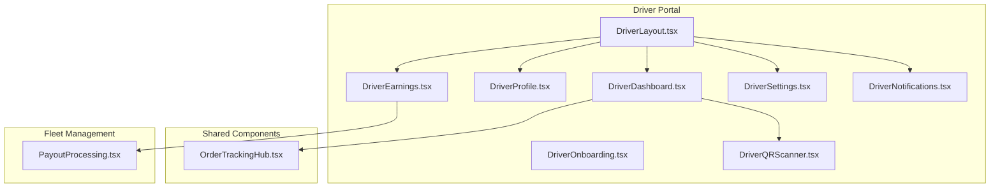

**Diagram sources**
- [DriverLayout.tsx:24-329](file://src/components/driver/DriverLayout.tsx#L24-L329)
- [DriverDashboard.tsx:33-494](file://src/pages/driver/DriverDashboard.tsx#L33-L494)
- [DriverProfile.tsx:45-252](file://src/pages/driver/DriverProfile.tsx#L45-L252)
- [DriverEarnings.tsx:13-225](file://src/pages/driver/DriverEarnings.tsx#L13-L225)
- [DriverOnboarding.tsx:34-79](file://src/pages/driver/DriverOnboarding.tsx#L34-L79)
- [DriverSettings.tsx:8-112](file://src/pages/driver/DriverSettings.tsx#L8-L112)
- [DriverNotifications.tsx:3-18](file://src/pages/driver/DriverNotifications.tsx#L3-L18)
- [DriverQRScanner.tsx:13-254](file://src/components/driver/DriverQRScanner.tsx#L13-L254)
- [OrderTrackingHub.tsx:37-235](file://src/components/OrderTrackingHub.tsx#L37-L235)
- [PayoutProcessing.tsx:25-148](file://src/fleet/pages/PayoutProcessing.tsx#L25-L148)

**Section sources**
- [DriverLayout.tsx:24-329](file://src/components/driver/DriverLayout.tsx#L24-L329)
- [DriverDashboard.tsx:33-494](file://src/pages/driver/DriverDashboard.tsx#L33-L494)
- [DriverProfile.tsx:45-252](file://src/pages/driver/DriverProfile.tsx#L45-L252)
- [DriverEarnings.tsx:13-225](file://src/pages/driver/DriverEarnings.tsx#L13-L225)
- [DriverOnboarding.tsx:34-79](file://src/pages/driver/DriverOnboarding.tsx#L34-L79)
- [DriverSettings.tsx:8-112](file://src/pages/driver/DriverSettings.tsx#L8-L112)
- [DriverNotifications.tsx:3-18](file://src/pages/driver/DriverNotifications.tsx#L3-L18)
- [DriverQRScanner.tsx:13-254](file://src/components/driver/DriverQRScanner.tsx#L13-L254)
- [OrderTrackingHub.tsx:37-235](file://src/components/OrderTrackingHub.tsx#L37-L235)
- [PayoutProcessing.tsx:25-148](file://src/fleet/pages/PayoutProcessing.tsx#L25-L148)

## Core Components
- DriverLayout: Provides the driver app shell, navigation, online/offline toggle, and periodic location updates.
- DriverDashboard: Displays available deliveries, active delivery, and allows claiming deliveries with real-time updates.
- DriverProfile: Manages driver contact and vehicle information, ratings, and statistics.
- DriverEarnings: Shows wallet balance, daily/weekly/monthly earnings, tips estimation, and recent earnings.
- DriverOnboarding: Handles driver registration and vehicle details during onboarding.
- DriverQRScanner: Camera-based QR scanning interface for order verification.
- DriverSettings and DriverNotifications: Manage driver preferences and notification settings.
- OrderTrackingHub: Shared component for tracking customer orders (used by drivers for visibility).
- PayoutProcessing: Fleet-side module for calculating and processing driver payouts.

**Section sources**
- [DriverLayout.tsx:24-329](file://src/components/driver/DriverLayout.tsx#L24-L329)
- [DriverDashboard.tsx:33-494](file://src/pages/driver/DriverDashboard.tsx#L33-L494)
- [DriverProfile.tsx:45-252](file://src/pages/driver/DriverProfile.tsx#L45-L252)
- [DriverEarnings.tsx:13-225](file://src/pages/driver/DriverEarnings.tsx#L13-L225)
- [DriverOnboarding.tsx:34-79](file://src/pages/driver/DriverOnboarding.tsx#L34-L79)
- [DriverQRScanner.tsx:13-254](file://src/components/driver/DriverQRScanner.tsx#L13-L254)
- [DriverSettings.tsx:8-112](file://src/pages/driver/DriverSettings.tsx#L8-L112)
- [DriverNotifications.tsx:3-18](file://src/pages/driver/DriverNotifications.tsx#L3-L18)
- [OrderTrackingHub.tsx:37-235](file://src/components/OrderTrackingHub.tsx#L37-L235)
- [PayoutProcessing.tsx:25-148](file://src/fleet/pages/PayoutProcessing.tsx#L25-L148)

## Architecture Overview
The driver portal integrates with Supabase for real-time data synchronization, authentication, and database operations. The system supports:
- Real-time delivery availability and active job updates via Postgres Realtime channels
- Atomic delivery claiming to prevent race conditions
- Periodic driver location updates when online
- Fleet-side payout processing with performance-based bonuses

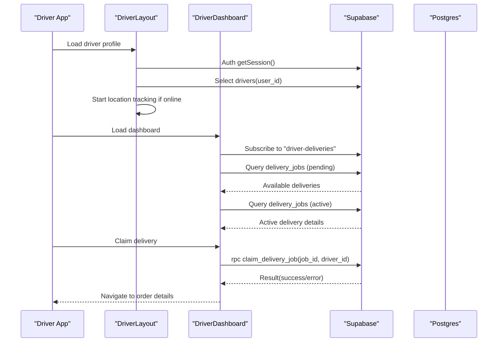

**Diagram sources**
- [DriverLayout.tsx:46-85](file://src/components/driver/DriverLayout.tsx#L46-L85)
- [DriverDashboard.tsx:64-90](file://src/pages/driver/DriverDashboard.tsx#L64-L90)
- [DriverDashboard.tsx:118-188](file://src/pages/driver/DriverDashboard.tsx#L118-L188)
- [DriverDashboard.tsx:190-256](file://src/pages/driver/DriverDashboard.tsx#L190-L256)
- [DriverDashboard.tsx:303-352](file://src/pages/driver/DriverDashboard.tsx#L303-L352)

**Section sources**
- [DriverLayout.tsx:46-85](file://src/components/driver/DriverLayout.tsx#L46-L85)
- [DriverDashboard.tsx:64-90](file://src/pages/driver/DriverDashboard.tsx#L64-L90)
- [DriverDashboard.tsx:118-188](file://src/pages/driver/DriverDashboard.tsx#L118-L188)
- [DriverDashboard.tsx:190-256](file://src/pages/driver/DriverDashboard.tsx#L190-L256)
- [DriverDashboard.tsx:303-352](file://src/pages/driver/DriverDashboard.tsx#L303-L352)

## Detailed Component Analysis

### Driver Application and Onboarding
The onboarding flow captures driver vehicle details and approval status, ensuring compliance with licensing requirements per vehicle type. It validates session state and redirects unauthorized users to the auth page.

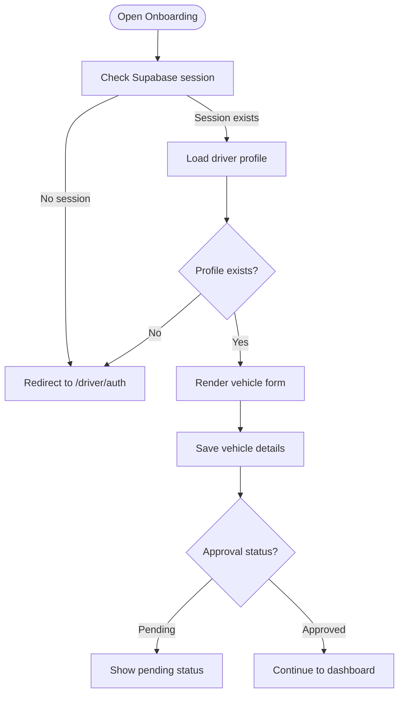

**Diagram sources**
- [DriverOnboarding.tsx:50-79](file://src/pages/driver/DriverOnboarding.tsx#L50-L79)
- [DriverOnboarding.tsx:34-79](file://src/pages/driver/DriverOnboarding.tsx#L34-L79)

**Section sources**
- [DriverOnboarding.tsx:34-79](file://src/pages/driver/DriverOnboarding.tsx#L34-L79)

### Driver Dashboard and Delivery Assignment
The dashboard aggregates available deliveries, merges restaurant and schedule details, and exposes an atomic claim mechanism to prevent conflicts. It also polls periodically as a fallback to real-time channels.

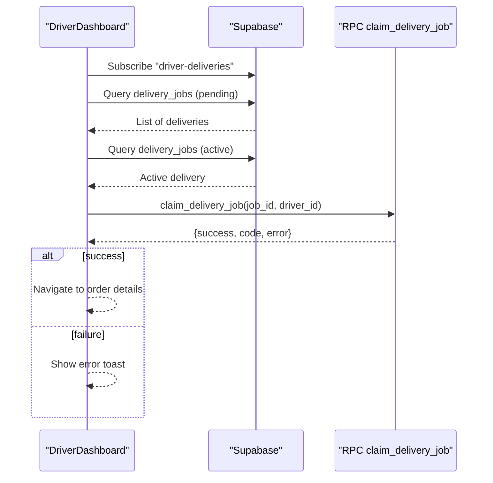

**Diagram sources**
- [DriverDashboard.tsx:64-90](file://src/pages/driver/DriverDashboard.tsx#L64-L90)
- [DriverDashboard.tsx:118-188](file://src/pages/driver/DriverDashboard.tsx#L118-L188)
- [DriverDashboard.tsx:190-256](file://src/pages/driver/DriverDashboard.tsx#L190-L256)
- [DriverDashboard.tsx:303-352](file://src/pages/driver/DriverDashboard.tsx#L303-L352)

**Section sources**
- [DriverDashboard.tsx:64-90](file://src/pages/driver/DriverDashboard.tsx#L64-L90)
- [DriverDashboard.tsx:118-188](file://src/pages/driver/DriverDashboard.tsx#L118-L188)
- [DriverDashboard.tsx:190-256](file://src/pages/driver/DriverDashboard.tsx#L190-L256)
- [DriverDashboard.tsx:303-352](file://src/pages/driver/DriverDashboard.tsx#L303-L352)

### Real-Time Order Tracking and Route Optimization
Real-time tracking is achieved through Supabase Postgres Realtime channels. The system subscribes to delivery job changes and polls as a fallback. Route optimization is implicit through proximity-based delivery fetching and driver location updates.

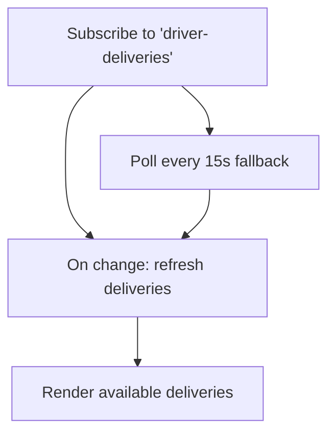

**Diagram sources**
- [DriverDashboard.tsx:64-90](file://src/pages/driver/DriverDashboard.tsx#L64-L90)
- [DriverDashboard.tsx:80-89](file://src/pages/driver/DriverDashboard.tsx#L80-L89)

**Section sources**
- [DriverDashboard.tsx:64-90](file://src/pages/driver/DriverDashboard.tsx#L64-L90)
- [DriverDashboard.tsx:80-89](file://src/pages/driver/DriverDashboard.tsx#L80-L89)

### Driver Profile Management
The profile page displays driver statistics, ratings, and allows updating contact and vehicle information. It persists changes to the drivers table.

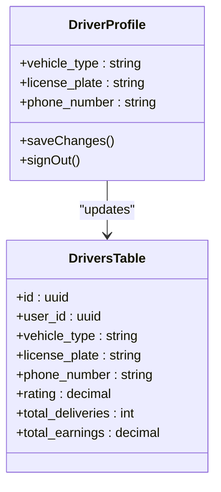

**Diagram sources**
- [DriverProfile.tsx:51-89](file://src/pages/driver/DriverProfile.tsx#L51-L89)
- [DriverProfile.tsx:45-252](file://src/pages/driver/DriverProfile.tsx#L45-L252)

**Section sources**
- [DriverProfile.tsx:51-89](file://src/pages/driver/DriverProfile.tsx#L51-L89)
- [DriverProfile.tsx:45-252](file://src/pages/driver/DriverProfile.tsx#L45-L252)

### Earnings Calculation and Payout Processing
Earnings are computed from completed deliveries with tip estimation. Payout processing is available in the fleet module with performance-based bonuses.

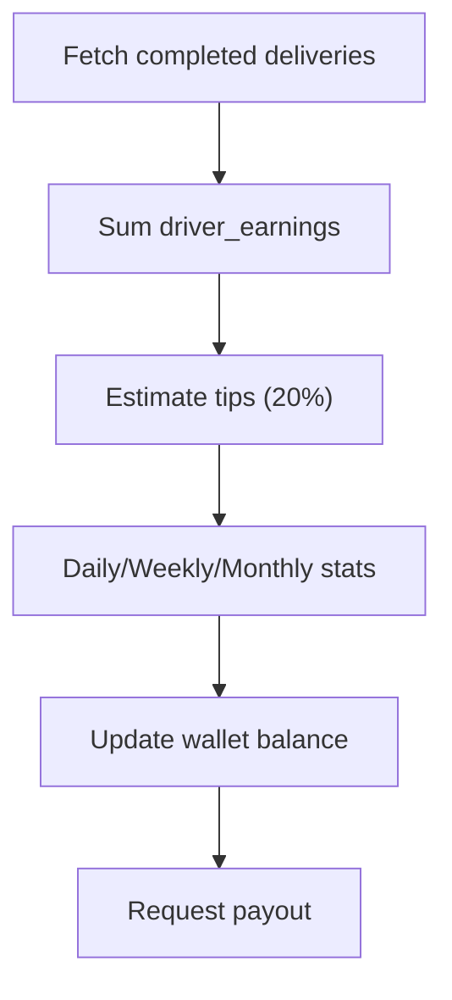

**Diagram sources**
- [DriverEarnings.tsx:60-116](file://src/pages/driver/DriverEarnings.tsx#L60-L116)
- [DriverEarnings.tsx:127-225](file://src/pages/driver/DriverEarnings.tsx#L127-L225)

**Section sources**
- [DriverEarnings.tsx:60-116](file://src/pages/driver/DriverEarnings.tsx#L60-L116)
- [DriverEarnings.tsx:127-225](file://src/pages/driver/DriverEarnings.tsx#L127-L225)
- [PayoutProcessing.tsx:43-58](file://src/fleet/pages/PayoutProcessing.tsx#L43-L58)

### QR Scanner Functionality
The QR scanner provides camera-based scanning with manual fallback entry. It handles camera permissions and errors gracefully.

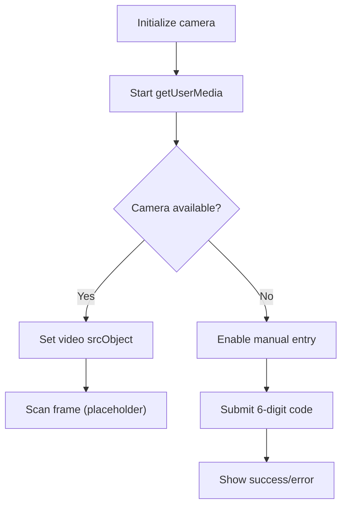

**Diagram sources**
- [DriverQRScanner.tsx:26-64](file://src/components/driver/DriverQRScanner.tsx#L26-L64)
- [DriverQRScanner.tsx:66-93](file://src/components/driver/DriverQRScanner.tsx#L66-L93)
- [DriverQRScanner.tsx:95-99](file://src/components/driver/DriverQRScanner.tsx#L95-L99)
- [DriverQRScanner.tsx:101-254](file://src/components/driver/DriverQRScanner.tsx#L101-L254)

**Section sources**
- [DriverQRScanner.tsx:26-64](file://src/components/driver/DriverQRScanner.tsx#L26-L64)
- [DriverQRScanner.tsx:66-93](file://src/components/driver/DriverQRScanner.tsx#L66-L93)
- [DriverQRScanner.tsx:95-99](file://src/components/driver/DriverQRScanner.tsx#L95-L99)
- [DriverQRScanner.tsx:101-254](file://src/components/driver/DriverQRScanner.tsx#L101-L254)

### Mobile App Features and Settings
The driver app supports online/offline toggling, periodic location updates, and notification preferences. The layout provides a bottom navigation bar optimized for mobile usage.

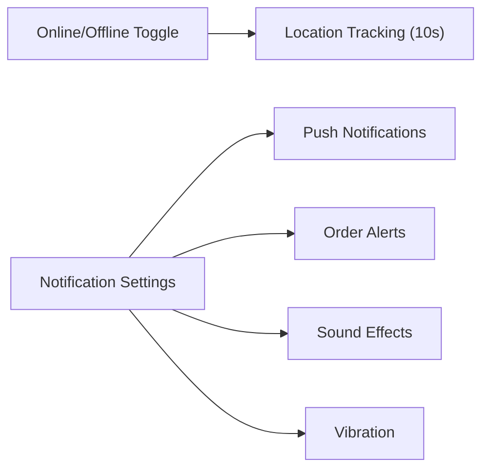

**Diagram sources**
- [DriverLayout.tsx:199-227](file://src/components/driver/DriverLayout.tsx#L199-L227)
- [DriverLayout.tsx:87-102](file://src/components/driver/DriverLayout.tsx#L87-L102)
- [DriverSettings.tsx:8-112](file://src/pages/driver/DriverSettings.tsx#L8-L112)

**Section sources**
- [DriverLayout.tsx:199-227](file://src/components/driver/DriverLayout.tsx#L199-L227)
- [DriverLayout.tsx:87-102](file://src/components/driver/DriverLayout.tsx#L87-L102)
- [DriverSettings.tsx:8-112](file://src/pages/driver/DriverSettings.tsx#L8-L112)

### Fleet Management Integration
Fleet management includes driver performance metrics, vehicle assignments, and payout processing with idempotency and status tracking.

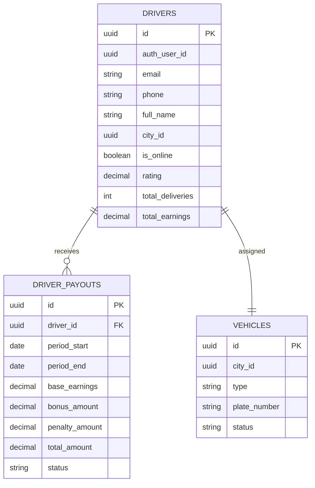

**Diagram sources**
- [fleet-management-portal-design.md:233-270](file://docs/fleet-management-portal-design.md#L233-L270)
- [fleet-management-portal-design.md:389-423](file://docs/fleet-management-portal-design.md#L389-L423)
- [fleet-management-portal-design.md:304-334](file://docs/fleet-management-portal-design.md#L304-L334)

**Section sources**
- [fleet-management-portal-design.md:233-270](file://docs/fleet-management-portal-design.md#L233-L270)
- [fleet-management-portal-design.md:389-423](file://docs/fleet-management-portal-design.md#L389-L423)
- [fleet-management-portal-design.md:304-334](file://docs/fleet-management-portal-design.md#L304-L334)
- [PayoutProcessing.tsx:25-148](file://src/fleet/pages/PayoutProcessing.tsx#L25-L148)

## Dependency Analysis
The driver portal relies on Supabase for authentication, real-time channels, and database operations. Key dependencies include:
- Supabase client for database and auth
- Postgres Realtime channels for live updates
- RPC functions for atomic operations (e.g., claim_delivery_job)
- Fleet APIs for payout processing and performance metrics

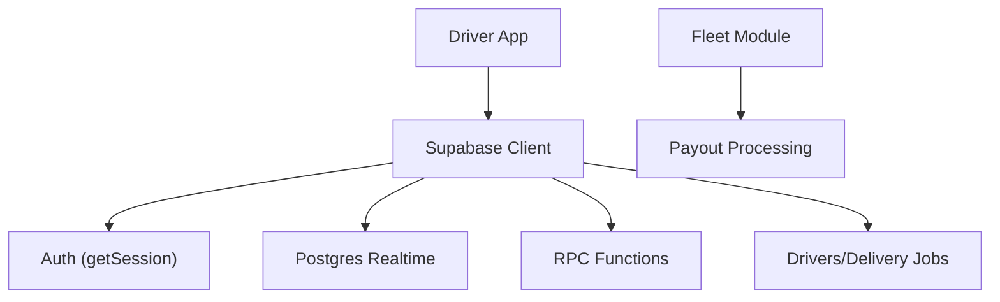

**Diagram sources**
- [DriverDashboard.tsx:64-90](file://src/pages/driver/DriverDashboard.tsx#L64-L90)
- [DriverDashboard.tsx:303-352](file://src/pages/driver/DriverDashboard.tsx#L303-L352)
- [PayoutProcessing.tsx:25-148](file://src/fleet/pages/PayoutProcessing.tsx#L25-L148)

**Section sources**
- [DriverDashboard.tsx:64-90](file://src/pages/driver/DriverDashboard.tsx#L64-L90)
- [DriverDashboard.tsx:303-352](file://src/pages/driver/DriverDashboard.tsx#L303-L352)
- [PayoutProcessing.tsx:25-148](file://src/fleet/pages/PayoutProcessing.tsx#L25-L148)

## Performance Considerations
- Real-time channels reduce latency for delivery updates; polling acts as a fallback to ensure resilience.
- Atomic RPC functions prevent race conditions during delivery claiming.
- Location updates occur at 10-second intervals when online to balance accuracy and battery life.
- Batch fetching and RPC-based joins optimize data retrieval for dashboard lists.

[No sources needed since this section provides general guidance]

## Troubleshooting Guide
Common issues and resolutions:
- Camera access denied or not available: The QR scanner component surfaces explicit error messages and offers manual entry.
- Location permissions denied: The driver layout provides detailed toasts and retries with lower accuracy.
- Delivery claiming fails: The dashboard maps specific error codes to actionable messages and prevents invalid states.
- Real-time updates not appearing: The dashboard polls every 15 seconds as a fallback to channel subscriptions.

**Section sources**
- [DriverQRScanner.tsx:44-54](file://src/components/driver/DriverQRScanner.tsx#L44-L54)
- [DriverQRScanner.tsx:95-99](file://src/components/driver/DriverQRScanner.tsx#L95-L99)
- [DriverLayout.tsx:104-153](file://src/components/driver/DriverLayout.tsx#L104-L153)
- [DriverDashboard.tsx:317-334](file://src/pages/driver/DriverDashboard.tsx#L317-L334)
- [DriverDashboard.tsx:80-89](file://src/pages/driver/DriverDashboard.tsx#L80-L89)

## Conclusion
The driver portal provides a robust, real-time platform for drivers to manage their availability, claim deliveries, track orders, and monitor earnings. With integrated QR scanning, mobile-optimized UI, and seamless fleet integration for payouts and performance metrics, the system supports efficient last-mile delivery operations.

[No sources needed since this section summarizes without analyzing specific files]

## Appendices
- Additional system visuals and workflows are documented in the delivery system visual and fleet management design documents.

**Section sources**
- [delivery_system_visual.md:102-240](file://delivery_system_visual.md#L102-L240)
- [fleet-management-portal-design.md:169-1265](file://docs/fleet-management-portal-design.md#L169-L1265)
- [earnings.spec.ts:66-100](file://e2e/driver/earnings.spec.ts#L66-L100)