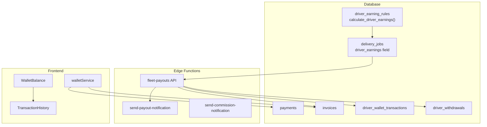
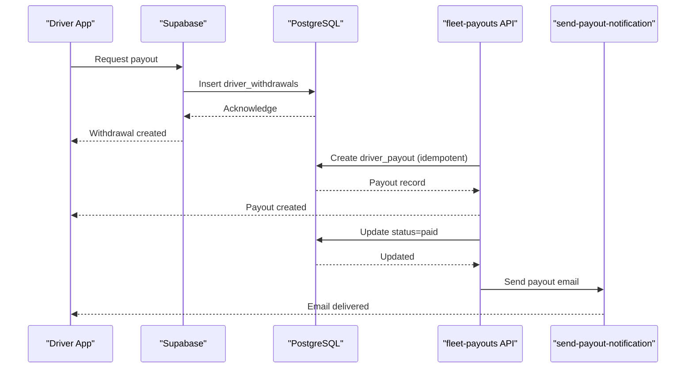
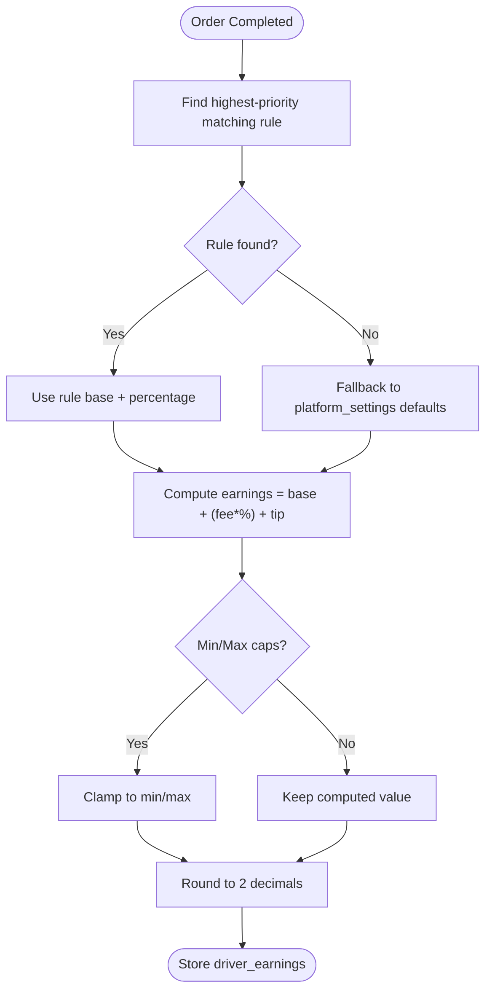
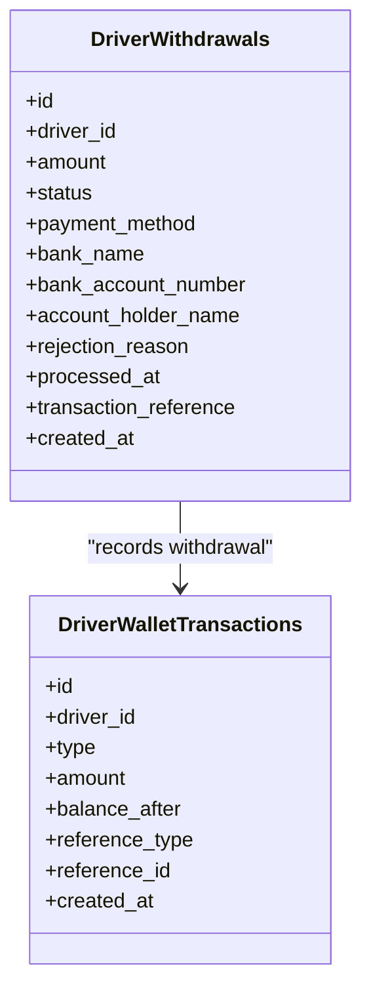
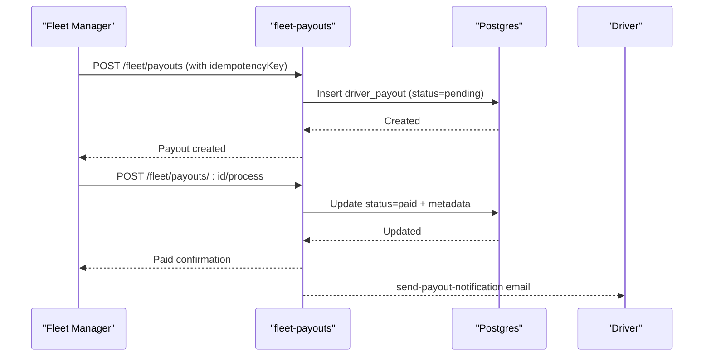
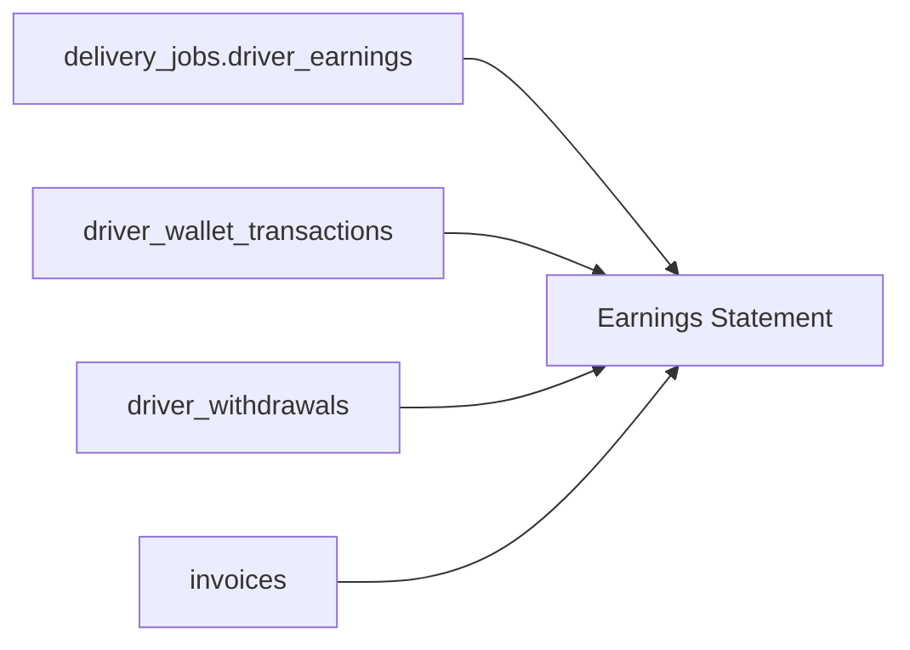
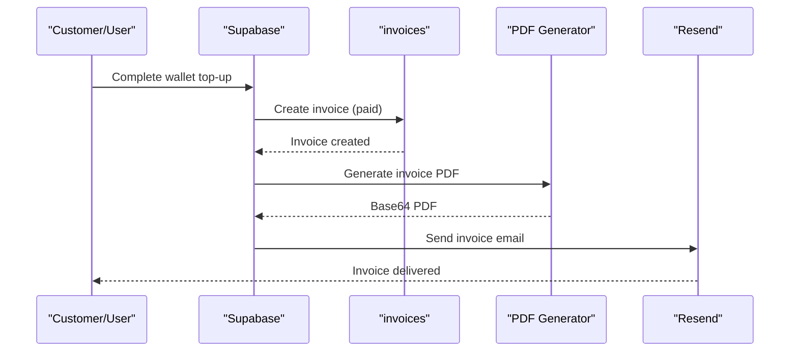
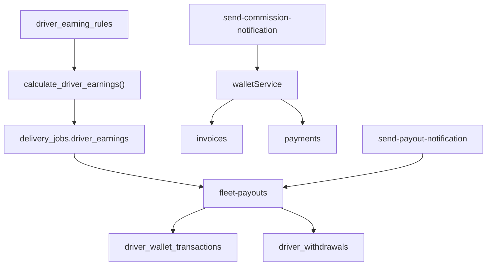

# Earnings & Payout Management

<cite>
**Referenced Files in This Document**
- [20260227_driver_earnings_config.sql](file://supabase/migrations/20260227_driver_earnings_config.sql)
- [20260218120000_wallet_system.sql](file://supabase/migrations/20260218120000_wallet_system.sql)
- [20260313200000_add_payout_frequency.sql](file://supabase/migrations/20260313200000_add_payout_frequency.sql)
- [20260313200001_add_commission_rate_to_restaurants.sql](file://supabase/migrations/20260313200001_add_commission_rate_to_restaurants.sql)
- [index.ts (fleet-payouts)](file://supabase/functions/fleet-payouts/index.ts)
- [index.ts (send-payout-notification)](file://supabase/functions/send-payout-notification/index.ts)
- [index.ts (send-commission-notification)](file://supabase/functions/send-commission-notification/index.ts)
- [WalletBalance.tsx](file://src/components/wallet/WalletBalance.tsx)
- [TransactionHistory.tsx](file://src/components/wallet/TransactionHistory.tsx)
- [walletService.ts](file://src/services/walletService.ts)
- [earnings.spec.ts (driver)](file://e2e/driver/earnings.spec.ts)
- [payouts.spec.ts (driver)](file://e2e/driver/payouts.spec.ts)
- [payouts-workflow.spec.ts (cross-portal)](file://e2e/cross-portal/payouts-workflow.spec.ts)
- [wallet-payments.spec.ts (cross-portal)](file://e2e/cross-portal/wallet-payments.spec.ts)
</cite>

## Table of Contents
1. [Introduction](#introduction)
2. [Project Structure](#project-structure)
3. [Core Components](#core-components)
4. [Architecture Overview](#architecture-overview)
5. [Detailed Component Analysis](#detailed-component-analysis)
6. [Dependency Analysis](#dependency-analysis)
7. [Performance Considerations](#performance-considerations)
8. [Troubleshooting Guide](#troubleshooting-guide)
9. [Conclusion](#conclusion)
10. [Appendices](#appendices)

## Introduction
This document explains the driver earnings and payout management system, covering:
- Commission calculation engine with base fees, tips, and performance adjustments
- Wallet balance system with real-time updates and transaction history
- Payout request workflow, thresholds, processing, and payment methods
- Earnings statements and payout history with status tracking
- Tax reporting and income documentation
- Examples of earnings calculations and payout scenarios across commission structures

## Project Structure
The system spans database migrations, edge functions, and frontend components/services:
- Database: driver earnings rules, wallet, driver withdrawals, invoices, and payments
- Backend: fleet payout management API and notification functions
- Frontend: wallet widgets and services for top-ups and invoices

**Diagram sources**
- [20260227_driver_earnings_config.sql:98-180](file://supabase/migrations/20260227_driver_earnings_config.sql#L98-L180)
- [20260218120000_wallet_system.sql:224-252](file://supabase/migrations/20260218120000_wallet_system.sql#L224-L252)
- [index.ts (fleet-payouts):560-610](file://supabase/functions/fleet-payouts/index.ts#L560-L610)
- [index.ts (send-payout-notification):20-176](file://supabase/functions/send-payout-notification/index.ts#L20-L176)
- [WalletBalance.tsx:13-70](file://src/components/wallet/WalletBalance.tsx#L13-L70)
- [TransactionHistory.tsx:57-162](file://src/components/wallet/TransactionHistory.tsx#L57-L162)
- [walletService.ts:13-137](file://src/services/walletService.ts#L13-L137)

**Section sources**
- [20260227_driver_earnings_config.sql:1-272](file://supabase/migrations/20260227_driver_earnings_config.sql#L1-L272)
- [20260218120000_wallet_system.sql:1-710](file://supabase/migrations/20260218120000_wallet_system.sql#L1-L710)
- [index.ts (fleet-payouts):1-610](file://supabase/functions/fleet-payouts/index.ts#L1-L610)
- [index.ts (send-payout-notification):1-176](file://supabase/functions/send-payout-notification/index.ts#L1-L176)
- [WalletBalance.tsx:1-70](file://src/components/wallet/WalletBalance.tsx#L1-L70)
- [TransactionHistory.tsx:1-162](file://src/components/wallet/TransactionHistory.tsx#L1-L162)
- [walletService.ts:1-180](file://src/services/walletService.ts#L1-L180)

## Core Components
- Commission calculation engine
  - Configurable rules by type (global, city, restaurant, distance, time_of_day)
  - Function computes earnings as base + percentage of delivery fee + tip, with optional min/max caps
  - Triggers on delivery_jobs to auto-fill driver_earnings
- Wallet system
  - Real-time driver wallet with credit/debit and transaction history
  - Driver withdrawal requests with status and payment method
- Payout management
  - Fleet API to list, create, and mark payouts as paid
  - Idempotent creation and bulk processing
- Notifications
  - Payout approval/rejection emails
  - Commission notification emails
- Frontend wallet UI
  - Wallet balance card and transaction history list

**Section sources**
- [20260227_driver_earnings_config.sql:98-180](file://supabase/migrations/20260227_driver_earnings_config.sql#L98-L180)
- [20260218120000_wallet_system.sql:224-333](file://supabase/migrations/20260218120000_wallet_system.sql#L224-L333)
- [index.ts (fleet-payouts):56-184](file://supabase/functions/fleet-payouts/index.ts#L56-L184)
- [index.ts (send-payout-notification):20-176](file://supabase/functions/send-payout-notification/index.ts#L20-L176)
- [WalletBalance.tsx:13-70](file://src/components/wallet/WalletBalance.tsx#L13-L70)
- [TransactionHistory.tsx:57-162](file://src/components/wallet/TransactionHistory.tsx#L57-L162)

## Architecture Overview
The system integrates Supabase edge functions with database-driven workflows and a React frontend.

**Diagram sources**
- [20260218120000_wallet_system.sql:237-333](file://supabase/migrations/20260218120000_wallet_system.sql#L237-L333)
- [index.ts (fleet-payouts):186-315](file://supabase/functions/fleet-payouts/index.ts#L186-L315)
- [index.ts (send-payout-notification):20-176](file://supabase/functions/send-payout-notification/index.ts#L20-L176)

## Detailed Component Analysis

### Commission Calculation Engine
- Rule evaluation order: city → restaurant → distance → time_of_day → global
- Earnings formula: base_amount + (delivery_fee × percentage_of_delivery_fee / 100) + tip
- Optional min_earning and max_earning caps per rule
- Trigger automatically recalculates driver_earnings on delivery_jobs inserts/updates

**Diagram sources**
- [20260227_driver_earnings_config.sql:98-180](file://supabase/migrations/20260227_driver_earnings_config.sql#L98-L180)

**Section sources**
- [20260227_driver_earnings_config.sql:98-180](file://supabase/migrations/20260227_driver_earnings_config.sql#L98-L180)

### Wallet Balance System
- Real-time driver wallet with:
  - Balance updates on credits/debits
  - Transaction history with types (credit, debit, refund, bonus, cashback)
- Driver withdrawal requests:
  - Status lifecycle: pending → processing → completed (via fleet actions)
  - Payment methods supported: bank_transfer, qatarpay, cash
  - Minimum withdrawal amount enforced

**Diagram sources**
- [20260218120000_wallet_system.sql:224-252](file://supabase/migrations/20260218120000_wallet_system.sql#L224-L252)

**Section sources**
- [20260218120000_wallet_system.sql:224-333](file://supabase/migrations/20260218120000_wallet_system.sql#L224-L333)
- [WalletBalance.tsx:13-70](file://src/components/wallet/WalletBalance.tsx#L13-L70)
- [TransactionHistory.tsx:57-162](file://src/components/wallet/TransactionHistory.tsx#L57-L162)

### Payout Request Workflow
- Thresholds and limits:
  - Minimum withdrawal amount enforced at creation
  - Payout frequency configurable per restaurant (weekly/biweekly/monthly)
- Fleet API capabilities:
  - List payouts with filters and pagination
  - Create payouts (idempotent via idempotency_key)
  - Bulk create payouts for eligible drivers
  - Process payouts (mark as paid) with payment method and reference
- Status transitions and settlement:
  - Payout status updated to paid with manager attribution
  - Driver balance adjusted accordingly

**Diagram sources**
- [index.ts (fleet-payouts):186-428](file://supabase/functions/fleet-payouts/index.ts#L186-L428)
- [20260313200000_add_payout_frequency.sql:1-4](file://supabase/migrations/20260313200000_add_payout_frequency.sql#L1-L4)

**Section sources**
- [index.ts (fleet-payouts):56-184](file://supabase/functions/fleet-payouts/index.ts#L56-L184)
- [index.ts (fleet-payouts):186-315](file://supabase/functions/fleet-payouts/index.ts#L186-L315)
- [index.ts (fleet-payouts):317-428](file://supabase/functions/fleet-payouts/index.ts#L317-L428)
- [20260313200000_add_payout_frequency.sql:1-4](file://supabase/migrations/20260313200000_add_payout_frequency.sql#L1-L4)

### Earnings Statement Generation
- Earnings statements are derived from:
  - driver_earning_rules and delivery_jobs driver_earnings
  - driver_wallet_transactions for recorded credits/debits
  - driver_withdrawals for payout history
- Invoices capture top-ups and other monetization events
- Frontend components render totals and transaction history

**Diagram sources**
- [20260227_driver_earnings_config.sql:98-180](file://supabase/migrations/20260227_driver_earnings_config.sql#L98-L180)
- [20260218120000_wallet_system.sql:224-252](file://supabase/migrations/20260218120000_wallet_system.sql#L224-L252)

**Section sources**
- [20260227_driver_earnings_config.sql:98-180](file://supabase/migrations/20260227_driver_earnings_config.sql#L98-L180)
- [20260218120000_wallet_system.sql:224-252](file://supabase/migrations/20260218120000_wallet_system.sql#L224-L252)

### Tax Reporting and Income Documentation
- Invoices track amounts, taxes, and totals for reporting
- Wallet top-up invoices include bonus details for transparency
- PDF generation and email delivery support documentation needs

**Diagram sources**
- [20260218120000_wallet_system.sql:557-610](file://supabase/migrations/20260218120000_wallet_system.sql#L557-L610)
- [walletService.ts:13-137](file://src/services/walletService.ts#L13-L137)

**Section sources**
- [20260218120000_wallet_system.sql:447-610](file://supabase/migrations/20260218120000_wallet_system.sql#L447-L610)
- [walletService.ts:13-137](file://src/services/walletService.ts#L13-L137)

### Examples and Scenarios
- Scenario A: Standard order with fixed base and percentage
  - Base amount: $0
  - Percentage: 80%
  - Delivery fee: $20
  - Tip: $5
  - Earnings: $0 + ($20 × 0.80) + $5 = $21
- Scenario B: City premium rule
  - Rule adds $3 base and increases percentage to 85%
  - Earnings: $3 + ($20 × 0.85) + $5 = $24
- Scenario C: Distance tier rule
  - Long-distance tier increases base to $8 and percentage to 85%
  - Earnings: $8 + ($20 × 0.85) + $5 = $25
- Scenario D: Minimum cap rule
  - Rule sets min_earning to $25
  - Even if computed < $25, driver receives $25
- Scenario E: Maximum cap rule
  - Rule sets max_earning to $30
  - Even if computed > $30, driver receives $30
- Scenario F: Driver withdrawal
  - Request amount: $100
  - Status: pending → approved → processing → completed
  - Payment method: bank_transfer
  - Balance after deduction reflected in driver_wallet_transactions

Note: These examples illustrate how the engine applies rules and caps to compute driver earnings and how withdrawals are processed.

**Section sources**
- [20260227_driver_earnings_config.sql:98-180](file://supabase/migrations/20260227_driver_earnings_config.sql#L98-L180)
- [20260218120000_wallet_system.sql:237-333](file://supabase/migrations/20260218120000_wallet_system.sql#L237-L333)

## Dependency Analysis
- Database-level dependencies
  - driver_earning_rules defines the computation logic and is consumed by calculate_driver_earnings
  - delivery_jobs depends on the trigger to populate driver_earnings
  - driver_withdrawals and driver_wallet_transactions form the withdrawal lifecycle
  - invoices and payments integrate with wallet top-ups and external gateways
- API-level dependencies
  - fleet-payouts relies on Supabase auth and RLS policies
  - send-payout-notification and send-commission-notification depend on Resend
- Frontend dependencies
  - Wallet widgets consume walletService for top-ups and invoice downloads

**Diagram sources**
- [20260227_driver_earnings_config.sql:98-180](file://supabase/migrations/20260227_driver_earnings_config.sql#L98-L180)
- [20260218120000_wallet_system.sql:224-252](file://supabase/migrations/20260218120000_wallet_system.sql#L224-L252)
- [index.ts (fleet-payouts):560-610](file://supabase/functions/fleet-payouts/index.ts#L560-L610)
- [index.ts (send-payout-notification):20-176](file://supabase/functions/send-payout-notification/index.ts#L20-L176)
- [walletService.ts:13-137](file://src/services/walletService.ts#L13-L137)

**Section sources**
- [20260227_driver_earnings_config.sql:98-180](file://supabase/migrations/20260227_driver_earnings_config.sql#L98-L180)
- [20260218120000_wallet_system.sql:224-252](file://supabase/migrations/20260218120000_wallet_system.sql#L224-L252)
- [index.ts (fleet-payouts):560-610](file://supabase/functions/fleet-payouts/index.ts#L560-L610)
- [index.ts (send-payout-notification):20-176](file://supabase/functions/send-payout-notification/index.ts#L20-L176)
- [walletService.ts:13-137](file://src/services/walletService.ts#L13-L137)

## Performance Considerations
- Rule lookup performance
  - Indexes on rule_type, is_active, priority, and conditions JSONB optimize evaluation
- Real-time updates
  - Triggers on delivery_jobs minimize application-side recomputation
- Pagination and filtering
  - Fleet API supports pagination and date-range filters for large datasets
- Idempotency
  - Idempotency keys prevent duplicate payouts during retries

[No sources needed since this section provides general guidance]

## Troubleshooting Guide
- Commission calculation discrepancies
  - Verify active rules and their priorities
  - Confirm delivery_jobs timestamps fall within rule validity windows
- Insufficient wallet balance for withdrawal
  - Ensure driver’s current_balance meets requested amount
- Payout creation conflicts
  - Use idempotencyKey to avoid duplicates
- Email notifications not received
  - Check Resend API key and function logs
- Invoice PDF/email issues
  - Validate invoice creation and PDF generation steps

**Section sources**
- [20260227_driver_earnings_config.sql:217-237](file://supabase/migrations/20260227_driver_earnings_config.sql#L217-L237)
- [20260218120000_wallet_system.sql:279-333](file://supabase/migrations/20260218120000_wallet_system.sql#L279-L333)
- [index.ts (fleet-payouts):231-247](file://supabase/functions/fleet-payouts/index.ts#L231-L247)
- [index.ts (send-payout-notification):20-176](file://supabase/functions/send-payout-notification/index.ts#L20-L176)
- [walletService.ts:13-137](file://src/services/walletService.ts#L13-L137)

## Conclusion
The driver earnings and payout system combines flexible, rule-based commission computation, robust wallet accounting, and a fleet-managed payout workflow. It supports real-time visibility, idempotent operations, and comprehensive documentation via invoices and notifications, enabling accurate and transparent driver compensation.

[No sources needed since this section summarizes without analyzing specific files]

## Appendices

### End-to-End Test Coverage
- Driver earnings and payouts workflows validated in cross-portal and driver-focused tests
- Wallet payments and top-up flows verified across portals

**Section sources**
- [earnings.spec.ts (driver)](file://e2e/driver/earnings.spec.ts)
- [payouts.spec.ts (driver)](file://e2e/driver/payouts.spec.ts)
- [payouts-workflow.spec.ts (cross-portal)](file://e2e/cross-portal/payouts-workflow.spec.ts)
- [wallet-payments.spec.ts (cross-portal)](file://e2e/cross-portal/wallet-payments.spec.ts)