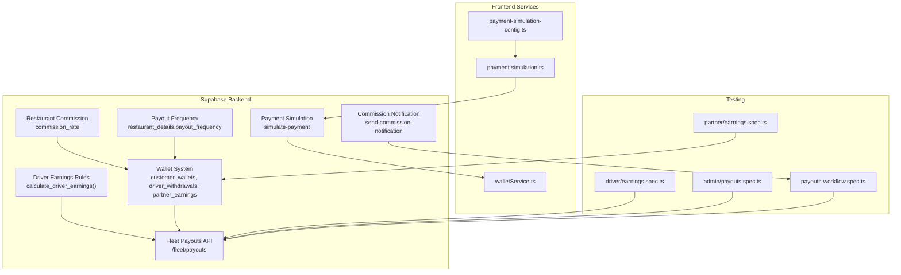
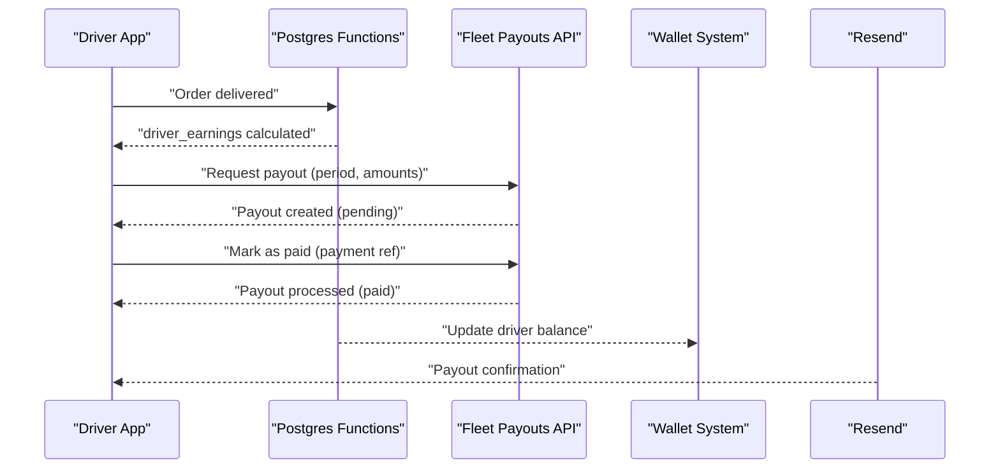
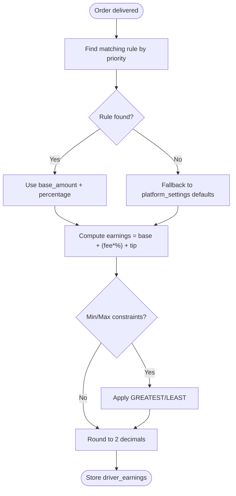
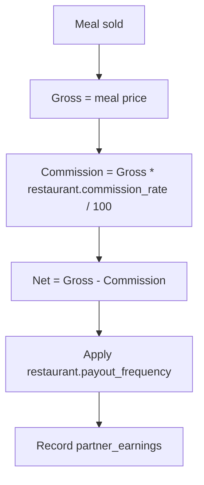
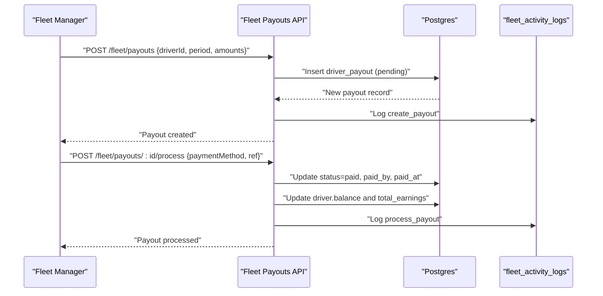
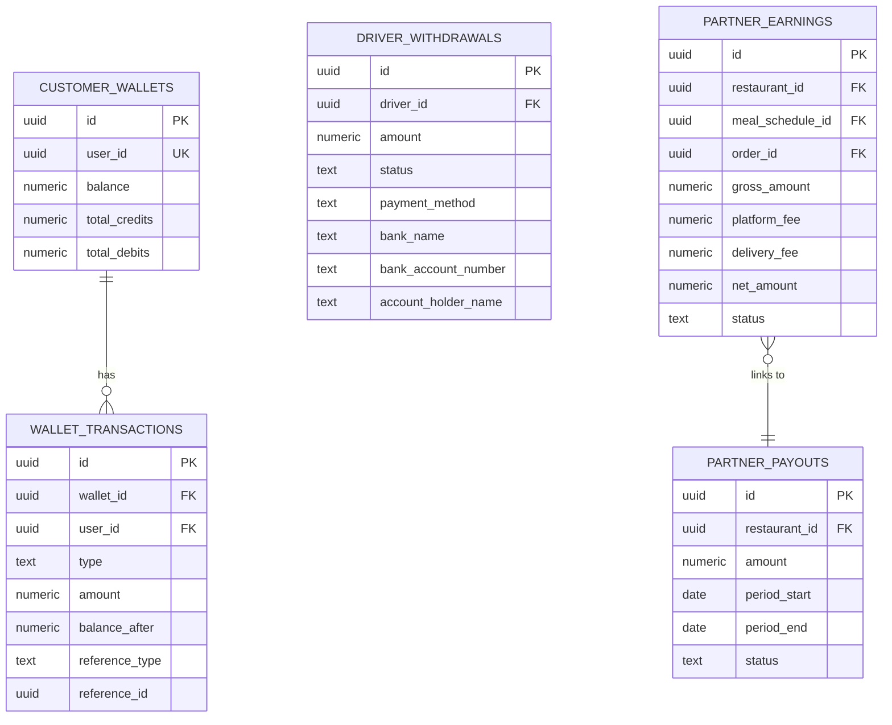
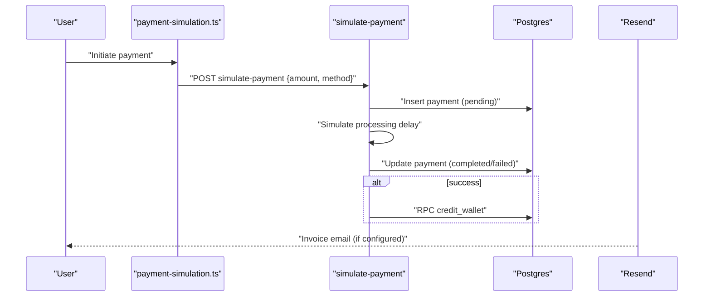
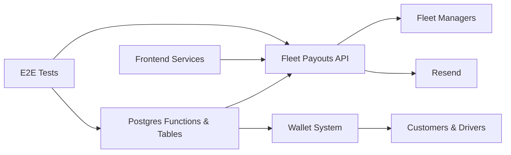

# Earnings Calculation & Payout Management

<cite>
**Referenced Files in This Document**
- [20260227_driver_earnings_config.sql](file://supabase/migrations/20260227_driver_earnings_config.sql)
- [20260313200001_add_commission_rate_to_restaurants.sql](file://supabase/migrations/20260313200001_add_commission_rate_to_restaurants.sql)
- [20260313200000_add_payout_frequency.sql](file://supabase/migrations/20260313200000_add_payout_frequency.sql)
- [20260218120000_wallet_system.sql](file://supabase/migrations/20260218120000_wallet_system.sql)
- [index.ts (fleet-payouts)](file://supabase/functions/fleet-payouts/index.ts)
- [index.ts (simulate-payment)](file://supabase/functions/simulate-payment/index.ts)
- [index.ts (send-commission-notification)](file://supabase/functions/send-commission-notification/index.ts)
- [payment-simulation.ts](file://src/lib/payment-simulation.ts)
- [payment-simulation-config.ts](file://src/lib/payment-simulation-config.ts)
- [walletService.ts](file://src/services/walletService.ts)
- [earnings.spec.ts (driver)](file://e2e/driver/earnings.spec.ts)
- [earnings.spec.ts (partner)](file://e2e/partner/earnings.spec.ts)
- [payouts.spec.ts (admin)](file://e2e/admin/payouts.spec.ts)
- [payouts-workflow.spec.ts](file://e2e/cross-portal/payouts-workflow.spec.ts)
</cite>

## Table of Contents
1. [Introduction](#introduction)
2. [Project Structure](#project-structure)
3. [Core Components](#core-components)
4. [Architecture Overview](#architecture-overview)
5. [Detailed Component Analysis](#detailed-component-analysis)
6. [Dependency Analysis](#dependency-analysis)
7. [Performance Considerations](#performance-considerations)
8. [Troubleshooting Guide](#troubleshooting-guide)
9. [Conclusion](#conclusion)

## Introduction
This document explains the earnings calculation and payout management system across three primary business units: drivers, restaurants/partners, and customers. It covers commission structures, base pay calculations, bonus algorithms, earnings statement generation, payout scheduling, withdrawal processing, bank account integration, tax document preparation, dispute resolution, payment reconciliation, and historical earnings tracking with detailed income breakdowns.

## Project Structure
The system spans Supabase database migrations and edge functions for backend logic, frontend services for wallet top-ups and payment simulation, and E2E tests validating workflows.

**Diagram sources**
- [20260227_driver_earnings_config.sql:98-180](file://supabase/migrations/20260227_driver_earnings_config.sql#L98-L180)
- [20260313200001_add_commission_rate_to_restaurants.sql:1-11](file://supabase/migrations/20260313200001_add_commission_rate_to_restaurants.sql#L1-L11)
- [20260313200000_add_payout_frequency.sql:1-4](file://supabase/migrations/20260313200000_add_payout_frequency.sql#L1-L4)
- [20260218120000_wallet_system.sql:1-710](file://supabase/migrations/20260218120000_wallet_system.sql#L1-L710)
- [index.ts (fleet-payouts):1-610](file://supabase/functions/fleet-payouts/index.ts#L1-L610)
- [index.ts (simulate-payment):1-119](file://supabase/functions/simulate-payment/index.ts#L1-L119)
- [index.ts (send-commission-notification):1-163](file://supabase/functions/send-commission-notification/index.ts#L1-L163)
- [payment-simulation.ts:1-223](file://src/lib/payment-simulation.ts#L1-L223)
- [payment-simulation-config.ts:1-79](file://src/lib/payment-simulation-config.ts#L1-L79)
- [walletService.ts:1-180](file://src/services/walletService.ts#L1-L180)

**Section sources**
- [20260227_driver_earnings_config.sql:1-272](file://supabase/migrations/20260227_driver_earnings_config.sql#L1-L272)
- [20260313200001_add_commission_rate_to_restaurants.sql:1-11](file://supabase/migrations/20260313200001_add_commission_rate_to_restaurants.sql#L1-L11)
- [20260313200000_add_payout_frequency.sql:1-4](file://supabase/migrations/20260313200000_add_payout_frequency.sql#L1-L4)
- [20260218120000_wallet_system.sql:1-710](file://supabase/migrations/20260218120000_wallet_system.sql#L1-L710)
- [index.ts (fleet-payouts):1-610](file://supabase/functions/fleet-payouts/index.ts#L1-L610)
- [index.ts (simulate-payment):1-119](file://supabase/functions/simulate-payment/index.ts#L1-L119)
- [index.ts (send-commission-notification):1-163](file://supabase/functions/send-commission-notification/index.ts#L1-L163)
- [payment-simulation.ts:1-223](file://src/lib/payment-simulation.ts#L1-L223)
- [payment-simulation-config.ts:1-79](file://src/lib/payment-simulation-config.ts#L1-L79)
- [walletService.ts:1-180](file://src/services/walletService.ts#L1-L180)

## Core Components
- Driver earnings engine: configurable rules with priority-based evaluation, base amount plus percentage of delivery fee, optional tips, and min/max constraints.
- Restaurant commission and payout frequency: platform commission percentage per meal and restaurant-level payout cadence.
- Wallet system: customer wallet top-ups with bonus packages, driver withdrawal requests, and partner earnings tracking with invoice generation.
- Fleet payout management: batch and individual driver payout creation, processing, and audit logging with idempotency support.
- Payment simulation: frontend and backend simulation of payment flows, 3D Secure verification, and outcomes.
- Commission notifications: automated emails to affiliates upon earning commissions.

**Section sources**
- [20260227_driver_earnings_config.sql:98-180](file://supabase/migrations/20260227_driver_earnings_config.sql#L98-L180)
- [20260313200001_add_commission_rate_to_restaurants.sql:1-11](file://supabase/migrations/20260313200001_add_commission_rate_to_restaurants.sql#L1-L11)
- [20260313200000_add_payout_frequency.sql:1-4](file://supabase/migrations/20260313200000_add_payout_frequency.sql#L1-L4)
- [20260218120000_wallet_system.sql:1-710](file://supabase/migrations/20260218120000_wallet_system.sql#L1-L710)
- [index.ts (fleet-payouts):186-315](file://supabase/functions/fleet-payouts/index.ts#L186-L315)
- [index.ts (simulate-payment):1-119](file://supabase/functions/simulate-payment/index.ts#L1-L119)
- [payment-simulation.ts:1-223](file://src/lib/payment-simulation.ts#L1-L223)
- [index.ts (send-commission-notification):1-163](file://supabase/functions/send-commission-notification/index.ts#L1-L163)

## Architecture Overview
The system integrates database-driven calculations, edge functions for orchestration, and frontend services for user-facing experiences. Drivers’ earnings are computed via a Postgres function with flexible rules. Fleet managers use a dedicated API to create and process payouts. Restaurants’ net earnings are derived from gross sales minus platform and delivery fees, with restaurant-specific commission rates. Customers can top up wallets with bonus packages, generating invoices and PDFs. Payments can be simulated for development and testing.

**Diagram sources**
- [20260227_driver_earnings_config.sql:185-216](file://supabase/migrations/20260227_driver_earnings_config.sql#L185-L216)
- [index.ts (fleet-payouts):186-428](file://supabase/functions/fleet-payouts/index.ts#L186-L428)
- [20260218120000_wallet_system.sql:279-333](file://supabase/migrations/20260218120000_wallet_system.sql#L279-L333)

## Detailed Component Analysis

### Driver Earnings Engine
- Rule evaluation: Highest-priority matching rule wins among global, city, restaurant, distance, and time-of-day categories.
- Calculation: Base amount + (delivery fee × percentage/100) + tip; min/max constraints applied if set; fallback to platform settings defaults.
- Auto-calculation: Trigger updates driver_earnings on delivery_jobs inserts/updates when delivery_fee or tip changes.

**Diagram sources**
- [20260227_driver_earnings_config.sql:98-180](file://supabase/migrations/20260227_driver_earnings_config.sql#L98-L180)

**Section sources**
- [20260227_driver_earnings_config.sql:98-180](file://supabase/migrations/20260227_driver_earnings_config.sql#L98-L180)

### Restaurant Commission and Payout Frequency
- Commission rate: Per-restaurant commission percentage subtracted from gross meal price to compute net payout.
- Payout frequency: Weekly, biweekly, or monthly cadence per restaurant.

**Diagram sources**
- [20260313200001_add_commission_rate_to_restaurants.sql:1-11](file://supabase/migrations/20260313200001_add_commission_rate_to_restaurants.sql#L1-L11)
- [20260313200000_add_payout_frequency.sql:1-4](file://supabase/migrations/20260313200000_add_payout_frequency.sql#L1-L4)
- [20260218120000_wallet_system.sql:392-442](file://supabase/migrations/20260218120000_wallet_system.sql#L392-L442)

**Section sources**
- [20260313200001_add_commission_rate_to_restaurants.sql:1-11](file://supabase/migrations/20260313200001_add_commission_rate_to_restaurants.sql#L1-L11)
- [20260313200000_add_payout_frequency.sql:1-4](file://supabase/migrations/20260313200000_add_payout_frequency.sql#L1-L4)
- [20260218120000_wallet_system.sql:392-442](file://supabase/migrations/20260218120000_wallet_system.sql#L392-L442)

### Fleet Payout Management API
- Endpoints:
  - GET /fleet/payouts: List payouts with filters, pagination, and summary totals.
  - POST /fleet/payouts: Create a payout with idempotency support.
  - POST /fleet/payouts/:id/process: Mark a payout as paid and update driver balance.
  - POST /fleet/payouts/bulk: Create payouts for eligible drivers in a city.
- Security: JWT validation, city access checks, and audit logging.
- Idempotency: Prevents duplicate payouts using idempotency_key.

**Diagram sources**
- [index.ts (fleet-payouts):56-184](file://supabase/functions/fleet-payouts/index.ts#L56-L184)
- [index.ts (fleet-payouts):186-315](file://supabase/functions/fleet-payouts/index.ts#L186-L315)
- [index.ts (fleet-payouts):317-428](file://supabase/functions/fleet-payouts/index.ts#L317-L428)
- [index.ts (fleet-payouts):430-558](file://supabase/functions/fleet-payouts/index.ts#L430-L558)

**Section sources**
- [index.ts (fleet-payouts):1-610](file://supabase/functions/fleet-payouts/index.ts#L1-L610)

### Wallet System and Payouts
- Customer wallet:
  - Top-up packages with fixed amounts and bonus percentages.
  - Credit/debit operations with transaction history.
- Driver withdrawals:
  - Requests with bank details and status tracking.
  - Balance adjustments and transaction records.
- Partner payouts:
  - Earnings tracked per order/mealschedule.
  - Payout records with method and reference numbers.

**Diagram sources**
- [20260218120000_wallet_system.sql:8-33](file://supabase/migrations/20260218120000_wallet_system.sql#L8-L33)
- [20260218120000_wallet_system.sql:237-354](file://supabase/migrations/20260218120000_wallet_system.sql#L237-L354)

**Section sources**
- [20260218120000_wallet_system.sql:1-710](file://supabase/migrations/20260218120000_wallet_system.sql#L1-L710)

### Payment Simulation and Wallet Top-up
- Frontend simulation:
  - Configurable success rate, delays, and 3D Secure behavior.
  - Real-time status updates and listener notifications.
- Backend simulation:
  - Creates payment records, simulates success/failure, and credits wallets accordingly.
- Wallet top-up service:
  - Credits wallet with base + bonus, creates invoice, generates PDF, and emails receipt.

**Diagram sources**
- [payment-simulation.ts:25-223](file://src/lib/payment-simulation.ts#L25-L223)
- [payment-simulation-config.ts:1-79](file://src/lib/payment-simulation-config.ts#L1-L79)
- [index.ts (simulate-payment):1-119](file://supabase/functions/simulate-payment/index.ts#L1-L119)
- [walletService.ts:13-137](file://src/services/walletService.ts#L13-L137)

**Section sources**
- [payment-simulation.ts:1-223](file://src/lib/payment-simulation.ts#L1-L223)
- [payment-simulation-config.ts:1-79](file://src/lib/payment-simulation-config.ts#L1-L79)
- [index.ts (simulate-payment):1-119](file://supabase/functions/simulate-payment/index.ts#L1-L119)
- [walletService.ts:1-180](file://src/services/walletService.ts#L1-L180)

### Commission Notifications
- Triggers when affiliate commissions are credited.
- Sends HTML email with commission details, tier classification, and account balances.

**Section sources**
- [index.ts (send-commission-notification):1-163](file://supabase/functions/send-commission-notification/index.ts#L1-L163)

### Earnings Statement Generation and Tax Documents
- Invoices:
  - Generated for wallet top-ups and other transaction types.
  - Line items, tax, and totals captured; PDFs produced and optionally emailed.
- Historical tracking:
  - Wallet transactions, driver wallet transactions, and partner earnings records maintain audit trails.

**Section sources**
- [20260218120000_wallet_system.sql:447-610](file://supabase/migrations/20260218120000_wallet_system.sql#L447-L610)
- [walletService.ts:139-180](file://src/services/walletService.ts#L139-L180)

### Dispute Resolution and Reconciliation
- Disputes:
  - Not explicitly modeled in the referenced files; however, driver_withdrawals and partner_payouts include rejection reasons and statuses suitable for dispute workflows.
- Reconciliation:
  - Fleet payout processing updates driver balances and logs actions for auditability.
  - Wallet transactions and invoices provide reconciliation points for customer and partner finances.

**Section sources**
- [20260218120000_wallet_system.sql:237-354](file://supabase/migrations/20260218120000_wallet_system.sql#L237-L354)
- [index.ts (fleet-payouts):317-428](file://supabase/functions/fleet-payouts/index.ts#L317-L428)

## Dependency Analysis
- Database functions depend on migration-defined tables and policies.
- Fleet payouts API depends on Supabase client and JWT validation.
- Frontend services depend on Supabase client and external providers (Resend for emails).
- Tests validate end-to-end flows for drivers, partners, and admin workflows.

**Diagram sources**
- [20260227_driver_earnings_config.sql:98-180](file://supabase/migrations/20260227_driver_earnings_config.sql#L98-L180)
- [20260218120000_wallet_system.sql:1-710](file://supabase/migrations/20260218120000_wallet_system.sql#L1-L710)
- [index.ts (fleet-payouts):1-610](file://supabase/functions/fleet-payouts/index.ts#L1-L610)
- [walletService.ts:1-180](file://src/services/walletService.ts#L1-L180)

**Section sources**
- [20260227_driver_earnings_config.sql:1-272](file://supabase/migrations/20260227_driver_earnings_config.sql#L1-L272)
- [20260218120000_wallet_system.sql:1-710](file://supabase/migrations/20260218120000_wallet_system.sql#L1-L710)
- [index.ts (fleet-payouts):1-610](file://supabase/functions/fleet-payouts/index.ts#L1-L610)
- [walletService.ts:1-180](file://src/services/walletService.ts#L1-L180)

## Performance Considerations
- Rule lookup performance: Indexes on driver_earning_rules improve filtering by type, priority, and validity timestamps.
- Idempotency: Fleet payouts use idempotency keys to prevent duplicate processing.
- Simulation tuning: Frontend and backend simulation configurations allow controlled latency and success rates for testing.

[No sources needed since this section provides general guidance]

## Troubleshooting Guide
- Driver earnings not updating:
  - Verify trigger on delivery_jobs and that delivery_fee/tip changes trigger recalculation.
- Payout creation failures:
  - Check JWT token validity, city access permissions, and idempotency key conflicts.
- Wallet top-up issues:
  - Confirm RPC credit_wallet invocation and invoice creation; inspect email provider configuration.
- Commission notifications:
  - Ensure Resend API key is set and user has an email address.

**Section sources**
- [20260227_driver_earnings_config.sql:185-216](file://supabase/migrations/20260227_driver_earnings_config.sql#L185-L216)
- [index.ts (fleet-payouts):186-315](file://supabase/functions/fleet-payouts/index.ts#L186-L315)
- [walletService.ts:13-137](file://src/services/walletService.ts#L13-L137)
- [index.ts (send-commission-notification):1-163](file://supabase/functions/send-commission-notification/index.ts#L1-L163)

## Conclusion
The system provides a robust, extensible framework for earnings calculation and payouts across drivers, restaurants, and customers. Flexible driver earnings rules, restaurant commission modeling, comprehensive wallet operations, and fleet-managed payout workflows integrate seamlessly with invoice generation and email notifications. The included simulation capabilities and E2E tests support reliable development and validation of financial flows.