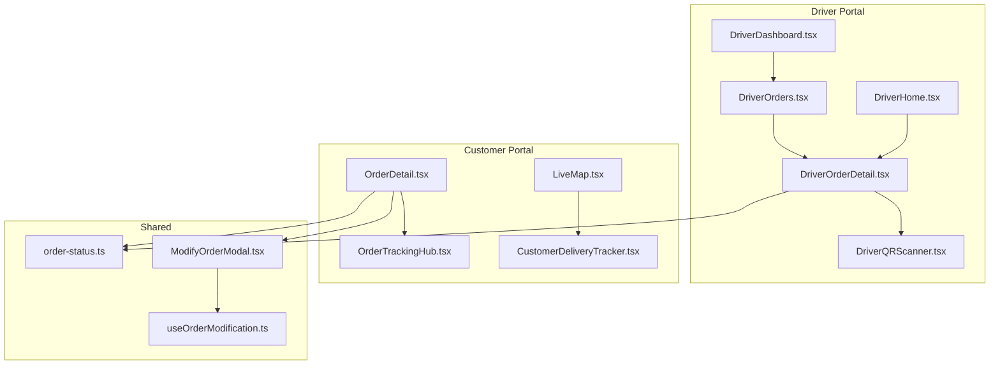
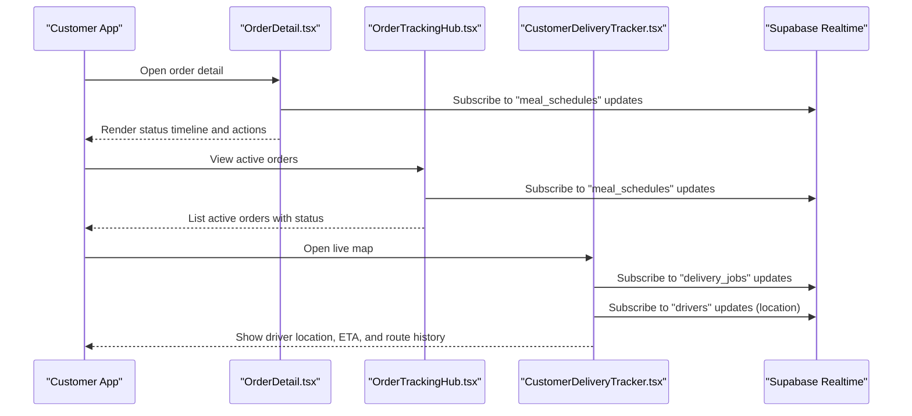
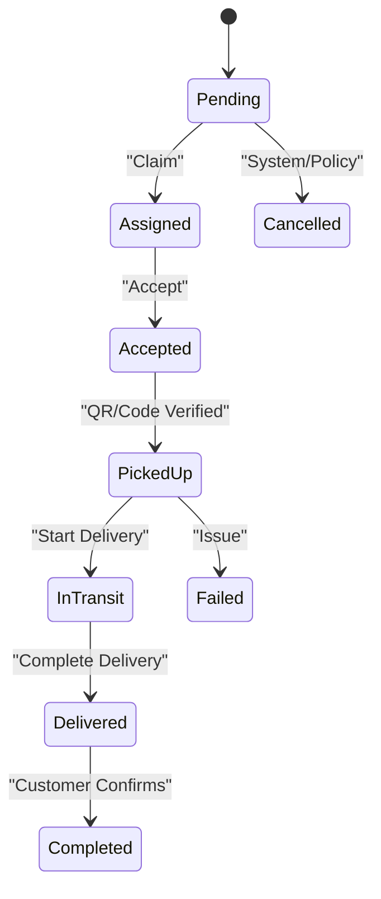
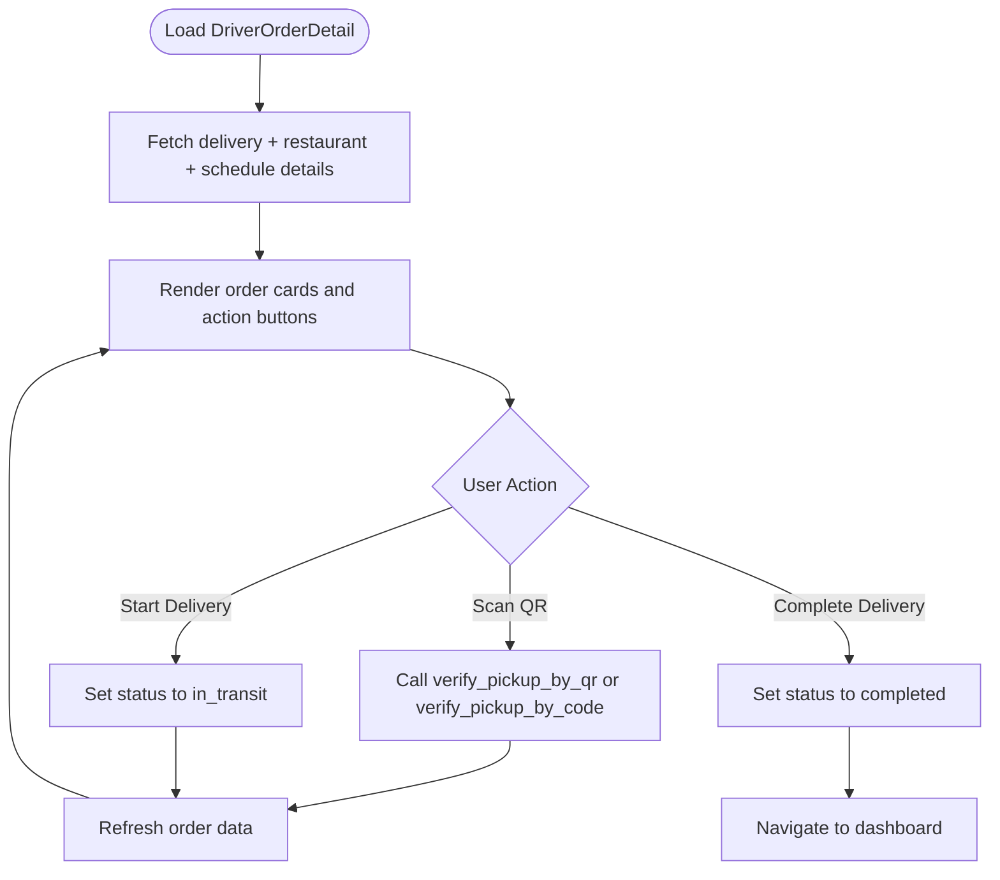
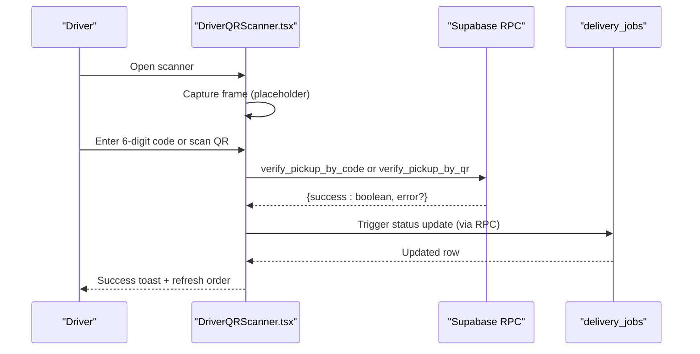
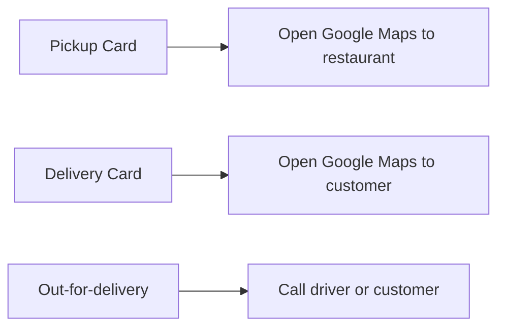
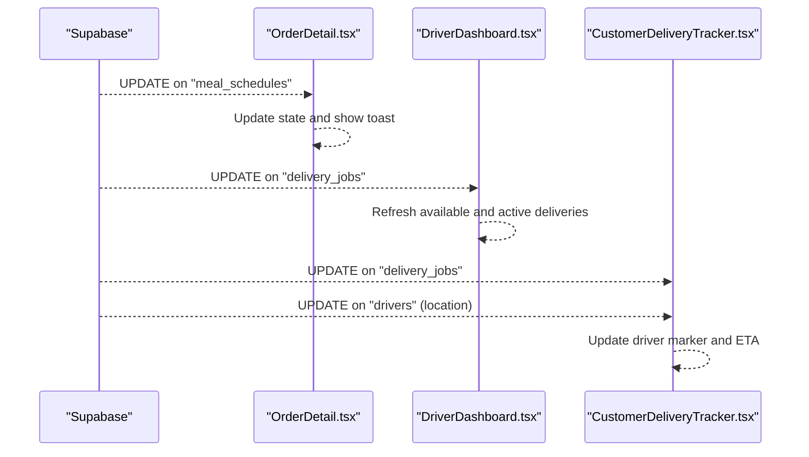
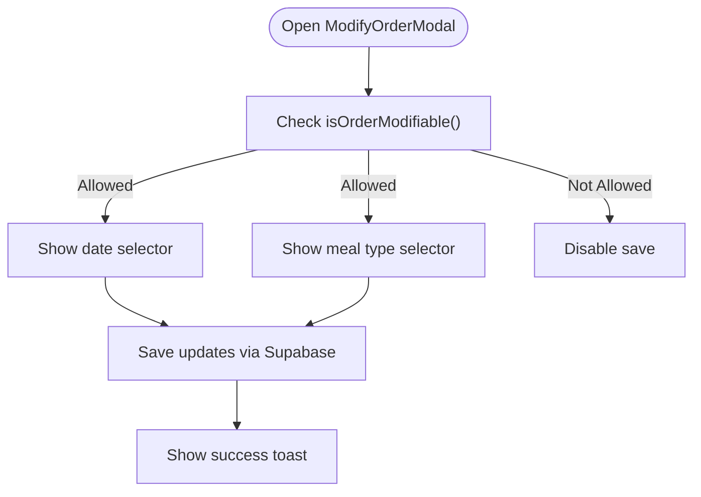
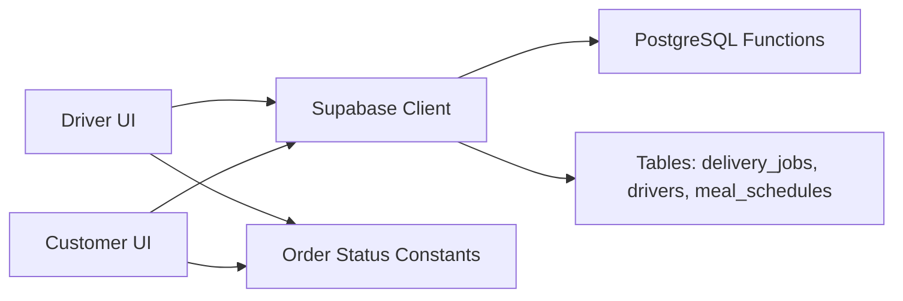

# Order Management & Tracking

<cite>
**Referenced Files in This Document**
- [DriverOrderDetail.tsx](file://src/pages/driver/DriverOrderDetail.tsx)
- [DriverOrders.tsx](file://src/pages/driver/DriverOrders.tsx)
- [DriverDashboard.tsx](file://src/pages/driver/DriverDashboard.tsx)
- [DriverHome.tsx](file://src/pages/driver/DriverHome.tsx)
- [DriverQRScanner.tsx](file://src/components/driver/DriverQRScanner.tsx)
- [OrderDetail.tsx](file://src/pages/OrderDetail.tsx)
- [OrderTrackingHub.tsx](file://src/components/OrderTrackingHub.tsx)
- [LiveMap.tsx](file://src/pages/LiveMap.tsx)
- [CustomerDeliveryTracker.tsx](file://src/components/customer/CustomerDeliveryTracker.tsx)
- [ModifyOrderModal.tsx](file://src/components/ModifyOrderModal.tsx)
- [useOrderModification.ts](file://src/hooks/useOrderModification.ts)
- [order-status.ts](file://src/lib/constants/order-status.ts)
</cite>

## Table of Contents
1. [Introduction](#introduction)
2. [Project Structure](#project-structure)
3. [Core Components](#core-components)
4. [Architecture Overview](#architecture-overview)
5. [Detailed Component Analysis](#detailed-component-analysis)
6. [Dependency Analysis](#dependency-analysis)
7. [Performance Considerations](#performance-considerations)
8. [Troubleshooting Guide](#troubleshooting-guide)
9. [Conclusion](#conclusion)
10. [Appendices](#appendices)

## Introduction
This document describes the driver order management and tracking system, covering the end-to-end order lifecycle from claiming to completion, real-time tracking, QR code-based pickup verification, navigation integration, order modification, and customer communication features. It synthesizes the driver portal, customer tracking experience, and backend Supabase integration to provide a comprehensive understanding of how orders are managed and tracked in real time.

## Project Structure
The order management system spans multiple pages and components:
- Driver portal: dashboard, order listing, individual order detail, QR scanner, and home screen with real-time job updates
- Customer portal: order detail page, tracking hub, live map, and customer delivery tracker
- Shared utilities: order status constants, order modification modal, and hooks for modifiability checks

**Diagram sources**
- [DriverDashboard.tsx:1-494](file://src/pages/driver/DriverDashboard.tsx#L1-L494)
- [DriverOrders.tsx:1-280](file://src/pages/driver/DriverOrders.tsx#L1-L280)
- [DriverOrderDetail.tsx:1-577](file://src/pages/driver/DriverOrderDetail.tsx#L1-L577)
- [DriverQRScanner.tsx:1-255](file://src/components/driver/DriverQRScanner.tsx#L1-L255)
- [DriverHome.tsx:1-538](file://src/pages/driver/DriverHome.tsx#L1-L538)
- [OrderDetail.tsx:1-777](file://src/pages/OrderDetail.tsx#L1-L777)
- [OrderTrackingHub.tsx:1-235](file://src/components/OrderTrackingHub.tsx#L1-L235)
- [LiveMap.tsx:1-20](file://src/pages/LiveMap.tsx#L1-L20)
- [CustomerDeliveryTracker.tsx:1-726](file://src/components/customer/CustomerDeliveryTracker.tsx#L1-L726)
- [ModifyOrderModal.tsx:1-203](file://src/components/ModifyOrderModal.tsx#L1-L203)
- [useOrderModification.ts:1-23](file://src/hooks/useOrderModification.ts#L1-L23)
- [order-status.ts:1-116](file://src/lib/constants/order-status.ts#L1-L116)

**Section sources**
- [DriverDashboard.tsx:1-494](file://src/pages/driver/DriverDashboard.tsx#L1-L494)
- [DriverOrders.tsx:1-280](file://src/pages/driver/DriverOrders.tsx#L1-L280)
- [DriverOrderDetail.tsx:1-577](file://src/pages/driver/DriverOrderDetail.tsx#L1-L577)
- [DriverQRScanner.tsx:1-255](file://src/components/driver/DriverQRScanner.tsx#L1-L255)
- [DriverHome.tsx:1-538](file://src/pages/driver/DriverHome.tsx#L1-L538)
- [OrderDetail.tsx:1-777](file://src/pages/OrderDetail.tsx#L1-L777)
- [OrderTrackingHub.tsx:1-235](file://src/components/OrderTrackingHub.tsx#L1-L235)
- [LiveMap.tsx:1-20](file://src/pages/LiveMap.tsx#L1-L20)
- [CustomerDeliveryTracker.tsx:1-726](file://src/components/customer/CustomerDeliveryTracker.tsx#L1-L726)
- [ModifyOrderModal.tsx:1-203](file://src/components/ModifyOrderModal.tsx#L1-L203)
- [useOrderModification.ts:1-23](file://src/hooks/useOrderModification.ts#L1-L23)
- [order-status.ts:1-116](file://src/lib/constants/order-status.ts#L1-L116)

## Core Components
- DriverDashboard: lists available deliveries, allows claiming, shows stats, and polls for updates
- DriverOrders: manages active and completed deliveries with tabs and real-time updates
- DriverOrderDetail: displays order details, handles QR verification, status transitions, and navigation
- DriverQRScanner: provides QR scanning and 6-digit code entry for pickup verification
- OrderDetail: customer-facing order detail with status timeline, actions, and real-time updates
- OrderTrackingHub: lists active orders and subscribes to real-time updates
- LiveMap and CustomerDeliveryTracker: renders live driver location, route history, ETA, and driver info
- ModifyOrderModal and useOrderModification: enables order modification within allowed constraints
- Order status constants: unified status definitions and helpers for UI rendering

**Section sources**
- [DriverDashboard.tsx:1-494](file://src/pages/driver/DriverDashboard.tsx#L1-L494)
- [DriverOrders.tsx:1-280](file://src/pages/driver/DriverOrders.tsx#L1-L280)
- [DriverOrderDetail.tsx:1-577](file://src/pages/driver/DriverOrderDetail.tsx#L1-L577)
- [DriverQRScanner.tsx:1-255](file://src/components/driver/DriverQRScanner.tsx#L1-L255)
- [OrderDetail.tsx:1-777](file://src/pages/OrderDetail.tsx#L1-L777)
- [OrderTrackingHub.tsx:1-235](file://src/components/OrderTrackingHub.tsx#L1-L235)
- [LiveMap.tsx:1-20](file://src/pages/LiveMap.tsx#L1-L20)
- [CustomerDeliveryTracker.tsx:1-726](file://src/components/customer/CustomerDeliveryTracker.tsx#L1-L726)
- [ModifyOrderModal.tsx:1-203](file://src/components/ModifyOrderModal.tsx#L1-L203)
- [useOrderModification.ts:1-23](file://src/hooks/useOrderModification.ts#L1-L23)
- [order-status.ts:1-116](file://src/lib/constants/order-status.ts#L1-L116)

## Architecture Overview
The system uses Supabase for real-time data synchronization and PostgreSQL functions for atomic operations and computed details. The driver and customer portals share a unified status model and rely on Postgres Realtime channels for live updates.

**Diagram sources**
- [OrderDetail.tsx:174-220](file://src/pages/OrderDetail.tsx#L174-L220)
- [OrderTrackingHub.tsx:94-114](file://src/components/OrderTrackingHub.tsx#L94-L114)
- [CustomerDeliveryTracker.tsx:124-207](file://src/components/customer/CustomerDeliveryTracker.tsx#L124-L207)

**Section sources**
- [OrderDetail.tsx:174-220](file://src/pages/OrderDetail.tsx#L174-L220)
- [OrderTrackingHub.tsx:94-114](file://src/components/OrderTrackingHub.tsx#L94-L114)
- [CustomerDeliveryTracker.tsx:124-207](file://src/components/customer/CustomerDeliveryTracker.tsx#L124-L207)

## Detailed Component Analysis

### Driver Order Lifecycle and State Management
The driver lifecycle progresses through distinct states with explicit transitions:
- Pending: available for claiming
- Assigned: driver claimed the job (mapped to UI as "Claimed")
- Accepted: driver accepted job (mapped to UI as "Accepted")
- Picked Up: driver scanned QR or entered 6-digit code to confirm pickup
- In Transit: driver started delivery
- Delivered: driver completed delivery
- Completed: customer confirmed delivery
- Failed/Cancelled: exceptional states

**Diagram sources**
- [DriverOrderDetail.tsx:44-53](file://src/pages/driver/DriverOrderDetail.tsx#L44-L53)
- [DriverDashboard.tsx:303-352](file://src/pages/driver/DriverDashboard.tsx#L303-L352)
- [DriverOrders.tsx:29-38](file://src/pages/driver/DriverOrders.tsx#L29-L38)

Key driver state transitions:
- Claiming: atomic RPC prevents race conditions
- Pickup verification: supports QR code or 6-digit verification code
- Delivery completion: updates both delivery_jobs and triggers downstream sync

**Section sources**
- [DriverOrderDetail.tsx:182-224](file://src/pages/driver/DriverOrderDetail.tsx#L182-L224)
- [DriverOrderDetail.tsx:231-283](file://src/pages/driver/DriverOrderDetail.tsx#L231-L283)
- [DriverDashboard.tsx:303-352](file://src/pages/driver/DriverDashboard.tsx#L303-L352)
- [DriverQRScanner.tsx:95-99](file://src/components/driver/DriverQRScanner.tsx#L95-L99)

### Driver Order Detail Interface
The driver order detail page presents:
- Order status badge and total earnings
- Pickup location (restaurant) with navigation and call buttons
- Order specifics (meal, calories, addons, special instructions)
- Delivery location (customer) with navigation and call buttons
- Delivery notes field (optional)
- Action buttons aligned to current state (Scan QR to Pickup, Start Delivery, Complete Delivery)

**Diagram sources**
- [DriverOrderDetail.tsx:98-180](file://src/pages/driver/DriverOrderDetail.tsx#L98-L180)
- [DriverOrderDetail.tsx:182-224](file://src/pages/driver/DriverOrderDetail.tsx#L182-L224)
- [DriverOrderDetail.tsx:231-283](file://src/pages/driver/DriverOrderDetail.tsx#L231-L283)

**Section sources**
- [DriverOrderDetail.tsx:315-577](file://src/pages/driver/DriverOrderDetail.tsx#L315-L577)

### QR Code Scanning for Pickup Verification
The QR scanner supports:
- Camera-based scanning overlay (placeholder; relies on manual entry)
- Manual 6-digit code entry
- Validation against two RPC functions:
  - verify_pickup_by_code (verification code)
  - verify_pickup_by_qr (QR payload)
- Immediate UI feedback and automatic refresh of order details upon success

**Diagram sources**
- [DriverQRScanner.tsx:26-93](file://src/components/driver/DriverQRScanner.tsx#L26-L93)
- [DriverQRScanner.tsx:95-99](file://src/components/driver/DriverQRScanner.tsx#L95-L99)
- [DriverOrderDetail.tsx:231-283](file://src/pages/driver/DriverOrderDetail.tsx#L231-L283)

**Section sources**
- [DriverQRScanner.tsx:1-255](file://src/components/driver/DriverQRScanner.tsx#L1-L255)
- [DriverOrderDetail.tsx:231-283](file://src/pages/driver/DriverOrderDetail.tsx#L231-L283)

### Navigation Integration and Turn-by-Turn Directions
Navigation is integrated via deep links to Google Maps:
- Restaurant pickup location: "Navigate to Pickup"
- Customer delivery location: "Navigate to Customer"
- Driver phone/email contact: "Call Driver" during out-for-delivery stage

**Diagram sources**
- [DriverOrderDetail.tsx:226-229](file://src/pages/driver/DriverOrderDetail.tsx#L226-L229)
- [OrderDetail.tsx:642-668](file://src/pages/OrderDetail.tsx#L642-L668)

**Section sources**
- [DriverOrderDetail.tsx:370-389](file://src/pages/driver/DriverOrderDetail.tsx#L370-L389)
- [DriverOrderDetail.tsx:437-456](file://src/pages/driver/DriverOrderDetail.tsx#L437-L456)
- [OrderDetail.tsx:642-668](file://src/pages/OrderDetail.tsx#L642-L668)

### Real-Time Order Tracking System
Real-time updates are powered by Supabase Postgres Realtime:
- Customer order detail: subscribes to "meal_schedules" updates and shows toast notifications on status changes
- Driver dashboard: subscribes to "delivery_jobs" updates and polls as fallback
- Customer live map: subscribes to "delivery_jobs" and "drivers" updates; also polls for driver location

**Diagram sources**
- [OrderDetail.tsx:177-220](file://src/pages/OrderDetail.tsx#L177-L220)
- [DriverDashboard.tsx:64-90](file://src/pages/driver/DriverDashboard.tsx#L64-L90)
- [CustomerDeliveryTracker.tsx:128-207](file://src/components/customer/CustomerDeliveryTracker.tsx#L128-L207)

**Section sources**
- [OrderDetail.tsx:177-220](file://src/pages/OrderDetail.tsx#L177-L220)
- [DriverDashboard.tsx:64-90](file://src/pages/driver/DriverDashboard.tsx#L64-L90)
- [CustomerDeliveryTracker.tsx:128-207](file://src/components/customer/CustomerDeliveryTracker.tsx#L128-L207)

### Order Modification Capabilities
Customers can modify orders within allowed constraints:
- Allowed modifications: change scheduled date or meal type
- Constraints: order must not be delivered, cancelled, in transit, or preparing
- Future-dated constraint: scheduled date must be today or later

**Diagram sources**
- [ModifyOrderModal.tsx:86-122](file://src/components/ModifyOrderModal.tsx#L86-L122)
- [useOrderModification.ts:6-22](file://src/hooks/useOrderModification.ts#L6-L22)

**Section sources**
- [ModifyOrderModal.tsx:1-203](file://src/components/ModifyOrderModal.tsx#L1-L203)
- [useOrderModification.ts:1-23](file://src/hooks/useOrderModification.ts#L1-L23)

### Customer Communication Features
- Driver assignment and contact: when out-for-delivery, customer can call the assigned driver
- Real-time status notifications: toast messages on status changes
- Delivery notes: optional notes captured during delivery completion

**Section sources**
- [OrderDetail.tsx:222-250](file://src/pages/OrderDetail.tsx#L222-L250)
- [OrderDetail.tsx:191-206](file://src/pages/OrderDetail.tsx#L191-L206)
- [DriverOrderDetail.tsx:463-471](file://src/pages/driver/DriverOrderDetail.tsx#L463-L471)

### Practical Examples of Common Order Scenarios
- Driver claims an available order:
  - Use the claim action on the dashboard; the system calls an atomic RPC to assign the job
- Driver scans QR to confirm pickup:
  - Open the order detail, click "Scan QR to Pickup", enter 6-digit code or scan QR, then status updates automatically
- Driver starts delivery:
  - After successful pickup verification, click "Start Delivery" to move to in-transit
- Customer receives the order:
  - Customer taps "Received" on the order detail, then "Mark Completed" after confirming
- Customer tracks driver live:
  - Open the live map to view driver location, ETA, and route history

**Section sources**
- [DriverDashboard.tsx:303-352](file://src/pages/driver/DriverDashboard.tsx#L303-L352)
- [DriverOrderDetail.tsx:475-545](file://src/pages/driver/DriverOrderDetail.tsx#L475-L545)
- [OrderDetail.tsx:729-757](file://src/pages/OrderDetail.tsx#L729-L757)
- [LiveMap.tsx:1-20](file://src/pages/LiveMap.tsx#L1-L20)
- [CustomerDeliveryTracker.tsx:568-635](file://src/components/customer/CustomerDeliveryTracker.tsx#L568-L635)

## Dependency Analysis
The system exhibits clear separation of concerns:
- UI components depend on Supabase client for data and subscriptions
- Driver lifecycle depends on PostgreSQL functions for atomic operations
- Status rendering is centralized via shared constants
- Real-time updates propagate across customer and driver views

**Diagram sources**
- [DriverDashboard.tsx:92-116](file://src/pages/driver/DriverDashboard.tsx#L92-L116)
- [OrderDetail.tsx:177-220](file://src/pages/OrderDetail.tsx#L177-L220)
- [order-status.ts:1-116](file://src/lib/constants/order-status.ts#L1-L116)

**Section sources**
- [DriverDashboard.tsx:92-116](file://src/pages/driver/DriverDashboard.tsx#L92-L116)
- [OrderDetail.tsx:177-220](file://src/pages/OrderDetail.tsx#L177-L220)
- [order-status.ts:1-116](file://src/lib/constants/order-status.ts#L1-L116)

## Performance Considerations
- Minimize nested queries: components fetch related data via separate queries and RPC functions to avoid PostgREST FK limitations
- Real-time subscriptions: use targeted filters and unsubscribe on component unmount to reduce bandwidth
- Polling fallback: periodic polling complements real-time updates for reliability
- Lazy loading: map components are lazily loaded to improve initial render performance

[No sources needed since this section provides general guidance]

## Troubleshooting Guide
Common issues and resolutions:
- Driver cannot claim order:
  - Ensure driver is online and no active delivery exists; the atomic RPC returns specific error codes for locked, not found, already claimed, invalid state, unavailable, or busy states
- QR scan fails:
  - Use manual 6-digit code entry; verify the code matches the restaurant’s display
- Driver location not updating:
  - Confirm driver is assigned; the system subscribes to "drivers" updates and falls back to polling
- Order not refreshing:
  - Use the refresh controls in dashboard and tracking hub; ensure browser supports WebSockets for real-time updates

**Section sources**
- [DriverDashboard.tsx:318-334](file://src/pages/driver/DriverDashboard.tsx#L318-L334)
- [DriverQRScanner.tsx:95-99](file://src/components/driver/DriverQRScanner.tsx#L95-L99)
- [CustomerDeliveryTracker.tsx:152-207](file://src/components/customer/CustomerDeliveryTracker.tsx#L152-L207)

## Conclusion
The order management and tracking system integrates a robust driver workflow with real-time customer visibility. Atomic operations ensure reliable state transitions, while Supabase Realtime keeps both driver and customer apps synchronized. QR-based pickup verification, navigation deep links, and live tracking provide a seamless delivery experience, complemented by order modification capabilities under defined constraints.

## Appendices
- Unified order status definitions and helpers are centralized for consistent UI rendering across customer and driver experiences.

**Section sources**
- [order-status.ts:1-116](file://src/lib/constants/order-status.ts#L1-L116)