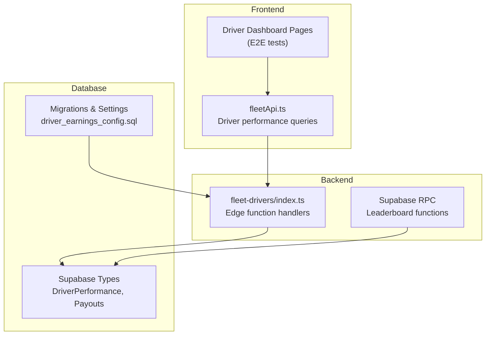
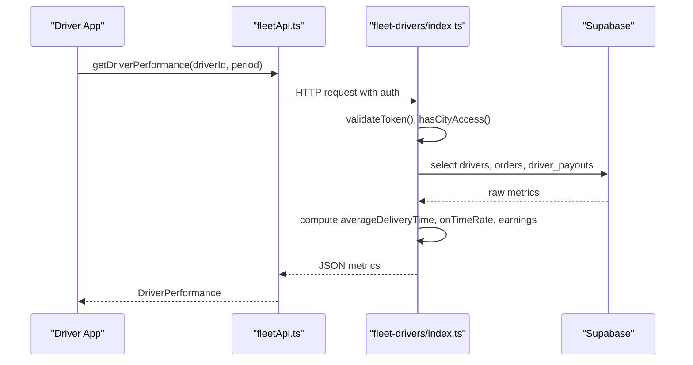
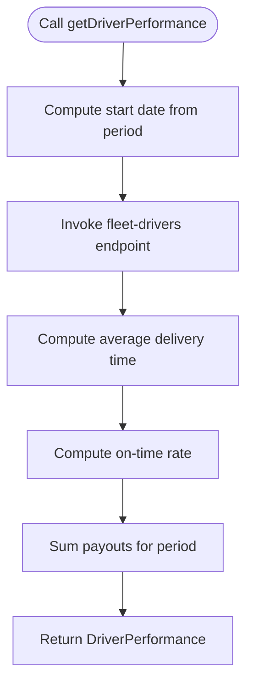
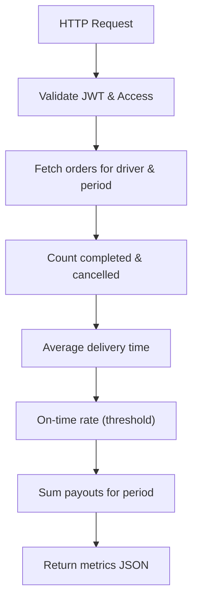
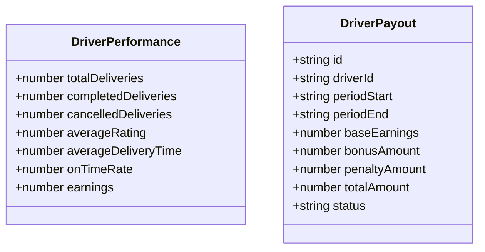
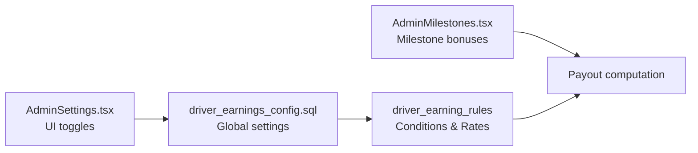
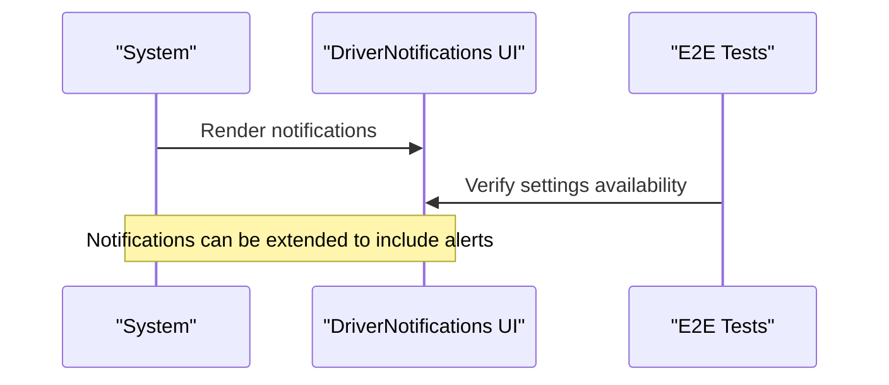
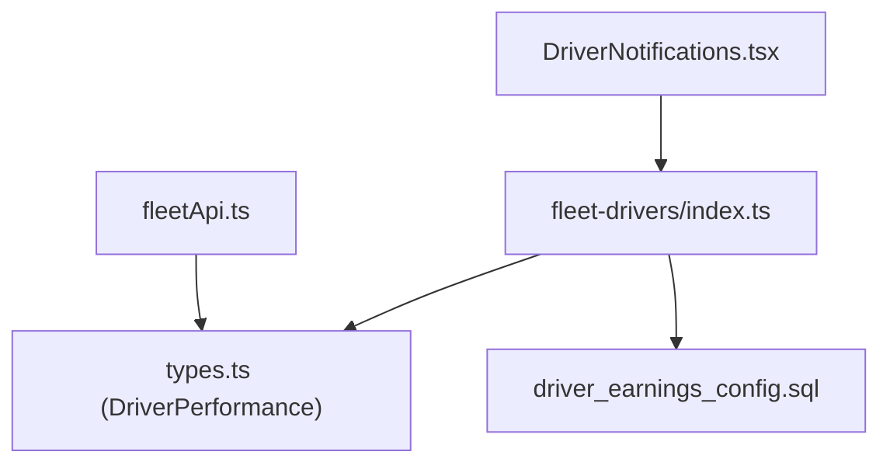

# Performance Analytics & Ratings

<cite>
**Referenced Files in This Document**
- [fleetApi.ts](file://src/fleet/services/fleetApi.ts)
- [index.ts](file://supabase/functions/fleet-drivers/index.ts)
- [types.ts](file://src/fleet/types/fleet.ts)
- [dashboard.spec.ts](file://e2e/driver/dashboard.spec.ts)
- [AdminSettings.tsx](file://src/pages/admin/AdminSettings.tsx)
- [2026-03-07-lean-launch-operation-plan.html](file://docs/plans/2026-03-07-lean-launch-operation-plan.html)
- [2026-03-07-lean-launch-operation-plan-v2.html](file://docs/plans/2026-03-07-lean-launch-operation-plan-v2.html)
- [notifications-workflow.spec.ts](file://e2e/cross-portal/notifications-workflow.spec.ts)
- [notifications.spec.ts](file://e2e/driver/notifications.spec.ts)
- [DriverNotifications.tsx](file://src/pages/driver/DriverNotifications.tsx)
- [DriverNotifications-kr_MyAKD.js](file://android/app/src/main/assets/public/assets/DriverNotifications-kr_MyAKD.js)
- [DriverNotifications-kr_MyAKD.js](file://ios/App/App/public/assets/DriverNotifications-kr_MyAKD.js)
- [20260227_driver_earnings_config.sql](file://supabase/migrations/20260227_driver_earnings_config.sql)
- [PayoutProcessing.tsx](file://src/fleet/pages/PayoutProcessing.tsx)
- [AdminMilestones.tsx](file://src/pages/admin/AdminMilestones.tsx)
- [types.ts](file://supabase/types.ts)
</cite>

## Table of Contents
1. [Introduction](#introduction)
2. [Project Structure](#project-structure)
3. [Core Components](#core-components)
4. [Architecture Overview](#architecture-overview)
5. [Detailed Component Analysis](#detailed-component-analysis)
6. [Dependency Analysis](#dependency-analysis)
7. [Performance Considerations](#performance-considerations)
8. [Troubleshooting Guide](#troubleshooting-guide)
9. [Conclusion](#conclusion)

## Introduction
This document describes the driver performance analytics and ratings system, focusing on the performance metrics dashboard, rating mechanisms, incentive programs, historical tracking, peer comparison, and alerting. It synthesizes frontend service APIs, backend edge functions, database types, and configuration to present a complete picture of how driver performance is measured, visualized, and incentivized.

## Project Structure
The performance analytics system spans three primary layers:
- Frontend services: driver performance retrieval and dashboard wiring
- Backend edge functions: computation of performance metrics and leaderboard data
- Database and configuration: typed models, stored procedures, and runtime settings

**Diagram sources**
- [fleetApi.ts:422-446](file://src/fleet/services/fleetApi.ts#L422-L446)
- [index.ts:621-712](file://supabase/functions/fleet-drivers/index.ts#L621-L712)
- [types.ts:172-180](file://src/fleet/types/fleet.ts#L172-L180)
- [20260227_driver_earnings_config.sql:29-61](file://supabase/migrations/20260227_driver_earnings_config.sql#L29-L61)

**Section sources**
- [fleetApi.ts:422-446](file://src/fleet/services/fleetApi.ts#L422-L446)
- [index.ts:621-712](file://supabase/functions/fleet-drivers/index.ts#L621-L712)
- [types.ts:172-180](file://src/fleet/types/fleet.ts#L172-L180)

## Core Components
- Driver performance service: retrieves and computes metrics for a given driver and period
- Edge function handlers: compute on-time performance, earnings, and leaderboard entries
- Types and contracts: define the shape of performance data and payouts
- Configuration: driver earnings rules and thresholds
- Notifications: driver-facing alerts and reminders

**Section sources**
- [fleetApi.ts:422-446](file://src/fleet/services/fleetApi.ts#L422-L446)
- [index.ts:621-712](file://supabase/functions/fleet-drivers/index.ts#L621-L712)
- [types.ts:172-180](file://src/fleet/types/fleet.ts#L172-L180)
- [20260227_driver_earnings_config.sql:29-61](file://supabase/migrations/20260227_driver_earnings_config.sql#L29-L61)

## Architecture Overview
The system follows a clean separation of concerns:
- Frontend calls fleetApi.ts to request driver performance
- Edge function index.ts validates tokens, enforces city access, and computes metrics
- Supabase types define the data contracts
- Configuration migrations define global driver settings
- Notifications surface actionable insights to drivers

**Diagram sources**
- [fleetApi.ts:422-446](file://src/fleet/services/fleetApi.ts#L422-L446)
- [index.ts:621-712](file://supabase/functions/fleet-drivers/index.ts#L621-L712)

## Detailed Component Analysis

### Driver Performance Metrics Service
The frontend service exposes a method to fetch driver performance for a selected period. It constructs a date range and queries the backend for computed metrics.

**Diagram sources**
- [fleetApi.ts:422-446](file://src/fleet/services/fleetApi.ts#L422-L446)
- [index.ts:661-699](file://supabase/functions/fleet-drivers/index.ts#L661-L699)

**Section sources**
- [fleetApi.ts:422-446](file://src/fleet/services/fleetApi.ts#L422-L446)
- [index.ts:621-712](file://supabase/functions/fleet-drivers/index.ts#L621-L712)

### Edge Function Metrics Computation
The edge function performs:
- Period slicing from driver creation or a configurable window
- Aggregation over orders: completed, cancelled, delivery times
- On-time rate calculation against a fixed threshold
- Earnings aggregation from driver payouts
- City access control and token validation

**Diagram sources**
- [index.ts:621-712](file://supabase/functions/fleet-drivers/index.ts#L621-L712)

**Section sources**
- [index.ts:621-712](file://supabase/functions/fleet-drivers/index.ts#L621-L712)

### Data Contracts and Types
DriverPerformance defines the shape of returned metrics. Payout types capture earnings summaries used for computations.

**Diagram sources**
- [types.ts:172-180](file://src/fleet/types/fleet.ts#L172-L180)
- [types.ts:243-276](file://src/fleet/types/fleet.ts#L243-L276)

**Section sources**
- [types.ts:172-180](file://src/fleet/types/fleet.ts#L172-L180)
- [types.ts:243-276](file://src/fleet/types/fleet.ts#L243-L276)

### Rating System and Customer Feedback
- Average rating is included in the metrics computation
- Cancellation rate is exposed in the driver profile and used in performance calculations
- Customer satisfaction scores can be derived from order ratings captured in the orders dataset

**Section sources**
- [index.ts:632-636](file://supabase/functions/fleet-drivers/index.ts#L632-L636)
- [index.ts:671-678](file://supabase/functions/fleet-drivers/index.ts#L671-L678)

### Incentive Programs and Reward Structures
- Driver earnings configuration supports flexible rules (global, city, restaurant, distance, time-of-day)
- Admin settings expose toggles for distance tiers, city multipliers, and peak-hour bonuses
- Milestone configurations enable bonus rewards for performance thresholds

**Diagram sources**
- [20260227_driver_earnings_config.sql:29-61](file://supabase/migrations/20260227_driver_earnings_config.sql#L29-L61)
- [AdminSettings.tsx:630-834](file://src/pages/admin/AdminSettings.tsx#L630-L834)
- [AdminMilestones.tsx:340-368](file://src/pages/admin/AdminMilestones.tsx#L340-L368)

**Section sources**
- [20260227_driver_earnings_config.sql:29-61](file://supabase/migrations/20260227_driver_earnings_config.sql#L29-L61)
- [AdminSettings.tsx:630-834](file://src/pages/admin/AdminSettings.tsx#L630-L834)
- [AdminMilestones.tsx:340-368](file://src/pages/admin/AdminMilestones.tsx#L340-L368)

### Historical Performance Tracking and Trends
- The performance endpoint aggregates metrics over a sliding window (e.g., 30 days)
- Earnings are summed per period to show growth trends
- Delivery time averages and on-time rates can be tracked over time to identify improvement patterns

**Section sources**
- [index.ts:621-712](file://supabase/functions/fleet-drivers/index.ts#L621-L712)

### Peer Comparison and Leaderboards
- Leaderboard entries and leaderboards tables define ranking structures
- RPC functions can be used to fetch top performers by earnings or other metrics
- The presence of leaderboard entries indicates a framework for peer comparison

**Section sources**
- [types.ts:1200-1270](file://supabase/types.ts#L1200-L1270)

### Performance Alerts and Notifications
- Driver notifications UI exists and surfaces empty-state messaging
- Cross-portal tests indicate notification settings are available for drivers
- Notifications can be leveraged to alert underperforming drivers (e.g., low on-time rate, high cancellations)

**Diagram sources**
- [DriverNotifications.tsx:1-17](file://src/pages/driver/DriverNotifications.tsx#L1-L17)
- [notifications-workflow.spec.ts:372-385](file://e2e/cross-portal/notifications-workflow.spec.ts#L372-L385)
- [notifications.spec.ts:1-22](file://e2e/driver/notifications.spec.ts#L1-L22)

**Section sources**
- [DriverNotifications.tsx:1-17](file://src/pages/driver/DriverNotifications.tsx#L1-L17)
- [notifications-workflow.spec.ts:372-385](file://e2e/cross-portal/notifications-workflow.spec.ts#L372-L385)
- [notifications.spec.ts:1-22](file://e2e/driver/notifications.spec.ts#L1-L22)

### Delivery SLAs and Performance Targets
- Operational plans define target SLAs for pickup, delivery, total order time, on-time rate, and driver acceptance
- These targets inform alert thresholds and performance benchmarks

**Section sources**
- [2026-03-07-lean-launch-operation-plan.html:1080-1094](file://docs/plans/2026-03-07-lean-launch-operation-plan.html#L1080-L1094)
- [2026-03-07-lean-launch-operation-plan-v2.html:1334-1360](file://docs/plans/2026-03-07-lean-launch-operation-plan-v2.html#L1334-L1360)

### Examples of Performance Scenarios and Strategies
- Scenario: Low on-time rate
  - Strategy: Reduce delivery time by optimizing routes, avoiding traffic, and improving pickup efficiency
- Scenario: Declining earnings
  - Strategy: Increase active hours during peak periods, leverage distance and time-of-day bonuses, and meet milestone targets
- Scenario: High cancellation rate
  - Strategy: Improve communication with customers, manage workload, and maintain vehicle readiness

[No sources needed since this section provides general guidance]

## Dependency Analysis
The system exhibits clear separation of concerns with explicit dependencies:
- fleetApi.ts depends on Supabase client and types
- Edge function index.ts depends on Supabase client, JWT validation, and city access control
- Types define contracts consumed by both frontend and backend
- Configuration migrations influence payout computations
- Notifications depend on UI components and test coverage

**Diagram sources**
- [fleetApi.ts:422-446](file://src/fleet/services/fleetApi.ts#L422-L446)
- [index.ts:621-712](file://supabase/functions/fleet-drivers/index.ts#L621-L712)
- [types.ts:172-180](file://src/fleet/types/fleet.ts#L172-L180)
- [20260227_driver_earnings_config.sql:29-61](file://supabase/migrations/20260227_driver_earnings_config.sql#L29-L61)
- [DriverNotifications.tsx:1-17](file://src/pages/driver/DriverNotifications.tsx#L1-L17)

**Section sources**
- [fleetApi.ts:422-446](file://src/fleet/services/fleetApi.ts#L422-L446)
- [index.ts:621-712](file://supabase/functions/fleet-drivers/index.ts#L621-L712)
- [types.ts:172-180](file://src/fleet/types/fleet.ts#L172-L180)
- [20260227_driver_earnings_config.sql:29-61](file://supabase/migrations/20260227_driver_earnings_config.sql#L29-L61)
- [DriverNotifications.tsx:1-17](file://src/pages/driver/DriverNotifications.tsx#L1-L17)

## Performance Considerations
- Token validation and city access checks occur in the edge function; ensure efficient logging and minimal repeated queries
- Use pagination and range limits for driver listings and performance queries
- Cache frequently accessed metrics where appropriate to reduce database load
- Monitor edge function cold starts and consider warm-up strategies for high-frequency endpoints

[No sources needed since this section provides general guidance]

## Troubleshooting Guide
- Authentication failures: Verify JWT secret and token type validation in the edge function
- Unauthorized city access: Confirm manager’s assigned cities and enforcement logic
- Empty performance data: Ensure orders exist within the selected period and driver payouts are recorded
- Notification UI issues: Validate asset paths and localization bundles for Android and iOS

**Section sources**
- [index.ts:19-36](file://supabase/functions/fleet-drivers/index.ts#L19-L36)
- [index.ts:38-54](file://supabase/functions/fleet-drivers/index.ts#L38-L54)
- [DriverNotifications.tsx:1-17](file://src/pages/driver/DriverNotifications.tsx#L1-L17)
- [DriverNotifications-kr_MyAKD.js:1-2](file://android/app/src/main/assets/public/assets/DriverNotifications-kr_MyAKD.js#L1-L2)
- [DriverNotifications-kr_MyAKD.js:1-2](file://ios/App/App/public/assets/DriverNotifications-kr_MyAKD.js#L1-L2)

## Conclusion
The driver performance analytics and ratings system integrates frontend services, backend edge functions, and database configurations to deliver actionable insights. With configurable earnings rules, milestone-based incentives, and notification capabilities, the system supports continuous improvement and fair recognition of driver performance while aligning with operational SLAs.