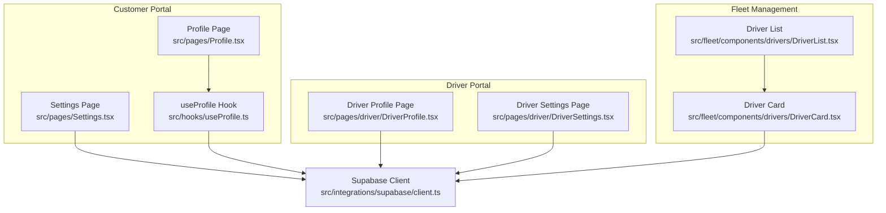
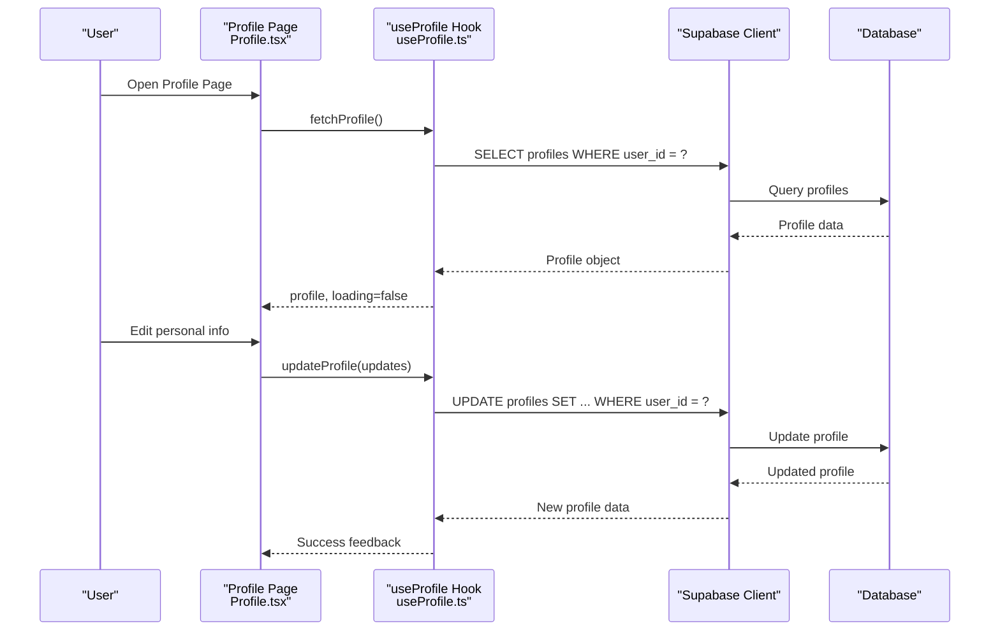
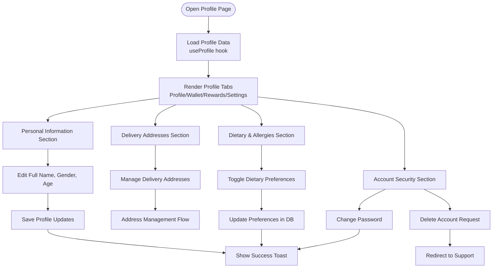
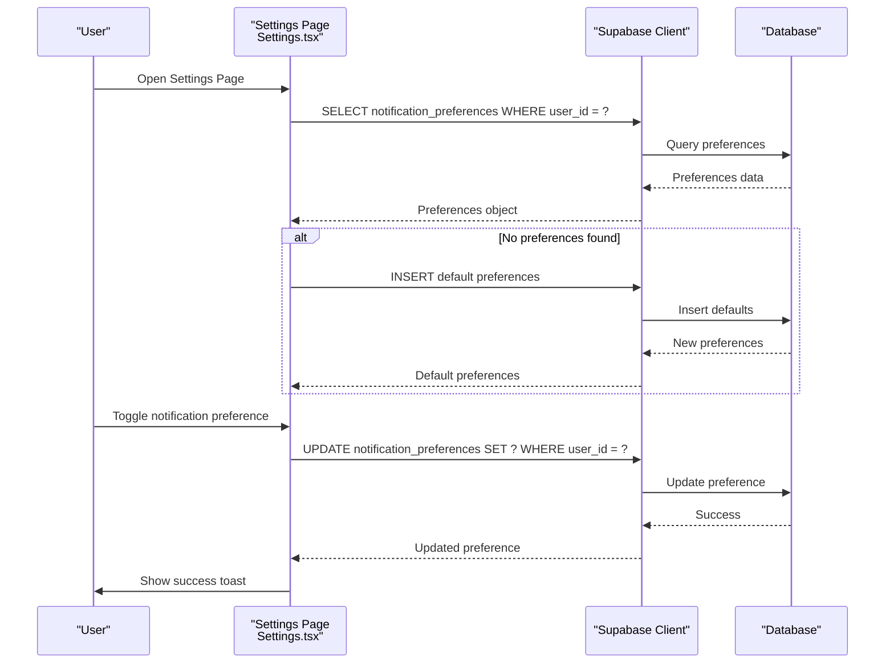
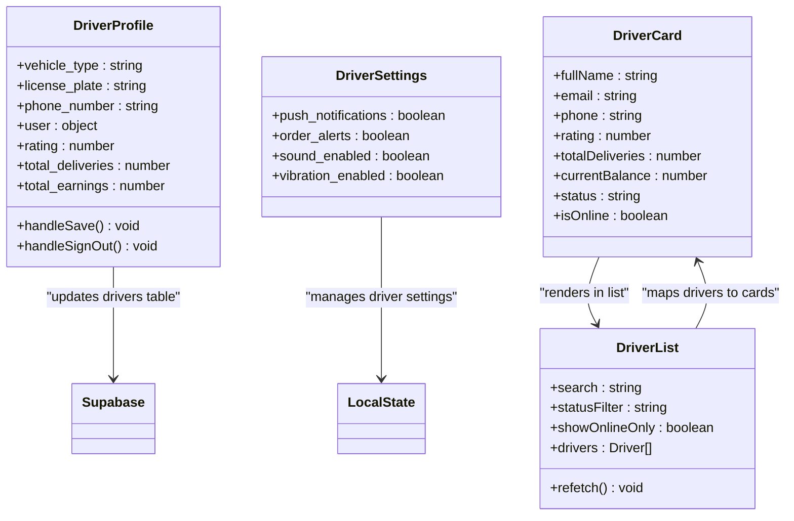
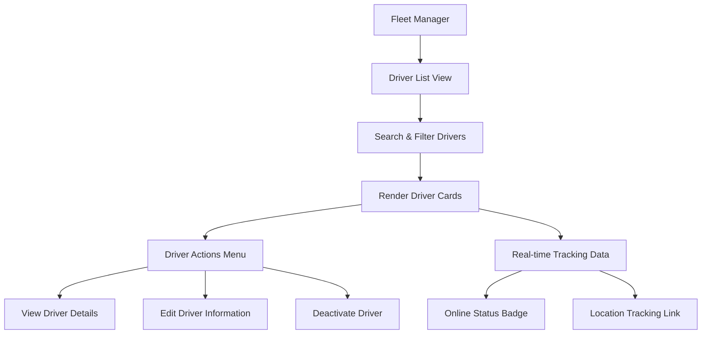
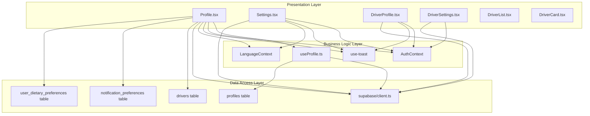

# Profile Management & Settings

<cite>
**Referenced Files in This Document**
- [Profile.tsx](file://src/pages/Profile.tsx)
- [Settings.tsx](file://src/pages/Settings.tsx)
- [DriverProfile.tsx](file://src/pages/driver/DriverProfile.tsx)
- [DriverSettings.tsx](file://src/pages/driver/DriverSettings.tsx)
- [DriverCard.tsx](file://src/fleet/components/drivers/DriverCard.tsx)
- [DriverList.tsx](file://src/fleet/components/drivers/DriverList.tsx)
- [useProfile.ts](file://src/hooks/useProfile.ts)
</cite>

## Table of Contents
1. [Introduction](#introduction)
2. [Project Structure](#project-structure)
3. [Core Components](#core-components)
4. [Architecture Overview](#architecture-overview)
5. [Detailed Component Analysis](#detailed-component-analysis)
6. [Dependency Analysis](#dependency-analysis)
7. [Performance Considerations](#performance-considerations)
8. [Troubleshooting Guide](#troubleshooting-guide)
9. [Conclusion](#conclusion)

## Introduction
This document provides comprehensive documentation for driver profile management and settings configuration across the platform. It covers profile setup for personal information, vehicle details, and availability preferences; notification settings and communication preferences; account security controls; support system integration and help desk access; and administrative features for fleet managers to manage driver accounts, update permissions, and monitor compliance status.

## Project Structure
The profile and settings functionality spans multiple areas:
- Customer profile and settings: handled in dedicated pages for profile and settings
- Driver portal: separate pages for driver profile and driver settings
- Fleet management: components for driver listing, cards, and administrative actions
- Shared hooks: centralized profile retrieval and updates

**Diagram sources**
- [Profile.tsx:1-1348](file://src/pages/Profile.tsx#L1-L1348)
- [Settings.tsx:1-535](file://src/pages/Settings.tsx#L1-L535)
- [DriverProfile.tsx:1-252](file://src/pages/driver/DriverProfile.tsx#L1-L252)
- [DriverSettings.tsx:1-112](file://src/pages/driver/DriverSettings.tsx#L1-L112)
- [DriverList.tsx:1-134](file://src/fleet/components/drivers/DriverList.tsx#L1-L134)
- [DriverCard.tsx:1-141](file://src/fleet/components/drivers/DriverCard.tsx#L1-L141)
- [useProfile.ts:1-88](file://src/hooks/useProfile.ts#L1-L88)

**Section sources**
- [Profile.tsx:1-1348](file://src/pages/Profile.tsx#L1-L1348)
- [Settings.tsx:1-535](file://src/pages/Settings.tsx#L1-L535)
- [DriverProfile.tsx:1-252](file://src/pages/driver/DriverProfile.tsx#L1-L252)
- [DriverSettings.tsx:1-112](file://src/pages/driver/DriverSettings.tsx#L1-L112)
- [DriverList.tsx:1-134](file://src/fleet/components/drivers/DriverList.tsx#L1-L134)
- [DriverCard.tsx:1-141](file://src/fleet/components/drivers/DriverCard.tsx#L1-L141)
- [useProfile.ts:1-88](file://src/hooks/useProfile.ts#L1-L88)

## Core Components
This section outlines the primary components involved in profile management and settings configuration.

- Profile Page (Customer)
  - Manages personal information, addresses, dietary preferences, and account security
  - Integrates with Supabase for profile updates and dietary preference toggles
  - Provides wallet top-up flow and transaction history access

- Settings Page (Customer)
  - Centralizes notification preferences, subscription management, and support access
  - Handles creation of default notification preferences if none exist
  - Offers quick navigation to help and FAQ resources

- Driver Profile Page
  - Captures driver-specific information including contact details and vehicle information
  - Supports saving driver profile updates to the database

- Driver Settings Page
  - Controls driver-side notification preferences and sound/haptic settings
  - Provides app version information

- Fleet Driver Components
  - DriverList: displays drivers with search, filtering, and pagination
  - DriverCard: renders driver details, status badges, and action menus

- useProfile Hook
  - Centralized logic for fetching and updating user profiles
  - Returns loading states, errors, and update functions

**Section sources**
- [Profile.tsx:245-511](file://src/pages/Profile.tsx#L245-L511)
- [Settings.tsx:42-109](file://src/pages/Settings.tsx#L42-L109)
- [DriverProfile.tsx:45-94](file://src/pages/driver/DriverProfile.tsx#L45-L94)
- [DriverSettings.tsx:8-111](file://src/pages/driver/DriverSettings.tsx#L8-L111)
- [DriverList.tsx:13-133](file://src/fleet/components/drivers/DriverList.tsx#L13-L133)
- [DriverCard.tsx:28-139](file://src/fleet/components/drivers/DriverCard.tsx#L28-L139)
- [useProfile.ts:33-87](file://src/hooks/useProfile.ts#L33-L87)

## Architecture Overview
The profile and settings architecture follows a layered approach:
- Presentation Layer: React pages and components render UI and collect user input
- Business Logic Layer: Hooks encapsulate data fetching and updates
- Data Access Layer: Supabase client handles database operations
- Administrative Layer: Fleet components provide manager views and actions

**Diagram sources**
- [Profile.tsx:384-430](file://src/pages/Profile.tsx#L384-L430)
- [useProfile.ts:39-80](file://src/hooks/useProfile.ts#L39-L80)

**Section sources**
- [Profile.tsx:384-430](file://src/pages/Profile.tsx#L384-L430)
- [useProfile.ts:39-80](file://src/hooks/useProfile.ts#L39-L80)

## Detailed Component Analysis

### Customer Profile Management
The customer profile page provides a comprehensive interface for managing personal information, addresses, dietary preferences, and account security.

**Diagram sources**
- [Profile.tsx:245-800](file://src/pages/Profile.tsx#L245-L800)
- [useProfile.ts:33-87](file://src/hooks/useProfile.ts#L33-L87)

Key features include:
- Personal information management with validation and saving
- Address management integration
- Dietary preference toggling with database synchronization
- Account security controls including password changes and account deletion requests
- Wallet integration for balance management and transaction history

**Section sources**
- [Profile.tsx:245-800](file://src/pages/Profile.tsx#L245-L800)
- [useProfile.ts:33-87](file://src/hooks/useProfile.ts#L33-L87)

### Customer Settings Configuration
The settings page centralizes notification preferences, subscription management, and support access.

**Diagram sources**
- [Settings.tsx:61-140](file://src/pages/Settings.tsx#L61-L140)

Administrative features include:
- Comprehensive notification preference management (push, email, reminders, order updates, promotional emails, weekly summary)
- Subscription management with pause/resume capabilities
- Support and help desk integration
- Adaptive goals settings integration

**Section sources**
- [Settings.tsx:42-535](file://src/pages/Settings.tsx#L42-L535)

### Driver Profile Management
The driver portal provides specialized profile management tailored to delivery drivers.

**Diagram sources**
- [DriverProfile.tsx:45-94](file://src/pages/driver/DriverProfile.tsx#L45-L94)
- [DriverSettings.tsx:8-111](file://src/pages/driver/DriverSettings.tsx#L8-L111)
- [DriverCard.tsx:28-139](file://src/fleet/components/drivers/DriverCard.tsx#L28-L139)
- [DriverList.tsx:13-133](file://src/fleet/components/drivers/DriverList.tsx#L13-L133)

Key driver-specific features:
- Vehicle information management (type, license plate)
- Contact information updates
- Driver statistics display (deliveries, earnings)
- Notification preferences for order alerts and sound/vibration
- Fleet manager visibility with status indicators and tracking links

**Section sources**
- [DriverProfile.tsx:45-252](file://src/pages/driver/DriverProfile.tsx#L45-L252)
- [DriverSettings.tsx:8-112](file://src/pages/driver/DriverSettings.tsx#L8-L112)
- [DriverCard.tsx:28-141](file://src/fleet/components/drivers/DriverCard.tsx#L28-L141)
- [DriverList.tsx:13-134](file://src/fleet/components/drivers/DriverList.tsx#L13-L134)

### Fleet Management Integration
Fleet managers can oversee driver accounts, update permissions, and monitor compliance status through integrated components.

**Diagram sources**
- [DriverList.tsx:13-133](file://src/fleet/components/drivers/DriverList.tsx#L13-L133)
- [DriverCard.tsx:28-139](file://src/fleet/components/drivers/DriverCard.tsx#L28-L139)

Administrative capabilities include:
- Driver search and filtering by status and online presence
- Bulk operations through action menus
- Real-time tracking integration for active drivers
- Compliance monitoring through status badges and statistics

**Section sources**
- [DriverList.tsx:13-134](file://src/fleet/components/drivers/DriverList.tsx#L13-L134)
- [DriverCard.tsx:28-141](file://src/fleet/components/drivers/DriverCard.tsx#L28-L141)

## Dependency Analysis
The profile and settings system exhibits clear separation of concerns with well-defined dependencies.

**Diagram sources**
- [Profile.tsx:75-95](file://src/pages/Profile.tsx#L75-L95)
- [Settings.tsx:23-28](file://src/pages/Settings.tsx#L23-L28)
- [DriverProfile.tsx:28-31](file://src/pages/driver/DriverProfile.tsx#L28-L31)
- [DriverSettings.tsx:1-5](file://src/pages/driver/DriverSettings.tsx#L1-L5)
- [useProfile.ts:1-3](file://src/hooks/useProfile.ts#L1-L3)

Key dependency characteristics:
- Low coupling between presentation and data layers through hooks
- Centralized authentication and internationalization contexts
- Supabase client abstraction for database operations
- Clear separation between customer and driver portals
- Fleet components maintain loose coupling with driver data sources

**Section sources**
- [Profile.tsx:75-95](file://src/pages/Profile.tsx#L75-L95)
- [Settings.tsx:23-28](file://src/pages/Settings.tsx#L23-L28)
- [DriverProfile.tsx:28-31](file://src/pages/driver/DriverProfile.tsx#L28-L31)
- [DriverSettings.tsx:1-5](file://src/pages/driver/DriverSettings.tsx#L1-L5)
- [useProfile.ts:1-3](file://src/hooks/useProfile.ts#L1-L3)

## Performance Considerations
Several performance optimizations are implemented throughout the profile and settings system:

- Lazy Loading and Conditional Rendering
  - Profile sections use animated accordions that expand only when needed
  - Settings page loads notification preferences asynchronously
  - Driver list implements skeleton loaders during data fetching

- Efficient Data Fetching
  - useProfile hook caches profile data and provides refetch capability
  - Fleet components merge real-time tracking data with REST API responses
  - Pagination support prevents loading excessive driver records

- Optimized State Management
  - Local state updates for immediate UI feedback
  - Batch operations for notification preference updates
  - Debounced search functionality in driver listings

- Memory Management
  - Cleanup of effect hooks in profile and settings components
  - Proper disposal of toast notifications
  - Controlled re-renders through selective state updates

## Troubleshooting Guide
Common issues and their resolutions:

### Profile Update Failures
**Symptoms**: Profile changes not persisting to database
**Causes**: Authentication issues, network errors, invalid data
**Resolutions**:
- Verify user authentication state before updates
- Check network connectivity and retry mechanism
- Validate input data against schema requirements
- Implement proper error handling with user feedback

### Notification Preference Issues
**Symptoms**: Settings not saving or reverting to defaults
**Causes**: Missing default creation, database connection problems
**Resolutions**:
- Ensure default notification preferences are created automatically
- Implement retry logic for database operations
- Validate preference keys before updates
- Provide fallback mechanisms for failed updates

### Driver Data Synchronization
**Symptoms**: Outdated driver information or incorrect status
**Causes**: Real-time tracking conflicts, caching issues
**Resolutions**:
- Implement proper merging of tracking and API data
- Add timestamp validation for location data
- Configure appropriate cache invalidation strategies
- Monitor real-time connection stability

### Fleet Management Performance
**Symptoms**: Slow driver list loading or search responsiveness
**Causes**: Large datasets, inefficient queries, excessive re-renders
**Resolutions**:
- Implement server-side pagination and filtering
- Optimize database queries with appropriate indexes
- Use virtualized lists for large driver collections
- Debounce search input handlers

**Section sources**
- [Profile.tsx:406-430](file://src/pages/Profile.tsx#L406-L430)
- [Settings.tsx:111-140](file://src/pages/Settings.tsx#L111-L140)
- [DriverList.tsx:32-47](file://src/fleet/components/drivers/DriverList.tsx#L32-L47)

## Conclusion
The profile management and settings system provides a robust, scalable foundation for both customer and driver account management. The architecture emphasizes separation of concerns, efficient data handling, and comprehensive administrative capabilities. Key strengths include:

- Modular design with clear component boundaries
- Centralized data access through Supabase integration
- Comprehensive notification and preference management
- Real-time fleet tracking and monitoring capabilities
- Strong security controls and error handling

Future enhancements could focus on advanced analytics for fleet managers, expanded customization options for driver profiles, and enhanced compliance monitoring features. The current implementation provides a solid foundation for continued growth and feature expansion.