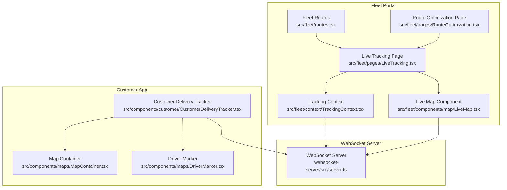
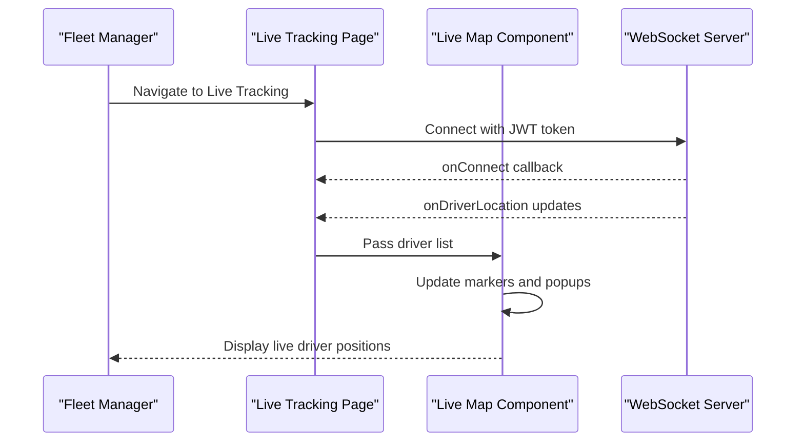
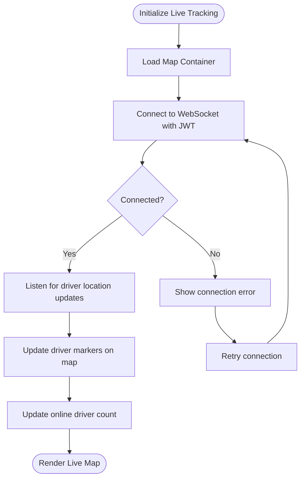
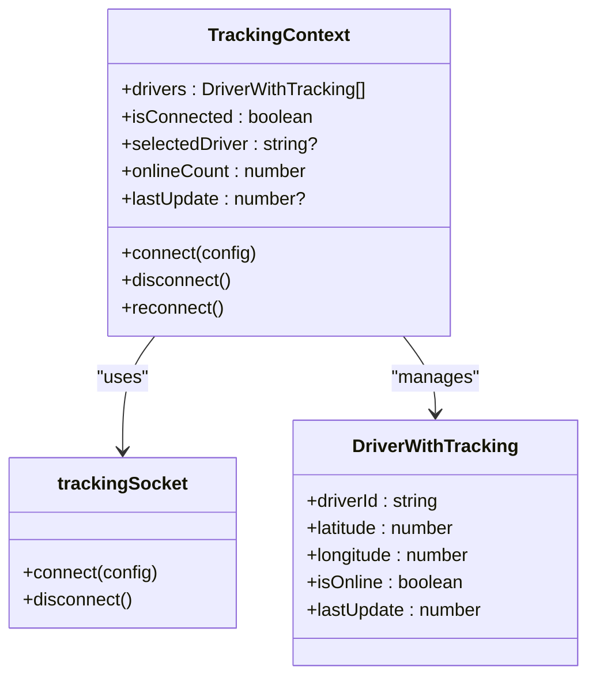
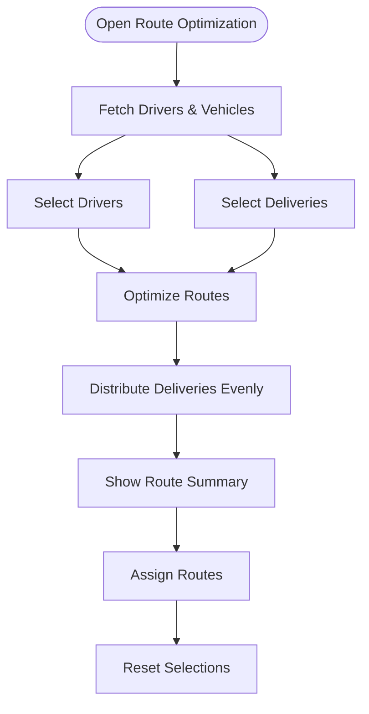
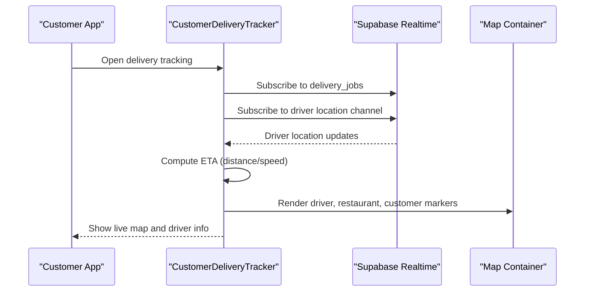
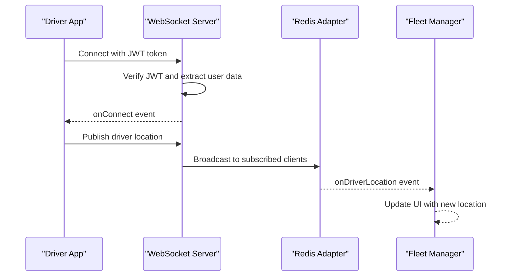
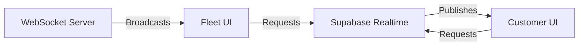

# Route Optimization & Live Tracking

<cite>
**Referenced Files in This Document**
- [routes.tsx](file://src/fleet/routes.tsx)
- [LiveMap.tsx](file://src/fleet/components/map/LiveMap.tsx)
- [LiveTracking.tsx](file://src/fleet/pages/LiveTracking.tsx)
- [TrackingContext.tsx](file://src/fleet/context/TrackingContext.tsx)
- [RouteOptimization.tsx](file://src/fleet/pages/RouteOptimization.tsx)
- [CustomerDeliveryTracker.tsx](file://src/components/customer/CustomerDeliveryTracker.tsx)
- [MapContainer.tsx](file://src/components/maps/MapContainer.tsx)
- [DriverMarker.tsx](file://src/components/maps/DriverMarker.tsx)
- [server.ts](file://websocket-server/src/server.ts)
</cite>

## Table of Contents
1. [Introduction](#introduction)
2. [Project Structure](#project-structure)
3. [Core Components](#core-components)
4. [Architecture Overview](#architecture-overview)
5. [Detailed Component Analysis](#detailed-component-analysis)
6. [Dependency Analysis](#dependency-analysis)
7. [Performance Considerations](#performance-considerations)
8. [Troubleshooting Guide](#troubleshooting-guide)
9. [Conclusion](#conclusion)

## Introduction
This document explains the route optimization and live tracking features of the delivery platform. It covers:
- Route planning and delivery sequence optimization
- Traffic-aware routing and real-time adjustments
- Live map integration showing driver locations, estimated arrival times, and real-time traffic updates
- WebSocket-based live tracking system, location sharing protocols, and driver-to-fleet communication
- Route adjustment capabilities, alternative route suggestions, and driver feedback mechanisms

## Project Structure
The system spans frontend fleet management UI, customer-facing tracking UI, and a dedicated WebSocket server for real-time communications.

**Diagram sources**
- [routes.tsx:20-41](file://src/fleet/routes.tsx#L20-L41)
- [LiveTracking.tsx:39-83](file://src/fleet/pages/LiveTracking.tsx#L39-L83)
- [LiveMap.tsx:32-87](file://src/fleet/components/map/LiveMap.tsx#L32-L87)
- [TrackingContext.tsx:24-83](file://src/fleet/context/TrackingContext.tsx#L24-L83)
- [RouteOptimization.tsx:30-44](file://src/fleet/pages/RouteOptimization.tsx#L30-L44)
- [CustomerDeliveryTracker.tsx:110-150](file://src/components/customer/CustomerDeliveryTracker.tsx#L110-L150)
- [MapContainer.tsx:69-113](file://src/components/maps/MapContainer.tsx#L69-L113)
- [DriverMarker.tsx:122-155](file://src/components/maps/DriverMarker.tsx#L122-L155)
- [server.ts:34-51](file://websocket-server/src/server.ts#L34-L51)

**Section sources**
- [routes.tsx:20-41](file://src/fleet/routes.tsx#L20-L41)
- [LiveTracking.tsx:39-83](file://src/fleet/pages/LiveTracking.tsx#L39-L83)
- [LiveMap.tsx:32-87](file://src/fleet/components/map/LiveMap.tsx#L32-L87)
- [TrackingContext.tsx:24-83](file://src/fleet/context/TrackingContext.tsx#L24-L83)
- [RouteOptimization.tsx:30-44](file://src/fleet/pages/RouteOptimization.tsx#L30-L44)
- [CustomerDeliveryTracker.tsx:110-150](file://src/components/customer/CustomerDeliveryTracker.tsx#L110-L150)
- [MapContainer.tsx:69-113](file://src/components/maps/MapContainer.tsx#L69-L113)
- [DriverMarker.tsx:122-155](file://src/components/maps/DriverMarker.tsx#L122-L155)
- [server.ts:34-51](file://websocket-server/src/server.ts#L34-L51)

## Core Components
- Fleet Live Tracking: Real-time driver monitoring with map overlays, connection status, and driver counts.
- Route Optimization: Driver and delivery selection with basic distribution-based optimization and assignment flow.
- Customer Delivery Tracker: Live ETA calculation, driver location updates, and interactive map with driver, restaurant, and customer markers.
- WebSocket Server: Centralized real-time messaging with JWT authentication, Redis adapter for clustering, and room management.

**Section sources**
- [LiveTracking.tsx:39-83](file://src/fleet/pages/LiveTracking.tsx#L39-L83)
- [LiveMap.tsx:32-87](file://src/fleet/components/map/LiveMap.tsx#L32-L87)
- [RouteOptimization.tsx:141-173](file://src/fleet/pages/RouteOptimization.tsx#L141-L173)
- [CustomerDeliveryTracker.tsx:152-207](file://src/components/customer/CustomerDeliveryTracker.tsx#L152-L207)
- [server.ts:65-103](file://websocket-server/src/server.ts#L65-L103)

## Architecture Overview
The system integrates three primary pathways:
- Fleet Manager → Live Map: Real-time driver locations via WebSocket, rendered on a Mapbox map with online/offline indicators and speed.
- Customer → Delivery Tracker: Real-time driver location updates via Supabase Realtime and polling fallback, with ETA computation and interactive map.
- Fleet Planner → Route Optimization: Driver and delivery selection with a simple distribution algorithm and assignment flow.

**Diagram sources**
- [LiveTracking.tsx:224-255](file://src/fleet/pages/LiveTracking.tsx#L224-L255)
- [LiveMap.tsx:99-160](file://src/fleet/components/map/LiveMap.tsx#L99-L160)
- [server.ts:108-150](file://websocket-server/src/server.ts#L108-L150)

## Detailed Component Analysis

### Live Tracking System (Fleet)
The fleet live tracking system provides real-time visibility of drivers on a map, connection status, and driver statistics.

**Diagram sources**
- [LiveTracking.tsx:53-83](file://src/fleet/pages/LiveTracking.tsx#L53-L83)
- [LiveTracking.tsx:224-255](file://src/fleet/pages/LiveTracking.tsx#L224-L255)
- [LiveMap.tsx:99-160](file://src/fleet/components/map/LiveMap.tsx#L99-L160)

Key behaviors:
- Map initialization with Mapbox GL JS and dynamic token loading.
- WebSocket connection with JWT authentication and automatic reconnection.
- Driver marker creation/update with popup details (name, status, speed).
- Online driver count overlay and map controls (zoom, center).

**Section sources**
- [LiveMap.tsx:32-87](file://src/fleet/components/map/LiveMap.tsx#L32-L87)
- [LiveMap.tsx:99-160](file://src/fleet/components/map/LiveMap.tsx#L99-L160)
- [LiveMap.tsx:202-231](file://src/fleet/components/map/LiveMap.tsx#L202-L231)
- [LiveTracking.tsx:224-255](file://src/fleet/pages/LiveTracking.tsx#L224-L255)

### Tracking Context and Data Flow
The TrackingContext manages WebSocket lifecycle, driver data, and connection state.

**Diagram sources**
- [TrackingContext.tsx:10-18](file://src/fleet/context/TrackingContext.tsx#L10-L18)
- [TrackingContext.tsx:24-83](file://src/fleet/context/TrackingContext.tsx#L24-L83)
- [TrackingContext.tsx:97-110](file://src/fleet/context/TrackingContext.tsx#L97-L110)

Behavior highlights:
- Maintains a list of drivers with last update timestamps.
- Automatically removes offline drivers after a timeout.
- Provides reconnect mechanism and online count calculation.

**Section sources**
- [TrackingContext.tsx:24-95](file://src/fleet/context/TrackingContext.tsx#L24-L95)
- [TrackingContext.tsx:97-110](file://src/fleet/context/TrackingContext.tsx#L97-L110)

### Route Optimization
The route optimization page allows selecting drivers and deliveries, distributing deliveries among drivers, and assigning optimized routes.

**Diagram sources**
- [RouteOptimization.tsx:40-44](file://src/fleet/pages/RouteOptimization.tsx#L40-L44)
- [RouteOptimization.tsx:141-173](file://src/fleet/pages/RouteOptimization.tsx#L141-L173)
- [RouteOptimization.tsx:175-195](file://src/fleet/pages/RouteOptimization.tsx#L175-L195)

Current implementation:
- Fetches drivers and vehicles from Supabase.
- Uses a simple even-distribution algorithm for route assignment.
- Provides UI for selecting drivers/deliveries and resetting.

Future enhancements:
- Integrate traffic-aware routing and time-window constraints.
- Add alternative route suggestions and driver feedback loops.

**Section sources**
- [RouteOptimization.tsx:46-123](file://src/fleet/pages/RouteOptimization.tsx#L46-L123)
- [RouteOptimization.tsx:141-173](file://src/fleet/pages/RouteOptimization.tsx#L141-L173)
- [RouteOptimization.tsx:175-195](file://src/fleet/pages/RouteOptimization.tsx#L175-L195)

### Customer Delivery Tracker
The customer-facing tracker displays live ETA, driver location, and interactive map markers.

**Diagram sources**
- [CustomerDeliveryTracker.tsx:124-150](file://src/components/customer/CustomerDeliveryTracker.tsx#L124-L150)
- [CustomerDeliveryTracker.tsx:152-207](file://src/components/customer/CustomerDeliveryTracker.tsx#L152-L207)
- [CustomerDeliveryTracker.tsx:314-336](file://src/components/customer/CustomerDeliveryTracker.tsx#L314-L336)

Key features:
- Real-time driver location updates via Supabase channels with fallback polling.
- ETA calculation using Haversine distance and current speed.
- Interactive map with driver, restaurant, and customer markers.

**Section sources**
- [CustomerDeliveryTracker.tsx:152-207](file://src/components/customer/CustomerDeliveryTracker.tsx#L152-L207)
- [CustomerDeliveryTracker.tsx:314-336](file://src/components/customer/CustomerDeliveryTracker.tsx#L314-L336)
- [MapContainer.tsx:69-113](file://src/components/maps/MapContainer.tsx#L69-L113)
- [DriverMarker.tsx:122-155](file://src/components/maps/DriverMarker.tsx#L122-L155)

### WebSocket Server
The WebSocket server handles authentication, connection management, and broadcasting driver location updates.

**Diagram sources**
- [server.ts:65-103](file://websocket-server/src/server.ts#L65-L103)
- [server.ts:108-150](file://websocket-server/src/server.ts#L108-L150)
- [server.ts:162-192](file://websocket-server/src/server.ts#L162-L192)

Operational details:
- JWT-based authentication middleware.
- Redis adapter for horizontal scaling and inter-process communication.
- Health and readiness endpoints for monitoring.

**Section sources**
- [server.ts:65-103](file://websocket-server/src/server.ts#L65-L103)
- [server.ts:108-150](file://websocket-server/src/server.ts#L108-L150)
- [server.ts:162-192](file://websocket-server/src/server.ts#L162-L192)

## Dependency Analysis
The system exhibits clear separation of concerns:
- Fleet UI depends on TrackingContext and WebSocket for live data.
- Customer UI depends on Supabase Realtime for driver location updates.
- WebSocket server centralizes real-time events and scales horizontally with Redis.

**Diagram sources**
- [server.ts:108-150](file://websocket-server/src/server.ts#L108-L150)
- [LiveTracking.tsx:224-255](file://src/fleet/pages/LiveTracking.tsx#L224-L255)
- [CustomerDeliveryTracker.tsx:152-207](file://src/components/customer/CustomerDeliveryTracker.tsx#L152-L207)

**Section sources**
- [server.ts:108-150](file://websocket-server/src/server.ts#L108-L150)
- [LiveTracking.tsx:224-255](file://src/fleet/pages/LiveTracking.tsx#L224-L255)
- [CustomerDeliveryTracker.tsx:152-207](file://src/components/customer/CustomerDeliveryTracker.tsx#L152-L207)

## Performance Considerations
- Map rendering: Use dynamic imports and conditional rendering to avoid SSR issues and reduce initial bundle size.
- WebSocket updates: Debounce frequent updates and apply cleanup for stale drivers to prevent memory leaks.
- Customer tracking: Combine Supabase Realtime with periodic polling to ensure resilience against network failures.
- ETA calculations: Cache recent speed estimates and use thresholds to avoid unrealistic ETAs during stops.

## Troubleshooting Guide
Common issues and resolutions:
- Map fails to load: Verify Mapbox access token and network connectivity; provide retry mechanism.
- WebSocket disconnections: Implement reconnect logic and show connection status indicator.
- Driver not appearing: Confirm driver is online, has a valid location, and belongs to the selected city/zone.
- ETA inaccuracies: Ensure driver speed is available; fall back to default speed when unavailable.

**Section sources**
- [LiveMap.tsx:185-196](file://src/fleet/components/map/LiveMap.tsx#L185-L196)
- [LiveMap.tsx:212-222](file://src/fleet/components/map/LiveMap.tsx#L212-L222)
- [TrackingContext.tsx:85-95](file://src/fleet/context/TrackingContext.tsx#L85-L95)
- [CustomerDeliveryTracker.tsx:314-336](file://src/components/customer/CustomerDeliveryTracker.tsx#L314-L336)

## Conclusion
The platform provides a robust foundation for live tracking and route planning:
- Fleet managers can monitor drivers in real-time with a responsive map interface.
- Customers receive accurate, real-time updates with ETA calculations and interactive maps.
- The WebSocket server ensures scalable, secure, and resilient real-time communications.
Future enhancements should focus on traffic-aware routing, dynamic route adjustments, and driver feedback integration to further improve delivery efficiency.