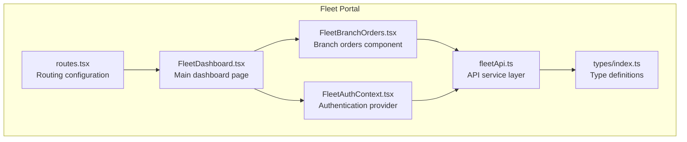
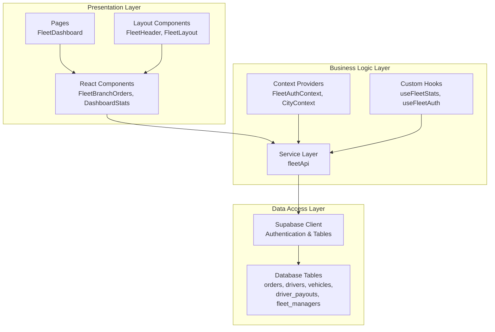
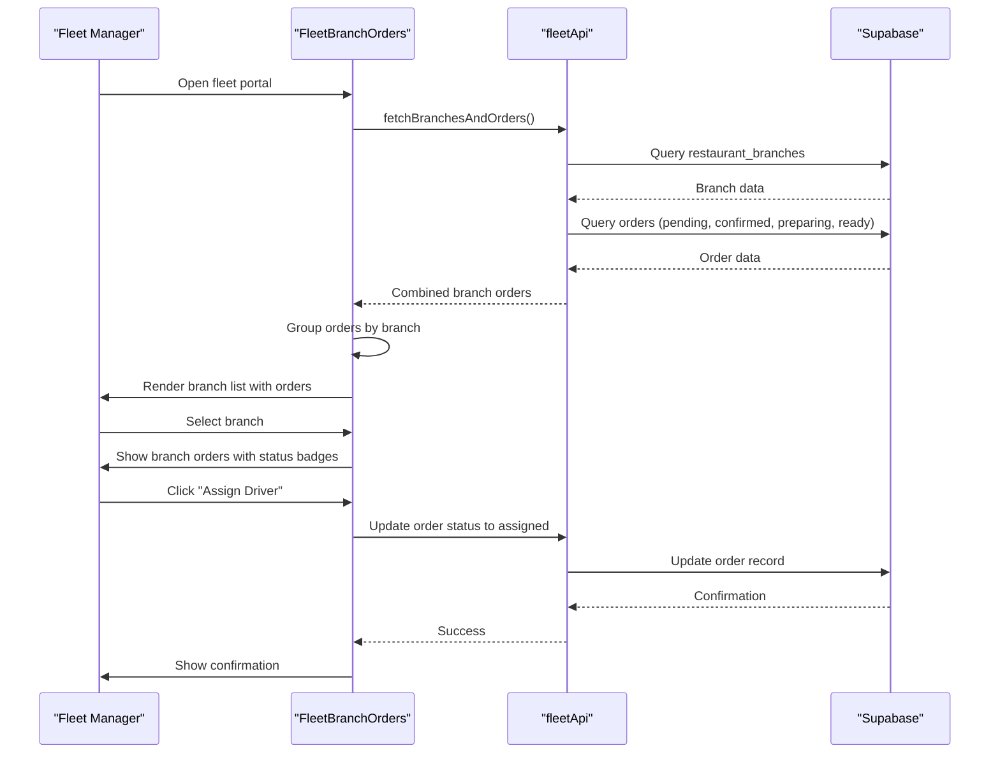
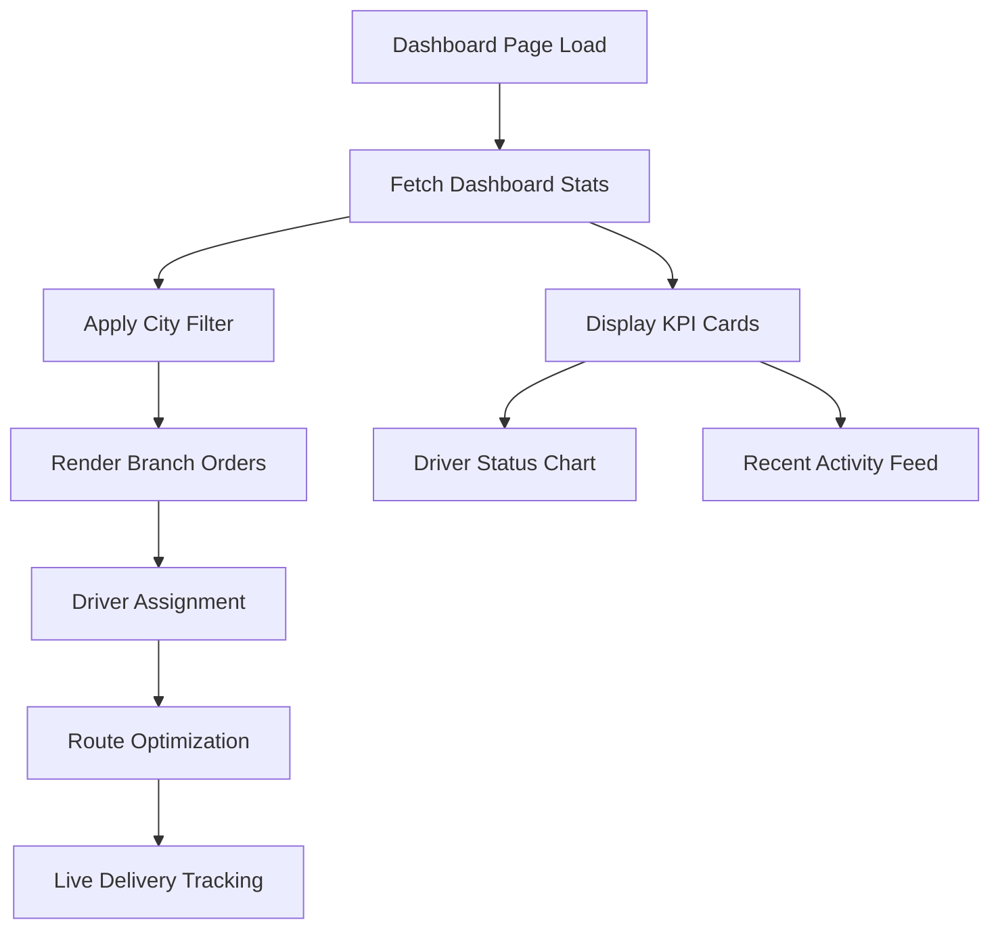
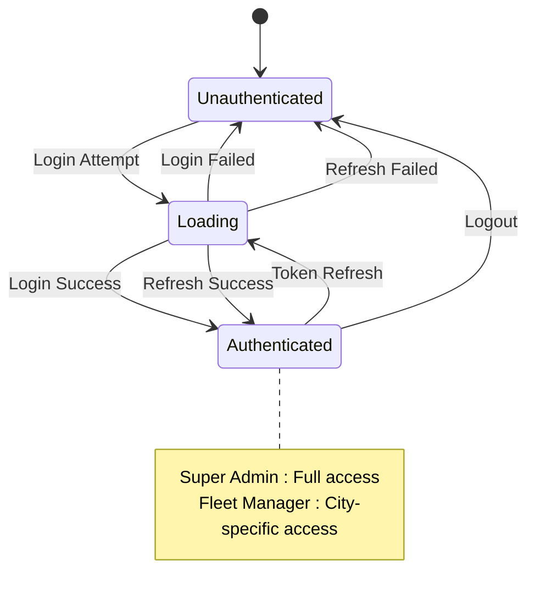
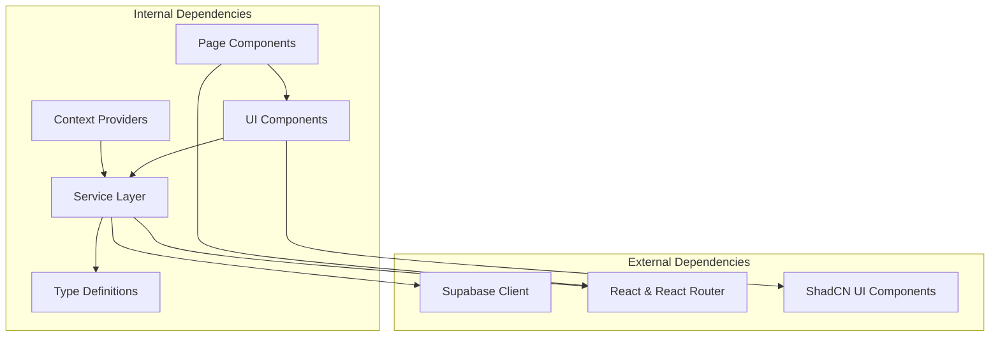

# Branch Orders Management

<cite>
**Referenced Files in This Document**
- [FleetBranchOrders.tsx](file://src/fleet/components/FleetBranchOrders.tsx)
- [routes.tsx](file://src/fleet/routes.tsx)
- [index.ts](file://src/fleet/index.ts)
- [types/index.ts](file://src/fleet/types/index.ts)
- [fleetApi.ts](file://src/fleet/services/fleetApi.ts)
- [FleetDashboard.tsx](file://src/fleet/pages/FleetDashboard.tsx)
- [FleetHeader.tsx](file://src/fleet/components/layout/FleetHeader.tsx)
- [FleetAuthContext.tsx](file://src/fleet/context/FleetAuthContext.tsx)
- [DashboardStats.tsx](file://src/fleet/components/dashboard/DashboardStats.tsx)
</cite>

## Table of Contents
1. [Introduction](#introduction)
2. [Project Structure](#project-structure)
3. [Core Components](#core-components)
4. [Architecture Overview](#architecture-overview)
5. [Detailed Component Analysis](#detailed-component-analysis)
6. [Dependency Analysis](#dependency-analysis)
7. [Performance Considerations](#performance-considerations)
8. [Troubleshooting Guide](#troubleshooting-guide)
9. [Conclusion](#conclusion)

## Introduction
This document provides comprehensive documentation for the fleet branch orders management functionality within the Nutrio system. It explains how orders are allocated across multiple corporate locations, how branch-specific delivery scheduling is coordinated, and how centralized order management operates. The system integrates with corporate ordering systems, manages branch capacity, and optimizes delivery routes across multiple locations. It also covers order modification workflows, cancellation procedures, and branch-specific analytics dashboards.

## Project Structure
The fleet branch orders management functionality is organized under the `src/fleet` directory with clear separation of concerns:
- Components: Reusable UI elements for branch orders, filtering, and status display
- Pages: Top-level views such as the Fleet Dashboard
- Services: API integration layer for authentication, data fetching, and business operations
- Types: TypeScript interfaces defining data structures and roles
- Context: Authentication and city selection contexts
- Routes: Application routing configuration for the fleet portal



**Diagram sources**
- [routes.tsx:20-41](file://src/fleet/routes.tsx#L20-L41)
- [FleetDashboard.tsx:21-295](file://src/fleet/pages/FleetDashboard.tsx#L21-L295)
- [FleetBranchOrders.tsx:54-360](file://src/fleet/components/FleetBranchOrders.tsx#L54-L360)
- [FleetAuthContext.tsx:24-145](file://src/fleet/context/FleetAuthContext.tsx#L24-L145)
- [types/index.ts:1-187](file://src/fleet/types/index.ts#L1-L187)
- [fleetApi.ts:1-800](file://src/fleet/services/fleetApi.ts#L1-L800)

**Section sources**
- [routes.tsx:1-42](file://src/fleet/routes.tsx#L1-L42)
- [index.ts:1-14](file://src/fleet/index.ts#L1-L14)

## Core Components
The core components enabling branch orders management include:

- **FleetBranchOrders**: Central component for displaying and managing orders per branch, including filtering, sorting, and driver assignment actions
- **FleetDashboard**: Main dashboard page integrating branch orders display with fleet statistics and quick actions
- **FleetAuthContext**: Authentication provider handling login, logout, token refresh, and role-based access control
- **fleetApi**: Service layer for Supabase integration, covering authentication, driver management, vehicle management, payouts, and dashboard statistics
- **Types**: Comprehensive TypeScript interfaces for fleet managers, drivers, vehicles, driver documents, driver payouts, and dashboard statistics

Key capabilities:
- Multi-location order allocation across restaurant branches
- Branch-specific delivery scheduling and status monitoring
- Centralized order coordination with real-time updates
- Integration with corporate ordering systems via Supabase
- Branch capacity management and driver assignment
- Delivery route optimization across multiple locations
- Order modification and cancellation workflows
- Branch-specific analytics dashboards

**Section sources**
- [FleetBranchOrders.tsx:54-360](file://src/fleet/components/FleetBranchOrders.tsx#L54-L360)
- [FleetDashboard.tsx:21-295](file://src/fleet/pages/FleetDashboard.tsx#L21-L295)
- [FleetAuthContext.tsx:24-183](file://src/fleet/context/FleetAuthContext.tsx#L24-L183)
- [fleetApi.ts:1-800](file://src/fleet/services/fleetApi.ts#L1-L800)
- [types/index.ts:1-187](file://src/fleet/types/index.ts#L1-L187)

## Architecture Overview
The fleet branch orders management system follows a layered architecture with clear separation between presentation, business logic, and data access:



**Diagram sources**
- [FleetBranchOrders.tsx:20-21](file://src/fleet/components/FleetBranchOrders.tsx#L20-L21)
- [FleetAuthContext.tsx:4-5](file://src/fleet/context/FleetAuthContext.tsx#L4-L5)
- [fleetApi.ts:1-27](file://src/fleet/services/fleetApi.ts#L1-L27)

The system integrates with Supabase for:
- Authentication and session management
- Real-time data synchronization for orders and driver locations
- Persistent storage of fleet management data
- Token-based security for API access

**Section sources**
- [FleetAuthContext.tsx:24-145](file://src/fleet/context/FleetAuthContext.tsx#L24-L145)
- [fleetApi.ts:35-93](file://src/fleet/services/fleetApi.ts#L35-L93)

## Detailed Component Analysis

### FleetBranchOrders Component
The FleetBranchOrders component serves as the central hub for branch-specific order management:

```mermaid
classDiagram
class FleetBranchOrders {
+props driverLat : number
+props driverLng : number
+state branches : RestaurantBranch[]
+state branchOrders : Map<string, BranchOrder[]>
+state loading : boolean
+state selectedBranch : string
+state driverLocation : {lat, lng}
+state filter : "all"|"pending"|"preparing"|"ready"
+fetchBranchesAndOrders() void
+getBranchDistance(branch) number
+getFilteredOrders(orders) BranchOrder[]
+getStatusBadge(status) Badge
}
class RestaurantBranch {
+string id
+string restaurant_id
+string name
+string address
+number latitude
+number longitude
+boolean is_active
}
class BranchOrder {
+string id
+string status
+number total_amount
+string delivery_address
+string restaurant_branch_id
+string customer_name
}
FleetBranchOrders --> RestaurantBranch : "displays"
FleetBranchOrders --> BranchOrder : "manages"
```

**Diagram sources**
- [FleetBranchOrders.tsx:23-52](file://src/fleet/components/FleetBranchOrders.tsx#L23-L52)
- [FleetBranchOrders.tsx:109-113](file://src/fleet/components/FleetBranchOrders.tsx#L109-L113)

Key features:
- Real-time order aggregation by branch with status filtering
- Driver location-based branch prioritization
- Interactive order assignment interface
- Responsive design with skeleton loading states
- Comprehensive status badge system

Order processing workflow:



**Diagram sources**
- [FleetBranchOrders.tsx:68-122](file://src/fleet/components/FleetBranchOrders.tsx#L68-L122)
- [fleetApi.ts:760-800](file://src/fleet/services/fleetApi.ts#L760-L800)

**Section sources**
- [FleetBranchOrders.tsx:54-360](file://src/fleet/components/FleetBranchOrders.tsx#L54-L360)

### Fleet Dashboard Integration
The FleetDashboard integrates branch orders with broader fleet analytics:



**Diagram sources**
- [FleetDashboard.tsx:21-295](file://src/fleet/pages/FleetDashboard.tsx#L21-L295)
- [DashboardStats.tsx:18-112](file://src/fleet/components/dashboard/DashboardStats.tsx#L18-L112)

**Section sources**
- [FleetDashboard.tsx:21-295](file://src/fleet/pages/FleetDashboard.tsx#L21-L295)
- [DashboardStats.tsx:18-112](file://src/fleet/components/dashboard/DashboardStats.tsx#L18-L112)

### Authentication and Authorization
The FleetAuthContext provides comprehensive authentication and authorization:



**Diagram sources**
- [FleetAuthContext.tsx:24-183](file://src/fleet/context/FleetAuthContext.tsx#L24-L183)

**Section sources**
- [FleetAuthContext.tsx:24-183](file://src/fleet/context/FleetAuthContext.tsx#L24-L183)

## Dependency Analysis
The fleet branch orders management system exhibits strong modularity with clear dependency relationships:



**Diagram sources**
- [FleetBranchOrders.tsx:20-21](file://src/fleet/components/FleetBranchOrders.tsx#L20-L21)
- [routes.tsx:1-42](file://src/fleet/routes.tsx#L1-L42)
- [types/index.ts:1-187](file://src/fleet/types/index.ts#L1-L187)

Key dependency characteristics:
- Low coupling between components through well-defined props and context providers
- Clear separation between UI components and business logic
- Type-safe interactions through comprehensive TypeScript interfaces
- Modular service layer enabling easy testing and maintenance

**Section sources**
- [routes.tsx:1-42](file://src/fleet/routes.tsx#L1-L42)
- [types/index.ts:1-187](file://src/fleet/types/index.ts#L1-L187)

## Performance Considerations
The fleet branch orders management system incorporates several performance optimization strategies:

- **Efficient Data Fetching**: Component-level data fetching with selective queries to minimize payload sizes
- **Real-time Updates**: Supabase real-time subscriptions for live order status updates
- **Client-side Caching**: Local state management for reduced network requests
- **Responsive Design**: Skeleton loaders and progressive enhancement for improved perceived performance
- **Optimized Rendering**: Memoization of computed values and filtered lists to prevent unnecessary re-renders

Implementation considerations:
- Pagination support for large datasets in driver and vehicle management
- Debounced search and filter operations to reduce API calls
- Efficient branch sorting algorithms using distance calculations
- Conditional rendering to minimize DOM complexity

## Troubleshooting Guide
Common issues and resolutions for the fleet branch orders management system:

**Authentication Issues**
- Verify Supabase credentials and connection status
- Check token refresh intervals and error handling
- Validate user role permissions for city access

**Data Synchronization Problems**
- Monitor Supabase real-time subscription status
- Implement retry mechanisms for failed API calls
- Validate data consistency between local state and database

**Performance Issues**
- Optimize branch sorting algorithms for large datasets
- Implement virtualized lists for extensive order displays
- Monitor API response times and implement caching strategies

**Order Management Errors**
- Verify order status transitions follow business rules
- Check driver assignment constraints and availability
- Validate branch capacity limits and delivery scheduling conflicts

**Section sources**
- [FleetAuthContext.tsx:54-73](file://src/fleet/context/FleetAuthContext.tsx#L54-L73)
- [FleetBranchOrders.tsx:117-122](file://src/fleet/components/FleetBranchOrders.tsx#L117-L122)

## Conclusion
The fleet branch orders management functionality provides a comprehensive solution for coordinating multi-location order fulfillment within the Nutrio ecosystem. Through its modular architecture, real-time data synchronization, and intuitive user interface, the system enables efficient order allocation, branch-specific delivery scheduling, and centralized coordination across multiple corporate locations.

Key strengths of the implementation include:
- Seamless integration with corporate ordering systems via Supabase
- Robust branch capacity management and driver assignment workflows
- Comprehensive analytics dashboards with real-time performance metrics
- Flexible order modification and cancellation procedures
- Scalable architecture supporting future expansion and customization

The system's design emphasizes maintainability, performance, and user experience while providing the operational flexibility required for effective fleet management across diverse geographic markets.