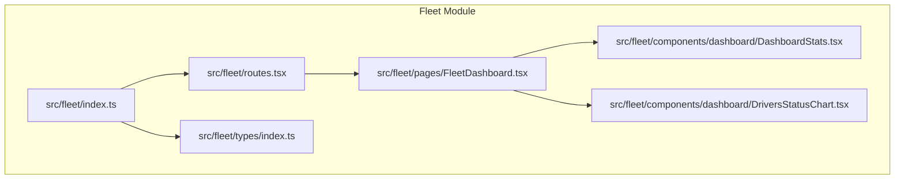
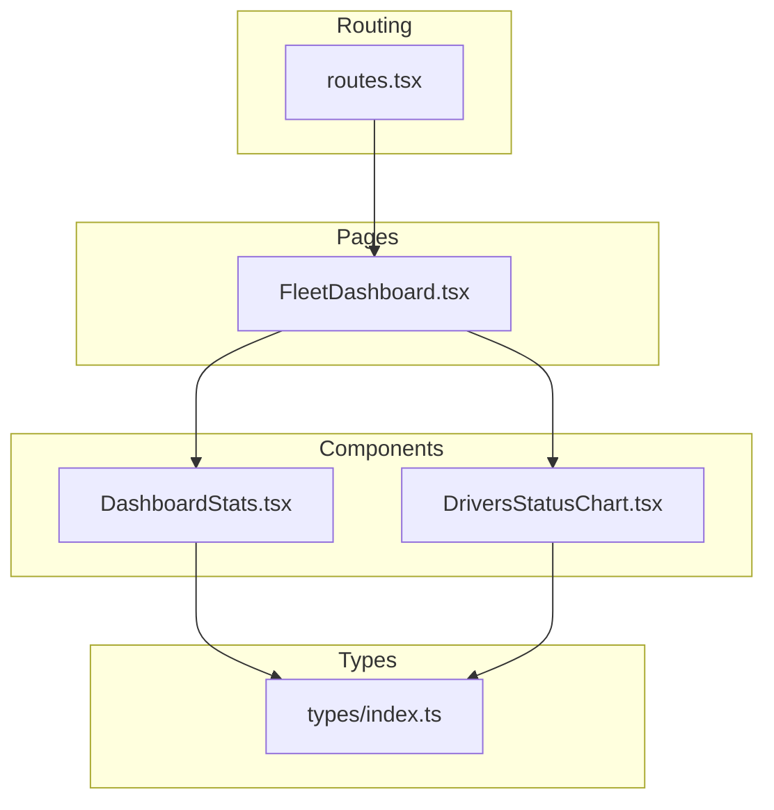
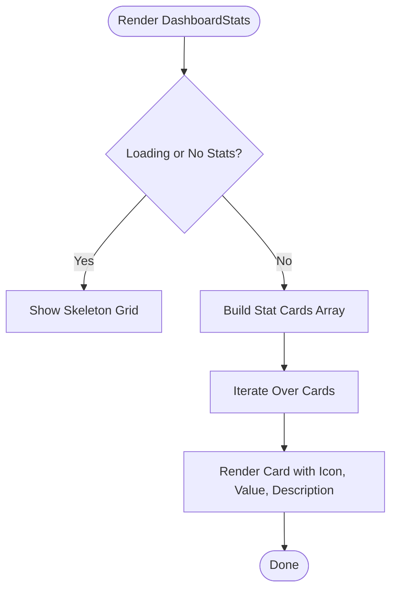
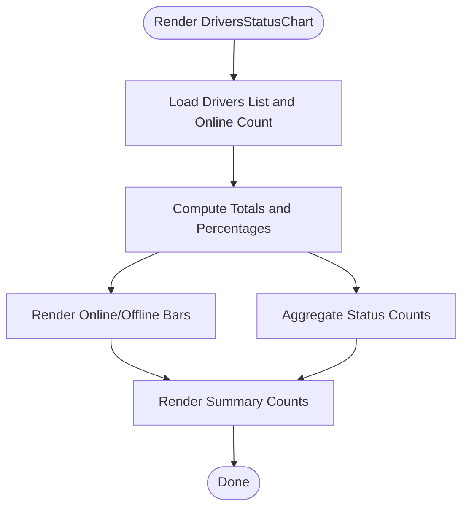
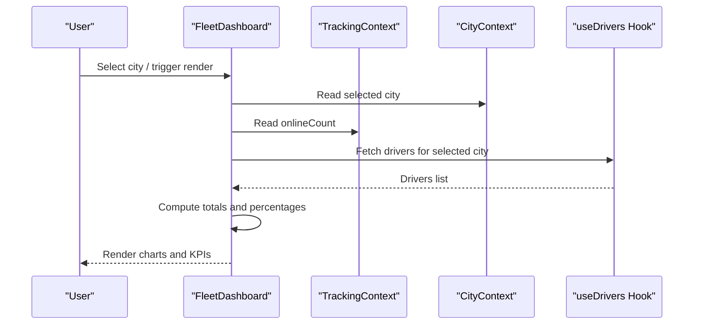
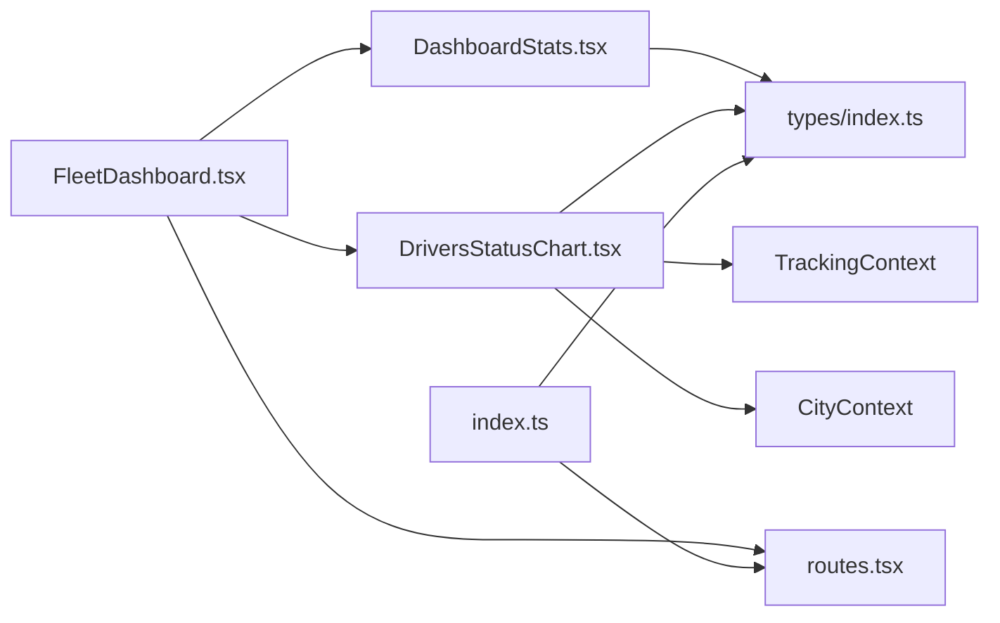

# Dashboard & Analytics

<cite>
**Referenced Files in This Document**
- [index.ts](file://src/fleet/index.ts)
- [routes.tsx](file://src/fleet/routes.tsx)
- [types/index.ts](file://src/fleet/types/index.ts)
- [DashboardStats.tsx](file://src/fleet/components/dashboard/DashboardStats.tsx)
- [DriversStatusChart.tsx](file://src/fleet/components/dashboard/DriversStatusChart.tsx)
- [FleetDashboard.tsx](file://src/fleet/pages/FleetDashboard.tsx)
</cite>

## Table of Contents
1. [Introduction](#introduction)
2. [Project Structure](#project-structure)
3. [Core Components](#core-components)
4. [Architecture Overview](#architecture-overview)
5. [Detailed Component Analysis](#detailed-component-analysis)
6. [Dependency Analysis](#dependency-analysis)
7. [Performance Considerations](#performance-considerations)
8. [Troubleshooting Guide](#troubleshooting-guide)
9. [Conclusion](#conclusion)
10. [Appendices](#appendices)

## Introduction
This document describes the fleet dashboard and analytics functionality, focusing on how the system displays fleet statistics, driver performance indicators, and utilization rates. It explains the drivers status visualization, capacity planning analytics, and real-time fleet monitoring capabilities. It also documents the data aggregation mechanisms, KPI calculations, and performance benchmarking features, along with examples of dashboard customization, metric interpretation, and decision-support insights for fleet managers.

## Project Structure
The fleet dashboard is part of a modular React-based frontend with TypeScript types and route-based page loading. The dashboard integrates reusable components for statistics display and driver status visualization, and it consumes fleet-specific data via hooks and contexts.

**Diagram sources**
- [routes.tsx:1-42](file://src/fleet/routes.tsx#L1-L42)
- [index.ts:1-14](file://src/fleet/index.ts#L1-L14)
- [types/index.ts:135-143](file://src/fleet/types/index.ts#L135-L143)
- [FleetDashboard.tsx:1-295](file://src/fleet/pages/FleetDashboard.tsx#L1-L295)
- [DashboardStats.tsx:1-112](file://src/fleet/components/dashboard/DashboardStats.tsx#L1-L112)
- [DriversStatusChart.tsx:1-105](file://src/fleet/components/dashboard/DriversStatusChart.tsx#L1-L105)

**Section sources**
- [routes.tsx:1-42](file://src/fleet/routes.tsx#L1-L42)
- [index.ts:1-14](file://src/fleet/index.ts#L1-L14)
- [types/index.ts:135-143](file://src/fleet/types/index.ts#L135-L143)

## Core Components
This section documents the primary building blocks of the dashboard and analytics:

- FleetDashboard page: Orchestrates KPI cards, quick actions, driver status visualization, recent activity, branch orders, and call-to-action for adding drivers.
- DashboardStats component: Renders a grid of KPI cards for total drivers, active drivers, online drivers, orders in progress, today’s deliveries, and average delivery time.
- DriversStatusChart component: Visualizes driver availability and status distribution using a simple bar chart representation and summary counts.

Key data types supporting the dashboard:
- FleetDashboardStats: Defines the shape of aggregated statistics returned to the dashboard.
- Driver: Provides driver-level attributes used for status and performance analytics.
- Vehicle: Supplies fleet asset data for capacity planning and utilization analytics.
- DriverPerformance: Encapsulates performance metrics for individual drivers.
- PayoutSummary: Aggregates payout totals for financial analytics.

**Section sources**
- [FleetDashboard.tsx:21-295](file://src/fleet/pages/FleetDashboard.tsx#L21-L295)
- [DashboardStats.tsx:18-112](file://src/fleet/components/dashboard/DashboardStats.tsx#L18-L112)
- [DriversStatusChart.tsx:7-105](file://src/fleet/components/dashboard/DriversStatusChart.tsx#L7-L105)
- [types/index.ts:135-154](file://src/fleet/types/index.ts#L135-L154)

## Architecture Overview
The dashboard architecture follows a layered pattern:
- Routing layer: Declares protected routes and lazy-loaded pages for the fleet portal.
- Page layer: FleetDashboard composes multiple analytics components and quick action links.
- Component layer: DashboardStats and DriversStatusChart encapsulate presentation and basic computations.
- Data layer: Hooks and contexts supply statistics and driver lists; types define the contract for data exchange.

**Diagram sources**
- [routes.tsx:20-41](file://src/fleet/routes.tsx#L20-L41)
- [FleetDashboard.tsx:1-295](file://src/fleet/pages/FleetDashboard.tsx#L1-L295)
- [DashboardStats.tsx:11](file://src/fleet/components/dashboard/DashboardStats.tsx#L11)
- [DriversStatusChart.tsx:3-5](file://src/fleet/components/dashboard/DriversStatusChart.tsx#L3-L5)
- [types/index.ts:135-154](file://src/fleet/types/index.ts#L135-L154)

## Detailed Component Analysis

### Dashboard Statistics Display
The DashboardStats component renders a responsive grid of KPI cards with icons, values, and descriptions. It supports a loading state using skeleton placeholders and displays six core metrics:
- Total Drivers
- Active Drivers
- Online Drivers
- Orders In Progress
- Today’s Deliveries
- Average Delivery Time

Each card includes:
- A descriptive title
- An icon indicating the metric category
- A value field
- A short description below the value

**Diagram sources**
- [DashboardStats.tsx:18-112](file://src/fleet/components/dashboard/DashboardStats.tsx#L18-L112)

**Section sources**
- [DashboardStats.tsx:18-112](file://src/fleet/components/dashboard/DashboardStats.tsx#L18-L112)

### Drivers Status Visualization Charts
The DriversStatusChart component provides:
- A simple bar chart representation of online vs. offline drivers
- A status breakdown by driver status categories
- Summary counts for online, offline, and total drivers

It computes:
- Online percentage from the tracking context
- Offline count as total drivers minus online drivers
- Status counts by aggregating driver statuses

**Diagram sources**
- [DriversStatusChart.tsx:7-105](file://src/fleet/components/dashboard/DriversStatusChart.tsx#L7-L105)

**Section sources**
- [DriversStatusChart.tsx:7-105](file://src/fleet/components/dashboard/DriversStatusChart.tsx#L7-L105)

### Real-Time Fleet Monitoring Capabilities
Real-time monitoring is achieved through:
- Tracking context providing live online driver counts
- Driver list retrieval filtered by selected city
- Periodic updates via the data fetching hooks used by the dashboard page

The dashboard page:
- Uses a city selection filter to scope analytics
- Displays a circular progress indicator for online driver percentage
- Shows recent activity events for immediate situational awareness

**Diagram sources**
- [FleetDashboard.tsx:21-295](file://src/fleet/pages/FleetDashboard.tsx#L21-L295)
- [DriversStatusChart.tsx:3-14](file://src/fleet/components/dashboard/DriversStatusChart.tsx#L3-L14)

**Section sources**
- [FleetDashboard.tsx:21-295](file://src/fleet/pages/FleetDashboard.tsx#L21-L295)
- [DriversStatusChart.tsx:3-14](file://src/fleet/components/dashboard/DriversStatusChart.tsx#L3-L14)

### Data Aggregation Mechanisms and KPI Calculations
Aggregation and calculations observed in the codebase:
- Online percentage: onlineDrivers / totalDrivers * 100
- Offline count: totalDrivers - onlineDrivers
- Status breakdown: reduce operation over drivers grouped by status
- Average delivery time: presented as minutes per delivery when available

These computations occur within the DriversStatusChart component and are also reflected in the FleetDashboard page’s circular visualization.

**Section sources**
- [DriversStatusChart.tsx:29-40](file://src/fleet/components/dashboard/DriversStatusChart.tsx#L29-L40)
- [FleetDashboard.tsx:193-198](file://src/fleet/pages/FleetDashboard.tsx#L193-L198)

### Capacity Planning Analytics
Capacity planning analytics rely on:
- Driver counts and statuses for availability assessment
- Vehicle types and statuses for asset utilization
- Driver performance metrics for productivity insights

The types define:
- Vehicle status and type for fleet composition
- Driver performance metrics for benchmarking
- Payout summary for financial capacity planning

**Section sources**
- [types/index.ts:70-89](file://src/fleet/types/index.ts#L70-L89)
- [types/index.ts:145-154](file://src/fleet/types/index.ts#L145-L154)
- [types/index.ts:156-162](file://src/fleet/types/index.ts#L156-L162)

### Performance Benchmarking Features
Benchmarking is supported by:
- Driver performance metrics (deliveries, ratings, on-time rate, earnings)
- Comparative visibility via status distributions and online/offline ratios
- Historical trends can be derived from periodic updates and recent activity

**Section sources**
- [types/index.ts:145-154](file://src/fleet/types/index.ts#L145-L154)
- [FleetDashboard.tsx:220-268](file://src/fleet/pages/FleetDashboard.tsx#L220-L268)

### Examples of Dashboard Customization
Customization examples visible in the code:
- City filter dropdown to scope analytics across multiple cities
- Quick action cards linking to drivers, vehicles, live tracking, and payouts
- Gradient call-to-action card for adding drivers
- Circular progress visualization for online driver percentage

These UI elements enable fleet managers to tailor focus areas and navigate quickly to related operations.

**Section sources**
- [FleetDashboard.tsx:66-76](file://src/fleet/pages/FleetDashboard.tsx#L66-L76)
- [FleetDashboard.tsx:138-171](file://src/fleet/pages/FleetDashboard.tsx#L138-L171)
- [FleetDashboard.tsx:274-291](file://src/fleet/pages/FleetDashboard.tsx#L274-L291)
- [FleetDashboard.tsx:180-218](file://src/fleet/pages/FleetDashboard.tsx#L180-L218)

### Metric Interpretation and Decision-Support Insights
Interpretation guidelines for key metrics:
- Online Drivers: Indicates immediate capacity for assignments; low values may require driver recruitment or incentives.
- Orders In Progress: Reflects current workload; high values may signal need for additional drivers or route optimization.
- Today’s Deliveries: Measures daily throughput; trends help assess growth and operational efficiency.
- Average Delivery Time: Benchmarks service performance; sustained increases may indicate traffic, routing inefficiencies, or driver training needs.
- Driver Status Distribution: Highlights compliance and availability; frequent “pending_verification” or “suspended” statuses may require administrative intervention.

Decision-support tips:
- Use the city filter to isolate underperforming regions and target interventions.
- Monitor recent activity to identify bottlenecks and respond promptly.
- Track driver performance metrics to recognize top performers and plan coaching or rewards.

[No sources needed since this section provides general guidance]

## Dependency Analysis
The dashboard components depend on shared types and contexts for data and UI consistency.

**Diagram sources**
- [FleetDashboard.tsx:1-295](file://src/fleet/pages/FleetDashboard.tsx#L1-L295)
- [DashboardStats.tsx:11](file://src/fleet/components/dashboard/DashboardStats.tsx#L11)
- [DriversStatusChart.tsx:3-5](file://src/fleet/components/dashboard/DriversStatusChart.tsx#L3-L5)
- [types/index.ts:135-154](file://src/fleet/types/index.ts#L135-L154)
- [routes.tsx:20-41](file://src/fleet/routes.tsx#L20-L41)
- [index.ts:1-14](file://src/fleet/index.ts#L1-L14)

**Section sources**
- [routes.tsx:20-41](file://src/fleet/routes.tsx#L20-L41)
- [index.ts:1-14](file://src/fleet/index.ts#L1-L14)
- [types/index.ts:135-154](file://src/fleet/types/index.ts#L135-L154)

## Performance Considerations
- Prefer memoization for derived values (e.g., city IDs) to avoid unnecessary re-renders.
- Use skeleton loaders during initial data fetch to maintain perceived responsiveness.
- Limit driver fetch sizes when possible; the DriversStatusChart retrieves up to 1000 drivers for statistics, which may be adjusted based on performance testing.
- Debounce city filter changes to minimize repeated queries.

[No sources needed since this section provides general guidance]

## Troubleshooting Guide
Common issues and resolutions:
- Empty or stale statistics: Verify that the stats hook is receiving valid city IDs and that the backend endpoint is reachable.
- Incorrect online percentage: Confirm that the tracking context provides accurate online counts and that the denominator is not zero.
- Slow rendering: Replace skeleton placeholders with more granular loading states or split large datasets into smaller chunks.
- Missing driver statuses: Ensure the driver list includes the status field and that filters are not excluding all records.

**Section sources**
- [DriversStatusChart.tsx:16-27](file://src/fleet/components/dashboard/DriversStatusChart.tsx#L16-L27)
- [FleetDashboard.tsx:31-44](file://src/fleet/pages/FleetDashboard.tsx#L31-L44)

## Conclusion
The fleet dashboard and analytics module provides a concise yet powerful overview of fleet operations. It combines real-time driver availability, key performance indicators, and actionable insights to support informed decision-making. By leveraging the provided components, types, and contexts, fleet managers can monitor performance, plan capacity, and optimize operations effectively.

[No sources needed since this section summarizes without analyzing specific files]

## Appendices
- Data Model Overview: The dashboard relies on FleetDashboardStats, Driver, Vehicle, DriverPerformance, and PayoutSummary types to present a unified view of fleet metrics.

**Section sources**
- [types/index.ts:135-162](file://src/fleet/types/index.ts#L135-L162)