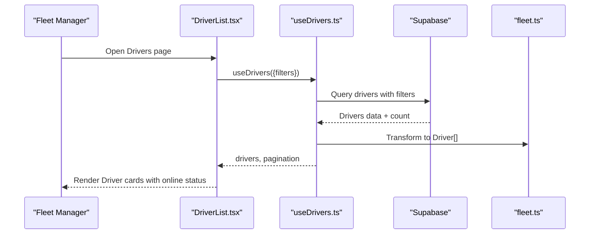
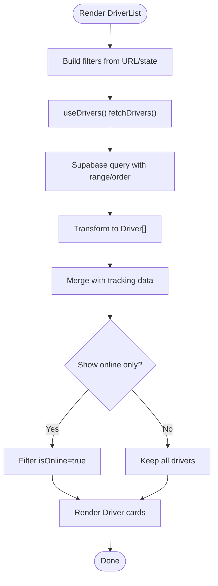
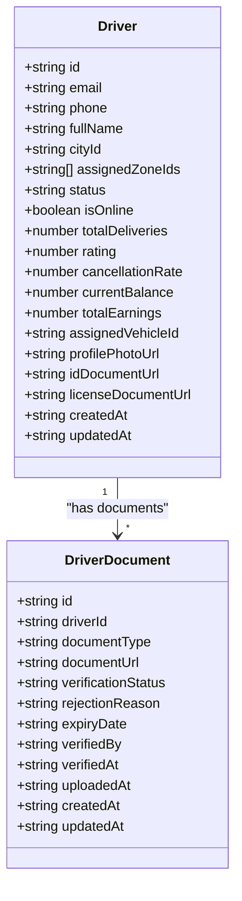
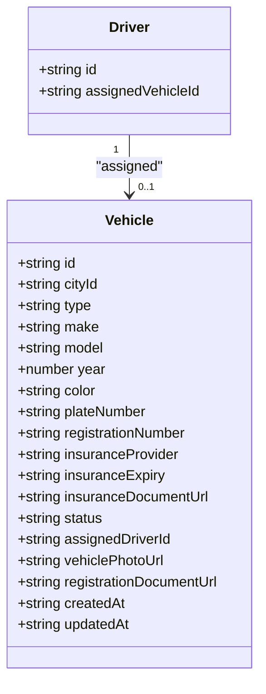
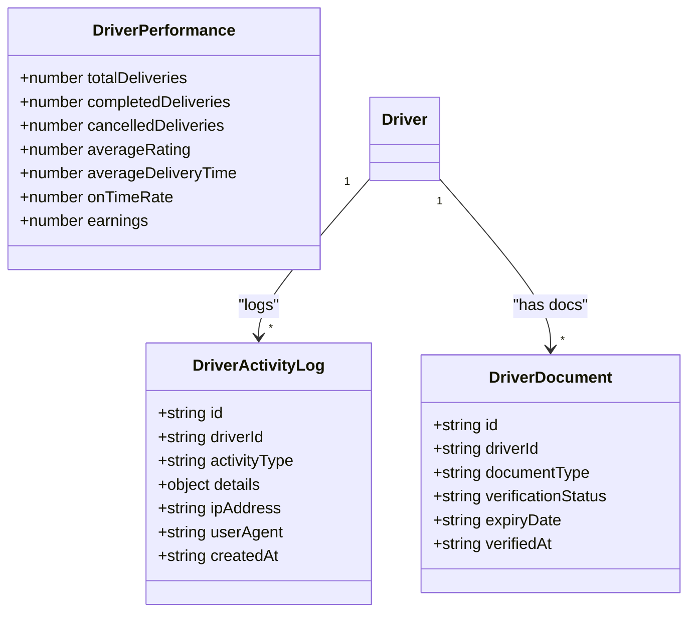
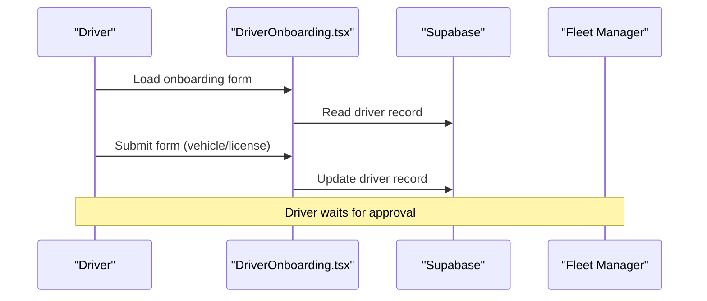
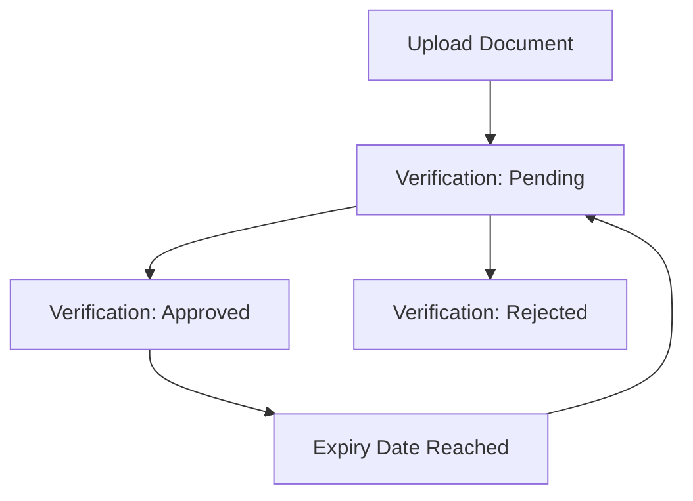
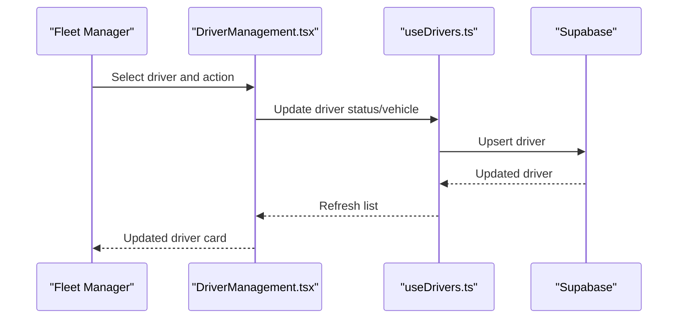
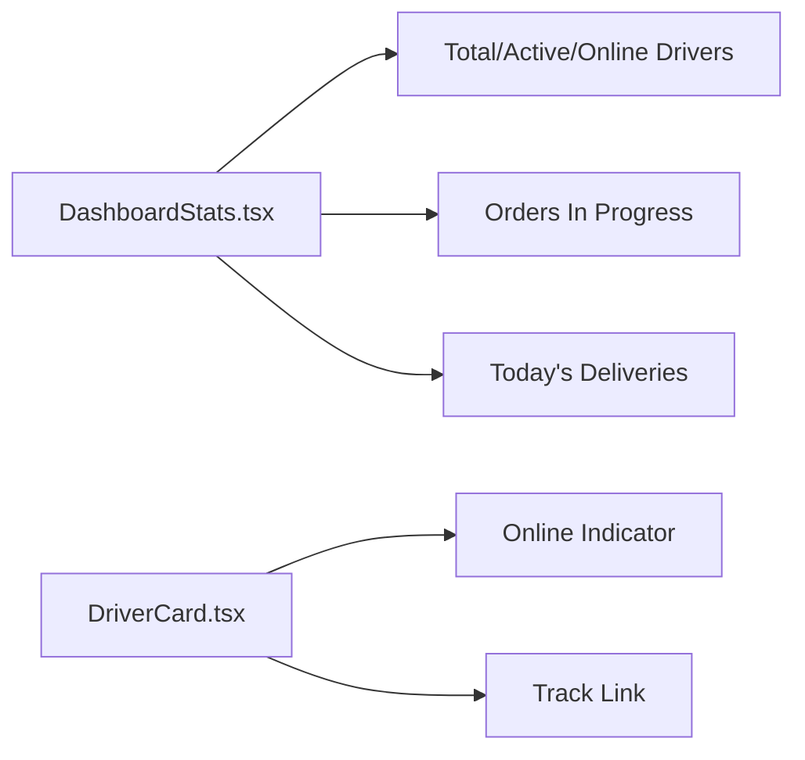
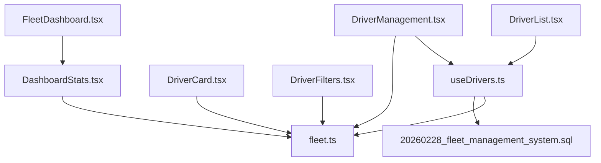

# Driver Management

<cite>
**Referenced Files in This Document**
- [fleet-management-portal-design.md](file://docs/fleet-management-portal-design.md)
- [20260228_fleet_management_system.sql](file://supabase/migrations/20260228_fleet_management_system.sql)
- [fleet.ts](file://src/fleet/types/fleet.ts)
- [DriverList.tsx](file://src/fleet/components/drivers/DriverList.tsx)
- [DriverFilters.tsx](file://src/fleet/components/drivers/DriverFilters.tsx)
- [DriverCard.tsx](file://src/fleet/components/drivers/DriverCard.tsx)
- [useDrivers.ts](file://src/fleet/hooks/useDrivers.ts)
- [DriverManagement.tsx](file://src/fleet/pages/DriverManagement.tsx)
- [FleetDashboard.tsx](file://src/fleet/pages/FleetDashboard.tsx)
- [DashboardStats.tsx](file://src/fleet/components/dashboard/DashboardStats.tsx)
- [FleetLayout.tsx](file://src/fleet/components/layout/FleetLayout.tsx)
- [routes.tsx](file://src/fleet/routes.tsx)
- [DriverOnboarding.tsx](file://src/pages/driver/DriverOnboarding.tsx)
</cite>

## Table of Contents
1. [Introduction](#introduction)
2. [Project Structure](#project-structure)
3. [Core Components](#core-components)
4. [Architecture Overview](#architecture-overview)
5. [Detailed Component Analysis](#detailed-component-analysis)
6. [Dependency Analysis](#dependency-analysis)
7. [Performance Considerations](#performance-considerations)
8. [Troubleshooting Guide](#troubleshooting-guide)
9. [Conclusion](#conclusion)

## Introduction
This document describes the fleet driver management system, focusing on driver onboarding, background verification, fleet assignment workflows, and operational dashboards. It explains driver profile management, license validation, vehicle assignment, performance tracking, the driver listing interface with filtering and bulk operations, status monitoring, availability management, compliance tracking, and integration with live tracking and analytics.

## Project Structure
The driver management system spans frontend React components, routing, typed APIs, and backend Supabase tables and functions. The design document defines the database schema and API specification, while the frontend implements the driver listing, filtering, and dashboard views.

```mermaid
graph TB
subgraph "Frontend"
Routes["routes.tsx"]
Layout["FleetLayout.tsx"]
Dashboard["FleetDashboard.tsx"]
DriverListPage["DriverManagement.tsx"]
DriverListComp["DriverList.tsx"]
DriverCard["DriverCard.tsx"]
DriverFilters["DriverFilters.tsx"]
DashboardStats["DashboardStats.tsx"]
end
subgraph "Types"
Types["fleet.ts"]
end
subgraph "Hooks"
UseDrivers["useDrivers.ts"]
end
subgraph "Backend"
Schema["20260228_fleet_management_system.sql"]
Design["fleet-management-portal-design.md"]
end
Routes --> Layout
Layout --> Dashboard
Layout --> DriverListPage
DriverListPage --> DriverListComp
DriverListComp --> DriverCard
DriverListComp --> DriverFilters
Dashboard --> DashboardStats
DriverListPage --> UseDrivers
DriverListComp --> UseDrivers
Dashboard --> UseDrivers
UseDrivers --> Types
DriverListPage --> Types
Dashboard --> Types
Schema --> UseDrivers
Design --> Schema
```

**Diagram sources**
- [routes.tsx:20-41](file://src/fleet/routes.tsx#L20-L41)
- [FleetLayout.tsx:16-62](file://src/fleet/components/layout/FleetLayout.tsx#L16-L62)
- [FleetDashboard.tsx:21-294](file://src/fleet/pages/FleetDashboard.tsx#L21-L294)
- [DriverManagement.tsx:20-203](file://src/fleet/pages/DriverManagement.tsx#L20-L203)
- [DriverList.tsx:13-133](file://src/fleet/components/drivers/DriverList.tsx#L13-L133)
- [DriverCard.tsx:28-140](file://src/fleet/components/drivers/DriverCard.tsx#L28-L140)
- [DriverFilters.tsx:26-97](file://src/fleet/components/drivers/DriverFilters.tsx#L26-L97)
- [DashboardStats.tsx:18-111](file://src/fleet/components/dashboard/DashboardStats.tsx#L18-L111)
- [useDrivers.ts:16-104](file://src/fleet/hooks/useDrivers.ts#L16-L104)
- [fleet.ts:95-133](file://src/fleet/types/fleet.ts#L95-L133)
- [20260228_fleet_management_system.sql:233-270](file://supabase/migrations/20260228_fleet_management_system.sql#L233-L270)
- [fleet-management-portal-design.md:615-1265](file://docs/fleet-management-portal-design.md#L615-L1265)

**Section sources**
- [routes.tsx:20-41](file://src/fleet/routes.tsx#L20-L41)
- [FleetLayout.tsx:16-62](file://src/fleet/components/layout/FleetLayout.tsx#L16-L62)
- [FleetDashboard.tsx:21-294](file://src/fleet/pages/FleetDashboard.tsx#L21-L294)
- [DriverManagement.tsx:20-203](file://src/fleet/pages/DriverManagement.tsx#L20-L203)
- [DriverList.tsx:13-133](file://src/fleet/components/drivers/DriverList.tsx#L13-L133)
- [DriverCard.tsx:28-140](file://src/fleet/components/drivers/DriverCard.tsx#L28-L140)
- [DriverFilters.tsx:26-97](file://src/fleet/components/drivers/DriverFilters.tsx#L26-L97)
- [DashboardStats.tsx:18-111](file://src/fleet/components/dashboard/DashboardStats.tsx#L18-L111)
- [useDrivers.ts:16-104](file://src/fleet/hooks/useDrivers.ts#L16-L104)
- [fleet.ts:95-133](file://src/fleet/types/fleet.ts#L95-L133)
- [20260228_fleet_management_system.sql:233-270](file://supabase/migrations/20260228_fleet_management_system.sql#L233-L270)
- [fleet-management-portal-design.md:615-1265](file://docs/fleet-management-portal-design.md#L615-L1265)

## Core Components
- Driver listing and filtering: The driver list page integrates search, status filter, and online-only toggle, merging REST data with real-time tracking signals.
- Driver card: Presents contact info, ratings, delivery counts, current balance, and quick actions (track, view details).
- Driver filters: Provides popover-based status selection and an online-only toggle.
- Hooks: Centralized data fetching and transformations for drivers, stats, and payouts.
- Types: Strongly typed entities for drivers, vehicles, documents, payouts, and WebSocket events.
- Dashboard: Aggregates fleet statistics and presents driver status charts and recent activity.
- Backend schema: Defines drivers, vehicles, driver documents, driver locations, payouts, and activity logs.

**Section sources**
- [DriverList.tsx:13-133](file://src/fleet/components/drivers/DriverList.tsx#L13-L133)
- [DriverCard.tsx:28-140](file://src/fleet/components/drivers/DriverCard.tsx#L28-L140)
- [DriverFilters.tsx:26-97](file://src/fleet/components/drivers/DriverFilters.tsx#L26-L97)
- [useDrivers.ts:16-104](file://src/fleet/hooks/useDrivers.ts#L16-L104)
- [fleet.ts:95-133](file://src/fleet/types/fleet.ts#L95-L133)
- [FleetDashboard.tsx:21-294](file://src/fleet/pages/FleetDashboard.tsx#L21-L294)
- [20260228_fleet_management_system.sql:233-270](file://supabase/migrations/20260228_fleet_management_system.sql#L233-L270)

## Architecture Overview
The system follows a layered architecture:
- Frontend: React components and hooks integrate with Supabase for data retrieval and updates.
- Types: Shared TypeScript interfaces define entities and API contracts.
- Backend: Supabase tables and functions implement driver lifecycle, verification, and payouts.
- Real-time: WebSocket events update driver locations and statuses.



**Diagram sources**
- [DriverList.tsx:21-47](file://src/fleet/components/drivers/DriverList.tsx#L21-L47)
- [useDrivers.ts:24-92](file://src/fleet/hooks/useDrivers.ts#L24-L92)
- [fleet.ts:95-133](file://src/fleet/types/fleet.ts#L95-L133)

**Section sources**
- [DriverList.tsx:13-133](file://src/fleet/components/drivers/DriverList.tsx#L13-L133)
- [useDrivers.ts:16-104](file://src/fleet/hooks/useDrivers.ts#L16-L104)
- [fleet.ts:95-133](file://src/fleet/types/fleet.ts#L95-L133)

## Detailed Component Analysis

### Driver Listing Interface and Filtering
- Search: Text-based search across phone and license identifiers.
- Status filter: Enumerated statuses including pending verification, active, suspended, inactive.
- Online-only toggle: Restricts results to drivers currently online.
- Pagination: Controlled via page and limit parameters.
- Real-time merge: Live tracking data augments driver records for accurate online status and location.



**Diagram sources**
- [DriverList.tsx:21-47](file://src/fleet/components/drivers/DriverList.tsx#L21-L47)
- [useDrivers.ts:24-92](file://src/fleet/hooks/useDrivers.ts#L24-L92)

**Section sources**
- [DriverList.tsx:13-133](file://src/fleet/components/drivers/DriverList.tsx#L13-L133)
- [DriverFilters.tsx:26-97](file://src/fleet/components/drivers/DriverFilters.tsx#L26-L97)
- [useDrivers.ts:16-104](file://src/fleet/hooks/useDrivers.ts#L16-L104)

### Driver Profile Management and License Validation
- Driver profiles include contact info, status, ratings, delivery metrics, balances, and assigned vehicle.
- License validation is part of the driver onboarding flow and document verification pipeline.
- Documents table supports multiple document types (ID card, driving license, vehicle registration, insurance, background check, contract) with verification status tracking.



**Diagram sources**
- [fleet.ts:95-133](file://src/fleet/types/fleet.ts#L95-L133)
- [fleet.ts:224-237](file://src/fleet/types/fleet.ts#L224-L237)
- [20260228_fleet_management_system.sql:345-363](file://supabase/migrations/20260228_fleet_management_system.sql#L345-L363)

**Section sources**
- [fleet.ts:95-133](file://src/fleet/types/fleet.ts#L95-L133)
- [20260228_fleet_management_system.sql:123-136](file://supabase/migrations/20260228_fleet_management_system.sql#L123-L136)
- [20260228_fleet_management_system.sql:345-363](file://supabase/migrations/20260228_fleet_management_system.sql#L345-L363)

### Vehicle Assignment and Availability Management
- Vehicles have type, make, model, year, color, plate number, insurance provider, and status (available, assigned, maintenance, retired).
- Assigned driver relationship enables fleet managers to assign vehicles to drivers.
- Insurance expiry tracking helps manage compliance and availability.



**Diagram sources**
- [fleet.ts:186-218](file://src/fleet/types/fleet.ts#L186-L218)
- [20260228_fleet_management_system.sql:304-334](file://supabase/migrations/20260228_fleet_management_system.sql#L304-L334)

**Section sources**
- [fleet.ts:186-218](file://src/fleet/types/fleet.ts#L186-L218)
- [20260228_fleet_management_system.sql:304-334](file://supabase/migrations/20260228_fleet_management_system.sql#L304-L334)

### Performance Tracking and Compliance Tracking
- Driver performance metrics include total deliveries, completed deliveries, cancelled deliveries, average rating, average delivery time, on-time rate, and earnings.
- Compliance tracking includes document verification status and expiry dates.
- Activity logs capture driver and fleet manager actions for auditability.



**Diagram sources**
- [fleet.ts:172-180](file://src/fleet/types/fleet.ts#L172-L180)
- [fleet.ts:162-170](file://src/fleet/types/fleet.ts#L162-L170)
- [fleet.ts:224-237](file://src/fleet/types/fleet.ts#L224-L237)
- [20260228_fleet_management_system.sql:434-446](file://supabase/migrations/20260228_fleet_management_system.sql#L434-L446)
- [20260228_fleet_management_system.sql:123-136](file://supabase/migrations/20260228_fleet_management_system.sql#L123-L136)

**Section sources**
- [fleet.ts:172-180](file://src/fleet/types/fleet.ts#L172-L180)
- [fleet.ts:162-170](file://src/fleet/types/fleet.ts#L162-L170)
- [20260228_fleet_management_system.sql:434-446](file://supabase/migrations/20260228_fleet_management_system.sql#L434-L446)
- [20260228_fleet_management_system.sql:123-136](file://supabase/migrations/20260228_fleet_management_system.sql#L123-L136)

### Driver Onboarding Procedures
- The driver onboarding page collects vehicle type, make, model, plate number, and license number.
- License requirements vary by vehicle type; certain types require a license.
- After submission, the driver awaits fleet approval.



**Diagram sources**
- [DriverOnboarding.tsx:34-119](file://src/pages/driver/DriverOnboarding.tsx#L34-L119)

**Section sources**
- [DriverOnboarding.tsx:34-119](file://src/pages/driver/DriverOnboarding.tsx#L34-L119)

### Background Verification Processes
- The document verification pipeline tracks verification status and expiry dates for ID, driving license, vehicle registration, insurance, background checks, and contracts.
- Verification status transitions include pending, approved, rejected, expired.
- Expiry date triggers alerts and impacts availability.



**Diagram sources**
- [20260228_fleet_management_system.sql:123-136](file://supabase/migrations/20260228_fleet_management_system.sql#L123-L136)
- [20260228_fleet_management_system.sql:345-363](file://supabase/migrations/20260228_fleet_management_system.sql#L345-L363)

**Section sources**
- [20260228_fleet_management_system.sql:123-136](file://supabase/migrations/20260228_fleet_management_system.sql#L123-L136)
- [20260228_fleet_management_system.sql:345-363](file://supabase/migrations/20260228_fleet_management_system.sql#L345-L363)

### Fleet Assignment Workflows
- Fleet managers can assign vehicles to drivers and update driver status.
- Driver status influences visibility and eligibility for assignments.
- Real-time tracking updates enable live monitoring of driver locations.



**Diagram sources**
- [DriverManagement.tsx:20-203](file://src/fleet/pages/DriverManagement.tsx#L20-L203)
- [useDrivers.ts:184-241](file://src/fleet/hooks/useDrivers.ts#L184-L241)

**Section sources**
- [DriverManagement.tsx:20-203](file://src/fleet/pages/DriverManagement.tsx#L20-L203)
- [useDrivers.ts:184-241](file://src/fleet/hooks/useDrivers.ts#L184-L241)

### Driver Status Monitoring and Availability Management
- Dashboard displays total drivers, active drivers, online drivers, orders in progress, today’s deliveries, and average delivery time.
- Driver cards indicate online/offline status and provide quick links to track drivers.



**Diagram sources**
- [DashboardStats.tsx:18-111](file://src/fleet/components/dashboard/DashboardStats.tsx#L18-L111)
- [FleetDashboard.tsx:21-294](file://src/fleet/pages/FleetDashboard.tsx#L21-L294)
- [DriverCard.tsx:28-140](file://src/fleet/components/drivers/DriverCard.tsx#L28-L140)

**Section sources**
- [DashboardStats.tsx:18-111](file://src/fleet/components/dashboard/DashboardStats.tsx#L18-L111)
- [FleetDashboard.tsx:21-294](file://src/fleet/pages/FleetDashboard.tsx#L21-L294)
- [DriverCard.tsx:28-140](file://src/fleet/components/drivers/DriverCard.tsx#L28-L140)

### Communication Features, Shift Scheduling Integration, and Performance Analytics
- Communication: Driver cards expose contact info; fleet managers can initiate actions from driver details.
- Shift scheduling: Not explicitly implemented in the reviewed files; fleet assignment and status controls are available.
- Performance analytics: Dashboard aggregates KPIs; driver performance metrics are defined in types.

[No sources needed since this section synthesizes capabilities without analyzing specific files]

## Dependency Analysis
The frontend components depend on shared types and hooks, which in turn depend on Supabase for data persistence. The backend schema defines the data model and constraints.



**Diagram sources**
- [fleet.ts:95-133](file://src/fleet/types/fleet.ts#L95-L133)
- [useDrivers.ts:16-104](file://src/fleet/hooks/useDrivers.ts#L16-L104)
- [DriverList.tsx:13-133](file://src/fleet/components/drivers/DriverList.tsx#L13-L133)
- [DriverCard.tsx:28-140](file://src/fleet/components/drivers/DriverCard.tsx#L28-L140)
- [DriverFilters.tsx:26-97](file://src/fleet/components/drivers/DriverFilters.tsx#L26-L97)
- [DriverManagement.tsx:20-203](file://src/fleet/pages/DriverManagement.tsx#L20-L203)
- [FleetDashboard.tsx:21-294](file://src/fleet/pages/FleetDashboard.tsx#L21-L294)
- [DashboardStats.tsx:18-111](file://src/fleet/components/dashboard/DashboardStats.tsx#L18-L111)
- [20260228_fleet_management_system.sql:233-270](file://supabase/migrations/20260228_fleet_management_system.sql#L233-L270)

**Section sources**
- [fleet.ts:95-133](file://src/fleet/types/fleet.ts#L95-L133)
- [useDrivers.ts:16-104](file://src/fleet/hooks/useDrivers.ts#L16-L104)
- [DriverList.tsx:13-133](file://src/fleet/components/drivers/DriverList.tsx#L13-L133)
- [DriverCard.tsx:28-140](file://src/fleet/components/drivers/DriverCard.tsx#L28-L140)
- [DriverFilters.tsx:26-97](file://src/fleet/components/drivers/DriverFilters.tsx#L26-L97)
- [DriverManagement.tsx:20-203](file://src/fleet/pages/DriverManagement.tsx#L20-L203)
- [FleetDashboard.tsx:21-294](file://src/fleet/pages/FleetDashboard.tsx#L21-L294)
- [DashboardStats.tsx:18-111](file://src/fleet/components/dashboard/DashboardStats.tsx#L18-L111)
- [20260228_fleet_management_system.sql:233-270](file://supabase/migrations/20260228_fleet_management_system.sql#L233-L270)

## Performance Considerations
- Database indexing: Status, online status, and location indexes improve query performance for filtering and geospatial queries.
- Pagination: REST endpoints support pagination to avoid large payloads.
- Real-time updates: WebSocket events keep driver locations and statuses current without polling.

[No sources needed since this section provides general guidance]

## Troubleshooting Guide
- Driver list empty: Verify filters (status, online-only, search) and pagination limits.
- Loading states: Use skeleton loaders while data is being fetched.
- Toast notifications: Errors during data fetch trigger user-facing messages.

**Section sources**
- [DriverList.tsx:84-98](file://src/fleet/components/drivers/DriverList.tsx#L84-L98)
- [useDrivers.ts:82-91](file://src/fleet/hooks/useDrivers.ts#L82-L91)

## Conclusion
The fleet driver management system provides a comprehensive solution for driver onboarding, verification, assignment, and monitoring. The frontend offers robust filtering and real-time visibility, while the backend schema and API specification support scalability and compliance. The design document and database schema define clear contracts for drivers, vehicles, documents, payouts, and activity logs, enabling efficient fleet operations and analytics.