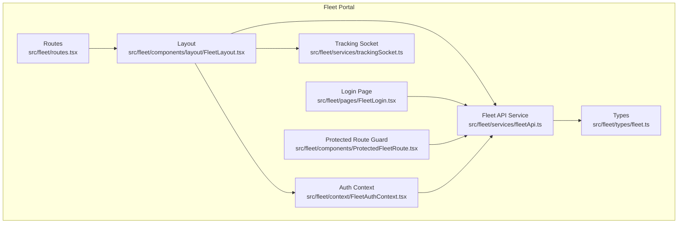
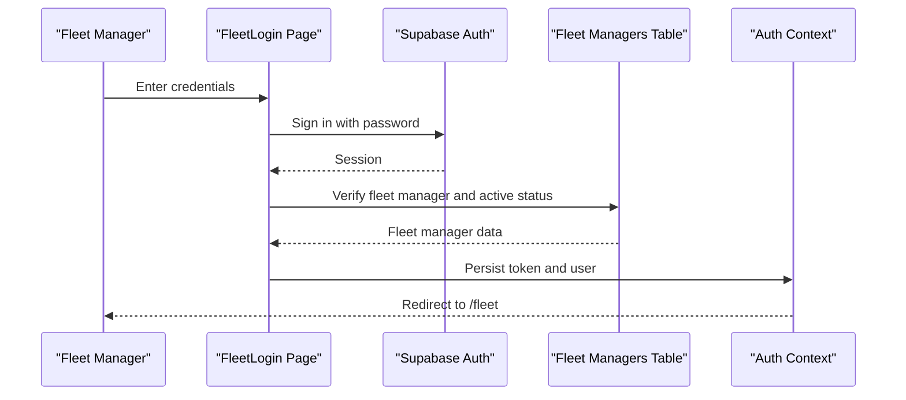
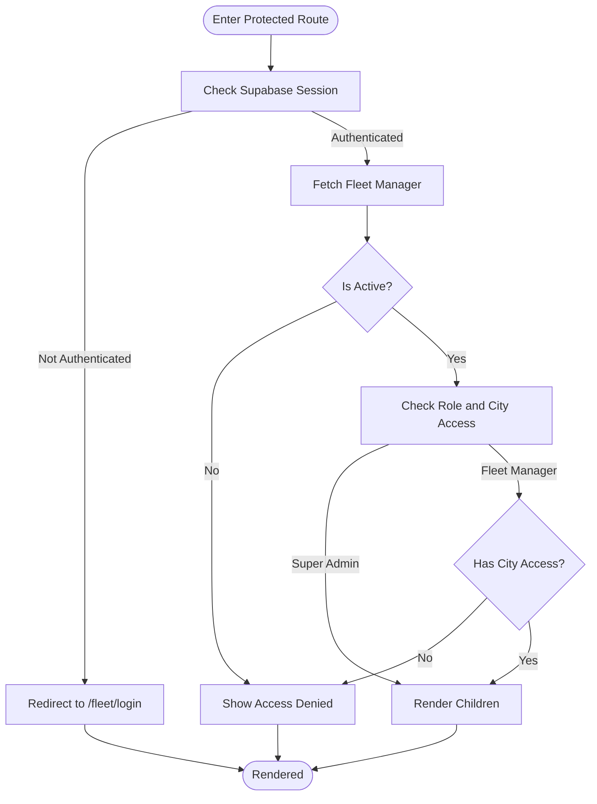
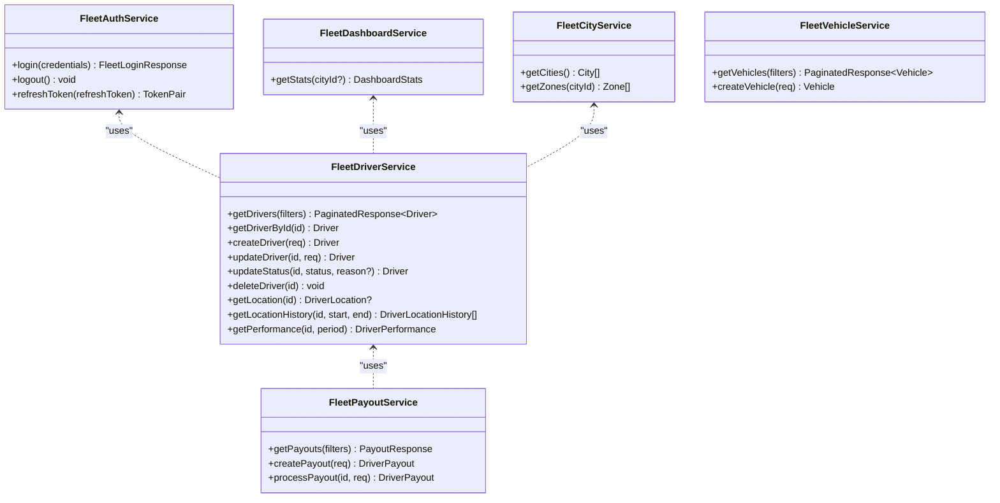
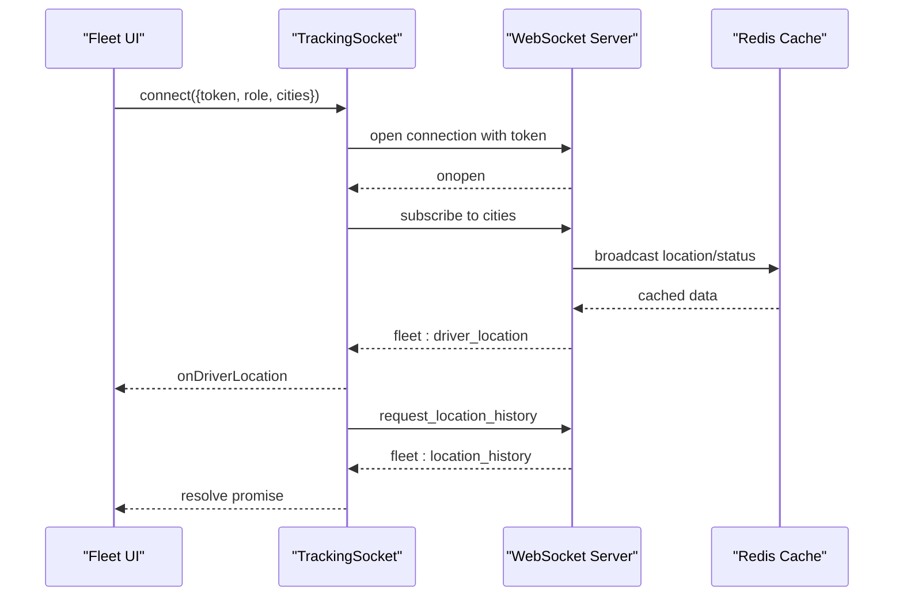
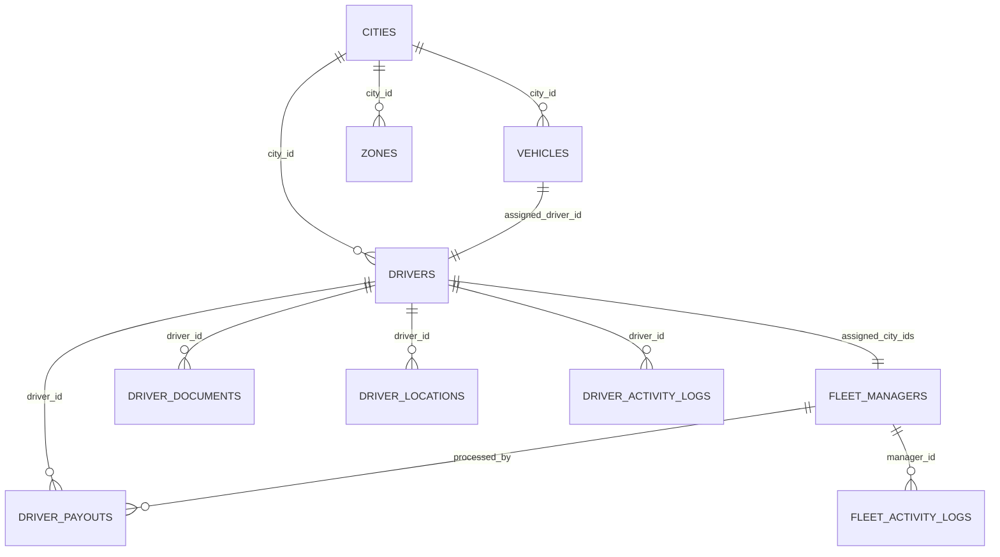
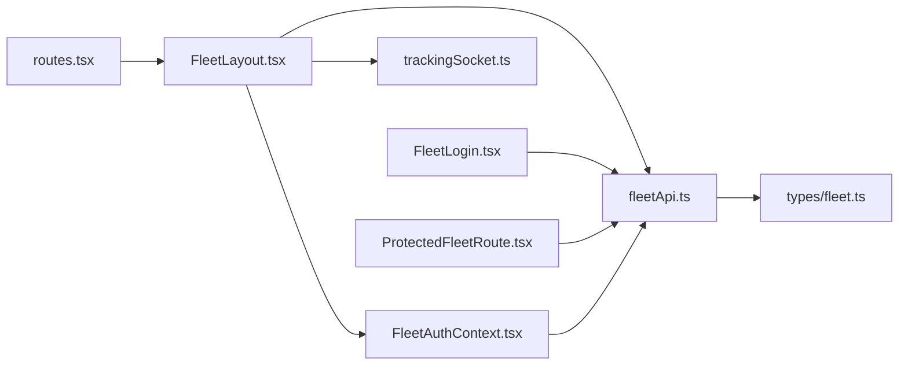

# Fleet Integration

<cite>
**Referenced Files in This Document**
- [src/fleet/index.ts](file://src/fleet/index.ts)
- [src/fleet/routes.tsx](file://src/fleet/routes.tsx)
- [src/fleet/context/FleetAuthContext.tsx](file://src/fleet/context/FleetAuthContext.tsx)
- [src/fleet/components/ProtectedFleetRoute.tsx](file://src/fleet/components/ProtectedFleetRoute.tsx)
- [src/fleet/services/fleetApi.ts](file://src/fleet/services/fleetApi.ts)
- [src/fleet/services/trackingSocket.ts](file://src/fleet/services/trackingSocket.ts)
- [src/fleet/pages/FleetLogin.tsx](file://src/fleet/pages/FleetLogin.tsx)
- [src/fleet/types/fleet.ts](file://src/fleet/types/fleet.ts)
- [src/fleet/components/layout/FleetLayout.tsx](file://src/fleet/components/layout/FleetLayout.tsx)
- [docs/fleet-management-portal-design.md](file://docs/fleet-management-portal-design.md)
- [scripts/setup-fleet-demo.sh](file://scripts/setup-fleet-demo.sh)
</cite>

## Table of Contents
1. [Introduction](#introduction)
2. [Project Structure](#project-structure)
3. [Core Components](#core-components)
4. [Architecture Overview](#architecture-overview)
5. [Detailed Component Analysis](#detailed-component-analysis)
6. [Dependency Analysis](#dependency-analysis)
7. [Performance Considerations](#performance-considerations)
8. [Troubleshooting Guide](#troubleshooting-guide)
9. [Conclusion](#conclusion)

## Introduction
This document provides comprehensive documentation for the Fleet Management Portal integration and context management within the Nutrio platform. It explains the fleet API service architecture, authentication mechanisms, and context provider implementations. It also details city-based access control, fleet manager permissions, and hierarchical authorization structures, along with integration patterns with the main Nutrio platform, data synchronization processes, and cross-system communication protocols. Authentication flows for fleet administrators, session management, and role-based access control are covered in depth.

## Project Structure
The Fleet Management Portal is implemented as a modular React application integrated into the broader Nutrio ecosystem. Key areas include:
- Public exports and routing configuration
- Authentication context and protected route guards
- Fleet API service layer interacting with Supabase
- Real-time tracking via WebSocket
- UI layout and pages for fleet operations



**Diagram sources**
- [src/fleet/routes.tsx:1-42](file://src/fleet/routes.tsx#L1-L42)
- [src/fleet/components/layout/FleetLayout.tsx:1-63](file://src/fleet/components/layout/FleetLayout.tsx#L1-L63)
- [src/fleet/pages/FleetLogin.tsx:1-228](file://src/fleet/pages/FleetLogin.tsx#L1-L228)
- [src/fleet/components/ProtectedFleetRoute.tsx:1-171](file://src/fleet/components/ProtectedFleetRoute.tsx#L1-L171)
- [src/fleet/context/FleetAuthContext.tsx:1-183](file://src/fleet/context/FleetAuthContext.tsx#L1-L183)
- [src/fleet/services/fleetApi.ts:1-800](file://src/fleet/services/fleetApi.ts#L1-L800)
- [src/fleet/services/trackingSocket.ts:1-287](file://src/fleet/services/trackingSocket.ts#L1-L287)
- [src/fleet/types/fleet.ts:1-513](file://src/fleet/types/fleet.ts#L1-L513)

**Section sources**
- [src/fleet/index.ts:1-14](file://src/fleet/index.ts#L1-L14)
- [src/fleet/routes.tsx:1-42](file://src/fleet/routes.tsx#L1-L42)
- [src/fleet/components/layout/FleetLayout.tsx:1-63](file://src/fleet/components/layout/FleetLayout.tsx#L1-L63)

## Core Components
- Public exports and routing: Exports the layout, protected route guard, and route definitions for the fleet portal.
- Authentication context: Manages fleet manager login, token lifecycle, and city-based access checks.
- Protected route guard: Ensures only fleet managers with active accounts can access fleet routes.
- Fleet API service: Provides typed operations for drivers, vehicles, payouts, cities, and dashboard statistics.
- Real-time tracking socket: Handles WebSocket connections for live driver location and status updates.
- Login page: Implements fleet manager sign-in with validation and session persistence.
- Types: Defines enums, entities, filters, and WebSocket event types for fleet operations.

**Section sources**
- [src/fleet/index.ts:1-14](file://src/fleet/index.ts#L1-L14)
- [src/fleet/context/FleetAuthContext.tsx:1-183](file://src/fleet/context/FleetAuthContext.tsx#L1-L183)
- [src/fleet/components/ProtectedFleetRoute.tsx:1-171](file://src/fleet/components/ProtectedFleetRoute.tsx#L1-L171)
- [src/fleet/services/fleetApi.ts:1-800](file://src/fleet/services/fleetApi.ts#L1-L800)
- [src/fleet/services/trackingSocket.ts:1-287](file://src/fleet/services/trackingSocket.ts#L1-L287)
- [src/fleet/pages/FleetLogin.tsx:1-228](file://src/fleet/pages/FleetLogin.tsx#L1-L228)
- [src/fleet/types/fleet.ts:1-513](file://src/fleet/types/fleet.ts#L1-L513)

## Architecture Overview
The fleet portal integrates with the main Nutrio platform through shared authentication and Supabase services. The architecture supports:
- Multi-city isolation with row-level security policies
- Hierarchical authorization (super admin vs fleet manager)
- Real-time tracking via WebSocket
- REST-like service layer for fleet operations

```mermaid
graph TB
Client["Fleet Web App<br/>React SPA"]
Auth["Supabase Auth"]
EdgeFuncs["Supabase Edge Functions<br/>fleet-*"]
Postgres["PostgreSQL (Supabase)<br/>Fleet Tables"]
Redis["Redis (Supabase)<br/>Session Cache"]
WS["WebSocket Server<br/>Realtime Tracking"]
Client --> Auth
Client --> EdgeFuncs
EdgeFuncs --> Postgres
EdgeFuncs --> Redis
Client <- --> WS
WS --> Redis
WS --> Postgres
```

**Diagram sources**
- [docs/fleet-management-portal-design.md:84-122](file://docs/fleet-management-portal-design.md#L84-L122)
- [docs/fleet-management-portal-design.md:536-607](file://docs/fleet-management-portal-design.md#L536-L607)

## Detailed Component Analysis

### Authentication and Authorization Flow
The fleet portal enforces role-based access control and session management:
- Fleet managers authenticate against Supabase and are validated as active fleet managers.
- Tokens are persisted locally and refreshed automatically at intervals.
- City-based access is enforced via user roles and assigned city lists.
- Protected routes ensure only authenticated and authorized fleet managers can access fleet pages.



**Diagram sources**
- [src/fleet/pages/FleetLogin.tsx:71-135](file://src/fleet/pages/FleetLogin.tsx#L71-L135)
- [src/fleet/context/FleetAuthContext.tsx:75-121](file://src/fleet/context/FleetAuthContext.tsx#L75-L121)
- [src/fleet/services/fleetApi.ts:35-75](file://src/fleet/services/fleetApi.ts#L35-L75)

**Section sources**
- [src/fleet/pages/FleetLogin.tsx:1-228](file://src/fleet/pages/FleetLogin.tsx#L1-L228)
- [src/fleet/context/FleetAuthContext.tsx:1-183](file://src/fleet/context/FleetAuthContext.tsx#L1-L183)
- [src/fleet/services/fleetApi.ts:1-93](file://src/fleet/services/fleetApi.ts#L1-L93)

### Protected Route Guard and City-Based Access Control
Protected routes validate the user's Supabase session and check fleet manager status and activation. City-based access control is enforced through:
- Super admin: full access across all cities
- Fleet manager: access limited to assigned cities



**Diagram sources**
- [src/fleet/components/ProtectedFleetRoute.tsx:61-134](file://src/fleet/components/ProtectedFleetRoute.tsx#L61-L134)
- [src/fleet/context/FleetAuthContext.tsx:123-127](file://src/fleet/context/FleetAuthContext.tsx#L123-L127)

**Section sources**
- [src/fleet/components/ProtectedFleetRoute.tsx:1-171](file://src/fleet/components/ProtectedFleetRoute.tsx#L1-L171)
- [src/fleet/context/FleetAuthContext.tsx:123-127](file://src/fleet/context/FleetAuthContext.tsx#L123-L127)

### Fleet API Service Layer
The fleet API service encapsulates all fleet operations:
- Authentication: login, logout, token refresh
- Dashboard: city-scoped statistics
- Cities and zones: retrieval of active cities and zones
- Drivers: CRUD, filtering, status updates, location history
- Vehicles: CRUD and filtering
- Payouts: creation, processing, summaries
- Activity logging: driver and fleet activity



**Diagram sources**
- [src/fleet/services/fleetApi.ts:35-75](file://src/fleet/services/fleetApi.ts#L35-L75)
- [src/fleet/services/fleetApi.ts:99-123](file://src/fleet/services/fleetApi.ts#L99-L123)
- [src/fleet/services/fleetApi.ts:129-172](file://src/fleet/services/fleetApi.ts#L129-L172)
- [src/fleet/services/fleetApi.ts:178-256](file://src/fleet/services/fleetApi.ts#L178-L256)
- [src/fleet/services/fleetApi.ts:258-293](file://src/fleet/services/fleetApi.ts#L258-L293)
- [src/fleet/services/fleetApi.ts:295-368](file://src/fleet/services/fleetApi.ts#L295-L368)
- [src/fleet/services/fleetApi.ts:370-446](file://src/fleet/services/fleetApi.ts#L370-L446)
- [src/fleet/services/fleetApi.ts:534-635](file://src/fleet/services/fleetApi.ts#L534-L635)
- [src/fleet/services/fleetApi.ts:641-758](file://src/fleet/services/fleetApi.ts#L641-L758)

**Section sources**
- [src/fleet/services/fleetApi.ts:1-800](file://src/fleet/services/fleetApi.ts#L1-L800)

### Real-Time Tracking Socket
The tracking socket service manages WebSocket connections for live driver location and status updates:
- Connects with token-based authentication
- Subscribes to city-specific channels based on user role
- Handles reconnection with exponential backoff
- Supports location history requests and event-driven updates



**Diagram sources**
- [src/fleet/services/trackingSocket.ts:34-95](file://src/fleet/services/trackingSocket.ts#L34-L95)
- [src/fleet/services/trackingSocket.ts:228-269](file://src/fleet/services/trackingSocket.ts#L228-L269)

**Section sources**
- [src/fleet/services/trackingSocket.ts:1-287](file://src/fleet/services/trackingSocket.ts#L1-L287)

### Data Models and Types
The fleet types define the domain model and request/response structures:
- Enums for statuses, roles, and document types
- Entities for cities, zones, drivers, vehicles, payouts, and activity logs
- Filters and paginated responses
- WebSocket event types for driver location and status updates



**Diagram sources**
- [src/fleet/types/fleet.ts:65-316](file://src/fleet/types/fleet.ts#L65-L316)

**Section sources**
- [src/fleet/types/fleet.ts:1-513](file://src/fleet/types/fleet.ts#L1-L513)

### Integration Patterns with Main Nutrio Platform
- Shared authentication via Supabase ensures consistent identity across portals.
- Edge functions provide a unified backend for fleet operations.
- Real-time tracking complements the main platform's delivery orchestration.
- Cross-system communication leverages Supabase storage and database for document and data synchronization.

**Section sources**
- [docs/fleet-management-portal-design.md:84-122](file://docs/fleet-management-portal-design.md#L84-L122)
- [src/fleet/services/fleetApi.ts:488-528](file://src/fleet/services/fleetApi.ts#L488-L528)

### Setup and Deployment
The demo setup script automates:
- Applying database migrations
- Deploying edge functions
- Creating demo auth users and data
- Starting the WebSocket server

**Section sources**
- [scripts/setup-fleet-demo.sh:1-142](file://scripts/setup-fleet-demo.sh#L1-L142)

## Dependency Analysis
The fleet portal exhibits clear separation of concerns:
- UI components depend on context providers and services
- Services depend on Supabase for authentication and data
- Types define contracts across components and services
- Routing orchestrates protected access and layout rendering



**Diagram sources**
- [src/fleet/routes.tsx:1-42](file://src/fleet/routes.tsx#L1-L42)
- [src/fleet/components/layout/FleetLayout.tsx:1-63](file://src/fleet/components/layout/FleetLayout.tsx#L1-L63)
- [src/fleet/context/FleetAuthContext.tsx:1-183](file://src/fleet/context/FleetAuthContext.tsx#L1-L183)
- [src/fleet/services/fleetApi.ts:1-800](file://src/fleet/services/fleetApi.ts#L1-L800)
- [src/fleet/services/trackingSocket.ts:1-287](file://src/fleet/services/trackingSocket.ts#L1-L287)
- [src/fleet/pages/FleetLogin.tsx:1-228](file://src/fleet/pages/FleetLogin.tsx#L1-L228)
- [src/fleet/components/ProtectedFleetRoute.tsx:1-171](file://src/fleet/components/ProtectedFleetRoute.tsx#L1-L171)
- [src/fleet/types/fleet.ts:1-513](file://src/fleet/types/fleet.ts#L1-L513)

**Section sources**
- [src/fleet/index.ts:1-14](file://src/fleet/index.ts#L1-L14)
- [src/fleet/routes.tsx:1-42](file://src/fleet/routes.tsx#L1-L42)

## Performance Considerations
- Token refresh occurs at a fixed interval to minimize repeated authentication overhead.
- Local caching of fleet manager data reduces redundant Supabase queries.
- Pagination is implemented for drivers and vehicles to limit payload sizes.
- Real-time updates leverage WebSocket subscriptions to avoid polling.
- Database indexes and RLS policies ensure efficient filtering and data isolation.

## Troubleshooting Guide
Common issues and resolutions:
- Authentication failures: Verify Supabase credentials and fleet manager activation status.
- Access denied errors: Confirm user role and assigned cities; super admins have global access.
- Token refresh failures: Check refresh token validity and network connectivity.
- WebSocket disconnections: Inspect reconnection logic and server availability.
- Data isolation violations: Ensure RLS policies are enabled and correctly configured.

**Section sources**
- [src/fleet/context/FleetAuthContext.tsx:54-73](file://src/fleet/context/FleetAuthContext.tsx#L54-L73)
- [src/fleet/components/ProtectedFleetRoute.tsx:76-107](file://src/fleet/components/ProtectedFleetRoute.tsx#L76-L107)
- [src/fleet/services/trackingSocket.ts:162-178](file://src/fleet/services/trackingSocket.ts#L162-L178)

## Conclusion
The Fleet Management Portal integrates tightly with the Nutrio platform through shared Supabase infrastructure, providing secure, scalable fleet operations with real-time tracking. The architecture enforces robust role-based access control, supports multi-city isolation, and offers a comprehensive service layer for drivers, vehicles, and payouts. The documented patterns and components enable reliable integration and future enhancements.