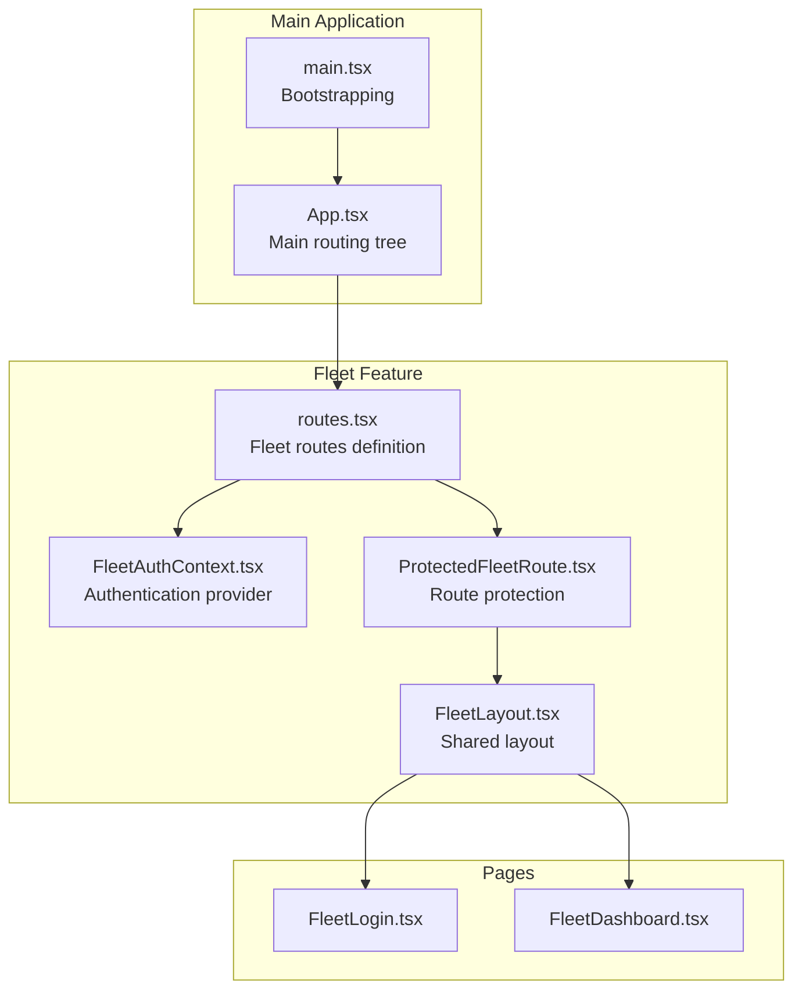
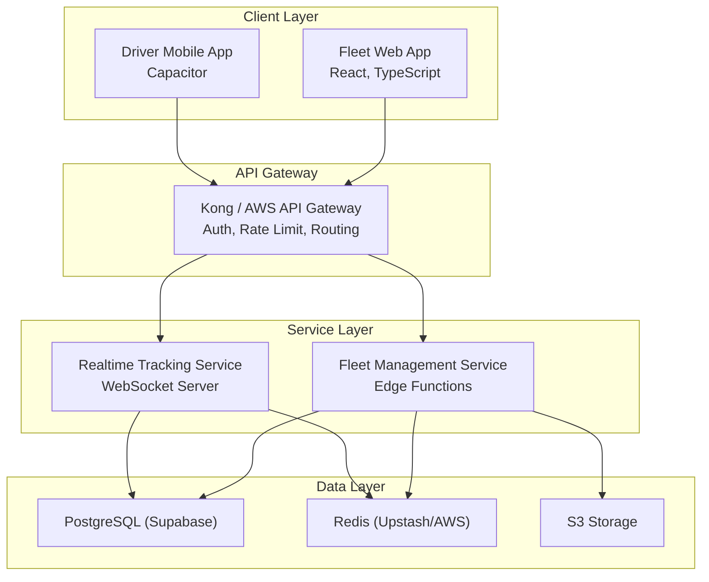
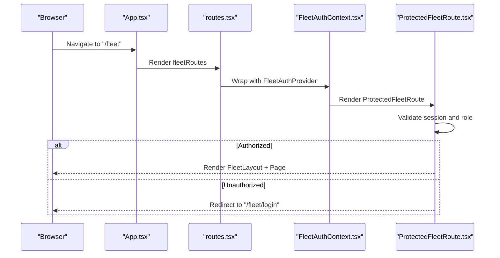
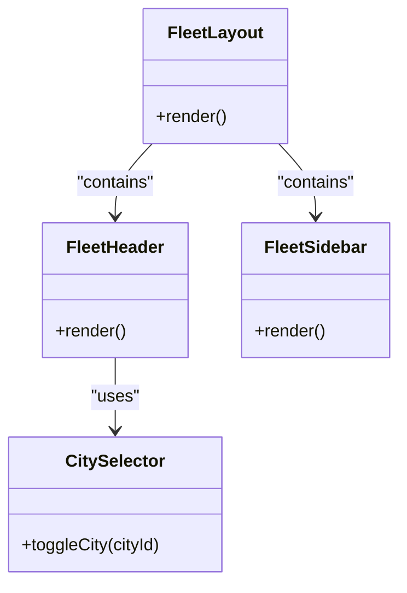
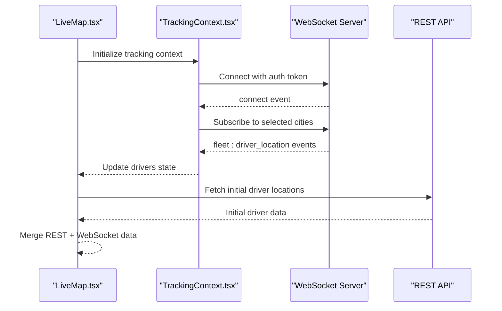
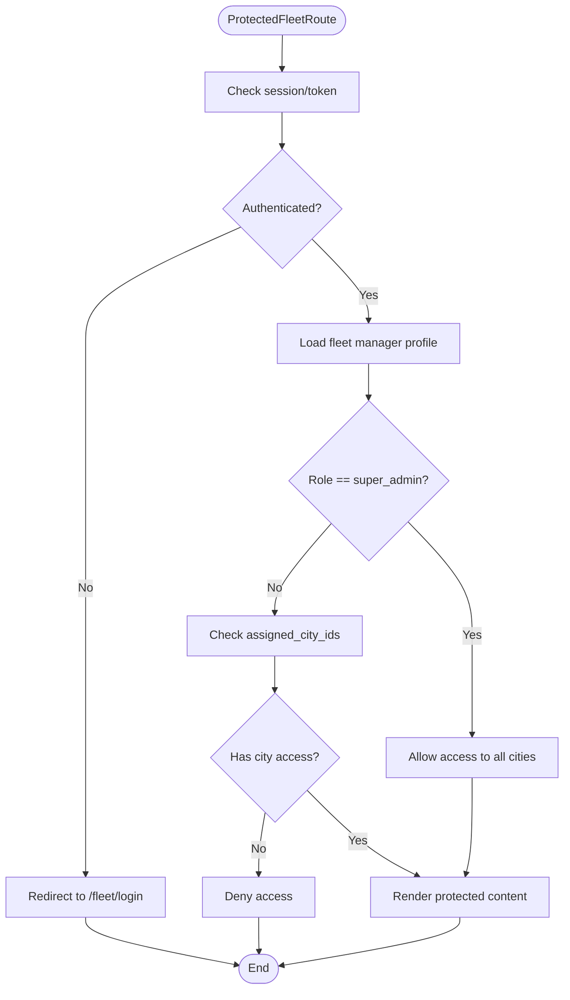
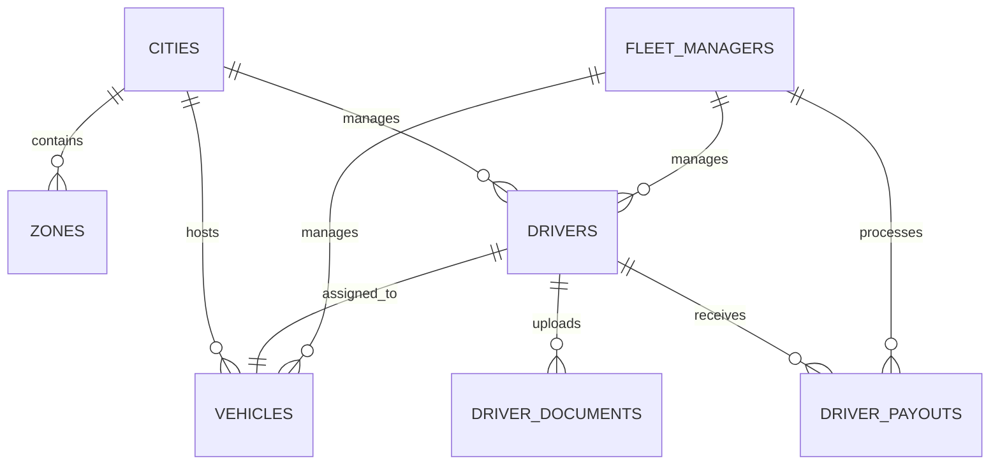
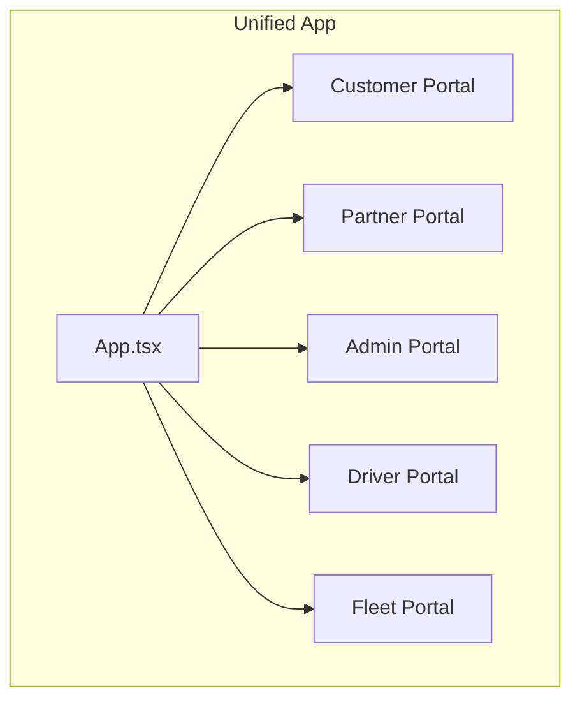
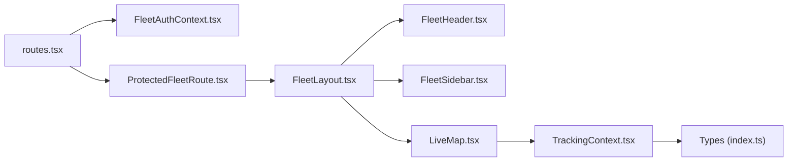

# Fleet Management Overview

<cite>
**Referenced Files in This Document**
- [index.ts](file://src/fleet/index.ts)
- [routes.tsx](file://src/fleet/routes.tsx)
- [App.tsx](file://src/App.tsx)
- [main.tsx](file://src/main.tsx)
- [ProtectedFleetRoute.tsx](file://src/fleet/components/ProtectedFleetRoute.tsx)
- [FleetAuthContext.tsx](file://src/fleet/context/FleetAuthContext.tsx)
- [FleetLayout.tsx](file://src/fleet/components/layout/FleetLayout.tsx)
- [FleetHeader.tsx](file://src/fleet/components/layout/FleetHeader.tsx)
- [FleetSidebar.tsx](file://src/fleet/components/layout/FleetSidebar.tsx)
- [FleetDashboard.tsx](file://src/fleet/pages/FleetDashboard.tsx)
- [FleetLogin.tsx](file://src/fleet/pages/FleetLogin.tsx)
- [LiveMap.tsx](file://src/fleet/components/map/LiveMap.tsx)
- [TrackingContext.tsx](file://src/fleet/context/TrackingContext.tsx)
- [CitySelector.tsx](file://src/fleet/components/common/CitySelector.tsx)
- [DriverList.tsx](file://src/fleet/components/drivers/DriverList.tsx)
- [fleet-management-portal-design.md](file://docs/fleet-management-portal-design.md)
- [index.ts](file://src/fleet/types/index.ts)
</cite>

## Table of Contents
1. [Introduction](#introduction)
2. [Project Structure](#project-structure)
3. [Core Components](#core-components)
4. [Architecture Overview](#architecture-overview)
5. [Detailed Component Analysis](#detailed-component-analysis)
6. [Dependency Analysis](#dependency-analysis)
7. [Performance Considerations](#performance-considerations)
8. [Troubleshooting Guide](#troubleshooting-guide)
9. [Conclusion](#conclusion)
10. [Appendices](#appendices)

## Introduction
This document provides a comprehensive overview of the Fleet Management Portal system within the Nutrio platform. It explains the corporate meal program architecture, fleet administrator roles and permissions, integration with the main Nutrio platform, routing system, layout components, protected route mechanisms, organizational structure (city-based fleet management), corporate account hierarchies, and administrative workflows. It also outlines system requirements, user onboarding procedures, and initial setup processes for fleet administrators.

## Project Structure
The Fleet Management Portal is integrated into the main Nutrio application as a modular feature area. The application uses React Router for navigation and React.lazy for code-splitting. The fleet routes are composed and injected into the main App routing tree, ensuring separation of concerns while maintaining seamless integration with the broader platform.

**Diagram sources**
- [App.tsx:725-727](file://src/App.tsx#L725-L727)
- [routes.tsx:20-41](file://src/fleet/routes.tsx#L20-L41)
- [FleetLayout.tsx:1907-1923](file://src/fleet/components/layout/FleetLayout.tsx#L1907-L1923)
- [FleetAuthContext.tsx](file://src/fleet/context/FleetAuthContext.tsx)
- [ProtectedFleetRoute.tsx:126-134](file://src/fleet/components/ProtectedFleetRoute.tsx#L126-L134)

**Section sources**
- [App.tsx:139-739](file://src/App.tsx#L139-L739)
- [routes.tsx:1-42](file://src/fleet/routes.tsx#L1-L42)
- [main.tsx:1-50](file://src/main.tsx#L1-L50)

## Core Components
- Public exports: The fleet module exposes the layout, protected route mechanism, and type definitions for downstream consumers.
- Route composition: Fleet routes are lazily loaded and wrapped with authentication and protection providers.
- Layout and navigation: FleetLayout composes header, sidebar, and content area, with city selection and live tracking integration.
- Authentication and authorization: FleetAuthContext manages session state; ProtectedFleetRoute enforces role-based access and city isolation.
- Types: Strongly typed interfaces define entities such as City, FleetManager, Driver, Vehicle, DriverDocument, DriverPayout, and dashboard statistics.

**Section sources**
- [index.ts:1-14](file://src/fleet/index.ts#L1-L14)
- [routes.tsx:20-41](file://src/fleet/routes.tsx#L20-L41)
- [FleetLayout.tsx:1907-1923](file://src/fleet/components/layout/FleetLayout.tsx#L1907-L1923)
- [ProtectedFleetRoute.tsx:126-134](file://src/fleet/components/ProtectedFleetRoute.tsx#L126-L134)
- [index.ts:4-187](file://src/fleet/types/index.ts#L4-L187)

## Architecture Overview
The Fleet Management Portal follows a layered architecture:
- Client Layer: React web application with lazy-loaded pages and shared UI components.
- API Gateway Layer: Authentication, rate limiting, and routing handled by the gateway.
- Service Layer: Fleet service (Supabase Edge Functions) and Realtime Service (WebSocket).
- Data Layer: PostgreSQL (Supabase), Redis, and S3 storage.

**Diagram sources**
- [fleet-management-portal-design.md:13-122](file://docs/fleet-management-portal-design.md#L13-L122)

**Section sources**
- [fleet-management-portal-design.md:9-166](file://docs/fleet-management-portal-design.md#L9-L166)

## Detailed Component Analysis

### Routing System and Protected Routes
The fleet routing system defines public and protected routes under the "/fleet" namespace. Authentication is enforced via FleetAuthProvider, and access control is managed by ProtectedFleetRoute. The main App integrates fleetRoutes into the global routing tree.

**Diagram sources**
- [App.tsx:725-727](file://src/App.tsx#L725-L727)
- [routes.tsx:23-27](file://src/fleet/routes.tsx#L23-L27)
- [FleetAuthContext.tsx](file://src/fleet/context/FleetAuthContext.tsx)
- [ProtectedFleetRoute.tsx:126-134](file://src/fleet/components/ProtectedFleetRoute.tsx#L126-L134)

**Section sources**
- [routes.tsx:20-41](file://src/fleet/routes.tsx#L20-L41)
- [App.tsx:725-727](file://src/App.tsx#L725-L727)
- [ProtectedFleetRoute.tsx:126-134](file://src/fleet/components/ProtectedFleetRoute.tsx#L126-L134)

### Layout Components and Navigation
FleetLayout composes the sidebar, header, and content area. The header includes city selection and navigation controls. The sidebar organizes access to drivers, vehicles, live tracking, route optimization, and payouts. CitySelector enables multi-city selection for super admins and single-city selection for fleet managers.

**Diagram sources**
- [FleetLayout.tsx:1907-1923](file://src/fleet/components/layout/FleetLayout.tsx#L1907-L1923)
- [FleetHeader.tsx](file://src/fleet/components/layout/FleetHeader.tsx)
- [FleetSidebar.tsx](file://src/fleet/components/layout/FleetSidebar.tsx)
- [CitySelector.tsx:2191-2256](file://src/fleet/components/common/CitySelector.tsx#L2191-L2256)

**Section sources**
- [FleetLayout.tsx:1907-1923](file://src/fleet/components/layout/FleetLayout.tsx#L1907-L1923)
- [CitySelector.tsx:2191-2256](file://src/fleet/components/common/CitySelector.tsx#L2191-L2256)

### Real-Time Tracking and Live Map
LiveMap integrates with a WebSocket server to render driver locations on a Mapbox map. TrackingContext manages socket connections, city subscriptions, and driver state updates. DriverList merges REST-provided driver data with real-time tracking updates.

**Diagram sources**
- [LiveMap.tsx:1945-2043](file://src/fleet/components/map/LiveMap.tsx#L1945-L2043)
- [TrackingContext.tsx:2077-2173](file://src/fleet/context/TrackingContext.tsx#L2077-L2173)
- [DriverList.tsx:2271-2320](file://src/fleet/components/drivers/DriverList.tsx#L2271-L2320)

**Section sources**
- [LiveMap.tsx:1945-2043](file://src/fleet/components/map/LiveMap.tsx#L1945-L2043)
- [TrackingContext.tsx:2077-2173](file://src/fleet/context/TrackingContext.tsx#L2077-L2173)
- [DriverList.tsx:2271-2320](file://src/fleet/components/drivers/DriverList.tsx#L2271-L2320)

### Roles and Permissions Model
Fleet administrators are represented by the FleetManager entity with two roles:
- Super Admin: Global access across all cities.
- Fleet Manager: Access limited to assigned cities.

ProtectedFleetRoute exposes helper hooks:
- useFleetManager(): Current fleet manager context.
- useIsSuperAdmin(): Boolean check for super admin.
- useHasCityAccess(cityId): Boolean check for city-specific access.

**Diagram sources**
- [ProtectedFleetRoute.tsx:126-134](file://src/fleet/components/ProtectedFleetRoute.tsx#L126-L134)
- [ProtectedFleetRoute.tsx:153-170](file://src/fleet/components/ProtectedFleetRoute.tsx#L153-L170)

**Section sources**
- [ProtectedFleetRoute.tsx:126-134](file://src/fleet/components/ProtectedFleetRoute.tsx#L126-L134)
- [ProtectedFleetRoute.tsx:153-170](file://src/fleet/components/ProtectedFleetRoute.tsx#L153-L170)
- [index.ts:17-27](file://src/fleet/types/index.ts#L17-L27)

### Organizational Structure and Administrative Workflows
The system supports city-based fleet management with multi-tenant data isolation:
- Cities: Geographic and operational boundaries.
- Zones: Sub-regions within cities for driver assignments.
- Drivers: Fleet personnel with status, ratings, and performance metrics.
- Vehicles: Transport assets with registration and insurance tracking.
- Payouts: Settlement processing with idempotency checks.

Administrative workflows include:
- Driver onboarding and verification.
- Vehicle registration and maintenance tracking.
- Live dispatch and route optimization.
- Payout generation and approval.

**Diagram sources**
- [fleet-management-portal-design.md:169-474](file://docs/fleet-management-portal-design.md#L169-L474)

**Section sources**
- [fleet-management-portal-design.md:124-166](file://docs/fleet-management-portal-design.md#L124-L166)
- [fleet-management-portal-design.md:169-474](file://docs/fleet-management-portal-design.md#L169-L474)

### Corporate Account Hierarchies and Integration with Nutrio Platform
The Fleet Management Portal is integrated alongside other portals (customer, partner, admin, driver) within the main application. Authentication and routing are unified, enabling cross-portal navigation and consistent user experience.

**Diagram sources**
- [App.tsx:150-739](file://src/App.tsx#L150-L739)

**Section sources**
- [App.tsx:150-739](file://src/App.tsx#L150-L739)

## Dependency Analysis
The fleet module depends on:
- React Router for routing and lazy loading.
- Context providers for authentication and real-time tracking.
- Shared UI components and styling.
- Supabase for backend services and data access.

**Diagram sources**
- [routes.tsx:20-41](file://src/fleet/routes.tsx#L20-L41)
- [ProtectedFleetRoute.tsx:126-134](file://src/fleet/components/ProtectedFleetRoute.tsx#L126-L134)
- [FleetLayout.tsx:1907-1923](file://src/fleet/components/layout/FleetLayout.tsx#L1907-L1923)
- [LiveMap.tsx:1945-2043](file://src/fleet/components/map/LiveMap.tsx#L1945-L2043)
- [TrackingContext.tsx:2077-2173](file://src/fleet/context/TrackingContext.tsx#L2077-L2173)
- [index.ts:4-187](file://src/fleet/types/index.ts#L4-L187)

**Section sources**
- [routes.tsx:20-41](file://src/fleet/routes.tsx#L20-L41)
- [ProtectedFleetRoute.tsx:126-134](file://src/fleet/components/ProtectedFleetRoute.tsx#L126-L134)
- [FleetLayout.tsx:1907-1923](file://src/fleet/components/layout/FleetLayout.tsx#L1907-L1923)
- [LiveMap.tsx:1945-2043](file://src/fleet/components/map/LiveMap.tsx#L1945-L2043)
- [TrackingContext.tsx:2077-2173](file://src/fleet/context/TrackingContext.tsx#L2077-L2173)
- [index.ts:4-187](file://src/fleet/types/index.ts#L4-L187)

## Performance Considerations
- Lazy loading: Pages are lazy-loaded to reduce initial bundle size.
- Real-time updates: WebSocket connections are optimized with selective city subscriptions and efficient state updates.
- Data merging: REST and WebSocket data are merged to minimize redundant requests.
- Pagination and filtering: Driver and vehicle lists support filtering and pagination to improve responsiveness.

[No sources needed since this section provides general guidance]

## Troubleshooting Guide
Common issues and resolutions:
- Authentication failures: Verify token validity and refresh flow; ensure FleetAuthContext is properly initialized.
- City access denied: Confirm fleet manager role and assigned cities; use useHasCityAccess to validate permissions.
- Real-time tracking not updating: Check WebSocket connectivity and city subscription; validate token and server logs.
- Route protection bypass attempts: Ensure ProtectedFleetRoute wraps all protected routes and context providers are correctly configured.

**Section sources**
- [ProtectedFleetRoute.tsx:126-134](file://src/fleet/components/ProtectedFleetRoute.tsx#L126-L134)
- [FleetAuthContext.tsx](file://src/fleet/context/FleetAuthContext.tsx)
- [TrackingContext.tsx:2077-2173](file://src/fleet/context/TrackingContext.tsx#L2077-L2173)

## Conclusion
The Fleet Management Portal integrates seamlessly with the Nutrio platform, offering city-based fleet administration with robust role-based access control, real-time tracking, and streamlined administrative workflows. Its modular architecture ensures maintainability and scalability while providing a cohesive user experience across portals.

[No sources needed since this section summarizes without analyzing specific files]

## Appendices

### System Requirements
- Frontend: React 18+, TypeScript, Tailwind CSS, Mapbox GL JS for maps.
- Backend: Supabase (PostgreSQL, Edge Functions), Redis, WebSocket server.
- Build and deployment: Vite, Capacitor for native features.

**Section sources**
- [fleet-management-portal-design.md:155-166](file://docs/fleet-management-portal-design.md#L155-L166)

### User Onboarding Procedures
- Fleet Manager Registration: Invite via admin portal; receive email invitation.
- Login: Navigate to /fleet/login; authenticate with credentials.
- Role Assignment: Super admins can assign cities; fleet managers gain access to assigned cities.
- First Login: Complete profile setup and review dashboard metrics.

**Section sources**
- [FleetLogin.tsx](file://src/fleet/pages/FleetLogin.tsx)
- [ProtectedFleetRoute.tsx:126-134](file://src/fleet/components/ProtectedFleetRoute.tsx#L126-L134)

### Initial Setup Processes for Fleet Administrators
- Configure Cities and Zones: Define geographic boundaries and driver assignment zones.
- Assign Drivers and Vehicles: Register drivers and vehicles; link to zones and cities.
- Set Up Real-Time Tracking: Configure WebSocket server and city subscriptions.
- Payout Configuration: Establish payout periods, amounts, and approval workflows.

**Section sources**
- [fleet-management-portal-design.md:124-166](file://docs/fleet-management-portal-design.md#L124-L166)
- [TrackingContext.tsx:2077-2173](file://src/fleet/context/TrackingContext.tsx#L2077-L2173)