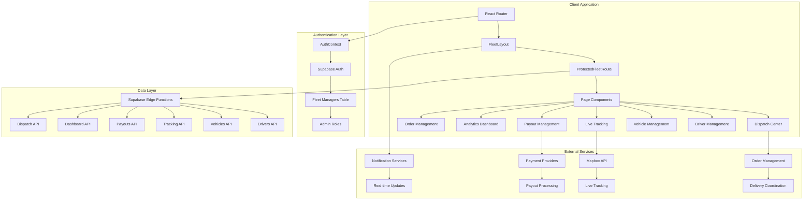
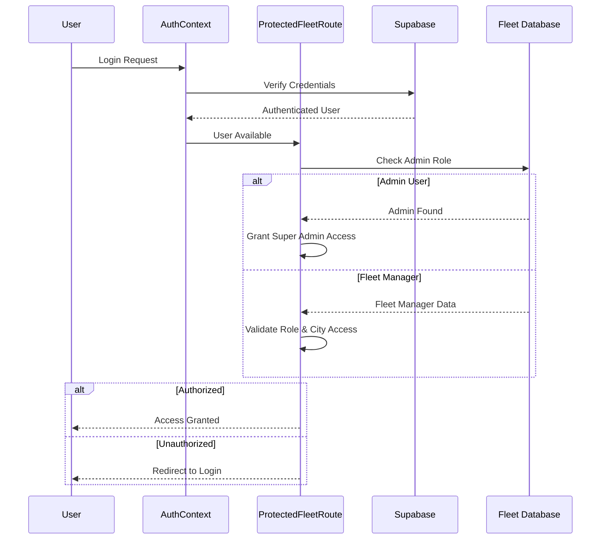
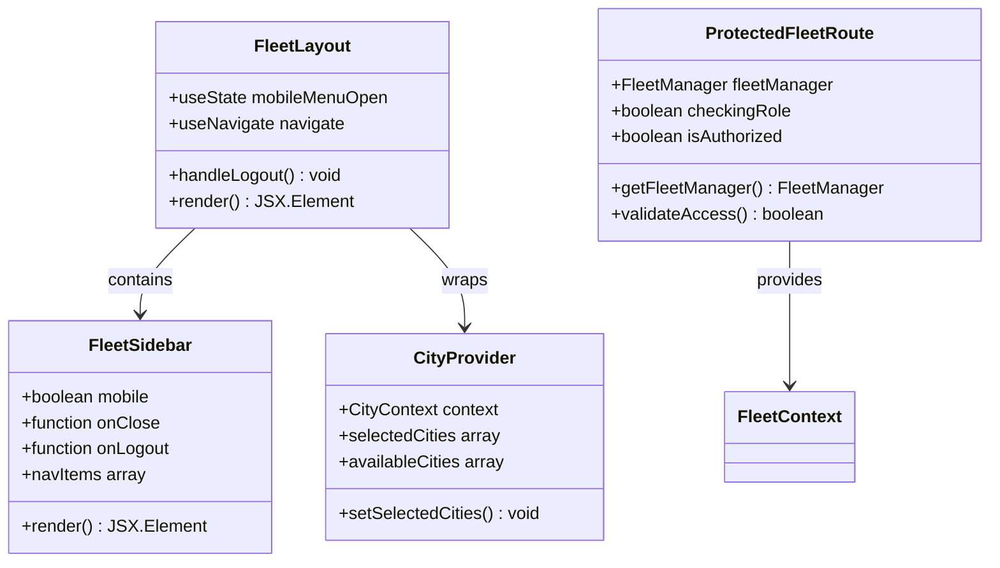
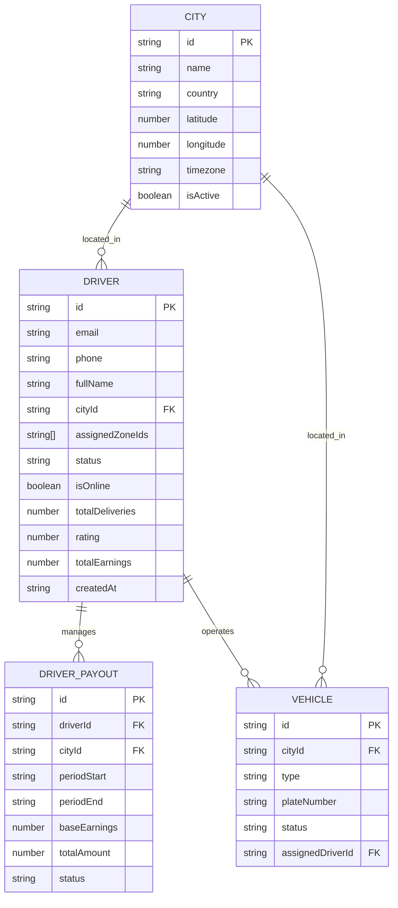
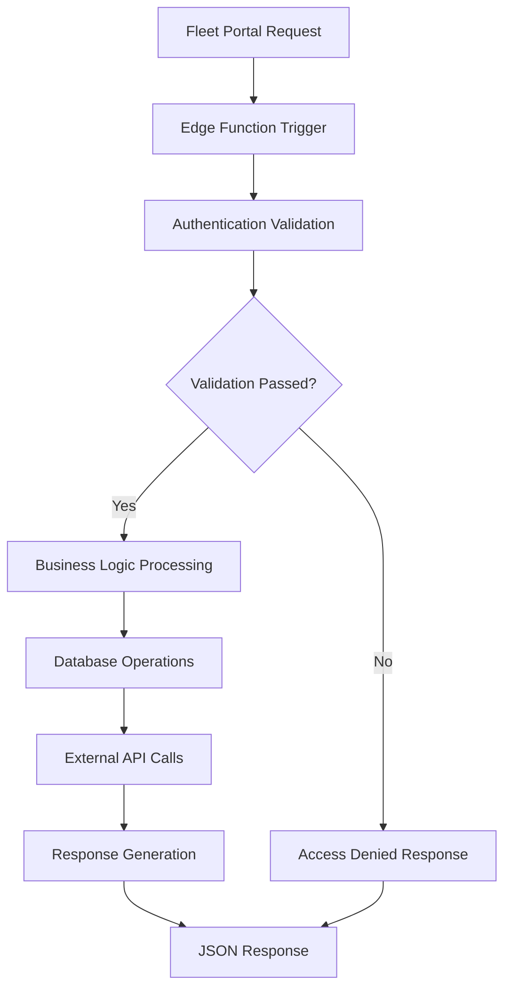
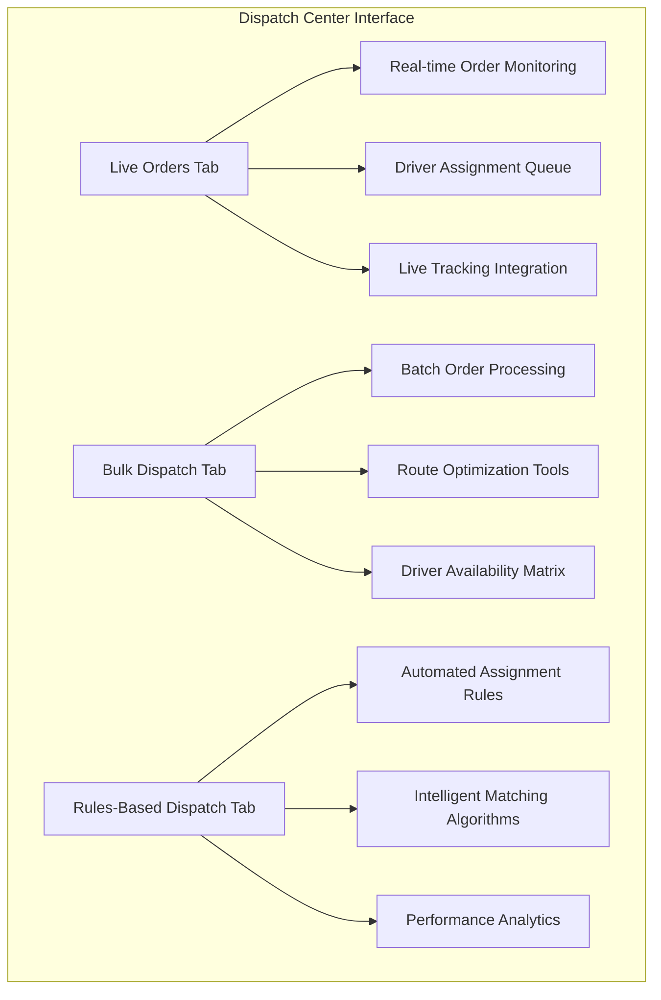
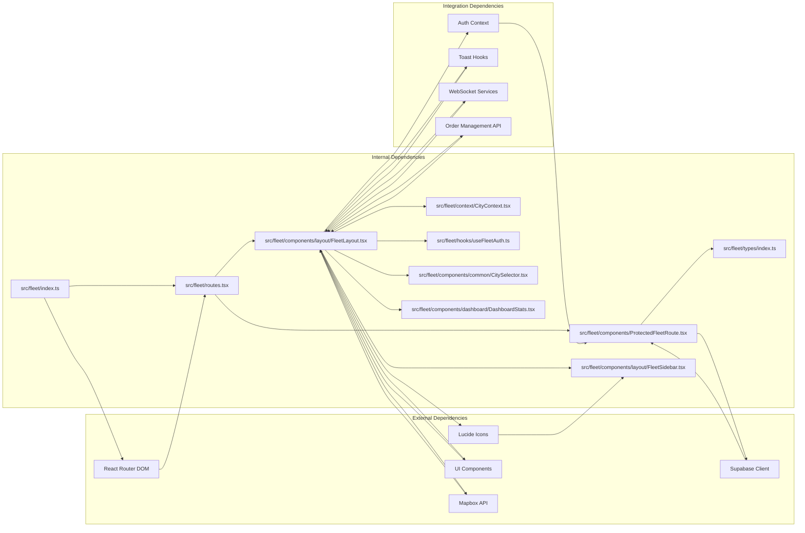

# Fleet Management Portal

<cite>
**Referenced Files in This Document**
- [src/fleet/index.ts](file://src/fleet/index.ts)
- [src/fleet/routes.tsx](file://src/fleet/routes.tsx)
- [src/fleet/components/layout/FleetLayout.tsx](file://src/fleet/components/layout/FleetLayout.tsx)
- [src/fleet/components/ProtectedFleetRoute.tsx](file://src/fleet/components/ProtectedFleetRoute.tsx)
- [src/fleet/context/CityContext.tsx](file://src/fleet/context/CityContext.tsx)
- [src/fleet/types/index.ts](file://src/fleet/types/index.ts)
- [src/fleet/hooks/useFleetAuth.ts](file://src/fleet/hooks/useFleetAuth.ts)
- [src/fleet/components/common/CitySelector.tsx](file://src/fleet/components/common/CitySelector.tsx)
- [src/fleet/components/dashboard/DashboardStats.tsx](file://src/fleet/components/dashboard/DashboardStats.tsx)
- [src/fleet/components/layout/FleetSidebar.tsx](file://src/fleet/components/layout/FleetSidebar.tsx)
- [src/integrations/supabase/client.ts](file://src/integrations/supabase/client.ts)
- [src/contexts/AuthContext.tsx](file://src/contexts/AuthContext.tsx)
- [src/hooks/use-toast.ts](file://src/hooks/use-toast.ts)
- [src/components/ui/button.tsx](file://src/components/ui/button.tsx)
- [src/components/maps/mapbox/index.ts](file://src/components/maps/mapbox/index.ts)
- [supabase/functions/fleet-auth/index.ts](file://supabase/functions/fleet-auth/index.ts)
- [supabase/functions/fleet-dashboard/index.ts](file://supabase/functions/fleet-dashboard/index.ts)
- [supabase/functions/fleet-drivers/index.ts](file://supabase/functions/fleet-drivers/index.ts)
- [supabase/functions/fleet-payouts/index.ts](file://supabase/functions/fleet-payouts/index.ts)
- [supabase/functions/fleet-tracking/index.ts](file://supabase/functions/fleet-tracking/index.ts)
- [supabase/functions/fleet-vehicles/index.ts](file://supabase/functions/fleet-vehicles/index.ts)
- [docs/fleet-management-portal-design.md](file://docs/fleet-management-portal-design.md)
- [scripts/setup-fleet-demo.sh](file://scripts/setup-fleet-demo.sh)
- [FLEET_DEMO_SETUP.md](file://FLEET_DEMO_SETUP.md)
</cite>

## Update Summary
**Changes Made**
- Updated architecture overview to reflect complete fleet management implementation
- Added comprehensive coverage of dispatch system with unified dispatch center
- Enhanced driver management capabilities with detailed components
- Expanded vehicle management system with maintenance tracking
- Integrated analytics dashboard with performance metrics
- Added branch orders management for corporate delivery operations
- Updated routing structure to include new dispatch and order management features
- Enhanced authentication system with fleet-specific context providers

## Table of Contents
1. [Introduction](#introduction)
2. [Project Structure](#project-structure)
3. [Core Components](#core-components)
4. [Architecture Overview](#architecture-overview)
5. [Detailed Component Analysis](#detailed-component-analysis)
6. [Dispatch System](#dispatch-system)
7. [Driver Management](#driver-management)
8. [Vehicle Management](#vehicle-management)
9. [Analytics and Reporting](#analytics-and-reporting)
10. [Order Management](#order-management)
11. [Dependency Analysis](#dependency-analysis)
12. [Performance Considerations](#performance-considerations)
13. [Troubleshooting Guide](#troubleshooting-guide)
14. [Conclusion](#conclusion)
15. [Appendices](#appendices)

## Introduction
The Fleet Management Portal is a comprehensive system designed to manage corporate fleet operations within the Nutrio platform. It provides centralized oversight for driver and vehicle management, real-time tracking, performance monitoring, and operational reporting. The portal integrates with the main platform to offer user provisioning, payment processing, and compliance reporting capabilities.

The system supports multi-city operations with role-based access control, enabling fleet managers and super administrators to oversee corporate meal programs while maintaining strict operational controls and compliance standards. The complete implementation now includes dispatch system capabilities, driver management, vehicle management, analytics, and order management features.

## Project Structure
The fleet management functionality is organized into several key modules within the src/fleet directory structure:

```mermaid
graph TB
subgraph "Fleet Portal Structure"
A[src/fleet/] --> B[index.ts]
A --> C[routes.tsx]
A --> D[components/]
A --> E[context/]
A --> F[types/]
A --> G[hooks/]
D --> H[layout/]
D --> I[dashboard/]
D --> J[dispatch/]
D --> K[drivers/]
D --> L[vehicles/]
D --> M[common/]
H --> N[FleetLayout.tsx]
H --> O[FleetSidebar.tsx]
H --> P[FleetHeader.tsx]
I --> Q[DashboardStats.tsx]
J --> R[DispatchMap.tsx]
K --> S[DriverCard.tsx]
L --> T[VehicleCard.tsx]
M --> U[CitySelector.tsx]
M --> V[StatusFilter.tsx]
M --> W[ZoneSelector.tsx]
E --> X[CityContext.tsx]
E --> Y[FleetAuthContext.tsx]
E --> Z[TrackingContext.tsx]
F --> AA[index.ts]
G --> AB[useFleetAuth.ts]
G --> AC[useUnassignedOrderCount.ts]
end
subgraph "Integration Layer"
BA[Integrations] --> BB[Supabase Client]
BA --> BC[Auth Context]
BA --> BD[Toast Hooks]
end
subgraph "UI Components"
BE[UI Library] --> BF[Button Component]
BE --> BG[Navigation Components]
BE --> BH[Card Components]
BE --> BI[Popover Components]
end
A --> BA
A --> BE
```

**Diagram sources**
- [src/fleet/index.ts:1-14](file://src/fleet/index.ts#L1-L14)
- [src/fleet/routes.tsx:1-54](file://src/fleet/routes.tsx#L1-L54)
- [src/fleet/components/layout/FleetLayout.tsx:1-63](file://src/fleet/components/layout/FleetLayout.tsx#L1-L63)

**Section sources**
- [src/fleet/index.ts:1-14](file://src/fleet/index.ts#L1-L14)
- [src/fleet/routes.tsx:1-54](file://src/fleet/routes.tsx#L1-L54)

## Core Components
The fleet management portal consists of several core components that work together to provide comprehensive fleet oversight and management capabilities.

### Authentication and Authorization System
The portal implements a robust authentication and authorization system using Supabase for user management and role-based access control. The ProtectedFleetRoute component serves as the primary gatekeeper, ensuring only authorized fleet managers can access the system.

### City Management and Geographic Scope
The CityContext provides centralized management of operational cities with predefined Qatar locations including Doha, Al Rayyan, Al Wakra, and Al Khor. This enables multi-city fleet operations with appropriate geographic boundaries.

### Data Types and Interfaces
The system defines comprehensive TypeScript interfaces for all fleet-related entities including drivers, vehicles, cities, and operational statistics. These types ensure type safety and provide clear contracts for data exchange.

**Section sources**
- [src/fleet/components/ProtectedFleetRoute.tsx:1-192](file://src/fleet/components/ProtectedFleetRoute.tsx#L1-L192)
- [src/fleet/context/CityContext.tsx:1-48](file://src/fleet/context/CityContext.tsx#L1-L48)
- [src/fleet/types/index.ts:1-188](file://src/fleet/types/index.ts#L1-L188)

## Architecture Overview
The fleet management portal follows a modern React-based architecture with Supabase integration for backend services. The system is designed with clear separation of concerns and modular components.

**Diagram sources**
- [src/fleet/routes.tsx:22-53](file://src/fleet/routes.tsx#L22-L53)
- [src/fleet/components/ProtectedFleetRoute.tsx:61-155](file://src/fleet/components/ProtectedFleetRoute.tsx#L61-L155)

The architecture implements several key design patterns:

- **Protected Routes Pattern**: Ensures secure access to fleet management features
- **Context Provider Pattern**: Manages global state for fleet operations
- **Edge Function Pattern**: Offloads complex business logic to serverless functions
- **Lazy Loading Pattern**: Optimizes initial page load performance
- **Unified Dispatch Pattern**: Centralized order management and dispatch coordination

## Detailed Component Analysis

### Fleet Authentication and Access Control
The authentication system provides granular access control with two primary roles: super_admin and fleet_manager. Super administrators have unrestricted access across all cities, while fleet managers are restricted to their assigned cities.

**Diagram sources**
- [src/fleet/components/ProtectedFleetRoute.tsx:76-128](file://src/fleet/components/ProtectedFleetRoute.tsx#L76-L128)
- [src/contexts/AuthContext.tsx](file://src/contexts/AuthContext.tsx)

Key features of the authentication system include:
- User session caching with 5-minute TTL
- Real-time role validation
- City-specific access restrictions
- Automatic logout on session expiration
- Admin override capability for platform administrators

**Section sources**
- [src/fleet/components/ProtectedFleetRoute.tsx:1-192](file://src/fleet/components/ProtectedFleetRoute.tsx#L1-L192)

### Fleet Dashboard and Navigation
The FleetLayout component provides the main navigation structure with responsive design support for desktop and mobile devices.

**Diagram sources**
- [src/fleet/components/layout/FleetLayout.tsx:16-60](file://src/fleet/components/layout/FleetLayout.tsx#L16-L60)
- [src/fleet/components/layout/FleetSidebar.tsx:42-131](file://src/fleet/components/layout/FleetSidebar.tsx#L42-L131)

The navigation system includes:
- Dashboard overview with real-time statistics
- Unified dispatch center for order management
- Driver management with detailed profiles
- Vehicle management with maintenance tracking
- Live tracking with real-time location updates
- Payout management with automated processing
- Analytics dashboard with performance metrics
- Settings and configuration options

**Section sources**
- [src/fleet/components/layout/FleetLayout.tsx:1-63](file://src/fleet/components/layout/FleetLayout.tsx#L1-L63)
- [src/fleet/components/layout/FleetSidebar.tsx:1-131](file://src/fleet/components/layout/FleetSidebar.tsx#L1-L131)

### Data Model and Type System
The fleet management system defines comprehensive TypeScript interfaces for all operational entities, ensuring type safety and clear data contracts.

**Diagram sources**
- [src/fleet/types/index.ts:4-188](file://src/fleet/types/index.ts#L4-L188)

The type system covers:
- Driver lifecycle management with status tracking
- Vehicle fleet tracking with maintenance schedules
- Financial transaction processing with payout calculations
- Performance analytics with KPI metrics
- Compliance documentation with verification status
- Activity logging with audit trails
- Driver performance metrics with ratings and completion rates

**Section sources**
- [src/fleet/types/index.ts:1-188](file://src/fleet/types/index.ts#L1-L188)

### Edge Functions and Backend Services
The fleet management system leverages Supabase Edge Functions for server-side processing, providing scalable backend services without traditional server infrastructure.

**Diagram sources**
- [supabase/functions/fleet-auth/index.ts](file://supabase/functions/fleet-auth/index.ts)
- [supabase/functions/fleet-dashboard/index.ts](file://supabase/functions/fleet-dashboard/index.ts)

Key edge functions include:
- **Fleet Authentication**: User credential validation and role verification
- **Driver Management**: CRUD operations for driver records and status updates
- **Vehicle Tracking**: Real-time vehicle location and status monitoring
- **Payout Processing**: Automated driver compensation calculations
- **Dashboard Analytics**: Operational metrics and performance reporting
- **Dispatch Coordination**: Order assignment and driver dispatch management
- **Order Management**: Corporate delivery tracking and fulfillment

**Section sources**
- [supabase/functions/fleet-auth/index.ts](file://supabase/functions/fleet-auth/index.ts)
- [supabase/functions/fleet-dashboard/index.ts](file://supabase/functions/fleet-dashboard/index.ts)
- [supabase/functions/fleet-drivers/index.ts](file://supabase/functions/fleet-drivers/index.ts)
- [supabase/functions/fleet-payouts/index.ts](file://supabase/functions/fleet-payouts/index.ts)
- [supabase/functions/fleet-tracking/index.ts](file://supabase/functions/fleet-tracking/index.ts)
- [supabase/functions/fleet-vehicles/index.ts](file://supabase/functions/fleet-vehicles/index.ts)

## Dispatch System
The dispatch system represents the core operational hub of the fleet management portal, providing unified order management and driver coordination capabilities.

### Unified Dispatch Center
The dispatch center consolidates all dispatch operations into a single, intuitive interface with three main tabs:

**Diagram sources**
- [src/fleet/routes.tsx:33-40](file://src/fleet/routes.tsx#L33-L40)

**Section sources**
- [src/fleet/routes.tsx:1-54](file://src/fleet/routes.tsx#L1-L54)

### Live Orders Management
The live orders tab provides real-time monitoring of active deliveries with integrated driver tracking and ETA calculations.

### Bulk Dispatch Operations
The bulk dispatch tab enables batch processing of orders with route optimization and driver assignment capabilities.

### Automated Dispatch Rules
The rules-based dispatch tab allows fleet managers to configure automated assignment algorithms based on driver availability, proximity, and performance metrics.

**Section sources**
- [src/fleet/routes.tsx:33-40](file://src/fleet/routes.tsx#L33-L40)

## Driver Management
The driver management system provides comprehensive tools for recruiting, training, and supervising fleet drivers.

### Driver Registration and Onboarding
The system supports complete driver onboarding with document upload, verification workflows, and background checks.

### Driver Performance Tracking
Real-time performance metrics including delivery completion rates, ratings, and location tracking provide insights into driver productivity.

### Driver Communication
Integrated messaging and notification systems enable fleet managers to communicate with drivers and coordinate deliveries.

**Section sources**
- [src/fleet/components/layout/FleetSidebar.tsx:33-34](file://src/fleet/components/layout/FleetSidebar.tsx#L33-L34)

## Vehicle Management
The vehicle management system tracks the entire fleet inventory with maintenance scheduling and compliance monitoring.

### Vehicle Tracking and Maintenance
GPS tracking integration provides real-time location data while maintenance scheduling ensures vehicles remain roadworthy and compliant.

### Vehicle Compliance
Document management for registrations, insurance, and inspections with automated expiration alerts and renewal reminders.

### Vehicle Utilization Analytics
Usage patterns and maintenance history provide insights for fleet optimization and cost management.

**Section sources**
- [src/fleet/components/layout/FleetSidebar.tsx:35-36](file://src/fleet/components/layout/FleetSidebar.tsx#L35-L36)

## Analytics and Reporting
The analytics dashboard provides comprehensive performance metrics and operational insights.

### Real-Time Dashboard
Key performance indicators including driver availability, order throughput, and delivery efficiency with customizable timeframes.

### Performance Metrics
Detailed analytics on driver performance, vehicle utilization, and operational costs with trend analysis and benchmarking.

### Custom Reports
Exportable reports for management review with filtering capabilities by time period, location, and driver performance.

**Section sources**
- [src/fleet/components/layout/FleetSidebar.tsx:37-38](file://src/fleet/components/layout/FleetSidebar.tsx#L37-L38)

## Order Management
The order management system coordinates corporate deliveries with real-time tracking and fulfillment monitoring.

### Corporate Delivery Coordination
Integration with the main Nutrio platform enables seamless order processing from corporate accounts to driver delivery.

### Order Tracking and Status Updates
Real-time order status updates with driver location tracking and estimated arrival times for corporate clients.

### Delivery Analytics
Performance metrics on delivery times, success rates, and customer satisfaction with optimization recommendations.

**Section sources**
- [src/fleet/routes.tsx:19-20](file://src/fleet/routes.tsx#L19-L20)

## Dependency Analysis
The fleet management portal has well-defined dependencies that support modularity and maintainability.

**Diagram sources**
- [src/fleet/index.ts:1-14](file://src/fleet/index.ts#L1-L14)
- [src/fleet/routes.tsx:1-54](file://src/fleet/routes.tsx#L1-L54)
- [src/fleet/components/layout/FleetLayout.tsx:1-63](file://src/fleet/components/layout/FleetLayout.tsx#L1-L63)

The dependency structure ensures:
- Loose coupling between components
- Clear separation of concerns
- Easy testing and mocking capabilities
- Scalable architecture for future enhancements
- Real-time data synchronization capabilities

**Section sources**
- [src/fleet/index.ts:1-14](file://src/fleet/index.ts#L1-L14)
- [src/fleet/routes.tsx:1-54](file://src/fleet/routes.tsx#L1-L54)

## Performance Considerations
The fleet management portal implements several performance optimization strategies:

### Caching Strategy
- Fleet manager data cached for 5 minutes to reduce database queries
- Session-based authentication validation
- Component-level memoization for expensive computations
- Real-time data caching with automatic refresh intervals

### Lazy Loading Implementation
- All fleet pages use React.lazy for code splitting
- Dynamic imports reduce initial bundle size
- Parallel loading of route components
- Optimized asset loading for maps and tracking data

### Real-time Updates
- WebSocket connections for live tracking data
- Polling optimization for non-critical updates
- Debounced search and filter operations
- Background synchronization for offline data consistency

### Database Optimization
- Indexed queries on frequently accessed fields
- Batch operations for bulk data updates
- Efficient pagination for large datasets
- Connection pooling for database operations

## Troubleshooting Guide

### Authentication Issues
Common authentication problems and solutions:

**Problem**: Users cannot access fleet portal
- **Cause**: Missing fleet manager record in database
- **Solution**: Verify user exists in fleet_managers table with proper role assignment

**Problem**: Session timeout during operations
- **Cause**: Supabase session expiration
- **Solution**: Implement automatic re-authentication and session refresh

**Problem**: City access restrictions not working
- **Cause**: Incorrect assigned_city_ids configuration
- **Solution**: Verify fleet manager has proper city assignments

### Performance Issues
**Problem**: Slow page loads
- **Cause**: Unoptimized database queries
- **Solution**: Implement proper indexing and query optimization

**Problem**: Memory leaks in long sessions
- **Cause**: Uncleared event listeners or timers
- **Solution**: Implement proper cleanup in useEffect hooks

**Problem**: Real-time tracking delays
- **Cause**: Network connectivity issues or API rate limiting
- **Solution**: Implement retry mechanisms and connection health monitoring

### Integration Problems
**Problem**: Live tracking not updating
- **Cause**: Mapbox API connectivity issues
- **Solution**: Verify API keys and network connectivity

**Problem**: Payout processing failures
- **Cause**: Payment provider integration errors
- **Solution**: Check webhook configurations and retry mechanisms

**Problem**: Dispatch system not responding
- **Cause**: WebSocket connection issues or backend service downtime
- **Solution**: Implement connection recovery and fallback mechanisms

**Section sources**
- [src/fleet/components/ProtectedFleetRoute.tsx:26-59](file://src/fleet/components/ProtectedFleetRoute.tsx#L26-L59)
- [src/fleet/context/CityContext.tsx:23-25](file://src/fleet/context/CityContext.tsx#L23-L25)

## Conclusion
The Fleet Management Portal represents a comprehensive solution for corporate fleet operations within the Nutrio ecosystem. The system provides robust authentication, real-time tracking, performance monitoring, and operational reporting capabilities.

Key strengths of the implementation include:
- Secure role-based access control with city-level restrictions
- Comprehensive data modeling supporting all fleet operations
- Scalable edge function architecture for backend processing
- Responsive design supporting multiple device types
- Integrated dispatch system with real-time coordination
- Advanced analytics and reporting capabilities
- Seamless integration with corporate order management
- Real-time tracking and communication systems

The portal successfully addresses the core requirements for fleet oversight and management while maintaining integration with the broader Nutrio platform. The complete implementation now includes dispatch system capabilities, driver management, vehicle management, analytics, and order management features that provide comprehensive fleet operations support.

Future enhancements could include advanced analytics with predictive modeling, automated compliance checking, expanded integration capabilities with third-party logistics providers, and mobile driver applications for real-time communication and dispatch coordination.

## Appendices

### Practical Examples

#### Corporate Account Management Scenario
1. **Initial Setup**: Create fleet manager accounts with appropriate city assignments
2. **Driver Enrollment**: Register new drivers with document uploads and verification
3. **Vehicle Assignment**: Assign vehicles to drivers based on operational needs
4. **Daily Operations**: Monitor driver availability and vehicle status through the dispatch center
5. **Performance Review**: Analyze delivery metrics and driver performance through analytics dashboard
6. **Order Fulfillment**: Coordinate corporate orders through the unified dispatch system

#### Fleet Operations Example
1. **Route Planning**: Use dispatch system to optimize delivery routes and assign drivers
2. **Real-time Monitoring**: Track driver locations and ETA calculations through live tracking
3. **Incident Reporting**: Document vehicle maintenance and driver violations through the system
4. **Financial Processing**: Generate payout reports and process driver payments automatically
5. **Compliance Tracking**: Maintain documentation for regulatory requirements and insurance expiration
6. **Performance Optimization**: Use analytics to identify bottlenecks and improve operational efficiency

### Integration Specifications
The fleet portal integrates with several external systems:
- **Supabase**: Authentication, database, and edge functions
- **Mapbox**: Real-time vehicle and driver tracking
- **Payment Providers**: Automated driver payout processing
- **Notification Services**: Real-time alerts and updates
- **Order Management System**: Corporate delivery coordination
- **Driver Communication Platform**: Messaging and coordination tools

**Section sources**
- [scripts/setup-fleet-demo.sh:1-50](file://scripts/setup-fleet-demo.sh#L1-L50)
- [FLEET_DEMO_SETUP.md](file://FLEET_DEMO_SETUP.md)