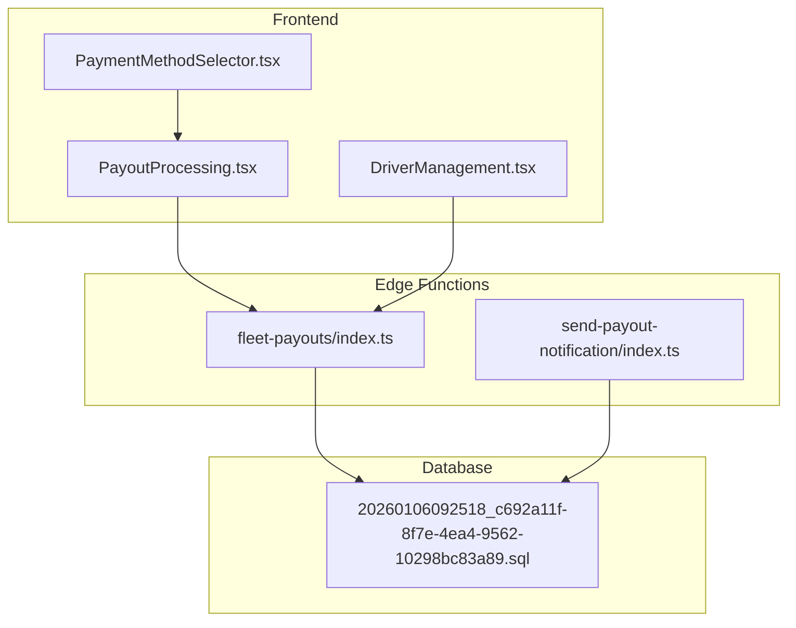
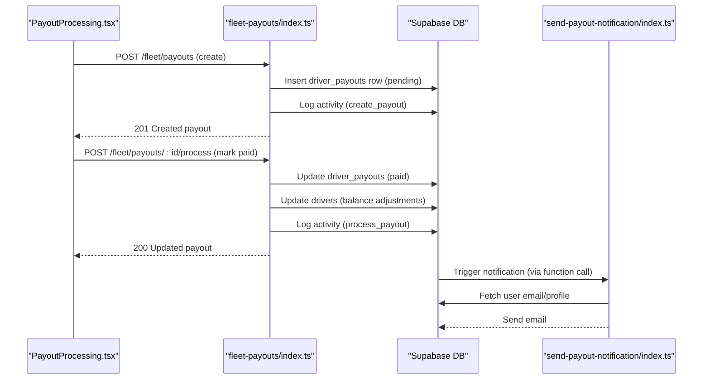
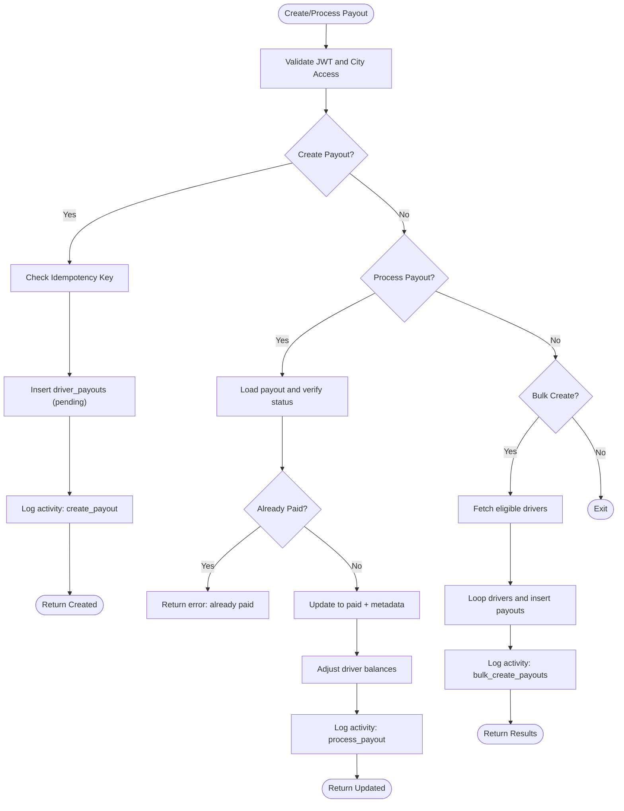
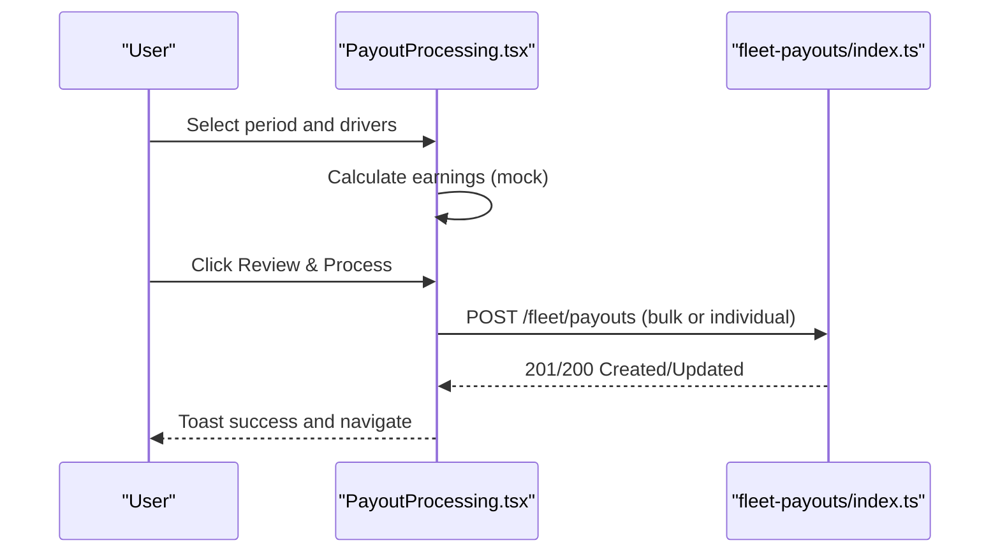
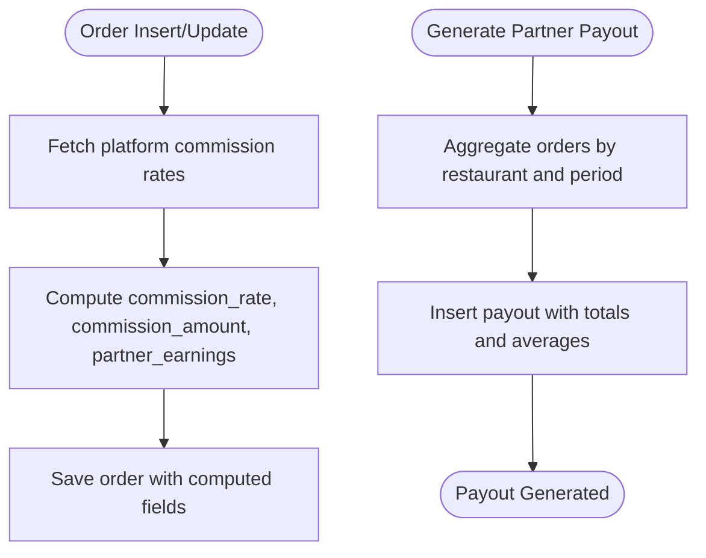
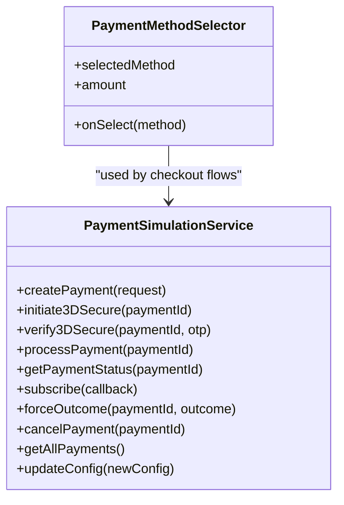
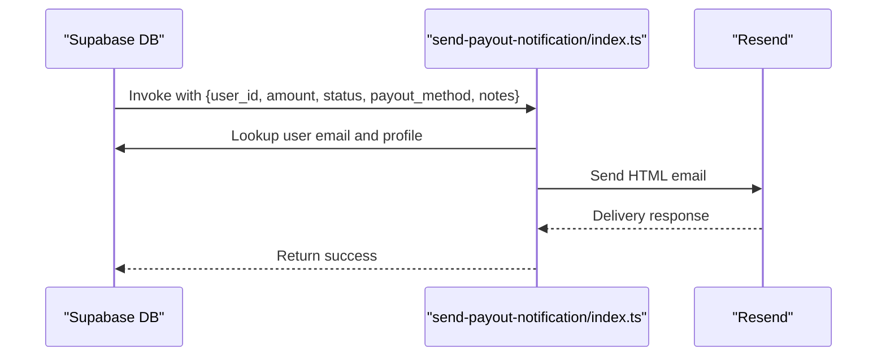
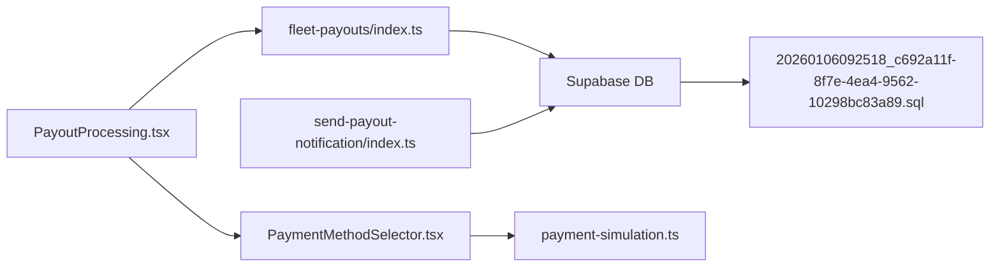

# Payouts & Payments

<cite>
**Referenced Files in This Document**
- [index.ts](file://supabase/functions/fleet-payouts/index.ts)
- [index.ts](file://supabase/functions/send-payout-notification/index.ts)
- [PayoutProcessing.tsx](file://src/fleet/pages/PayoutProcessing.tsx)
- [20260106092518_c692a11f-8f7e-4ea4-9562-10298bc83a89.sql](file://supabase/migrations/20260106092518_c692a11f-8f7e-4ea4-9562-10298bc83a89.sql)
- [PaymentMethodSelector.tsx](file://src/components/payment/PaymentMethodSelector.tsx)
- [payment-simulation.ts](file://src/lib/payment-simulation.ts)
- [DriverManagement.tsx](file://src/fleet/pages/DriverManagement.tsx)
- [payouts-workflow.spec.ts](file://e2e/cross-portal/payouts-workflow.spec.ts)
- [payouts.spec.ts](file://e2e/admin/payouts.spec.ts)
- [payouts.spec.ts](file://e2e/driver/payouts.spec.ts)
- [payments.spec.ts](file://e2e/system/payments.spec.ts)
</cite>

## Table of Contents
1. [Introduction](#introduction)
2. [Project Structure](#project-structure)
3. [Core Components](#core-components)
4. [Architecture Overview](#architecture-overview)
5. [Detailed Component Analysis](#detailed-component-analysis)
6. [Dependency Analysis](#dependency-analysis)
7. [Performance Considerations](#performance-considerations)
8. [Troubleshooting Guide](#troubleshooting-guide)
9. [Conclusion](#conclusion)
10. [Appendices](#appendices)

## Introduction
This document describes the fleet payout and payment management system. It covers driver commission calculation algorithms, payout scheduling and processing workflows, approval and notification flows, multi-currency considerations, payout history tracking, dispute/reconciliation features, payment method configurations, automated payout systems, and compliance/reporting readiness. It also outlines integration touchpoints with Supabase edge functions, frontend dashboards, and end-to-end tests.

## Project Structure
The fleet payouts system spans:
- Supabase edge functions for fleet payout orchestration and notifications
- Supabase database migrations defining commission calculations and payout records
- Frontend fleet dashboards for payout processing and driver management
- Payment method selection and simulation utilities
- End-to-end tests validating payouts and payment flows

**Diagram sources**
- [index.ts:560-610](file://supabase/functions/fleet-payouts/index.ts#L560-L610)
- [index.ts:20-176](file://supabase/functions/send-payout-notification/index.ts#L20-L176)
- [PayoutProcessing.tsx:1-309](file://src/fleet/pages/PayoutProcessing.tsx#L1-L309)
- [DriverManagement.tsx:1-204](file://src/fleet/pages/DriverManagement.tsx#L1-L204)
- [PaymentMethodSelector.tsx:1-107](file://src/components/payment/PaymentMethodSelector.tsx#L1-L107)
- [20260106092518_c692a11f-8f7e-4ea4-9562-10298bc83a89.sql:1-113](file://supabase/migrations/20260106092518_c692a11f-8f7e-4ea4-9562-10298bc83a89.sql#L1-L113)

**Section sources**
- [index.ts:560-610](file://supabase/functions/fleet-payouts/index.ts#L560-L610)
- [PayoutProcessing.tsx:1-309](file://src/fleet/pages/PayoutProcessing.tsx#L1-L309)
- [DriverManagement.tsx:1-204](file://src/fleet/pages/DriverManagement.tsx#L1-L204)
- [PaymentMethodSelector.tsx:1-107](file://src/components/payment/PaymentMethodSelector.tsx#L1-L107)
- [20260106092518_c692a11f-8f7e-4ea4-9562-10298bc83a89.sql:1-113](file://supabase/migrations/20260106092518_c692a11f-8f7e-4ea4-9562-10298bc83a89.sql#L1-L113)

## Core Components
- Fleet payout edge function: Provides list, create, process, and bulk-create endpoints for driver payouts with city-scoped access control, idempotency, and activity logging.
- Payout processing dashboard: Allows selecting drivers, defining periods, calculating earnings, and confirming batch payouts.
- Commission calculation and partner payout generation: Database triggers and stored procedures compute order commissions and generate partner payouts.
- Payment method selector and simulation: Supports multiple payment methods and simulates payment flows for development/testing.
- Notification function: Sends payout status emails to users.

**Section sources**
- [index.ts:56-184](file://supabase/functions/fleet-payouts/index.ts#L56-L184)
- [index.ts:186-315](file://supabase/functions/fleet-payouts/index.ts#L186-L315)
- [index.ts:317-428](file://supabase/functions/fleet-payouts/index.ts#L317-L428)
- [index.ts:430-558](file://supabase/functions/fleet-payouts/index.ts#L430-L558)
- [PayoutProcessing.tsx:189-309](file://src/fleet/pages/PayoutProcessing.tsx#L189-L309)
- [20260106092518_c692a11f-8f7e-4ea4-9562-10298bc83a89.sql:14-42](file://supabase/migrations/20260106092518_c692a11f-8f7e-4ea4-9562-10298bc83a89.sql#L14-L42)
- [20260106092518_c692a11f-8f7e-4ea4-9562-10298bc83a89.sql:44-110](file://supabase/migrations/20260106092518_c692a11f-8f7e-4ea4-9562-10298bc83a89.sql#L44-L110)
- [PaymentMethodSelector.tsx:12-49](file://src/components/payment/PaymentMethodSelector.tsx#L12-L49)
- [payment-simulation.ts:25-223](file://src/lib/payment-simulation.ts#L25-L223)
- [index.ts:20-176](file://supabase/functions/send-payout-notification/index.ts#L20-L176)

## Architecture Overview
The system integrates frontend dashboards with Supabase edge functions and database triggers. Driver payouts are calculated and recorded, with optional bulk processing and payment marking. Notifications are sent upon payout creation or status changes.

**Diagram sources**
- [index.ts:186-315](file://supabase/functions/fleet-payouts/index.ts#L186-L315)
- [index.ts:317-428](file://supabase/functions/fleet-payouts/index.ts#L317-L428)
- [index.ts:20-176](file://supabase/functions/send-payout-notification/index.ts#L20-L176)

## Detailed Component Analysis

### Driver Payout Edge Function
- Authentication and authorization: Validates JWT with type fleet_access and enforces city-scoped access.
- Listing payouts: Supports filtering by city, driver, status, and date range with pagination and summary aggregation.
- Creating payouts: Requires driverId, period dates, and totalAmount; supports idempotency via idempotency_key; logs activity.
- Processing payouts: Marks a payout as paid, updates driver balances, and logs activity.
- Bulk payouts: Creates payouts for eligible drivers in a city with idempotency checks.

**Diagram sources**
- [index.ts:186-315](file://supabase/functions/fleet-payouts/index.ts#L186-L315)
- [index.ts:317-428](file://supabase/functions/fleet-payouts/index.ts#L317-L428)
- [index.ts:430-558](file://supabase/functions/fleet-payouts/index.ts#L430-L558)

**Section sources**
- [index.ts:19-54](file://supabase/functions/fleet-payouts/index.ts#L19-L54)
- [index.ts:56-184](file://supabase/functions/fleet-payouts/index.ts#L56-L184)
- [index.ts:186-315](file://supabase/functions/fleet-payouts/index.ts#L186-L315)
- [index.ts:317-428](file://supabase/functions/fleet-payouts/index.ts#L317-L428)
- [index.ts:430-558](file://supabase/functions/fleet-payouts/index.ts#L430-L558)

### Payout Processing Dashboard
- Period selection: Start and end dates define the calculation window.
- Driver selection: Select multiple drivers; mock earnings calculation considers base earnings and bonuses based on ratings.
- Confirmation flow: Summarizes selected drivers, total amount, and requires confirmation before processing.
- Navigation: Routes to payouts list after successful processing.

**Diagram sources**
- [PayoutProcessing.tsx:25-95](file://src/fleet/pages/PayoutProcessing.tsx#L25-L95)
- [PayoutProcessing.tsx:189-309](file://src/fleet/pages/PayoutProcessing.tsx#L189-L309)
- [index.ts:430-558](file://supabase/functions/fleet-payouts/index.ts#L430-L558)

**Section sources**
- [PayoutProcessing.tsx:189-309](file://src/fleet/pages/PayoutProcessing.tsx#L189-L309)

### Commission Calculation and Partner Payout Generation
- Orders table: Adds commission_rate, commission_amount, and partner_earnings columns.
- Trigger: On insert/update of total_price, computes commission and net earnings using platform commission rates.
- Stored procedure: Generates partner payouts for a restaurant within a period, aggregating totals and inserting a payout record.

**Diagram sources**
- [20260106092518_c692a11f-8f7e-4ea4-9562-10298bc83a89.sql:14-42](file://supabase/migrations/20260106092518_c692a11f-8f7e-4ea4-9562-10298bc83a89.sql#L14-L42)
- [20260106092518_c692a11f-8f7e-4ea4-9562-10298bc83a89.sql:44-110](file://supabase/migrations/20260106092518_c692a11f-8f7e-4ea4-9562-10298bc83a89.sql#L44-L110)

**Section sources**
- [20260106092518_c692a11f-8f7e-4ea4-9562-10298bc83a89.sql:1-113](file://supabase/migrations/20260106092518_c692a11f-8f7e-4ea4-9562-10298bc83a89.sql#L1-L113)

### Payment Methods and Simulation
- PaymentMethodSelector: Presents selectable methods including credit/debit cards, Sadad, Apple Pay, Google Pay, and displays popularity.
- PaymentSimulationService: Simulates payment lifecycle including 3D Secure challenges and outcomes, configurable success rates and delays.

**Diagram sources**
- [PaymentMethodSelector.tsx:1-107](file://src/components/payment/PaymentMethodSelector.tsx#L1-L107)
- [payment-simulation.ts:25-223](file://src/lib/payment-simulation.ts#L25-L223)

**Section sources**
- [PaymentMethodSelector.tsx:12-49](file://src/components/payment/PaymentMethodSelector.tsx#L12-L49)
- [payment-simulation.ts:25-223](file://src/lib/payment-simulation.ts#L25-L223)

### Notification Workflow
- send-payout-notification function: Receives user_id, amount, status, payout_method, and notes; fetches user email and profile; sends HTML email with status and method details.

**Diagram sources**
- [index.ts:20-176](file://supabase/functions/send-payout-notification/index.ts#L20-L176)

**Section sources**
- [index.ts:20-176](file://supabase/functions/send-payout-notification/index.ts#L20-L176)

## Dependency Analysis
- Frontend dashboards depend on fleet edge functions for payout operations.
- Edge functions rely on Supabase client libraries and environment secrets.
- Database migrations define triggers and stored procedures for commission and partner payouts.
- Payment simulation is decoupled from production payment providers for testing.

**Diagram sources**
- [index.ts:560-610](file://supabase/functions/fleet-payouts/index.ts#L560-L610)
- [PayoutProcessing.tsx:1-309](file://src/fleet/pages/PayoutProcessing.tsx#L1-L309)
- [PaymentMethodSelector.tsx:1-107](file://src/components/payment/PaymentMethodSelector.tsx#L1-L107)
- [payment-simulation.ts:25-223](file://src/lib/payment-simulation.ts#L25-L223)
- [20260106092518_c692a11f-8f7e-4ea4-9562-10298bc83a89.sql:1-113](file://supabase/migrations/20260106092518_c692a11f-8f7e-4ea4-9562-10298bc83a89.sql#L1-L113)
- [index.ts:20-176](file://supabase/functions/send-payout-notification/index.ts#L20-L176)

**Section sources**
- [index.ts:560-610](file://supabase/functions/fleet-payouts/index.ts#L560-L610)
- [PayoutProcessing.tsx:1-309](file://src/fleet/pages/PayoutProcessing.tsx#L1-L309)
- [PaymentMethodSelector.tsx:1-107](file://src/components/payment/PaymentMethodSelector.tsx#L1-L107)
- [payment-simulation.ts:25-223](file://src/lib/payment-simulation.ts#L25-L223)
- [20260106092518_c692a11f-8f7e-4ea4-9562-10298bc83a89.sql:1-113](file://supabase/migrations/20260106092518_c692a11f-8f7e-4ea4-9562-10298bc83a89.sql#L1-L113)
- [index.ts:20-176](file://supabase/functions/send-payout-notification/index.ts#L20-L176)

## Performance Considerations
- Edge function rate limiting: Current implementation notes a planned Redis-based rate limiter for production.
- Pagination and filtering: Payout listing supports pagination and efficient filtering to reduce payload sizes.
- Idempotency: Idempotency keys prevent duplicate payouts and retries from causing inconsistencies.
- Simulation overhead: Payment simulation introduces artificial delays and memory storage; disable in production.

[No sources needed since this section provides general guidance]

## Troubleshooting Guide
- Unauthorized city access: Ensure the manager’s assigned cities match the requested cityId.
- Duplicate payout detection: If an idempotency key exists with pending/processing/paid status, the system returns a conflict response.
- Payout already paid: Attempting to process an already-paid payout returns an error.
- Driver not found: Creating a payout requires a valid driverId.
- Notification failures: Verify Resend API key and user email availability.

**Section sources**
- [index.ts:39-54](file://supabase/functions/fleet-payouts/index.ts#L39-L54)
- [index.ts:231-247](file://supabase/functions/fleet-payouts/index.ts#L231-L247)
- [index.ts:345-351](file://supabase/functions/fleet-payouts/index.ts#L345-L351)
- [index.ts:217-222](file://supabase/functions/fleet-payouts/index.ts#L217-L222)
- [index.ts:36-45](file://supabase/functions/send-payout-notification/index.ts#L36-L45)

## Conclusion
The fleet payout and payment system combines frontend dashboards, Supabase edge functions, and database triggers to automate driver payouts, enforce access controls, and maintain audit trails. Commission calculations for partners are handled via triggers and stored procedures. Payment simulation and multi-method selectors support flexible testing and checkout experiences. Notifications integrate with external email providers. Extending the system to support multi-currency, advanced reconciliation, and compliance reporting would involve adding currency conversion logic, standardized reporting endpoints, and audit trail enhancements.

[No sources needed since this section summarizes without analyzing specific files]

## Appendices

### End-to-End Test Coverage
- Cross-portal payouts workflow tests validate end-to-end payout scenarios.
- Admin payouts tests cover administrative payout actions.
- Driver payouts tests focus on driver-side payout flows.
- System payments tests validate payment processing behaviors.

**Section sources**
- [payouts-workflow.spec.ts](file://e2e/cross-portal/payouts-workflow.spec.ts)
- [payouts.spec.ts](file://e2e/admin/payouts.spec.ts)
- [payouts.spec.ts](file://e2e/driver/payouts.spec.ts)
- [payments.spec.ts](file://e2e/system/payments.spec.ts)