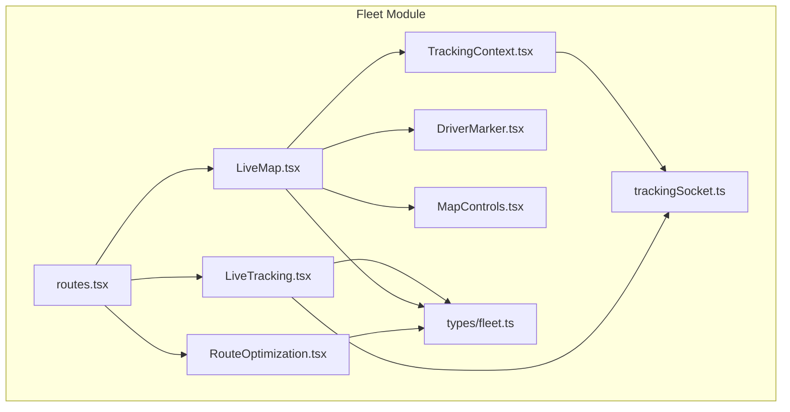
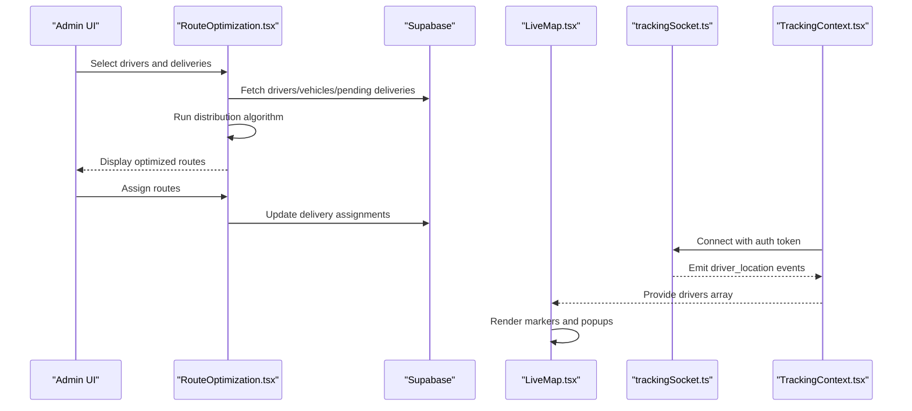
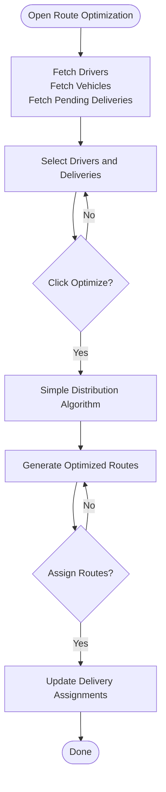
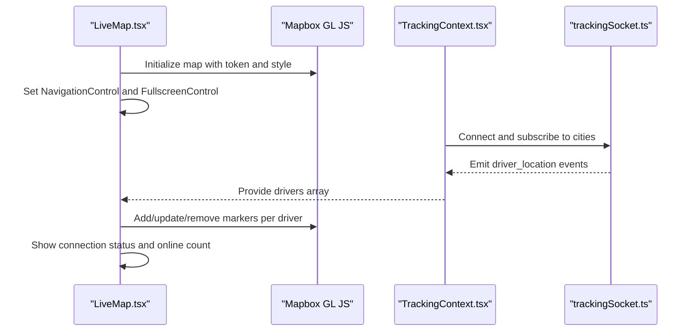
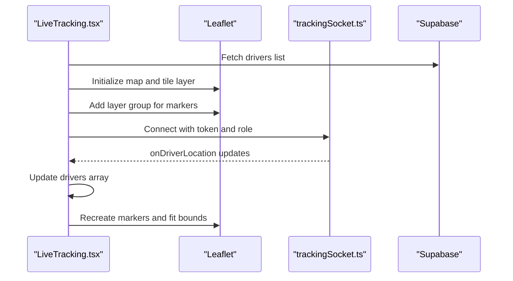
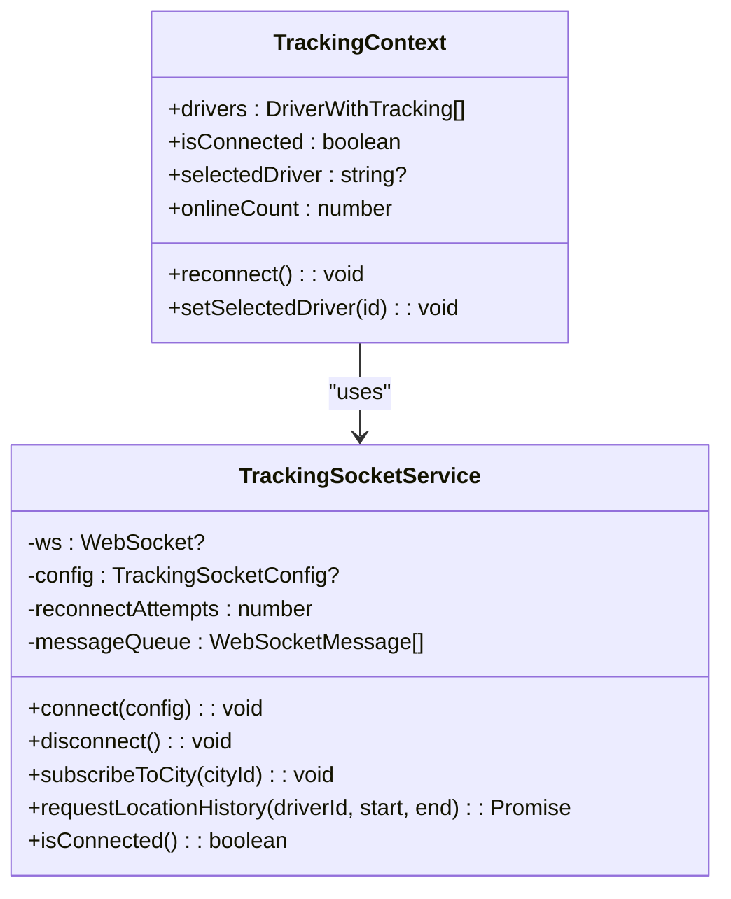
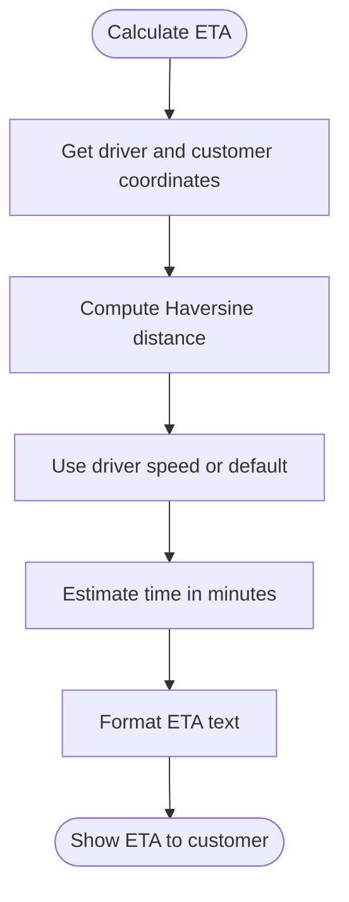
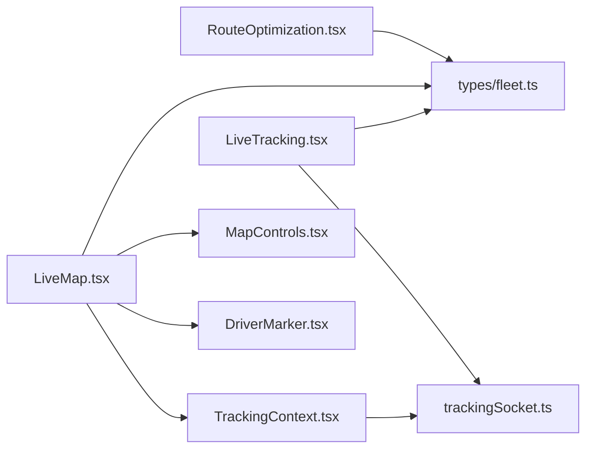

# Route Optimization

<cite>
**Referenced Files in This Document**
- [routes.tsx](file://src/fleet/routes.tsx)
- [RouteOptimization.tsx](file://src/fleet/pages/RouteOptimization.tsx)
- [LiveMap.tsx](file://src/fleet/components/map/LiveMap.tsx)
- [LiveTracking.tsx](file://src/fleet/pages/LiveTracking.tsx)
- [TrackingContext.tsx](file://src/fleet/context/TrackingContext.tsx)
- [trackingSocket.ts](file://src/fleet/services/trackingSocket.ts)
- [DriverMarker.tsx](file://src/fleet/components/map/DriverMarker.tsx)
- [MapControls.tsx](file://src/fleet/components/map/MapControls.tsx)
- [fleet.ts](file://src/fleet/types/fleet.ts)
- [CustomerDeliveryTracker.tsx](file://src/components/customer/CustomerDeliveryTracker.tsx)
- [delivery_system_design.md](file://delivery_system_design.md)
- [delivery_integration_plan.md](file://delivery_integration_plan.md)
- [delivery_system_visual.md](file://delivery_system_visual.md)
</cite>

## Table of Contents
1. [Introduction](#introduction)
2. [Project Structure](#project-structure)
3. [Core Components](#core-components)
4. [Architecture Overview](#architecture-overview)
5. [Detailed Component Analysis](#detailed-component-analysis)
6. [Dependency Analysis](#dependency-analysis)
7. [Performance Considerations](#performance-considerations)
8. [Troubleshooting Guide](#troubleshooting-guide)
9. [Conclusion](#conclusion)

## Introduction
This document describes the fleet route optimization and mapping system. It covers route planning algorithms, delivery sequence optimization, real-time traffic integration, the live map interface, driver tracking, delivery progress monitoring, route adjustment features, alternative path calculation, dynamic reoptimization, map controls, driver communication tools, delivery confirmation systems, integration with navigation apps, ETA calculations, and performance analytics for route efficiency.

## Project Structure
The fleet module organizes route optimization and live tracking under dedicated pages and components:
- Route planning and optimization: RouteOptimization page with driver/vehicle selection and simple distribution algorithm
- Live tracking: LiveMap and LiveTracking pages with real-time driver location updates
- Context and services: TrackingContext provider and trackingSocket service for WebSocket connections
- Map components: DriverMarker and MapControls for interactive overlays
- Types: Strongly typed fleet entities and WebSocket events

**Diagram sources**
- [routes.tsx:1-42](file://src/fleet/routes.tsx#L1-L42)
- [RouteOptimization.tsx:1-412](file://src/fleet/pages/RouteOptimization.tsx#L1-L412)
- [LiveMap.tsx:1-271](file://src/fleet/components/map/LiveMap.tsx#L1-L271)
- [LiveTracking.tsx:1-429](file://src/fleet/pages/LiveTracking.tsx#L1-L429)
- [TrackingContext.tsx:1-152](file://src/fleet/context/TrackingContext.tsx#L1-L152)
- [trackingSocket.ts:1-287](file://src/fleet/services/trackingSocket.ts#L1-L287)
- [DriverMarker.tsx:1-67](file://src/fleet/components/map/DriverMarker.tsx#L1-L67)
- [MapControls.tsx:1-88](file://src/fleet/components/map/MapControls.tsx#L1-L88)
- [fleet.ts:1-513](file://src/fleet/types/fleet.ts#L1-L513)

**Section sources**
- [routes.tsx:1-42](file://src/fleet/routes.tsx#L1-L42)

## Core Components
- RouteOptimization page: Allows selecting drivers and deliveries, simulates route optimization, and displays route assignments
- LiveMap: Interactive Mapbox map showing driver positions with real-time updates and map controls
- LiveTracking: Leaflet-based live tracking with driver list, search, and popups
- TrackingContext: Provides real-time driver data and connection status to components
- trackingSocket: WebSocket service for driver location streaming and history requests
- DriverMarker and MapControls: Reusable components for map overlays and controls
- Types: DriverLocation, Driver, Vehicle, and WebSocket event types

**Section sources**
- [RouteOptimization.tsx:1-412](file://src/fleet/pages/RouteOptimization.tsx#L1-L412)
- [LiveMap.tsx:1-271](file://src/fleet/components/map/LiveMap.tsx#L1-L271)
- [LiveTracking.tsx:1-429](file://src/fleet/pages/LiveTracking.tsx#L1-L429)
- [TrackingContext.tsx:1-152](file://src/fleet/context/TrackingContext.tsx#L1-L152)
- [trackingSocket.ts:1-287](file://src/fleet/services/trackingSocket.ts#L1-L287)
- [DriverMarker.tsx:1-67](file://src/fleet/components/map/DriverMarker.tsx#L1-L67)
- [MapControls.tsx:1-88](file://src/fleet/components/map/MapControls.tsx#L1-L88)
- [fleet.ts:1-513](file://src/fleet/types/fleet.ts#L1-L513)

## Architecture Overview
The system integrates three primary flows:
- Route planning: Selection of drivers and deliveries, followed by a distribution algorithm and assignment
- Live tracking: WebSocket-driven driver location updates rendered on interactive maps
- ETA and delivery progress: Customer-facing ETA calculation and progress indicators

**Diagram sources**
- [RouteOptimization.tsx:40-195](file://src/fleet/pages/RouteOptimization.tsx#L40-L195)
- [LiveMap.tsx:99-160](file://src/fleet/components/map/LiveMap.tsx#L99-L160)
- [TrackingContext.tsx:62-83](file://src/fleet/context/TrackingContext.tsx#L62-L83)
- [trackingSocket.ts:34-95](file://src/fleet/services/trackingSocket.ts#L34-L95)

## Detailed Component Analysis

### Route Optimization Page
The RouteOptimization page orchestrates driver and delivery selection, runs a distribution algorithm, and assigns routes. It fetches data from Supabase and displays results in a tabbed interface.

**Diagram sources**
- [RouteOptimization.tsx:40-195](file://src/fleet/pages/RouteOptimization.tsx#L40-L195)

**Section sources**
- [RouteOptimization.tsx:1-412](file://src/fleet/pages/RouteOptimization.tsx#L1-L412)
- [fleet.ts:95-133](file://src/fleet/types/fleet.ts#L95-L133)

### Live Map Interface (Mapbox)
The LiveMap component renders an interactive Mapbox map, centers on the selected city, and updates driver markers in real time. It includes map controls for zoom, centering, and live status indicators.

**Diagram sources**
- [LiveMap.tsx:43-160](file://src/fleet/components/map/LiveMap.tsx#L43-L160)
- [TrackingContext.tsx:62-83](file://src/fleet/context/TrackingContext.tsx#L62-L83)
- [trackingSocket.ts:55-95](file://src/fleet/services/trackingSocket.ts#L55-L95)

**Section sources**
- [LiveMap.tsx:1-271](file://src/fleet/components/map/LiveMap.tsx#L1-L271)
- [DriverMarker.tsx:1-67](file://src/fleet/components/map/DriverMarker.tsx#L1-L67)
- [MapControls.tsx:1-88](file://src/fleet/components/map/MapControls.tsx#L1-L88)

### Live Tracking (Leaflet)
The LiveTracking page uses Leaflet to render drivers on a map, supports search and filtering, and updates positions via WebSocket events.

**Diagram sources**
- [LiveTracking.tsx:53-255](file://src/fleet/pages/LiveTracking.tsx#L53-L255)

**Section sources**
- [LiveTracking.tsx:1-429](file://src/fleet/pages/LiveTracking.tsx#L1-L429)

### Real-Time Tracking Context and WebSocket
The TrackingContext manages driver data, connection state, and periodic cleanup. The trackingSocket handles connection lifecycle, subscriptions, and message queuing.

**Diagram sources**
- [TrackingContext.tsx:24-129](file://src/fleet/context/TrackingContext.tsx#L24-L129)
- [trackingSocket.ts:25-287](file://src/fleet/services/trackingSocket.ts#L25-L287)

**Section sources**
- [TrackingContext.tsx:1-152](file://src/fleet/context/TrackingContext.tsx#L1-L152)
- [trackingSocket.ts:1-287](file://src/fleet/services/trackingSocket.ts#L1-L287)

### Driver Tracking and Communication Tools
- DriverMarker: Visual marker with online/offline state, speed tooltip, and selection highlighting
- MapControls: Unified control panel for zoom, center, layer toggle, and filters
- LiveTracking page: Driver list with search, stats overlay, and driver info panel

**Section sources**
- [DriverMarker.tsx:1-67](file://src/fleet/components/map/DriverMarker.tsx#L1-L67)
- [MapControls.tsx:1-88](file://src/fleet/components/map/MapControls.tsx#L1-L88)
- [LiveTracking.tsx:296-429](file://src/fleet/pages/LiveTracking.tsx#L296-L429)

### Delivery Progress Monitoring and ETA Calculation
Customer-facing ETA calculation uses driver and customer coordinates with a spherical distance approximation and average speed estimation. The design documents illustrate customer progress and live tracking experiences.

**Diagram sources**
- [CustomerDeliveryTracker.tsx:314-336](file://src/components/customer/CustomerDeliveryTracker.tsx#L314-L336)

**Section sources**
- [CustomerDeliveryTracker.tsx:314-336](file://src/components/customer/CustomerDeliveryTracker.tsx#L314-L336)
- [delivery_system_design.md:350-388](file://delivery_system_design.md#L350-L388)
- [delivery_system_visual.md:196-240](file://delivery_system_visual.md#L196-L240)

### Route Adjustment, Alternative Paths, and Dynamic Reoptimization
- Current implementation: Simple distribution algorithm distributes deliveries evenly across selected drivers
- Future enhancements: Integrate with routing APIs for turn-by-turn directions, alternative paths, and dynamic reoptimization based on traffic and incidents
- Delivery lifecycle: Integration with partner systems triggers job creation, driver assignment, status updates, and completion confirmation

**Section sources**
- [RouteOptimization.tsx:141-173](file://src/fleet/pages/RouteOptimization.tsx#L141-L173)
- [delivery_integration_plan.md:19-62](file://delivery_integration_plan.md#L19-L62)

### Map Controls and Navigation Integration
- Mapbox controls: NavigationControl and FullscreenControl for user-friendly map interaction
- Leaflet controls: Customizable overlays for zoom, center, layer toggles, and filters
- Navigation apps: ETA and live tracking enable seamless handoff to driver navigation apps

**Section sources**
- [LiveMap.tsx:69-72](file://src/fleet/components/map/LiveMap.tsx#L69-L72)
- [MapControls.tsx:19-85](file://src/fleet/components/map/MapControls.tsx#L19-L85)
- [delivery_system_visual.md:196-240](file://delivery_system_visual.md#L196-L240)

### Delivery Confirmation Systems
- Completion confirmation: Customer confirms delivery completion, transitioning job status to completed
- Activity logging: Driver activity logs capture order assignments, completions, and location updates

**Section sources**
- [delivery_integration_plan.md:54-62](file://delivery_integration_plan.md#L54-L62)
- [fleet.ts:162-170](file://src/fleet/types/fleet.ts#L162-L170)

### Performance Analytics for Route Efficiency
- Metrics: Average delivery time, on-time rate, total deliveries, earnings, and cancellation rate
- Dashboard stats: Total drivers, active drivers, online drivers, orders in progress, today’s deliveries
- Fleet stats events: Real-time fleet statistics via WebSocket

**Section sources**
- [fleet.ts:172-180](file://src/fleet/types/fleet.ts#L172-L180)
- [fleet.ts:322-329](file://src/fleet/types/fleet.ts#L322-L329)
- [trackingSocket.ts:107-117](file://src/fleet/services/trackingSocket.ts#L107-L117)

## Dependency Analysis
The route optimization and mapping system exhibits clear separation of concerns:
- Pages depend on context providers and services
- Context depends on WebSocket service
- Components depend on shared types and context
- Routing algorithms depend on selected drivers/deliveries

**Diagram sources**
- [RouteOptimization.tsx:1-412](file://src/fleet/pages/RouteOptimization.tsx#L1-L412)
- [LiveMap.tsx:1-271](file://src/fleet/components/map/LiveMap.tsx#L1-L271)
- [LiveTracking.tsx:1-429](file://src/fleet/pages/LiveTracking.tsx#L1-L429)
- [TrackingContext.tsx:1-152](file://src/fleet/context/TrackingContext.tsx#L1-L152)
- [trackingSocket.ts:1-287](file://src/fleet/services/trackingSocket.ts#L1-L287)
- [DriverMarker.tsx:1-67](file://src/fleet/components/map/DriverMarker.tsx#L1-L67)
- [MapControls.tsx:1-88](file://src/fleet/components/map/MapControls.tsx#L1-L88)
- [fleet.ts:1-513](file://src/fleet/types/fleet.ts#L1-L513)

**Section sources**
- [routes.tsx:1-42](file://src/fleet/routes.tsx#L1-L42)

## Performance Considerations
- Real-time updates: Debounce marker updates and use efficient diffing to minimize DOM churn
- Map rendering: Lazy-load Mapbox and avoid unnecessary reinitializations
- WebSocket: Implement exponential backoff and message queuing during reconnections
- Data fetching: Paginate driver lists and filter early to reduce payload sizes
- ETA calculations: Cache coordinate computations and use default speeds when unavailable

## Troubleshooting Guide
Common issues and resolutions:
- Map initialization failures: Verify Mapbox token and network connectivity; display user-friendly error messages and retry actions
- WebSocket disconnections: Monitor connection state, attempt reconnection with backoff, and notify users
- Driver visibility: Ensure drivers are marked online and have valid coordinates; clean stale entries after timeouts
- Route optimization errors: Validate selections and show actionable toasts for missing drivers or deliveries

**Section sources**
- [LiveMap.tsx:80-87](file://src/fleet/components/map/LiveMap.tsx#L80-L87)
- [TrackingContext.tsx:85-95](file://src/fleet/context/TrackingContext.tsx#L85-L95)
- [trackingSocket.ts:162-178](file://src/fleet/services/trackingSocket.ts#L162-L178)
- [RouteOptimization.tsx:142-149](file://src/fleet/pages/RouteOptimization.tsx#L142-L149)

## Conclusion
The fleet route optimization and mapping system combines a simple yet extensible route planning interface with robust real-time tracking powered by WebSockets and interactive maps. While current algorithms focus on basic distribution, the architecture supports future enhancements for advanced routing, traffic-aware reoptimization, and comprehensive performance analytics. The modular design enables incremental improvements to ETA accuracy, driver communication, and delivery confirmation workflows.