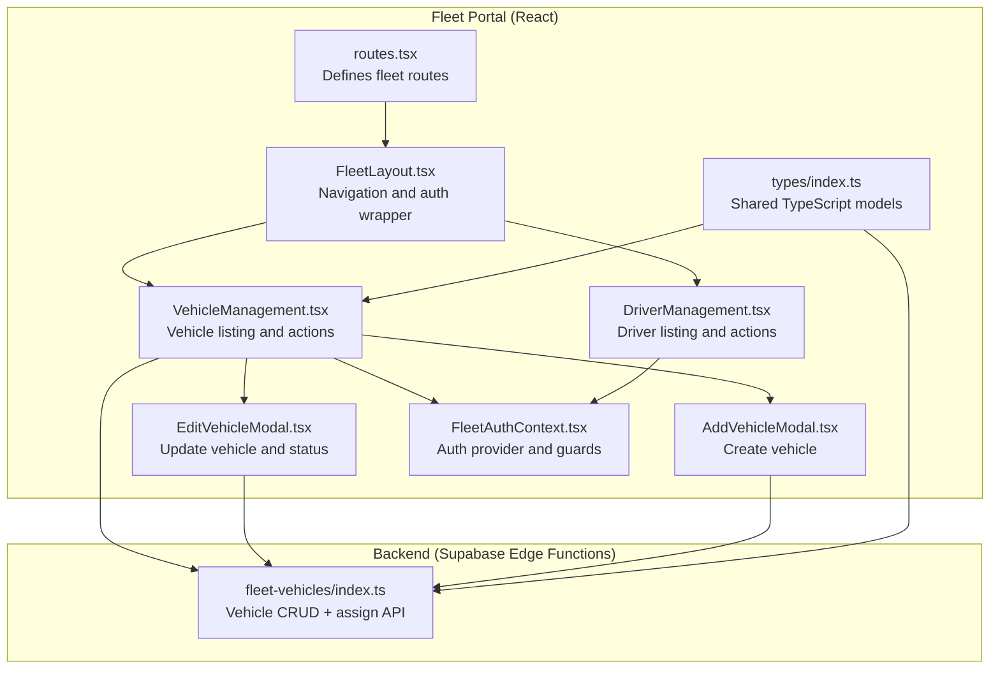
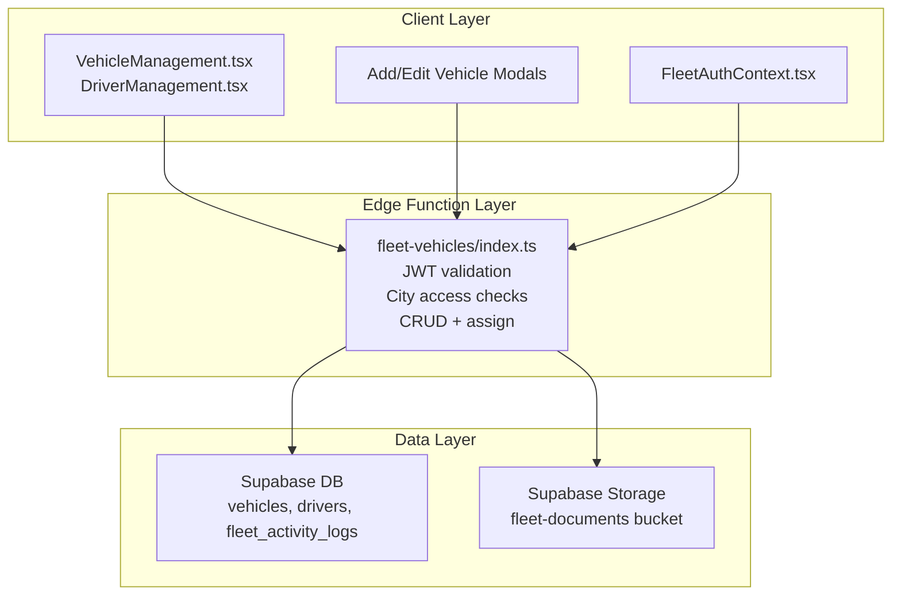
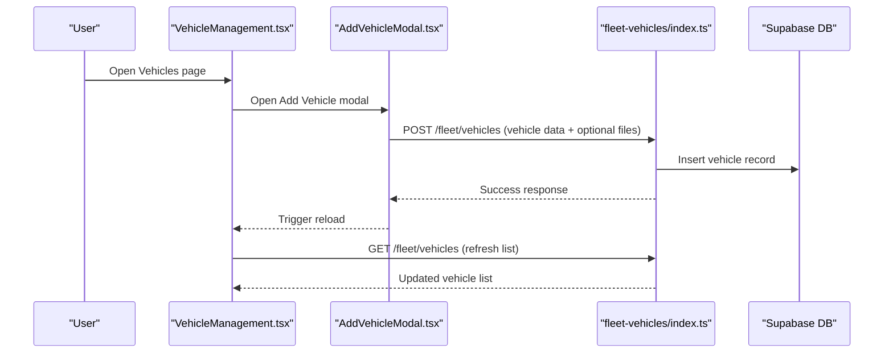
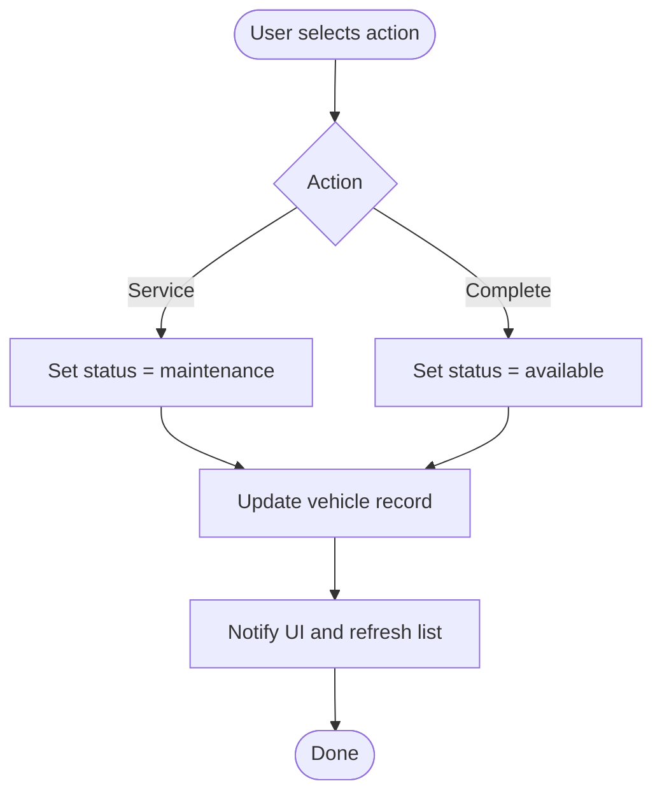
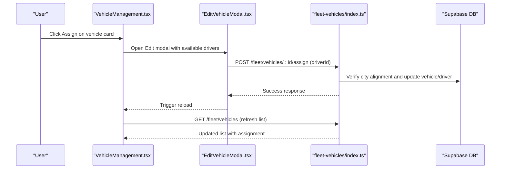
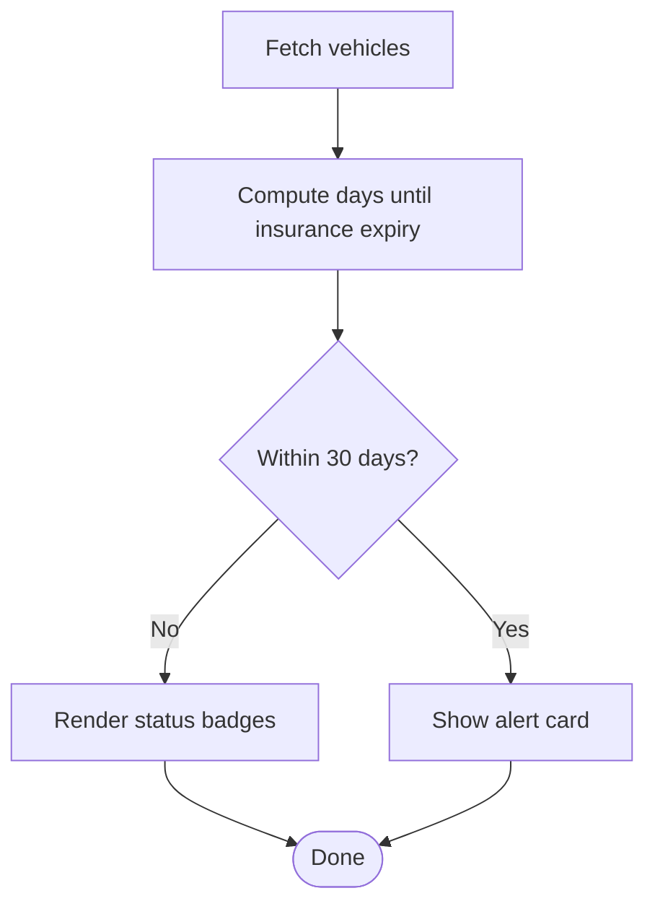
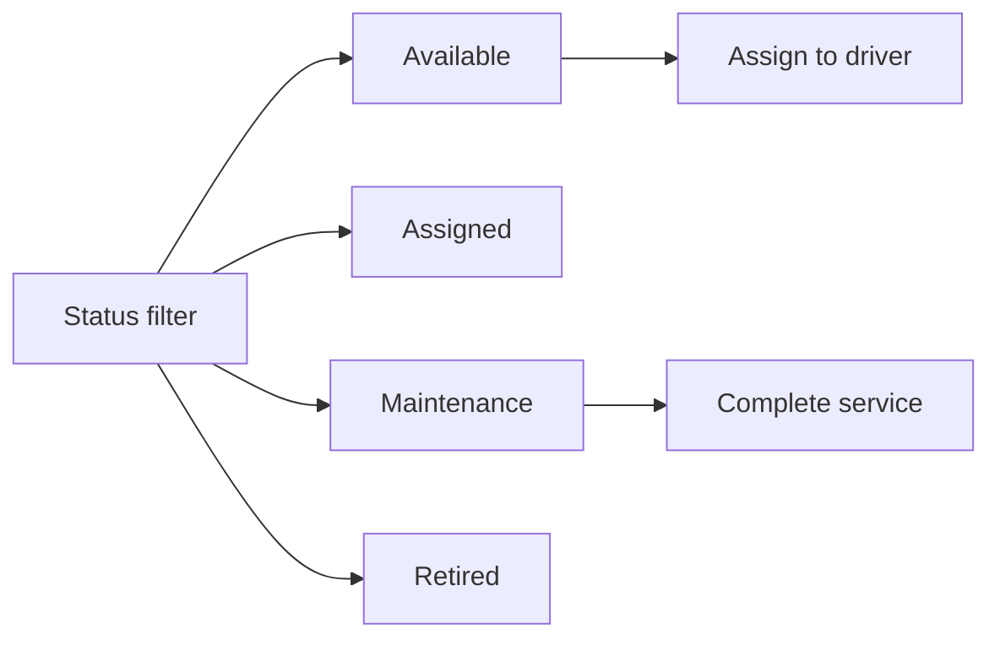
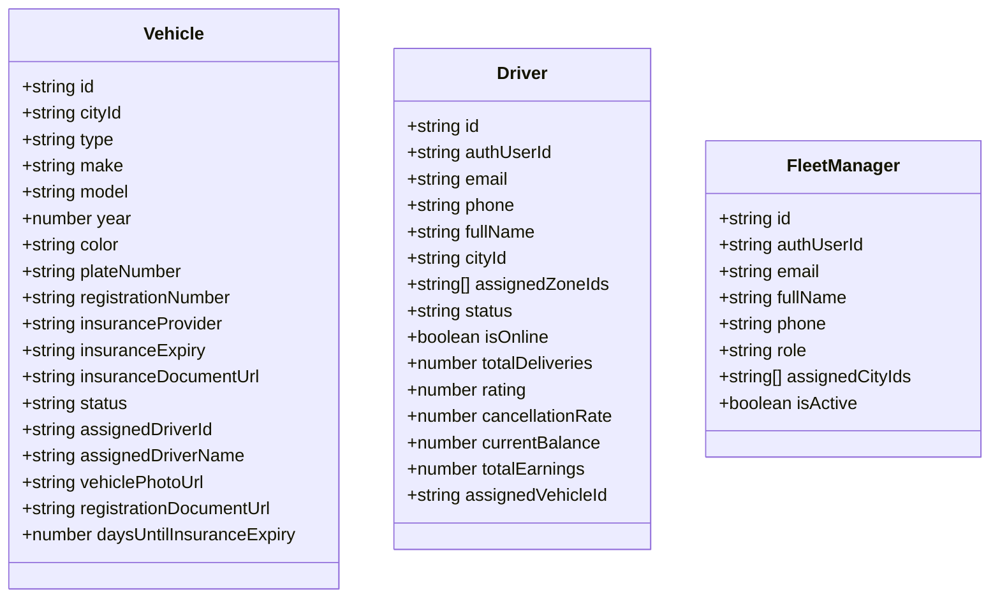
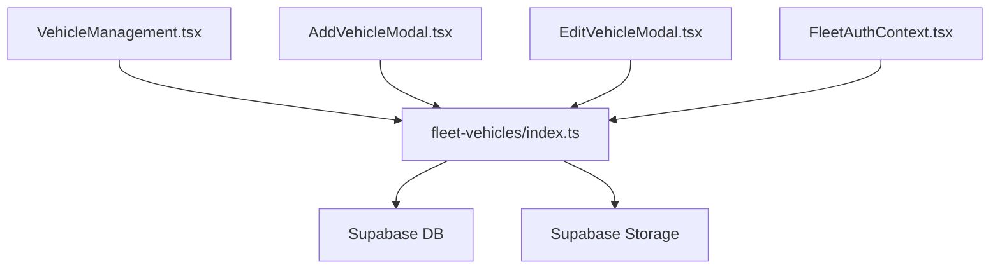

# Vehicle Management

<cite>
**Referenced Files in This Document**
- [index.ts](file://src/fleet/index.ts)
- [routes.tsx](file://src/fleet/routes.tsx)
- [FleetLayout.tsx](file://src/fleet/components/FleetLayout.tsx)
- [VehicleManagement.tsx](file://src/fleet/pages/VehicleManagement.tsx)
- [AddVehicleModal.tsx](file://src/fleet/components/vehicles/AddVehicleModal.tsx)
- [EditVehicleModal.tsx](file://src/fleet/components/vehicles/EditVehicleModal.tsx)
- [DriverManagement.tsx](file://src/fleet/pages/DriverManagement.tsx)
- [FleetAuthContext.tsx](file://src/fleet/context/FleetAuthContext.tsx)
- [index.ts](file://src/fleet/types/index.ts)
- [index.ts](file://supabase/functions/fleet-vehicles/index.ts)
- [fleet-management-portal-design.md](file://docs/fleet-management-portal-design.md)
</cite>

## Table of Contents
1. [Introduction](#introduction)
2. [Project Structure](#project-structure)
3. [Core Components](#core-components)
4. [Architecture Overview](#architecture-overview)
5. [Detailed Component Analysis](#detailed-component-analysis)
6. [Dependency Analysis](#dependency-analysis)
7. [Performance Considerations](#performance-considerations)
8. [Troubleshooting Guide](#troubleshooting-guide)
9. [Conclusion](#conclusion)

## Introduction
This document describes the fleet vehicle management system, focusing on vehicle registration, asset tracking, maintenance scheduling integration, driver assignment workflows, capacity management, compliance monitoring, and related operational features. It synthesizes frontend UI components, backend Supabase edge functions, and supporting design documentation to present a complete picture of how vehicles are registered, tracked, maintained, and assigned to drivers while ensuring regulatory compliance and operational visibility.

## Project Structure
The fleet module is organized around a React-based web portal with route-driven pages, shared UI components, typed models, and Supabase edge functions for vehicle management operations. The routing layer mounts the fleet layout and protected routes, while pages implement specific views such as vehicle management, driver management, live tracking, route optimization, and payout management.

**Diagram sources**
- [routes.tsx:20-41](file://src/fleet/routes.tsx#L20-L41)
- [FleetLayout.tsx:94-155](file://src/fleet/components/FleetLayout.tsx#L94-L155)
- [VehicleManagement.tsx:26-434](file://src/fleet/pages/VehicleManagement.tsx#L26-L434)
- [DriverManagement.tsx:20-204](file://src/fleet/pages/DriverManagement.tsx#L20-L204)
- [AddVehicleModal.tsx:19-282](file://src/fleet/components/vehicles/AddVehicleModal.tsx#L19-L282)
- [EditVehicleModal.tsx:20-398](file://src/fleet/components/vehicles/EditVehicleModal.tsx#L20-L398)
- [FleetAuthContext.tsx:24-145](file://src/fleet/context/FleetAuthContext.tsx#L24-L145)
- [index.ts:70-89](file://src/fleet/types/index.ts#L70-L89)
- [index.ts:56-671](file://supabase/functions/fleet-vehicles/index.ts#L56-L671)

**Section sources**
- [routes.tsx:1-42](file://src/fleet/routes.tsx#L1-L42)
- [FleetLayout.tsx:18-92](file://src/fleet/components/FleetLayout.tsx#L18-L92)
- [VehicleManagement.tsx:26-135](file://src/fleet/pages/VehicleManagement.tsx#L26-L135)
- [DriverManagement.tsx:20-36](file://src/fleet/pages/DriverManagement.tsx#L20-L36)
- [AddVehicleModal.tsx:19-113](file://src/fleet/components/vehicles/AddVehicleModal.tsx#L19-L113)
- [EditVehicleModal.tsx:20-147](file://src/fleet/components/vehicles/EditVehicleModal.tsx#L20-L147)
- [FleetAuthContext.tsx:24-73](file://src/fleet/context/FleetAuthContext.tsx#L24-L73)
- [index.ts:70-89](file://src/fleet/types/index.ts#L70-L89)
- [index.ts:56-671](file://supabase/functions/fleet-vehicles/index.ts#L56-L671)

## Core Components
- Fleet routing and layout: Defines protected routes, navigation, and authentication wrapping for the fleet portal.
- Vehicle management page: Lists vehicles, applies filters, displays status badges, and exposes actions to edit, assign, or service vehicles.
- Vehicle modals: AddVehicleModal for creating new vehicles and EditVehicleModal for updating attributes, status, and driver assignments.
- Driver management page: Lists drivers with status badges, search, and pagination.
- Authentication context: Provides login/logout, token refresh, and city access checks.
- Shared types: Defines Vehicle, Driver, FleetManager, and related enums and filters used across components and backend functions.

Key capabilities:
- Vehicle registration: Creation via modal with optional uploads for photos and documents.
- Asset tracking: Listing with status filtering and insurance expiry indicators.
- Maintenance scheduling integration: Status transitions to maintenance and completion actions.
- Driver assignment workflows: Assign/unassign vehicles to drivers with city-based access control.
- Compliance monitoring: Insurance expiry tracking and alerts.
- Capacity management: Status-based availability for assignment decisions.
- Operational visibility: Live tracking and route optimization pages in the routing scheme.

**Section sources**
- [routes.tsx:20-41](file://src/fleet/routes.tsx#L20-L41)
- [FleetLayout.tsx:94-155](file://src/fleet/components/FleetLayout.tsx#L94-L155)
- [VehicleManagement.tsx:26-434](file://src/fleet/pages/VehicleManagement.tsx#L26-L434)
- [AddVehicleModal.tsx:19-282](file://src/fleet/components/vehicles/AddVehicleModal.tsx#L19-L282)
- [EditVehicleModal.tsx:20-398](file://src/fleet/components/vehicles/EditVehicleModal.tsx#L20-L398)
- [DriverManagement.tsx:20-204](file://src/fleet/pages/DriverManagement.tsx#L20-L204)
- [FleetAuthContext.tsx:24-145](file://src/fleet/context/FleetAuthContext.tsx#L24-L145)
- [index.ts:70-89](file://src/fleet/types/index.ts#L70-L89)

## Architecture Overview
The fleet portal integrates a React SPA with Supabase edge functions. The frontend handles UI and user interactions, while the backend edge function enforces authorization, validates inputs, performs city-scoped access checks, and manipulates the vehicles and drivers tables. Activity logs are recorded for auditability.

**Diagram sources**
- [VehicleManagement.tsx:26-434](file://src/fleet/pages/VehicleManagement.tsx#L26-L434)
- [AddVehicleModal.tsx:19-282](file://src/fleet/components/vehicles/AddVehicleModal.tsx#L19-L282)
- [EditVehicleModal.tsx:20-398](file://src/fleet/components/vehicles/EditVehicleModal.tsx#L20-L398)
- [FleetAuthContext.tsx:24-145](file://src/fleet/context/FleetAuthContext.tsx#L24-L145)
- [index.ts:56-671](file://supabase/functions/fleet-vehicles/index.ts#L56-L671)

**Section sources**
- [fleet-management-portal-design.md:9-82](file://docs/fleet-management-portal-design.md#L9-L82)
- [index.ts:56-671](file://supabase/functions/fleet-vehicles/index.ts#L56-L671)

## Detailed Component Analysis

### Vehicle Registration and Asset Tracking
- Registration process:
  - AddVehicleModal collects vehicle metadata and optional uploads for photo and registration document.
  - Submits to the backend edge function which validates required fields, ensures unique plate number, and inserts a new vehicle record with initial status.
- Asset tracking:
  - VehicleManagement lists vehicles with status badges, driver assignment indicators, and insurance expiry dates.
  - Filtering by status and search by plate number improves discoverability.
  - Insurance expiry warnings highlight upcoming or expired policies.

**Diagram sources**
- [VehicleManagement.tsx:40-94](file://src/fleet/pages/VehicleManagement.tsx#L40-L94)
- [AddVehicleModal.tsx:33-113](file://src/fleet/components/vehicles/AddVehicleModal.tsx#L33-L113)
- [index.ts:143-258](file://supabase/functions/fleet-vehicles/index.ts#L143-L258)

**Section sources**
- [VehicleManagement.tsx:37-94](file://src/fleet/pages/VehicleManagement.tsx#L37-L94)
- [AddVehicleModal.tsx:19-113](file://src/fleet/components/vehicles/AddVehicleModal.tsx#L19-L113)
- [index.ts:143-258](file://supabase/functions/fleet-vehicles/index.ts#L143-L258)

### Maintenance Scheduling Integration
- Status transitions:
  - From the vehicle card, users can mark a vehicle as “Service” to move it to maintenance or “Complete” to return it to available after servicing.
- Backend enforcement:
  - The edge function validates status values and updates records atomically.
- Integration points:
  - Maintenance reminders can be triggered by insurance expiry logic and status filters on the frontend.

**Diagram sources**
- [VehicleManagement.tsx:185-208](file://src/fleet/pages/VehicleManagement.tsx#L185-L208)
- [index.ts:332-490](file://supabase/functions/fleet-vehicles/index.ts#L332-L490)

**Section sources**
- [VehicleManagement.tsx:185-208](file://src/fleet/pages/VehicleManagement.tsx#L185-L208)
- [index.ts:332-490](file://supabase/functions/fleet-vehicles/index.ts#L332-L490)

### Driver Assignment Workflows
- Assignment flow:
  - From the vehicle card, select “Assign” to open the edit modal.
  - Choose a driver from the dropdown; the system verifies city alignment and updates both vehicle and driver records.
- Unassignment and reassignment:
  - When reassigning, previous driver/vehicle links are cleared before establishing new ones.
- Access control:
  - City access checks ensure only authorized managers can operate on vehicles/drivers within their assigned cities.

**Diagram sources**
- [VehicleManagement.tsx:357-386](file://src/fleet/pages/VehicleManagement.tsx#L357-L386)
- [EditVehicleModal.tsx:114-129](file://src/fleet/components/vehicles/EditVehicleModal.tsx#L114-L129)
- [index.ts:492-614](file://supabase/functions/fleet-vehicles/index.ts#L492-L614)

**Section sources**
- [VehicleManagement.tsx:357-386](file://src/fleet/pages/VehicleManagement.tsx#L357-L386)
- [EditVehicleModal.tsx:114-129](file://src/fleet/components/vehicles/EditVehicleModal.tsx#L114-L129)
- [index.ts:492-614](file://supabase/functions/fleet-vehicles/index.ts#L492-L614)

### Compliance Monitoring and Insurance Verification
- Insurance expiry tracking:
  - The vehicle listing computes days until expiry and highlights expiring/expired statuses.
  - A prominent alert card surfaces vehicles with insurance expiring within 30 days.
- Verification features:
  - Documents (vehicle photo, registration, insurance) are stored in Supabase storage and linked to vehicles.
  - The edit modal allows replacing documents and updating insurance expiry dates.

**Diagram sources**
- [VehicleManagement.tsx:74-84](file://src/fleet/pages/VehicleManagement.tsx#L74-L84)
- [VehicleManagement.tsx:322-344](file://src/fleet/pages/VehicleManagement.tsx#L322-L344)
- [AddVehicleModal.tsx:41-71](file://src/fleet/components/vehicles/AddVehicleModal.tsx#L41-L71)
- [EditVehicleModal.tsx:58-92](file://src/fleet/components/vehicles/EditVehicleModal.tsx#L58-L92)

**Section sources**
- [VehicleManagement.tsx:74-84](file://src/fleet/pages/VehicleManagement.tsx#L74-L84)
- [VehicleManagement.tsx:322-344](file://src/fleet/pages/VehicleManagement.tsx#L322-L344)
- [AddVehicleModal.tsx:41-71](file://src/fleet/components/vehicles/AddVehicleModal.tsx#L41-L71)
- [EditVehicleModal.tsx:58-92](file://src/fleet/components/vehicles/EditVehicleModal.tsx#L58-L92)

### Capacity Management and Operational Views
- Capacity management:
  - Status-based filtering (“Available”, “Assigned”, “Maintenance”, “Retired”) enables capacity planning and assignment decisions.
- Operational views:
  - Live tracking and route optimization pages are defined in routing; their integration with tracking and optimization systems is documented in the design guide.

**Diagram sources**
- [VehicleManagement.tsx:137-141](file://src/fleet/pages/VehicleManagement.tsx#L137-L141)
- [routes.tsx:33-38](file://src/fleet/routes.tsx#L33-L38)

**Section sources**
- [VehicleManagement.tsx:137-141](file://src/fleet/pages/VehicleManagement.tsx#L137-L141)
- [routes.tsx:33-38](file://src/fleet/routes.tsx#L33-L38)

### Data Models and Types
The shared types define the core entities and enums used across the frontend and backend.

**Diagram sources**
- [index.ts:70-89](file://src/fleet/types/index.ts#L70-L89)
- [index.ts:29-53](file://src/fleet/types/index.ts#L29-L53)
- [index.ts:17-27](file://src/fleet/types/index.ts#L17-L27)

**Section sources**
- [index.ts:70-89](file://src/fleet/types/index.ts#L70-L89)
- [index.ts:29-53](file://src/fleet/types/index.ts#L29-L53)
- [index.ts:17-27](file://src/fleet/types/index.ts#L17-L27)

## Dependency Analysis
- Frontend-to-backend dependencies:
  - VehicleManagement and modals depend on Supabase client for queries and storage.
  - The edge function depends on Supabase client and JWT verification for authorization.
- Authorization and access control:
  - FleetAuthContext manages tokens and enforces city access checks.
  - The edge function validates JWT type and enforces city scoping.
- Cohesion and coupling:
  - VehicleManagement encapsulates UI logic and data fetching; modals isolate creation/update flows.
  - Edge function centralizes business rules for vehicle operations and driver assignments.

**Diagram sources**
- [VehicleManagement.tsx:26-434](file://src/fleet/pages/VehicleManagement.tsx#L26-L434)
- [AddVehicleModal.tsx:19-282](file://src/fleet/components/vehicles/AddVehicleModal.tsx#L19-L282)
- [EditVehicleModal.tsx:20-398](file://src/fleet/components/vehicles/EditVehicleModal.tsx#L20-L398)
- [FleetAuthContext.tsx:24-145](file://src/fleet/context/FleetAuthContext.tsx#L24-L145)
- [index.ts:56-671](file://supabase/functions/fleet-vehicles/index.ts#L56-L671)

**Section sources**
- [VehicleManagement.tsx:26-434](file://src/fleet/pages/VehicleManagement.tsx#L26-L434)
- [AddVehicleModal.tsx:19-282](file://src/fleet/components/vehicles/AddVehicleModal.tsx#L19-L282)
- [EditVehicleModal.tsx:20-398](file://src/fleet/components/vehicles/EditVehicleModal.tsx#L20-L398)
- [FleetAuthContext.tsx:24-145](file://src/fleet/context/FleetAuthContext.tsx#L24-L145)
- [index.ts:56-671](file://supabase/functions/fleet-vehicles/index.ts#L56-L671)

## Performance Considerations
- Frontend:
  - Use of memoization and controlled re-renders (e.g., cityIds) reduces unnecessary computations.
  - Skeleton loaders improve perceived performance during data fetches.
- Backend:
  - Edge function implements basic JWT validation and city-scoped queries; consider adding Redis-based rate limiting for production-scale traffic.
  - Queries use selective field retrieval and ordering to minimize payload sizes.

[No sources needed since this section provides general guidance]

## Troubleshooting Guide
- Authentication failures:
  - Ensure tokens are persisted and refreshed; the auth provider automatically clears invalid data and redirects to login.
- Authorization errors:
  - City access checks prevent operations outside assigned areas; verify manager’s assigned cities.
- Vehicle creation conflicts:
  - Duplicate plate numbers are rejected; resolve duplicates before retrying.
- Driver-city mismatch:
  - Assignments require the driver and vehicle to be in the same city; verify city IDs before assigning.
- Document uploads:
  - Storage bucket permissions and file types must match expectations; verify URLs after upload.

**Section sources**
- [FleetAuthContext.tsx:32-52](file://src/fleet/context/FleetAuthContext.tsx#L32-L52)
- [FleetAuthContext.tsx:54-73](file://src/fleet/context/FleetAuthContext.tsx#L54-L73)
- [index.ts:176-182](file://supabase/functions/fleet-vehicles/index.ts#L176-L182)
- [index.ts:519-525](file://supabase/functions/fleet-vehicles/index.ts#L519-L525)
- [AddVehicleModal.tsx:41-71](file://src/fleet/components/vehicles/AddVehicleModal.tsx#L41-L71)

## Conclusion
The fleet vehicle management system combines a React-based UI with Supabase edge functions to deliver robust vehicle registration, asset tracking, maintenance scheduling, driver assignment, and compliance monitoring. The design emphasizes clear separation of concerns, strong authorization controls, and operational visibility through status management and document handling. Extending features such as route optimization and cost allocation would integrate seamlessly with the existing routing and payout pages, building on the established patterns for data fetching, authorization, and UI composition.